# Buffer Cooking Architecture Specification

## 0. Status Tracking

This document is the authoritative architecture reference for standalone buffer
import, cooking, packaging, and runtime loading in Oxygen.

Current implementation status snapshot:

1. Implemented: `BufferContainerImportJob`, `BufferPipeline`, `BufferImportSubmitter`,
   `BuildBufferContainerRequest`, and `AsyncImportService` routing for
   `buffer_container` payload presence.
2. Implemented: JSON-descriptor-driven batch import path (`type:
   "buffer-container"`) with schema validation at both request-build time and
   per-entry validation in `BufferImportSubmitter`.
3. Implemented: `BufferPipeline` compute-only async pipeline (optional SHA-256
   content hashing only; no format conversion, no compression).
4. Implemented: `BufferImportSubmitter` — reusable submitter shared between
   standalone buffer-container imports and geometry/scene pipeline imports of
   embedded buffer data.
5. Implemented: `BufferDescriptorSidecar` — per-buffer `.obuf` sidecar files
   carrying `BufferResourceDesc` + named `BufferDescriptorView[]`.
6. Implemented: Loose-cooked emission (`Buffers/<name>.obuf` sidecar, `buffers.table`,
   `buffers.data`) via `BufferEmitter` and `ResourceDescriptorEmitter`.
7. Implemented: Runtime `LoadBufferResource` reads `BufferResourceDesc` from
   stream and loads raw byte payload from `buffers.data`.
8. Verification caveat: by execution policy, no local project build was run
   during this documentation pass.

## 1. Scope

This specification defines the authoritative architecture for importing,
cooking, packaging, and runtime loading of buffer assets in Oxygen when a
specific container format (geometry, FBX, glTF) is absent.

In scope:

1. Standalone buffer import via `type: "buffer-container"` manifest — raw
   binary blobs packaged as GPU buffer resources without a containing scene or
   geometry format.
2. One buffer-container descriptor (`*.json`) → N named buffer resources,
   each emitted as a separate `.obuf` sidecar entry in the loose cooked layout.
3. Named sub-range views (`BufferDescriptorView`) within each buffer.
4. Loose-cooked emission: `.obuf` sidecars, `buffers.table`, `buffers.data`.
5. `BufferResourceDesc` binary format (32 bytes, `PakFormat_core.h`).
6. Runtime loading via `LoadBufferResource` and `BufferResource`.
7. `BufferImportSubmitter` reuse by geometry/scene imports for embedded buffer
   data.

Out of scope:

1. Buffer imports that occur as a side effect of geometry/scene imports — those
   reuse `BufferImportSubmitter` but are orchestrated by the scene pipeline.
2. Typed format decoding (vertex/index attribute unpacking) — the buffer
   pipeline is data-passthrough only.
3. Mesh cooking, LOD generation, or any geometric processing.
4. GPU resource management or upload scheduling (deferred to the renderer).

## 2. Hard Constraints

1. Buffer import implementation MUST use the `ImportJob → Pipeline`
   architecture. No bypass or ad-hoc inline runner.
2. All standalone buffer imports go through the `type: "buffer-container"`
   manifest path. There is no standalone CLI `buffer` command.
3. The only job class for standalone buffer-container imports is
   `BufferContainerImportJob`.
4. The only pipeline class for buffer cooking is `BufferPipeline`.
5. The only submitter for buffer chunk submission is `BufferImportSubmitter`.
   Both `BufferContainerImportJob` and the geometry import pipeline MUST use
   this submitter.
6. `BufferPipeline` MUST NOT perform I/O and MUST NOT assign resource indices.
   Its only CPU work is optional content hashing.
7. Content hashing uses the first 8 bytes of SHA-256 over the raw buffer bytes
   and MUST NOT be computed when `with_content_hashing` is false.
8. `BufferResourceDesc` binary layout MUST NOT be modified without updating
   `static_assert(sizeof(BufferResourceDesc) == 32)`.
9. Virtual paths in the descriptor MUST end in `.obuf` and MUST be canonical
   (no `..`, no `//`, starts with `/`).
10. `virtual_path` values MUST be globally unique within a container. Duplicate
    virtual paths are rejected as `buffer.container.virtual_path_duplicate`.
11. The implicit view `__all__` (entire buffer range) MUST NOT be declared
    explicitly in the `views[]` array. It is always synthesized from
    `BufferResourceDesc::size_bytes`.
12. A view MUST use either byte-based (`byte_offset` + `byte_length`) or
    element-based (`element_offset` + `element_count`) addressing — mixing is
    rejected by the schema.
13. Runtime content code MUST NOT depend on demo/example code.

## 3. Repository Analysis Snapshot (Pre-Documentation Baseline)

The following facts were confirmed during the documentation pass:

| Fact | Evidence |
| --- | --- |
| Buffer import is descriptor-only (no CLI command) | No `BufferCommand.cpp` in `ImportTool`; routing is discriminant-based, not format-based |
| Route discriminant is payload presence | `src/Oxygen/Cooker/Import/AsyncImportService.cpp` (`const bool is_buffer_container_request = request.buffer_container.has_value()`) |
| Payload field is top-level on `ImportRequest` | `src/Oxygen/Cooker/Import/ImportRequest.h` (`std::optional<BufferContainerPayload> buffer_container`) — same top-level payload pattern as material/geometry descriptors |
| Manifest job type exists | `src/Oxygen/Cooker/Import/ImportManifest.cpp` (`if (job_type == "buffer-container")`) |
| Schema is embedded | `src/Oxygen/Cooker/Import/Internal/ImportManifest_schema.h` (`kBufferContainerSchema`) |
| Per-entry validation (not job-level re-validation) | `BufferImportSubmitter.cpp` (`ValidateBufferChunkSchema` per entry; job only re-parses JSON, no schema re-validate) |
| Binary format lives in core, not render | `src/Oxygen/Data/PakFormat_core.h` (`BufferResourceDesc`, `static_assert(sizeof(...))==32)`) |
| Loose cooked layout for buffers | `src/Oxygen/Cooker/Loose/LooseCookedLayout.h` (`kBufferDescriptorExtension = ".obuf"`, `BufferDescriptorRelPath()`, `BufferVirtualPath()`, `buffers_table_file_name`, `buffers_data_file_name`) |
| Sidecar binary format defined | `src/Oxygen/Cooker/Import/Internal/Utils/BufferDescriptorSidecar.h` (`SerializeBufferDescriptorSidecar`, `ParsedBufferDescriptorSidecar`) |
| Runtime loader exists | `src/Oxygen/Content/Loaders/BufferLoader.h` (`LoadBufferResource`) |
| `BufferImportSubmitter` is reusable | `src/Oxygen/Cooker/Import/Internal/Jobs/BufferImportSubmitter.h` (not a member of `BufferContainerImportJob`; used standalone and by scene imports) |
| Pipeline does only content hashing | `src/Oxygen/Cooker/Import/Internal/Pipelines/BufferPipeline.h` (comment: "does not perform any I/O and does not assign resource indices") |
| JSON schema shipped | `src/Oxygen/Cooker/Import/Schemas/oxygen.buffer-container.schema.json` |

## 4. Decision

Buffers are **resource-kind assets** (not first-class scene assets). They are
referenced by index from geometry, materials, or compute dispatches via
`BufferResourceDesc`.

One import entry point exists for standalone buffer imports:

1. **Buffer-container descriptor import** (`type: "buffer-container"` manifest)
   — a JSON document that declares one or more raw binary buffer resources.
   This is the only path for standalone buffer imports.

The buffer-container approach differs from textures and materials in a key way:
a **single descriptor → N resources**. One container JSON encodes an arbitrary
number of named buffers, each assigned its own `ResourceIndexT` in the global
`buffers.table`.

`BufferImportSubmitter` provides reusable submission logic shared between
standalone buffer-container imports and embedded buffer imports from scene
import pipelines (geometry/FBX/glTF). Both paths deposit their buffer data
through the same `BufferEmitter` → `buffers.table` / `buffers.data` output.

The buffer pipeline (`BufferPipeline`) is intentionally minimal: it does
nothing except optional SHA-256 content hashing. All format knowledge (element
format, stride, usage flags) is carried as opaque metadata from the descriptor
JSON into the `BufferResourceDesc` binary — the pipeline is purely a
data-passthrough with an optional hash step.

## 5. Target Architecture

```mermaid
flowchart LR
  subgraph Authoring
    A["*.json\n(buffer-container descriptor)"]
    B["binary blob files\n(vertex data, index data, etc.)"]
  end

  subgraph Ingress
    C[BufferContainerImportSettings]
    D["BuildBufferContainerRequest()"]
    E["ImportRequest\nbuffer_container payload"]
  end

  subgraph Manifest
    F["ImportManifest\ntype: buffer-container"]
  end

  subgraph Service
    G["AsyncImportService\nis_buffer_container_request"]
    H[BufferContainerImportJob]
  end

  subgraph Submitter
    I[BufferImportSubmitter\nSubmitBufferChunks]
    J["Per-entry file reads\n(IAsyncFileReader)"]
    K[BufferPipeline\noptional SHA-256 hash]
    L[BufferImportSubmitter\nCollectAndEmit]
  end

  subgraph Output
    M["BufferEmitter\nbuffers.table + buffers.data"]
    N["ResourceDescriptorEmitter\n.obuf sidecar files"]
  end

  subgraph Runtime
    O[LoadBufferResource]
    P[BufferResource]
  end

  A --> C --> D --> E
  F --> G
  B --> J
  E --> G --> H --> I
  I --> J --> K --> L --> M
  L --> N
  M -->|buffers.table + buffers.data| O --> P
```



Architectural split:

1. The import path owns per-entry validation, source file reading, view spec
   normalization, and descriptor production. `BufferImportSubmitter` is the
   reusable core for these operations.
2. `BufferPipeline` is a minimal async compute unit; it offloads content
   hashing to a thread pool and returns `WorkResult` objects.
3. `BufferEmitter` handles deduplication (same content hash → same
   `ResourceIndexT`) and writes `buffers.table` / `buffers.data`.
4. `ResourceDescriptorEmitter` writes the per-buffer `.obuf` sidecar containing
   the `BufferResourceDesc` + `BufferDescriptorView[]`.
5. Runtime loading reads `BufferResourceDesc` from the `.obuf` sidecar, then
   reads the raw payload bytes from `buffers.data` at `data_offset`.

## 6. Class Design

### 6.1 Import / Cooker Classes

**Tooling-Facing Settings (DTO):**

1. `oxygen::content::import::BufferContainerImportSettings`
   - file: `src/Oxygen/Cooker/Import/BufferContainerImportSettings.h`
   - role: tooling-facing DTO for one buffer-container import job request.
     Contains `descriptor_path` (path to the container JSON), `cooked_root`
     (absolute output root), `job_name` (optional override), and
     `with_content_hashing`.
   - note: Never passed to the pipeline directly; consumed only by
     `BuildBufferContainerRequest`.

**Request Builder:**

2. `oxygen::content::import::internal::BuildBufferContainerRequest(...)`
   - files:
     - `src/Oxygen/Cooker/Import/BufferContainerImportRequestBuilder.h`
     - `src/Oxygen/Cooker/Import/Internal/BufferContainerImportRequestBuilder.cpp`
   - role: validate + normalize `BufferContainerImportSettings` into an
     `ImportRequest`. Loads the container JSON file, schema-validates it against
     `kBufferContainerSchema`, resolves `job_name`, resolves `with_content_hashing`,
     and stores `descriptor_doc->dump()` in
     `request.buffer_container.normalized_descriptor_json`.
   - note: The presence of `request.buffer_container` is the route discriminant
     that bypasses all format detection in `AsyncImportService`. This field is a
      **top-level optional on `ImportRequest`** (not nested inside `ImportOptions`,
      same pattern used by descriptor payloads like `request.material_descriptor`).

**Job:**

3. `oxygen::content::import::detail::BufferContainerImportJob`
   - files:
     - `src/Oxygen/Cooker/Import/Internal/Jobs/BufferContainerImportJob.h`
     - `src/Oxygen/Cooker/Import/Internal/Jobs/BufferContainerImportJob.cpp`
   - role: async coroutine job that re-parses the embedded descriptor JSON,
     creates a `BufferPipeline`, delegates chunk submission and collection to
     `BufferImportSubmitter`, and finalizes the session.
   - stages: `ValidatePayload` → `ParseDescriptor` → `CreatePipeline` →
     `SubmitChunks` → `CollectAndEmit` → `FinalizeSession`.
   - note: The job re-parses the JSON for structure (not schema re-validate);
     full per-entry schema validation occurs inside `BufferImportSubmitter::SubmitBufferChunks`.

**Submitter (Reusable):**

4. `oxygen::content::import::detail::BufferImportSubmitter`
   - files:
     - `src/Oxygen/Cooker/Import/Internal/Jobs/BufferImportSubmitter.h`
     - `src/Oxygen/Cooker/Import/Internal/Jobs/BufferImportSubmitter.cpp`
   - role: two-phase reusable helper for buffer chunk processing. Not a job;
     used compositionally by `BufferContainerImportJob` and by geometry/scene
     import pipelines that emit embedded buffer data.
   - `SubmitBufferChunks(buffer_chunks_json, descriptor_dir, pipeline)`:
     1. `ParseBufferEntries` — per-entry schema validation, path resolution,
        virtual path uniqueness check, virtual path → rel-path mapping.
     2. Per valid entry: async file read via `IAsyncFileReader`.
     3. Source size cap check (≤ 4 GiB = `uint32_t::max`).
     4. `NormalizeBufferViews` — validates and resolves `BufferDescriptorViewSpec[]`
        against `BufferResourceDesc::size_bytes`.
     5. Submits `BufferPipeline::WorkItem` per entry.
     - Returns: `Submission { submitted_count, descriptor_relpath_by_source_id,
       descriptor_views_by_source_id }`.
   - `CollectAndEmit(pipeline, submission)`:
     1. Per submitted item: `pipeline.Collect()` → `WorkResult`.
     2. Calls `session.BufferEmitter().Emit(cooked, source_id)` →
        `emitted_index` (`ResourceIndexT`).
     3. Looks up `BufferResourceDesc` from `BufferEmitter::TryGetDescriptor`.
     4. Detects deduplication virtual path conflicts.
     5. Calls `session.ResourceDescriptorEmitter().EmitBufferAtRelPath(relpath,
        emitted_index, descriptor, views)` → writes `.obuf` sidecar.

**Pipeline:**

5. `oxygen::content::import::BufferPipeline`
   - files:
     - `src/Oxygen/Cooker/Import/Internal/Pipelines/BufferPipeline.h`
     - `src/Oxygen/Cooker/Import/Internal/Pipelines/BufferPipeline.cpp`
   - role: bounded-channel producer/consumer async pipeline. Accepts
     `WorkItem` objects, optionally offloads SHA-256 content hashing to a
     `co::ThreadPool`, and returns `WorkResult` objects.
   - processing per work item:
     1. If `Config::with_content_hashing` and `cooked.content_hash == 0`:
        offload `SHA-256(cooked.data)` to thread pool and store result as first
        8 bytes in `cooked.content_hash`.
     2. No other processing; payload bytes are passed through unchanged.
   - config: default `queue_capacity=64`, `worker_count=2` (from
     `ImportConcurrency::buffer`).
   - note: `BufferPipeline` is intentionally compute-minimal. It does NOT
     parse, validate, decompress, convert, or transform buffer data.

**Buffer View Types:**

6. `oxygen::content::import::internal::BufferDescriptorViewSpec`
   - file: `src/Oxygen/Cooker/Import/Internal/Utils/BufferDescriptorSidecar.h`
   - role: optionally-addressed view specification parsed from JSON. Fields
     `byte_offset`, `byte_length`, `element_offset`, `element_count` may all
     be `std::nullopt` before normalization.

7. `oxygen::content::import::internal::BufferDescriptorView`
   - file: `src/Oxygen/Cooker/Import/Internal/Utils/BufferDescriptorSidecar.h`
   - role: resolved view with all address fields populated. Produced by
     `NormalizeBufferViews`. Written into the `.obuf` sidecar.

8. `oxygen::content::import::internal::ParsedBufferDescriptorSidecar`
   - file: `src/Oxygen/Cooker/Import/Internal/Utils/BufferDescriptorSidecar.h`
   - role: result of reading back a `.obuf` sidecar at runtime or import time.
     Contains `resource_index`, `BufferResourceDesc`, and `vector<BufferDescriptorView>`.

**Cooked Payload:**

9. `oxygen::content::import::CookedBufferPayload`
   - file: `src/Oxygen/Cooker/Import/BufferImportTypes.h`
   - role: in-flight payload between `BufferImportSubmitter` and `BufferPipeline`.
     Carries raw `data` bytes, `alignment`, `usage_flags`, `element_stride`,
     `element_format`, and optionally pre-computed or pipeline-computed
     `content_hash`.

### 6.2 Runtime Classes

1. `oxygen::content::loaders::LoadBufferResource`
   - file: `src/Oxygen/Content/Loaders/BufferLoader.h`

2. `oxygen::data::BufferResource`
   - file: `src/Oxygen/Data/BufferResource.h`

### 6.3 Routing

`AsyncImportService` routes based on `ImportRequest::buffer_container`:

```text
request.buffer_container.has_value() == true → BufferContainerImportJob
(all other routing: format-based detection is skipped for buffer requests)
```

Unlike textures (which use `ImportFormat` enum values), buffer-container
requests skip format detection entirely. The discriminant is a **top-level
optional field** on `ImportRequest` (not nested inside `ImportOptions`),
matching the material/geometry descriptor route-discriminant pattern.

---

## 7. API Contracts

### 7.1 Manifest Contract (`ImportManifest`)

Buffer resources are only importable via a manifest. There is no standalone
ImportTool CLI command for buffers.

Schema target files:

1. `src/Oxygen/Cooker/Import/ImportManifest.h`
2. `src/Oxygen/Cooker/Import/ImportManifest.cpp`
3. `src/Oxygen/Cooker/Import/Schemas/oxygen.import-manifest.schema.json`

#### 7.1.1 Buffer Container Job (`type: "buffer-container"`)

```json
{
  "id": "mesh.vertex_buffers",
  "type": "buffer-container",
  "source": "mesh_buffers.json",
  "name": "mesh_buffers",
  "depends_on": []
}
```

Valid top-level keys for `type: "buffer-container"`:
`id`, `type`, `source`, `name`, `content_hashing`, `depends_on`.

The `source` field must point to a file conforming to
`oxygen.buffer-container.schema.json` (Section 7.2).

#### 7.1.2 Dependency Scheduling Contract

1. `ImportManifest` builds a DAG from `id` + `depends_on` across all jobs.
2. Required validation before dispatch:
   - `id` must be unique across all jobs in the manifest.
   - all `depends_on` entries must reference valid `id` values.
   - no cycles in the dependency graph.
3. Buffer-container jobs may declare `depends_on` to express ordering relative
   to other jobs (e.g., a material job must not run until the buffer it depends
   on is emitted). In practice, standalone buffer imports typically have no
   dependencies.
4. Failed predecessor jobs cause all transitive dependents to be skipped.
5. The execution node per job is `BufferContainerImportJob → BufferPipeline`.

#### 7.1.3 Manifest Defaults

```json
{
  "version": 1,
  "defaults": {
    "buffer_container": {
      "output": "<absolute-cooked-root>",
      "name":   "<optional-name-override>",
      "content_hashing": true
    }
  },
  "jobs": [...]
}
```

Manifest defaults for `buffer_container` support:
`output` (cooked root), `name` (job name override), `content_hashing`.

#### 7.1.4 Concurrency Configuration

`ImportConcurrency::buffer` controls pipeline parallelism:

```json
{
  "concurrency": {
    "buffer": {
      "workers": 2,
      "queue_capacity": 64
    }
  }
}
```

Default: `workers=2`, `queue_capacity=64`.

### 7.2 Buffer Container Source JSON

Schema: `src/Oxygen/Cooker/Import/Schemas/oxygen.buffer-container.schema.json`

JSON Schema draft-07, `additionalProperties: false` at all levels.

**One container JSON → N named buffer resources.**

#### 7.2.1 Top-Level Field Contract

| Field | Required | Type | Description |
| --- | --- | --- | --- |
| `$schema` | No | `string` | Points to shipped JSON Schema for editor integration |
| `name` | No | identifier | Human-readable container name |
| `content_hashing` | No | `bool` | Override global content hashing toggle |
| `buffers` | **Yes** | array (≥1) | Array of buffer descriptor entries (Section 7.2.2) |

Canonical example:

```json
{
  "$schema": "./src/Oxygen/Cooker/Import/Schemas/oxygen.buffer-container.schema.json",
  "name": "woodfloor007_mesh_buffers",
  "buffers": [
    {
      "source": "woodfloor007_vertices.bin",
      "virtual_path": "/.cooked/Resources/Buffers/woodfloor007_vertices.obuf",
      "usage_flags": 1,
      "element_stride": 32,
      "alignment": 16,
      "views": [
        {
          "name": "positions",
          "byte_offset": 0,
          "byte_length": 4096
        },
        {
          "name": "uvs",
          "byte_offset": 4096,
          "byte_length": 2048
        }
      ]
    },
    {
      "source": "woodfloor007_indices.bin",
      "virtual_path": "/.cooked/Resources/Buffers/woodfloor007_indices.obuf",
      "usage_flags": 2,
      "element_format": 5,
      "alignment": 4
    }
  ]
}
```

#### 7.2.2 `buffer_descriptor` Entry Fields

| Field | Required | Type | Description |
| --- | --- | --- | --- |
| `source` | **Yes** | `string` | Path to binary source file (absolute or relative to descriptor) |
| `virtual_path` | **Yes** | canonical `.obuf` path | Unique virtual path for this buffer (must end in `.obuf`; canonical format) |
| `usage_flags` | No | `uint` ≥0 | Buffer usage hints bitfield (Section 7.2.3) |
| `element_stride` | No | `uint` ≥0 | Stride of each element in bytes; 0 when `element_format` is set |
| `element_format` | No | `uint8` [0,255] | Format enum value (0 = raw/structured; nonzero = typed) |
| `alignment` | No | `uint` ≥1 | Required GPU upload alignment; default 16 |
| `content_hash` | No | `uint64` | Pre-computed content hash; if 0 and hashing enabled, pipeline computes it |
| `views` | No | array (≥1) | Named sub-range views (Section 7.2.4) |

Schema mutual-exclusion rules:

1. `element_format > 0` and `element_stride > 0` are mutually exclusive.
2. If `element_stride == 0`, then `element_format` must be ≥ 1.
3. `virtual_path` must match pattern `^/(?!.*//)(?!.*\\\\)(?!.*(?:^|/)\\.{1,2}(?:/|$)).+\\.obuf$`.

#### 7.2.3 `usage_flags` Values

| Bit | Value | Role |
| --- | --- | --- |
| 0 | `0x01` | Vertex buffer — vertex input source |
| 1 | `0x02` | Index buffer — index input source |
| 2 | `0x04` | Constant buffer — shader constants/uniforms |
| 3 | `0x08` | Storage buffer — read/write in shaders |
| 4 | `0x10` | Indirect buffer — indirect draw/dispatch arguments |
| 5 | `0x20` | CPU Writable — CPU can write to buffer |
| 6 | `0x40` | CPU Readable — CPU can read from buffer |
| 7 | `0x80` | Dynamic — frequently updated |
| 8 | `0x100` | Static — rarely updated |
| 9 | `0x200` | Immutable — never updated after creation |

Flags 7, 8, and 9 (update frequency) are mutually exclusive; if none are set,
the engine defaults to Static. Role flags (bits 0–4) and CPU access flags
(bits 5–6) may be combined freely.

#### 7.2.4 `views` — Named Sub-Range Views

```json
"views": [
  {
    "name": "positions",
    "byte_offset": 0,
    "byte_length": 4096
  },
  {
    "name": "uvs",
    "element_offset": 256,
    "element_count": 512
  }
]
```

| Field | Required | Type | Description |
| --- | --- | --- | --- |
| `name` | **Yes** | identifier (≤63 chars) | View name for lookup at runtime or by external tools |
| `byte_offset` | Byte-addressing | `uint` ≥0 | Start offset in bytes |
| `byte_length` | Byte-addressing | `uint` ≥1 | Length in bytes |
| `element_offset` | Element-addressing | `uint` ≥0 | Start offset in elements |
| `element_count` | Element-addressing | `uint` ≥1 | Number of elements |

Addressing mode rules:

1. Either `byte_offset` + `byte_length` OR `element_offset` + `element_count`
   must be used — never both on the same view.
2. `name` must be unique within the `views[]` array.
3. The name `__all__` is *reserved* — it MUST NOT appear in the descriptor;
   it is automatically synthesized as the implicit full-buffer view.

`NormalizeBufferViews` converts element-based views to byte ranges using
`element_stride` (or format-derived element size) and validates that all
ranges fall within `[0, descriptor.size_bytes)`.

---

## 8. Pipeline Stage (Internal)

`BufferPipeline` has a single processing step per work item:

| Step | Action |
| --- | --- |
| Content hash | If `Config::with_content_hashing` is enabled and `cooked.content_hash == 0`: offload `SHA-256(cooked.data)` to thread pool; store first 8 bytes in `cooked.content_hash` |

Unlike texture and material pipelines, buffer processing has no format
conversion, compression, mip generation, or field-level encoding steps.
All format semantics (`element_format`, `element_stride`, `usage_flags`) are
opaque metadata that flow from the descriptor JSON directly into
`BufferResourceDesc` without any pipeline transformation.

All coroutines cooperatively check `work_item.stop_token` to support
cancellation.

---

## 9. Binary Format

### 9.1 `BufferResourceDesc` (32 bytes, `PakFormat_core.h`)

Unlike texture and material descriptors (which live in `PakFormat_render.h`),
the buffer descriptor is a **core** type used by all asset kinds that embed GPU
buffers (geometry, compute, etc.).

```cpp
#pragma pack(push, 1)
struct BufferResourceDesc {
  OffsetT       data_offset    = 0;  // uint64_t — absolute offset into buffers.data
  DataBlobSizeT size_bytes     = 0;  // uint32_t — raw byte count (≤ 4 GiB)
  uint32_t      usage_flags    = 0;  // bitfield (see Section 7.2.3)
  uint32_t      element_stride = 0;  // bytes-per-element (1 = raw; 0 when element_format set)
  uint8_t       element_format = 0;  // Format enum (0 = raw or structured)
  uint64_t      content_hash   = 0;  // first 8 bytes of SHA-256 of buffer data
  uint8_t       reserved[3]    = {}; // must be zero
};
#pragma pack(pop)
static_assert(sizeof(BufferResourceDesc) == 32);
```

Buffer types:

| `element_format` | `element_stride` | Interpretation |
| --- | --- | --- |
| `0` | `1` | Raw byte buffer |
| `0` | `>1` | Structured buffer (stride = element size) |
| `>0` | `0` | Typed buffer (format-defined element size) |

### 9.2 `.obuf` Sidecar File Layout

Each buffer resource is described by a sidecar binary file (`<name>.obuf`).
The sidecar is produced by `SerializeBufferDescriptorSidecar` and consumed by
`ParseBufferDescriptorSidecar`.

```text
[ResourceIndexT]              — resource index in buffers.table (4 bytes)
[BufferResourceDesc]          — 32 bytes (packed)
[uint32_t view_count]         — number of named views stored
[BufferDescriptorView × N]    — each view: name(64B) + byte_offset(8B) + byte_length(8B)
                                           + element_offset(8B) + element_count(8B)
```

The implicit `__all__` view (entire buffer) is always the first entry in the
view array when serialized.

### 9.3 Payload Layout (inside `buffers.data`)

Each buffer's payload is written sequentially by `BufferEmitter`. The
`BufferResourceDesc::data_offset` field stores the absolute byte offset of
each buffer's start in `buffers.data`.

There is no structured padding between buffers beyond the `alignment` value
recorded in `CookedBufferPayload::alignment`; actual placement is determined
by `BufferEmitter`.

### 9.4 Loose Cooked Layout

```text
<cooked_root>/
  Buffers/
    <buffer_name>.obuf   ← BufferResourceDesc + ResourceIndexT + named views
  buffers.table          ← Sequential BufferResourceDesc[N] (32 bytes each)
  buffers.data           ← Concatenated raw buffer byte payloads
```

Key layout constants:

| Constant | Value | Role |
| --- | --- | --- |
| `kBufferDescriptorExtension` | `".obuf"` | File extension for buffer sidecars |
| `buffer_descriptors_subdir` | `"Buffers"` | Subfolder under cooked root |
| `buffers_table_file_name` | `"buffers.table"` | Resource table filename |
| `buffers_data_file_name` | `"buffers.data"` | Raw payload filename |

Virtual path for runtime mounting:
`BufferVirtualPath(name)` = `<virtual_mount_root>/Buffers/<name>.obuf`

Relative path for file emission:
`BufferDescriptorRelPath(name)` = `Buffers/<name>.obuf`

---

## 10. Error Taxonomy

Buffer import errors are surfaced as diagnostics in `ImportReport` and as
log messages written to `error_stream`. Error codes follow the pattern
`buffer.<category>.<key>`:

| Category | Code Pattern | Key Causes |
| --- | --- | --- |
| Schema | `buffer.container.schema_validation_failed` | Container or entry JSON fields violate schema |
| Schema | `buffer.container.schema_validator_failure` | JSON Schema validator internal failure |
| I/O | `buffer.container.source_read_failed` | Binary source file could not be read |
| Routing | `buffer.container.request_invalid` | `request.buffer_container` absent in job |
| Routing | `buffer.container.request_invalid_json` | Embedded normalized JSON cannot be parsed |
| Validation | `buffer.container.buffers_missing` | `buffers[]` array absent or not an array |
| Validation | `buffer.container.no_buffers` | All entries failed validation; no valid entries remain |
| Validation | `buffer.container.no_submissions` | No work items were submitted to pipeline |
| Validation | `buffer.container.virtual_path_duplicate` | Two entries share the same `virtual_path` |
| Validation | `buffer.container.virtual_path_unmounted` | `virtual_path` does not start under `virtual_mount_root` |
| Validation | `buffer.container.source_too_large` | Source file exceeds 4 GiB (`uint32_t::max` bytes) |
| Views | `buffer.container.view_*` | View addressing errors from `NormalizeBufferViews` |
| Reader | `buffer.container.reader_unavailable` | `IAsyncFileReader` not injected |
| Emit | `buffer.container.descriptor_missing` | `BufferEmitter::TryGetDescriptor` returned empty |
| Emit | `buffer.container.sidecar_emit_failed` | Exception during `.obuf` sidecar write |
| Emit | `buffer.container.dedup_virtual_path_conflict` | Two different virtual paths hash-deduplicated to same `ResourceIndexT` |
| Internal | `buffer.container.internal_lookup_failed` | Submission map lookup failed during collection |
| Cancellation | `buffer.cancelled` | `stop_token` signalled during job execution |
| Predecessor | `buffer.import.skipped_predecessor_failed` | A `depends_on` job failed |

---

## 11. Runtime Bootstrap

Buffer resources are load-on-demand assets. There is no buffer enumeration
at startup.

Runtime load sequence:

1. `AssetLoader` receives a buffer resource request (index or virtual path).
2. `LoadBufferResource(context)` opens the `.obuf` sidecar from the mounted
   `Buffers/` directory.
3. `BufferResourceDesc` is read with `reader.ScopedAlignment(1)` (packed,
   no padding).
4. Raw bytes are read from `buffers.data` at `desc.data_offset` for
   `desc.size_bytes` bytes.
5. `std::make_unique<data::BufferResource>(desc, data_buffer)` is returned.

Key contracts:

1. `element_format > 0` and `element_stride > 0` MUST NOT both be set in the
   same descriptor; the runtime interprets them as mutually exclusive.
2. `content_hash` is used for deduplication during incremental imports without
   re-reading the data file.
3. `BufferResource` does not own a GPU handle. Buffer upload and GPU resource
   creation are the renderer's responsibility.
4. Named views stored in the `.obuf` sidecar are available to tools and
   geometry systems; the runtime `LoadBufferResource` loader does not parse
   view data — it reads only `BufferResourceDesc`.
5. Source file size is capped at `DataBlobSizeT::max` (4 GiB = `uint32_t::max`
   bytes). Files exceeding this limit are rejected during import with
   `buffer.container.source_too_large`.

---

## 12. Relationship to Geometry / Scene Imports

`BufferImportSubmitter` is designed for reuse. When a scene (FBX/glTF) or
geometry import pipeline processes embedded mesh data it needs to emit vertex
and index buffers, it calls `BufferImportSubmitter` with the same call
signature used by `BufferContainerImportJob`:

```text
GeometryPipeline / ScenePipeline
   └── BufferImportSubmitter::SubmitBufferChunks(chunks, dir, pipeline)
   └── BufferImportSubmitter::CollectAndEmit(pipeline, submission)
```

The resulting `buffers.table` / `buffers.data` / `.obuf` sidecar files are
identical whether the source was a standalone buffer-container descriptor or
a geometry mesh embedded in an FBX/glTF scene. Geometry consumers reference
buffer resources by `ResourceIndexT` stored in the geometry descriptor.

Standalone buffer-container imports therefore provide a mechanism for
pre-cooking raw binary GPU data independently of any geometry format, enabling:

- Custom vertex buffer layouts not representable in FBX/glTF.
- Pre-computed index buffers, constant buffers, or dispatch argument buffers.
- Tool-generated compute shader inputs.
