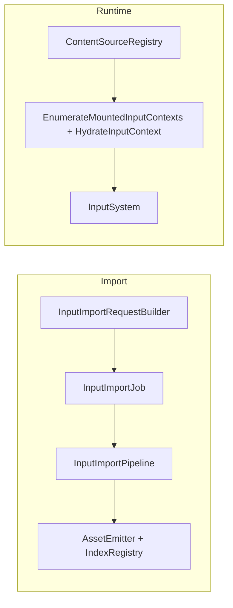

# Input Cooking Architecture Specification (Job/Pipeline Locked)

## 0. Status Tracking

This document is the target architecture contract. Live implementation progress and explicit missing work are tracked in `design/cook_input_impl.md` (Section 4.1 and Section 11).

Current implementation status snapshot:

1. Implemented: input request contracts, `InputImportJob`, `InputImportPipeline`, async routing, manifest `type: "input"` integration, and ImportTool input command wiring.
2. Implemented: runtime `EnumerateMountedInputContexts()` + `HydrateInputContext()` APIs, including trigger hydration, slot alias normalization, and mounted-context metadata extraction.
3. Implemented: scene-binding infrastructure removal in PakGen/tooling/runtime (`INPT` and `input_context_bindings` paths removed) and shipped input JSON schemas (`src/Oxygen/Cooker/Import/Schemas/oxygen.input*.schema.json`) with schema validation tests.
4. Verification caveat: by execution policy, no local project build was run during this implementation pass.

## 1. Scope

This specification defines the authoritative architecture for importing, cooking, packaging, and runtime bootstrap of input assets in Oxygen.

In scope:

1. `InputAction` and `InputMappingContext` import/cook integration.
2. Loose-cooked descriptor emission (`.oiact`, `.oimap`).
3. PAK/runtime compatibility validation using existing tooling (read-only reference, no PakGen/PakDump code changes).
4. Runtime bootstrap for default context activation.
5. Full removal of scene-attached input-context binding infrastructure (`InputContextBindingRecord`, `InputContextBindingFlags`, `kInputContextBinding` component type, scene `INPT` component table handling, and all associated code paths).

Out of scope:

1. New trigger semantics.
2. New modifier framework.
3. Any alternate import execution architecture.

## 2. Hard Constraints

1. Import implementation must use `ImportJob -> Pipeline` architecture.
2. No bypass path or ad-hoc inline runner.
3. No scope reduction without explicit approval.
4. New binary serialization/deserialization logic must use `oxygen::serio` (no raw byte arithmetic for new logic).
5. Runtime content code must not depend on demo/example code.
6. Input import execution must use one job class only: `InputImportJob`.
7. Input import execution must use one pipeline class only: `InputImportPipeline`.
8. Mapping-context imports must carry explicit dependencies to the input actions they require.

## 3. Repository Analysis Snapshot (Pre-Implementation Baseline)

The following facts were captured before implementation started and are retained as baseline context:

| Fact | Evidence |
| --- | --- |
| Loose layout already supports input descriptors | `src/Oxygen/Cooker/Loose/LooseCookedLayout.h` (`kInputActionDescriptorExtension`, `kInputMappingContextDescriptorExtension`, input virtual path/subdir methods) |
| Runtime loaders for input assets already exist | `src/Oxygen/Content/Loaders/InputActionLoader.h`, `src/Oxygen/Content/Loaders/InputMappingContextLoader.h` |
| Scene loading currently parses input context binding component table | `src/Oxygen/Content/Loaders/SceneLoader.h` (`kInputContextBinding` branch) |
| Scene asset dependency publication currently uses scene input bindings | `src/Oxygen/Content/AssetLoader.cpp` (`publish_scene_input_mapping_context_dependencies`) |
| Demo currently hydrates contexts from scene bindings | `Examples/DemoShell/Services/SceneLoaderService.cpp` (`AttachInputMappings`) |
| PakGen currently accepts and packs `scene.input_context_bindings` | `src/Oxygen/Cooker/Tools/PakGen/src/pakgen/spec/validator.py`, `.../packing/packers.py` |
| Import stack currently has script/script-sidecar dual path, no input path | `src/Oxygen/Cooker/Import/AsyncImportService.cpp`, `ImportManifest.cpp`, `BatchCommand.cpp`, `ImportRunner.cpp` |
| Input import job/pipeline/request-builder classes do not exist | no matches for `InputImportJob`, `InputImportPipeline`, `InputImportKind`, `BuildInputImportRequest` under `src/Oxygen/Cooker/Import` |

Conclusion:

1. Input asset format and runtime loading are present.
2. Import/cooker integration is missing.
3. Scene-attached association is currently authoritative and must be removed.

## 4. Decision

Input mapping contexts are standalone assets. Scene component `INPT` is not authoritative for runtime behavior.

Default behavior for simple scenarios moves to mapping-context descriptor metadata:

1. `auto-load`
2. `auto-activate`
3. `default-priority`

## 5. Target Architecture



Architectural split:

1. Import path owns descriptor production and indexing.
2. Runtime bootstrap owns default context activation policy.
3. Scene loading no longer owns input association policy.
4. Both input asset kinds flow through the same job/pipeline classes.

## 6. Class Design

## 6.1 New Classes

### Import/Cooker

1. `oxygen::content::import::InputImportSettings`
   - file: `src/Oxygen/Cooker/Import/InputImportSettings.h`
   - role: tooling-facing DTO for one input import job request (orchestration-only fields).

2. `oxygen::content::import::internal::BuildInputImportRequest(...)`
   - files:
     - `src/Oxygen/Cooker/Import/InputImportRequestBuilder.h`
     - `src/Oxygen/Cooker/Import/Internal/InputImportRequestBuilder.cpp`
   - role: validate + normalize input job settings into `ImportRequest`.

3. `oxygen::content::import::detail::InputImportJob`
   - files:
     - `src/Oxygen/Cooker/Import/Internal/Jobs/InputImportJob.h`
     - `src/Oxygen/Cooker/Import/Internal/Jobs/InputImportJob.cpp`
   - role: request/session lifecycle, source loading, pipeline orchestration, finalize.

4. `oxygen::content::import::InputImportPipeline`
   - files:
     - `src/Oxygen/Cooker/Import/Internal/Pipelines/InputImportPipeline.h`
     - `src/Oxygen/Cooker/Import/Internal/Pipelines/InputImportPipeline.cpp`
   - role: parse/validate/serialize/emit for `InputAction` and `InputMappingContext`.

### Runtime

1. `oxygen::content::HydrateInputContext(...)`
   - files:
     - `src/Oxygen/Content/InputContextHydration.h`
     - `src/Oxygen/Content/Internal/InputContextHydration.cpp`
   - role: free function — converts a binary `InputMappingContextAsset` into a live `InputMappingContext` by resolving action references, building trigger chains, and registering with `InputSystem`.

2. `IAssetLoader::EnumerateMountedInputContexts()`
   - file: `src/Oxygen/Content/IAssetLoader.h` (declaration), `src/Oxygen/Content/AssetLoader.cpp` (implementation)
   - role: scan mounted sources for `kInputMappingContext` assets and return metadata entries. Mirrors existing `EnumerateMountedScenes()`.

## 6.2 Changed Classes

1. `ImportRequest`
   - add top-level `InputPayload` marker (orchestration-only; presence signals input import routing).
   - `InputImportKind` is NOT added to `ImportOptions` or `ImportRequest`. Document structure (standalone action vs. primary format) is determined solely inside `InputImportPipeline` from the source JSON structure.
   - file: `src/Oxygen/Cooker/Import/ImportRequest.h`.

2. `AsyncImportService`
   - route input requests to `InputImportJob`.
   - file: `src/Oxygen/Cooker/Import/AsyncImportService.cpp`.

3. `ImportManifest`
   - support `type: "input"` only.
   - files: `src/Oxygen/Cooker/Import/ImportManifest.h/.cpp`.
   - input jobs include explicit dependency edges (`id`, `depends_on`).

4. ImportTool command surface
   - add `InputCommand` and wire in `main.cpp`, `BatchCommand.cpp`, `ImportRunner.cpp`, README.

5. `SceneLoaderService`
   - remove `AttachInputMappings(const SceneAsset&)` entirely.
   - remove all scene-driven context activation code.

6. `SceneLoader`
   - remove scene `INPT` component table handling entirely (no compatibility parsing).

7. `PakFormat_input.h`
   - remove `InputContextBindingRecord` struct.
   - remove `InputContextBindingFlags` enum.

8. `SceneAsset.h`
   - remove `ComponentTraits<InputContextBindingRecord>` specialization.

9. `ComponentType.inc` / `PakFormat.inc`
   - remove `kInputContextBinding` component type.

10. `ToStringConverters.cpp`
    - remove `to_string(InputContextBindingFlags)` and `kInputContextBinding` case.

11. `PakFormatSerioLoaders.h`
    - remove `InputContextBindingRecord` serio loader.

12. `PakDump/SceneAssetDumper.h`
    - remove `kInputContextBinding` dump branch.

13. `AssetLoader.cpp`
    - remove `publish_scene_input_mapping_context_dependencies` and all call sites.

14. `PakGen packers.py` / `validator.py`
    - remove `input_context_bindings` packing and validation.
    - remove `pack_input_context_binding_record`.

15. `PakGen test_v6_input_assets.py`
    - remove or update tests that reference `input_context_bindings`.

16. PakGen/PakDump
    - remove scene input-context binding infrastructure from PakGen (`input_context_bindings` packing/validation, `pack_input_context_binding_record`).
    - remove `kInputContextBinding` dump branch from PakDump `SceneAssetDumper`.
    - read-only reference for all other existing binary contracts.
    - no other PakGen/PakDump implementation changes in this plan.

17. `IAssetLoader`
    - add `EnumerateMountedInputContexts()` returning `std::vector<MountedInputContextEntry>`.
    - mirrors existing `EnumerateMountedScenes()` pattern.
    - file: `src/Oxygen/Content/IAssetLoader.h`.

18. `InputMappingContextAsset`
    - add `GetDefaultPriority()` accessor.
    - file: `src/Oxygen/Data/InputMappingContextAsset.h`.

## 7. API Contracts

## 7.1 Import Request Payload

Add to `ImportRequest`:

```cpp
struct InputPayload final {
  // Orchestration-only. Presence signals input import routing.
  // No asset-kind field: the pipeline determines document structure from source JSON.
};
```

`ImportRequest` gains:

```cpp
std::optional<InputPayload> input;
```

Routing contract:

1. `AsyncImportService` routes requests with `request.input` present to `InputImportJob`.
2. No `InputImportKind` enum exists. Document structure is determined inside `InputImportPipeline` only.
3. `ImportManifestJob::BuildRequest()` sets `request.input` when `job_type == "input"`.

## 7.2 Input Command (CLI Only)

Command surface:

1. `input <source>`

CLI-only optional flags (NOT valid in manifest job objects):

1. `--output` (cooked root override)
2. `--name` (human-readable job name)
3. `--report` (report destination path)
4. `--content-hashing` (content hashing toggle)

These flags are consumed by the `InputCommand` CLI handler to build an `ImportRequest`. They do NOT appear in manifest `jobs[]` entries. Manifest input jobs use exactly: `id`, `type`, `source`, `depends_on`.

## 7.3 Manifest Contract (`ImportManifest`, Not PakGen Spec)

This section defines manifest-mode import for input assets in ImportTool batch mode.

Schema target files:

1. `src/Oxygen/Cooker/Import/ImportManifest.h`
2. `src/Oxygen/Cooker/Import/ImportManifest.cpp`
3. `src/Oxygen/Cooker/Import/Schemas/oxygen.import-manifest.schema.json`
4. Generated at build time:
   `out/<build>/generated/Oxygen/Cooker/Import/Internal/ImportManifest_schema.h`

Schema deltas:

1. `defaults` adds:
   - `input`
2. `job_settings.type` enum adds:
   - `"input"`
3. `job_settings` adds dependency metadata:
   - `id: string` (job identity, unique in manifest)
   - `depends_on: string[]` (job ids)
4. `job_settings` for `input` includes only orchestration fields:
   - `source`
   - `id`
   - `depends_on`
5. `job_item` conditional rules add:
   - if `type == "input"`: require `source`
   - jobs whose source document references actions not declared inline must declare `depends_on` for predecessor jobs that produce those actions
   - asset-semantic fields are invalid in manifest jobs:
     - `type` (action type — `bool`/`axis1d`/`axis2d`; do not confuse with job `type: "input"`)
     - `consumes_input`
     - `auto_load`
     - `auto_activate`
     - `priority`
     - `mappings`
     - `triggers`
     - `trigger`
     - `slot`
     - `actions`
     - `contexts`

`jobs[]` contract (single shape):

```json
{
  "id": "job.unique.id",
  "type": "input",
  "source": "Content/Input/PlayerInput.input.json"
}
```

Dependency example (file B references actions exported by file A):

```json
[
  {
    "id": "core.actions",
    "type": "input",
    "source": "Content/Input/CoreActions.input.json"
  },
  {
    "id": "vehicle.contexts",
    "type": "input",
    "depends_on": ["core.actions"],
    "source": "Content/Input/Vehicle.input.json"
  }
]
```

Both primary (`*.input.json`) and standalone action (`*.input-action.json`) files produce action assets. Unresolved action references are caught at pipeline parse time.

Validation invariants:

1. `source` must be present for `type: "input"`.
2. manifest jobs must not include input asset semantic fields (Section 7.3 delta #5 list).
3. manifest jobs must not include orchestration-only CLI keys: `output`, `name`, `verbose`, `content_hashing`, `report`.
4. allowed `input` job keys are exactly: `id`, `type`, `source`, `depends_on`. Any other key is rejected with diagnostic `input.manifest.key_not_allowed`.
5. `id` must be unique across all jobs in the manifest.
6. every `depends_on` id must exist in the same manifest.
7. no dependency cycles are allowed.
8. (reserved — removed; both primary-format and standalone-action files produce action assets, so kind-level wrong-type checks are invalid. Unresolved action references are caught at pipeline parse time via `input.context.action_unresolved`.)
9. `id` is required for all `input` jobs (diagnostic: `input.manifest.job_id_missing`).

Request mapping:

1. `type=input` -> routed to `InputImportJob`.
2. source JSON document structure is parsed only inside `InputImportPipeline`:
   - primary format (has `contexts` key) → emits N actions + M contexts.
   - standalone action (has `name` + `type` at top level, no `contexts`) → emits 1 action.
3. no asset kind or asset properties are stored in manifest job settings.
4. output location and global toggles come from top-level/default orchestration config, not per-input job fields.

Cross-tool scope clarification:

1. `ImportManifest` drives ImportTool/import pipeline only.
2. PakGen uses its own content spec schema and is read-only for this effort.
3. Both paths must serialize identical `InputMappingContextAssetDesc` semantics.

### 7.3.1 Dependency Scheduling Contract

Batch execution is dependency-aware:

1. ImportTool builds a DAG from `id` + `depends_on`.
2. Validation checks before dispatch:
   - unique `id` values across all jobs (diagnostic: `input.manifest.job_id_duplicate`).
   - every `depends_on` target exists in the manifest (diagnostic: `input.manifest.dep_missing_target`).
   - no cycles in the dependency graph (diagnostic: `input.manifest.dep_cycle`).
3. Jobs are dispatched only when all predecessors have succeeded.
4. If a predecessor job fails, all transitive dependents are skipped with deterministic diagnostics (failure propagation). Skipped jobs report `input.import.skipped_predecessor_failed`.
5. The execution node for each input job remains `InputImportJob -> InputImportPipeline`.

## 7.4 Input Source JSON Specification (Importer Input Files)

This section defines the JSON document shapes consumed by:

1. `input <source>`

These are importer source documents, not ImportManifest job documents.

### 7.4.0 Authoring Model

The input system uses two kinds of cooked assets internally (`InputActionAssetDesc`, `InputMappingContextAssetDesc`), but the authoring model is designed around a **single source file** that declares everything together.

**One `*.input.json` file defines all actions and all mapping contexts.**

A source JSON contains:

1. A shared `actions` array that declares every action used by any context in the file.
2. A `contexts` array that declares one or more mapping contexts, each with its own `mappings`.

One file = all actions + all contexts. No separate files needed.

```text
Content/Input/
  PlayerInput.input.json    ← defines all actions (Move, Look, Jump, Sprint) + all contexts (Gameplay, Menu)
```

The pipeline reads one source file and emits **multiple cooked assets**: one `InputActionAssetDesc` per declared action + one `InputMappingContextAssetDesc` per declared context.

**Action identity deduplication:** When multiple source files declare the same action (same `name` and `type`), the importer produces the same deterministic asset key (derived from the action name). The second import validates consistency and skips re-emission if the descriptor matches. If the same action name appears with conflicting `type` across files, the importer emits diagnostic `input.asset.action_conflict` and fails.

**Standalone action files are also supported** for advanced use cases where an action must exist without any mapping context (`*.input-action.json`). But for typical authoring, everything lives in one file.

Key authoring rules:

1. **Actions are declared in the top-level `actions` array** and shared by all contexts in the file.
2. **Mappings reference actions by name** using a plain string `"action": "Move"` field.
3. **All binding/trigger/hardware configuration lives in `mappings`**, never in the action declaration.
4. **One source file = one import job.** A single manifest job produces all action assets + all context assets.
5. **Dependencies between jobs** are only needed when a file references an action that is NOT declared in its own `actions` array (i.e., it relies on an action from a different source file).

Manifest example (typical — single self-contained file):

```json
{
  "jobs": [
    { "id": "input.all", "type": "input", "source": "Content/Input/PlayerInput.input.json" }
  ]
}
```

Manifest example (split files — vehicle references actions from main input file):

```json
{
  "jobs": [
    { "id": "input.main",    "type": "input", "source": "Content/Input/PlayerInput.input.json" },
    { "id": "input.vehicle",  "type": "input", "source": "Content/Input/Vehicle.input.json", "depends_on": ["input.main"] }
  ]
}
```

### 7.4.1 File Extension Convention

Source files use specific extensions for automatic schema association:

1. `*.input.json` — primary format (actions + contexts). Associated with `oxygen.input.schema.json`.
2. `*.input-action.json` — standalone action (rare). Associated with `oxygen.input-action.schema.json`.

Editor workspace settings (VSCode example):

```json
{
  "json.schemas": [
    { "fileMatch": ["*.input.json"],        "url": "./src/Oxygen/Cooker/Import/Schemas/oxygen.input.schema.json" },
    { "fileMatch": ["*.input-action.json"], "url": "./src/Oxygen/Cooker/Import/Schemas/oxygen.input-action.schema.json" }
  ]
}
```

This gives authors immediate autocompletion, hover documentation, and real-time validation for every field, enum value, and slot name without any extension or plugin.

### 7.4.2 Standalone Action Source JSON (Optional)

Standalone action files are supported for advanced use cases where an action must exist without any mapping context. For typical authoring, actions are defined inline in the primary format (Section 7.4.3).

Canonical document (`Move.input-action.json`):

```json
{
  "$schema": "./src/Oxygen/Cooker/Import/Schemas/oxygen.input-action.schema.json",
  "name": "Move",
  "type": "axis2d",
  "consumes_input": true
}
```

Field contract:

1. `$schema`: optional string. Points to shipped JSON Schema for editor integration.
2. `name`: required string (1..63 UTF-8 bytes).
3. `type`: required enum; `"bool"` / `"axis1d"` / `"axis2d"`.
4. `consumes_input`: optional bool, default `false`.

Validation rules:

1. unknown top-level fields are rejected.
2. `name` must be unique by asset identity in the mounted content view.
3. `type` must map to engine `ActionValueType`.

The pipeline infers this is a standalone action from the document structure (no `contexts` key).

### 7.4.3 Primary Source JSON (`*.input.json`)

This is the primary authoring format. One file defines shared actions and one or more mapping contexts.

Canonical document (`PlayerInput.input.json`):

```json
{
  "$schema": "./src/Oxygen/Cooker/Import/Schemas/oxygen.input.schema.json",

  "actions": [
    { "name": "Move",   "type": "axis2d" },
    { "name": "Look",   "type": "axis2d" },
    { "name": "Jump",   "type": "bool", "consumes_input": true },
    { "name": "Sprint", "type": "bool" }
  ],

  "contexts": [
    {
      "name": "Gameplay",
      "auto_activate": true,
      "priority": 100,

      "mappings": [
        { "action": "Move",   "slot": "W",          "trigger": "down" },
        { "action": "Move",   "slot": "S",          "trigger": "down", "scale": [0, -1] },
        { "action": "Move",   "slot": "A",          "trigger": "down", "scale": [-1, 0] },
        { "action": "Move",   "slot": "D",          "trigger": "down", "scale": [1, 0] },
        { "action": "Look",   "slot": "MouseXY",    "trigger": "down" },
        { "action": "Jump",   "slot": "Space",      "trigger": "pressed" },
        { "action": "Sprint", "slot": "LeftShift",   "trigger": "down" }
      ]
    },
    {
      "name": "Menu",
      "priority": 50,

      "mappings": [
        { "action": "Move",  "slot": "UpArrow",    "trigger": "down",    "scale": [0, 1] },
        { "action": "Move",  "slot": "DownArrow",  "trigger": "down",    "scale": [0, -1] },
        { "action": "Move",  "slot": "LeftArrow",  "trigger": "down",    "scale": [-1, 0] },
        { "action": "Move",  "slot": "RightArrow", "trigger": "down",    "scale": [1, 0] },
        { "action": "Jump",  "slot": "Return",     "trigger": "pressed" }
      ]
    }
  ]
}
```

This single file produces 6 cooked assets: 4 action descriptors + 2 context descriptors.

**Top-level field contract:**

1. `$schema`: optional string. Points to shipped JSON Schema for editor integration.
2. `actions`: optional array of action declarations (Section 7.4.3.1). Shared by all contexts in the file.
3. `contexts`: required array of context declarations (Section 7.4.3.3).

**Top-level validation rules:**

1. unknown top-level fields are rejected.
2. `contexts` must contain at least one entry.
3. all actions referenced in any context's `mappings` must resolve: either declared in this file's `actions` array, previously imported by a predecessor job, or present in mounted content.

**Document structure detection** (no `kind` field needed):

1. If the document has a `contexts` key → primary format. Pipeline emits N actions + M contexts.
2. If the document has no `contexts` key and has `name` + `type` at top level → standalone action. Pipeline emits 1 action.
3. Otherwise → rejected with `input.import.unknown_document_structure`.

### 7.4.3.1 Action Declaration

Each `actions[]` item:

1. `name`: required string (1..63 UTF-8 bytes).
2. `type`: required enum; `"bool"` / `"axis1d"` / `"axis2d"`.
3. `consumes_input`: optional bool, default `false`.
4. `description`: optional string. Ignored by pipeline, available for editor hover docs via JSON Schema.

Each action is emitted as a separate `InputActionAssetDesc` binary asset. The asset key is deterministically derived from the action name.

Validation rules:

1. unknown action fields are rejected.
2. duplicate action names within the same `actions` array are rejected.
3. if the same action name already exists in mounted content or inflight assets, `type` must match. Conflicting definitions emit `input.asset.action_conflict` and fail.

Binary mapping:

| JSON field | Binary field (`InputActionAssetDesc`) | Mapping |
| --- | --- | --- |
| `name` | `name[64]` | UTF-8, null-terminated, max 63 bytes |
| `type` | `value_type` | `"bool"`→0, `"axis1d"`→1, `"axis2d"`→2 |
| `consumes_input` | `flags` | `true` → `kConsumesInput` bit set |

### 7.4.3.2 Context Declaration

Each `contexts[]` item:

1. `name`: required string (1..63 UTF-8 bytes).
2. `auto_load`: optional bool, default `false`.
3. `auto_activate`: optional bool, default `false`. Implies `auto_load=true`.
4. `priority`: optional int32, default `0`.
5. `description`: optional string. Ignored by pipeline, for editor hover docs.
6. `mappings`: required array (Section 7.4.3.4).

Each context is emitted as a separate `InputMappingContextAssetDesc` binary asset.

Validation rules:

1. unknown context fields are rejected.
2. if `auto_activate` is true, `auto_load` is forced true regardless of its explicit value.
3. `priority` must be int32.
4. context `name` must be unique within the file and by asset identity in mounted view.
5. duplicate context names within the same `contexts` array are rejected.

Binary mapping:

| JSON field | Binary field (`InputMappingContextAssetDesc`) | Mapping |
| --- | --- | --- |
| `name` | `name[64]` | UTF-8, null-terminated, max 63 bytes |
| `auto_load` | `flags` | `true` → `kAutoLoad` bit set |
| `auto_activate` | `flags` | `true` → `kAutoActivate` bit set |
| `priority` | `default_priority` | direct int32 copy |

### 7.4.3.3 Mapping Record Contract

Each `mappings[]` item:

1. `action`: required string — action name to resolve against `actions` array, then mounted/inflight content.
2. `slot`: required string — input slot name. Must match a registered `InputSlot` name (see Section 7.4.4).
3. `trigger`: optional string — shorthand for a single trigger with default parameters. Mutually exclusive with `triggers`. Accepted values: any trigger type enum (Section 7.4.5).
4. `triggers`: optional array — full trigger specification for multiple or parameterized triggers. Mutually exclusive with `trigger`. Default `[]`.
5. `scale`: optional `[float, float]`, default `[1.0, 1.0]`.
6. `bias`: optional `[float, float]`, default `[0.0, 0.0]`.

Trigger resolution:

1. if `trigger` (string) is present: expand to `[{ "type": <value>, "behavior": "implicit", "actuation_threshold": 0.5 }]`.
2. if `triggers` (array) is present: use as-is.
3. if neither is present: mapping has zero triggers (always fires on input change).
4. if both are present: reject with `input.context.trigger_ambiguous`.

Validation rules:

1. `action` must be present and non-empty.
2. `slot` must be present and non-empty.
3. `scale` and `bias` must each contain exactly 2 numeric values.
4. unknown mapping fields are rejected.

Binary mapping:

| JSON field | Binary field (`InputActionMappingRecord`) | Mapping |
| --- | --- | --- |
| `action` | `action_asset_key` | resolved to `AssetKey` from action name |
| `slot` | `slot_name_offset` | string table offset |
| `scale` | `scale[2]` | direct float copy |
| `bias` | `bias[2]` | direct float copy |

### 7.4.4 Input Slot Names

The `slot` field in mappings must match a registered input slot name from `InputSlots` ([Input.h](src/Oxygen/Platform/Input.h)). The JSON Schema enumerates all valid names for autocomplete.

Available slot categories:

**Mouse:**
`MouseWheelUp`, `MouseWheelDown`, `MouseWheelLeft`, `MouseWheelRight`, `MouseWheelX`, `MouseWheelY`, `MouseWheelXY`, `LeftMouseButton`, `RightMouseButton`, `MiddleMouseButton`, `ThumbMouseButton1`, `ThumbMouseButton2`, `MouseX`, `MouseY`, `MouseXY`

**Keyboard — Special:**
`None`, `AnyKey`, `BackSpace`, `Delete`, `Tab`, `Clear`, `Return`, `Pause`, `Escape`, `Space`

**Keyboard — Keypad:**
`Keypad0`..`Keypad9`, `KeypadPeriod`, `KeypadDivide`, `KeypadMultiply`, `KeypadMinus`, `KeypadPlus`, `KeypadEnter`, `KeypadEquals`

**Keyboard — Navigation:**
`UpArrow`, `DownArrow`, `LeftArrow`, `RightArrow`, `Insert`, `Home`, `End`, `PageUp`, `PageDown`

**Keyboard — Function:**
`F1`..`F15`

**Keyboard — Alpha:**
`Alpha0`..`Alpha9`, `A`..`Z`

**Keyboard — Symbols:**
`Exclaim`, `DoubleQuote`, `Hash`, `Dollar`, `Percent`, `Ampersand`, `Quote`, `LeftParen`, `RightParen`, `Asterisk`, `Plus`, `Comma`, `Minus`, `Period`, `Slash`, `Colon`, `Semicolon`, `Less`, `Equals`, `Greater`, `Question`, `At`, `LeftBracket`, `Backslash`, `RightBracket`, `Caret`, `Underscore`, `BackQuote`

**Keyboard — Modifiers:**
`NumLock`, `CapsLock`, `ScrollLock`, `RightShift`, `LeftShift`, `RightControl`, `LeftControl`, `RightAlt`, `LeftAlt`, `LeftMeta`, `RightMeta`, `Help`, `Print`, `SysReq`, `Menu`

Note: Gamepad slot names are not yet registered in the engine. When gamepad support is added to `InputSlots`, the JSON Schema and this list will be extended accordingly.

### 7.4.5 Trigger Contract

Each `triggers[]` item (or the expanded form of a `trigger` shorthand):

1. `type`: required enum (must match `InputTriggerType` from `ActionTriggers.inc`):
   - `pressed` (kPressed = 0)
   - `released` (kReleased = 1)
   - `down` (kDown = 2)
   - `hold` (kHold = 3)
   - `hold_and_release` (kHoldAndRelease = 4)
   - `pulse` (kPulse = 5)
   - `tap` (kTap = 6)
   - `chord` (kChord = 7)
   - `action_chain` (kActionChain = 8)
   - `combo` (kCombo = 9)
2. `behavior`: optional enum (`explicit`, `implicit`, `blocker`), default `implicit`.
3. `actuation_threshold`: optional float, default `0.5`.
4. `hold_time`: optional float (seconds). Used by `hold`, `hold_and_release`.
5. `interval`: optional float (seconds). Used by `pulse`.
6. `chord_action`: optional string (action name). Used by `chord`.
7. `combo_actions`: optional array of combo step objects. Used by `combo`.
8. `aux`: optional array of aux records (Section 7.4.6), default `[]`.

Validation rules:

1. unknown trigger fields are rejected.
2. `type` must be a valid trigger type enum.
3. `aux` is required for `combo` if combo steps are authored.

Binary mapping:

| JSON field | Binary field (`InputTriggerRecord`) | Mapping |
| --- | --- | --- |
| `type` | `type` | enum ordinal |
| `behavior` | `behavior` | `"explicit"`→0, `"implicit"`→1, `"blocker"`→2 |
| `actuation_threshold` | `actuation_threshold` | direct float |
| `hold_time`, `interval` | `fparams[0..4]` | trigger-type-specific packing |
| `chord_action` | `linked_action_asset_key` | resolved to `AssetKey` |
| `combo_actions` | `aux_start_index` + `aux_count` | references aux record table |

### 7.4.6 Trigger Aux Contract

Each `aux[]` item (used for combo step definitions):

1. `action`: required string (action name to resolve).
2. `completion_states`: optional uint32, default `0`.
3. `time_to_complete`: optional float (seconds), default `0`.

Validation rules:

1. unknown aux fields are rejected.
2. referenced action must resolve by name against actions array, then mounted/inflight content.

Binary mapping:

| JSON field | Binary field (`InputTriggerAuxRecord`) | Mapping |
| --- | --- | --- |
| `action` | `action_asset_key` | resolved to `AssetKey` |
| `completion_states` | `completion_states` | direct uint32 |
| `time_to_complete` | `time_to_complete_ns` | seconds → nanoseconds conversion |

### 7.4.7 Parsing Ownership

1. `InputImportPipeline` owns source document parsing/validation.
2. `InputImportJob` does not parse schema details; it orchestrates pipeline lifecycle only.
3. diagnostics for source schema failures must use `input.context.*` and `input.asset.*` namespaces.

## 7.5 JSON Schema Distribution

The engine ships JSON Schema files that provide real-time editor support:

### 7.5.1 Shipped Schema Files

1. `src/Oxygen/Cooker/Import/Schemas/oxygen.input.schema.json` — primary format (actions + contexts).
2. `src/Oxygen/Cooker/Import/Schemas/oxygen.input-action.schema.json` — standalone action format.

Schema features:

1. `description` on every field — visible as hover documentation in editors.
2. `enum` for all string enums — `type`, trigger `type`, `behavior`, `slot` — gives autocomplete in editors.
3. `default` annotations — shows default values in editor tooltips.
4. `additionalProperties: false` — rejects unknown fields and flags typos immediately.
5. `if/then` for trigger-type-specific fields — validates that `hold_time` is only used with `hold`/`hold_and_release`, etc.
6. Input slot enum is auto-generated from `InputSlots` class to stay in sync with the engine.

### 7.5.2 Schema Location Convention

Schema files are shipped in the engine's `schemas/` directory at the repository root. Source files reference them via relative path:

```json
{ "$schema": "./src/Oxygen/Cooker/Import/Schemas/oxygen.input.schema.json" }
```

For projects where content is in a subdirectory, adjust the relative path accordingly:

```json
{ "$schema": "../../src/Oxygen/Cooker/Import/Schemas/oxygen.input.schema.json" }
```

Alternatively, use workspace-level settings for automatic association (Section 7.4.1) and omit `$schema` from source files entirely.

### 7.5.3 Schema Maintenance

1. The input slot enum in the schema is generated from `InputSlots` registered names. When slots are added to the engine, the schema must be regenerated.
2. When trigger types are added to `ActionTriggers.inc`, the trigger type enum in the schema must be updated.
3. Schema version follows the engine's input system version. Breaking changes increment the version number.

## 8. Binary Contract Changes

## 8.1 `InputMappingContextFlags`

`InputMappingContextFlags` adds:

1. `kAutoLoad = OXYGEN_FLAG(0)`
2. `kAutoActivate = OXYGEN_FLAG(1)`

## 8.2 `InputMappingContextAssetDesc`

Add field:

1. `int32_t default_priority`

Constraints:

1. total struct size remains 256 bytes.
2. reserved padding adjusted accordingly.

## 8.3 `InputContextBindingRecord` — Removed

This struct, its flags enum (`InputContextBindingFlags`), and the `kInputContextBinding` component type are fully removed from the codebase as part of this effort. No compatibility parsing is retained. All code paths that referenced scene-attached input context bindings are deleted.

## 9. Runtime Context Lifecycle

Input context lifecycle is **app-driven**, not scene-driven and not auto-bootstrapped.

### 9.1 Enumeration API

`IAssetLoader` gains a new method that mirrors the existing `EnumerateMountedScenes()`:

```cpp
struct MountedInputContextEntry {
  AssetKey asset_key;
  ContentSourceKey source_key;
  std::string name;
  InputMappingContextFlags flags;
  int32_t default_priority;
};

auto EnumerateMountedInputContexts() const
    -> std::vector<MountedInputContextEntry>;
```

Implementation (inside `AssetLoader` / `SceneCatalogQueryService` layer):

1. iterate mounted sources from `ContentSourceRegistry`.
2. for each source, iterate assets by index (`GetAssetCount`, `GetAssetKeyByIndex`).
3. read `AssetHeader` from descriptor reader; filter `AssetType::kInputMappingContext`.
4. decode the mapping-context descriptor header to extract `name`, `flags`, `default_priority`.
5. append entry to result vector.

The caller receives a flat list of every mapping context known to the content system.
No sorting, dedup, or activation is performed — those decisions belong to the application.

### 9.2 Hydration Free Function

A single free function converts a binary asset into a live `InputMappingContext`:

```cpp
// src/Oxygen/Content/InputContextHydration.h
namespace oxygen::content {

auto HydrateInputContext(
    const InputMappingContextAsset& asset,
    IAssetLoader& loader,
    input::InputSystem& input_system
) -> std::shared_ptr<input::InputMappingContext>;

} // namespace oxygen::content
```

Responsibilities:

1. read action references from the asset's mapping records.
2. for each action reference, load the `InputActionAsset` via `IAssetLoader::GetInputActionAsset`.
3. create `Action` objects and register them with `InputSystem::AddAction` (skip if already registered).
4. build trigger chains from the asset's trigger records.
5. construct the `InputMappingContext` and return it.

This function replaces the ~200-line inline hydration in `SceneLoaderService::AttachInputMappings`.

### 9.3 Application-Driven Lifecycle

The application (or a game-specific service) drives the full lifecycle using the enumeration API, hydration function, and existing `InputSystem` methods:

```text
Enumerate  →  Hydrate  →  AddMappingContext  →  ActivateMappingContext
                                                ↕
                                         DeactivateMappingContext
                                                ↓
                                         RemoveMappingContext
```

**Scenario A — Static auto-activate contexts (e.g. global UI bindings):**

1. After mounting content, call `EnumerateMountedInputContexts()`.
2. Filter entries where `flags` has `kAutoLoad` set.
3. For each, call `IAssetLoader::GetInputMappingContextAsset(key)` to load the asset.
4. Call `HydrateInputContext(asset, loader, input_system)` to get a live context.
5. Call `InputSystem::AddMappingContext(context, entry.default_priority)`.
6. If `flags` has `kAutoActivate`, call `InputSystem::ActivateMappingContext(context)`.

**Scenario B — Mode-switching contexts (e.g. camera orbit ↔ fly):**

1. Same enumeration and hydration as Scenario A, but only `kAutoLoad` (not `kAutoActivate`).
2. Application code activates/deactivates contexts based on game state (identical to existing `CameraRigController` pattern).

**Scenario C — On-demand contexts (neither auto flag set):**

1. Application loads the asset explicitly via `IAssetLoader::GetInputMappingContextAsset(key)`.
2. Hydrates and activates when needed; removes when done.

### 9.4 `InputMappingContextAsset` Accessor

`InputMappingContextAsset` gains a new accessor to expose the binary field:

```cpp
[[nodiscard]] auto GetDefaultPriority() const -> int32_t;
```

This reads `default_priority` from the `InputMappingContextAssetDesc` header.

### 9.5 Failure Behavior

1. If a mapping-context descriptor cannot be decoded, `input.context.hydration_failed` is emitted and that context is skipped.
2. If an action reference cannot be resolved during hydration, `input.context.action_unresolved` is emitted and that mapping entry is skipped.
3. Enumeration and hydration failures do not halt processing of remaining contexts.

## 10. Import Pipeline Behavior

## 10.1 `InputImportJob`

Responsibilities:

1. validate manifest/orchestration request shape (`type=input`, source present).
2. load source bytes.
3. start `InputImportPipeline` workers in job nursery.
4. submit one work item and collect one result.
5. finalize import session and return `ImportReport`.

## 10.2 `InputImportPipeline`

Responsibilities:

1. parse source document.
2. detect document structure (Section 7.4.3 detection rules).
3. validate domain constraints.
4. for primary format (has `contexts`):
   a. extract action declarations from `actions` array, emit each as a separate `InputActionAssetDesc`.
   b. iterate the `contexts` array, emit each as a separate `InputMappingContextAssetDesc`.
   c. expand `trigger` shorthand strings to full trigger records.
5. for standalone action format (no `contexts`):
   a. emit one `InputActionAssetDesc`.
6. build descriptor bytes with `oxygen::serio::Writer`.
7. emit descriptor(s) through `AssetEmitter` (one source file may produce N action assets + M context assets).
8. register loose index entries for all emitted assets.
9. resolve `action` names in mappings against declared actions first, then mounted/inflight content.

Single-pipeline processing contract:

1. `InputImportPipeline` is the only pipeline for input imports.
2. It accepts both document structures:
   - standalone action (no `contexts` key — emits 1 asset)
   - primary format (has `contexts` — emits N+M assets)
3. A single pipeline instance must process mixed workloads in one run (standalone action and primary format files interleaved).
4. Dispatch to per-structure parse/serialize branches happens inside `InputImportPipeline`, not via separate pipeline classes.

Per-structure validation:

1. standalone action:
   - `type` is valid enum
   - `name` is unique in mounted view
2. primary format:
   - `actions[]` declarations validated (name, type, no duplicates)
   - action definitions checked for conflict against mounted/inflight (same name must have same type)
   - `contexts[]` must contain at least one entry
   - context names unique within the file
   - each context's mapping/trigger/aux/slot ranges valid
   - all `action` names in every context resolve (declared first, then mounted/inflight)
   - per-context bootstrap metadata invariants valid (`auto_activate` implies `auto_load`)
   - `trigger` shorthand and `triggers` array are mutually exclusive per mapping

## 11. Diagnostics Contract

Stable diagnostic prefixes:

1. `input.request.*`
2. `input.import.*`
3. `input.asset.*`
4. `input.context.*`
5. `input.manifest.*`

Required diagnostics:

1. `input.request.invalid_job_type`
2. `input.context.action_unresolved` (action name not found in actions array or mounted content)
3. `input.context.flags_invalid` (auto_activate without auto_load — auto-corrected with warning)
4. `input.context.name_duplicate` (duplicate context names within one file)
5. `input.context.trigger_ambiguous` (both `trigger` and `triggers` present on same mapping)
6. `input.context.slot_unknown` (slot name not in registered InputSlots)
7. `input.context.hydration_failed` (descriptor decode or construction error during hydration)
8. `input.asset.action_conflict` (same name, different type across files)
9. `input.import.index_registration_failed`
10. `input.import.unknown_document_structure` (source JSON matches neither primary nor standalone format)
11. `input.import.skipped_predecessor_failed`
12. `input.manifest.job_id_missing`
13. `input.manifest.job_id_duplicate`
14. `input.manifest.dep_missing_target`
15. `input.manifest.dep_cycle`
16. `input.manifest.dep_wrong_type` (reserved — not emitted; kept for code stability)
17. `input.manifest.key_not_allowed`

## 12. PAK Compatibility Contract

1. PakGen and PakDump are modified **only** to remove scene input-context binding infrastructure (`input_context_bindings` packing, `pack_input_context_binding_record`, `kInputContextBinding` dump branch). No other PakGen/PakDump changes.
2. Importer-emitted descriptors must remain byte-compatible with existing runtime loaders and inspection tools for all non-removed record types.
3. Scene component tables that previously contained `INPT` records will no longer be produced. Existing PAK files with `INPT` records are handled gracefully (unknown component types are skipped by the scene loader).
4. Any further PakGen/PakDump changes beyond the scene-binding removal require a separate approved plan.

## 13. Migration Contract

1. Existing authored `scene.input_context_bindings` must migrate to:
   - mapping-context `auto_load` / `auto_activate` / `priority` fields in `*.input.json`, or
   - explicit gameplay/runtime activation code.
2. Legacy scene bindings are not parsed. PAK files containing `INPT` scene component tables will have that data ignored (no crash, no load).
3. PakGen will no longer accept `scene.input_context_bindings` — build errors force migration before shipping.

## 14. Test Strategy

1. Data:
   - descriptor layout/size tests for mapping-context changes.
2. Import:
   - input request builder tests.
   - job/pipeline end-to-end tests for action/context.
   - mixed standalone-action and primary-format processing in single pipeline instance.
   - `trigger` shorthand expansion (string → full trigger record).
   - document structure detection (primary vs. standalone vs. invalid).
   - slot name validation against registered `InputSlots`.
3. Manifest:
   - key whitelist enforcement (reject `output`, `name`, `verbose`, `content_hashing`, asset fields).
   - dependency DAG ordering, cycles, missing targets.
   - failure propagation (predecessor fail -> skip dependents).
4. Runtime:
   - `EnumerateMountedInputContexts` returns correct entries for mounted sources.
   - `HydrateInputContext` resolves actions, builds triggers, returns live context.
   - auto-load/auto-activate scenario works end-to-end without scene bindings.
5. Compatibility checks:
   - verify generated descriptors are consumable by existing runtime and existing tooling.
6. Schema:
   - JSON Schema validates canonical examples without errors.
   - JSON Schema rejects unknown fields, invalid enum values.
7. Demo:
   - RenderScene functional test without scene input bindings.

## 15. Acceptance Criteria

1. Input import path is exclusively `InputImportJob -> InputImportPipeline`.
2. All scene-bound context association infrastructure is fully removed (no struct, no enum, no component type, no parsing, no packing).
3. `EnumerateMountedInputContexts` + `HydrateInputContext` provide a complete, app-driven context lifecycle (no implicit bootstrap service).
4. Loose-cooked outputs are consistent with new ownership model and remain PAK-compatible.
5. Runtime and tooling diagnostics are explicit and deterministic.
6. Tests listed in Section 14 pass.
