# Material Cooking Architecture Specification

## 0. Status Tracking

This document is the authoritative architecture reference for material import,
cooking, packaging, and runtime loading in Oxygen.

Current implementation status snapshot:

1. Implemented: `MaterialDescriptorImportJob`, `MaterialPipeline`,
   `BuildMaterialDescriptorRequest`, `AsyncImportService` routing for
   `material_descriptor` tuning presence, and `BatchCommand` manifest wiring.
2. Implemented: JSON-descriptor-driven import path (`type: "material-descriptor"`)
   with full schema validation at both request-build time and job execution.
3. Implemented: `MaterialPipeline` async pipeline with ORM packing resolution,
   scalar normalization, UV transform extraction, shader synthesis, and
   content hashing.
4. Implemented: Loose-cooked emission (`.omat` descriptors) via
   `AssetEmitter::Emit` with `AssetType::kMaterial` routing.
5. Implemented: Texture dependency resolution via `.otex` sidecar file reads
   (`ResolveTextureIndexFromVirtualPath`).
6. Implemented: Runtime `MaterialLoader` reads `MaterialAssetDesc` field by
   field (packed alignment=1) and registers all 12 texture slots as async
   resource dependencies.
7. Implemented: `MaterialAsset` runtime data container with full PBR parameter
   accessors, procedural grid extension, and shader reference list.
8. Verification caveat: by execution policy, no local project build was run
   during this documentation pass.

## 1. Scope

This specification defines the authoritative architecture for importing, cooking,
packaging, and runtime loading of material assets in Oxygen.

In scope:

1. JSON-descriptor-driven imports (`*.material.json` via `type:
   "material-descriptor"`) — the only import entry point for materials.
2. PBR parameter cooking: scalar normalization, domain/alpha-mode resolution,
   ORM packing policy.
3. Texture slot binding via virtual path → `.otex` sidecar resolution →
   `ResourceIndexT`.
4. Shader reference cooking: explicit shader stage arrays or synthesized
   defaults.
5. Loose-cooked descriptor emission (`.omat`) via `LooseCookedLayout`.
6. Binary format: `MaterialAssetDesc` (384 bytes) + `ShaderReferenceDesc[]`
   (424 bytes each) in `PakFormat_render.h`.
7. Runtime loading via `MaterialLoader` and `MaterialAsset`.
8. Manifest batch orchestration with texture dependency ordering.

Out of scope:

1. Shader compilation or DXIL blob generation (shader references only).
2. Procedural material generation at runtime.
3. Per-instance material parameterization.
4. Material variants/permutation compilation.
5. Mesh or geometry import.

## 2. Hard Constraints

1. Material import implementation MUST use the `ImportJob → Pipeline`
   architecture. No bypass path or ad-hoc inline runner.
2. The only import entry point is `type: "material-descriptor"` — there is no
   standalone CLI `material` command. All material imports go through the batch
   manifest path.
3. The only job class for material descriptor imports is
   `MaterialDescriptorImportJob`.
4. The only pipeline class for material cooking is `MaterialPipeline`.
5. All binary serialization/deserialization MUST use `oxygen::serio`
   (no raw byte arithmetic for new logic).
6. ORM packing state MUST be expressed via `OrmPolicy` and stored in
   `kMaterialFlag_GltfOrmPacked` — no hard-coded channel assumptions in cooking
   stages.
7. Content hashing uses the full serialized byte span (both `MaterialAssetDesc`
   and all `ShaderReferenceDesc` entries) and MUST NOT be computed when
   `with_content_hashing` is false.
8. `MaterialAssetDesc` and `ShaderReferenceDesc` binary layout MUST NOT be
   modified without incrementing `kMaterialAssetVersion` and updating the
   `static_assert(sizeof(...))` guards.
9. Runtime content code MUST NOT depend on demo/example code.
10. Texture index `0` is reserved. `kMaterialFlag_NoTextureSampling` MUST be
    set when all 12 texture slots carry `kNoResourceIndex`, and cleared when at
    least one slot is assigned. The flag is the authoritative indicator, not
    index value zero.
11. Schema MUST be validated twice: once in `BuildMaterialDescriptorRequest`
    (tooling path) and once inside `MaterialDescriptorImportJob::ExecuteAsync`
    (job path). Both use the same embedded `kMaterialDescriptorSchema`.

## 3. Repository Analysis Snapshot (Pre-Documentation Baseline)

The following facts were confirmed during the documentation pass:

| Fact | Evidence |
| --- | --- |
| Material import is descriptor-only | No `MaterialCommand.cpp` in `ImportTool`; no `ImportFormat::kMaterial`; routing discriminant is `request.material_descriptor.has_value()` |
| Route discriminant is request payload presence | `src/Oxygen/Cooker/Import/AsyncImportService.cpp` (`const bool is_material_descriptor_request = request.material_descriptor.has_value()`) |
| Manifest job type exists | `src/Oxygen/Cooker/Import/ImportManifest.cpp`: `if (job_type == "material-descriptor")` |
| Schema is embedded | `src/Oxygen/Cooker/Import/Internal/ImportManifest_schema.h` (`kMaterialDescriptorSchema`) |
| Binary format is locked | `src/Oxygen/Data/PakFormat_render.h` (`MaterialAssetDesc`, `static_assert(sizeof(...))==384)`, `ShaderReferenceDesc`, `static_assert(sizeof(...))==424)`) |
| Loose cooked layout for materials | `src/Oxygen/Cooker/Loose/LooseCookedLayout.h` (`kMaterialDescriptorExtension = ".omat"`, `MaterialDescriptorRelPath()`, `MaterialVirtualPath()`) |
| Texture sidecar reader exists | `src/Oxygen/Cooker/Import/Internal/Jobs/MaterialDescriptorImportJob.cpp` (`TextureSidecarFile`, `ResolveTextureIndexFromVirtualPath`) |
| Runtime loader for materials exists | `src/Oxygen/Content/Loaders/MaterialLoader.h` (`LoadMaterialAsset`) |
| Runtime material asset container | `src/Oxygen/Data/MaterialAsset.h` (`MaterialAsset`) |
| Shader defaults are synthesized | `MaterialPipeline.cpp` (`BuildDefaultShaderRequests`) |
| Example material descriptor | `Examples/TexturedCube/WoodFloor007/woodfloor007.material.json` |
| JSON schema shipped | `src/Oxygen/Cooker/Import/Schemas/oxygen.material-descriptor.schema.json` |

## 4. Decision

Materials are **resource-kind assets** (not first-class scene assets). They are
referenced by index from geometry via `MaterialAssetDesc`. A material bundles
PBR scalars, texture slot bindings (indices into the global texture table), and
shader references (source paths + compilation metadata) into a single
fixed-size descriptor.

One import entry point exists:

1. **Descriptor-driven import** (`type: "material-descriptor"` manifest) — a
   JSON document that fully describes one material import job. This is the
   only path. There is no standalone `texture`-style CLI command for materials.

The descriptor-only constraint exists because material cooking requires:

- Texture dependency ordering (textures must be cooked before the material
  references their indices)
- Schema-validated JSON to ensure reproducible pipelines
- Manifest-level `depends_on` to enforce cook order

All imports share the same `MaterialPipeline` cooking stages and produce
identical `MaterialAssetDesc` binary output.

## 5. Target Architecture

```mermaid
flowchart LR
  subgraph Authoring
    A[".material.json"]
  end

  subgraph Ingress
    B[MaterialDescriptorImportSettings]
    C["BuildMaterialDescriptorRequest()"]
    D[ImportRequest\nmaterial_descriptor payload]
  end

  subgraph Manifest
    E[ImportManifest\njob type: material-descriptor]
    F["depends_on: [texture jobs...]"]
  end

  subgraph Service
    G[AsyncImportService\nis_material_descriptor_request]
    H[MaterialDescriptorImportJob]
  end

  subgraph Pipeline
    I[MaterialPipeline\nWorker coroutine]
    J["ResolveTextureIndexFromVirtualPath()\n.otex sidecar reads"]
  end

  subgraph Output
    K["AssetEmitter\n.omat emission"]
    L["CookedMaterialPayload\nMaterialAssetDesc +\nShaderReferenceDesc[]"]
  end

  subgraph Runtime
    M[MaterialLoader]
    N[MaterialAsset]
  end

  A --> B --> C --> D
  E --> F --> G
  D --> G --> H
  H --> J --> I --> L --> K
  K -->|".omat file"| M --> N
```



Architectural split:

1. Import path owns descriptor production, texture index resolution, shader
   reference validation, and ORM packing.
2. `MaterialPipeline` is a reusable async cooking unit; it is a
   bounded-channel producer/consumer coroutine pipeline.
3. Runtime loading reads `MaterialAssetDesc` (packed) from the `.omat` file,
   reconstructs shader references, and registers texture slot indices as async
   resource dependencies — no cooking at load time.
4. The manifest `depends_on` array enforces that all referenced texture jobs
   complete before the material job is dispatched.

## 6. Class Design

### 6.1 Import / Cooker Classes

**Tooling-Facing Settings (DTOs):**

1. `oxygen::content::import::MaterialDescriptorImportSettings`
   - file: `src/Oxygen/Cooker/Import/MaterialDescriptorImportSettings.h`
   - role: tooling-facing DTO for one material descriptor import job request.
     Contains `descriptor_path` (path to `.material.json`), `cooked_root`
     (absolute output root), `job_name` (optional override), and
     `with_content_hashing`.
   - note: This DTO is never passed to the pipeline directly. It is only
     consumed by `BuildMaterialDescriptorRequest`.

**Request Builder:**

2. `oxygen::content::import::internal::BuildMaterialDescriptorRequest(...)`
   - files:
     - `src/Oxygen/Cooker/Import/MaterialDescriptorImportRequestBuilder.h`
     - `src/Oxygen/Cooker/Import/Internal/MaterialDescriptorImportRequestBuilder.cpp`
   - role: validate + normalize `MaterialDescriptorImportSettings` into an
     `ImportRequest`. Loads the descriptor JSON file, schema-validates it
     against `kMaterialDescriptorSchema`, resolves `job_name`, resolves
     `with_content_hashing`, and stores `descriptor_doc->dump()` in
      `request.material_descriptor.normalized_descriptor_json`.
   - note: The presence of `request.material_descriptor` is the route
     discriminant that bypasses all format detection in `AsyncImportService`.

**Job:**

3. `oxygen::content::import::detail::MaterialDescriptorImportJob`
   - files:
     - `src/Oxygen/Cooker/Import/Internal/Jobs/MaterialDescriptorImportJob.h`
     - `src/Oxygen/Cooker/Import/Internal/Jobs/MaterialDescriptorImportJob.cpp`
   - role: async coroutine job that re-parses and re-validates the embedded
     descriptor JSON, resolves all texture virtual paths to `ResourceIndexT`
     by reading `.otex` sidecar files, builds a `MaterialPipeline::WorkItem`,
     creates and drives a `MaterialPipeline`, and emits the cooked `.omat`
     file via `AssetEmitter`.
   - stages: `ResolveTextures` → `BuildWorkItem` → `SubmitToPipeline` →
     `CollectResult` → `EmitAsset` → `FinalizeSession`.

**Pipeline:**

4. `oxygen::content::import::MaterialPipeline`
   - files:
     - `src/Oxygen/Cooker/Import/Internal/Pipelines/MaterialPipeline.h`
     - `src/Oxygen/Cooker/Import/Internal/Pipelines/MaterialPipeline.cpp`
   - role: bounded-channel producer/consumer async cooking pipeline.
     Accepts `WorkItem` objects, offloads CPU work to a `co::ThreadPool`, and
     returns `WorkResult` objects.
   - pipeline stages (per work item, all in `BuildMaterialPayload`):
     1. Initialize `MaterialAssetDesc` header (`asset_type=kMaterial`,
        `version=kMaterialAssetVersion`, `name=material_name`).
     2. Set `flags = kMaterialFlag_NoTextureSampling` baseline.
     3. `ResolveMaterialDomain` — maps `alpha_mode` + `domain` enum to
        `MaterialDomain`, sets `kMaterialFlag_AlphaTest` for masked.
     4. `ApplyMaterialInputs` — normalizes PBR scalars (clamp, Unorm16,
        HalfFloat encoding, `roughness_as_glossiness` inversion).
     5. `ResolveOrmPacked` — for `kAuto`, enables ORM if metallic and
        roughness share same `source_id` + uv_set; for `kForcePacked`,
        errors if incompatible; for `kForceSeparate`, always returns
        `std::nullopt`.
     6. `HasAnyAssignedTextures` — clears `kMaterialFlag_NoTextureSampling`
        if any slot has `assigned=true`.
     7. `AssignTextureIndices` — fills all 12 `*_texture` fields; if ORM
        packed, `metallic_texture = roughness_texture = orm_index`.
     8. `BuildMaterialUvTransformDesc` — extracts UV scale/offset/rotation
        from the first assigned binding's `uv_transform`.
     9. `BuildShaderReferences` — validates shader stages (unique types,
        1..32 count, non-empty paths), sorts ascending by `shader_type`,
        fills `ShaderReferenceDesc[N]`, computes `shader_stages` bitfield.
     10. `SerializeMaterialDescriptor` — packs `MaterialAssetDesc` (384 bytes)
         followed by `ShaderReferenceDesc[]` to a `MemoryStream`.
     11. `ComputeContentHashOnThreadPool` (optional) — hashes full serialized
         span on thread pool.
     12. `PatchContentHash` — patches `header.content_hash` at fixed offset.
   - note: `MaterialPipeline` does NOT emit cooked files; only `AssetEmitter`
     in `MaterialDescriptorImportJob::ExecuteAsync` writes the `.omat` file.
   - config: default `queue_capacity=64`, `worker_count=2` (from
     `ImportConcurrency::material`).

**Pipeline Types:**

5. `oxygen::content::import::MaterialAlphaMode`
   - file: `src/Oxygen/Cooker/Import/Internal/Pipelines/MaterialPipeline.h`
   - values: `kOpaque`, `kMasked`, `kBlended`

6. `oxygen::content::import::OrmPolicy`
   - file: `src/Oxygen/Cooker/Import/Internal/Pipelines/MaterialPipeline.h`
   - values: `kAuto`, `kForcePacked`, `kForceSeparate`

7. `oxygen::content::import::MaterialTextureBinding`
   - file: `src/Oxygen/Cooker/Import/Internal/Pipelines/MaterialPipeline.h`
   - fields: `index` (`ResourceIndexT`), `assigned` (bool), `source_id`
     (string), `uv_set` (uint8), `uv_transform` (`MaterialUvTransform`).

8. `oxygen::content::import::MaterialTextureBindings`
   - file: `src/Oxygen/Cooker/Import/Internal/Pipelines/MaterialPipeline.h`
   - holds 12 named slots: `base_color`, `normal`, `metallic`, `roughness`,
     `ambient_occlusion`, `emissive`, `specular`, `sheen_color`, `clearcoat`,
     `clearcoat_normal`, `transmission`, `thickness`.

9. `oxygen::content::import::MaterialInputs`
   - file: `src/Oxygen/Cooker/Import/Internal/Pipelines/MaterialPipeline.h`
   - holds all PBR scalar inputs with engine defaults.

10. `oxygen::content::import::MaterialUvTransform`
    - file: `src/Oxygen/Cooker/Import/Internal/Pipelines/MaterialPipeline.h`
    - fields: `scale[2]`, `offset[2]`, `rotation_radians`.

**Texture Sidecar Resolution (Internal):**

11. `ResolveTextureIndexFromVirtualPath` (free function, anonymous namespace)
    - file: `src/Oxygen/Cooker/Import/Internal/Jobs/MaterialDescriptorImportJob.cpp`
    - role: async coroutine. Validates canonical virtual path (no `..`, no
      `//`), strips mount root to a rel-path, searches `cooked_root` and
      `cooked_context_roots` in reverse-priority order, falls back to hashed
      variant lookup (`<name>_<16hexchars>.otex`), reads `TextureSidecarFile`
      binary (`magic="OTEX"`, version, `resource_index`), returns
      `ResourceIndexT`.

### 6.2 Runtime Classes

12. `oxygen::content::loaders::LoadMaterialAsset`
    - file: `src/Oxygen/Content/Loaders/MaterialLoader.h`

13. `oxygen::data::MaterialAsset`
    - file: `src/Oxygen/Data/MaterialAsset.h`

### 6.3 Routing

`AsyncImportService` routes based on `ImportRequest::material_descriptor`:

```text
request.material_descriptor.has_value() == true → MaterialDescriptorImportJob
(all other routing: format-based detection is skipped for material requests)
```

Unlike textures, there is no `ImportFormat` enum value for materials. The
discriminant is the presence of the top-level
`ImportRequest::material_descriptor` payload. This means material descriptor requests bypass all file
extension detection and format routing logic.

---

## 7. API Contracts

### 7.1 Manifest Contract (`ImportManifest`)

Materials are only importable via a manifest. There is no standalone
ImportTool CLI command for materials.

Schema target files:

1. `src/Oxygen/Cooker/Import/ImportManifest.h`
2. `src/Oxygen/Cooker/Import/ImportManifest.cpp`
3. `src/Oxygen/Cooker/Import/Schemas/oxygen.import-manifest.schema.json`

#### 7.1.1 Material Descriptor Job (`type: "material-descriptor"`)

```json
{
  "id": "woodfloor007.material",
  "type": "material-descriptor",
  "source": "woodfloor007.material.json",
  "name": "woodfloor007",
  "depends_on": [
    "woodfloor007.color",
    "woodfloor007.ao",
    "woodfloor007.roughness",
    "woodfloor007.normal"
  ]
}
```

Valid top-level keys for `type: "material-descriptor"`:
`id`, `type`, `source`, `name`, `content_hashing`, `depends_on`.

The `source` field must point to a file conforming to
`oxygen.material-descriptor.schema.json` (Section 7.2).

#### 7.1.2 Dependency Scheduling Contract

1. `ImportManifest` builds a DAG from `id` + `depends_on` across all jobs.
2. Validation checks before dispatch:
   - `id` must be unique across all jobs in the manifest.
   - all `depends_on` entries must reference valid `id` values.
   - no cycles in the dependency graph.
3. Material jobs are dispatched only when all predecessor texture jobs have
   succeeded (i.e., their `.otex` sidecar files are on disk).
4. Failed predecessor jobs cause all transitive dependents to be skipped with
   diagnostic `material.import.skipped_predecessor_failed`.
5. The execution node per job is `MaterialDescriptorImportJob → MaterialPipeline`.

#### 7.1.3 Manifest Defaults

Manifest-level defaults reduce per-job verbosity:

```json
{
  "version": 1,
  "defaults": {
    "material_descriptor": {
      "output": "<absolute-cooked-root>",
      "name":   "<optional-name-override>",
      "content_hashing": true
    }
  },
  "jobs": [...]
}
```

Manifest defaults for `material_descriptor` support:
`output` (cooked root), `name` (job name override).

#### 7.1.4 Concurrency Configuration

`ImportConcurrency::material` controls pipeline parallelism:

```json
{
  "concurrency": {
    "material": {
      "workers": 2,
      "queue_capacity": 64
    }
  }
}
```

Default: `workers=2`, `queue_capacity=64`.

### 7.2 Material Descriptor Source JSON (`*.material.json`)

Schema: `src/Oxygen/Cooker/Import/Schemas/oxygen.material-descriptor.schema.json`

JSON Schema draft-07, `additionalProperties: false` at all levels.

#### 7.2.1 Top-Level Field Contract

| Field | Required | Type | Description |
| --- | --- | --- | --- |
| `$schema` | No | `string` | Points to shipped JSON Schema for editor integration |
| `name` | No | `string` (minLength 1) | Human-readable asset name |
| `content_hashing` | No | `bool` | Override global content hashing toggle |
| `domain` | No | string enum | Material domain (Section 7.2.2) |
| `alpha_mode` | No | string enum | Alpha blending mode (Section 7.2.3) |
| `orm_policy` | No | string enum | ORM packing policy (Section 7.2.4) |
| `inputs` | No | object | PBR scalar inputs (Section 7.2.5) |
| `textures` | No | object | Texture slot bindings (Section 7.2.6) |
| `shaders` | No | array | Explicit shader stage references (Section 7.2.7) |

Canonical example (`woodfloor007.material.json`):

```json
{
  "$schema": "../../../src/Oxygen/Cooker/Import/Schemas/oxygen.material-descriptor.schema.json",
  "name": "woodfloor007",
  "domain": "opaque",
  "alpha_mode": "opaque",
  "orm_policy": "auto",
  "inputs": {
    "base_color": [1.0, 1.0, 1.0, 1.0],
    "normal_scale": 1.0,
    "metalness": 0.0,
    "roughness": 1.0,
    "ambient_occlusion": 1.0
  },
  "textures": {
    "base_color": {
      "virtual_path": "/.cooked/Resources/Textures/woodfloor007_color.otex"
    },
    "ambient_occlusion": {
      "virtual_path": "/.cooked/Resources/Textures/woodfloor007_ao.otex"
    },
    "roughness": {
      "virtual_path": "/.cooked/Resources/Textures/woodfloor007_roughness.otex"
    },
    "normal": {
      "virtual_path": "/.cooked/Resources/Textures/woodfloor007_normal.otex"
    }
  }
}
```

Top-level validation rules:

1. Unknown top-level fields are rejected (`additionalProperties: false`).
2. `source` is implicit (provided by manifest); it does not appear inside the
   descriptor JSON itself.
3. All `textures[slot].virtual_path` values must be canonical virtual paths
   (see Section 7.2.6).
4. If `shaders` is present, each entry must have `stage`, `source_path`, and
   `entry_point`.

#### 7.2.2 Domain Values

| `domain` value | `MaterialDomain` | Notes |
| --- | --- | --- |
| `"opaque"` | `kOpaque` | Fully opaque, default |
| `"alpha_blended"` | `kAlphaBlended` | Alpha blending enabled |
| `"masked"` | `kMasked` | Alpha-test cutoff |
| `"decal"` | `kDecal` | Deferred decal rendering |
| `"ui"` | `kUI` | 2D UI rendering |
| `"post_process"` | `kPostProcess` | Full-screen post-process |

When absent, domain is inferred from `alpha_mode` (see Section 7.2.3).

#### 7.2.3 Alpha Mode Values

| `alpha_mode` value | `MaterialAlphaMode` | Effect |
| --- | --- | --- |
| `"opaque"` | `kOpaque` | No alpha blending, no alpha test |
| `"masked"` | `kMasked` | Alpha cutoff test (`kMaterialFlag_AlphaTest`) |
| `"blended"` | `kBlended` | Alpha blending, domain set to `kAlphaBlended` |

`ResolveMaterialDomain()` merges `alpha_mode` with `domain`. `kMasked` alpha
mode sets the `kMaterialFlag_AlphaTest` flag and also adds `ALPHA_TEST=1` to
default shader defines.

#### 7.2.4 ORM Policy Values

| `orm_policy` value | `OrmPolicy` | Behavior |
| --- | --- | --- |
| `"auto"` | `kAuto` | Pack if metallic + roughness share `source_id` and UV set |
| `"force_packed"` | `kForcePacked` | Always pack; error if metallic + roughness are incompatible |
| `"force_separate"` | `kForceSeparate` | Never pack; always separate texture reads |

ORM packing uses glTF convention: R=AO, G=Roughness, B=Metalness (stored in
`kMaterialFlag_GltfOrmPacked`).

#### 7.2.5 `inputs` Settings

| Field | Type | Range | Maps to | Default |
| --- | --- | --- | --- | --- |
| `base_color` | `vec4` | [0,1]×4 | `MaterialAssetDesc::base_color[4]` | `[1,1,1,1]` |
| `normal_scale` | `number` | ≥0 | `MaterialAssetDesc::normal_scale` | `1.0` |
| `metalness` | `number` | [0,1] | `MaterialAssetDesc::metalness` (Unorm16) | `0.0` |
| `roughness` | `number` | [0,1] | `MaterialAssetDesc::roughness` (Unorm16) | `1.0` |
| `ambient_occlusion` | `number` | [0,1] | `MaterialAssetDesc::ambient_occlusion` (Unorm16) | `1.0` |
| `emissive_factor` | `vec3` | (HDR, ≥0) | `MaterialAssetDesc::emissive_factor[3]` (HalfFloat) | `[0,0,0]` |
| `alpha_cutoff` | `number` | [0,1] | `MaterialAssetDesc::alpha_cutoff` (Unorm16) | `0.5` |
| `ior` | `number` | ≥1.0 | `MaterialAssetDesc::ior` | `1.5` |
| `specular_factor` | `number` | [0,1] | `MaterialAssetDesc::specular_factor` (Unorm16) | `1.0` |
| `sheen_color_factor` | `vec3` | [0,1]×3 | `MaterialAssetDesc::sheen_color_factor[3]` (HalfFloat) | `[0,0,0]` |
| `clearcoat_factor` | `number` | [0,1] | `MaterialAssetDesc::clearcoat_factor` (Unorm16) | `0.0` |
| `clearcoat_roughness` | `number` | [0,1] | `MaterialAssetDesc::clearcoat_roughness` (Unorm16) | `0.0` |
| `transmission_factor` | `number` | [0,1] | `MaterialAssetDesc::transmission_factor` (Unorm16) | `0.0` |
| `thickness_factor` | `number` | [0,1] | `MaterialAssetDesc::thickness_factor` (Unorm16) | `0.0` |
| `attenuation_color` | `vec3` | [0,1]×3 | `MaterialAssetDesc::attenuation_color[3]` (HalfFloat) | `[1,1,1]` |
| `attenuation_distance` | `number` | ≥0 | `MaterialAssetDesc::attenuation_distance` | `0.0` |
| `double_sided` | `bool` | — | `kMaterialFlag_DoubleSided` | `false` |
| `unlit` | `bool` | — | `kMaterialFlag_Unlit` | `false` |
| `roughness_as_glossiness` | `bool` | — | inverts roughness: `roughness = 1 - value` | `false` |

#### 7.2.6 `textures` Settings

Each texture slot is specified as:

```json
"<slot_name>": {
  "virtual_path":  "/.cooked/Resources/Textures/<name>.otex",
  "uv_set":        0,
  "uv_transform": {
    "scale":             [1.0, 1.0],
    "offset":            [0.0, 0.0],
    "rotation_radians":  0.0
  }
}
```

Valid slot names:

| Slot | `MaterialAssetDesc` field | Notes |
| --- | --- | --- |
| `base_color` | `base_color_texture` | sRGB albedo |
| `normal` | `normal_texture` | Linear, tangent-space normals |
| `metallic` | `metallic_texture` | Linear metalness; may be packed (ORM) |
| `roughness` | `roughness_texture` | Linear roughness; may be packed (ORM) |
| `ambient_occlusion` | `ambient_occlusion_texture` | Linear AO; may be packed (ORM) |
| `emissive` | `emissive_texture` | HDR-capable emissive |
| `specular` | `specular_texture` | Specular color/factor |
| `sheen_color` | `sheen_color_texture` | Sheen extension |
| `clearcoat` | `clearcoat_texture` | Clearcoat factor |
| `clearcoat_normal` | `clearcoat_normal_texture` | Clearcoat normal map |
| `transmission` | `transmission_texture` | Thin-surface transmission |
| `thickness` | `thickness_texture` | Volume thickness |

`virtual_path` must be a canonical virtual path: starts with `/`, no `..`
segments, no `//` sequences. At cook time, `ResolveTextureIndexFromVirtualPath`
reads the `.otex` sidecar from the cooked output to retrieve the
`ResourceIndexT`.

`uv_set` is optional (default 0). `uv_transform` is optional (defaults to
identity). Only a single global UV transform is stored in `MaterialAssetDesc`;
it is extracted from the first assigned binding.

#### 7.2.7 `shaders` Settings

```json
"shaders": [
  {
    "stage":        "vertex",
    "source_path":  "Forward/ForwardMesh_VS.hlsl",
    "entry_point":  "VS",
    "defines":      "",
    "shader_hash":  0
  },
  {
    "stage":        "pixel",
    "source_path":  "Forward/ForwardMesh_PS.hlsl",
    "entry_point":  "PS"
  }
]
```

Valid `stage` values: `amplification`, `mesh`, `vertex`, `hull`, `domain`,
`geometry`, `pixel`, `compute`, `ray_gen`, `intersection`, `any_hit`,
`closest_hit`, `miss`, `callable`.

Validation rules:

1. Each entry must have `stage`, `source_path` (non-empty), `entry_point`
   (non-empty).
2. `defines` and `shader_hash` are optional.
3. Duplicate stage types are rejected.
4. Up to 32 shader stages are permitted.

**Shader Defaults (when `shaders` is absent):**

`BuildDefaultShaderRequests` synthesizes:

| Stage | Source Path | Entry Point | Defines |
| --- | --- | --- | --- |
| `vertex` | `Forward/ForwardMesh_VS.hlsl` | `VS` | (none) |
| `pixel` | `Forward/ForwardMesh_PS.hlsl` | `PS` | `ALPHA_TEST=1` (masked only) |

---

## 8. Pipeline Stages (Internal)

All material cooking stages execute within `BuildMaterialPayload` in the
`MaterialPipeline` worker coroutine. Stages are not independently named in
`detail` namespace (unlike `TexturePipeline`). The full sequence per work item:

| Step | Function | Action |
| --- | --- | --- |
| 1 | Header init | `asset_type=kMaterial`, `version=kMaterialAssetVersion`, `name=material_name` |
| 2 | Baseline flags | `flags = kMaterialFlag_NoTextureSampling` |
| 3 | `ResolveMaterialDomain` | Maps `MaterialAlphaMode` → `MaterialDomain`; sets `kMaterialFlag_AlphaTest` for masked |
| 4 | `ApplyMaterialInputs` | Normalizes all PBR scalars; encodes Unorm16/HalfFloat; handles `roughness_as_glossiness` |
| 5 | `ResolveOrmPacked` | Returns packed `ResourceIndexT` when ORM is compatible; errors on `kForcePacked` mismatch |
| 6 | Flag update | Clears `kMaterialFlag_NoTextureSampling` if `HasAnyAssignedTextures()` |
| 7 | `AssignTextureIndices` | Fills 12 `*_texture` `ResourceIndexT` fields; handles ORM shared index |
| 8 | `BuildMaterialUvTransformDesc` | Writes first assigned binding's UV scale/offset/rotation to descriptor |
| 9 | `BuildShaderReferences` | Validates, deduplicates, sorts, encodes `ShaderReferenceDesc[]`; computes `shader_stages` bitfield |
| 10 | `SerializeMaterialDescriptor` | Packed write: `MaterialAssetDesc` (384 B) + `ShaderReferenceDesc[N]` (424 B × N) |
| 11 | `ComputeContentHashOnThreadPool` | Hashes full byte span on thread pool (when enabled) |
| 12 | `PatchContentHash` | Patches `header.content_hash` field at fixed byte offset in serialized output |

All stages cooperatively support cancellation via `work_item.stop_token`.

---

## 9. Binary Format

### 9.1 `AssetHeader` (95 bytes, `PakFormat_core.h`)

```cpp
#pragma pack(push, 1)
struct AssetHeader {
  uint8_t  asset_type      = 0;      // AssetType::kMaterial
  char     name[64]        = {};     // Asset name (debug/tools)
  uint8_t  version         = 0;      // kMaterialAssetVersion = 2
  uint8_t  streaming_priority = 0;
  uint64_t content_hash    = 0;      // SHA-256 first 8 bytes of payload
  uint32_t variant_flags   = 0;
  uint8_t  reserved[16]   = {};
};
#pragma pack(pop)
static_assert(sizeof(AssetHeader) == 95);
```

### 9.2 `MaterialAssetDesc` (384 bytes, `PakFormat_render.h`)

All materials stored in loose cooked containers and in PAK files share this
fixed-size descriptor. Written as a single `.omat` file.

```cpp
#pragma pack(push, 1)
struct MaterialAssetDesc {
  AssetHeader header;            // 95 bytes

  uint8_t  material_domain;     // MaterialDomain enum
  uint32_t flags;               // Bitfield (see Section 9.4)
  uint32_t shader_stages;       // Bitfield; count = popcount(shader_stages)

  // Core PBR scalars
  float    base_color[4];       // RGBA [0,1]
  float    normal_scale;        // ≥0
  Unorm16  metalness;
  Unorm16  roughness;
  Unorm16  ambient_occlusion;

  // Core texture references (kNoResourceIndex = unassigned)
  ResourceIndexT base_color_texture;
  ResourceIndexT normal_texture;
  ResourceIndexT metallic_texture;
  ResourceIndexT roughness_texture;
  ResourceIndexT ambient_occlusion_texture;

  // Tier 1/2 texture references
  ResourceIndexT emissive_texture;
  ResourceIndexT specular_texture;
  ResourceIndexT sheen_color_texture;
  ResourceIndexT clearcoat_texture;
  ResourceIndexT clearcoat_normal_texture;
  ResourceIndexT transmission_texture;
  ResourceIndexT thickness_texture;

  // Tier 1/2 scalars
  HalfFloat emissive_factor[3];
  Unorm16   alpha_cutoff;
  float     ior;
  Unorm16   specular_factor;
  HalfFloat sheen_color_factor[3];
  Unorm16   clearcoat_factor;
  Unorm16   clearcoat_roughness;
  Unorm16   transmission_factor;
  Unorm16   thickness_factor;
  HalfFloat attenuation_color[3];
  float     attenuation_distance;

  // UV transform extension (single global transform)
  float   uv_scale[2];
  float   uv_offset[2];
  float   uv_rotation_radians;
  uint8_t uv_set;

  // Procedural grid extension
  float    grid_spacing[2];
  uint32_t grid_major_every;
  float    grid_line_thickness;
  float    grid_major_thickness;
  float    grid_axis_thickness;
  float    grid_fade_start;
  float    grid_fade_end;
  float    grid_minor_color[4];
  float    grid_major_color[4];
  float    grid_axis_color_x[4];
  float    grid_axis_color_y[4];
  float    grid_origin_color[4];

  uint8_t  reserved[35];
};
#pragma pack(pop)
static_assert(sizeof(MaterialAssetDesc) == 384);
```

Immediately following the `MaterialAssetDesc` in the `.omat` file is an array
of `ShaderReferenceDesc` entries in ascending set-bit order of `shader_stages`.

### 9.3 `ShaderReferenceDesc` (424 bytes, `PakFormat_render.h`)

```cpp
#pragma pack(push, 1)
struct ShaderReferenceDesc {
  uint8_t shader_type   = 0;        // ShaderType enum value
  uint8_t reserved0[7]  = {};
  char    source_path[120] = {};    // Relative shader source path
  char    entry_point[32]  = {};    // Shader entry point name
  char    defines[256]     = {};    // Semicolon-delimited define string
  uint64_t shader_hash     = 0;     // Optional precomputed hash
};
#pragma pack(pop)
static_assert(sizeof(ShaderReferenceDesc) == 424);
```

The `shader_stages` bitfield in `MaterialAssetDesc` encodes which stage types
are present. The number of `ShaderReferenceDesc` entries following in the file
equals `popcount(shader_stages)`. Entries are stored in ascending bit-index
order (LSB first = lowest `ShaderType` value first).

### 9.4 Flags Bitfield (`flags` in `MaterialAssetDesc`)

| Constant | Bit | Meaning |
| --- | --- | --- |
| `kMaterialFlag_NoTextureSampling` | bit 0 | No textures assigned; use scalar fallbacks only |
| `kMaterialFlag_DoubleSided` | bit 1 | Disable backface culling |
| `kMaterialFlag_AlphaTest` | bit 2 | Alpha cutoff testing against `alpha_cutoff` |
| `kMaterialFlag_Unlit` | bit 3 | Render base_color + emissive only; no lighting |
| `kMaterialFlag_GltfOrmPacked` | bit 4 | ORM packed: R=AO, G=Roughness, B=Metalness |
| `kMaterialFlag_ProceduralGrid` | bit 5 | Procedural grid enabled (editor grid) |

### 9.5 Loose Cooked Layout

```text
<cooked_root>/
  Materials/
    <material_name>.omat    ← MaterialAssetDesc (384 B) + ShaderReferenceDesc[]
```

Key layout constants:

| Constant | Value | Role |
| --- | --- | --- |
| `kMaterialDescriptorExtension` | `".omat"` | File extension for material descriptors |
| `kMaterialsDirName` | `"Materials"` | Subfolder under cooked root |

Virtual path for runtime mounting:
`MaterialVirtualPath(name)` = `<virtual_mount_root>/Materials/<name>.omat`

Relative path for file emission:
`MaterialDescriptorRelPath(name)` = `Materials/<name>.omat`

---

## 10. Error Taxonomy

Material import errors are surfaced as diagnostics in `ImportReport` and as
log messages written to `error_stream`. Error codes follow the pattern
`material.<category>.<key>`:

| Category | Code Pattern | Key Causes |
| --- | --- | --- |
| Schema | `material.descriptor.schema_validation_failed` | JSON fields violate schema constraints |
| Schema | `material.descriptor.schema_validator_failure` | JSON Schema validator internal failure |
| I/O | `material.descriptor.file_not_found` | Descriptor path does not exist |
| I/O | `material.descriptor.parse_error` | JSON parse failure |
| Texture | `material.texture.virtual_path_invalid` | Non-canonical virtual path in texture slot |
| Texture | `material.texture.sidecar_not_found` | `.otex` sidecar not found in cooked roots |
| Texture | `material.texture.sidecar_read_failed` | Binary sidecar read error |
| ORM | `material.orm.force_packed_incompatible` | `kForcePacked` but metallic/roughness have different `source_id` or UV |
| Shader | `material.shader.duplicate_stage` | Multiple entries with same `stage` value |
| Shader | `material.shader.empty_source` | `source_path` or `entry_point` is empty |
| Cancellation | `material.cancelled` | `stop_token` signalled during job execution |
| Predecessor | `material.import.skipped_predecessor_failed` | A `depends_on` texture job failed |

---

## 11. Runtime Bootstrap

Material assets are load-on-demand resources referenced by index from scene
geometry. There is no material enumeration at startup.

Runtime load sequence:

1. `AssetLoader` receives a material resource request (key or virtual path).
2. `LoadMaterialAsset(context)` opens the `.omat` file from the mounted
   `Materials/` directory.
3. `MaterialAssetDesc` is read field-by-field with `reader.ScopedAlignment(1)`
   (packed, no padding).
4. `shader_stages` bitfield is read; `popcount(shader_stages)` determines how
   many `ShaderReferenceDesc` entries follow, read in ascending bit order.
5. In non-parse-only mode, `context.dependency_collector->AddResourceDependency`
   is called for each of the 12 texture `ResourceIndexT` fields that are not
   `kNoResourceIndex`. This registers them as async load dependencies.
6. `std::make_unique<data::MaterialAsset>(asset_key, desc, shader_refs)` is
   returned.
7. Texture `ResourceKey` values are resolved and published (via
   `SetTextureResourceKeys`) when all texture dependencies are satisfied.

Key contracts:

1. `kMaterialFlag_NoTextureSampling` in `flags` tells the renderer whether
   to sample any textures. The renderer MUST check this flag before indexing
   the texture slots.
2. `content_hash` is used for deduplication during incremental imports.
3. `MaterialAsset` does not own GPU handles. Shader compilation and GPU
   resource creation are the renderer's responsibility.
4. The `shader_stages` bitfield is the authoritative count for
   `ShaderReferenceDesc[]` entries. Do NOT assume a fixed count.
5. Shader references are source-path references only. DXIL blob compilation
   is deferred to the renderer/shader system and is out of scope for the
   cooker.
