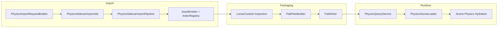

# Physics Sidecar Cooking Architecture Specification (Job/Pipeline Locked)

## 0. Status Tracking

This document is the target architecture/spec contract for scene physics sidecar import integration.
Live implementation progress and explicit missing work are tracked in `design/cook_physics_impl.md` (Section 4.1 and Section 11).

Current implementation status snapshot:

1. Implemented already:
   - PAK/runtime physics domain format (`PhysicsSceneAssetDesc`, physics resource table/region) and runtime loaders/query helpers.
   - Loose-cooked layout support for `.physics` descriptors and `physics.table`/`physics.data` files.
   - Pak planner/writer handling for physics resources and physics scene asset type.
2. Missing now:
   - Import request/job/pipeline path for scene physics sidecar.
   - ImportTool CLI + manifest `type: "physics-sidecar"` integration.
   - Sidecar JSON schema for authoring validation and editor/IDE use.
3. Verification caveat:
   - by execution policy, no local project build was run during this design pass.

## 1. Scope

This specification defines the authoritative architecture for importing scene physics sidecar content into loose-cooked output and ensuring it is consumable by Pak planning/writing and runtime loaders.

In scope:

1. New import domain: `physics-sidecar` via `ImportJob -> Pipeline`.
2. Physics sidecar request contracts (CLI + manifest + builder normalization).
3. Emission of `AssetType::kPhysicsScene` descriptors (`.physics`) via import sessions/index registration.
4. Physics sidecar target-scene resolution from mounted cooked roots and inflight contexts.
5. Compatibility with existing Pak planner/writer ingestion of loose-cooked outputs.
6. Tests covering request/build/manifest/pipeline and pak inclusion behavior.

Out of scope:

1. Cooking new collision-shape assets, physics-material assets, or physics resource blobs from DCC authoring.
2. FBX/glTF adapter changes to synthesize physics sidecars automatically.
3. Runtime scene-physics hydration behavior changes (existing runtime contract remains authoritative).

## 2. Hard Constraints

1. Import execution must use `ImportJob -> Pipeline` architecture.
2. No ad-hoc direct execution path outside AsyncImportService job routing.
3. A single dedicated physics sidecar job class is used for this domain.
4. A single dedicated physics sidecar pipeline class is used for this domain.
5. Scene physics sidecar import must not patch/mutate the scene descriptor; it emits a separate `.physics` asset.
6. New binary serialization/deserialization logic must use `oxygen::serio`.
7. `target_scene_virtual_path` must be canonical and validated strictly.
8. Asset references used for binding records must resolve deterministically and fail with explicit diagnostics on mismatch.
9. No scope reduction without explicit approval.

## 3. Repository Analysis Snapshot (Pre-Implementation Baseline)

The following facts were captured before implementation starts and are retained as baseline context:

| Fact | Evidence |
| --- | --- |
| Physics sidecar ABI/runtime model already exists | `src/Oxygen/Data/PakFormat_physics.h`, `src/Oxygen/Data/PhysicsSceneAsset.*`, `src/Oxygen/Content/Loaders/PhysicsSceneLoader.h` |
| Loose-cooked layout already supports `.physics` descriptors | `src/Oxygen/Cooker/Loose/LooseCookedLayout.h` (`PhysicsSceneDescriptor*` helpers) |
| Import session already registers `physics.table`/`physics.data` if present | `src/Oxygen/Cooker/Import/Internal/ImportSession.cpp` |
| Pak planning/writing already supports physics region/table | `src/Oxygen/Cooker/Pak/PakPlanBuilder.cpp`, `src/Oxygen/Cooker/Pak/PakWriter.cpp` |
| Import routing has no physics-sidecar domain | `src/Oxygen/Cooker/Import/AsyncImportService.cpp` |
| Manifest/schema do not include physics-sidecar type | `src/Oxygen/Cooker/Import/ImportManifest.*`, `src/Oxygen/Cooker/Import/Schemas/oxygen.import-manifest.schema.json` |
| ImportTool has no physics-sidecar command | `src/Oxygen/Cooker/Tools/ImportTool/*.cpp` (commands currently include script-sidecar, input, texture, fbx, gltf, script, batch) |

Conclusion:

1. Pak/runtime infrastructure is already prepared.
2. Missing integration is concentrated in Import contracts, routing, pipeline, manifest, and ImportTool.
3. This is a domain integration problem, not a Pak writer architecture problem.

## 4. Decision

Scene physics sidecar is a standalone import domain.

1. It emits `AssetType::kPhysicsScene` descriptors only.
2. It does not mutate paired scene descriptors.
3. It resolves target scenes by canonical virtual path through mounted/inflight context resolution.
4. It references already-available physics assets/resources; it does not author new shape/material/resource payloads in this phase.

## 5. Target Architecture



Architectural split:

1. Import path owns sidecar parsing, validation, serialization, emission.
2. Pak path consumes resulting loose-cooked outputs unchanged.
3. Runtime remains consumer-only and unchanged in this scope.

## 6. Class Design

## 6.1 New Classes

### Import/Cooker

1. `oxygen::content::import::PhysicsSidecarImportSettings`
   - file: `src/Oxygen/Cooker/Import/PhysicsImportSettings.h`
   - role: tooling-facing DTO for physics-sidecar ingress.

2. `oxygen::content::import::internal::BuildPhysicsSidecarRequest(...)`
   - files:
     - `src/Oxygen/Cooker/Import/PhysicsImportRequestBuilder.h`
     - `src/Oxygen/Cooker/Import/Internal/PhysicsImportRequestBuilder.cpp`
   - role: validate + normalize settings into `ImportRequest`.

3. `oxygen::content::import::detail::PhysicsSidecarImportJob`
   - files:
     - `src/Oxygen/Cooker/Import/Internal/Jobs/PhysicsSidecarImportJob.h`
     - `src/Oxygen/Cooker/Import/Internal/Jobs/PhysicsSidecarImportJob.cpp`
   - role: source loading, pipeline orchestration, finalize.

4. `oxygen::content::import::PhysicsSidecarImportPipeline`
   - files:
     - `src/Oxygen/Cooker/Import/Internal/Pipelines/PhysicsSidecarImportPipeline.h`
     - `src/Oxygen/Cooker/Import/Internal/Pipelines/PhysicsSidecarImportPipeline.cpp`
   - role: parse/validate/resolve/serialize/emit `PhysicsSceneAssetDesc`.

5. Shared sidecar target-scene resolver utility (for scripting + physics).
   - files:
     - `src/Oxygen/Cooker/Import/Internal/SidecarSceneResolver.h`
     - `src/Oxygen/Cooker/Import/Internal/SidecarSceneResolver.cpp`
   - role: eliminate duplicated target-scene resolution logic.

### ImportTool

6. `oxygen::content::import::tool::PhysicsSidecarCommand`
   - files:
     - `src/Oxygen/Cooker/Tools/ImportTool/PhysicsSidecarCommand.h`
     - `src/Oxygen/Cooker/Tools/ImportTool/PhysicsSidecarCommand.cpp`
   - role: CLI command wiring for physics-sidecar imports.

## 6.2 Changed Classes

1. `ImportRequest` + `PhysicsImportSettings`
   - add physics-sidecar routing payload on `ImportRequest`.
   - keep physics-specific fields in `PhysicsImportSettings` (domain-owned).
   - files:
     - `src/Oxygen/Cooker/Import/ImportRequest.h`
     - `src/Oxygen/Cooker/Import/PhysicsImportSettings.h`

2. `AsyncImportService`
   - route `request.physics.has_value()` to `PhysicsSidecarImportJob`.
   - file: `src/Oxygen/Cooker/Import/AsyncImportService.cpp`.

3. `ImportManifest`
   - add `type: "physics-sidecar"` defaults/job parsing/build-request path.
   - files: `src/Oxygen/Cooker/Import/ImportManifest.h/.cpp`.

4. ImportTool wiring:
   - files: `main.cpp`, `BatchCommand.cpp`, `ImportRunner.cpp`, `README.md`, `CMakeLists.txt`.

5. `ImportReport` + `ImportSession`
   - add/report physics sidecar counters (for CI/reporting fidelity).
   - files: `ImportReport.h`, `Internal/ImportSession.cpp`.

6. `src/Oxygen/Cooker/CMakeLists.txt`
   - compile/install/schema wiring for physics-sidecar domain.

## 7. API Contracts

## 7.1 Physics Request Payload

Add to `PhysicsImportSettings`:

```cpp
struct PhysicsImportSettings final {
  std::string target_scene_virtual_path;
  std::string inline_bindings_json;
};
```

`ImportRequest` gains:

```cpp
std::optional<PhysicsImportSettings> physics;
```

Routing contract:

1. `AsyncImportService` routes requests with `request.physics.has_value()` to `PhysicsSidecarImportJob`.
2. This route is independent from `options.scripting` and `request.input`.

## 7.2 Request Builder Contract

`BuildPhysicsSidecarRequest(...)` requirements:

1. Exactly one of:
   - `source_path`
   - `inline_bindings_json`
2. `target_scene_virtual_path` is required and must be canonical.
3. Inline payload is normalized to canonical sidecar JSON object shape.
4. Request is stamped with `request.physics = PhysicsImportSettings{...}`.

Canonical virtual-path rules:

1. starts with `/`
2. no backslashes
3. no `//`
4. no trailing slash except root
5. no `.` or `..` path segments

## 7.3 CLI Contract

Command:

1. `physics-sidecar <source?>`

Required options:

1. `--target-scene-virtual-path <canonical-path>`

Input mode (exactly one):

1. positional `source` (file path)
2. `--bindings-inline '<json>'`

Optional:

1. `-i`, `--output <path>`
2. `--name <job-name>`
3. `--report <path>`
4. `--content-hashing <true|false>`

## 7.4 Manifest Contract

Schema/files:

1. `src/Oxygen/Cooker/Import/Schemas/oxygen.import-manifest.schema.json`
2. `src/Oxygen/Cooker/Import/ImportManifest.h`
3. `src/Oxygen/Cooker/Import/ImportManifest.cpp`

Manifest deltas:

1. `job_settings.type` enum adds `"physics-sidecar"`.
2. `defaults` adds `physics_sidecar`.
3. For `physics-sidecar` jobs:
   - `target_scene_virtual_path` required.
   - exactly one of `source` or `bindings` required.

Example:

```json
{
  "type": "physics-sidecar",
  "target_scene_virtual_path": "/.cooked/Scenes/city.oscene",
  "bindings": {
    "rigid_bodies": [
      {
        "node_index": 10,
        "shape_virtual_path": "/.cooked/PhysicsShapes/City/box_01.ocshape",
        "material_virtual_path": "/.cooked/PhysicsMaterials/default.opmat",
        "body_type": "dynamic"
      }
    ]
  }
}
```

## 7.5 Physics Sidecar Source Schema Contract

New schema file:

1. `src/Oxygen/Cooker/Import/Schemas/oxygen.physics-sidecar.schema.json`

Top-level shape:

```json
{
  "bindings": {
    "rigid_bodies": [],
    "colliders": [],
    "characters": [],
    "soft_bodies": [],
    "joints": [],
    "vehicles": [],
    "aggregates": []
  }
}
```

Record fields map directly to `PakFormat_physics.h` binding records.

Reference strategy:

1. Shape/material references are authored as virtual paths and resolved to asset indices.
2. Constraint resources (joint/vehicle) are authored as explicit numeric resource indices in this phase.

## 7.6 Resolution and Validation Contract

Target-scene resolution:

1. Mount request cooked root plus `cooked_context_roots` in precedence order.
2. Resolve `target_scene_virtual_path` via `VirtualPathResolver`.
3. Prefer exact virtual-path inflight match if present.
4. Reject ambiguities and missing targets deterministically.
5. Load scene descriptor to obtain `scene_key` and `node_count`.

Asset reference validation:

1. `shape_virtual_path` resolves to `AssetType::kCollisionShape`.
2. `material_virtual_path` resolves to `AssetType::kPhysicsMaterial`.
3. Resolved assets must belong to the same source key/index domain as emitted sidecar.
4. Node indices must be `< target_node_count`.

Duplicate rules:

1. At most one `rigid_body`, `character`, `soft_body`, `vehicle`, `aggregate` binding per node.
2. Multiple colliders per node are allowed.
3. Multiple joints are allowed.

## 7.7 Emission Contract

1. Build `PhysicsSceneAssetDesc` with:
   - `header.asset_type = kPhysicsScene`
   - `target_scene_key`
   - `target_node_count`
   - component-table directory + payload blocks
2. Emit descriptor via `AssetEmitter`.
3. Sidecar descriptor naming:
   - if target scene relpath is `Scenes/Foo.oscene`, sidecar relpath is `Scenes/Foo.physics`
   - virtual path mirrors same base name with `.physics`.
4. Hashing:
   - if content hashing enabled, write computed hash into `AssetHeader::content_hash`.

## 7.8 Pak Integration Contract

1. No structural Pak writer changes are required for this feature.
2. Physics sidecar descriptor appears in loose cooked index as `AssetType::kPhysicsScene`.
3. `PakPlanBuilder`/`PakWriter` consume the descriptor through existing asset directory flow.
4. If `physics.table` and `physics.data` exist, they are included through existing region/table logic.
5. Pair invariant remains strict: never produce/register only one of the two files.

## 8. Diagnostics Plan

Stable diagnostic namespaces:

1. `physics.request.*`
2. `physics.sidecar.*`
3. `physics.manifest.*`

Required diagnostics:

1. `physics.request.invalid_import_kind`
2. `physics.request.target_scene_virtual_path_missing`
3. `physics.sidecar.payload_parse_failed`
4. `physics.sidecar.payload_invalid`
5. `physics.sidecar.target_scene_virtual_path_invalid`
6. `physics.sidecar.target_scene_missing`
7. `physics.sidecar.target_scene_not_scene`
8. `physics.sidecar.target_scene_read_failed`
9. `physics.sidecar.inflight_target_scene_ambiguous`
10. `physics.sidecar.node_ref_out_of_bounds`
11. `physics.sidecar.shape_ref_unresolved`
12. `physics.sidecar.shape_ref_not_collision_shape`
13. `physics.sidecar.material_ref_unresolved`
14. `physics.sidecar.material_ref_not_physics_material`
15. `physics.sidecar.reference_source_mismatch`
16. `physics.sidecar.constraint_resource_index_invalid`
17. `physics.sidecar.descriptor_emit_failed`
18. `physics.sidecar.pipeline_exception`
19. `physics.manifest.source_bindings_exclusive`
20. `physics.manifest.target_scene_virtual_path_missing`

## 9. Regression Protection

Must-not-regress areas:

1. Script asset and script-sidecar import behavior.
2. Input import behavior and manifest validation rules.
3. Existing pak writer/planner domain handling.
4. Runtime loading of existing scene/script/input assets.

## 10. Acceptance Criteria

Done requires:

1. New `physics-sidecar` import domain fully wired through request builder, manifest, CLI, routing, job, pipeline.
2. Physics sidecar descriptor emission works with canonical `.physics` naming derived from target scene.
3. Pak planning/writing include emitted sidecar descriptors without special-case hacks.
4. Validation diagnostics are deterministic and cover unresolved/mismatch/out-of-bounds cases.
5. Tests cover contracts and critical negative paths.
6. Docs and schema installation paths are updated and consistent.

## 11. Reference Documents

1. `design/pak_physics.md`
2. `design/pak_builder.md`
3. `design/cook_input.md`
4. `design/cook_input_impl.md`
