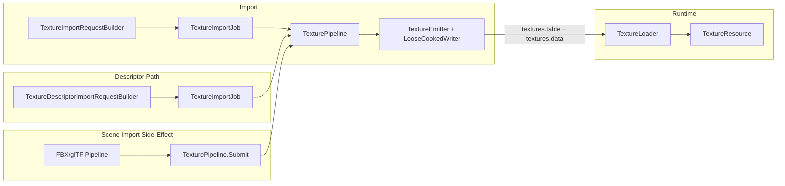

# Texture Cooking Architecture Specification

## 0. Status Tracking

This document is the authoritative architecture reference for texture import,
cooking, and runtime loading in Oxygen.

Current implementation status snapshot:

1. Implemented: `TextureImportJob`, `TexturePipeline`, `BuildTextureRequest`,
   `AsyncImportService` routing for `ImportFormat::kTextureImage`, and
   ImportTool `texture` command wiring.
2. Implemented: `TextureDescriptorImportJob`, `BuildTextureDescriptorRequest`,
   and JSON-descriptor-driven import path (`type: "texture-descriptor"`).
3. Implemented: `TextureImporter` high-level API (`ImportTexture`,
   `ImportCubeMap`, `ImportCubeMapFromEquirect`, `ImportCubeMapFromLayoutImage`,
   `ImportTextureArray`, `ImportTexture3D`, `TextureImportBuilder`).
4. Implemented: `ScratchImage`, `TextureSourceSet`, `TexturePipeline` async
   stages: decode → working format → content processing → mip generation →
   output format → BC7 compression → packing.
5. Implemented: `TexturePackingPolicy` (`D3D12PackingPolicy`,
   `TightPackedPolicy`), content hashing, and loose-cooked emission
   (`textures.table` / `textures.data` / `.otex` descriptors).
6. Implemented: Runtime `TextureLoader` reads `TextureResourceDesc` from stream
   and loads pixel payload from `textures.data`.
7. Implemented: Preset system (`TexturePreset`, `ApplyPreset`, `MakeDescFromPreset`)
   and filename-convention-based auto-detection (`DetectPresetFromFilename`).
8. Verification caveat: by execution policy, no local project build was run
   during this documentation pass.

## 1. Scope

This specification defines the authoritative architecture for importing,
cooking, packaging, and runtime loading of texture assets in Oxygen.

In scope:

1. Standalone texture import via `ImportFormat::kTextureImage` — single source
   image or multi-source assembly (cube maps, texture arrays, 3D textures).
2. JSON-descriptor-driven imports (`*.texture.json` via `type:
   "texture-descriptor"`).
3. Embedded texture import as a side effect of FBX/glTF scene imports
   (`ImportOptions::TextureTuning`).
4. Loose-cooked descriptor emission (`.otex`) and resource table emission
   (`textures.table` / `textures.data`).
5. PAK/runtime compatibility via `TextureResourceDesc` in `PakFormat_render.h`.
6. Runtime loading via `TextureLoader`.
7. Preset-driven configuration via `TexturePreset` and `ApplyPreset`.
8. Packing policy abstraction (`D3D12PackingPolicy`, `TightPackedPolicy`).

Out of scope:

1. Shader compilation or material cooking.
2. Procedural texture generation at runtime.
3. Streaming or virtual texturing.
4. Texture compression formats other than BC7 (BC1, BC3, ASTC, etc.).

## 2. Hard Constraints

1. Import implementation must use `ImportJob → Pipeline` architecture.
2. No bypass path or ad-hoc inline runner for import-time cooking.
3. Standalone texture import must use one job class only: `TextureImportJob`.
4. Pipeline cooking must use one pipeline class only: `TexturePipeline`.
5. All binary serialization/deserialization for resource descriptors must use
   `oxygen::serio` (no raw byte arithmetic for new logic).
6. Packing alignment MUST be expressed through `ITexturePackingPolicy`
   implementations — no hard-coded alignment values in cooking stages.
7. Content hashing uses the first 8 bytes of SHA-256 over the payload bytes and
   MUST NOT be computed when `with_content_hashing` is false.
8. Texture `format` stored in `TextureResourceDesc` MUST be a value from the
   core type `Format` enum (no internal representation).
9. Runtime content code MUST NOT depend on demo/example code.

## 3. Repository Analysis Snapshot (Pre-Documentation Baseline)

The following facts were confirmed during the documentation pass:

| Fact | Evidence |
| --- | --- |
| Loose layout supports texture descriptors | `src/Oxygen/Cooker/Loose/LooseCookedLayout.h` (`kTextureDescriptorExtension = ".otex"`, `TextureDescriptorDir()`, `TextureVirtualPath()`, `textures_table_file_name`, `textures_data_file_name`) |
| Runtime loader for textures exists | `src/Oxygen/Content/Loaders/TextureLoader.h` (`LoadTextureResource`) |
| Import routing is in place | `src/Oxygen/Cooker/Import/AsyncImportService.cpp` (`case ImportFormat::kTextureImage: make_shared<TextureImportJob>`) |
| Two manifest job types exist | `src/Oxygen/Cooker/Import/ImportManifest.cpp`: `"texture"` and `"texture-descriptor"` |
| High-level import API exists | `src/Oxygen/Cooker/Import/TextureImporter.h` (`ImportTexture`, `ImportCubeMap`, `TextureImportBuilder`) |
| Preset system exists | `src/Oxygen/Cooker/Import/TextureImportPresets.h` (`TexturePreset`, `ApplyPreset`) |
| Binary format is locked | `src/Oxygen/Data/PakFormat_render.h` (`TextureResourceDesc`, `static_assert(sizeof(..)==40)`) |
| Embedded import path exists | `src/Oxygen/Cooker/Import/ImportOptions.h` (`ImportOptions::TextureTuning`) |
| JSON descriptor schema shipped | `src/Oxygen/Cooker/Import/Schemas/oxygen.texture-descriptor.schema.json` |

## 4. Decision

Textures are **resource-kind assets** (not first-class scene assets). They are
referenced by index from materials and geometry via `TextureResourceDesc`.

Three import entry points exist and are all authoritative:

1. **Standalone image import** (`texture <source>` CLI / `type: "texture"`
   manifest) — the primary workflow for texture teams.
2. **Descriptor-driven import** (`type: "texture-descriptor"` manifest) — JSON
   document that fully describes one import job for editor integration and
   reproducible pipelines.
3. **Embedded import** (side effect of FBX/glTF scene import) — textures
   referenced by materials are cooked inline via `ImportOptions::TextureTuning`.

All three paths share the same `TexturePipeline` cooking stages and produce
identical `TextureResourceDesc` binary output.

## 5. Target Architecture



Architectural split:

1. Import path owns descriptor production, subresource packing, and indexing.
2. `TexturePipeline` is a reusable async cooking unit shared by all entry points.
3. Runtime loading reads `TextureResourceDesc` from the table and pixel data from
   the data blob — no cooking at load time.
4. Scene imports do not own texture cooking policy; that policy comes from
   `ImportOptions::TextureTuning`.

## 6. Class Design

### 6.1 Import / Cooker Classes

**Tooling-Facing Settings (DTOs):**

1. `oxygen::content::import::TextureImportSettings`
   - file: `src/Oxygen/Cooker/Import/TextureImportSettings.h`
   - role: tooling-facing DTO for one texture import job request. Contains
     orchestration fields (`source_path`, `cooked_root`, `job_name`,
     `report_path`) and all cook parameters (`intent`, `color_space`,
     `output_format`, `preset`, `mip_policy`, `bc7_quality`,
     `packing_policy`, `cubemap`, `equirect_to_cube`, etc.).
   - note: `sources` supports multi-source assembly (cube maps, arrays, 3D).

2. `oxygen::content::import::TextureDescriptorImportSettings`
   - file: `src/Oxygen/Cooker/Import/TextureDescriptorImportSettings.h`
   - role: wraps a JSON descriptor file path with a base
     `TextureImportSettings` for tooling-default overrides.
   - note: the `texture` field provides defaults; descriptor JSON fields
     override them.

**Request Builders:**

3. `oxygen::content::import::internal::BuildTextureRequest(...)`
   - files:
     - `src/Oxygen/Cooker/Import/Internal/TextureImportRequestBuilder.h`
     - `src/Oxygen/Cooker/Import/Internal/TextureImportRequestBuilder.cpp`
   - role: validate + normalize `TextureImportSettings` into `ImportRequest`
     routed via `ImportFormat::kTextureImage`.

4. `oxygen::content::import::internal::BuildTextureDescriptorRequest(...)`
   - files:
     - `src/Oxygen/Cooker/Import/TextureDescriptorImportRequestBuilder.h`
     - `src/Oxygen/Cooker/Import/Internal/TextureDescriptorImportRequestBuilder.cpp`
   - role: validate + normalize `TextureDescriptorImportSettings` into
     `ImportRequest`; the descriptor JSON is loaded and merged at request
     build time.

**Job and Pipeline:**

5. `oxygen::content::import::detail::TextureImportJob`
   - files:
     - `src/Oxygen/Cooker/Import/Internal/Jobs/TextureImportJob.h`
     - `src/Oxygen/Cooker/Import/Internal/Jobs/TextureImportJob.cpp`
   - role: async job that loads source bytes (or multi-source set or
     already-decoded `ScratchImage`), submits to `TexturePipeline`, and
     calls `TextureEmitter` on success.
   - stages: `LoadSource` → `CookTexture` → `EmitTexture` → `FinalizeSession`.

6. `oxygen::content::import::TexturePipeline`
   - files:
     - `src/Oxygen/Cooker/Import/Internal/Pipelines/TexturePipeline.h`
     - `src/Oxygen/Cooker/Import/Internal/Pipelines/TexturePipeline.cpp`
   - role: async cooking pipeline shared by all entry points. Accepts
     `WorkItem` objects on the import thread, offloads CPU work to a
     `co::ThreadPool`, and returns `WorkResult` objects.
   - pipeline stages (in order):
     1. Decode (`detail::DecodeSource`) — source bytes → `ScratchImage`
     2. Working format conversion (`detail::ConvertToWorkingFormat`)
     3. Content processing (`detail::ApplyContentProcessing`)
     4. Mip generation (`detail::GenerateMips`)
     5. Output format conversion + BC7 (`detail::ConvertToOutputFormat`)
     6. Packing (`detail::PackSubresources`)
     7. Content hashing (`detail::ComputeContentHash`, optional)
   - note: `TexturePipeline` does NOT assign resource indices; only
     `TextureEmitter` writes indices.

**Low-Level Processing Types:**

7. `oxygen::content::import::TextureImportDesc`
   - file: `src/Oxygen/Cooker/Import/TextureImportDesc.h`
   - role: complete processing contract for one texture. Consumed directly
     by `CookTexture()` / `TexturePipeline`. Contains shape, intent, decode
     options, color space, mip policy, output format, BC7 quality, HDR
     handling, and a cooperative cancellation token.

8. `oxygen::content::import::ScratchImage`
   - files:
     - `src/Oxygen/Cooker/Import/ScratchImage.h`
     - `src/Oxygen/Cooker/Import/ScratchImage.cpp`
   - role: owning in-memory buffer for all mips and all array layers of a
     decoded/processed texture. Provides `GetImage(layer, mip)` access
     via `ImageView` (non-owning view).

9. `oxygen::content::import::TextureSourceSet`
   - file: `src/Oxygen/Cooker/Import/TextureSourceAssembly.h`
   - role: collection of per-subresource source bytes for multi-source
     textures (cube maps, arrays, 3D).
   - helpers: `AddCubeFace()`, `AddArrayLayer()`, `AddDepthSlice()`.

**Packing Policies:**

10. `oxygen::content::import::ITexturePackingPolicy`
    - file: `src/Oxygen/Cooker/Import/TexturePackingPolicy.h`
    - role: interface for backend-specific alignment strategies.
      Methods: `Id()`, `AlignRowPitchBytes()`, `AlignSubresourceOffset()`.

11. `oxygen::content::import::D3D12PackingPolicy`
    - file: `src/Oxygen/Cooker/Import/TexturePackingPolicy.h`
    - role: D3D12 alignment — row pitch aligned to 256 bytes, subresource
      offset aligned to 512 bytes. Singleton via `Instance()`.

12. `oxygen::content::import::TightPackedPolicy`
    - file: `src/Oxygen/Cooker/Import/TexturePackingPolicy.h`
    - role: minimal 4-byte alignment for storage efficiency. Singleton via
      `Instance()`.

**High-Level Programmatic API:**

13. Free functions in `oxygen::content::import`
    - file: `src/Oxygen/Cooker/Import/TextureImporter.h`
    - role: single-call convenience API for common workflows.
    - functions:
      - `ImportTexture(path, policy)` — auto-detect preset from filename
      - `ImportTexture(path, preset, policy)` — explicit preset
      - `ImportTexture(path, desc, policy)` — full descriptor control
      - `ImportTexture(data, source_id, preset, policy)` — from memory
      - `ImportCubeMap(face_paths, preset, policy)` — 6 face files
      - `ImportCubeMap(base_path, preset, policy)` — auto-discover faces
      - `ImportCubeMapFromEquirect(path, face_size, preset, policy)` — panorama
      - `ImportCubeMapFromLayoutImage(path, preset, policy)` — strip/cross
      - `ImportTextureArray(layer_paths, preset, policy)` — 2D array
      - `ImportTexture3D(slice_paths, preset, policy)` — volume texture
      - `LoadTexture(path)` — decode only, no cooking
      - `CookScratchImage(image, preset, policy)` — cook pre-decoded image
      - `DetectPresetFromFilename(path)` — filename convention detection

14. `oxygen::content::import::TextureImportBuilder`
    - file: `src/Oxygen/Cooker/Import/TextureImporter.h`
    - role: fluent builder for advanced configuration. Supports
      `FromFile()`, `FromMemory()`, `AddCubeFace()`, `AddArrayLayer()`,
      `AddDepthSlice()`, plus all descriptor overrides. Produces result
      via `Build(policy)`.

**Preset System:**

15. `oxygen::content::import::TexturePreset`
    - file: `src/Oxygen/Cooker/Import/TextureImportPresets.h`
    - role: enum of named presets covering common material and HDR workflows.
    - values: `kAlbedo`, `kNormal`, `kRoughness`, `kMetallic`, `kAO`,
      `kORMPacked`, `kEmissive`, `kUI`, `kHdrEnvironment`, `kHdrLightProbe`,
      `kData`, `kHeightMap`.

16. `ApplyPreset(desc, preset)` / `MakeDescFromPreset(preset)`
    - file: `src/Oxygen/Cooker/Import/TextureImportPresets.h`
    - role: populate a `TextureImportDesc` with sensible defaults for the
      given preset. Shape fields (`width`, `height`, `depth`,
      `array_layers`, `source_id`) are not modified.

### 6.2 Runtime Classes

17. `oxygen::content::loaders::LoadTextureResource`
    - file: `src/Oxygen/Content/Loaders/TextureLoader.h`
    - role: inline loader function. Reads `TextureResourceDesc` and pixel
      payload from PAK stream into `data::TextureResource`. Registered
      with `AssetLoader` as the loader for `kTexture` asset type.

18. `oxygen::data::TextureResource`
    - file: `src/Oxygen/Data/TextureResource.h`
    - role: runtime wrapper around `TextureResourceDesc` + pixel payload
      bytes. Provides dimension, format, and data accessors.

### 6.3 Routing

`AsyncImportService` routes based on `ImportRequest::GetFormat()`:

```text
ImportFormat::kTextureImage → TextureImportJob
```

`ImportFormat` is auto-detected from file extension (`.png`, `.jpg`, `.hdr`,
`.exr`, etc.) or set explicitly by request builders. The `texture-descriptor`
job type also produces `ImportFormat::kTextureImage` after loading the
descriptor JSON.

---

## 7. API Contracts

### 7.1 Import Options (Embedded Texture Cooking)

When textures are imported as a side effect of FBX/glTF scene imports,
`ImportOptions::TextureTuning` controls cooking behavior:

```cpp
struct TextureTuning final {
  bool enabled = false;                            // Must be true to cook textures

  // Decode
  TextureIntent intent = TextureIntent::kAlbedo;
  ColorSpace source_color_space = ColorSpace::kSRGB;
  bool flip_y_on_decode = false;
  bool force_rgba_on_decode = true;

  // Mip generation
  MipPolicy mip_policy = MipPolicy::kNone;
  uint8_t max_mip_levels = 1;
  MipFilter mip_filter = MipFilter::kKaiser;
  ColorSpace mip_filter_space = ColorSpace::kLinear;

  // Output
  Format color_output_format = Format::kBC7UNormSRGB;
  Format data_output_format = Format::kBC7UNorm;
  Bc7Quality bc7_quality = Bc7Quality::kDefault;
  std::string packing_policy_id = "d3d12";

  // HDR
  HdrHandling hdr_handling = HdrHandling::kTonemapAuto;
  float exposure_ev = 0.0f;
  bool bake_hdr_to_ldr = false;

  // Normal-map specifics
  bool flip_normal_green = false;
  bool renormalize_normals_in_mips = true;

  // Cubemap
  bool import_cubemap = false;
  bool equirect_to_cubemap = false;
  uint32_t cubemap_face_size = 0;
  CubeMapImageLayout cubemap_layout = CubeMapImageLayout::kUnknown;

  // Failure handling
  bool placeholder_on_failure = false;
};
```

`ImportOptions` additionally carries:

```cpp
TextureTuning texture_tuning = {};  // Global defaults for all textures
std::unordered_map<std::string, TextureTuning> texture_overrides;  // Per-texture overrides by name
```

Routing contract:

1. `TextureTuning::enabled` must be `true` for textures to be cooked during
   scene imports.
2. `texture_overrides` keys are matched against the texture name/path from the
   source format. Per-texture overrides take precedence over `texture_tuning`.
3. `FailurePolicyForTextureTuning()` maps `placeholder_on_failure` →
   `TexturePipeline::FailurePolicy::kPlaceholder` or `kStrict`.

### 7.2 Texture Command (CLI Only)

Command surface:

```text
texture <source>
```

CLI-only optional flags (NOT valid in manifest job objects):

| Flag | Type | Description |
| --- | --- | --- |
| `--output` | `string` | Destination cooked root directory |
| `--name` | `string` | Human-readable job name |
| `--report` | `string` | Report destination path |
| `--content-hashing` | `bool` | Enable/disable content hashing |
| `--intent` | `string` | Texture intent (see Section 7.4.1) |
| `--color-space` | `string` | Source color space (`srgb` / `linear`) |
| `--output-format` | `string` | Output pixel format |
| `--data-format` | `string` | Data format for non-color intents |
| `--preset` | `string` | Named preset (see Section 7.4.2) |
| `--mip-policy` | `string` | `none` / `full` / `max` |
| `--max-mips` | `uint32` | Max mip levels (when `--mip-policy=max`) |
| `--mip-filter` | `string` | `box` / `kaiser` / `lanczos` |
| `--mip-filter-space` | `string` | `srgb` / `linear` |
| `--bc7-quality` | `string` | `none` / `fast` / `default` / `high` |
| `--packing-policy` | `string` | `d3d12` / `tight` |
| `--hdr-handling` | `string` | `error` / `tonemap` / `keep` |
| `--exposure-ev` | `float` | Exposure EV adjustment before tonemap |
| `--bake-hdr-to-ldr` | `bool` | Bake HDR to LDR via tonemap |
| `--cubemap` | `bool` | Import as cubemap |
| `--equirect-to-cube` | `bool` | Convert equirectangular panorama to cube |
| `--cube-face-size` | `uint32` | Cubemap face size in pixels |
| `--cube-layout` | `string` | `auto` / `hstrip` / `vstrip` / `hcross` / `vcross` |
| `--flip-y` | `bool` | Flip image vertically during decode |
| `--force-rgba` | `bool` | Force RGBA output during decode |
| `--flip-normal-green` | `bool` | Flip green channel (normal map convention) |
| `--renormalize-normals` | `bool` | Renormalize normals in mip levels |
| `--source` | `string` (repeatable) | Additional source mapping `file:layer:mip:slice` |

These flags are consumed by `TextureCommand` to build a `TextureImportSettings`
struct. They do NOT appear in manifest `jobs[]` entries. Manifest texture jobs
use only the fields listed in Section 7.3.

### 7.3 Manifest Contract (`ImportManifest`)

This section defines manifest-mode import for texture assets.

Schema target files:

1. `src/Oxygen/Cooker/Import/ImportManifest.h`
2. `src/Oxygen/Cooker/Import/ImportManifest.cpp`
3. `src/Oxygen/Cooker/Import/Schemas/oxygen.import-manifest.schema.json`

#### 7.3.1 Direct Texture Job (`type: "texture"`)

Fields valid in a `type: "texture"` manifest job:

```json
{
  "id": "job.unique.id",
  "type": "texture",
  "source": "Content/Textures/brick_albedo.png",
  "name": "Brick Albedo",
  "preset": "albedo",
  "intent": "albedo",
  "color_space": "srgb",
  "output_format": "bc7_srgb",
  "mip_policy": "full",
  "mip_filter": "kaiser",
  "bc7_quality": "default",
  "packing_policy": "d3d12",
  "cubemap": false,
  "sources": [
    { "file": "extra_detail.png", "layer": 1, "mip": 0 }
  ],
  "depends_on": ["other.job.id"]
}
```

Allowed top-level keys for `type: "texture"`:
`id`, `type`, `name`, `source`, `sources`, `preset`, `intent`,
`color_space`, `output_format`, `data_format`, `mip_policy`, `max_mips`,
`mip_filter`, `mip_filter_space`, `bc7_quality`, `packing_policy`,
`hdr_handling`, `exposure_ev`, `bake_hdr_to_ldr`, `bake_hdr`,
`flip_y`, `force_rgba`, `flip_normal_green`, `renormalize_normals`,
`cubemap`, `equirect_to_cube`, `cube_face_size`, `cube_layout`,
`content_hashing`, `depends_on`.

#### 7.3.2 Descriptor-Driven Texture Job (`type: "texture-descriptor"`)

A `type: "texture-descriptor"` job points to a JSON descriptor file.
The descriptor file is loaded and merged at request-build time.

```json
{
  "id": "job.tex.brick",
  "type": "texture-descriptor",
  "source": "Content/Descriptors/brick_albedo.texture.json",
  "depends_on": []
}
```

The `source` field must point to a file conforming to
`oxygen.texture-descriptor.schema.json` (Section 7.4).

Manifest-level defaults may be provided in the `defaults.texture` object.

#### 7.3.3 Dependency Scheduling Contract

1. ImportTool builds a DAG from `id` + `depends_on`.
2. Validation checks before dispatch:
   - `id` must be unique across all jobs in the manifest.
   - every `depends_on` target must exist in the manifest.
   - no cycles in the dependency graph.
3. Jobs are dispatched only when all predecessors have succeeded.
4. Failed predecessor jobs cause all transitive dependents to be skipped with
   diagnostic `texture.import.skipped_predecessor_failed`.
5. The execution node per job remains `TextureImportJob → TexturePipeline`.

#### 7.3.4 Manifest Defaults

Manifest-level defaults reduce per-job verbosity:

```json
{
  "version": 1,
  "defaults": {
    "texture": {
      "packing_policy": "d3d12",
      "mip_policy": "full",
      "mip_filter": "kaiser",
      "bc7_quality": "default"
    }
  },
  "jobs": [
    { "id": "albedo",  "type": "texture", "source": "Content/Textures/brick_albedo.png",  "preset": "albedo" },
    { "id": "normal",  "type": "texture", "source": "Content/Textures/brick_normal.png",  "preset": "normal" },
    { "id": "roughness","type": "texture", "source": "Content/Textures/brick_roughness.png","preset": "roughness" }
  ]
}
```

### 7.4 Texture Descriptor Source JSON (`*.texture.json`)

Schema: `src/Oxygen/Cooker/Import/Schemas/oxygen.texture-descriptor.schema.json`

Used for descriptor-driven imports (`type: "texture-descriptor"`).
Provides reproducible, self-describing cook contracts for use in editors and
asset pipelines.

#### 7.4.1 Top-Level Field Contract

| Field | Required | Type | Description |
| --- | --- | --- | --- |
| `$schema` | No | `string` | Points to shipped JSON Schema for editor integration |
| `source` | **Yes** | `string` | Path to primary source image |
| `name` | No | `string` | Human-readable asset name |
| `content_hashing` | No | `bool` | Override content hashing toggle |
| `preset` | No | string enum | Named preset (see Section 7.4.2) |
| `intent` | No | string enum | Texture intent (see Section 7.4.3) |
| `sources` | No | array | Additional source mappings for multi-source assembly |
| `decode` | No | object | Decode options (Section 7.4.4) |
| `mips` | No | object | Mip generation settings (Section 7.4.5) |
| `output` | No | object | Output format settings (Section 7.4.6) |
| `hdr` | No | object | HDR handling settings (Section 7.4.7) |
| `cube` | No | object | Cubemap settings (Section 7.4.8) |

Canonical example (`brick_albedo.texture.json`):

```json
{
  "$schema": "./src/Oxygen/Cooker/Import/Schemas/oxygen.texture-descriptor.schema.json",
  "source": "Content/Textures/brick_albedo.png",
  "name": "BrickAlbedo",
  "preset": "albedo",
  "mips": {
    "policy": "full",
    "filter": "kaiser"
  },
  "output": {
    "bc7_quality": "high"
  }
}
```

Top-level validation rules:

1. Unknown top-level fields are rejected (`additionalProperties: false`).
2. `source` is required.
3. If `mips.policy == "max"` then `mips.max_mips` is required.
4. If `cube.equirect_to_cube == true` then `cube.cube_face_size` is required.

#### 7.4.2 Preset Values

| Value | Intent | Output Format | BC7 | Mips |
| --- | --- | --- | --- | --- |
| `albedo` / `albedo-srgb` | kAlbedo | kBC7UNormSRGB | kDefault | full, Kaiser |
| `albedo-linear` | kAlbedo | kBC7UNorm | kDefault | full, Kaiser |
| `normal` | kNormalTS | kBC7UNorm | kDefault | full, Kaiser, renormalize |
| `normal-bc7` | kNormalTS | kBC7UNorm | kHigh | full, Kaiser, renormalize |
| `roughness` | kRoughness | kBC7UNorm | kDefault | full, Kaiser |
| `metallic` | kMetallic | kBC7UNorm | kDefault | full, Kaiser |
| `ao` | kAO | kBC7UNorm | kDefault | full, Kaiser |
| `orm` / `orm-bc7` | kORMPacked | kBC7UNorm | kDefault/High | full, Kaiser |
| `emissive` | kEmissive | kBC7UNormSRGB | kDefault | full, Kaiser |
| `ui` | kAlbedo | kBC7UNormSRGB | kDefault | full, Lanczos |
| `hdr-env` | kHdrEnvironment | kRGBA32Float | kNone | full, Box |
| `hdr-env-16f` | kHdrEnvironment | kRGBA16Float | kNone | full, Box |
| `hdr-env-32f` | kHdrEnvironment | kRGBA32Float | kNone | full, Box |
| `hdr-probe` | kHdrLightProbe | kRGBA16Float | kNone | full, Box |
| `data` | kData | kRGBA8UNorm | kNone | none |
| `height` | kHeightMap | kR16UNorm | kNone | full, Kaiser |

#### 7.4.3 Texture Intent Values

| Value | `TextureIntent` | Notes |
| --- | --- | --- |
| `"albedo"` | `kAlbedo` | sRGB input expected |
| `"normal"` | `kNormalTS` | Linear, XY channels, renormalization |
| `"roughness"` | `kRoughness` | Linear, single channel |
| `"metallic"` | `kMetallic` | Linear, single channel |
| `"ao"` | `kAO` | Linear, single channel |
| `"emissive"` | `kEmissive` | sRGB or HDR |
| `"opacity"` | `kOpacity` | Linear, single channel |
| `"orm"` | `kORMPacked` | R=AO, G=Roughness, B=Metallic |
| `"hdr_env"` | `kHdrEnvironment` | Linear float, skybox |
| `"hdr_probe"` | `kHdrLightProbe` | Linear float, IBL |
| `"data"` | `kData` | Generic, no special handling |
| `"height"` | `kHeightMap` | Single channel, high precision |

#### 7.4.4 `decode` Settings

```json
"decode": {
  "color_space": "srgb",
  "flip_y": false,
  "force_rgba": true,
  "flip_normal_green": false
}
```

| Field | Maps to | Default |
| --- | --- | --- |
| `color_space` | `TextureImportDesc::source_color_space` | `"linear"` |
| `flip_y` | `TextureImportDesc::flip_y_on_decode` | `false` |
| `force_rgba` | `TextureImportDesc::force_rgba_on_decode` | `true` |
| `flip_normal_green` | `TextureImportDesc::flip_normal_green` | `false` |

#### 7.4.5 `mips` Settings

```json
"mips": {
  "policy": "full",
  "max_mips": 8,
  "filter": "kaiser",
  "filter_space": "linear",
  "renormalize": true
}
```

| Field | `MipPolicy` / Maps to | Notes |
| --- | --- | --- |
| `"none"` | `MipPolicy::kNone` | No mip generation |
| `"full"` | `MipPolicy::kFullChain` | Full chain to 1×1 |
| `"max"` | `MipPolicy::kMaxCount` | `max_mips` required |
| `filter` | `TextureImportDesc::mip_filter` | `box` / `kaiser` / `lanczos` |
| `filter_space` | `TextureImportDesc::mip_filter_space` | `srgb` / `linear` |
| `renormalize` | `TextureImportDesc::renormalize_normals_in_mips` | Normal maps only |

#### 7.4.6 `output` Settings

```json
"output": {
  "format": "bc7_srgb",
  "data_format": "bc7",
  "bc7_quality": "default",
  "packing_policy": "d3d12"
}
```

| Format value | `Format` enum | Notes |
| --- | --- | --- |
| `"rgba8"` | `kRGBA8UNorm` | Uncompressed LDR |
| `"rgba8_srgb"` | `kRGBA8UNormSRGB` | Uncompressed LDR, sRGB |
| `"bc7"` | `kBC7UNorm` | BC7 compressed, linear |
| `"bc7_srgb"` | `kBC7UNormSRGB` | BC7 compressed, sRGB |
| `"rgba16f"` | `kRGBA16Float` | Half-precision float |
| `"rgba32f"` | `kRGBA32Float` | Full-precision float |

Packing policy values: `"d3d12"` (256-byte row pitch, 512-byte subresource
alignment) or `"tight"` (4-byte alignment for storage efficiency).

#### 7.4.7 `hdr` Settings

```json
"hdr": {
  "handling": "tonemap",
  "exposure_ev": 0.0,
  "bake_hdr": false
}
```

| `handling` value | `HdrHandling` | Behavior |
| --- | --- | --- |
| `"error"` | `kError` | Fail if HDR input with LDR output |
| `"tonemap"` / `"auto"` | `kTonemapAuto` | Automatically tonemap HDR → LDR |
| `"keep"` / `"float"` | `kKeepFloat` | Override output format to float |

`exposure_ev` is applied before tonemapping. `bake_hdr` forces the HDR-to-LDR
bake path explicitly.

#### 7.4.8 `cube` Settings

```json
"cube": {
  "cubemap": false,
  "equirect_to_cube": true,
  "cube_face_size": 1024,
  "cube_layout": "hcross"
}
```

| Field | Description |
| --- | --- |
| `cubemap` | Import as cubemap via multi-source or single-image assembly |
| `equirect_to_cube` | Convert 2:1 equirectangular panorama to 6-face cube map |
| `cube_face_size` | Face resolution in pixels (required when `equirect_to_cube` is `true`) |
| `cube_layout` | Layout hint for layout images: `auto`, `hstrip`, `vstrip`, `hcross`, `vcross` |

Supported cube map image layouts:

| Layout | Aspect | Face Arrangement |
| --- | --- | --- |
| Horizontal Strip (`hstrip`) | 6:1 | L→R: +X, −X, +Y, −Y, +Z, −Z |
| Vertical Strip (`vstrip`) | 1:6 | T→B: +X, −X, +Y, −Y, +Z, −Z |
| Horizontal Cross (`hcross`) | 4:3 | Standard cross |
| Vertical Cross (`vcross`) | 3:4 | Vertical cross |
| `auto` | Any | Detected from image dimensions |

#### 7.4.9 Multi-Source Assembly (`sources` array)

For cube maps from 6 individual face files, specify each face with an explicit
layer index corresponding to `CubeFace` order (+X=0, −X=1, +Y=2, −Y=3,
+Z=4, −Z=5):

```json
{
  "source": "sky_px.hdr",
  "sources": [
    { "file": "sky_nx.hdr", "layer": 1 },
    { "file": "sky_py.hdr", "layer": 2 },
    { "file": "sky_ny.hdr", "layer": 3 },
    { "file": "sky_pz.hdr", "layer": 4 },
    { "file": "sky_nz.hdr", "layer": 5 }
  ],
  "preset": "hdr-env"
}
```

`sources` items:

| Field | Type | Description |
| --- | --- | --- |
| `file` | `string` | Path to the source image |
| `layer` | `uint16` | Array layer or cube face index (0-based) |
| `mip` | `uint16` | Mip level (0 = highest resolution) |
| `slice` | `uint16` | Depth slice for 3D textures |

### 7.5 Auto-Detection (Filename Conventions)

`DetectPresetFromFilename()` examines filename suffixes to select a preset:

| Suffix Pattern | Detected Preset |
| --- | --- |
| `*_albedo.*`, `*_basecolor.*`, `*_diffuse.*`, `*_color.*` | `kAlbedo` |
| `*_normal.*`, `*_nrm.*` | `kNormal` |
| `*_roughness.*`, `*_rough.*` | `kRoughness` |
| `*_metallic.*`, `*_metal.*` | `kMetallic` |
| `*_ao.*`, `*_occlusion.*` | `kAO` |
| `*_orm.*` | `kORMPacked` |
| `*_emissive.*`, `*_emission.*` | `kEmissive` |
| `*_height.*`, `*_displacement.*`, `*_disp.*`, `*_bump.*` | `kHeightMap` |
| `.hdr` / `.exr` extension, `*_env.*`, `*_hdri.*` | `kHdrEnvironment` |
| (no match) | `kData` |

---

## 8. Pipeline Stages (Internal)

The following pipeline stages are exposed in `detail` namespace for unit
testing. Each stage takes a `ScratchImage` (by value, moved) and returns
`Result<ScratchImage, TextureImportError>` or a derived type.

| Stage | Function | Input | Output |
| --- | --- | --- | --- |
| 1. Decode | `detail::DecodeSource(bytes, desc)` | Raw bytes | Working ScratchImage |
| 2. Working format | `detail::ConvertToWorkingFormat(image, desc)` | Any decoded format | RGBA8 or RGBA32Float |
| 3. Content processing | `detail::ApplyContentProcessing(image, desc)` | Working format | Color-space corrected |
| 4. Mip generation | `detail::GenerateMips(image, desc)` | Single mip | Full/limited mip chain |
| 5. Output format | `detail::ConvertToOutputFormat(image, desc)` | Working format | Final stored format |
| 6. Pack | `detail::PackSubresources(image, policy)` | Final format | `vector<byte>` payload |
| 7. Hash | `detail::ComputeContentHash(payload)` | Payload bytes | `uint64_t` hash |

All stages cooperatively check `desc.stop_token` to support cancellation.

---

## 9. Binary Format

### 9.1 `TextureResourceDesc` (40 bytes, `PakFormat_render.h`)

All textures stored in the loose cooked container and in PAK files share this
fixed-size descriptor. Placed sequentially in `textures.table`.

```cpp
#pragma pack(push, 1)
struct TextureResourceDesc {
  core::OffsetT   data_offset;    // Absolute byte offset into textures.data
  core::DataBlobSizeT size_bytes; // Byte size of the pixel payload
  uint8_t   texture_type;         // TextureType enum (2D=3, 3D, Cube, etc.)
  uint8_t   compression_type;     // Compression enum (BC7, etc.)
  uint32_t  width;                // Mip-0 width in pixels
  uint32_t  height;               // Mip-0 height in pixels
  uint16_t  depth;                // For 3D textures; otherwise 1
  uint16_t  array_layers;         // 6 for cube maps; otherwise 1
  uint16_t  mip_levels;           // Number of mip levels
  uint8_t   format;               // Format enum value
  uint16_t  alignment;            // Always 256 for D3D12 packing
  uint64_t  content_hash = 0;     // First 8 bytes of SHA-256 of payload
  uint8_t   reserved[1] = {};
};
#pragma pack(pop)
static_assert(sizeof(TextureResourceDesc) == 40);
```

### 9.2 Payload Layout (inside `textures.data`)

Each texture's payload is a contiguous block of subresource data:

```text
[Subresource 0 (layer 0, mip 0)] — padding to alignment
[Subresource 1 (layer 0, mip 1)] — padding to alignment
...
[Subresource N (layer M, mip K)]
```

**D3D12 packing:**

- Row pitch: aligned to 256 bytes (`D3D12_TEXTURE_DATA_PITCH_ALIGNMENT`).
- Subresource start: aligned to 512 bytes
  (`D3D12_TEXTURE_DATA_PLACEMENT_ALIGNMENT`).

**Tight packing:**

- Row pitch: aligned to 4 bytes.
- Subresource start: aligned to 4 bytes.

`packing_policy_id` is stored in `TextureResourceDesc::packing_policy_id` (in
the in-memory `CookedTexturePayload`) and written to the resource table so the
runtime knows how to interpret the offsets.

### 9.3 Loose Cooked Layout

```text
<cooked_root>/
  Textures/
    <name>.otex       ← TextureResourceDesc binary descriptor + layout table
  textures.table      ← Sequential TextureResourceDesc array (index = resource index)
  textures.data       ← Concatenated pixel payloads
```

Key layout constants:

| Constant | Value | Role |
| --- | --- | --- |
| `kTextureDescriptorExtension` | `".otex"` | File extension for standalone descriptors |
| `texture_descriptors_subdir` | `"Textures"` | Subfolder under cooked root |
| `textures_table_file_name` | `"textures.table"` | Resource table filename |
| `textures_data_file_name` | `"textures.data"` | Pixel payload filename |

Virtual path for runtime mounting:
`TextureVirtualPath(name)` = `<virtual_mount_root>/Textures/<name>.otex`

---

## 10. Error Taxonomy

`TextureImportError` (uint8_t) groups errors by range:

| Range | Category | Key values |
| --- | --- | --- |
| 0 | Success | `kSuccess` |
| 1–19 | Decode | `kUnsupportedFormat`, `kCorruptedData`, `kDecodeFailed`, `kOutOfMemory` |
| 20–39 | Validation | `kInvalidDimensions`, `kDimensionMismatch`, `kArrayLayerCountInvalid`, `kDepthInvalidFor2D`, `kInvalidMipPolicy`, `kInvalidOutputFormat`, `kIntentFormatMismatch` |
| 40–59 | Cook | `kMipGenerationFailed`, `kCompressionFailed`, `kOutputFormatInvalid`, `kHdrRequiresFloatFormat` |
| 60–79 | I/O | `kFileNotFound`, `kFileReadFailed`, `kWriteFailed` |
| 80–89 | Cancellation | `kCancelled` |

Category helper predicates: `IsDecodeError()`, `IsValidationError()`,
`IsCookError()`, `IsIoError()`.

---

## 11. Runtime Bootstrap

Textures are load-on-demand resources. There is no texture enumeration or
runtime activation equivalent to `EnumerateMountedInputContexts()`. Textures
are accessed by resource index from material and geometry assets via
`AssetLoader`.

Runtime load sequence:

1. `AssetLoader` receives a texture resource request (index + source key).
2. `LoadTextureResource(context)` reads `TextureResourceDesc` from the mounted
   `textures.table`.
3. Pixel payload is read from `textures.data` at `desc.data_offset` for
   `desc.size_bytes` bytes.
4. A `data::TextureResource` is constructed from the descriptor and pixel vector.
5. The GPU upload is deferred to the renderer, which reads the packing policy
   from the descriptor to compute subresource offsets.

Key contracts:

1. Texture resource index `0` is **reserved** for the fallback placeholder
   texture. A `TextureResourceDesc` with texture index `0` MUST NOT be
   interpreted as "no texture" for materials (see `kMaterialFlag_NoTextureSampling`).
2. `content_hash` is used for deduplication during incremental imports without
   re-reading the data file.
3. `TextureResource` does not own a GPU handle. Resource creation is the
   renderer's responsibility.

---

## 12. Coordinate System Note

Cube face ordering follows D3D12 / Vulkan convention:

| `CubeFace` | Layer index | Oxygen direction |
| --- | --- | --- |
| `kPositiveX` | 0 | +X (Right) |
| `kNegativeX` | 1 | −X (Left) |
| `kPositiveY` | 2 | +Y (Forward) |
| `kNegativeY` | 3 | −Y (Back) |
| `kPositiveZ` | 4 | +Z (Up) |
| `kNegativeZ` | 5 | −Z (Down) |

Oxygen uses a **Z-up, right-handed** coordinate system. The face order in
`TextureSourceSet` and in the pixel payload MUST match this table.
