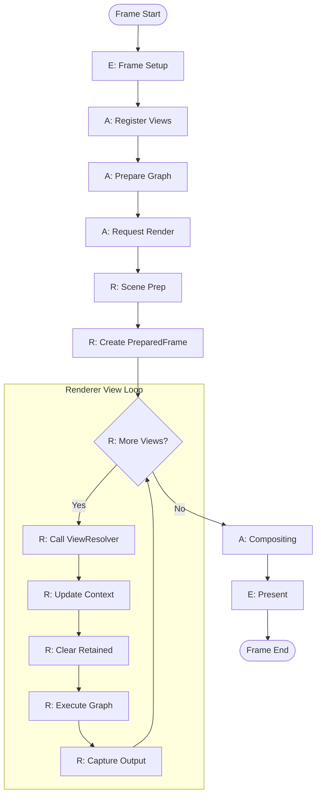

# Multi-View Rendering: Flow Diagrams

## High-Level Multi-View Frame Flow

### Flow Step Descriptions

| Step | Layer | Phase | Description |
|------|-------|-------|-------------|
| E: Frame Setup | Engine | kFrameStart | Clear registered views from previous frame |
| A: Register Views | Application | kFrameStart | Register View + ViewMetadata for each view in FrameContext |
| A: Prepare Graph | Application | kCommandRecord | Application prepares RenderGraph definition |
| A: Request Render | Application | kCommandRecord | Application calls Renderer with RenderGraph coroutine and ViewResolver callback |
| R: Scene Prep | Renderer | kCommandRecord | CPU culling, visibility filter, upload geometry/materials/transforms once |
| R: Create PreparedFrame | Renderer | kCommandRecord | Package uploaded resources with bindless indices once for all views |
| R: More Views? | Renderer | kCommandRecord | Check if more registered views remain to render |
| R: Resolve View | Renderer | kCommandRecord | Call ViewResolver(ViewId) to get resolved View from application |
| R: Update Context | Renderer | kCommandRecord | Set current_view_id and current_view in RenderContext |
| R: Clear Retained | Renderer | kCommandRecord | Clear current_view_retained_items for fresh per-view state |
| R: Execute Graph | Renderer | kCommandRecord | Execute render graph coroutine. **Check**: If pass is `ViewIndependent` and `view_index > 0`, skip execution. |
| R: Capture Output | RenderGraph | kCommandRecord | RenderGraph registers its output framebuffer(s) in `view_outputs` map. **Note**: Must ensure transient targets are resolved/copied if underlying storage is reused. |
| A: Compositing | Application | kCompositing | Combine multiple view_outputs into final presentation |
| E: Present | Engine | kPresent | Swapchain present and finalize platform submission bookkeeping |

---

**Document Status**: Draft
**Last Updated**: 2025-12-02
**Part of**: Multi-View Rendering Design Series
