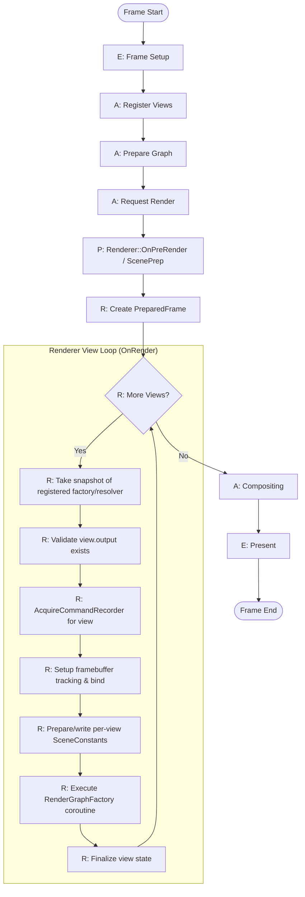

# Multi-View Rendering: Flow Diagrams

## High-Level Multi-View Frame Flow

### Flow Step Descriptions

| Step | Layer | Phase | Description |
|------|-------|-------|-------------|
| E: Frame Setup | Engine | kFrameStart | Clear registered views from previous frame |
| A: Register Views | Application | kFrameStart | Register View + ViewMetadata for each view in FrameContext |
| A: Prepare Graph | Application | kCommandRecord | Application prepares RenderGraph definition |
| A: Request Render | Application | kCommandRecord | Application calls Renderer with RenderGraph coroutine and ViewResolver callback |
| R: Scene Prep | Renderer | kCommandRecord | CPU culling, visibility filter, upload geometry/materials/transforms once |
| R: Create PreparedFrame | Renderer | kCommandRecord | Package uploaded resources with bindless indices once for all views |
| R: More Views? | Renderer | kCommandRecord | Check if more registered views remain to render |
| R: Resolve View / ScenePrep | Renderer | kPreRender / kCommandRecord | Run per-view scene prep (culling, drawlist), cache ResolvedView and PreparedSceneFrame in renderer maps (resolved_views_, prepared_frames_). The first view may run the frame-phase collection. |
| R: Validate Output | Renderer | kRender | Check `FrameContext::GetViewContext(view_id).output` — if missing the view is skipped (renderer logs and continues). |
| R: Acquire Recorder | Renderer | kRender | Acquire per-view `CommandRecorder` from Graphics (naming contains ViewId). Renderer takes a snapshot of registered factories before iterating so UnregisterView() is safe. |
| R: Setup Framebuffer | Renderer | kRender | Begin tracking resource states for attachments, require render states, flush barriers and bind framebuffer to recorder; set `RenderContext::framebuffer`. |
| R: Wire SceneConstants | Renderer | kRender | Write per-view SceneConstants using `SceneConstantsManager` and populate `RenderContext.current_view` with pointers to ResolvedView and PreparedSceneFrame. |
| R: Execute Render Graph | Renderer | kRender | Await the registered `RenderGraphFactory(view_id, rc, recorder)` coroutine; exceptions mark the view as failed. Renderer updates `view_ready_states_` to reflect success/failure. |
| R: Capture Output | RenderGraph | kRender | The render graph and passes may assume `RenderContext.framebuffer` is the target. Applications may choose to set `FrameContext::SetViewOutput()` or update `ViewContext::output` before `OnRender` — Renderer does not auto-populate FrameContext outputs. |
| A: Compositing | Application | kCompositing | Application modules compose multiple view outputs (offscreen textures) into final backbuffer. Examples call their own compositor and then explicitly call `FrameContext::SetSurfacePresentable()` for the swapchain surface when ready. |
| E: Present | Engine | kPresent | Swapchain present and finalize platform submission bookkeeping |

---

**Document Status**: Updated to match code
**Last Updated**: 2025-12-05
**Part of**: Multi-View Rendering Design Series
