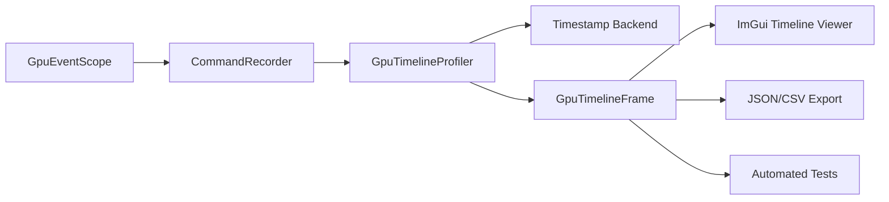
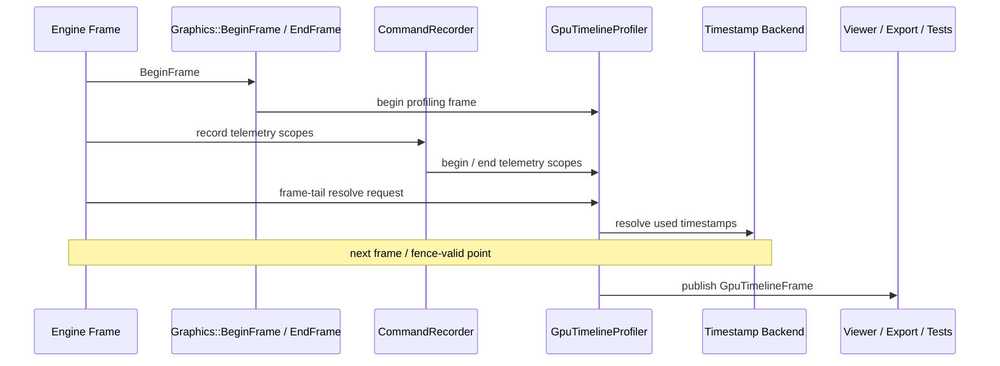

# Built-In GPU Timing Architecture

**Date:** 2026-04-14
**Status:** Architecture / Reference
**Owners:** Renderer + Graphics

This document defines the engine-owned GPU timing system that powers:

1. the in-engine GPU timeline viewer,
2. one-shot timing export,
3. stable per-frame GPU telemetry.

Related documents:

- `design/profiling/unified-profiling-architecture.md`
- `design/profiling/profiling-developer-guide.md`

## 1. Purpose

The built-in GPU timing system exists to provide a curated, structured view of GPU work for Oxygen itself.

It is intentionally different from Tracy:

1. Tracy is dense and exploratory,
2. the built-in GPU timing system is bounded and stable.

## 2. Design Goals

1. Record hierarchical GPU timings for stable engine scopes.
2. Preserve one public GPU scope API for render code.
3. Reuse a fixed per-frame query budget.
4. Fail predictably on overflow or incomplete scopes.
5. Keep renderer code free of backend timestamp details.
6. Ensure viewer and export are driven by the same published frame model.

## 3. Non-Goals

1. It is not a general-purpose GPU trace system.
2. It does not attempt to record every diagnostic GPU zone.
3. It does not expose backend query objects to renderer code.
4. It does not replace Tracy or external capture tools.
5. It does not provide cross-queue timing analysis in the current design.

## 4. System Role in the Wider Profiling Stack

The built-in GPU timing collector is one consumer inside the unified profiling architecture.

Its routing rule is simple:

1. `kTelemetry` GPU scopes are admitted,
2. `kDiagnostic` GPU scopes are rejected.

That rule preserves the built-in timeline as a stable engine telemetry surface.

## 5. Public Contract

Render code uses `GpuEventScope`.

Example:

```cpp
graphics::GpuEventScope scope(recorder, "Renderer.View",
  profiling::ProfileGranularity::kTelemetry,
  profiling::ProfileCategory::kPass,
  profiling::Vars(
    profiling::Var("id", view_id.get()),
    profiling::Var("name", view_name)));
```

The built-in GPU timing system consumes the shared scope metadata, but its identity and aggregation key are the base label only.

## 6. Architectural Components

### 6.1 Component View



### 6.2 Responsibilities

`CommandRecorder` owns:

1. logical GPU scope begin/end routing,
2. fan-out to collectors,
3. delivery of telemetry scopes to the built-in timing collector.

`GpuTimelineProfiler` owns:

1. telemetry scope admission,
2. hierarchy tracking,
3. per-frame budget enforcement,
4. frame-tail resolve coordination,
5. timeline frame publication,
6. export and diagnostics.

The backend owns:

1. timestamp query resources,
2. timestamp boundary writes,
3. one frame-tail bulk resolve,
4. queue timestamp frequency.

## 7. Core Contracts

### 7.1 Scope Admission Contract

| Scope type | Built-in GPU timing |
| - | -: |
| `kTelemetry` | admitted |
| `kDiagnostic` | rejected |

### 7.2 Identity Contract

The built-in GPU timing system:

1. uses the stable base label as the identity key,
2. does not use scope variables to increase telemetry cardinality,
3. keeps aggregation stable across frames.

### 7.3 Publication Contract

The published frame model contains:

1. frame sequence metadata,
2. used query-slot count,
3. overflow and diagnostic flags,
4. hierarchical telemetry scopes,
5. timing data suitable for viewer and export.

## 8. Frame Lifecycle

### 8.1 Frame Flow



### 8.2 Begin-of-Frame Responsibilities

At frame start, the system:

1. advances backend-owned profiling frame state,
2. finalizes the previous frame when valid,
3. resets per-frame telemetry collection state,
4. begins a new telemetry frame window.

### 8.3 During Recording

During GPU recording:

1. telemetry scopes allocate timing boundaries,
2. hierarchy is built as scopes nest,
3. the current frame's query budget is consumed,
4. no publication happens yet.

### 8.4 Frame Tail

At frame tail:

1. if no telemetry scopes were recorded, no resolve is needed,
2. otherwise one bulk resolve is issued for the used query range,
3. the frame becomes publishable once the queue/fence model guarantees validity.

## 9. Capacity and Overflow

The built-in GPU timing system is deliberately bounded.

The default per-frame scope budget is **4096 telemetry scopes**, configurable via `rndr.gpu_timestamps.max_scopes`.

Overflow contract:

1. once the frame budget is exhausted, further telemetry scope admission stops for that frame,
2. the frame is marked overflowed,
3. a diagnostic is emitted,
4. the next frame starts clean.

This behavior is architectural, not incidental. If you find the viewer showing an overflow diagnostic, raise `rndr.gpu_timestamps.max_scopes`.

## 10. Incomplete Scope Handling

If a telemetry scope is left open when the frame is finalized:

1. the scope is marked invalid,
2. a diagnostic is recorded,
3. hierarchy information is preserved,
4. invalid scope durations are excluded from valid timing aggregation.

## 11. Backend Contract

The built-in GPU timing architecture is backend-agnostic above the backend timing layer.

Any backend must provide:

1. timestamp boundary writes,
2. one frame-tail bulk resolve,
3. queue timestamp frequency,
4. validity under the engine's queue/fence model.

### 11.1 D3D12 Realization

For D3D12, the architecture maps to:

1. a timestamp query heap,
2. a CPU-readable readback buffer,
3. timestamp writes at scope boundaries,
4. a bulk resolve at frame tail,
5. queue timing frequency from the D3D12 command queue.

These are realization details, not renderer-facing contracts.

### 11.2 Future Backends

Future backends must preserve:

1. the same `GpuEventScope` contract,
2. the same telemetry-vs-diagnostic routing rule,
3. the same published timeline semantics,
4. the same stable identity rule.

## 12. Runtime Controls

The built-in GPU timing system is controlled through renderer console variables:

| CVar | Type | Default | Description |
| - | - | - | - |
| `rndr.gpu_timestamps` | bool | `false` | Enables or disables built-in GPU timing collection. |
| `rndr.gpu_timestamps.max_scopes` | uint | `4096` | Maximum telemetry scope slots per frame. Raise if per-frame overflow diagnostics appear. |
| `rndr.gpu_timestamps.viewer` | bool | `false` | Shows or hides the ImGui GPU timeline viewer panel. |
| `rndr.gpu_timestamps.export_next_frame` | string | `""` | Path for a one-shot frame export. File extension determines format: `.csv` produces CSV; any other extension (including `.json`) produces JSON. |

These controls belong to the built-in GPU timing system, not to Tracy.

## 13. Export Contract

Exports are a first-class consumer of the same published timeline frame used by the in-engine viewer.

High-level contract:

1. export consumes the published timeline model, not backend-private state,
2. export reflects the same hierarchy and validity rules as the viewer,
3. export remains limited to telemetry scopes because it is driven by the built-in collector.

Format selection is determined by the file extension supplied to `rndr.gpu_timestamps.export_next_frame`:

- `.csv` — comma-separated values with a timestamp-frequency header line.
- any other extension — JSON (use `.json` by convention).

Both formats include per-scope timing, hierarchy depth, validity, and frame sequence metadata.

## 14. Architectural Invariants

The following rules must remain true:

1. only `kTelemetry` GPU scopes appear in the built-in system,
2. the built-in identity key is the stable base label,
3. render code uses `GpuEventScope`, not backend timing primitives,
4. the collector is bounded per frame,
5. backend timestamp resources remain backend-owned,
6. viewer and export consume the same published model.

## 15. Validation Expectations

The architecture is healthy when:

1. telemetry scopes appear in the built-in viewer,
2. telemetry exports match viewer structure and timing semantics,
3. diagnostic scopes do not pollute the built-in timeline,
4. overflow and incomplete-scope behavior remain diagnosable,
5. renderer code remains free of backend timing API usage.

## 16. Summary

The built-in GPU timing system is Oxygen's curated GPU telemetry path.

It is:

1. frame-oriented,
2. bounded,
3. stable,
4. backend-agnostic at the renderer boundary,
5. narrower than Tracy by design,
6. the source of truth for the engine's own GPU timing viewer and structured exports.
