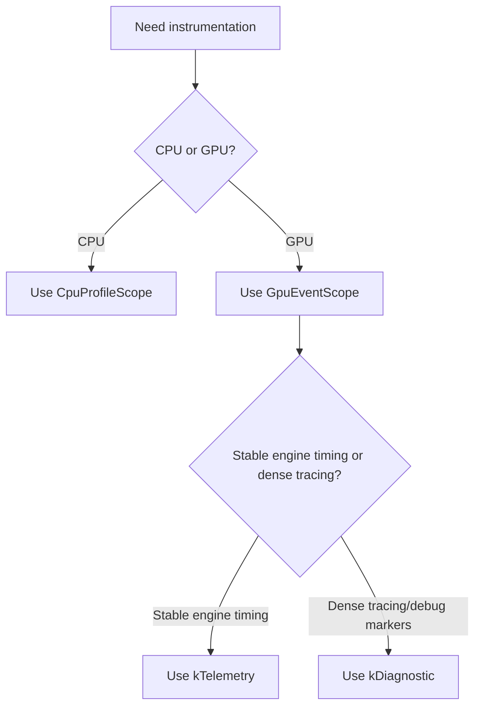

# Profiling Developer Guide

**Date:** 2026-04-14
**Audience:** engine and renderer developers

This guide explains how to use Oxygen's profiling system in practice:

1. built-in GPU timing,
2. Tracy CPU/GPU profiling,
3. native GPU debug markers for external tools.

Related documents:

- `design/profiling/unified-profiling-architecture.md`
- `design/profiling/built-in-gpu-timing-architecture.md`

## 1. Mental Model

Use the system like this:

1. `CpuProfileScope` for CPU work,
2. `GpuEventScope` for GPU work,
3. `kTelemetry` for stable engine timing scopes,
4. `kDiagnostic` for dense tracing and debug-marker scopes.

Rule of thumb:

| Consumer | What it sees |
| - | - |
| Built-in GPU timeline | only `kTelemetry` GPU scopes |
| Tracy | CPU scopes + `kTelemetry` GPU scopes + `kDiagnostic` GPU scopes |
| PIX / RenderDoc / Nsight | GPU labels; PIX may also see mirrored CPU scopes |

## 2. Build-Time Rule

The only Tracy feature switch you should reason about is:

- `OXYGEN_WITH_TRACY`

Do not invent module-local Tracy defines.

Do not link `TracyClient` outside `Oxygen.Tracy`.

## 3. Scope Selection

### 3.1 CPU Work

Use `CpuProfileScope` for:

1. frame orchestration,
2. command recording preparation,
3. scene preparation,
4. uploads and synchronization,
5. expensive CPU-side render setup.

Example:

```cpp
profiling::CpuProfileScope scope("Renderer.RecordView",
  profiling::ProfileCategory::kPass,
  profiling::Vars(
    profiling::Var("id", view_id.get()),
    profiling::Var("name", view_name)));
```

### 3.2 GPU Work

Use `GpuEventScope` for work recorded into a command list.

Example:

```cpp
graphics::GpuEventScope scope(recorder, "Renderer.View",
  profiling::ProfileGranularity::kTelemetry,
  profiling::ProfileCategory::kPass,
  profiling::Vars(
    profiling::Var("id", view_id.get()),
    profiling::Var("name", view_name)));
```

## 4. Telemetry vs Diagnostic

### 4.1 Pick `kTelemetry` When

The scope is:

1. a pass boundary,
2. a major renderer phase,
3. a stable budget you want in the built-in GPU timeline,
4. part of the engine's long-lived timing vocabulary.

Good examples:

1. `Renderer.View`
2. pass-level `RenderPass::GetName()`
3. `Renderer.CompositingTask`

### 4.2 Pick `kDiagnostic` When

The scope is:

1. a dense inner loop,
2. page or tile work,
3. a short-lived optimization probe,
4. too noisy for the built-in timeline but useful in Tracy and capture tools.

Good examples:

1. `VSM.MergePage`
2. per-job raster slices
3. narrow upload or synchronization probes

### 4.3 Decision Table

| Question | If yes | If no |
| - | - | - |
| Should this scope appear in the built-in GPU viewer/export? | `kTelemetry` | continue |
| Is this scope dense enough to explode the built-in timeline if repeated many times per frame? | `kDiagnostic` | likely `kTelemetry` |
| Is this mostly for deep optimization work in Tracy/capture tools? | `kDiagnostic` | likely `kTelemetry` |

### 4.4 Common Scenarios

| Scenario | Canonical instrumentation | Granularity | Naming pattern | Notes |
| - | - | - | - | - |
| Render pass boundary | `GpuEventScope` around pass execution, usually using `RenderPass::GetName()` | `kTelemetry` | pass name or stable pass label | This is the standard engine-visible GPU timing scope. |
| Major renderer phase or per-view render | `GpuEventScope` around the phase or view root | `kTelemetry` | stable phase label plus vars such as `view`, `id`, `name` | Use this when you want the scope in the built-in GPU viewer/export. |
| Hot shader / draw or dispatch hotspot | `GpuEventScope` around the owning draw/dispatch region | `kDiagnostic` | stable hotspot label plus vars for slice/job/material/view | You cannot instrument inside shader code with this API; bracket the GPU work region that owns the hotspot. |
| CPU-bound algorithm | `CpuProfileScope` around the algorithm body | n/a | stable algorithm label plus vars for problem size / mode / id | Use for culling, scene prep, sorting, upload planning, and similar CPU-heavy work. |
| Tracing a CPU-to-GPU flow | paired `CpuProfileScope` + `GpuEventScope` with matching base labels or shared variables | CPU: n/a, GPU: usually `kTelemetry` at the top level | shared labels / vars such as `view`, `frame`, `job`, `task` | This is the canonical way to correlate orchestration on CPU with execution on GPU in Tracy. |
| Upload or synchronization phase | `CpuProfileScope` for CPU orchestration, `GpuEventScope` for GPU-side execution if recorded | GPU side usually `kDiagnostic`, sometimes `kTelemetry` if it is a stable budget | stable `Upload.*` / `Sync.*` labels | Use `kTelemetry` only when the upload/sync stage is a stable engine budget worth tracking in the built-in timeline. |
| Temporary investigation / optimization probe | `CpuProfileScope` or `GpuEventScope` as appropriate, usually narrow and short-lived | GPU: usually `kDiagnostic` | stable probe label plus explicit vars | Prefer diagnostic scopes so the built-in GPU timeline stays clean. |

## 5. Naming Rules

### 5.1 Stable Base Label

The base label should normally be stable and human-readable.

Good:

```cpp
"Renderer.View"
"RenderPass.Execute"
"Environment.IblCompute"
```

Bad:

```cpp
fmt::format("Renderer.View {}", view_id)
```

### 5.2 Put Dynamic Detail in Variables

Use `Vars(...)` and `Var(...)` to attach up to **6 variables** per scope:

```cpp
profiling::Vars(
  profiling::Var("id", view_id.get()),
  profiling::Var("name", view_name))
```

Tool-visible result:

```text
Renderer.View[id=7,name=Main]
```

### 5.3 Existing Named Objects

If the object already owns a stable debug identity, reuse it.

Explicit example:

1. pass-level profiling should use `RenderPass::GetName()`
2. do not add a second profiling-only label to the pass

## 6. Categories and Colors

Categories are optional semantic hints:

1. `kPass`
2. `kCompute`
3. `kRaster`
4. `kUpload`
5. `kSynchronization`
6. `kGeneral`

Guidance:

1. choose category first,
2. add explicit color only when it adds durable value,
3. never rely on color for correctness or routing.

## 7. Built-In GPU Timing

The built-in GPU timing system is the engine's curated telemetry surface.

### 7.1 Runtime Controls

| CVar | Type | Default | Description |
| - | - | - | - |
| `rndr.gpu_timestamps` | bool | `false` | Enables or disables built-in GPU timing collection. |
| `rndr.gpu_timestamps.max_scopes` | uint | `4096` | Maximum telemetry scope slots per frame. Raise if overflow diagnostics appear in the viewer. |
| `rndr.gpu_timestamps.viewer` | bool | `false` | Shows or hides the ImGui GPU timeline viewer panel. |
| `rndr.gpu_timestamps.export_next_frame` | string | `""` | Path for a one-shot frame export. File extension determines format: `.csv` produces CSV; any other extension (including `.json`) produces JSON. |

### 7.2 What the Built-In Viewer Sees

The built-in viewer sees:

1. only `kTelemetry` GPU scopes,
2. stable scope identity based on the base label,
3. hierarchy and durations from the engine-owned telemetry collector.

It does not show:

1. CPU scopes,
2. `kDiagnostic` GPU scopes,
3. arbitrary Tracy-only trace density.

### 7.3 Export

Set `rndr.gpu_timestamps.export_next_frame` to a file path. The file extension determines the format:

- `.csv` — comma-separated values with a timestamp-frequency header.
- any other extension — JSON (use `.json` by convention).

The export reflects the same published built-in timeline model as the viewer. It includes per-scope timing, hierarchy, and validity.

## 8. Tracy

Tracy is the detailed tracing view.

### 8.1 What Tracy Sees

Tracy sees:

1. CPU scopes from `CpuProfileScope`,
2. GPU telemetry scopes,
3. GPU diagnostic scopes.

### 8.2 When to Prefer Tracy

Use Tracy when you need:

1. dense nested timing,
2. CPU/GPU correlation,
3. optimization detail beyond the built-in GPU viewer.

### 8.3 Ownership Rule

If you need new Tracy-specific functionality:

1. add it to `Oxygen.Tracy`,
2. consume it through `Oxygen.Tracy`,
3. keep one process-wide Tracy client.

## 9. Native GPU Markers

Native GPU markers are what PIX, RenderDoc, and Nsight consume.

### 9.1 D3D12

On D3D12, engine-owned GPU labels go through WinPixEventRuntime.

### 9.2 Expectations

GPU labels should appear in:

1. PIX,
2. RenderDoc,
3. Nsight Graphics.

Standalone CPU scopes are not expected in RenderDoc or Nsight.

## 10. Recommended Patterns

### 10.1 Stable Top-Level GPU Scope

```cpp
graphics::GpuEventScope scope(recorder, "Renderer.View",
  profiling::ProfileGranularity::kTelemetry,
  profiling::ProfileCategory::kPass,
  profiling::Vars(
    profiling::Var("id", view_id.get()),
    profiling::Var("name", view_name)));
```

### 10.2 Dense Diagnostic GPU Scope

```cpp
graphics::GpuEventScope scope(recorder, "VSM.MergePage",
  profiling::ProfileGranularity::kDiagnostic,
  profiling::ProfileCategory::kCompute,
  profiling::Vars(profiling::Var("page", logical_page)));
```

### 10.3 CPU / GPU Paired Names

```cpp
profiling::CpuProfileScope cpu_scope("Renderer.RecordView",
  profiling::ProfileCategory::kPass,
  profiling::Vars(profiling::Var("id", view_id.get())));

graphics::GpuEventScope gpu_scope(recorder, "Renderer.View",
  profiling::ProfileGranularity::kTelemetry,
  profiling::ProfileCategory::kPass,
  profiling::Vars(profiling::Var("id", view_id.get())));
```

## 11. Common Mistakes

Avoid:

1. formatting dynamic labels into the base label string,
2. using `kTelemetry` for dense per-item scopes,
3. exposing Tracy APIs directly in renderer or pass code,
4. adding profiling-only labels to objects that already have a stable debug name,
5. inventing new Tracy-specific compile defines,
6. linking `TracyClient` outside `Oxygen.Tracy`.

## 12. Practical Flow



## 13. Troubleshooting

### 13.1 Scope Missing from Built-In Viewer

Check:

1. the scope is GPU, not CPU,
2. the scope uses `kTelemetry`,
3. `rndr.gpu_timestamps` is enabled,
4. the built-in viewer is visible (`rndr.gpu_timestamps.viewer`) or an export is requested,
5. the per-frame budget has not been exhausted — if overflow diagnostics appear, raise `rndr.gpu_timestamps.max_scopes`.

### 13.2 Scope Missing from Tracy

Check:

1. the build uses `OXYGEN_WITH_TRACY`,
2. the process is actually connected to Tracy,
3. the scope is instrumented through `CpuProfileScope` or `GpuEventScope`,
4. for GPU scopes, the backend Tracy queue/context lifecycle is active.

### 13.3 Scope Missing from RenderDoc / PIX / Nsight

Check:

1. it is a GPU scope,
2. the backend native marker path is available,
3. the scope actually records GPU work on the captured queue.

## 14. Summary

If you remember only five rules, remember these:

1. `CpuProfileScope` for CPU, `GpuEventScope` for GPU.
2. `kTelemetry` for stable engine timing, `kDiagnostic` for dense tracing.
3. keep the base label stable and move dynamic parts into `Vars(...)`.
4. built-in GPU timing is curated; Tracy is detailed.
5. `Oxygen.Tracy` is the only owner of the Tracy client.
