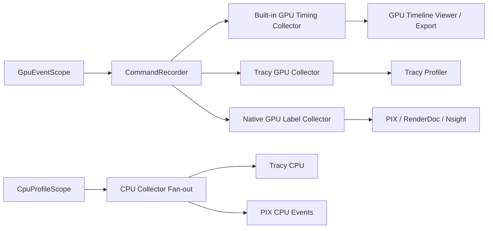
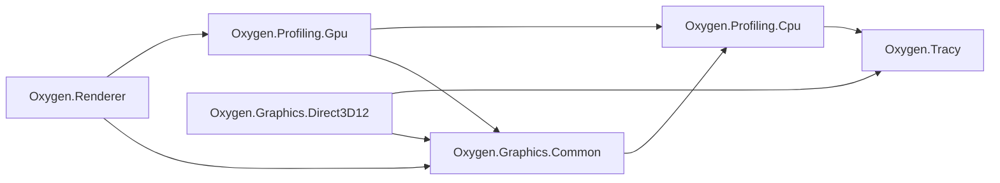
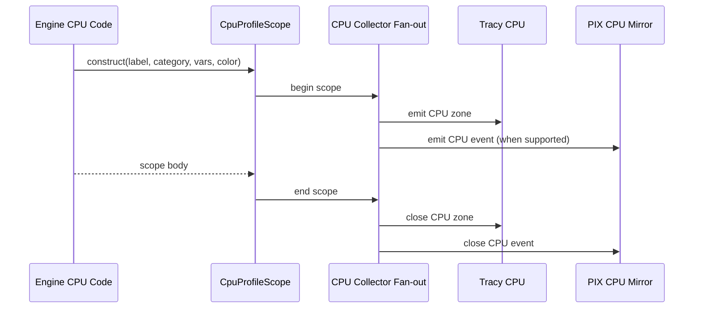
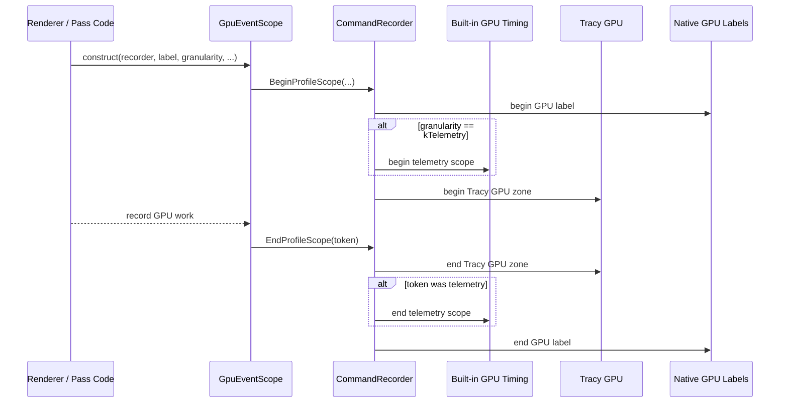

# Unified Profiling Architecture

**Date:** 2026-04-14
**Status:** Architecture / Reference
**Owners:** Renderer + Graphics

This document defines the engine-wide profiling architecture for:

1. built-in GPU telemetry,
2. Tracy CPU/GPU tracing,
3. native GPU debug labels for external tools.

Related documents:

- `design/profiling/built-in-gpu-timing-architecture.md`
- `design/profiling/profiling-developer-guide.md`

## 1. Purpose

Oxygen needs one profiling model that supports:

1. stable engine-owned GPU timing,
2. detailed CPU/GPU tracing in Tracy,
3. GPU debug labels visible in PIX, RenderDoc, and Nsight,
4. simple instrumentation for engine and renderer developers.

The architecture therefore separates:

1. one shared scope description model,
2. one public helper per execution domain,
3. multiple hidden collectors behind the same scope model.

## 2. Design Goals

1. One shared metadata model for CPU and GPU scopes.
2. One obvious helper per execution domain:
   - `CpuProfileScope`
   - `GpuEventScope`
3. Stable scope naming across built-in tools, Tracy, and native GPU label consumers.
4. Explicit routing between telemetry scopes and diagnostic scopes.
5. Clean backend boundaries: renderer code must not know about Tracy, PIX, D3D12, or Vulkan profiling APIs.
6. No duplicated profiling identity for objects that already expose a debugging identity.

## 3. Non-Goals

1. Do not expose Tracy macros or tool APIs to renderer or pass code.
2. Do not turn the built-in GPU timeline into an unbounded trace system.
3. Do not require category or color on every scope.
4. Do not create different public instrumentation APIs per tool or backend.
5. Do not add profiling-only labels to objects such as `RenderPass` that already have a stable debug name.

## 4. System Context

### 4.1 Consumer Roles

The architecture exists because different consumers want different outputs:

| Consumer | Primary role | Density |
| - | - | - |
| Built-in GPU timing | stable engine telemetry and export | curated |
| Tracy | dense CPU/GPU tracing and correlation | high |
| PIX / RenderDoc / Nsight | GPU command-stream labels | medium |

No single consumer replaces the others. The architecture must support all three roles without creating three public APIs.

### 4.2 High-Level Architecture

## 5. Canonical Scope Model

Every scope is described by:

1. a stable base label,
2. zero or more variables,
3. a granularity,
4. a category,
5. an optional color.

### 5.1 Scope Contract

| Field | Meaning | Contract |
| - | - | - |
| `label` | stable base identity | should normally be a stable literal or an existing stable object name |
| `variables` | dynamic per-instance detail | values are owned; keys are literal identifiers; up to 6 variables per scope |
| `granularity` | routing intent | required for GPU scopes; shared in the common model |
| `category` | presentation hint | optional semantic grouping |
| `color` | presentation hint | optional, never required for correctness |

### 5.2 Name Formation Contract

The formatted tool-visible name is derived from:

1. the base label,
2. the ordered variable list.

Rules:

1. no variables: `Label`
2. with variables: `Label[key=value,...]`
3. variable order is preserved exactly as supplied
4. variable values are escaped by the formatter
5. built-in GPU telemetry uses the base label only for identity and aggregation

### 5.3 Existing Named Objects

If an engine object already has a stable debugging identity, reuse it.

Explicit rule:

1. pass-level profiling uses `RenderPass::GetName()`
2. `RenderPass` must not carry a second profiling-only label field

## 6. Routing Contract

### 6.1 Granularity

`ProfileGranularity` communicates profiling intent:

1. `kTelemetry`
   - stable engine-visible timing scope
2. `kDiagnostic`
   - dense scope for tracing and native labels

### 6.2 GPU Routing Matrix

| GPU scope granularity | Built-in GPU timing | Tracy GPU | Native GPU labels |
| - | -: | -: | -: |
| `kTelemetry` | yes | yes | yes |
| `kDiagnostic` | no | yes | yes |

This routing rule is the central architecture boundary between engine telemetry and dense tracing.

### 6.3 CPU Routing Matrix

| CPU scope | Tracy CPU | PIX CPU events |
| - | -: | -: |
| any `CpuProfileScope` | yes when Tracy is enabled | yes where WinPixEventRuntime CPU mirroring is supported |

## 7. Public API Contract

### 7.1 CPU

CPU code uses `CpuProfileScope`.

Contract:

1. it is the engine-owned CPU profiling primitive,
2. it consumes the same scope metadata model as GPU scopes,
3. it captures source location automatically,
4. it does not require a `CommandRecorder`.

### 7.2 GPU

GPU code uses `GpuEventScope`.

Contract:

1. it is the engine-owned GPU profiling primitive,
2. it records one logical GPU scope through `CommandRecorder`,
3. it does not expose backend query or tool details,
4. it is the only renderer-facing GPU scope API.

## 8. Collector Boundaries

### 8.1 `Oxygen.Profiling`

`Oxygen.Profiling` is an umbrella module with two concrete sub-targets:

- `Oxygen.Profiling.Cpu` — the shared profiling vocabulary, `CpuProfileScope`, and the CPU collector fan-out. This is the compiled library.
- `Oxygen.Profiling.Gpu` — the `GpuEventScope` header-only interface. Depends on both `Oxygen.Profiling.Cpu` and `Oxygen.Graphics.Common`.

Most consumers link the umbrella `Oxygen.Profiling` target and get both.

### 8.2 `Oxygen.Graphics.Common`

Owns:

1. `CommandRecorder`,
2. GPU scope begin/end routing,
3. GPU collector contracts and scope token types (`GpuProfileScopeToken`, `IGpuProfileCollector`).

### 8.3 `Oxygen.Tracy`

Owns:

1. the single process-wide Tracy client linkage,
2. Tracy-specific CPU wrapper entry points,
3. Tracy-specific backend wrappers such as D3D12 GPU support.

### 8.4 Backend Modules

Backend modules own:

1. native label realization,
2. queue/context lifecycle integration,
3. backend-specific profiling mechanics,
4. no independent Tracy client ownership.

## 9. Module Relationship and Tracy Ownership Contract

### 9.1 Inter-Module Dependency View

The profiling architecture depends on keeping module boundaries explicit.

Interpretation:

1. `Oxygen.Tracy` is the only module that owns Tracy client linkage.
2. `Oxygen.Profiling.Cpu` consumes Tracy through `Oxygen.Tracy`, but does not own Tracy itself.
3. `Oxygen.Graphics.Common` depends on `Oxygen.Profiling.Cpu`, because the shared profiling vocabulary and CPU-side collector fan-out live there.
4. `Oxygen.Profiling.Gpu` is a GPU-facing facade layer on top of `Oxygen.Profiling.Cpu` and `Oxygen.Graphics.Common`.
5. Backend modules such as `Oxygen.Graphics.Direct3D12` consume `Oxygen.Tracy` and `Oxygen.Graphics.Common`, but must not own an independent Tracy client.
6. `Oxygen.Renderer` depends on `Oxygen.Profiling.Gpu` for the public GPU helper surface and on `Oxygen.Graphics.Common` for recorder/graphics primitives.

### 9.2 Dependency Rules

The architecture relies on these dependency rules:

1. `Oxygen.Profiling.Cpu` must not depend on `Oxygen.Graphics.Common` or any concrete graphics backend.
2. `Oxygen.Graphics.Common` owns GPU scope routing contracts and therefore depends on `Oxygen.Profiling.Cpu`, not on `Oxygen.Profiling.Gpu`.
3. `Oxygen.Profiling.Gpu` exists to expose the public GPU helper without owning recorder internals.
4. Backend modules may extend profiling behavior, but they do so through `Oxygen.Graphics.Common` and `Oxygen.Tracy`, not through renderer-visible backend-specific APIs.

### 9.3 Tracy Ownership Contract

This is a hard architectural rule.

1. `TracyClient` is linked exactly once per process.
2. In Oxygen that single owner is `Oxygen.Tracy`.
3. Other modules may include Tracy-facing wrapper headers, but they must not link `TracyClient` directly.
4. New Tracy-specific functionality must be added through `Oxygen.Tracy`, not by embedding another Tracy client in another DLL.

This rule exists to prevent split process state, dead listeners, and broken profiler attachment.

## 10. Native GPU Label Contract

### 10.1 D3D12

D3D12 engine-owned GPU labels use WinPixEventRuntime as the canonical label path.

That preserves:

1. PIX compatibility,
2. visibility in other D3D12 capture tools,
3. avoidance of deprecated raw D3D12 marker API usage.

### 10.2 Vulkan

Vulkan engine-owned GPU labels use `VK_EXT_debug_utils`.

The profiling model above the backend layer stays unchanged.

## 11. Lifecycle Flows

### 11.1 CPU Scope Flow

### 11.2 GPU Scope Flow

## 12. Validation Contract

The architecture is considered healthy when all of the following are true:

1. telemetry scopes appear in the built-in GPU timeline,
2. CPU scopes and GPU scopes appear in Tracy,
3. GPU labels appear in supported native capture tools,
4. diagnostic scopes stay out of the built-in GPU timeline,
5. scope naming remains consistent across consumers,
6. Tracy ownership stays single-client and process-wide.

## 13. Summary

The unified profiling architecture is:

1. one shared scope model,
2. one CPU helper,
3. one GPU helper,
4. one GPU routing layer,
5. one built-in GPU telemetry collector,
6. one process-owned Tracy client,
7. one native GPU debug-label contract per backend.

That gives Oxygen one coherent instrumentation model while still serving the different needs of:

1. engine telemetry,
2. dense tracing,
3. external graphics capture tools.
