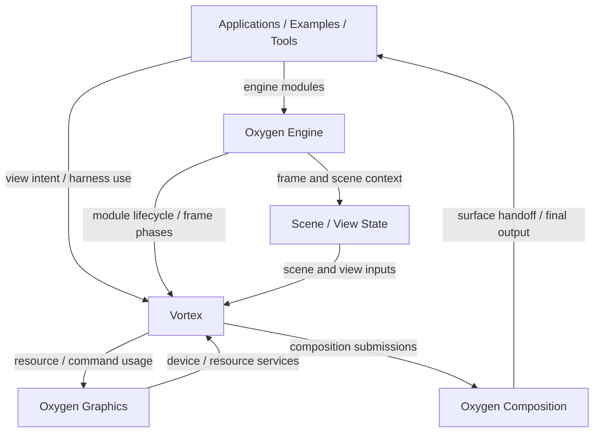
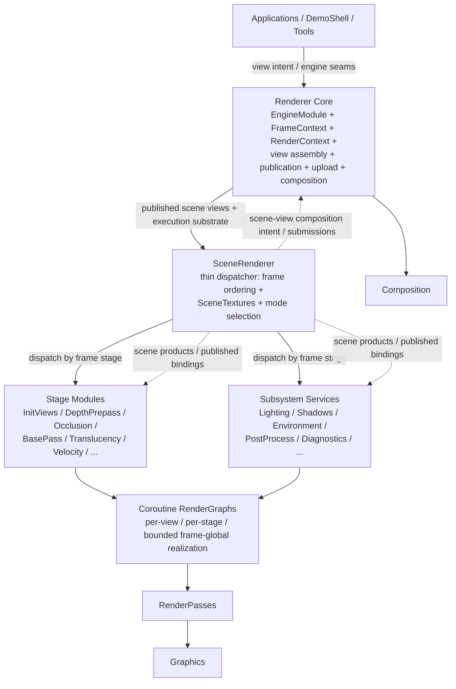
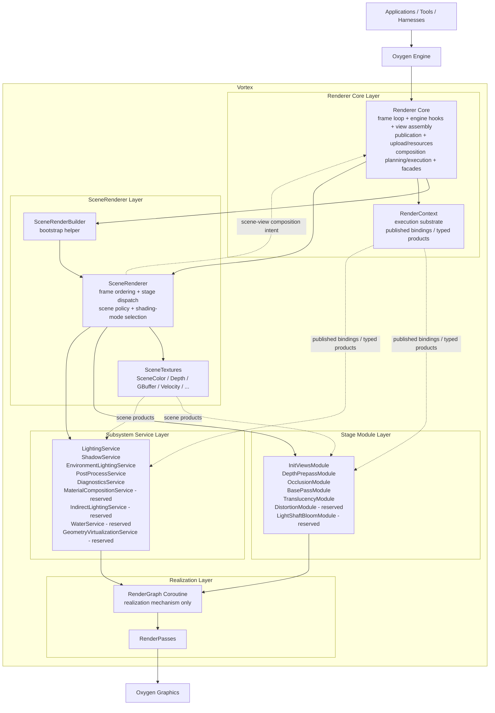
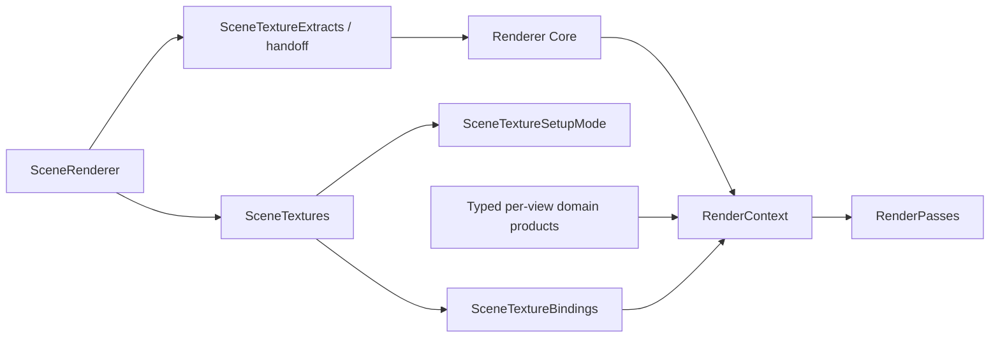
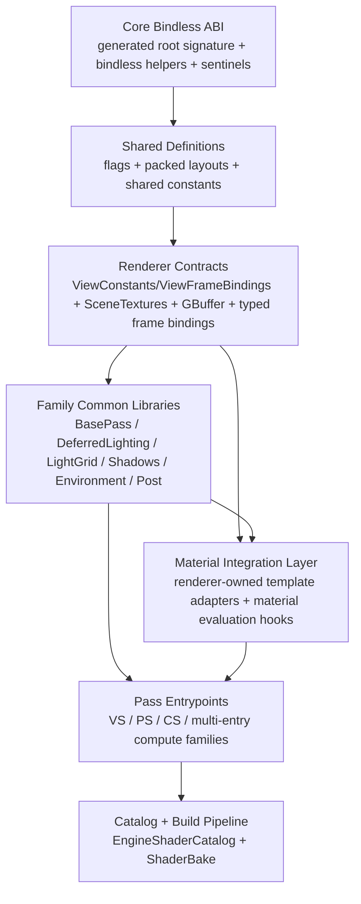

# Vortex Renderer Architecture

Status: `initial architecture baseline`

This document defines the stable conceptual architecture of the Vortex renderer
within the Oxygen engine. It specifies Vortex's layer model, ownership
boundaries, frame orchestration model, subsystem service structure, dependency
rules, and the way Vortex fits into Oxygen's engine, graphics, composition, and
render-graph execution substrate. It avoids implementation sequencing and
task-level planning.

Related:

- [PRD.md](./PRD.md)
- [DESIGN.md](./DESIGN.md)
- [PLAN.md](./PLAN.md)

Reference:

- [PROJECT-LAYOUT.md](./PROJECT-LAYOUT.md) — authoritative project layout
  reference
- UE 5.7 parity evidence is integrated directly into this document and the
  Vortex LLD set; there is no separate `parity-analysis.md` document in this
  package

## Mandatory Vortex Rule

- For Vortex planning and implementation, Vortex is the renderer architecture
   in scope. No alternate renderer product, fallback path, or reference
   implementation defines Vortex requirements or lowers its parity bar.
- Every Vortex task must be designed and implemented as a new Vortex-native
   system that targets maximum parity with UE5.7, grounded in
   `F:\Epic Games\UE_5.7\Engine\Source\Runtime` and
   `F:\Epic Games\UE_5.7\Engine\Shaders`.
- No Vortex task may be marked complete until its parity gate is closed with
   explicit evidence against the relevant UE5.7 source and shader references.
- If maximum parity cannot yet be achieved, the task remains incomplete until
   explicit human approval records the accepted gap and the reason the parity
   gate cannot close.

## Table of Contents

- [1. Purpose and Scope](#1-purpose-and-scope)
- [2. System Context in Oxygen](#2-system-context-in-oxygen)
- [3. Architecture Drivers](#3-architecture-drivers)
- [4. Architectural Principles and Ground Truths](#4-architectural-principles-and-ground-truths)
- [5. Architectural Model](#5-architectural-model)
- [6. Runtime Architecture](#6-runtime-architecture)
- [7. Data and Resource Architecture](#7-data-and-resource-architecture)
- [8. Subsystem Architecture](#8-subsystem-architecture)
- [9. Refinement Contract](#9-refinement-contract)
- [10. Shader Architecture](#10-shader-architecture)
- [11. Cross-Cutting Concerns](#11-cross-cutting-concerns)

## 1. Purpose and Scope

This document is the architectural contract for Vortex. It translates the
product intent in [PRD.md](./PRD.md) into stable architectural decisions that
designers, planners, and implementers can build against without re-opening
fundamental structure questions.

The intended consumers of this document are:

- designers defining concrete solution shapes for renderer subsystems
- planners decomposing Vortex into phases, milestones, and validation gates
- implementers building Renderer Core, SceneRenderer, services, passes, and
  data products inside the Oxygen engine

This document defines:

- where Vortex sits inside Oxygen and which engine/runtime surfaces it depends
  on
- the architectural identity of Vortex as one desktop scene renderer with a
  deferred-first contract
- what Vortex owns versus what the engine and shared substrate own
- how runtime layering, subsystem boundaries, data products, and dependency
  direction are organized
- which architectural constraints must remain true as design and implementation
  evolve

This document is authoritative for:

- responsibility allocation between Renderer Core, SceneRenderer, subsystem
  services, render graphs, and passes
- dependency direction and modularity boundaries
- the architectural shape of frame orchestration and scene-texture products
- the architectural rules that later design and planning artifacts must refine,
  not contradict

This document does not define:

- detailed solution design
- implementation sequencing or task breakdown
- low-level API surface design unless it is architecturally decisive
- temporary compatibility tactics that would weaken the target architecture

If a design or implementation proposal conflicts with this document, the
proposal must be revised or this document must be updated explicitly first.

## 2. System Context in Oxygen

Vortex is Oxygen's desktop renderer subsystem. It is not a standalone runtime
and it does not define a parallel application/rendering model. It lives inside
the Oxygen engine and participates through the same modular contracts that bind
other engine systems together.

At architectural level, Vortex exists at the intersection of:

- the engine module/lifecycle system
- the frame-phase execution model
- the frame/view context model
- the graphics/resource command substrate
- the composition and surface handoff model
- the application/tooling view-intent model

The purpose of this section is to define those relationships in terms of module
boundaries, ownership, and contract surfaces.

### 2.1 Oxygen Context Diagram

### 2.2 Integration Contracts

#### 2.2.1 Vortex and the Engine

Ownership:

- the engine owns process-level runtime coordination
- the engine owns frame/session lifetime
- the engine owns phase execution order
- the engine owns module registration and priority ordering
- the engine owns authoritative publication windows for frame-visible state

Contract:

- Vortex integrates as an `EngineModule`
- Vortex consumes `FrameContext`
- Vortex participates in rendering-oriented engine phases
- Vortex does not define a parallel scheduler or frame loop

#### 2.2.2 Vortex and Frame/View Context

Ownership:

- Oxygen owns canonical frame and scene/view context publication
- Vortex owns renderer-side realization of published views
- Vortex owns renderer-side per-view execution state

Contract:

- scene/view state enters Vortex through engine-published frame/view context
- view intent enters Vortex through renderer-facing descriptors and harness
  surfaces, not through direct draw-call submission
- Vortex consumes published view state and produces per-view render execution

#### 2.2.3 Vortex and Graphics

Ownership:

- Oxygen Graphics owns devices, queues, resources, command-recording substrate,
  and backend execution primitives
- Vortex owns renderer orchestration, scene-texture products, subsystem GPU
  work, and render-pass dispatch

Contract:

- Vortex is a client of Oxygen Graphics, not a replacement for it
- Vortex may define renderer-level resource products and usage policies, but it
  builds on the shared graphics substrate
- backend concerns remain below the Vortex architecture boundary

#### 2.2.4 Vortex and Composition

Ownership:

- Vortex owns renderer-side composition intent and submission generation
- Oxygen Composition owns coarse final-output assembly and surface handoff

Contract:

- Vortex produces composition submissions
- composition remains an engine-integrated handoff, not an application-managed
  renderer epilogue
- Vortex must fit Oxygen's multi-view and multi-surface composition model

#### 2.2.5 Vortex and Applications, Examples, and Tools

Ownership:

- applications/examples/tools own high-level view intent and usage scenarios
- Vortex owns renderer realization of that intent

Contract:

- applications do not drive Vortex through renderer-private orchestration
- they interact through Oxygen engine/module seams, view intent, and renderer
  services
- Vortex must remain usable by runtime modules, editor/tooling flows, and
  non-runtime harness consumers without inventing separate integration models

### 2.3 Architectural Implications

The Oxygen integration model imposes these architectural consequences on
Vortex:

1. Vortex must remain a first-class engine participant, not a detached
   renderer library.
2. Renderer Core must align with engine phases and `FrameContext`, because that
   is how Oxygen coordinates rendering work.
3. Applications and examples must continue to express rendering through view
   intent and engine/module seams rather than direct renderer-private control.
4. Composition remains a system boundary between renderer output and final
   presentation.
5. Non-runtime rendering surfaces remain part of the same Vortex architecture,
   not a parallel subsystem with unrelated ownership rules.

### 2.4 Context Summary

Within Oxygen, Vortex is:

- an engine-integrated renderer module
- a consumer of engine phases and frame/view context
- a producer of per-view render execution and composition work
- a desktop scene-rendering architecture built on Oxygen Graphics and
  Composition
- a subsystem reached through Oxygen's modular contracts, not through ad hoc
  renderer-private entry points

## 3. Architecture Drivers

The architecture in this document is driven by the Vortex PRD and by the way
rendering must operate inside Oxygen. These drivers explain why the
architecture is shaped the way it is; they are not themselves the detailed
rules of the architecture.

### 3.1 Deferred-First Desktop Identity

The dominant architectural driver is a deferred-first desktop scene contract.
Vortex is not a generic rendering playground and it is not a second attempt at
making Forward+ the architectural spine more flexible. The architecture must be
organized around:

- one desktop scene renderer identity
- deferred opaque rendering as the default desktop contract
- forward rendering retained only for special-case consumers such as
  translucency and forward-only materials
- frame orchestration shaped by the needs of a desktop deferred renderer rather
  than by the needs of a light-grid-first pipeline

All other architectural choices are subordinate to preserving this identity.

### 3.2 Oxygen-Native Integration

Vortex must fit into Oxygen as a native renderer subsystem, not as an isolated
rendering stack. This architecture is therefore driven by:

- engine-module participation rather than standalone runtime ownership
- `FrameContext` and engine phase integration rather than renderer-private frame
  scheduling
- Oxygen Graphics as the rendering substrate
- Oxygen Composition as the final-output handoff model
- application and tool integration through existing engine/view-intent seams

### 3.3 Hermetic Architectural Independence

Vortex must stand as an independent renderer architecture. That requirement
drives several structural decisions:

- Vortex-owned renderer module boundaries
- public API obligations shaped by Vortex's renderer needs
- one renderer ownership path with no bridge architecture or split ownership
- ownership and module boundaries shaped by current Vortex architecture rather
   than by unrelated subsystem constraints

### 3.4 Operational Integrity

The architecture must remain operationally strong, not just conceptually clean.
This drives Vortex toward:

- modular separation of concerns
- clean domain boundaries with no circular dependency pressure
- inspectable and debuggable renderer structure
- testable execution surfaces and subsystem seams
- maintainable subsystem growth over a long-lived engine program

These are not secondary quality goals. They are shaping forces on the
architecture.

### 3.5 Real Runtime Adoption Through Existing Seams

Vortex must be capable of real runtime adoption through Oxygen's existing
engine/module/view/composition seams. The architecture therefore needs to
support:

- runtime use by real applications and examples
- stable renderer realization behind Oxygen-native integration surfaces
- validation and refinement without temporary compatibility clutter becoming
   part of the target architecture

This is an architectural driver because it constrains how Vortex must expose and
realize integration surfaces inside Oxygen.

### 3.6 Phased Activation Toward a Full Desktop Target

Vortex is not being designed as a narrow phase-1 renderer with a permanently
reduced contract. The architecture is driven by:

- commitment to the full desktop scene-texture and subsystem target
- phased activation of that target without architectural rewrites
- reserved future slots for not-yet-active desktop systems
- growth by activation of already-accounted-for architecture rather than by
  later structural reinvention

## 4. Architectural Principles and Ground Truths

This section records the architectural truths that later design and
implementation work must treat as baseline.

### 4.1 Contextual Truths

These truths describe the environment Vortex exists within.

1. In Oxygen, the render graph is a coroutine.
2. `RenderContext` is the authoritative pass-execution context.
3. Passes are engine-authored and engine-delivered.
4. Pipelines are engine-authored production code.
5. `Composition` is the correct coarse-grained final-output assembly model in
   Oxygen.
6. Desktop-only. Mobile is excluded from this architecture.

### 4.2 Architectural Axioms

These are binding architectural laws for Vortex.

1. Vortex has one desktop scene renderer. It must not split into parallel
   renderer identities.
2. Deferred/GBuffer is the default desktop opaque scene contract.
3. Forward shading is a special-case path, not a co-equal desktop scene mode.
4. Clustered light-grid data is shared supporting infrastructure, not the frame
   architecture.
5. Renderer Core and SceneRenderer are distinct layers with different
   responsibilities and must remain distinct.
6. Subsystem services own domain-specific GPU work and domain-specific
   publication; Renderer Core must not absorb those concerns.
7. Passes are execution units, not hidden subsystem containers or alternate
   orchestration layers.
8. Architectural dependencies must flow downward and inward in a way that
   prevents circular ownership and circular module coupling.
9. Data products may cross subsystem boundaries; implementation ownership must
   not.
10. Reserved future desktop stages must remain architecturally accounted for
    even before they are active.
11. Vortex must remain hermetically self-contained at the renderer module,
   API-contract, and runtime-ownership levels.

## 5. Architectural Model

### 5.1 Architectural Identity

Vortex is Oxygen's desktop scene-rendering architecture — not a collection of
render passes and not a pipeline implementation. Its center of gravity is:

- **Renderer Core** — Oxygen-integrated execution substrate
- **`SceneRenderer`** — thin dispatcher owning the desktop frame structure
- **`SceneTextures`** — canonical scene-product contract
- **Subsystem services** — bounded domain work (active: Lighting, Shadows,
  Environment, PostProcess, Diagnostics; reserved: MaterialComposition,
  IndirectLighting, Water)

The dominant contract is **deferred-first**: GBuffer-backed opaque rendering is
the default desktop path. Forward shading is a special-case for translucency
and forward-only materials only. Data flows through `SceneTextures` and
published bindings — not through ownership coupling between subsystems. The
frame structure is a stable, renderer-owned 23-stage sequence (§6.2).

### 5.1.1 SceneRenderer and RenderGraph Positioning

There is no Pipeline layer. `SceneRenderer` is the single desktop renderer
authority — a thin dispatcher owning frame ordering, `SceneTextures`, and
mode selection, but not stage logic. `Renderer Core` is the scenario-agnostic
execution substrate below it (not the owner of deferred/GBuffer/shadow/
environment policy). Stage modules and subsystem services hold the actual
stage rendering logic. `RenderGraph` is a realization mechanism below all of
them, not the architectural frame owner. Scene-facing composition intent is
produced from the `SceneRenderer` layer, while `Renderer Core` owns composition
planning, queueing, target resolution, and compositing execution. Applications
and tools reach the renderer through Oxygen engine/module seams, view-intent
descriptors, and the stable non-runtime facades.

Role definitions:

- `SceneRenderer`
  owns the desktop frame structure, stage ordering, `SceneTextures`,
  mode selection, desktop scene configuration policy, and scene-view
  composition intent. Dispatches stage modules and subsystem services.
  Does not inline stage logic.
- `Stage Module`
  a bounded execution unit for one frame stage. Owns stage-specific passes,
  types, mesh processors, and execution logic. Dispatched by SceneRenderer.
  Lives in `SceneRenderer/Stages/`. No full lifecycle — executes within a
  frame phase.
- `Subsystem Service`
  a full-lifecycle domain service. Owns domain-specific passes, managers,
  types, and GPU work. Dispatched by SceneRenderer. Lives in its own
  top-level domain directory. Has `Initialize`/`OnFrameStart`/`Shutdown`
  lifecycle.
- `Renderer Core`
  owns engine-phase participation, `RenderContext`, view assembly and
  lifecycle, publication, upload, composition planning and queueing,
  composition target resolution, compositing execution, and non-runtime
  facades
- `RenderGraph`
  realizes rendering work as coroutine orchestration for a view, a tightly
  bounded stage slice, or other bounded frame-global work. It remains an
  execution mechanism, not a frame-ownership layer.

What each must not own:

- `SceneRenderer` must not own engine-module lifecycle, `FrameContext`
  publication policy, upload/bindless substrate, view assembly, the
  composition queue, composition target resolution, compositing execution, or
  stage-specific rendering logic
- `Stage Module` must not own frame ordering, SceneTextures allocation,
  or cross-stage policy decisions
- `Subsystem Service` must not own frame ordering, call back into
  SceneRenderer, or depend on other services' internals
- `Renderer Core` must not own deferred/GBuffer/shadow/environment
  orchestration, UE5-aligned desktop frame policy, scene-view composition
  policy, or `SceneTextures`
- `RenderGraph` must not own persistent renderer policy, app-facing settings,
  or cross-frame subsystem lifetime

### 5.1.2 RenderGraph: Coroutine Identity and UE5 Positioning

In Oxygen, the render graph is a C++ coroutine. This is a fundamental
architectural identity, not an implementation detail.

**What the Oxygen render graph is:**

- a coroutine-based execution primitive
- each render graph is a C++ coroutine containing imperative rendering logic
- the coroutine may suspend at pass boundaries and other explicit async/sync
  points; the coroutine scheduler drives execution
- render graphs are scoped to a view, a tightly bounded stage slice, or other
  bounded frame-global work
- the author has direct, deterministic control over rendering sequence
- resource transitions and barrier management are explicit in pass logic, not
  automatically inferred from a graph

**What the Oxygen render graph is not:**

- not a deferred-execution DAG builder
- not a graph compiler that optimizes barrier placement or reorders passes
- not a resource-lifetime or transition manager
- not the architectural owner of the desktop frame

**Comparison with UE5's `FRDGBuilder`:**

UE5 uses a deferred-execution dependency graph: passes and transitions are
declared, compiled, and executed with automatic barrier coalescing. Oxygen's
coroutine model is structurally different — logic is written imperatively in
declaration order with no deferred compilation step, trading automatic barrier
optimization for direct execution control. Both systems call their mechanism
a "render graph"; the execution semantics are fundamentally different.

**Architectural implications for Vortex:**

1. `SceneRenderer` defines the frame structure and stage ordering. `RenderGraph`
   defines how individual stage work executes within that order. Modifying a
   render graph does not change the frame structure.
2. Render graphs do not manage persistent state; cross-frame state belongs to
   `SceneRenderer`, subsystem services, or `Renderer Core`.
3. Render graphs are scoped and ephemeral: they may be per-view, per-stage, or
   other bounded frame-global coroutines, but they are created and consumed
   within a frame phase and do not become persistent architectural owners.

### 5.1.3 Detailed UE5 Architectural Mapping

| UE5 Architectural Family | Vortex Architectural Mapping | Architecture Note |
| --- | --- | --- |
| `DeferredShadingSceneRenderer` | `SceneRenderer` | Same architectural role: thin dispatcher owning frame ordering, `SceneTextures`, and mode selection. Does not inline stage logic. |
| `SceneRenderBuilder` | `SceneRenderBuilder` in `SceneRenderer/` | UE 5.7 literally uses `FSceneRenderBuilder` plus `CreateSceneRenderer(...)` during renderer bootstrap. In Vortex this remains a scene-layer bootstrap helper invoked by Renderer Core during initialization, not a second renderer layer. |
| `SceneVisibility` | `InitViewsModule` stage module in `SceneRenderer/Stages/InitViews/` | Owns stage-2 visibility orchestration, ScenePrep frame-shared collection dispatch, per-view prepared-scene publication, and culling task orchestration. Its local helper data may include compact visibility projections, but the canonical downstream publication contract is the per-view prepared-scene payload. ~6.5k lines in UE5. |
| `SceneTextures` | `SceneTextures` | Same architectural role: canonical scene product family owned by the scene renderer. |
| `SceneTextureParameters` | `SceneTextures` bindings via `RenderContext` and shader-binding helpers | Same architectural role, different Oxygen packaging; parameter exposure is a binding/publication concern, not a separate architectural tier. |
| `DepthRendering` | `DepthPrepassModule` stage module in `SceneRenderer/Stages/DepthPrepass/` | Owns depth-only passes, mesh processor, dithered-mask passes, and partial depth products. Produces `SceneDepth` and `PartialDepth`. Under the current desktop deferred opaque-velocity policy, it does not publish opaque `SceneVelocity`; future depth-pass velocity remains a policy option only. ~1.35k lines in UE5. |
| `VelocityRendering` | policy-driven opaque velocity in `BasePassModule` plus future late translucent/distortion handling | Motion-vector work is not a standalone Vortex stage module. `SceneVelocity` in `SceneTextures` is the authoritative product. The current Phase 3 desktop deferred policy writes opaque motion vectors in `BasePassModule`, while stage 19 remains the reserved owner for late translucent/distortion velocity. Depth-pass opaque velocity remains a future policy option, not the active desktop deferred contract. ~1.34k lines in UE5. |
| `SceneOcclusion` / HZB | `ScreenHzbModule` plus `OcclusionModule` stage modules | `ScreenHzbModule` owns generic closest/furthest Screen HZB production, publication, and HZB history. `OcclusionModule` consumes the furthest HZB, owns HZB occlusion tests/readback, and publishes per-view prepared-draw visibility. ~2.3k lines in UE5. |
| `BasePassRendering` | `BasePassModule` stage module in `SceneRenderer/Stages/BasePass/` | Owns GBuffer MRT passes, masked/opaque base-pass permutations, base-pass mesh processor, base-pass shader families, base-pass uniform setup, and the active opaque `SceneVelocity` producer path. The production target is UE5.7-grade opaque velocity parity for masked, deformed, skinned, and WPO-capable content backed by previous transform/deformation data plus previous view history. ~3.35k lines in UE5. |
| `LightGridInjection` | `LightingService` shared light-grid stage | Same architectural role, explicitly demoted from frame spine to shared supporting subsystem. |
| `CompositionLighting` (pre-base-pass) | reserved `MaterialCompositionService` pre-base-pass stage | UE 5.7 really has `FCompositionLighting::ProcessBeforeBasePass(...)`. UE's family spans deferred decals and AO-related work. Vortex intentionally maps only the material-surface modification subset here. |
| `CompositionLighting` (post-base-pass) | reserved `MaterialCompositionService` post-base-pass stage | UE 5.7 really has `FCompositionLighting::ProcessAfterBasePass(...)`. Vortex keeps deferred decal application and material classification here, while AO remains owned by `IndirectLightingService`. |
| `LightRendering` | `LightingService` deferred direct-lighting stage | Same role: consume GBuffers, shadows, and direct-light data. Owns the permanent bounded-volume point/spot proxy geometry and deferred-light shader families. The Phase 03 `SV_VertexID` procedural point/spot proxy generation is temporary delivery scaffolding only and must be removed during Phase 4A when CPU-side ownership moves into `LightingService`. If an early capability phase needs a bounded environment-ambient bridge before stage 13 exists, that exception must be documented explicitly and must not redefine stage 12 as the canonical indirect-light owner. ~3.3k lines in UE5. |
| `IndirectLightRendering` | reserved `IndirectLightingService` stage | GI, reflections, SSR, subsurface scattering, and canonical skylight / indirect environment evaluation. Owns AO framework, indirect/reflection shader families, temporal history. Produces `ScreenSpaceAO` into `SceneTextures`. Consumes environment-owned probe / IBL products published by `EnvironmentLightingService`. Static specified-cubemap SkyLight activation begins as VTX-M08, with environment-owned static SkyLight products separated from later captured-scene and reflection-probe work. ~3.6k lines in UE5. |
| `ShadowDepthRendering` + `ShadowRendering` | `ShadowService` | Same split between shadow-map production and later lighting consumption. |
| `SkyAtmosphereRendering` + `FogRendering` + `SkyPassRendering` | `EnvironmentLightingService` | Same family role, grouped under one Oxygen service for bounded ownership. VTX-M08 adds the architectural split between a visual skybox/SkyPass-style SceneColor background and specified-cubemap SkyLight products consumed by lighting/indirect-lighting paths. |
| `VolumetricFog` + `VolumetricCloudRendering` | `EnvironmentLightingService` Stage 14 volumetric family | UE 5.7 splits this area across `ComputeVolumetricFog(...)`, `RenderHeterogeneousVolumes(...)`, and `RenderVolumetricCloud(...)`. Vortex groups atmosphere-adjacent volumetric stages under Environment ownership. Volumetric fog is active Phase 4D scope and remains in progress; volumetric clouds and heterogeneous volumes remain future. |
| `TranslucentLighting` + `TranslucentRendering` | `TranslucencyModule` stage module in `SceneRenderer/Stages/Translucency/` | Owns separate translucency dimensions/resources, composition/upscale helpers, translucency mesh passes. Forward-lit using `LightingService` shared forward data. ~1.77k lines in UE5. |
| `DistortionRendering` | reserved `DistortionModule` stage module in `SceneRenderer/Stages/Distortion/` | Owns distortion mesh processor, distortion shader families, intermediate-resource handling. ~1.1k lines in UE5. Activates as a stage module when implemented. |
| `LightShaftRendering` | reserved `LightShaftBloomModule` stage module in `SceneRenderer/Stages/LightShaftBloom/` | Owns light-shaft screen-pass pipeline, downsample/blur/apply shaders, temporal history integration. ~610 lines in UE5. Activates as a stage module when implemented. |
| `SingleLayerWaterRendering` | reserved `WaterService` stage | Committed to a future `WaterService` when activated. |
| `PostProcessing` | `PostProcessService` | Same architectural role. |
| `SceneExtensions` | reserved post-opaque extension stage under `SceneRenderer` | UE 5.7 exposes this through `RenderPostOpaqueExtensions(...)` / `RenderOverlayExtensions(...)`. Vortex keeps the same architectural slot but not as a plugin ecosystem. |

Oxygen-only architectural families with no strict UE top-level peer:

- `Renderer Core`
  Oxygen substrate below the renderer, owning engine hooks, `RenderContext`,
  view assembly, publication, upload, facades, and composition planning,
  queueing, target resolution, and compositing execution

Reserved future service families with committed ownership:

- `GeometryVirtualizationService` — reserved owner of stage 4
  (Nanite-equivalent geometry virtualization, streaming, and related
  stateful services). The stage slot is preserved even while the service is
  inactive.
- `MaterialCompositionService` — owns material-surface modification stages 7
  and 11 (DBuffer decals, material classification, deferred decal
  application). This is surface modification, not illumination, and must never
  be conflated with `LightingService`.
- `IndirectLightingService` — owns stage 13 (GI, reflections, SSR, subsurface
  scattering, SSAO production). Consumes IBL data from
  `EnvironmentLightingService` as a product. Distinct from direct lighting.
- `WaterService` — owns stage 16 (single-layer water, caustics). Separate
  from generic translucency.

Allowed architectural differences:

- Oxygen uses coroutine render graphs rather than UE5's `FRDGBuilder`
- Oxygen uses its own engine phase model and module system
- Oxygen uses its own graphics abstraction and bindless-oriented resource model
- Oxygen names and packages subsystems in a way that fits Oxygen module
  boundaries, even when the architectural role aligns with UE5

### 5.1.3.1 Static Cubemap Skybox And SkyLight Split

UE5.7 separates the visual sky surface from the SkyLight lighting products:

- skybox-style visuals are sky materials processed by `SkyPassRendering` and
  drawn to SceneColor as background content
- procedural sky/atmosphere rendering is handled by `SkyAtmosphereRendering`
  and composes before fog in the deferred path
- static specified-cubemap SkyLight starts from a `USkyLightComponent`
  `SLS_SpecifiedCubemap` source, then exposes renderer products for diffuse
  environment lighting and later specular/reflection consumers

Vortex therefore treats these as related but distinct products:

- exactly one authored environment source is selected as the full-frame visible
  sky background for a view unless a later milestone adds explicit sky
  blending or layering
- `SkySphere` / skybox visual authoring controls the cubemap-background path
  owned by `EnvironmentLightingService` Stage 15
- procedural `SkyAtmosphere` remains the procedural-background owner when that
  mode is selected, and can still provide atmosphere/fog/aerial-perspective
  participation according to the authored environment policy
- `SkyLight` specified-cubemap authoring controls environment lighting
  products generated by an environment-owned processing step
- the visual skybox texture may be the same imported cubemap asset used by
  SkyLight, but Vortex must not sample the visual texture directly as diffuse
  SkyLight and call that parity
- directional sun lights remain scene-lighting and procedural-atmosphere inputs;
  they do not illuminate a static cubemap skybox image or move a baked sun
  inside that image
- static cubemap SkyLight diffuse lighting can feed the existing deferred
  lighting path during VTX-M08 through a documented environment-product
  boundary; full specular reflection and reflection-capture ownership remains a
  later `IndirectLightingService` / reflection-resource expansion unless
  explicitly pulled into scope

This split preserves the UE5.7 architecture while keeping Oxygen's current
ownership boundaries: importer/cooker create and validate cubemap assets,
Environment owns sky/background and SkyLight product publication, Lighting can
consume the diffuse product through a bounded VTX-M08 integration, and future
Indirect Lighting owns broader GI/reflection behavior. Exact product layouts,
filtering algorithms, coefficient packing, shader bindings, and validation
probes belong in the VTX-M08 LLDs, not in this architecture document.

### 5.1.4 Detailed Renderer Flow Mapping

| # | UE5 Flow Stage | Vortex Flow Stage | Owner | Integration Note |
| --- | --- | --- | --- | --- |
| 1 | `SceneRenderBuilder` / scene renderer bootstrap | Renderer Core bootstrap invokes `SceneRenderBuilder` | Renderer Core | UE 5.7 uses `FSceneRenderBuilder` and `CreateSceneRenderer(...)` during bootstrap. Vortex mirrors the bootstrap role without making this a per-frame scene stage. |
| 2 | `BeginInitViews` / `SceneVisibility` | `InitViewsModule::Execute` | InitViewsModule | Visibility, scene traversal dispatch via `ScenePrep/`, per-view prepared-scene publication, and culling task orchestration. Renderer Core provides scenario-agnostic view registration and context allocation. |
| 3 | `RenderPrePass` / optional opaque velocity policy slot | `DepthPrepassModule::Execute` | DepthPrepassModule | Produces `SceneDepth` and `PartialDepth`. Under the current desktop deferred opaque-velocity policy it does not publish opaque `SceneVelocity`; depth-pass velocity remains a future policy option only. |
| 4 | `RenderNanite` / virtualized geometry slot | reserved `GeometryVirtualizationService` stage | future GeometryVirtualizationService | Preserved architecturally even while inactive. |
| 5 | `RenderOcclusion` / HZB | `ScreenHzbModule::Execute` then `OcclusionModule::Execute` | ScreenHzbModule / OcclusionModule | Screen HZB generation and history are owned by `ScreenHzbModule`; occlusion tests/readback and visibility publication are owned by `OcclusionModule`. |
| 6 | `PrepareForwardLightData` / `ComputeLightGrid` / `LightGridInjection` | `LightingService::BuildLightGrid` | LightingService | UE 5.7 builds forward light data and the light grid here. Vortex keeps the same shared-data role without making it the frame root. |
| 7 | `CompositionLighting::ProcessBeforeBasePass` | reserved `MaterialCompositionService::PreBasePass` | future MaterialCompositionService | UE stage family includes deferred decals and AO-adjacent work. Vortex maps only the material-surface modification subset here. |
| 8 | `FinishInitDynamicShadows` / `RenderShadowDepthMaps` | `ShadowService::RenderShadowDepths` | ShadowService | Shadow-map production stays distinct from lighting use. |
| 9 | `RenderBasePass` | `BasePassModule::Execute` | BasePassModule | GBuffer MRT writes, masked/opaque alpha-tested deferred shading, emissive accumulation, and the full opaque `SceneVelocity` producer chain for masked, deformed, skinned, and WPO-capable content. Stage 9 includes the primary base-pass velocity write plus any required motion-vector-world-offset auxiliary path and merge/update step before completion. Deferred default, forward branch only where allowed. |
| 10 | Rebuild scene textures with GBuffers | inline `SceneRenderer::PublishDeferredBasePassSceneTextures(ctx)` (invokes `SceneTextures::RebuildWithGBuffers()`) | SceneRenderer | ~50 lines. SceneRenderer-owned state transition plus canonical scene-texture publication boundary, not a standalone module. `SceneTextures::RebuildWithGBuffers()` is only the family-local validation helper inside the stage. `SceneColor` and the active GBuffers become consumable only after the full rebuild/promote/refresh/republish seam runs. `SceneVelocity` becomes publishable only after the full stage-9 producer chain, including any auxiliary merge/update work, completes. |
| 11 | `CompositionLighting::ProcessAfterBasePass` | reserved `MaterialCompositionService::PostBasePass` | future MaterialCompositionService | UE stage family includes deferred decals plus AO-adjacent work. Vortex keeps deferred decal application and material classification here; AO remains with `IndirectLightingService`. |
| 12 | `RenderLights` | `LightingService::RenderDeferredLighting` | LightingService | Fullscreen/bounded deferred direct lighting. |
| 13 | `RenderDeferredReflectionsAndSkyLighting` / `AddSubsurfacePass` | reserved `IndirectLightingService::Execute` | future IndirectLightingService | UE 5.7 splits this family across indirect/reflection and subsurface passes. Vortex keeps the family under one future indirect-lighting owner. VTX-M08 may introduce static cubemap SkyLight products and diffuse consumption before the full Stage-13 family activates; that is a documented narrow SkyLight activation, not broad GI/reflection closure. |
| 14 | `ComputeVolumetricFog` / `RenderHeterogeneousVolumes` / `RenderVolumetricCloud` | `EnvironmentLightingService` local/volumetric fog stages | EnvironmentLightingService | UE splits this stage family across multiple volumetric systems. Vortex groups the stage family under Environment ownership. Volumetric fog is active but not parity-closed; clouds and heterogeneous volumes remain future. |
| 15 | `RenderSkyAtmosphere` / `RenderFog` / sky pass background | `EnvironmentLightingService::RenderSkyAndFog` | EnvironmentLightingService | Same high-level environment role in Vortex. VTX-M08 adds a skybox/SkySphere background path that writes SceneColor as unlit sky content and remains separate from SkyLight lighting products. |
| 16 | `RenderSingleLayerWater` | reserved `WaterService::Execute` | future WaterService | Separate stage and service, not folded into generic translucency. |
| 17 | `RenderPostOpaqueExtensions` / scene extensions | reserved post-opaque extension stage | SceneRenderer | Reserved for future extensions and tools, aligned to UE's scene-extension hook point rather than a monolithic subsystem. |
| 18 | `RenderTranslucency` | `TranslucencyModule::Execute` | TranslucencyModule | Forward-lit translucency consuming prior opaque products and shared forward light data from `LightingService`. |
| 19 | `RenderDistortion` / translucent `RenderVelocities` | reserved `DistortionModule::Execute` | future DistortionModule | Distortion mesh processing, intermediate resources, and late translucent velocity production when required. |
| 20 | `RenderLightShaftBloom` / translucency upscale | reserved `LightShaftBloomModule::Execute` | future LightShaftBloomModule | Post-translucency image-space light-shaft effects and related upscale work. |
| 21 | `AddResolveSceneColorPass` | `ResolveSceneColor` file-separated method | SceneRenderer | ~180 lines. Implemented in a dedicated file, not a standalone module. Already active in the current Vortex runtime path. |
| 22 | Post processing | `PostProcessService::Execute` | PostProcessService | Tone map, exposure, AA/TSR slot (consumes `SceneVelocity`), bloom, debug post. |
| 23 | `OnRenderFinish` / `QueueSceneTextureExtractions` | `PostRenderCleanup` file-separated method | SceneRenderer | SceneRenderer-owned post-render cleanup stage that invokes Renderer Core extraction/handoff helpers for history export, cleanup, and handoff completion. Already active in the current Vortex runtime path. |

### 5.2 Layer Model

The Vortex layer model is best understood as an ownership and dependency
diagram rather than as a taxonomy table. The diagram below is the authoritative
structural view of Vortex itself.

Reading rules:

- Solid arrows show ownership, construction, dispatch, or realization
  direction.
- Dashed arrows show shared data products and published bindings.
- `Renderer Core` is the Oxygen-integrated substrate boundary; it does not own
  desktop scene policy.
- `SceneRenderer` is the desktop frame owner; it dispatches stages and
  services but does not absorb their internal logic.
- Orchestration-only stages such as `InitViews` may remain above the
  `RenderGraph` block; only render-capable work enters RDG realization.
- `RenderGraph` and `RenderPass` sit below orchestration layers as realization
  mechanisms only.

## 6. Runtime Architecture

This section defines runtime semantics. Canonical UE-to-Vortex naming lives in
§5.1.4. Dependency boundaries live in §5.1.1 and §5.2. The purpose of this
section is to state how the runtime actually behaves: when each kind of work
occurs, at what scope it runs, when it may enter `RenderGraph` realization, and
where persistent state is allowed to live.

### 6.1 Runtime Execution Scopes

Runtime scopes:

| Scope | Primary Owner | Frequency | Meaning | Enters `RenderGraph` |
| --- | --- | --- | --- | --- |
| bootstrap / renderer setup | `Renderer Core` + `SceneRenderBuilder` | initialization or reconfiguration | construct and wire one desktop `SceneRenderer` | no |
| frame/session integration | `Renderer Core` | once per frame | engine hooks, `RenderContext` allocation, view assembly/publication, upload staging, composition execution | no |
| stage orchestration | `SceneRenderer` | once per frame | choose active stages, enforce canonical order, dispatch stage modules and services | no |
| orchestration-only stage work | `SceneRenderer` or stage/service owner | per stage | visibility prep, state transitions, resolve/cleanup, dispatch decisions | not required |
| render-capable stage work | stage module or subsystem service | per stage, sometimes per view | actual rendering / compute work for that stage | yes, when the stage emits pass work |
| post-render handoff | `SceneRenderer` using `Renderer Core` helpers | once per frame | scene-color resolve, history export, extraction, handoff completion | optional |

### 6.2 Runtime Stage Contract

The runtime contract is the authoritative per-stage behavior. The stage numbers
are fixed. A stage may be active, stubbed, conditional, or split internally,
but its architectural position must not move.

| # | Stage | Primary Scope | Primary Owner | Runtime Realization | UE 5.7 Check | Oxygen Check | Vortex Architecture Finding |
| --- | --- | --- | --- | --- | --- | --- | --- |
| 1 | scene renderer bootstrap / frame setup | bootstrap | `Renderer Core` | no RDG | `FSceneRenderBuilder` + `CreateSceneRenderer(...)` are real bootstrap-time UE terms, not normal frame passes | Oxygen already keeps engine-module lifetime and renderer bootstrap outside per-frame stage dispatch | Keep bootstrap outside the 23-stage render work; treat this as a pre-frame bootstrap anchor rather than a normal runtime render stage |
| 2 | InitViews | per frame with per-view outputs | `InitViewsModule` | orchestration-first; may dispatch render work later | `BeginInitViews(...)` and `SceneVisibility` are real UE families | Oxygen already separates view publication/planning from per-view graph realization and keeps orchestration above render-graph execution | Keep as a first-class orchestration stage above RDG in Vortex |
| 3 | depth prepass and early velocity | per view | `DepthPrepassModule` | render-capable | UE runs `RenderPrePass(...)`; opaque velocity can be early depending on policy | Oxygen already carries depth-prepass completeness/state tracking and view-scoped depth orchestration patterns | Strong alignment; Vortex should keep depth and early velocity coupled at stage-family level |
| 4 | geometry virtualization slot | conditional / reserved | future `GeometryVirtualizationService` | reserved | UE uses Nanite / `RenderNanite(...)` as a real stage family | Oxygen has no active virtualization family today, so reservation must be an explicit Vortex architecture commitment | Correctly reserved as a future stateful service, not a SceneRenderer detail |
| 5 | occlusion and HZB | per view with history | `OcclusionModule` | render-capable | UE runs `RenderOcclusion(...)` plus HZB-related work | Oxygen already has HZB build and per-view history patterns that support a dedicated occlusion stage | Keep as its own stage module with per-view history/state |
| 6 | forward light data / light grid | per frame shared product | `LightingService` | render-capable | UE uses `PrepareForwardLightData(...)`, `ComputeLightGrid(...)`, `LightGridInjection` | Oxygen already builds shared light-culling/light-grid data; Vortex repositions that capability as shared support rather than the frame spine | Vortex should demote this to shared supporting data, not frame architecture |
| 7 | before-base-pass material composition | conditional / reserved | future `MaterialCompositionService` | render-capable when active | UE has `FCompositionLighting::ProcessBeforeBasePass(...)`; family includes decals and AO-adjacent work | Oxygen has no current material-composition family, so ownership must start cleanly under Vortex | Correct to reserve as a separate material-surface domain; do not fold into lighting |
| 8 | shadow depth / shadow setup | per frame shared product | `ShadowService` | render-capable | UE uses `FinishInitDynamicShadows(...)` and `RenderShadowDepthMaps(...)` before later lighting use | Oxygen already uses dedicated shadow-domain managers and pass families for shared shadow products | Keep as a shared-product service separate from lighting evaluation |
| 9 | base pass | per view | `BasePassModule` | render-capable | UE has `RenderBasePass(...)` as a major family boundary | Oxygen already separates opaque material execution from later transparency, but Vortex defines opaque as deferred GBuffer production | Correct Vortex spine: this becomes the canonical opaque material stage |
| 10 | rebuild scene textures with GBuffers | per frame state transition | `SceneRenderer` | no RDG | UE updates `SceneTextures.SetupMode` / uniform buffers after GBuffer activation rather than exposing a named top-level stage | Oxygen's publication model already supports explicit product-setup boundaries even though this exact scene-texture promotion family is new | Keep as a strict SceneRenderer-owned product-setup transition only. This slot must not accumulate arbitrary fixup logic, late feature repair, or unrelated cross-stage work |
| 11 | after-base-pass material composition / classification | conditional / reserved | future `MaterialCompositionService` | render-capable when active | UE has `FCompositionLighting::ProcessAfterBasePass(...)` for deferred decals / classification | Oxygen has no current deferred post-base-pass material-composition family, so the owner stays explicitly reserved | Correctly reserved as material-surface work, not lighting |
| 12 | deferred direct lighting | per view | `LightingService` | render-capable | UE uses `RenderLights(...)` | Oxygen lighting substrate and published-product patterns support this owner; deferred direct lighting is a Vortex-native family | Correct Vortex owner and role |
| 13 | indirect lighting / reflections / subsurface | conditional / reserved | future `IndirectLightingService` | render-capable when active | UE splits this family across `RenderDeferredReflectionsAndSkyLighting(...)`, `AddSubsurfacePass(...)`, and AO-related passes | Oxygen has no current deferred indirect-light family, so Vortex reserves an explicit future owner now | Correctly grouped as one future indirect-lighting service in Vortex |
| 14 | local fog / volumetric fog / future heterogeneous volumes and clouds | conditional / active-in-progress | `EnvironmentLightingService` stages | render-capable when active | UE splits this across `ComputeVolumetricFog(...)`, `RenderHeterogeneousVolumes(...)`, `RenderVolumetricCloud(...)` plus local-fog volume rendering | Oxygen now has active environment-owned local-fog and atmosphere-adjacent volumetric hooks; full fog parity remains incomplete | Keep under Environment ownership for Phase 4D. Volumetric clouds and heterogeneous volumes remain future, and the environment family may split later if it grows too broad |
| 15 | sky atmosphere / fog / cloud composition | per view | `EnvironmentLightingService` | render-capable | UE uses `RenderSkyAtmosphere(...)` and `RenderFog(...)` | Oxygen already has environment-domain products and per-view publication patterns that fit this owner | Good alignment; keep environment integration here |
| 16 | single-layer water | conditional / reserved | future `WaterService` | render-capable when active | UE has `RenderSingleLayerWater(...)` as a dedicated family | Oxygen has no current dedicated water family, so Vortex keeps an explicit service slot | Correctly isolated from generic translucency |
| 17 | opaque FX / post-opaque extensions | conditional / reserved | `SceneRenderer` stage slot | optional render work | UE exposes `RenderPostOpaqueExtensions(...)` / scene-extension hooks | Oxygen already supports renderer-owned extension and tool seams; Vortex keeps this as an explicit post-opaque slot | Correct as a reserved slot, not a fixed subsystem yet. If multiple unrelated feature families begin accumulating here, Vortex must promote a dedicated owner before further implementation continues |
| 18 | translucency | per view | `TranslucencyModule` | render-capable | UE uses `RenderTranslucency(...)` as a distinct family after opaque lighting/environment stages | Oxygen already supports a distinct transparency family and shared lighting products for later consumers | Keep as its own stage module consuming shared forward light data |
| 19 | distortion and translucent velocities | conditional / reserved | future `DistortionModule` | render-capable when active | UE uses `RenderDistortion(...)` plus late translucent `RenderVelocities(...)` | Oxygen has no current distortion/late-velocity family, so Vortex keeps an explicit reserved late-stage owner | Correct reserved late-stage family in Vortex |
| 20 | light shaft bloom / translucency upscale | conditional / reserved | future `LightShaftBloomModule` | render-capable when active | UE uses `RenderLightShaftBloom(...)` and translucency upscale-related work late | Oxygen has no current dedicated light-shaft or translucency-upscale family, so Vortex reserves the image-space late stage explicitly | Correct as reserved image-space late stage |
| 21 | resolve scene color | per frame / per target | `SceneRenderer` | optional render work | UE uses `AddResolveSceneColorPass(...)` | Oxygen already supports resolve/compositing work as thin renderer-owned end stages | Correct as a thin SceneRenderer-owned stage. This stage is already live in the current Vortex runtime path; later phases validate or extend it rather than introducing it from scratch |
| 22 | post processing | per view | `PostProcessService` | render-capable | UE has a broad `PostProcessing` family | Oxygen already exposes the post-process substrate and per-view publication needed for a dedicated service family | Correct service boundary for Vortex |
| 23 | post-render / extraction / cleanup | per frame | `SceneRenderer` using `Renderer Core` helpers | optional render work plus handoff | UE uses `OnRenderFinish(...)` and `QueueSceneTextureExtractions(...)` | Oxygen already separates end-of-frame handoff and cleanup concerns from scene-stage work | Correct end-of-frame owner for Vortex. `SceneRenderer` may invoke Renderer Core helper APIs for extraction/handoff, but Renderer Core must not gain scene-policy ownership and must not call back upward into scene-stage logic. This stage is already live in the current Vortex runtime path; later phases validate or extend it rather than introducing it from scratch |

### 6.3 Runtime Rules

| Rule | UE 5.7 Check | Oxygen Check | Vortex Architecture Finding |
| --- | --- | --- | --- |
| The 23-stage order is architecturally fixed; activation may vary | UE has a stable deferred-family ordering, but many families are conditional and internally split | Oxygen's engine phase model allows a renderer-owned stage order; Vortex standardizes one deferred-first spine on that substrate | Keep the fixed Vortex 23-stage order as the architectural contract |
| `SceneRenderer` owns stage ordering and dispatch | UE ordering is owned by `FDeferredShadingSceneRenderer::Render(...)` rather than by individual passes | Oxygen already keeps ordering in renderer orchestration rather than in passes | Correct; Vortex needs one explicit stage owner |
| Stubbed stages remain present as no-ops | UE keeps many conditional families in place even when they do not execute | Oxygen service and module seams tolerate dormant owners and reserved slots cleanly | Correct; reservation beats deletion for long-horizon architecture |
| `RenderGraph` is below orchestration | UE RDG is broader and contains more renderer orchestration than Oxygen should copy | Oxygen render graphs are coroutine execution mechanisms below renderer orchestration | Vortex should follow Oxygen’s model, not UE’s broader RDG ownership |
| Orchestration-only stages may remain above `RenderGraph` | UE often performs broader orchestration inside RDG-driven render bodies | Oxygen already orchestrates around the graph rather than forcing everything through it | Correct and necessary to preserve the Oxygen render-graph model |
| Velocity uses an explicit opaque-pass policy plus reserved late-stage ownership | UE velocity chooses depth/base/separate opaque production by policy, then keeps late translucent handling separate | Oxygen already distinguishes product publication from pass ownership; Vortex applies that discipline to velocity | Correct; keep velocity policy explicit, do not reintroduce a standalone velocity stage module, and do not publish `SceneVelocity` from a stage that did not actually produce it |
| Shared products must be set up before downstream use | UE explicitly promotes scene-texture setup modes/uniforms as products become bindable | Oxygen's publication and binding model already treats produced outputs as explicit dependencies | Scene-texture setup state is a hard runtime invariant. Architecture, design, and tests must all treat early consumption before setup as a defect, not a recoverable convenience case |
| Multi-view execution must preserve stage-family order | UE preserves family order while varying internal pass structure and per-view branches | Oxygen already executes per-view work under renderer-owned ordering | Correct; Vortex may vary realization strategy, not the stage spine |
| Post-render extraction/handoff happen after scene-stage work | UE has explicit render-finish and scene-texture extraction steps at the end | Oxygen already keeps composition and handoff concerns after scene work rather than inside mid-scene families | Correct; extraction/composition concerns must stay out of lighting/base/translucency families |

### 6.3.1 Deferred-Core Invariants

The following invariants are intentionally repeated here because they are easy
for implementers to violate while still producing compiling code. These are not
phase-local preferences; they are architectural constraints that later
Phase-3/4/5 LLDs must preserve.

| Invariant | Required Rule |
| --- | --- |
| per-view iteration owner | `Renderer Core` owns published-view materialization plus current-view selection/iteration for the runtime shell. Stage 2 (`InitViews`) still runs as the per-frame publisher of per-view prepared-scene packets, but downstream stages in `SceneRenderer` consume only the current view selected in `RenderContext`; they must not silently take over the outer view-selection loop. |
| Stage 10 contract | The canonical stage-10 boundary is the SceneRenderer-owned `PublishDeferredBasePassSceneTextures(ctx)` seam: call `SceneTextures::RebuildWithGBuffers()` as the family-local helper, then promote setup state, refresh scene-texture bindings, and republish shared current-view routing metadata. No alternate `TransitionGBuffersToSRV()`-style API may replace or narrow this contract. |
| Stage 12 Phase-3 ownership | In Phase 3, stage 12 is temporary inline `SceneRenderer::RenderDeferredLighting(ctx, scene_textures)` orchestration and may carry temporary implementation scaffolding only. In Phase 4A, CPU-side ownership moves to `LightingService`, and the temporary procedural point/spot proxy generation is replaced by persistent service-owned sphere/cone geometry. During both phases, the deferred-light shader family remains owned by the Lighting domain. |
| published scene-texture routing | Passes consume scene textures only through published `SceneTextureBindings` routed by `ViewFrameBindings`. They must not synthesize ad hoc scene-texture bindings locally or bypass the established publication stack. |
| deferred opaque contract for masked materials | Masked opaque materials participate in the deferred opaque contract. They may participate in depth prepass according to policy, but they still write GBuffers in the base pass with real alpha-clip behavior; they are not a depth-only side path and must not be rerouted into translucency. |
| opaque velocity policy ownership | The active desktop deferred Phase 3 policy is opaque base-pass velocity at stage 9. Stage 3 depth-pass velocity and stage-19 late velocity remain architectural options/reserved owners, but no implementation may silently mix policy semantics or publish `SceneVelocity` from a stage that did not actually produce it. |
| physics boundary | `SceneVelocity` is a renderer-owned screen-space history product, not a Physics-domain linear/angular velocity signal. Physics may influence scene transforms before rendering, but `src/Oxygen/Physics` and `src/Oxygen/PhysicsModule` do not own `SceneVelocity`, its encoding, or its publication policy. |
| previous-view history validity | Previous-view history is keyed by the published runtime view identity, rolls forward only after a successful frame completes, and is invalidated on first frame, logical-view recreation, resize/view-rect change, camera cut, scene switch, or projection/stable-projection discontinuity. Invalid previous-view history must seed current values and force zero/fallback camera-motion velocity for that frame. |

Enforcement rule:

- if an implementation or LLD would violate one of the invariants above, the
  correct response is to update this architecture document first rather than
  treat the drift as a local implementation detail

### 6.4 Runtime Persistence Boundaries

Cross-frame state is allowed only where it has a stable architectural owner.
This is the runtime rule that prevents stage-local logic from quietly becoming
hidden subsystem state.

| Runtime State Family | Owner | Lifetime | UE 5.7 Check | Oxygen Check | Vortex Architecture Finding |
| --- | --- | --- | --- | --- | --- |
| renderer shell lifetime / module attachment | `Renderer Core` | session | UE has no direct `Renderer Core` equivalent; renderer/bootstrap lifetime is broader engine infrastructure | Oxygen engine modules already own attachment, shutdown hooks, and runtime lifecycle | Keep in Renderer Core; this is a pure Oxygen concern |
| `RenderContext` instances | `Renderer Core` | frame-slot scoped | UE has no direct equivalent; execution context is spread across renderer state, view state, and RDG context | Oxygen's explicit `RenderContext` pattern already allocates, resets, and materializes per-view execution state | Keep Core ownership |
| canonical runtime views / registration | `Renderer Core` | cross-frame | UE keeps canonical views in `ViewFamily` / renderer-owned view structures rather than in a separate core layer | Oxygen already publishes canonical runtime views and registration through renderer-core-adjacent infrastructure | Keep in Renderer Core to preserve clean layering |
| `SceneTextures` allocation and setup transitions | `SceneRenderer` | persistent allocation, per-frame setup changes | UE `FSceneTextures` is renderer-owned and setup-mode transitions happen during render orchestration | Oxygen's publication and setup model supports explicit shared product ownership even though the full family is Vortex-specific | `SceneRenderer` is the only owner of canonical `SceneTextures` allocation and setup state. Services may consume and publish against the family, but must not redefine setup state, replace the canonical family, or allocate competing scene-texture ownership paths |
| stage-local transient resources | owning stage module | frame-local | UE creates many stage-local RDG resources inside family functions/passes | Oxygen passes already own frame-local config/resources and register outputs explicitly | Correct; transients stay local to the stage owner |
| domain caches / managers / histories | owning subsystem service | cross-frame | UE keeps cross-frame state in dedicated domain systems/managers | Oxygen already keeps cross-frame state in domain systems such as shadow and environment services | Correct; persistent domain state belongs in services, not stages |
| renderer-owned motion history caches | `Renderer Core` / scene-renderer-adjacent renderer state | cross-frame | UE keeps previous transform history in renderer-owned scene velocity data and previous view data in renderer/view state | Oxygen already retains renderer-owned per-view products and histories | Correct; current/previous transform and view history needed for `SceneVelocity` must not be hidden inside upload helpers or pass-local caches |
| per-view history owned by a stage family | owning service or published view state | cross-frame | UE stores histories in view state / domain-specific managers (HZB, exposure, shadows, etc.) | Oxygen already keeps per-view histories on domain services or published view state | Correct; do not let anonymous per-stage state accumulate outside a stable owner |
| extracted handoff/history outputs | `SceneRenderer` invoking `Renderer Core` helpers | end-of-frame to next-frame handoff | UE explicitly queues extractions and render-finish handoff near the end of the render | Oxygen already separates handoff and compositing cleanup from in-frame stage execution | Extraction is a post-render contract owned by SceneRenderer. Renderer Core may provide helper surfaces for handoff, but the handoff boundary must remain one-way and helper-only |

Runtime constraint:

- if a piece of state needs to persist across frames and does not clearly belong
  to `Renderer Core`, `SceneRenderer`, or one subsystem service, the design is
  underspecified and must be corrected before implementation.

## 7. Data and Resource Architecture

Vortex organizes runtime data around four explicit concerns:

1. concrete scene products
2. setup state
3. shader-facing binding packages
4. extracted handoff resources

Within Oxygen, these concerns must plug into a second established distinction:

1. one authoritative execution context (`RenderContext`)
2. typed per-view published products (`ViewFrameBindings`, `LightingFrameBindings`,
   `EnvironmentFrameBindings`, `ShadowFrameBindings`, etc.)
3. bindless indirection and publication helpers (`PerViewStructuredPublisher`,
   `ViewConstantsManager`)

Section 7 defines the Vortex contract first, then uses UE 5.7 and the current
Oxygen renderer as evidence for why that contract is the right one.

### 7.1 Runtime Data Model

Architectural meaning:

- `RenderContext` is the authoritative per-view execution substrate.
- `SceneTextures` is the canonical scene-product family.
- `SceneTextureSetupMode` declares which members of the family are currently
  set up and bindable in
  the current stage/frame state.
- `SceneTextureBindings` is the generated shader-facing binding package derived
  from `SceneTextures` plus the setup mode.
- typed per-view domain products are published separately from scene textures.
- extraction/handoff is a separate end-of-frame concern, not an implicit side
  effect of normal stage execution.

Primary architectural rule:

- `SceneTextures` is the owned source of truth.
- `SceneTextureSetupMode` is the renderer-owned statement of which parts of
  that source of truth are currently set up and consumable.
- `SceneTextureBindings` is a derived, non-owning bindless routing view
  generated from `SceneTextures` plus `SceneTextureSetupMode`.
- passes consume `SceneTextureBindings`; they do not own, replace, or redefine
  `SceneTextures`.

### 7.2 RenderContext Contract

In Vortex, `RenderContext` is the authoritative per-view execution substrate.
It is not a bag of scene products and it is not a hidden service locator.

| Concern | UE 5.7 Evidence | Oxygen Evidence | Vortex Contract |
| --- | --- | --- | --- |
| authoritative execution substrate | UE spreads this across renderer state, view state, and RDG context rather than one single struct | Oxygen already uses `RenderContext` as the explicit per-view pass-execution context | keep one explicit Vortex `RenderContext`; do not smear execution state across passes |
| frame-slot / frame-sequence lifecycle | UE ties transient state to frame-scoped renderer execution | Oxygen `RenderContext` already stores frame slot/sequence and is reset by the renderer | Renderer Core owns allocation, reset, and materialization |
| current-view specific state | UE keeps per-view state on renderer/view structures | Oxygen `RenderContext` already carries current-view routing, prepared-frame references, and stage-state details | Vortex `RenderContext` remains the per-view substrate, not a scene-global state object |
| pass-to-pass dependency seam | UE uses RDG resources / renderer-managed pass families | Oxygen `RenderContext` already supports typed pass registration and lookup when a pass-family seam is warranted | preserve explicit pass-family dependency seams in Vortex where needed |
| renderer/bindings indirection | UE passes consume renderer-prepared uniform/binding packages | Oxygen already wires constants, frame bindings, and published slots before pass execution | passes consume `RenderContext`; they do not build the execution substrate themselves |

Required Vortex properties:

1. `RenderContext` is created by Renderer Core, not by stage modules or
   services.
2. It is per-view and per-graph-run, not a cross-frame domain state holder.
3. It may carry:
   - current view/runtime view references
   - frame slot / frame sequence
   - scene pointer
   - published per-view binding slots
   - registered pass-family outputs
4. It must not become the owner of the canonical `SceneTextures` family.
5. It must not become a backdoor service locator for subsystem internals.

### 7.3 SceneTextures Architecture

In Vortex, the scene-texture family is a first-class renderer product with four
separate architectural concerns:

- concrete
- setup-state tracked
- packaged into shader-facing bindings
- extractable at the end of the frame

UE 5.7 validates this split strongly, but the split itself is the Vortex
contract, not a UE imitation exercise.

#### 7.3.1 Four-Part Scene-Texture Contract

| Contract Part | UE 5.7 Pattern | Vortex Contract |
| --- | --- | --- |
| concrete product family | `FSceneTextures` | `SceneTextures` |
| setup state | `ESceneTextureSetupMode` | `SceneTextureSetupMode` owned by `SceneRenderer` |
| shader-facing binding package | `FSceneTextureUniformParameters` + `CreateSceneTextureUniformBuffer(...)` | `SceneTextureBindings` generated from `SceneTextures` + setup mode |
| extracted handoff set | `FSceneTextureExtracts` + `QueueExtractions(...)` | `SceneTextureExtracts` produced during post-render cleanup |

This split is mandatory. Vortex must not collapse all four concerns into one
class with ad hoc null checks.

Ownership rule:

- if `SceneTextures` changes, `SceneTextureBindings` must be regenerated or
  updated
- if `SceneTextureBindings` changes, `SceneTextures` does not change ownership
  identity
- therefore `SceneTextures` is primary and `SceneTextureBindings` is derived

#### 7.3.2 Canonical Product Family

Vortex uses semantic product naming in architecture and design. UE family names
such as `GBufferA-F` are reference mappings only; they may appear in comments,
source notes, or low-level implementation vocabulary, but they are not the
primary architectural names in Vortex.

| Vortex Semantic Product | UE 5.7 Family Mapping | Meaning | Phase-1 Status |
| --- | --- | --- | --- |
| `SceneColor` | scene color | HDR scene accumulation / post input | active |
| `SceneDepth` | scene depth | canonical scene depth | active |
| `PartialDepth` | partial depth extract | early-depth / first-stage depth product | active |
| `SceneVelocity` | scene velocity | renderer-owned per-pixel motion vectors for temporal rendering/history consumers; not Physics-module linear/angular velocity | active |
| `GBufferNormal` | `GBufferA` | encoded world normal | active |
| `GBufferMaterial` | `GBufferB` | metallic / specular / roughness / shading-model data | active |
| `GBufferBaseColor` | `GBufferC` | base color family | active |
| `GBufferCustomData` | `GBufferD` | custom data / shading family | active |
| `GBufferShadowFactors` | `GBufferE` | extra surface / shadow-factor family | reserved |
| `GBufferWorldTangent` | `GBufferF` | extra surface / tangent family | reserved |
| `CustomDepth` | custom depth | separate custom depth/stencil path | phase-traceable |
| `Stencil` | scene/custom stencil family | stencil-based masking / classification | active |
| `ScreenSpaceAO` | SSAO / AO targets | indirect-lighting product | reserved |
| `LightingChannelsTexture` | lighting channel copy/mask | per-pixel lighting-channel product | reserved |

#### 7.3.3 SceneTextureSetupMode Rules

Vortex uses `SceneTextureSetupMode` to describe which members of the family are
currently set up and bindable at a given runtime point. This is directly
aligned with UE 5.7's `ESceneTextureSetupMode`, but the statement here is the
Vortex rule.

Vortex rule:

- `SceneTextures` must carry or expose a `SceneTextureSetupMode`
- the setup mode is owned and updated by `SceneRenderer`
- stage boundaries update setup mode; passes consume setup mode
- passes must not infer setup mode from null handles alone

Minimum setup milestones:

| Runtime Point | Minimum Valid SceneTextureSetupMode |
| --- | --- |
| after stage 3 | `SceneDepth` plus `PartialDepth`; opaque `SceneVelocity` remains unavailable under the current base-pass velocity policy |
| after stage 9 | raw base-pass attachments may have been written, but `SceneColor` and the active GBuffers are not yet valid through the canonical `SceneTextureBindings` / `ViewFrameBindings` publication path; if the active opaque-velocity policy is base pass, `SceneVelocity` is valid only when stage 9 actually bound and produced the velocity target for every supported opaque producer class (masked, deformed, skinned, WPO-capable) |
| after stage 10 | `SceneColor`, the active GBuffers, and stencil-backed scene-texture routing are valid for downstream deferred consumers through the canonical publication stack |
| after stage 13/15 | indirect / environment products valid when those families are enabled |
| after stage 19 | late translucent/distortion velocity valid when produced |
| after stage 23 | extraction set queued for handoff as needed |

#### 7.3.4 Binding Package Rules

Vortex is a bindless-only renderer architecture. The binding contract must be
described in bindless terms, not as a mini port of UE's
`FSceneTextureUniformParameters` packaging.

Vortex has two different binding concerns and they must remain separate:

1. shared scene-texture products used across many stages and passes
2. pass-specific resources, views, constants, and transient descriptors

Ownership split:

| Concern | Owner | Vortex Rule |
| --- | --- | --- |
| shared scene-texture family | `SceneRenderer` | owns canonical `SceneTextures`, `SceneTextureSetupMode`, shared resource registration, and shared bindless routing metadata |
| pass-specific resources and views | owning `RenderPass` | owns pass constants, pass-local SRV/UAV/CBV/RTV/DSV views, pass-local transient resources, and pass-specific descriptor allocation |

Bindless architecture rules:

| Concern | Vortex Rule |
| --- | --- |
| scene-texture access | shared scene-texture products are reached through bindless handles or shader-visible indices |
| shared routing | renderer-owned payloads carry the bindless references for shared scene products |
| pass contract | passes consume shared bindless routing prepared by the renderer layers |
| pass-local ownership | passes may allocate and manage their own local descriptors/views for pass execution without taking ownership of the shared scene-texture family |
| root binding entry | `ViewConstants` remains the stable root CBV entry point for one view and routes to bindless payloads such as `ViewFrameBindings` |
| non-goal | no parallel non-bindless scene-texture binding path |

Current Oxygen evidence:

- renderer-owned shared routing/publication:
  `ViewFrameBindings`, `LightingFrameBindings`, `EnvironmentFrameBindings`,
  `ShadowFrameBindings`, `PerViewStructuredPublisher`, `ViewConstantsManager`
- pass-owned local binding work:
  `ToneMapPass`, `CompositingPass`, and `SkyPass` allocate pass-local CBV/SRV
  or RTV/DSV handles for their own execution

Implication for Vortex naming:

- `SceneTextureBindings` in Vortex should be understood as bindless routing
  metadata only
- it must never imply a non-bindless descriptor-packaging model
- it must not imply that passes stop owning their own pass-local bindings
- it is required because owned shared resources and shader-facing bindless
  routing are different architectural concerns in Vortex

### 7.4 Published Per-View Product Architecture

This is the second major shared-data surface in Vortex.

For onboarding and implementation, the easiest way to read the architecture is:

- `SceneTextures` = canonical renderer-owned scene attachments
- published per-view products = typed domain data exposed for one view during
  execution

These are both usually view-scoped at runtime, but they are not the same kind
of thing and must not be merged.

#### 7.4.1 Two Kinds of View Render Products

| View Render Product Kind | Owner | What it contains | Example |
| --- | --- | --- | --- |
| canonical scene products | `SceneRenderer` | concrete scene attachments and their setup/routing state | `SceneTextures`, `SceneTextureSetupMode`, `SceneTextureBindings` |
| published domain products | `Renderer Core` or one subsystem service | typed per-view metadata, buffer slots, or domain-specific frame products | `ViewFrameBindings`, `LightingFrameBindings`, `ShadowFrameBindings` |

Architectural rule:

- if the data is a canonical scene attachment family used as part of the
  renderer's main screen-space product set, it belongs to `SceneTextures`
- if the data is typed domain metadata, routing information, or a domain-owned
  frame product, it belongs in published per-view products

#### 7.4.2 Current Oxygen Pattern to Preserve

Legacy Oxygen already has the right architectural shape here:

- `PerViewStructuredPublisher`
- `ViewConstantsManager`
- `ViewFrameBindings`
- `DrawFrameBindings`
- `LightingFrameBindings`
- `EnvironmentFrameBindings`
- `ShadowFrameBindings`

Vortex should preserve this pattern directly.

#### 7.4.3 Publication Stack

The publication stack should be read top-down:

1. `ViewConstants`
   the stable root CBV entry point for one view
2. `ViewFrameBindings`
   the top-level routing payload for per-view published systems
3. typed domain frame bindings
   the actual domain-owned per-view products exposed to passes

This keeps the pass contract easy to teach:

- passes start from one stable per-view entry point
- routing then resolves to the typed domain product they need
- passes do not reach into service internals directly

#### 7.4.4 Product Families

| Product Family | Producer | Publication Mechanism | Typical Consumers |
| --- | --- | --- | --- |
| view/frame routing | Renderer Core | `ViewConstants` -> `ViewFrameBindings` | all passes |
| draw/material routing | Renderer Core / scene-prep path | typed per-view publication | base, depth, translucency |
| lighting products | `LightingService` | typed per-view publication | lighting, translucency, debug |
| environment products | `EnvironmentLightingService` | typed per-view publication | lighting, environment, post |
| shadow products | `ShadowService` | typed per-view publication | lighting, shadow-adjacent families |
| future material-composition products | `MaterialCompositionService` | typed per-view publication | base, lighting, indirect as needed |
| diagnostics products | `DiagnosticsService` | typed per-view publication or direct debug bindings | diagnostics/debug families |

#### 7.4.5 Transition to Design and Implementation

For design work:

- each subsystem service defines its own typed publication payloads
- those payloads document producer, consumer, and lifetime clearly
- shared screen-space attachments do not move into service payloads just for
  convenience

For implementation work:

- define the typed payload under the owning domain
- publish it per view through the established publication helpers
- route it through `ViewFrameBindings` when it is part of the stable per-view
  system surface
- keep pass code consuming published products, not service internals

Publication rules:

1. `SceneTextures` is not the umbrella for all view-scoped data.
2. Typed published products must remain separate from `SceneTextures`.
3. Passes consume published products through stable binding contracts, not by
   reaching into service internals.
4. If a domain product persists across frames, the owning service owns that
   persistence; publication is only the per-frame exposure seam.

### 7.5 Forward Light Data Architecture

Forward light data is a stable shared contract owned by `LightingService`.
Many later systems depend on it:

- translucency
- forward-only material paths
- debug/diagnostics
- future volumetric lighting consumers
- optional deferred optimizations

It must therefore be designed as a published product family, not as an
implementation convenience inside lighting passes.

UE 5.7 validates the required shape:

- local lights are represented as float4-aligned structured records
  (`FForwardLightData`)
- the published per-view access package is broader than the local-light array
  (`FForwardLightUniformParameters`)
- light-grid metadata and indirection are view-scoped even when the underlying
  light data is built once per frame

#### 7.5.1 Stable Contract

| Forward-Light Artifact | Owner | Scope | Vortex Contract |
| --- | --- | --- | --- |
| local-light record buffer | `LightingService` | shared per frame | float4-aligned structured records; do not over-pack early |
| per-view grid metadata | `LightingService` | per view | grid dimensions, Z slicing, counts, offsets, and relevant flags |
| per-view grid indirection | `LightingService` | per view | indirection from view cell to local-light records |
| selected directional-light data | `LightingService` | per view | directional-light selection and direct-light / shadow-adjacent metadata |
| published forward-light access package | `LightingService` | per view | one stable consumer-facing payload routed through the published per-view product system |

#### 7.5.2 Structural Rules

1. record storage and per-view access metadata are separate concerns
2. the family is built once per frame, then published per view
3. `LightingService` is the only owner of the forward-light family
4. consumers access the family through published products only
5. forward light data must remain supporting data, never the frame spine

#### 7.5.3 Consumer Rules

| Consumer | May Assume | Must Not Assume |
| --- | --- | --- |
| translucency | a stable per-view forward-light package exists when lighting is active | direct access to `LightingService` internals |
| forward-only materials | local-light records and grid metadata are routed through stable bindings | ownership of forward-light buffers or side-channel binding |
| diagnostics | published metadata can be visualized or inspected | authority to mutate the shared lighting family |
| future cloud / heterogeneous-volume work | directional/grid data may be reused through published products | a separate volumetric-feature-owned forward-light family |
| deferred optimizations | clustered data may be consumed opportunistically | that clustered data redefines the canonical deferred-lighting architecture |

#### 7.5.4 Design and Implementation Guidance

For design:

- define one typed per-view payload that exposes the whole forward-light family
- define the semantic fields for:
  - local-light records
  - grid metadata
  - grid indirection
  - directional-light data

For implementation:

- build shared buffers first
- derive per-view metadata second
- publish one stable per-view access package
- route that package through the existing per-view publication stack

Non-goals:

- no direct pass-to-service coupling
- no duplicated light-grid metadata in unrelated systems
- no alternate forward-light family owned by translucency, environment, or
  diagnostics
- no regression to a light-culling-first frame root

### 7.6 Extraction and Handoff Contract

Extraction and handoff is a first-class contract. It is not a side effect of
normal rendering and it is not just cleanup detail.

Vortex needs this boundary to keep:

- frame-internal execution products
- next-frame reusable histories
- external handoff/tool outputs

separate from each other.

UE 5.7 validates this strongly through `FSceneTextureExtracts` and
`QueueExtractions(...)`. Oxygen's composition and frame-end handoff model also
validates the need for an explicit end-of-frame extraction boundary. The
current Vortex runtime path already implements this boundary through Stage 21
`ResolveSceneColor` and Stage 23 `PostRenderCleanup`; Phase 4F deepens
end-to-end validation of that existing contract instead of introducing those
stages for the first time.

#### 7.6.1 Stable Contract

| Concern | Vortex Rule |
| --- | --- |
| owner | `SceneRenderer` owns extraction decisions and invokes `Renderer Core` helper surfaces |
| timing | extraction happens only during post-render cleanup / handoff |
| source | extraction reads from canonical scene products or explicitly owned published histories |
| output | extraction produces handoff artifacts, not live in-frame execution state |
| lifetime | extracted outputs are valid only according to the downstream handoff/history contract of the owning family |

#### 7.6.2 Extractable Families

| Family | Typical Source | Typical Downstream Use | Rule |
| --- | --- | --- | --- |
| resolved scene color | resolved `SceneTextures.SceneColor` | editor/offscreen outputs, external handoff, selected next-stage consumers outside the main frame | extract the resolved form, not arbitrary intermediate variants |
| resolved scene depth / partial depth | `SceneDepth` / `PartialDepth` | next-frame history, debug, tooling, selected offscreen flows | extraction does not redefine canonical in-frame depth ownership |
| selected histories | service-owned histories or scene-texture-derived histories | next-frame stage families | the owning family still owns the history semantics |
| explicit external handoff products | renderer-selected outputs | tools, captures, editor, offscreen surfaces | handoff artifacts remain distinct from core frame execution products |

#### 7.6.3 Hard Separation Rules

1. extraction is not normal consumption
2. extraction is explicit
3. extraction is non-owning
4. extraction is selective
5. handoff stays one-way: `SceneRenderer` may use `Renderer Core` helper
   surfaces, but Core does not become the owner of scene-stage policy

#### 7.6.4 Design and Implementation Guidance

For design:

- define the extracted artifact set explicitly
- define the downstream consumer and lifetime of each extracted family
- state whether the extracted artifact is:
  - next-frame history
  - external handoff
  - debug/tooling output

For implementation:

- queue extraction only during the post-render cleanup/handoff phase
- keep extraction APIs separate from normal stage execution APIs
- make extracted artifacts visibly distinct in code from live in-frame
  execution products

### 7.7 Injection Boundaries

Injection boundaries are the stable seams where one owner hands runtime data to
another. These are the boundaries designers and implementers should use when
deciding where a new datum belongs.

| Injection Boundary | Meaning | Producer | Consumer | Architectural Rule |
| --- | --- | --- | --- | --- |
| `FrameContext` | engine frame/view/scene context | Engine | Renderer Core, services | engine-owned; renderer consumes only and does not redefine it |
| `RenderContext` | per-view execution substrate | Renderer Core | all pass work | execution context only; not canonical product ownership |
| `SceneTextures` | canonical scene product family | `SceneRenderer` | stage modules and services | concrete shared scene attachments only |
| `SceneTextureSetupMode` | renderer-owned statement of what scene products are currently set up and bindable | `SceneRenderer` | binding generation, stage/service consumers | setup state is separate from the concrete products themselves |
| `SceneTextureBindings` | shared bindless routing metadata for canonical scene products | renderer-owned generation from `SceneTextures` + `SceneTextureSetupMode` | passes | derived routing view only; non-owning |
| `SceneTextureExtracts` | extracted handoff products for next-frame reuse or external consumers | `SceneRenderer` post-render cleanup | Renderer Core handoff surfaces, next-frame consumers, tools/offscreen flows | extraction is explicit and separate from normal in-frame consumption |
| `ViewConstants` | stable root-CBV entry point for one view | Renderer Core | all passes | top-level per-view entry only; do not overload with new domain payloads |
| `ViewFrameBindings` | top-level bindless routing payload for published per-view systems | Renderer Core | passes | stable routing surface that points to typed domain products |
| typed per-view domain products | service-specific published products and per-view routing payloads | subsystem services / Renderer Core | passes and downstream families | stable publication seam; no back-pointer access into service internals |
| `CompositionView` | per-view intent and routing | Application / Renderer Core | `SceneRenderer` | intent input only; not a render output and not a product family |

Boundary selection rules:

1. If the datum is part of the canonical screen-space scene attachment set, it
   belongs to `SceneTextures`.
2. If the datum says which canonical scene products are currently consumable,
   it belongs to `SceneTextureSetupMode`.
3. If the datum tells shaders/passes how to reach canonical scene products via
   bindless indirection, it belongs to `SceneTextureBindings`.
4. If the datum is typed domain metadata or a per-view service product, it
   belongs in published per-view products routed through `ViewFrameBindings`.
5. If the datum exists only for a pass's own execution needs, it is not an
   injection boundary; it is pass-local state.
6. If the datum crosses frame boundaries or leaves the main frame for tools or
   handoff, it belongs to `SceneTextureExtracts` or another explicit extracted
   product family, not to the live in-frame product set.

## 8. Subsystem Architecture

Section 8 is for subsystem designers. It should answer three questions:

1. what kind of architectural thing am I designing?
2. what may it own?
3. what may it depend on?

It is not the place to restate the whole renderer architecture. Sections 5, 6,
and 7 already define the overall structure, runtime contract, and data model.

### 8.1 Designer Entry Point

When introducing new work in Vortex, choose the smallest architectural form
that matches the real scope of the problem.

| If the work is... | Prefer... | Why |
| --- | --- | --- |
| one bounded frame stage | `Stage Module` | keeps frame structure explicit and ownership narrow |
| one domain spanning multiple stages or carrying cross-frame state | `Subsystem Service` | gives the domain a stable long-lived owner |
| a tiny orchestration step with no real internal substructure | `SceneRenderer` file-separated method | avoids fake subsystem/module inflation |
| one rendering or compute operation | `RenderPass` | lowest execution unit only |

Design rule:

- do not introduce a service just because the code is large
- do not introduce a stage module just because a pass exists
- choose the form that matches runtime scope and ownership

### 8.2 Stage Module vs Subsystem Service

This is the primary design choice for most new work.

| Aspect | Stage Module | Subsystem Service |
| --- | --- | --- |
| architectural scope | one frame stage | one domain family, possibly spanning multiple stages |
| lifetime | constructed once, dispatched per frame | full lifecycle: initialize / frame-start / shutdown |
| cross-frame state | should not own it directly | may own managers, caches, histories |
| directory home | `SceneRenderer/Stages/Xxx/` | top-level `Xxx/` |
| dispatch style | `Execute(RenderContext&, SceneTextures&)` | domain-specific methods aligned to the stages it participates in |
| ideal use | depth prepass, base pass, translucency | lighting, shadows, environment, post-process |

Guidance:

- if the work needs long-lived managers or owns a published product family, it
  is probably a service
- if the work exists only because one stage needs to run, it is probably a
  stage module
- if the work starts as a stage module and later accumulates cross-frame state,
  split the persistent state into a proper service rather than letting the
  module grow informally

### 8.3 Service Pattern

A subsystem service is a domain owner, not a stage owner.

Every service should have:

- one public service contract
- one domain-local `Types/` area for stable typed payloads
- one `Passes/` area for concrete render/compute operations
- one `Internal/` area for managers, providers, caches, and private helpers

Minimal directory shape:

| Sub-path | Purpose |
| --- | --- |
| `Xxx/XxxService.h` | public domain contract |
| `Xxx/Internal/` | private managers/backends/providers |
| `Xxx/Passes/` | concrete render/compute passes |
| `Xxx/Types/` | typed published payloads and POD structs |

Service design rules:

1. a service owns one domain family and its stable runtime products
2. a service may publish typed per-view products, but must not redefine
   `SceneTextures`
3. a service may depend on Renderer Core substrate and shared canonical
   products
4. a service must not hold a back-pointer to `SceneRenderer`
5. a service must not reach into another service's `Internal/`

Useful design outputs for each service:

- its published products
- its long-lived state
- its participating stage numbers
- its consumers
- its non-goals

### 8.4 What Subsystem Designers May Assume

Subsystem designers should rely on stable substrate and data seams rather than
inventing new ones.

Available substrate:

- `RenderContext` as the per-view execution substrate
- `SceneTextures` / `SceneTextureSetupMode` / `SceneTextureBindings`
- typed per-view published products through `ViewFrameBindings`
- `Upload/`, `Resources/`, and `ScenePrep/`
- pass base classes: `RenderPass`, `ComputeRenderPass`, `GraphicsRenderPass`
- non-runtime facades where explicitly needed

Design constraints:

- do not add new root-binding responsibilities when routing through existing
  bindless publication is sufficient
- do not move canonical scene attachments into service-owned payloads
- do not make services depend on pass registration side effects when a stable
  published product would be clearer
- stage modules depend on Renderer Core substrate and canonical shared products;
  they do not depend on other stage modules or on subsystem service internals
- subsystem services depend on Renderer Core substrate and stable shared
  products; they do not depend on another service's `Internal/` unless a
  dependency is made explicit as part of the architecture
- passes depend on `RenderContext`, config, and published products; they are
  not hidden service containers
- data products may flow across subsystem boundaries; ownership does not

### 8.5 Current and Reserved Families

This inventory is the designer-facing map of current domain families.

| Subsystem | Directory | Key UE5 Alignment | Scope | Status |
| --- | --- | --- | --- | --- |
| Environment Lighting | `Environment/` | `SkyAtmosphereRendering`, `SkyPassRendering`, `FogRendering`, `VolumetricFog`, `LocalFogVolumeRendering`, specified-cubemap SkyLight products | atmosphere, sky, cubemap skybox background, fog, static SkyLight product publication, active-in-progress volumetric fog; future captured-scene SkyLight, clouds, and heterogeneous volumes | active |
| Shadows | `Shadows/` | `ShadowRendering`, `ShadowDepthRendering` | conventional shadows, VSM, future shadow-family products | active |
| Lighting | `Lighting/` | `LightRendering`, `LightGridInjection` | direct lighting, forward-light family, clustered grid | active |
| Post-Process | `PostProcess/` | `PostProcessing` | tonemap, exposure, bloom, AA/TSR-facing post family | active |
| Diagnostics | `Diagnostics/` | — | GPU debug, profiling, ImGui panels, debug views | active |
| Material Composition | `MaterialComposition/` | `CompositionLighting` | DBuffer decals, material classification, deferred decal application. Material-surface modification — not illumination | reserved |
| Indirect Lighting | `IndirectLighting/` | `IndirectLightRendering` | GI, reflections, SSR, subsurface scattering, SSAO production, broader reflection/SkyLight integration after VTX-M08 static products | reserved |
| Water | `Water/` | `SingleLayerWaterRendering` | single-layer water, caustics; separate from generic translucency | reserved |
| Geometry Virtualization | `GeometryVirtualization/` | `Nanite` family | Nanite-equivalent geometry virtualization and related stateful runtime support | reserved |

Current stage-module inventory:

| Module | Directory | Stages | Status |
| --- | --- | --- | --- |
| `InitViewsModule` | `Stages/InitViews/` | 2 | active |
| `DepthPrepassModule` | `Stages/DepthPrepass/` | 3 | active |
| `OcclusionModule` | `Stages/Occlusion/` | 5 | active |
| `BasePassModule` | `Stages/BasePass/` | 9 | active |
| `TranslucencyModule` | `Stages/Translucency/` | 18 | active |
| `DistortionModule` | `Stages/Distortion/` | 19 | reserved |
| `LightShaftBloomModule` | `Stages/LightShaftBloom/` | 20 | reserved |

Designer note:

- velocity remains a distributed cross-stage concern rather than a standalone
  domain family or stage module
- thin stages such as `ResolveSceneColor` or `PostRenderCleanup` remain
  `SceneRenderer` concerns unless they grow a real internal architecture

### 8.6 Designer Checklist

Before finalizing a subsystem design, confirm:

1. the owner is correct: `SceneRenderer`, stage module, service, or pass
2. canonical scene attachments stay in `SceneTextures`
3. typed domain products are published through the established per-view
   publication stack
4. cross-frame state has one explicit owner
5. the design does not create reverse dependencies or service-internal leakage
6. the subsystem’s non-goals are stated so it does not quietly become a second
   frame orchestrator

## 9. Refinement Contract

This section defines how lower-level Vortex design documents refine this
architecture without weakening it.

Rules:

1. [DESIGN.md](./DESIGN.md) and the LLD set may refine API surfaces, payload
   shapes, and implementation-facing contracts, but they must not change
   architectural ownership without an explicit update here first.
2. Cross-cutting LLDs may become the authoritative contract for one bounded
   seam when the architecture already allocates the owner and dependency
   direction. For example, the ScenePrep -> InitViews -> prepared-scene seam
   is refined by `lld/sceneprep-refactor.md` without changing the layer model.
3. If a lower-level document needs to change who owns a stage, product family,
   or cross-frame state boundary, this architecture document must be updated
   first.
4. If a lower-level document needs a narrower optimization helper contract, it
   must still preserve the canonical published product defined at the
   architectural layer.

## 10. Shader Architecture

Section 10 defines the shader-system architecture for Vortex. This is one of
the most critical contracts in the renderer because it determines:

- how CPU-owned renderer data reaches shaders
- where shared shader logic lives
- who owns each shader family
- how new subsystems extend the shader system without breaking the bindless ABI
- how the build pipeline discovers, permutes, compiles, validates, and ships
  shader code

UE 5.7 provides the time-proven family structure and separation patterns.
Oxygen provides the bindless-only ABI and routing model. Vortex must combine
those two strengths rather than copy either one blindly.

### 10.1 Shader System Goals

The Vortex shader architecture must guarantee all of the following:

1. one stable bindless ABI for engine-owned passes
2. one stable per-view entry point for shader-visible renderer data
3. clear ownership of shader families by stage module or subsystem service
4. explicit separation between:
   - platform/compiler/bootstrap includes
   - shared renderer data definitions
   - renderer-wide contracts and routing helpers
   - domain-local common libraries
   - pass entrypoint shaders
5. one Vortex-owned shader path with no external shader-path dependency
6. no ad hoc root-signature expansion per subsystem
7. one authoritative engine-owned shader catalog for Vortex entrypoints and
   permutations
8. one authoritative build-time compilation pipeline; runtime never compiles
   shaders
9. deterministic shader request identity shared by runtime caches and
   ShaderBake

### 10.2 Vortex Shader Architecture Contract

Vortex shader code is organized into six architectural strata. Each stratum has
one job, one owner class, and one file home. New shader code must be placed by
owner and responsibility, not by convenience.

| Stratum | Owner | File Home | Must Contain | Must Not Contain |
| --- | --- | --- | --- | --- |
| bindless ABI / bootstrap | engine-global shader infrastructure | `src/Oxygen/Core/Bindless/` | generated bindless ABI, descriptor-domain helpers, sentinels, root-signature-facing glue | Vortex-specific scene policy, lighting logic, pass logic |
| shared definitions | renderer architecture layer | `src/Oxygen/Graphics/Direct3D12/Shaders/Vortex/Contracts/Definitions/` | enums, flags, packed-layout constants, POD contracts, cross-language numeric limits | sampling code, BRDF code, pass scheduling, subsystem policy |
| renderer contracts | renderer architecture layer | `src/Oxygen/Graphics/Direct3D12/Shaders/Vortex/Contracts/` | `SceneTextures`, GBuffer contracts, typed frame-binding accessors, shared payload structs, routing helpers | service-local implementation details, debug-only policy, family-private helpers |
| family common libraries | stage module or subsystem service | `src/Oxygen/Graphics/Direct3D12/Shaders/Vortex/Stages/*/` and `.../Services/*/` | reusable logic for one family: BRDF helpers, light-grid helpers, fog helpers, shadow helpers, post helpers | ownership-neutral dumping-ground helpers, alternate ABI contracts |
| material adaptation layer | renderer architecture layer | `src/Oxygen/Graphics/Direct3D12/Shaders/Vortex/Materials/` | material-evaluation adapters, GBuffer packing helpers, bounded hooks where material code plugs into renderer-owned passes | top-level frame contracts, alternate scene-texture routing, service ownership |
| pass entrypoints | stage module or subsystem service | same family directory as the owning runtime code | one concrete graphics/compute/ray operation, explicit exports, thin pass-local orchestration | reusable family logic, global contracts, unrelated debug variants |

The Vortex ownership contract is:

1. every shader file belongs either to the renderer architecture layer, one
   stage module, or one subsystem service
2. a file's home must match the runtime owner of the code that uses it
3. if code is reused by multiple entrypoints in one family, it becomes a
   family-local helper in that family's directory
4. if code is reused across multiple families and expresses stable renderer
   contracts, it belongs in `Contracts/` or `Contracts/Definitions/`
5. if code is reused across multiple families but does not define a renderer
   contract, it may move to `Shared/` only after that reuse is proven
6. entrypoints stay thin and concrete; helpers move out early

The Vortex file-home rules are mandatory:

1. `src/Oxygen/Core/Bindless/` remains the only engine-global shader ABI layer
2. `src/Oxygen/Graphics/Direct3D12/Shaders/EngineShaderCatalog.h` remains the
   single engine-owned catalog for Vortex shader entrypoints and permutations
3. all Vortex HLSL implementation lives under
   `src/Oxygen/Graphics/Direct3D12/Shaders/Vortex/`
4. stage-owned shaders live under `Vortex/Stages/<StageName>/`
5. service-owned shaders live under `Vortex/Services/<ServiceName>/`
6. renderer-wide contracts live under `Vortex/Contracts/`
7. material adapters live under `Vortex/Materials/`

The Vortex contract for new shader families is:

1. define the runtime owner first
2. define the data contracts second
3. define the family-local common libraries third
4. add explicit entrypoints last
5. register the entrypoints in `EngineShaderCatalog.h`

This means Vortex does not permit:

1. a giant generic `Common/` bucket that absorbs unrelated families
2. renderer contracts hidden inside one service's private helper files
3. alternate ABI or routing conventions for one subsystem
4. filesystem-driven shader discovery outside the engine catalog

### 10.3 Oxygen Invariants Vortex Must Preserve

UE provides the family model. Oxygen already provides critical shader-system
infrastructure that Vortex must preserve intact:

1. `src/Oxygen/Core/Bindless/Generated.RootSignature.D3D12.h` remains the
   authoritative engine-owned root-signature contract.
2. `src/Oxygen/Core/Bindless/BindlessHelpers.hlsl` and
   `src/Oxygen/Core/Bindless/Generated.BindlessAbi.hlsl` remain the canonical
   bindless helper layer and domain-guard source.
3. `ViewConstants`, `ViewFrameBindings`, and typed published frame bindings
   remain the correct top-level shader routing path. Vortex extends them; it
   does not replace them with renderer-local root parameters.
4. `src/Oxygen/Graphics/Common/Shaders.h/.cpp` remains the only canonical
   shader-request identity and keying model. Vortex must not invent a second
   canonicalization or request-key algorithm.
5. `src/Oxygen/Graphics/Direct3D12/Shaders/ShaderCatalogBuilder.h` and
   `EngineShaderCatalog.h` remain the engine-owned compile-time catalog surface
   for entrypoint registration and permutation expansion.
6. ShaderBake remains the only engine-owned compilation pipeline: request-level
   dirty analysis, include tracking, reflection capture, deterministic archive
   packing, and optional loose DXIL/PDB sidecars are preserved.
7. Runtime continues to load `shaders.bin` only. Vortex does not introduce
   runtime HLSL compilation, loose runtime module loading, or a second runtime
   archive format.

### 10.4 Layered Shader Model

Interpretation:

- the Core bindless ABI is the lowest stable shader contract and may not be
  casually changed
- shared definitions are cross-language data/layout vocabulary, not shading
  policy
- renderer contracts are where Vortex exposes scene textures, GBuffer layout,
  and typed routing to families
- family common libraries own reusable shading logic for one stage or service
  family
- material logic plugs into renderer-owned contracts at a bounded layer
- entrypoints stay thin and concrete
- the catalog/build pipeline is part of the architecture, not an afterthought

### 10.5 Mandatory Support-Library Strata

Vortex must treat the following support-library strata as mandatory, not
optional cleanup targets:

| Stratum | Responsibility | Required Characteristics |
| --- | --- | --- |
| Core ABI / bindless bootstrap | generated root signature, descriptor-domain guards, heap helpers, sentinels | engine-global, extremely stable, no renderer policy |
| Shared definitions | cross-language flags, enums, bit packing, numeric limits, POD layout constants | usable by C++ and HLSL, no sampling logic, no frame orchestration |
| Renderer contracts | scene-texture routing, GBuffer semantics, view/frame binding accessors, shared payload structs | stable across many families, owned by renderer architecture, not by one subsystem |
| Family common libraries | reusable BRDF, shadow, fog, atmosphere, light-grid, post, debug, fullscreen helpers | owned by one family, stored near that family, reusable by multiple entrypoints |
| Material integration helpers | material-output packing, material-surface evaluation hooks, template adapters | bounded bridge only, no ownership of frame policy |
| Entrypoint shaders | one graphics or compute operation, possibly multiple named entry exports per file | thin, concrete, include contracts/common code, no reusable-policy dumping ground |

Mandatory examples implied by this structure:

- platform/bootstrap helpers analogous to UE `Platform.ush`,
  `RootConstants.ush`, and `BindlessResources.ush`
- shared definition families analogous to UE `SceneDefinitions.h`,
  `LightDefinitions.h`, `LightGridDefinitions.h`, and
  `VirtualShadowMapDefinitions.h`
- family-local common libraries analogous to UE `BasePassCommon.ush`,
  `DeferredShadingCommon.ush`, `LightGridCommon.ush`,
  `PostProcessCommon.ush`, `ShadowDepthCommon.ush`, and
  `SkyAtmosphereCommon.ush`

### 10.6 File-Organization Contract

Vortex should adopt UE's ownership model inside Oxygen's existing shader
pipeline rather than inventing a second independent shader tree.

The architectural file-home contract is:

| Layer | File Home |
| --- | --- |
| engine-global bindless ABI | `src/Oxygen/Core/Bindless/` |
| engine-owned catalog/build infrastructure | `src/Oxygen/Graphics/Direct3D12/Shaders/ShaderCatalogBuilder.h`, `EngineShaderCatalog.h`, `EngineShaders.*`, `Tools/ShaderBake/` |
| Vortex renderer contracts and implementation | `src/Oxygen/Graphics/Direct3D12/Shaders/Vortex/` |

Inside the Vortex shader root, ownership is by runtime owner:

| Vortex Area | Runtime Owner | Role |
| --- | --- | --- |
| `RendererCore/` | Renderer Core | composition execution and other renderer-core-owned shader families that are not stage/service shader families |
| `Contracts/` | renderer architecture layer | scene textures, GBuffer contracts, typed binding accessors, stable shared structs; organized by contract domain such as `Definitions/`, `Draw/`, `View/`, `Scene/`, `Lighting/`, `Environment/`, `Shadows/`, and `Diagnostics/` |
| `Shared/` | renderer architecture layer | truly renderer-wide helpers with no single family owner |
| `Stages/<StageName>/` | stage module | depth prepass, base pass, occlusion, translucency, distortion, light-shaft bloom |
| `Services/<ServiceName>/` | subsystem service | lighting, shadows, environment, post-process, diagnostics, future material composition / indirect lighting / water / geometry virtualization |
| `Materials/` | renderer architecture layer | bounded material template adapters and material-output helpers |

Two hard organization rules follow from UE 5.7:

1. there must not be one giant generic `Common/` bucket that quietly absorbs
   most renderer logic
2. family-local common files stay with their family; only promote helpers to
   `Shared/` or `Contracts/` when they are truly stable across owners

### 10.7 Shader Family Ownership Rules

UE 5.7 validates family decomposition strongly: `BasePass`,
`DeferredLighting`, `LightGridInjection`, `SkyAtmosphere`, `HeightFog`,
`VirtualShadowMaps`, `PostProcess`, `Substrate`, and others are explicit
families with clear homes. Vortex should mirror that ownership structure at the
architectural level.

| Owner | Shader Family Responsibility | Examples |
| --- | --- | --- |
| stage module | stage-specific entrypoints and stage-local common code | depth prepass, base pass, occlusion, translucency, distortion |
| subsystem service | domain-wide shader families spanning multiple passes or stages | lighting, shadows, environment, post-process, diagnostics, future material composition, indirect lighting, water |
| renderer architecture layer | stable contracts, cross-family helpers, material adaptation layer | SceneTextures, GBuffer, fullscreen helpers, position reconstruction, shared draw/material routing |

Ownership rules:

1. a shader family belongs to the same owner as the runtime domain it serves
2. shared includes must not silently become domain-owned policy files
3. no subsystem may hide its actual shader ownership inside a generic
   `Common/` bucket
4. if two domains both need the same helper, promote the helper to a stable
   renderer contract/library instead of letting one domain own the other's logic
5. entrypoint files never become de facto common libraries

### 10.8 Material, Permutation, and Build-Pipeline Boundary

UE's `MaterialTemplate.ush` is instructive: generated material code is
injected into renderer-owned shader families through a bounded template layer.
Vortex must preserve that boundary in Oxygen terms.

Material boundary rules:

1. the renderer owns the shader family architecture
2. materials participate inside that architecture; they do not define the
   architecture
3. base-pass and translucency material outputs are renderer-owned contracts
4. material code may provide surface evaluation and material-specific branches,
   but not alternate root binding, alternate scene-texture routing, or
   alternate frame ownership

Permutation and catalog rules:

1. every engine-owned Vortex entrypoint must be declared in
   `EngineShaderCatalog.h`
2. permutation expansion remains compile-time and deterministic
3. required-define families and optional boolean permutations remain valid
   tools for visualization, debug modes, and material-feature branching
4. permutation names and shader-request identity remain governed by Oxygen's
   existing canonicalization rules
5. Vortex must not introduce filesystem-glob-based shader discovery or a second
   handwritten runtime shader registry

ShaderBake rules:

1. ShaderBake remains the only build-time compiler path
2. include-dependency tracking and per-request dirty analysis remain mandatory
3. reflection capture and validation remain mandatory
4. runtime loads the final archive only
5. loose DXIL/PDB outputs remain developer tooling artifacts, not runtime
   inputs

### 10.9 Best Practices and Anti-Patterns

Best practices:

1. keep platform/compiler shims isolated and tiny
2. keep shared definition files data-only: enums, limits, bit packing, layout,
   identifiers
3. keep renderer contracts stable and intentionally named
4. place `*Common` files beside the owning family whenever possible
5. keep entrypoints thin; move reusable logic into family common libraries
6. use catalog-managed permutations instead of copying near-identical shader
   files
7. keep debug/visualization variants inside the same family and compile them as
   explicit catalog variants
8. preserve deterministic naming, canonicalization, and archive packing across
   the whole pipeline

Anti-patterns:

1. adding new root parameters for one subsystem instead of routing through the
   bindless/frame-binding model
2. placing family policy into shared definition files
3. putting reusable family logic inside one pass entrypoint because it is
   convenient today
4. letting material-generated code define renderer-owned scene contracts
5. bypassing `EngineShaderCatalog` with ad hoc compile requests
6. introducing compatibility shader includes or wrappers outside Vortex-owned
   shader families

### 10.10 Initial Family Map for Vortex

| Vortex Family | Architectural Owner | File Home | UE 5.7 Reference Families |
| --- | --- | --- | --- |
| bindless/bootstrap | engine-global shader infrastructure | `Core/Bindless/` | `Public/Platform.ush`, `Public/RootConstants.ush`, `Public/BindlessResources.ush` |
| renderer-core compositing | `Renderer Core` | `Vortex/RendererCore/Compositing/` | renderer-owned fullscreen copy/blend/composition families |
| shared scene / draw / material contracts | renderer architecture layer | `Vortex/Contracts/` | `Shared/SceneDefinitions.h`, `Shared/LightDefinitions.h`, `Private/SceneTexturesCommon.ush` |
| renderer-wide helpers | renderer architecture layer | `Vortex/Shared/` | `Common.ush`, `ShadingCommon.ush`, `PositionReconstructionCommon.ush` |
| depth prepass shaders | `DepthPrepassModule` | `Vortex/Stages/DepthPrepass/` | `DepthOnly*`, `ShadowDepthCommon` |
| base pass shaders | `BasePassModule` | `Vortex/Stages/BasePass/` | `BasePass*`, `BasePassCommon`, `GBufferHelpers` |
| occlusion / HZB shaders | `OcclusionModule` | `Vortex/Stages/Occlusion/` | `HZB*`, `HZBOcclusion*` |
| translucency shaders | `TranslucencyModule` | `Vortex/Stages/Translucency/` | translucent rendering and translucent-lighting families |
| lighting shared data / light grid / deferred lighting | `LightingService` | `Vortex/Services/Lighting/` | `LightGridInjection`, `LightGridCommon`, `DeferredLight*`, `DeferredLightingCommon`, `ForwardLightingCommon` |
| shadow shaders | `ShadowService` | `Vortex/Services/Shadows/` | `ShadowDepth*`, `ShadowProjection*`, `VirtualShadowMaps/*` |
| environment shaders | `EnvironmentLightingService` | `Vortex/Services/Environment/` | `SkyAtmosphere*`, `SkyBox*` / `SkySphere*`, `StaticSkyLight*`, `HeightFog*`, `VolumetricFog*`, `VolumetricCloud*` |
| post-process shaders | `PostProcessService` | `Vortex/Services/PostProcess/` | `PostProcess*`, `TonemapCommon`, `TSR*` |
| diagnostics shaders | `DiagnosticsService` | `Vortex/Services/Diagnostics/` | debug visualization / profiling helper families |
| material-composition shaders | future `MaterialCompositionService` | `Vortex/Services/MaterialComposition/` | `DBuffer*`, deferred decal / material-classification families |
| indirect-lighting shaders | future `IndirectLightingService` | `Vortex/Services/IndirectLighting/` | SSAO / reflections / GI / subsurface / Lumen-adjacent families; later reflection-capture and full specular SkyLight integration |
| water shaders | future `WaterService` | `Vortex/Services/Water/` | `SingleLayerWater*` family |
| geometry-virtualization shaders | future `GeometryVirtualizationService` | `Vortex/Services/GeometryVirtualization/` | `Nanite/*` family |

## 11. Cross-Cutting Concerns

### 11.1 Performance and Scalability

Architecture comes first; optimization follows proof and profiling.

- the architecture must not be bent around premature optimization
- fullscreen/bounded deferred lighting is the initial correctness-first path
- tiled or clustered deferred are later optimization candidates
- scalability work must preserve ownership and dependency direction

### 11.2 Diagnostics and Observability

Diagnostics are cross-cutting but must not become architecture-owning.
Vortex must provide observability through explicit contracts, owned debug
families, and CPU-side validation paths rather than ad hoc one-off hooks.

#### 11.2.1 Observability Lanes

Vortex observability is split into four lanes:

1. **CPU contract checks and logging**
   Renderer Core, stage modules, and subsystem services validate their own
   inputs, published bindings, and execution preconditions before dispatch.
2. **Shader debug modes and visualization variants**
   Typed debug modes select catalog-backed shader variants or dedicated debug
   entrypoints for inspectable rendering outputs.
3. **Dedicated debug passes and GPU-written debug data**
   Diagnostics-owned passes and helpers collect and present GPU-side debug data
   without becoming part of the production scene contract.
4. **Profiling and operator-facing panels**
   coarse GPU telemetry, Tracy GPU tracing, one-shot exports, and panel/UI
   consumers expose diagnostics to developers and tools.

No lane is permitted to redefine frame ownership, scene-texture ownership, or
the bindless ABI.

#### 11.2.2 CPU Contract Checks and Logging

Vortex must enforce diagnostics at three checkpoints:

1. **build-time shader contract validation**
   ShaderBake validates request identity, reflection, and archive membership.
2. **publish-time binding validation**
   renderer-side publication checks validate descriptor domains, required
   binding presence, and typed payload integrity before values become visible
   to shaders.
3. **dispatch-time pass/service validation**
   owning passes and services validate required resources, pass ordering
   assumptions, framebuffer state, and mode compatibility before recording work.

CPU logging rules:

1. logs must be emitted by the owning runtime layer: Renderer Core for shared
   publication/execution seams, stage modules for stage-local failures, and
   subsystem services for domain-local failures
2. diagnostics logs must carry enough scope to localize the fault: frame,
   view, stage/service family, and when relevant the published slot or mode
3. required-contract failure is not allowed to silently degrade into
   architecture drift; the failure must become an explicit no-op, explicit
   fallback, or explicit error path
4. debug logging must remain observational; it must not become the only place
   where the architecture contract is enforced

#### 11.2.3 Shader Debug Modes and Visualization Contract

Vortex must have one typed debug-mode vocabulary owned by the diagnostics
surface and consumed by the relevant stage/service families.

The debug-mode contract is:

1. debug modes are an append-only typed CPU vocabulary mapped to explicit
   shader catalog variants or dedicated debug shaders
2. each mode declares its owning family and applicability:
   light-grid, material, scene-depth, shadow, atmosphere, post, and so on
3. a mode may switch between:
   - production-family debug variants
   - production-family dedicated debug entrypoints
   - diagnostics-owned full visualization passes
4. mode selection must never require runtime shader compilation
5. when debug mode is disabled, the production path remains canonical

Vortex should preserve the proven Oxygen pattern:

1. simple visualization modes may compile as catalog-backed define variants
2. semantically different debug output may use dedicated debug shaders instead
   of polluting the production shader entrypoint
3. debug-mode changes that affect PSO identity are explicit and cache-visible
4. debug modes may legitimately alter depth/blend behavior when visualization
   semantics require it, but those exceptions must remain mode-scoped and
   deliberate

#### 11.2.4 Dedicated Debug Shaders, Passes, and GPU Debug Primitives

Vortex must explicitly support dedicated diagnostics-owned shader and pass
families. Debug rendering is not limited to preprocessor toggles inside
production shaders.

The required debug-family categories are:

1. **scene/product visualization**
   scene depth, GBuffer attachments, shadow masks, light-grid occupancy,
   exposure, and similar renderer products
2. **family-local analysis shaders**
   shadow-family visualizers, light-grid visualizers, atmosphere probes,
   post-process diagnostics, page/allocation visualizers for virtualized
   systems
3. **GPU debug primitive rendering**
   shader-authored lines, crosses, markers, and similar lightweight
   world-/screen-space primitives

Dedicated debug-family rules:

1. a dedicated debug shader still belongs to the owning runtime family or to
   `DiagnosticsService`; it is never homeless
2. dedicated debug entrypoints are registered in `EngineShaderCatalog.h`
3. debug visualization outputs may read any earlier scene products, but
   production families must not depend on diagnostics outputs for correctness
4. debug-only resources and outputs must be clearly marked as optional and
   zero-cost when disabled
5. producer shaders may emit GPU debug primitives, but `DiagnosticsService`
   owns the shared infrastructure and presentation path
6. when diagnostics are disabled, GPU debug emission must degrade to a safe
   no-op

#### 11.2.5 Profiling, Panels, and Operator Surfaces

Vortex diagnostics must include CPU-owned profiling and operator-facing
consumers.

Required responsibilities:

1. Tracy is the required fine-grained GPU profiling backend for optimization
   work in Vortex.
2. the built-in GPU timeline remains as a coarse, budgeted telemetry system for
   engine tools, exports, and stable per-frame diagnostics; it is not the
   micro-profiler
3. Vortex must expose one logical GPU-scope instrumentation path to renderer
   code; renderer code and pass code must not call backend-specific Tracy APIs
   directly
4. backend-specific Tracy integration stays inside the graphics backend and its
   recorder/queue implementation layer
5. profiling scopes must support stable correlation between top-level telemetry
   scopes and finer Tracy-only diagnostic scopes
6. diagnostics data may be published to sinks, retained for the latest frame,
   exported on demand, and consumed by UI panels
7. ImGui or equivalent panels are consumers of diagnostics state, not owners of
   renderer execution state
8. debug overlays and tools panels remain presentation-domain consumers layered
   on top of the renderer, not hidden frame-orchestration layers

Profiling architecture rules:

1. telemetry scopes are curated, stable, and eligible for both engine telemetry
   and Tracy correlation
2. diagnostic scopes are dense optimization scopes intended for Tracy and are
   not allowed to explode the built-in timeline budget
3. category/color metadata is presentation metadata, not routing authority
4. current Oxygen integration seams such as `GpuEventScope`,
   `CommandRecorder::BeginProfileScope(...)`, `IGpuProfileScopeHandler`, and
   `GpuTimelineProfiler` are treated as implementation anchors during the
   transition to the unified Tracy design; Vortex must preserve the one-API
   caller model while allowing that profiling substrate to evolve

#### 11.2.6 What Diagnostics Must Not Do

Diagnostics are intentionally powerful, but they must not:

1. become the owner of frame ordering
2. redefine scene-texture ownership or renderer contracts
3. introduce alternate root-binding conventions
4. create hidden dependencies where production rendering only works when a
   debug system is enabled
5. collapse family ownership boundaries by moving all debug logic into one
   unbounded subsystem

### 11.3 Validation and Architectural Compliance

Architecture compliance must be checkable, not aspirational.

Validation must use three evidence classes:

1. design and planning artifacts
2. runtime/test evidence
3. capture-and-analysis evidence

Required rules:

1. design and planning artifacts must preserve phase-traceable activation
2. implementation must preserve ownership and dependency rules from this document
3. deviations must be documented explicitly

#### 11.3.1 RenderDoc Capture and Scripted Analysis

Vortex architecture formally recognizes RenderDoc capture replay and scripted
analysis as a first-class validation mechanism for renderer work.

This is not ad hoc tooling. It is part of the architecture compliance story for
rendering features whose correctness, pass ordering, descriptor usage, or GPU
cost must be proven from captured execution.

Architectural requirements:

1. important renderer phases and passes must remain discoverable in captures by
   stable names and stable scope labels
2. pass/service naming in code should support automated capture analysis rather
   than obstruct it
3. validation workflows may require locked baseline captures, replay of current
   captures, scripted extraction of timing/proof data, and scripted comparison
   against baseline artifacts
4. capture-driven validation is especially appropriate for shadows, culling,
   HZB, scene-texture rebuild stages, deferred lighting, and other pass-driven
   GPU workflows
5. architecture changes must not casually break the existing script-analysis
   surface without replacing it with an equally automatable surface

Repository contract:

1. `tools/shadows/` contains the shared RenderDoc UI automation entrypoint and
   support scripts
2. `tools/csm/` is the canonical example of phase capture, replay, report
   generation, and baseline comparison for a renderer feature family
3. PowerShell entrypoints and README-documented workflows are the supported
   operator surface; phase-specific Python analyzers are implementation detail
   under that surface

What this means for Vortex:

1. Vortex pass and service validation may rely on scripted RenderDoc replay,
   not only on logs or live UI inspection
2. when a feature family reaches a maturity gate, its validation story should
   define whether capture baselines and analysis scripts are required artifacts
3. renderer architecture should preserve stable capture observability as a
   design constraint, not treat it as disposable tooling
