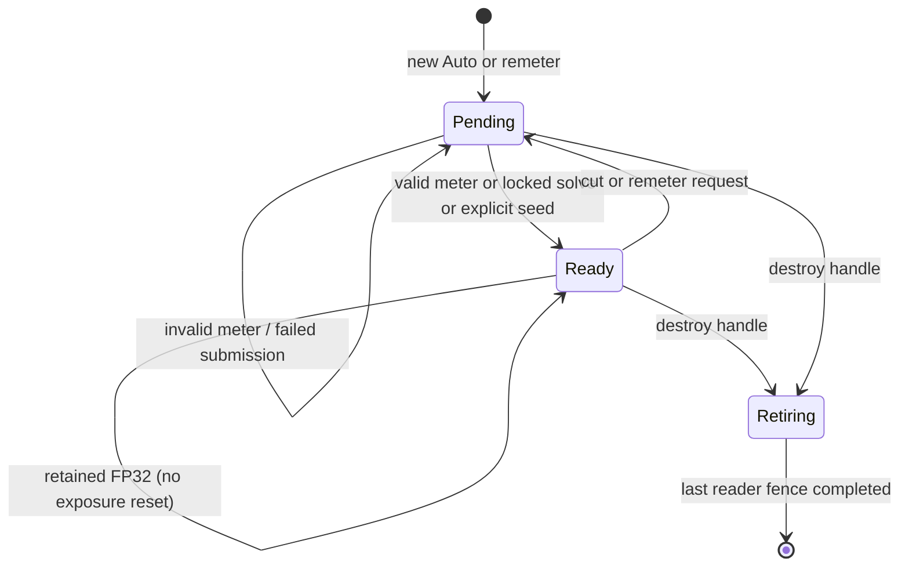

# PostProcessService LLD

Status: `in_progress` — exposure contract checkpoint; implementation follows the
[ten-slice delivery plan](../plan/exposure-and-lightbench-correction.md).
Historical VTX-M03 closure remains at its original fixed/auto baseline scope.

## Ownership and public boundary

PostProcessService owns exposure settings resolution, persistent GPU state keyed
by producer-owned `ViewStateHandle`, early frame-exposure resolve, Stage-22
exposure/bloom/tonemapping, and bounded completed status. Renderer Core owns
view registration, relationship validation and transient transition routing.
SceneRenderer supplies the exact scene signal/SRV, depth/SRV and post target;
post-process passes cannot invent another input or output routing path.

ViewId is a frame-publication identity, never a temporal-history key. Native
applications and DemoShell submit the same public typed events and canonical
per-view exposure overrides. An override replaces exposure settings for that
view without mutating the scene. The native canonical authored settings type
lives in Scene/ExposureSettings.h; enums and scalar math stay in
Core/Types/PostProcess.h. This keeps resource handles out of Core's dependency boundary while Scene,
Vortex and adapters consume one settings vocabulary. Runtime mask references
use Content::ResourceKey; cooked records use source-local texture indices.

No local exposure, new temporal upscaler, second meter, legacy Renderer path,
or independent exposure/precision framework belongs to this delivery.
Equations and tolerances are owned by the
[PBR specification](../../renderer-core/physically-based-rendering.md).

Renderer-issued transition generations are the approved public contract:
`QueueExposureTransition(handle, policy, seed)` returns a request token, and
`RetryExposureTransition(token)` retains its generation. Implicit resets use
the same per-view counter. Queueing does not acknowledge GPU application;
completed status identifies the applied generation. Validate mode/settings
and source ownership together at the frame boundary.

The public control surface uses `ExposureTransitionToken` (target, runtime
lifetime, renderer-issued generation, policy and optional EV seed) and
`ExposureTransitionStatus`. Syntax errors allocate no generation. A producer
can queue intent before first rendering its persistent handle; semantic
validation waits for its accepted frame settings and source ownership. Retry
of the latest identical token retains its outcome; older issued generations
are superseded without reactivating them. Conflicting latest-token payloads
and unknown/lifetime-mismatched identities are rejected. Shutdown clears the
registry and rejects new requests/retries. Status contains no numerical gain.

Explicit seeds resolve a positive log gain from the validated Auto settings at
the requested EV, without clamping that EV to metering bounds or constructing
linear seed luminance. Zero target uses nominal middle grey for the latent
seed. This scalar conversion does not itself apply a GPU transition.

Before publishing an immediate exposure submission, retain the recorder's
existing command list before closing it and inspect `IsSubmitted()` immediately
after release.
Recording/queue failure therefore cannot authorize publication or request
consumption. This is submission observation, not GPU completion; completed
status still supplies application acknowledgement. The reusable command-list
state must not be treated as a durable receipt across frame retirement.

## Settings resolution

`CaptureViewExposureSettings` pins one complete accepted settings revision and
its resident mask lease for a logical view and frame. `InitViews` captures the
view family before scene rendering; family and single-view entry points also
capture when no prepared scene is available. The same revision supplies the
early exposure binding, solve constants, final post-process bindings and
transition-status identity. A later settings change, mask completion or mode
change becomes eligible at the next frame boundary. Repeated frame-start
notifications do not release a capture.

Stateless captures are keyed by logical `ViewId`, so multiple stateless views
remain independent; their captures are discarded at the next frame boundary.
Persistent accepted settings remain keyed by `ViewStateHandle`. The resolver
can validate pending intent without mutating an existing frame capture.

Resolve scene defaults, physical camera parameters for ManualCamera, and explicit
per-view override at a frame boundary. Validate all fields as one revision:
finite values, recognized enums, positive key/camera parameters/D, nonnegative
speeds/target, ordered EV range, `0<=low<high<=1`, positive histogram span,
black influence [0,1], radius nonnegative, and <=64 finite sorted curve keys.
Validate coupled resulting gain across the complete meter/curve interval and
initial/seed solutions against the operational domain. Never silently replace
zero target or valid small gains with a positive floor.

Mask and curve uploads are immutable for each settings revision. A pending mask
keeps the previous valid settings and resource; failure reports an error and
keeps that revision. Missing mask means unit weight only when no mask was
authored. Publish scalar settings and their mask/curve resources atomically.
Requested values and active revision are separately observable.

## GPU record layouts

All GPU scalar fields are 32-bit. C++ records are standard-layout, aligned to
16 bytes, with size and every field offset asserted against the HLSL contract.
64-bit counters use two uint32 words, low then high, avoiding shader-model
requirements beyond the existing SM6.6 baseline. Compare the full counter; no
truncated generation or ViewStateHandle comparison is permitted.

### FrameExposureData: 16 bytes

| Offset | Type | Field |
| --- | --- | --- |
| 0 | float | pre_exposure |
| 4 | float | one_over_pre_exposure |
| 8 | uint | global_exposure_state_slot |
| 12 | uint | flags |

ViewFrameBindings.frame_exposure_slot (byte 12) references this record.
ViewFrameBindings stays 64 bytes; other slots retain offsets. Publish one
immutable record before scene work and retain its descriptor through post-scene
publication. The old ViewColorData/GetExposure vocabulary is removed. Flags: bit 0
bootstrap/recovery FP32, bit 1 borrowed prior state, bit 2 transient diagnostic
unit gain, bit 3 source-initialization fallback. Reserved bits are zero.

### ExposureStateData: 80 bytes

| Offset | Type | Field / meaning |
| --- | --- | --- |
| 0 | float | displayed_scale S (zero allowed) |
| 4 | float | target_scale (zero allowed) |
| 8 | float | latent_scale (strictly positive) |
| 12 | float | latent_target_scale (strictly positive) |
| 16 | float | raw_metered_luminance |
| 20 | float | raw_metered_ev |
| 24 | uint | flags |
| 28 | uint | fallback_reason |
| 32 | uint2 | settings_revision |
| 40 | uint2 | requested_generation |
| 48 | uint2 | applied_generation |
| 56 | uint2 | frame_sequence |
| 64 | float | fp16_candidate_pre_exposure |
| 68 | uint | fp16_eligible_streak |
| 72 | uint2 | product_layout_revision |

State flags: history valid, initialized, meter luminance valid, meter EV valid,
synthetic dark solve, range failure, displayed-zero target, borrowed continuity,
and FP16 eligible occupy bits 0..8 respectively. Bit 9 records that a valid
metered EV has ever been stored, independently of current measurement validity
and gain initialization. Bits 10..11 store the active mode; bit 12 marks a
rejected transition and bits 16..19 store its reason. Remaining bits are zero. The synthetic-dark bit also
describes the retained EV when current metering is invalid.
Fallback reason enum: None=0, MissingHistory=1, InvalidMeter=2,
SourceUninitialized=3, SourceDestroyed=4, RangeFailure=5. A dark solve marks EV
valid but does not claim exact measured luminance. Last valid metered fields
remain stored on invalid input; current validity describes the current frame.

### ExposureCompletedStatus: 80 bytes

| Offset | Type | Field / meaning |
| --- | --- | --- |
| 0 | uint2 | view_state_identity |
| 8 | uint2 | frame_sequence |
| 16 | uint2 | settings_revision |
| 24 | uint2 | requested_generation |
| 32 | uint2 | applied_generation |
| 40 | uint2 | product_layout_revision |
| 48 | uint | flags (valid state, range failure, FP16 eligible) |
| 52 | uint | first_failure_product (zero means none) |
| 56 | uint | first_failure_kind |
| 60 | uint | fp16_eligible_streak |
| 64 | uint2 | candidate_state_generation |
| 72 | uint | transition rejection reason (0=none, 1=not Auto, 2=unsupported seed) |
| 76 | uint | reserved, zero |

Status contains identity/eligibility, not a CPU numerical-gain authority. The
candidate_state_generation references a retained GPU state record. Pin that
record until acknowledgment is consumed or discarded and all GPU readers
retire. Each in-flight frame has a distinct status allocation. Atomic first
failure wins using a compare-exchange on product ID; status completion requires
all producer writes before copying to the existing asynchronous readback ring.
Product IDs are assigned in SceneTextures' domain inventory.

A source curve key is two float32 values, eight bytes: EV at 0, compensation at 4.
Resolve its compensation, calibration/target logarithms and bounded-EV
subtraction together using compensated CPU arithmetic. Compile the resulting
piecewise-linear log-gain target at the union of authored knots, two EV clamp
edges and the two supported scene-radiance endpoints (at most 68 runtime keys).
Covering the full supported domain preserves last-valid-EV restoration when
the histogram window changes. This is the
same target function evaluated at raw metered EV, with every GPU ordinate in
[-32,32]; large cancelling authored values never require a linear intermediate.
Seed/dark/initial solves use the same exact combination before float conversion.

`ExposureTargetData` is a 560-byte structured record: uint key_count at 0,
uint flags at 4 (locked=1, zero-target=2), float initial_log_gain at 8,
float dark_log_gain at 12, then 68 float2 `(raw_ev, log_gain)` entries at 16.
Unused entries are zero. Publish it through the existing per-view transient
structured publisher and frame slot retirement. The authored/packed limit stays
64 keys; these additional points represent clamp/domain boundaries, not new
authored controls. This normalization avoids both intermediate exp2 overflow
and loss of small key bias during large compensation cancellation.

The histogram allocation has 256 uint bins followed by counters for finite,
weighted, weighted exact-black, weighted positive-below-window, rejected and
weighted dark samples (24 bytes), plus eight zero padding bytes: 1056 bytes
in total. The dark count includes finite nonpositive luminance. Classification
uses positive quantized base weight before black influence; a zero-influence
all-dark image therefore remains distinguishable from an empty mask. Counts
and mass are distinct.

Histogram pass constants are a 64-byte structured record: source/histogram
indices at 0/4, minimum log luminance/inverse span at 8/12, uint content
left/top/width/height at 16/20/24/28, mode/radius at 32/36, mask index/background
flag at 40/44, inverse P/black influence at 48/52, and zero padding at 56/60.
The 112-byte unified solve record retains histogram/state indices at 0/4,
minimum log luminance/span at 8/12, low/high percentiles at 16/20, minimum EV/D
at 24/28 (D stored as log2), log2 up/down speed at 32/36, log2 delta/target SRV at 40/44, settings revision
at 48 and frame sequence at 56. The control tail is specified under
[Unified solve controls](#unified-solve-controls-slice-4-implementation). Both
records use the existing frame-retired structured publisher. Compute those rate/time logarithms in CPU double precision
before float32 upload; zero speed/time uses sentinel -256, outside every finite
positive binary32 logarithm. GPU adaptation compares bounded linear travel,
then evaluates the dimensionless exponential argument in log space. This
preserves finite answers when speed*time would overflow or a raw rate is
subnormal. Saturate the tail only when its exponent is mathematically >=128.

Compute percentile-times-total boundaries from the float32 significand and
integer histogram mass. Retain integer and rational remainder separately.
Integrate complete integer mass plus each boundary's fractional tail; when
both boundaries lie inside one mass unit, return its containing bin directly.
Never subtract float32 cumulative counts near the maximum mass: that can erase
valid narrow intervals. Use two uint32 words and four 16-bit partial products for the rational
product; do not require optional float64 or 64-bit integer shader support.
Shader Model 6.6 does not imply
[Int64ShaderOps support](https://learn.microsoft.com/en-us/windows/win32/api/d3d12/ns-d3d12-d3d12_feature_data_d3d12_options1).
Reuse existing upload/descriptor allocators and fence retirement.

## Frame sequencing and GPU lifetime

```mermaid
sequenceDiagram
    participant Game
    participant Views as ViewLifecycleService
    participant Post as PostProcessService
    participant GPU
    Game->>Views: handle + settings + transition generation
    Views->>Post: validated owner/root and frame snapshot
    Post->>GPU: resolve immutable FrameExposureData from prior state
    GPU->>GPU: UAV to SRV ordering before first HDR producer
    GPU->>GPU: scene writes P*C_scene; record range/eligibility
    Post->>GPU: Stage 22 histogram and owner-only current state solve
    GPU->>GPU: current state UAV to SRV ordering
    GPU->>GPU: bloom and tonemap consume S/P
    GPU->>GPU: copy completed status after all producers
    GPU-->>Post: fence-completed asynchronous status
    Post->>Post: matching format eligibility only; retire leased generations
```

Freeze source/prior generations for the entire logical frame before executing
any view. Allocate a distinct current generation rather than overwriting a
buffer still read by another view or frame. Publish only successfully submitted
work. Failed recording/submission leaves requests pending. An owner updates at
most once per logical frame, even if multiple products use its view. All resource
and descriptor releases wait for the last consuming fence, including readbacks
and source-destruction copies. Frame allocation count follows actual frames in
flight, not a hard-coded two-buffer assumption.

## Lifecycle and precedence

Resolve settings changes, mode and event in one frame snapshot. Highest request
generation wins; resubmission of identical contents is idempotent. Conflicting
contents at the same generation are invalid. Explicit policy wins over implicit
first-use/cut policy. Remeter/Seed in Manual or disabled mode is rejected with a
diagnostic, never saved for a later mode. A borrower cannot reset its root.

For an independent ordinary view, solve in this order:

1. Authored disabled -> S=1; Manual/ManualCamera -> authored gain immediately.
2. Explicit Auto Seed -> current target/bias/curve evaluated at requested EV;
   do not clamp seed EV to meter bounds. Publish for this event frame; consume
   generation even without a valid histogram. Zero target still displays zero.
3. Locked Auto range -> fixed solve without histogram; consume pending remeter.
4. Zero-target entry -> displayed zero immediately; continue positive latent solve.
5. Positive-target restoration -> current meter, else last valid EV, else normal
   initialization. Never invert former displayed zero.
6. Pending remeter/new Auto -> first valid current measurement applies directly;
   retain pending generation during invalid metering.
7. Manual-to-Auto or destroyed-source continuity -> retain transferred gain for
   one transition frame, then adapt independently. Zero/locked rules win.
8. Ordinary initialized Auto -> exact hybrid adaptation; invalid meter retains
   gain/last valid measurements and marks current input invalid.

Missing history with invalid meter uses the source/owner Auto EV0 fallback,
clamped to its EV bounds and evaluated with its target, key, bias and curve;
never use the inactive Manual EV. Initialization remains pending. Explicit seeds
outside meter range are legal when the resulting gain is numerically supported.

A new view, camera cut, replaced world or device recovery remeters by default.
Preserve and Seed are explicit alternatives. Walking, streaming, light changes,
compatible resize and format changes preserve exposure. Stateless Auto uses
transient state, FP32 metering and no temporal adaptation on every invocation.

A temporary diagnostic unit-gain override creates transient frame output while
preserving authored mode, history and pending events. It is distinct from
authored disabled exposure. On leaving it, apply any pending cut/reset; otherwise
resume retained history. Camera/color history invalidation remains with its owner.



## Source-owned sharing

Resolve chains to one registered root; reject cycles/unknown handles atomically.
Only the root meters/writes its state. Borrowers use pinned published prior
source state for both displayed gain and numerical P, independent of render
order, with one frame of result latency. Local borrower exposure settings do
not modify borrowed gain. If root is inactive, retain its last publication.
With no publication use the root's disabled/manual/seed/EV0 initialization gain;
never initialize from a consumer image. Bootstrap suitability remains per view.

A borrowing-view cut resets its camera/color histories and bootstrap, not root
exposure. Explicit detachment remeters by default; Preserve/Seed are opt-in and
do not revive dormant independent history.

On root destruction detach all affected chains at the next boundary. Copy last
borrowed displayed and positive latent gain into each consumer-owned state
before retiring root resources. Auto retains that gain for one frame, then
meters independently; Manual applies its setting and disabled uses one. Consumer
zero target wins. If borrowed displayed gain was zero but local target positive,
retain zero only for the continuity frame, then use the positive latent gain
while awaiting a valid meter. Missing publication uses captured root fallback.

## Bootstrap, recovery and format eligibility

Use the two modes and suitability rules in
[SceneTextures](scene-textures.md#exposure-hdr-domain-and-format-inventory).
New unseeded Auto, remeter, device recovery and stateless Auto use FP32 and P=1.
A borrower with only root fallback also starts FP32. Keep metering/adapting while
FP32 is retained because required products cannot fit FP16; format retention is
not a transition event.

A valid history acknowledgment is necessary but insufficient for return. Require
matching view lifetime, settings, applied/requested generation, product layout,
two consecutive eligible completed frames, half-error margin and two stops of
overflow margin. The first FP16 frame pins the qualified candidate GPU P record;
CPU does not read or compute P. Stale or delayed status cannot demote a view.

Normal-path pre-store overflow/nonfinite or required-signal underflow invalidates
metering and retains history. Schedule FP32 recovery after completed status,
without blocking. FP32 out-of-domain input reports a content/range error and
retains valid history. Use bounded status and no full-resolution telemetry target.

## Post chain and qualification

Stage 21 optionally resolves scene color. Stage 22 performs owner exposure solve,
bloom extraction/filtering when present, and tonemapping; Stage 23 extracts and
hands off the SceneRenderer-owned output. Apply final S/P once, including disabled
S=1. UI/background composition remains independent. Bloom thresholds are scene
referred. TAA/TSR slots remain future work, not implied implementation.

Owning tests: PostProcessService, ViewLifecycleService, SceneTextures,
SceneRendererDeferredCore and ShaderBakeCatalog. Use controlled float inputs
before scene integration, independent arithmetic oracles, both sharing orders,
frames in flight, failed submission, source loss and stale acknowledgments.
Captures must prove bound resources, barriers, state identities and actual final
consumption. Native game fixtures must exercise the public API without DemoShell.

## Metering mask residency

Native exposure settings use Content ResourceKey, following the approved
texture-resource contract. Serialized indices remain source-local and are
hydrated by Content; GPU descriptor indices are never authored or persisted.
PostProcessService resolves masks with the existing TextureBinder and upload
coordinator. Only a completed, linear, single-sample 2D color texture may become
an accepted metering mask; pending and failed loads never sample checkerboard
or placeholder textures. An inactive mask does not delay Manual, disabled exposure or locked-range
Auto; each accepts its validated settings immediately without mask residency.
Unlocking Auto activates the usual atomic mask/settings acceptance gate.

Accept the entire requested settings/mask revision atomically when the texture
is ready. Pending replacement or failure retains the previous settings and
mask, with a bounded diagnostic that distinguishes pending from failed. With
no accepted revision, mark metering unavailable and retain Auto initialization;
an independent locked solve still follows its normal precedence.

TextureBinder's ready-texture lease retains the exact uploaded texture and SRV.
A queued Content eviction may release CPU residency but cannot repoint the GPU
descriptor until all leases retire. PostProcessService holds one lease per
accepted view revision and keeps each frame's sampled leases in the existing
frame-slot retirement cycle. Removing a view or changing a mask releases its
accepted lease; frame readers still keep it alive. The binder outlives its
leases and uses the existing graphics reclaimer for resource/descriptor release.
No separate mask loader, texture cache or upload allocator is introduced.

## Unified solve controls (slice 4 implementation)

The solve record is 112 bytes. Its original 64-byte metering/rate/revision prefix
is followed by previous-state SRV at 64, exact fixed scale at 68, mode at 72
(Manual=0, ManualCamera=1, Auto=2, disabled=3), control flags at 76 (invalid seed
bit 0, source initialization fallback bit 1), request generation uint2 at 80,
policy at 88 (none=0, Preserve=1, Remeter=2, Seed=3), seed log gain at 92,
status UAV at 96, borrowed prior-state SRV at 100 (invalid for owner solves),
and view lifetime uint2 at 104. State flags add mode in bits 10..11,
request rejection in bit 12 and its reason in bits 16..19 (1=not Auto,
2=unsupported seed, 3=sharing consumer). The 80-byte exposure state remains
unchanged in size. Borrowed records set bit 7 and do not claim a local metered
EV or preserve dormant independent meter history.

Each solve reads a prior immutable state and writes a different pooled record.
Frame-slot leases prevent recycling while GPU readers are active; additional
owners may retain a record for completed-status handling. Only a successfully
submitted solve advances the per-view latest state. An owner writes at most
once per logical frame; stateless invocations allocate transient records and
retain no latest state. The shared initialization upload is removed.

Completed transition records are read through the existing nonblocking readback
manager. At most three pending records per view retain their state leases.
Matching lifetime, frame sequence, settings revision and requested generation
are required before acknowledging an application. An older completion may
advance the observed applied generation but cannot consume newer queued intent.
Destroyed views cancel their pending jobs; reused handles receive new lifetimes.
Diagnostic records do not enqueue authored-transition acknowledgements.

At frame start the pass pins each owner's latest successfully submitted record.
Consumers copy its gain fields into their own immutable record, retaining the
source resource through their frame slot. A source update in the current frame
cannot change this snapshot. Without a prior record, a per-frame source fallback
uses captured source settings and seed; this performs no histogram dispatch,
does not install owner history, and does not consume the owner's transition.
Source settings for registered inactive views come from the runtime registry and
the source's camera/override, using the same canonical capture path. Consumer
images and settings cannot determine this fallback.
