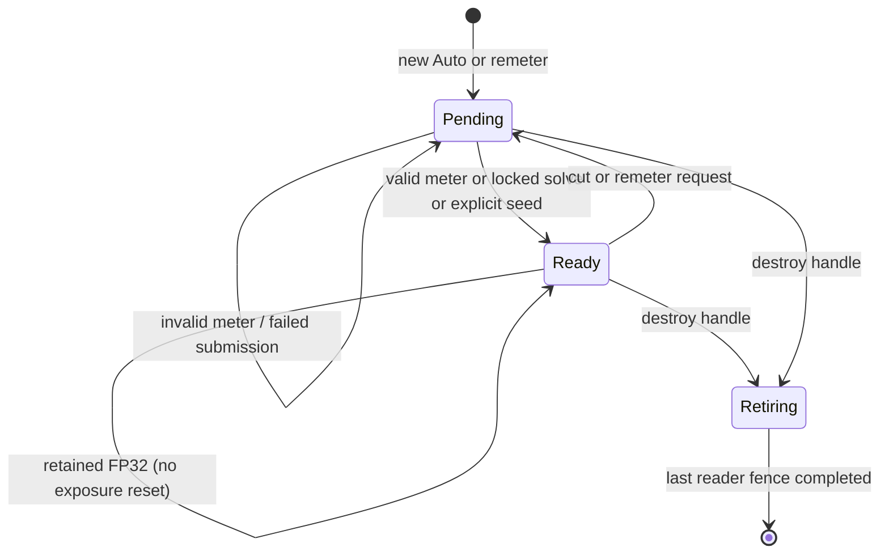

# PostProcessService LLD

Status: `in_progress` — exposure contract checkpoint; implementation follows the
[ten-slice delivery plan](../plan/exposure-and-lightbench-correction.md).
Historical VTX-M03 closure remains at its original fixed/auto baseline scope.

## Ownership and public boundary

PostProcessService owns exposure settings resolution, persistent GPU state keyed
by producer-owned `ViewStateHandle`, early frame-exposure resolve, exposure
solving before color resolution, Stage-22 bloom/tonemapping, and bounded
completed status. Renderer Core owns view registration, relationship validation
and transient transition routing.
SceneRenderer supplies the exact scene signal/SRV, depth/SRV and post target;
post-process passes cannot invent another input or output routing path.

After all SceneColor accumulation, SceneRenderer calls `PrepareSceneExposure`
before Stage 21. This solves from the FP32 accumulation and pins the numerical
result and post-process configuration for the logical view, state handle and
frame sequence. Stage 22 consumes that prepared result with the resolved color;
it does not meter a second time. This ordering also applies to stateless and
diagnostic views. Direct service fixtures may let `Execute` prepare its own
result when no prior preparation was supplied. A prepared result from another
service, view identity/lifetime or logical frame is rejected. Unavailable frame fallback
prevents the scene resolve and visible-output update.

ViewId is a frame-publication identity, never a temporal-history key. Native
applications and DemoShell submit the same public typed events and canonical
per-view exposure overrides. An override replaces exposure settings for that
view without mutating the scene. The native canonical authored settings type
lives in Scene/ExposureSettings.h; enums and scalar math stay in
Core/Types/PostProcess.h. This keeps resource handles out of Core's dependency boundary while Scene,
Vortex and adapters consume one settings vocabulary. Runtime mask references
use Content::ResourceKey; cooked records use source-local texture indices.

No local exposure, new temporal upscaler, second meter, legacy Renderer path,
or independent exposure/precision framework belongs to this delivery.
Equations and tolerances are owned by the
[PBR specification](../../renderer-core/physically-based-rendering.md).

Renderer-issued transition generations are the approved public contract:
`QueueExposureTransition(handle, policy, seed)` returns a request token, and
`RetryExposureTransition(token)` retains its generation. Implicit resets use
the same per-view counter. Queueing does not acknowledge GPU application;
completed status identifies the applied generation. Validate mode/settings
and source ownership together at the frame boundary.

Games report camera cuts or completed backend recovery with
`NotifyViewDiscontinuity(handle, ViewDiscontinuity)`. The reasons are CameraCut,
WorldReplacement and DeviceRecovery. Notifications coalesce until an eligible
frame capture and use the existing exposure generation allocator when the view
owns exposure: Auto remeters and fixed modes publish their authored gain.
An unsubmitted explicit exposure request takes precedence; diagnostics defer
pending discontinuities, and a notification after capture waits until the next
frame. A borrowing view invalidates its own camera/fog/HZB histories without
issuing an exposure-reset request for its source.

The renderer detects selected-camera changes on accepted publication and world
changes through each view's scene ownership identity. Ordinary image/light
changes do not request resets. DeviceRecovery is a notification after the
backend's resource restoration; it does not recreate a graphics device.
The captured per-view discontinuity also invalidates previous camera matrices
and temporal fog/HZB reuse. Numerical FP32/P bootstrap consumes this boundary
during the slice-5 HDR migration.

The public control surface uses `ExposureTransitionToken` (target, runtime
lifetime, renderer-issued generation, policy and optional EV seed) and
`ExposureTransitionStatus`. Syntax errors allocate no generation. A producer
can queue intent before first rendering its persistent handle; semantic
validation waits for its accepted frame settings and source ownership. Retry
of the latest identical token retains its outcome; older issued generations
are superseded without reactivating them. Conflicting latest-token payloads
and unknown/lifetime-mismatched identities are rejected. Shutdown clears the
registry and rejects new requests/retries. Status contains no numerical gain.

The pre-render capture boundary also snapshots registered inactive views.
Requests that have never been submitted can be rejected there for accepted
mode/settings or ownership violations. A submitted request remains governed by
its completed GPU status; a later mode change cannot reclassify it. Diagnostic
overrides defer validation/application. A rejected disposition remains attached
to its generation and is carried into later GPU records, so a later valid mode,
seed range or independent ownership cannot reactivate it. The GPU requested
generation still records that disposition without claiming application.

Explicit seeds resolve a positive log gain from the validated Auto settings at
the requested EV, without clamping that EV to metering bounds or constructing
linear seed luminance. Zero target uses nominal middle grey for the latent
seed. This scalar conversion does not itself apply a GPU transition.

Before publishing an immediate exposure submission, retain the recorder's
existing command list before closing it and inspect `IsSubmitted()` immediately
after release.
Recording/queue failure therefore cannot authorize publication or request
consumption. This is submission observation, not GPU completion; completed
status still supplies application acknowledgement. The reusable command-list
state must not be treated as a durable receipt across frame retirement.

## Settings resolution

`PostProcessConfig::exposure` is the sole writable exposure input and uses the
canonical `scene::ExposureSettings` defaults, including 3 EV/s upward and
1 EV/s downward adaptation. `SetConfig` validates the complete request before
activation; rejection retains the previous exposure and presentation settings.
`GetConfig` returns authored settings, so read-modify-apply never carries an
outdated resolved gain. ManualCamera resolution accepts camera EV as separate
context; subsequent edits in that mode retain the accepted camera EV when no
replacement is supplied. Rejected requests cannot change that context.

Passes consume `ResolvedPostProcessConfig`, an immutable validated snapshot.
Direct pass clients use its checked `Resolve` factory. Scene rendering uses
`BuildPassConfig` after capturing the view, combining presentation settings
with the captured accepted exposure, camera context and revision. No public
setter can modify the derived gain or individual resolved settings.
`PostProcessFrameBindings` retains its existing 112-byte GPU/capture layout;
its scalar exposure fields are derived together from that snapshot.

For a direct service view without a scene capture, the first frame preparation
routes the authored request through `CaptureViewExposureSettings`, including
mask loading and residency. Callers need only `SetConfig` and normal frame/render
calls. Accepted revisions belong to the view; callers do not synchronize a
service-global counter with mask preparation. Pending or failed replacements
retain the prior accepted exposure and mask together. The first unavailable
mask uses the documented initialization fallback and skips metering. An existing
scene capture is reused unchanged for the rest of its frame.

`CaptureViewExposureSettings` pins one complete accepted settings revision and
its resident mask lease for a logical view and frame. `InitViews` captures the
view family before scene rendering; family and single-view entry points also
capture when no prepared scene is available. The same revision supplies the
early exposure binding, solve constants, final post-process bindings and
transition-status identity. A later settings change, mask completion or mode
change becomes eligible at the next frame boundary. Repeated frame-start
notifications do not release a capture.

Stateless captures are keyed by logical `ViewId`, so multiple stateless views
remain independent; their captures are discarded at the next frame boundary.
Persistent accepted settings remain keyed by `ViewStateHandle`. The resolver
can validate pending intent without mutating an existing frame capture.

Resolve scene defaults, physical camera parameters for ManualCamera, and explicit
per-view override at a frame boundary. Validate all fields as one revision:
finite values, recognized enums, positive key/camera parameters/D, nonnegative
speeds/target, ordered EV range, `0<=low<high<=1`, positive histogram span,
black influence [0,1], radius nonnegative, and <=64 finite sorted curve keys.
Validate coupled resulting gain across the complete meter/curve interval and
initial/seed solutions against the operational domain. Never silently replace
zero target or valid small gains with a positive floor.

Mask and curve uploads are immutable for each settings revision. A pending mask
keeps the previous valid settings and resource; failure reports an error and
keeps that revision. Missing mask means unit weight only when no mask was
authored. Publish scalar settings and their mask/curve resources atomically.
Requested values and active revision are separately observable.

## GPU record layouts

All GPU scalar fields are 32-bit. C++ records are standard-layout, aligned to
16 bytes, with size and every field offset asserted against the HLSL contract.
64-bit counters use two uint32 words, low then high, avoiding shader-model
requirements beyond the existing SM6.6 baseline. Compare the full counter; no
truncated generation or ViewStateHandle comparison is permitted.

### FrameExposureData: 16 bytes

| Offset | Type | Field |
| --- | --- | --- |
| 0 | float | pre_exposure |
| 4 | float | one_over_pre_exposure |
| 8 | uint | global_exposure_state_slot |
| 12 | uint | flags |

ViewFrameBindings.frame_exposure_slot (byte 12) references this record.
ViewFrameBindings stays 64 bytes; other slots retain offsets. Publish one
immutable record before scene work and retain its descriptor through post-scene
publication. The old ViewColorData/GetExposure vocabulary is removed. Flags: bit 0
bootstrap/recovery FP32, bit 1 borrowed prior state, bit 2 transient diagnostic
unit gain, bit 3 source-initialization fallback. Reserved bits are zero.

The pre-scene compute resolve owns a frame-retained structured SRV/UAV record
and reserves the current 80-byte state for the later exposure solve. It retains
the prior source and qualified candidate leases through the frame fence. A
repeated resolve of the same view/state pair returns the pinned record; failed
recording/submission does not publish it. Resolving P neither consumes a request
nor publishes new adaptation history. Zero displayed gain selects positive
latent gain for numerical P. Recovery and diagnostic frames use P=1; a missing
root history also forces the source-initialization fallback flag and FP32.

Scene publication binds this GPU record from the global structured-SRV domain;
the old PreparedSceneFrame exposure scalar no longer supplies numerical P.
Resolved SceneColor metadata retains the frame-record lease. Pre-scene
preparation failure returns to the view caller before HDR draws and does not
publish a replacement output. Display wireframe overlays run after tonemapping;
full-view HDR diagnostics use their pinned unit-exposure domain.

`VortexExposureFrameCS` uses a 48-byte structured constants record: output UAV,
reserved-current-state UAV, prior-state SRV and candidate-state SRV at offsets
0/4/8/12; fixed gain, initial log gain and seed log gain at 16/20/24; exposure
mode at 28; frame flags, controls and current-state SRV at 32/36/40;
current completed-status UAV at 44. The resolve clears this 80-byte record
before HDR producers run. Controls bit 0 means valid seed and bit 1 means zero target.
Candidate selection requires GPU eligibility and a streak
of at least two; the CPU integration must additionally validate completed
status identity, settings, event and layout before supplying that candidate.

`PrepareFrameExposure` captures the service revision and resolves the record
before its caller writes pre-exposed radiance. The subsequent solve writes the
reserved current state, while the frame record and its P remain unchanged.
Seed-based P selection does not replace the prior displayed gain before that
solve submits. On solve failure, a gain-only GPU copy restores the selected
fallback into the reserved state, including latest-borrow/source-loss continuity
and zero-target precedence. It imports no source request identity, publishes no
new adaptation history and acknowledges no request. If the fallback cannot
submit, the service skips tonemapping rather than consuming an invalid state.

### ExposureStateData: 80 bytes

| Offset | Type | Field / meaning |
| --- | --- | --- |
| 0 | float | displayed_scale S (zero allowed) |
| 4 | float | target_scale (zero allowed) |
| 8 | float | latent_scale (strictly positive) |
| 12 | float | latent_target_scale (strictly positive) |
| 16 | float | raw_metered_luminance |
| 20 | float | raw_metered_ev |
| 24 | uint | flags |
| 28 | uint | fallback_reason |
| 32 | uint2 | settings_revision |
| 40 | uint2 | requested_generation |
| 48 | uint2 | applied_generation |
| 56 | uint2 | frame_sequence |
| 64 | float | fp16_candidate_pre_exposure |
| 68 | uint | fp16_eligible_streak |
| 72 | uint2 | product_layout_revision |

State flags: history valid, initialized, meter luminance valid, meter EV valid,
synthetic dark solve, range failure, displayed-zero target, borrowed continuity,
and FP16 eligible occupy bits 0..8 respectively. Bit 9 records that a valid
metered EV has ever been stored, independently of current measurement validity
and gain initialization. Bits 10..11 store the active mode; bit 12 marks a
rejected transition and bits 16..19 store its reason. Remaining bits are zero. The synthetic-dark bit also
describes the retained EV when current metering is invalid.
Fallback reason enum: None=0, MissingHistory=1, InvalidMeter=2,
SourceUninitialized=3, SourceDestroyed=4, RangeFailure=5. A dark solve marks EV
valid but does not claim exact measured luminance. Last valid metered fields
remain stored on invalid input; current validity describes the current frame.

### ExposureCompletedStatus: 80 bytes

| Offset | Type | Field / meaning |
| --- | --- | --- |
| 0 | uint2 | view_state_identity |
| 8 | uint2 | frame_sequence |
| 16 | uint2 | settings_revision |
| 24 | uint2 | requested_generation |
| 32 | uint2 | applied_generation |
| 40 | uint2 | product_layout_revision |
| 48 | uint | flags: valid=1, range failure=2, FP16 eligible=4, rejected transition=8, producer failure=16 |
| 52 | uint | first_failure_product (zero means none) |
| 56 | uint | first_failure_kind |
| 60 | uint | fp16_eligible_streak |
| 64 | uint2 | candidate_state_generation |
| 72 | uint | transition rejection reason (0=none, 1=not Auto, 2=unsupported seed) |
| 76 | uint | reserved, zero |

Status contains identity/eligibility, not a CPU numerical-gain authority. The
candidate_state_generation references a retained GPU state record. Pin that
record until acknowledgment is consumed or discarded and all GPU readers
retire. Each in-flight frame has a distinct status allocation. Atomic first
failure wins using a compare-exchange on product ID; status completion requires
all producer writes before copying to the existing asynchronous readback ring.
Product IDs are assigned in SceneTextures' domain inventory.

A source curve key is two float32 values, eight bytes: EV at 0, compensation at 4.
Resolve its compensation, calibration/target logarithms and bounded-EV
subtraction together using compensated CPU arithmetic. Compile the resulting
piecewise-linear log-gain target at the union of authored knots, two EV clamp
edges and the two supported scene-radiance endpoints (at most 68 runtime keys).
Covering the full supported domain preserves last-valid-EV restoration when
the histogram window changes. This is the
same target function evaluated at raw metered EV, with every GPU ordinate in
[-32,32]; large cancelling authored values never require a linear intermediate.
Seed/dark/initial solves use the same exact combination before float conversion.

`ExposureTargetData` is a 560-byte structured record: uint key_count at 0,
uint flags at 4 (locked=1, zero-target=2), float initial_log_gain at 8,
float dark_log_gain at 12, then 68 float2 `(raw_ev, log_gain)` entries at 16.
Unused entries are zero. Publish it through the existing per-view transient
structured publisher and frame slot retirement. The authored/packed limit stays
64 keys; these additional points represent clamp/domain boundaries, not new
authored controls. This normalization avoids both intermediate exp2 overflow
and loss of small key bias during large compensation cancellation.

The histogram allocation has 256 uint bins followed by counters for finite,
weighted, weighted exact-black, weighted positive-below-window, rejected and
weighted dark samples (24 bytes), plus eight zero padding bytes: 1056 bytes
in total. The dark count includes finite nonpositive luminance. Classification
uses positive quantized base weight before black influence; a zero-influence
all-dark image therefore remains distinguishable from an empty mask. Counts
and mass are distinct.

Histogram pass constants are a 64-byte structured record: source/histogram
indices at 0/4, minimum log luminance/inverse span at 8/12, uint content
left/top/width/height at 16/20/24/28, mode/radius at 32/36, mask index/background
flag at 40/44, fixture inverse P/black influence at 48/52, frame-exposure SRV at
56, and zero padding at 60. With a valid frame SRV, metering reads 1/P from that
GPU record; the scalar is used only when no numerical-domain record is supplied.
The 112-byte unified solve record retains histogram/state indices at 0/4,
minimum log luminance/span at 8/12, low/high percentiles at 16/20, minimum EV/D
at 24/28 (D stored as log2), log2 up/down speed at 32/36, log2 delta/target SRV at 40/44, settings revision
at 48 and frame sequence at 56. The control tail is specified under
[Unified solve controls](#unified-solve-controls-slice-4-implementation). Both
records use the existing frame-retired structured publisher. Compute those rate/time logarithms in CPU double precision
before float32 upload; zero speed/time uses sentinel -256, outside every finite
positive binary32 logarithm. GPU adaptation compares bounded linear travel,
then evaluates the dimensionless exponential argument in log space. This
preserves finite answers when speed*time would overflow or a raw rate is
subnormal. Saturate the tail only when its exponent is mathematically >=128.

Compute percentile-times-total boundaries from the float32 significand and
integer histogram mass. Retain integer and rational remainder separately.
Integrate complete integer mass plus each boundary's fractional tail; when
both boundaries lie inside one mass unit, return its containing bin directly.
Never subtract float32 cumulative counts near the maximum mass: that can erase
valid narrow intervals. Use two uint32 words and four 16-bit partial products for the rational
product; do not require optional float64 or 64-bit integer shader support.
Shader Model 6.6 does not imply
[Int64ShaderOps support](https://learn.microsoft.com/en-us/windows/win32/api/d3d12/ns-d3d12-d3d12_feature_data_d3d12_options1).
Reuse existing upload/descriptor allocators and fence retirement.

## Frame sequencing and GPU lifetime

```mermaid
sequenceDiagram
    participant Game
    participant Views as ViewLifecycleService
    participant Post as PostProcessService
    participant GPU
    Game->>Views: handle + settings + transition generation
    Views->>Post: validated owner/root and frame snapshot
    Post->>GPU: resolve immutable FrameExposureData from prior state
    GPU->>GPU: UAV to SRV ordering before first HDR producer
    GPU->>GPU: scene writes P*C_scene; record range/eligibility
    Post->>GPU: FP32 SceneColor histogram and owner-only current state solve
    GPU->>GPU: current state UAV to SRV ordering
    GPU->>GPU: Stage 21 color resolution with final S available
    GPU->>GPU: bloom and tonemap consume S/P
    GPU->>GPU: copy completed status after all producers
    GPU-->>Post: fence-completed asynchronous status
    Post->>Post: matching format eligibility only; retire leased generations
```

Freeze source/prior generations for the entire logical frame before executing
any view. Allocate a distinct current generation rather than overwriting a
buffer still read by another view or frame. Publish only successfully submitted
work. Failed recording/submission leaves requests pending. An owner updates at
most once per logical frame, even if multiple products use its view. All resource
and descriptor releases wait for the last consuming fence, including readbacks
and source-destruction copies. Frame allocation count follows actual frames in
flight, not a hard-coded two-buffer assumption.

## Lifecycle and precedence

Resolve settings changes, mode and event in one frame snapshot. Highest request
generation wins; resubmission of identical contents is idempotent. Conflicting
contents at the same generation are invalid. Explicit policy wins over implicit
first-use/cut policy. Remeter/Seed in Manual or disabled mode is rejected with a
diagnostic, never saved for a later mode. A borrower cannot reset its root.

For an independent ordinary view, solve in this order:

1. Authored disabled -> S=1; Manual/ManualCamera -> authored gain immediately.
2. Explicit Auto Seed -> current target/bias/curve evaluated at requested EV;
   do not clamp seed EV to meter bounds. Publish for this event frame; consume
   generation even without a valid histogram. Zero target still displays zero.
3. Locked Auto range -> fixed solve without histogram; consume pending remeter.
4. Zero-target entry -> displayed zero immediately; continue positive latent solve.
5. Positive-target restoration -> current meter, else last valid EV, else normal
   initialization. Never invert former displayed zero.
6. Pending remeter/new Auto -> first valid current measurement applies directly;
   retain pending generation during invalid metering.
7. Manual-to-Auto or destroyed-source continuity -> retain transferred gain for
   one transition frame, then adapt independently. Zero/locked rules win.
8. Ordinary initialized Auto -> exact hybrid adaptation; invalid meter retains
   gain/last valid measurements and marks current input invalid.

Missing history with invalid meter uses the source/owner Auto EV0 fallback,
clamped to its EV bounds and evaluated with its target, key, bias and curve;
never use the inactive Manual EV. Initialization remains pending. Explicit seeds
outside meter range are legal when the resulting gain is numerically supported.

A new view, camera cut, replaced world or device recovery remeters by default.
Preserve and Seed are explicit alternatives. Walking, streaming, light changes,
compatible resize and format changes preserve exposure. Stateless Auto uses
transient state, FP32 metering and no temporal adaptation on every invocation.

A temporary diagnostic unit-gain override creates transient frame output while
preserving authored mode, history and pending events. It is distinct from
authored disabled exposure. On leaving it, apply any pending cut/reset; otherwise
resume retained history. Camera/color history invalidation remains with its owner.



## Source-owned sharing

Resolve chains to one registered root; reject cycles/unknown handles atomically.
Only the root meters/writes its state. Borrowers use pinned published prior
source state for both displayed gain and numerical P, independent of render
order, with one frame of result latency. Local borrower exposure settings do
not modify borrowed gain. If root is inactive, retain its last publication.
With no publication use the root's disabled/manual/seed/EV0 initialization gain;
never initialize from a consumer image. Bootstrap suitability remains per view.

A borrowing-view cut resets its camera/color histories and bootstrap, not root
exposure. Explicit detachment remeters by default; Preserve/Seed are opt-in and
do not revive dormant independent history.

Changing a registered view from a shared source to independent exposure records
a pending detach. At the next eligible frame capture, the renderer issues its
generation through the same allocator as public requests: Remeter for Auto,
Preserve for fixed/disabled modes whose solve applies the authored value.
An explicit queued request that has not been submitted takes precedence.
Diagnostic output defers the pending detach rather than consuming it; returning
to sharing before capture cancels the pending detach.

Captured settings, mask leases and GPU state resources carry the renderer's
view lifetime. Own-history reuse and shared prior/initial-state lookup require
that lifetime to match. Reusing a handle therefore cannot import old accepted
settings or another lifetime's GPU result, even while old readers retain their
frame-pinned resources. Completed status carries this lifetime on ordinary
frames as well as frames containing a transition token.

An accepted replacement of a published view's persistent handle retires the
old transition lifetime, settings/mask ownership, status jobs and latest GPU
state after releasing the registry lock. This includes becoming stateless.
Rejected publications leave the prior owner intact. Existing frame and GPU
reader leases remain valid through retirement.

On root destruction detach all affected chains at the next boundary. Copy last
borrowed displayed and positive latent gain into each consumer-owned state
before retiring root resources. Auto retains that gain for one frame, then
meters independently; Manual applies its setting and disabled uses one. Consumer
zero target wins. If borrowed displayed gain was zero but local target positive,
retain zero only for the continuity frame, then use the positive latent gain
while awaiting a valid meter. Missing publication uses captured root fallback.

Removal snapshots the root definition, pending seed/rejection and affected
consumer lifetimes before erasing registry edges. Existing services retain the
root's immutable GPU publication immediately; a service created later can use
the captured initialization definition. Deferred delivery targets only the
consumer still awaiting its event, so a diagnostic sibling cannot replay an
already-consumed event or recreate a retired consumer.

Each consumer retains its last selected borrowed state separately from its last
successful solve. This includes direct-root fallback selected after a failed
consumer copy; failed work does not advance its solve or transition identity.
Continuity copies only gain fields from that selection, preserving the
consumer's request identity and clearing foreign metering history. Its displayed
zero is held for that event frame without taking a logarithm or reciprocal;
the following invalid-meter frame uses the retained positive latent gain.

## Bootstrap, recovery and format eligibility

Use the two modes and suitability rules in
[SceneTextures](scene-textures.md#exposure-hdr-domain-and-format-inventory).
New unseeded Auto, remeter, device recovery and stateless Auto use FP32 and P=1.
A borrower with only root fallback also starts FP32. Keep metering/adapting while
FP32 is retained because required products cannot fit FP16; format retention is
not a transition event.

A valid history acknowledgment is necessary but insufficient for return. Require
matching view lifetime, settings, applied/requested generation, product layout,
two consecutive eligible completed frames, half-error margin and two stops of
overflow margin. The first FP16 frame pins the qualified candidate GPU P record;
CPU does not read or compute P. Stale or delayed status cannot demote a view.

The product evaluator uses a 48-byte GPU reduction record: candidate P and
maximum scene RGB at 0/4; checked-product mask and failure flags at 8/12;
first failed product and rejected-sample count at 16/20; metering, image and
overflow failure counts at 24/28/32; checked-sample count, expected mask and
reserved zero at 36/40/44. Product IDs 1-31 map to mask bits 0-30. Failure bits
are nonfinite input=1, insufficient overflow margin=2, image error=4, metering
error=8, missing product=16. The record is frame-retained with existing exposure
resources and is not itself a format-admission certificate.

After a submitted product evaluation, `FinalizeFp16Suitability` updates only
precision metadata in the current 80-byte exposure state and writes the existing
80-byte completed status. Fresh frame solves clear inherited eligibility; a
missing current-frame evaluation cannot finalize. The GPU compares the view's
own prior precision record, including for borrowers. Two consecutive rendered
results for that view must qualify with identical settings, requested/applied event
generations, product layout and candidate P. Inactive engine frames do not count
as failed view results; an intervening solve without qualification clears the
streak. Streaks saturate at two; repeating
finalization in one frame cannot advance them. Explicit invalidation restarts
the streak, and source identity/lifetime changes cannot inherit it. Callers
invalidate prior qualification for source-control events and recording failures.

An incomplete transition, invalid/uninitialized gain, stateless view, diagnostic
override or unpublished-source fallback cannot qualify. A terminal rejected
request does not remain a pending reset. Range/product failures reset the streak
and publish failure product/kind without altering gain, metering or exposure
event state. Settings/layout changes and candidate-scale changes
restart at one qualifying frame. The candidate state generation is its GPU
frame sequence. CPU admission must still validate completed identity/revisions
and retain the matching GPU lease; this finalizer does not select resource formats.

The finalizer's 64-byte constants are state UAV, own-previous SRV, status UAV,
report SRV at bytes 0/4/8/12; layout uint2 at 16; required mask at 24; controls at
28 (persistent=1, invalidate previous=2); frame SRV at 32; expected frame uint2
at 36; optional current-conversion report SRV at 44 (invalid index when absent);
lifetime uint2 at 48 and two zeros at 56. All uint64 identities
use uint2 arithmetic, including frame-counter carry. Completed flags are valid
state=1, failed qualification=2, eligible=4, rejected transition=8 and
producer-origin failure=16.

The current-frame conversion and future candidate evaluation have separate
48-byte reports retained by the same frame lease. Candidate evaluation cannot
overwrite the conversion verdict consumed by tonemapping. In FP16 mode the
finalizer also requires a successful current conversion; FP32 recovery may
qualify a future scale even when narrowing at the current scale would fail.
This adds a bounded reduction buffer, not another HDR texture.

`SelectPrecisionCandidate` configures the view's settings, lifetime, transition
and required-product identity before frame preparation. It returns only a
completed eligible state lease; the numerical candidate P remains GPU-owned.
`FinalizeScenePrecision` evaluates the supplied products and submits the finalizer
before post-process publication, then queues one combined transition/precision
status copy. Both uses share the existing three-pending/one-deferred queue.
Qualification changes invalidate pending admission; duplicate finalization is
idempotent. A failed solve is distinguished from successful same-frame reuse.
Even when a fallback copy succeeds, preparation immediately invalidates the
precision epoch/candidate and restarts qualification; its fallback cannot certify
FP16. The next valid results start at streaks one and two. This leaves displayed
fallback and pending exposure intent intact. Reusing a successfully submitted
solve retains its deferred transition acknowledgement and can finalize normally. Copy transport failures retry the retained record, while a completed
packet with stale identity is discarded. Completion may acknowledge its original
transition but may admit precision only for the current matching qualification.

The evaluator reads FP32 2D/3D reference products and their stored P. A GPU
maximum reduction selects the largest bounded power-of-two P that leaves two
stops of headroom; candidate narrowing is then evaluated against half the
image-error budget and 1/1024-EV metering tolerance. Image checks include both
scene-referred and S-scaled error, so insignificant RGB loss can pass while the
same loss amplified by displayed gain fails. Metering checks use the existing
bounded sample grid, content rectangle, mask/profile and quantized coverage
weights. Missing products and nonfinite samples cannot produce an empty pass.
Dark classification and black-influence mass quantization share the production
meter helpers. A zero-mass dark sample need not preserve positive-versus-zero
luminance, but weighted/dark classification still preserves the aggregate
synthetic-dark fallback. A contributing positive sample retains the stated EV
bound. The evaluator constants retain their original 80-byte prefix with radius, error-budget share,
minimum log luminance and accepted black influence at offsets 64/68/72/76.
The record is 96 bytes: a nonnegative consumer RGB gain is at 80, the current
producer-bound status SRV is at 84, and zero-reserved words are at 88/92.
Scene collection captures AP scattering
strength with the same nonnegative clamp as the consumer. The gain participates
in the per-view product revision so an old completed certificate cannot survive
an amplification edit. No additional HDR texture or status buffer is introduced.

For this local gate, divide the absolute allowance successively by
`max(consumer_gain,1)` and `max(S,1)` while retaining the relative allowance.
This preserves both the existing product check and its amplified contribution
without overflowing a `consumer_gain*S` product. Nonfinite or negative supplied
gain rejects qualification. This gate catches AP amplification loss; it does not
certify attenuation, filtering, temporal or complete composed-image error.

Qualification reads the existing GPU-only producer tail for sky view, AP and fog.
Its reference interval includes retained producer/history error before adding
candidate-store error. The maximum reduction includes finite reference upper
bounds; local RGB/transmission allowance checks cover both interval endpoints.
Zero records retain the exact-point path. Invalid or unbounded certificates
reject image qualification, while an unrelated producer record cannot taint this
product. No numerical CPU readback or new status allocation is added. This is
local product/history admission, not final composed-image or meter propagation.
Validate endpoints after their final normalization/outward expansion, not only
before it: finite certificates near the FP32 limit can overflow during that
last operation. Nonfinite compared endpoints reject admission explicitly; an
`Inf > Inf` comparison cannot serve as the rejection condition. Direct-product
metering checks both finite luminance endpoints for retained classifications,
mass and EV error. SceneColor still needs the full composition/coverage bounds.
Flag bit 4 selects the frame's pinned P instead of a newly selected candidate;
this mode qualifies a current-frame conversion, not a future admission scale.

The checked SceneColor conversion runs after the exposure solve so the image
check uses the final displayed S. It checks the entire FP32 source, including
coverage and actual meter contribution, before any RGBA16F destination write.
Coverage follows the resolved SceneBackground policy used by production
metering: without background compositing, alpha does not suppress meter weight
or unpremultiply RGB. With it, quantized coverage and unpremultiplication apply.
All writes are gated on the completed GPU report. Failure leaves the destination
untouched; submission success is not permission to publish or sample it. The
SceneRenderer integration must retain/use FP32 on rejection and must not infer
success from the CPU recording result. This operation alone does not enable
automatic format admission.

`ConvertQualifiedSceneColor` uses 32-byte structured constants: source SRV,
destination UAV, report SRV, width and height at offsets 0/4/8/12/16, followed
by three zero words. It preserves the frame's stored RGB domain and narrows
saturated coverage consistently with the qualifier. Existing frame-retained
publishers and the 48-byte report provide lifetime and synchronization; no
additional full-resolution texture or exposure history is allocated.
Cumulative blend/error aggregation, stability and completed-status admission
remain separate required integration gates.

Normal-path pre-store overflow/nonfinite or required-signal underflow invalidates
metering and retains history. Schedule FP32 recovery after completed status,
without blocking. FP32 out-of-domain input reports a content/range error and
retains valid history. Use bounded status and no full-resolution telemetry target.

## Post chain and qualification

Owner exposure solves from FP32 accumulation before Stage 21 optionally resolves
scene color. Stage 22 consumes that prepared exposure for bloom extraction/
filtering when present and tonemapping; Stage 23 extracts and
hands off the SceneRenderer-owned output. Apply final S/P once, including disabled
S=1. UI/background composition remains independent. Bloom thresholds are scene
referred. TAA/TSR slots remain future work, not implied implementation.

Tonemap constants occupy 64 bytes. The frame-exposure SRV remains at byte 28
(invalid means scene-referred input); background RGB/enabled remain at 32/44.
Fallback SceneColor SRV and conversion-report SRV occupy bytes 48/52, followed
by two zero words. Invalid fallback/report indices select the ordinary source.
For a checked resolve, both source textures share extent and pinned P. The GPU
uses the FP16 source only when product 11's whole-image check passes; otherwise
it reads the original FP32 accumulation. Conversion stores and tonemapping share
the acceptance predicate. Keep the report unchanged between conversion and its
consumers. This fallback preserves the valid FP32 meter and S/history; it does
not authorize ignoring failures in upstream radiance products.
The caller retains immutable FP32 accumulation through the last conditional
consumer; publishing the report does not extend a scene-texture pool lease.
SceneRenderer's eventual conditional extraction must retain that lease when
consumers outlive the current view's execution.
An unresolved initial mask revision prevents conversion submission: unknown
meter weights cannot establish suitability. The caller retains the FP32 source
without attaching an uncomputed conversion report.

The 112-byte post-process binding record carries fallback/report SRVs at bytes
104/108. A non-invalid report makes its resolved-color SRV conditional, so
consumers must use the same GPU acceptance test. These fields replace the old
reserved word and tail padding without growing the record. The current bloom
wrapper only forwards its separately supplied texture; any future owned bloom
chain must honor checked source selection before reading resolved color.

The pixel shader
multiplies current S by that record's 1/P once before mapping foreground and
bloom. Background composition stays outside this multiplication. ACES and
Filmic evaluate their existing quadratic ratios after dividing numerator and
denominator by `max(1, abs(x))^2`, avoiding overflow at the supported scene-times-
gain endpoint without changing their ordinary response.

Owning tests: PostProcessService, ViewLifecycleService, SceneTextures,
SceneRendererDeferredCore and ShaderBakeCatalog. Use controlled float inputs
before scene integration, independent arithmetic oracles, both sharing orders,
frames in flight, failed submission, source loss and stale acknowledgments.
Captures must prove bound resources, barriers, state identities and actual final
consumption. Native game fixtures must exercise the public API without DemoShell.

## Metering mask residency

Native exposure settings use Content ResourceKey, following the approved
texture-resource contract. Serialized indices remain source-local and are
hydrated by Content; GPU descriptor indices are never authored or persisted.
PostProcessService resolves masks with the existing TextureBinder and upload
coordinator. Only a completed, linear, single-sample 2D color texture may become
an accepted metering mask; pending and failed loads never sample checkerboard
or placeholder textures. An inactive mask does not delay Manual, disabled exposure or locked-range
Auto; each accepts its validated settings immediately without mask residency.
Unlocking Auto activates the usual atomic mask/settings acceptance gate.

Accept the entire requested settings/mask revision atomically when the texture
is ready. Pending replacement or failure retains the previous settings and
mask, with a bounded diagnostic that distinguishes pending from failed. With
no accepted revision, mark metering unavailable and retain Auto initialization;
an independent locked solve still follows its normal precedence.

TextureBinder's ready-texture lease retains the exact uploaded texture and SRV.
A queued Content eviction may release CPU residency but cannot repoint the GPU
descriptor until all leases retire. PostProcessService holds one lease per
accepted view revision and keeps each frame's sampled leases in the existing
frame-slot retirement cycle. Removing a view or changing a mask releases its
accepted lease; frame readers still keep it alive. The binder outlives its
leases and uses the existing graphics reclaimer for resource/descriptor release.
No separate mask loader, texture cache or upload allocator is introduced.

## Quantization error propagation

**Implementation state:** mathematical rules, independent CPU counterexamples
and the GPU producer/history transport substep have evidence. Complete consumer
composition, coverage and meter admission/native qualification remain unfinished.
Do not use these equations as a claim that current FP16 admission is safe.

The independent checker is
[`VerifyExposureErrorBounds.py`](../../../tools/vortex/VerifyExposureErrorBounds.py).
It uses exact rational reference arithmetic and binary16/binary32 rounding without
calling production helpers. Binary16's representation and preserved denormals
follow the [Direct3D floating-point rules](https://learn.microsoft.com/en-us/windows/win32/direct3d11/floating-point-rules#16-bit-floating-point-rules).
The checker does not model every legal GPU FP32 instruction ordering or replace
native validation. The existing PBR budgets and half-budget admission margin
remain unchanged.

For a nonnegative reference component `x`, an affine certificate `(r, a)` means
`abs(x_hat - x) <= r*x + a`, with nonnegative coefficients. The rules below are
componentwise and apply only when their stated source bounds are established:

| Operation | Propagated certificate |
| --- | --- |
| Nonnegative sum `x + y` | `r = max(rx, ry)`, `a = ax + ay` |
| Common gain `k*x`, `k >= 0` | `r = rx`, `a = k*ax` |
| Convex interpolation `(1-w)*x + w*y`, `0 <= w <= 1` | `r = max(rx, ry)`, `a = (1-w)*ax + w*ay` |
| Attenuation `x*t`, `0 <= t <= 1`, justified `0 <= x <= M` | `r = (1+rx)*(1+rt)-1`, `a = ax*(1+rt) + M*at*(1+rx) + ax*at` |

For attenuation, expand `(x+ex)*(t+et)-x*t` and bound all three error terms;
omitting `x*et` or the cross term is unsound. For addition, nonnegativity lets
`max(rx, ry)` bound the relative part; signed cancellation does not satisfy this
rule. An unproved source maximum, sign, coefficient or interpolation condition
cannot authorize FP16. Amplification scales the absolute term even when the
relative term is unchanged.

For a nonnegative observed value and `r < 1`, invert the certificate to obtain
an interval for the reference:

```text
reference_lo = max(0, (observed - a)/(1+r))
reference_hi = (observed + a)/(1-r)
```

A monotone half quantizer maps an input interval to the interval between its
quantized endpoints. This accounts for crossing a rounding boundary; adding an
error measured only at the interval center is insufficient. Luminance uses its
positive RGB weights to propagate component bounds. Meter admission must prove
that the interval preserves every required dark/zero/mass classification and
meets the EV budget. A small image error does not prove unchanged histogram mass.

Coverage must use the actual premultiplied/unpremultiplied consumer convention.
If normalization divides by alpha, propagate the numerator and denominator
intervals through the same denominator floor used by the production operation.
Transmittance is a separate attenuation coefficient and is never P-scaled.
Image checks must cover both scene-referred and final-S-scaled error.

Material identity must preserve authored emissive radiance before this pipeline
evaluates it. The material binder includes all three decoded emissive components
in its content key without dimensionless scalar quantization. Otherwise materials
that differ only in emission alias one GPU record, including tiny positive values
that a later exposure gain can make significant. This source-identity requirement
is separate from FP16 texture admission.

For temporal reuse with weight `w`, a scalar absolute-error envelope obeys

```text
E_next <= (1-w)*E_fresh + w*E_history + E_arithmetic + E_new_store
```

Convert error units together with RGB when converting stored P. Keep the prior
certificate with the exact history lease/identity being sampled, and discard it
when that history is invalidated. A switch to FP32 removes new half-store error;
it does not retroactively remove error already present in reused history. The
GPU implementation must conservatively account for its own bound-arithmetic
rounding and reject incomplete certificates.

The checker contains three concrete counterexamples to independent per-product
acceptance. An additional 8192-radiance sample makes the existing global selector
choose P=1, so these examples use a realizable candidate scale:

- AP RGB near `1e-8` rounds to zero and passes a local absolute allowance. The
  source permits scattering strength `1e6`; its contribution near `0.01` is then
  lost. Checking the independently narrowed final FP32 scene also misses the
  missing upstream contribution.
- Two independently rounded attenuation factors (AP then fog) move the composed
  half result to `0.00024437904357910156`, strictly above the `2^-12` cutoff
  (`0.000244140625`). Reference and independently narrowed scene remain dark.
  Oxygen's predicate is **luminance <= cutoff**: equality is dark. A single-factor
  boundary control lands exactly at the cutoff and remains dark; the checker
  rejects it as a counterexample. Both local
  transmittance checks and the independent scene image/EV checks still pass.
- With the production fog history weight near `0.9`, a 64-frame sequence keeps
  every local store within its quarter-share allowance but accumulates about
  `0.004875` error near unit radiance, exceeding the approximately `0.002500`
  admission allowance and the full meter EV budget. The recurrence bound covers
  the error; resetting error accounting at every store does not.

The former deferred AP opacity threshold is retained as a regression against
the removed implementation. It discarded positive inscatter below opacity `1e-5`
even in FP32; rounding transmittance `1 - 2^-16` to one exposed the same loss in
FP16. The corrected additive-source blend preserves inscatter in both cases.

### Consumer transfer and coverage

The exact-arithmetic consumer oracle follows the shader and blend state together.
Its interval tests do not establish hardware filtering or blend-rounding
error. These remain required before GPU admission can use the transfer rules.

| Consumer | Transfer before subsequent stages |
| --- | --- |
| AP near fade (`AerialPerspective.hlsli`) | `I = weight*sample.rgb`, `T = 1-weight*(1-sample.a)`; strength scales `I` only |
| Lit forward AP (`ForwardMesh_PS.hlsl`) | `C = background*T + I`; material coverage is returned separately |
| Deferred AP (`AtmosphereCompose.hlsl`, `AtmosphereComposePass.cpp`) | Output `(I, saturate(1-T))`; `One/InvSrcAlpha` RGB blending gives `C = I + background*T`, including at zero opacity |
| Fog (`Fog.hlsl`, `FogPass.cpp`) | `C = volume.rgb + height.rgb*volume.T + background*height.T*volume.T`; RGB blending uses `One/InvSrcAlpha` |
| Environment destination coverage | `A_out = 1-T + A_in*T`, with the combined height/volume `T` for fog |

Deferred and forward AP use the same radiance transfer. No opacity division or
threshold is needed. Alpha blending remains `One/InvSrcAlpha`, so the correction
does not change the destination coverage equation.

The native `DeferredApPreservesInscatterAtLowAndZeroOpacity` fixture exercises
the actual deferred shader and blend with FP32/FP16 LUT inputs, zero opacity,
representable opacities on either side of the removed threshold, nonzero
backgrounds and partial coverage. Its expected values use an independent
double-precision transfer, not production math helpers. The capture checker
[`AnalyzeRenderDocApComposition.py`](../../../tools/vortex/AnalyzeRenderDocApComposition.py)
reads actual LUT inputs and before/after targets for all 72 draws. The MultiView
`atmosphere` fixture additionally qualifies actual deferred/alpha-one-forward
image agreement on isolated emissive cards and inspects mixed translucent
presentation. Its binding audit verifies the staged authored sun, disabled local
lighting/IBL, lit scalar materials and AP sampling. This bounded fixture does not
establish cumulative quantization bounds or general material/light calibration.

Preserve the correlation in destination coverage: for independent intervals
`A=[a0,a1]` and `T=[t0,t1]` within `[0,1]`, the enclosure is
`[1-(1-a0)*t1, 1-(1-a1)*t0]`. Treating the two occurrences of `T` as unrelated
needlessly widens coverage and can exceed one.

The histogram first computes
`weight = floor(saturate(profile*mask*coverage)*4095 + 0.5)` and skips zero-weight
samples. Only positive-weight samples divide RGB by actual coverage, with **no
denominator floor**. The existing suitability image check's `max(alpha,1e-6)`
is not the histogram's normalization operation. A coverage interval must preserve
quantized weight; a boundary-spanning interval cannot certify that sample's mass.
For stable positive weight and nonnegative RGB interval `[c0,c1]`, normalize to
`[c0/a1,c1/a0]`. Stable zero weight skips division, including a zero profile/mask.

`review-r036-consumer-oracle.json` records 26,006 exact consumer/coverage checks and
the removed-branch regression. These supplement the 48,000 affine
algebra checks; none is a substitute for native consumer qualification.

Before closing EX05-15, implement and verify certificate transport, actual
consumer coefficients/source bounds, filtering, coverage, history identity and
outward-safe GPU arithmetic against independent inputs and real scene captures.
Automatic format switching remains disabled until those checks are qualified.

### GPU producer-bound transport

The existing status allocation has a GPU-only tail: the completed/readback prefix
remains 80 bytes, followed by three 16-byte affine records at 80 (sky view),
96 (AP), and 112 (fog), for 128 bytes total. Each record is RGB relative/absolute
error and transmittance relative/absolute error. RGB absolute error is in
scene-referred units; transmittance is dimensionless. Runtime CPU readback still
copies only the original 80-byte prefix.

Frame preparation clears the tail. Producers reduce outward-rounded local store
bounds into their record, and the later solve/finalizer preserve the tail.
Fog history retains the status SRV through its existing frame-exposure lease;
its constant byte 540 selects that exact prior record. Missing tracked history or
unbounded fog-history error cannot supply a valid history certificate. An
unrelated producer failure does not invalidate an otherwise bounded fog history.
A repeated producer call cannot treat the current writable status record as
previous-frame history. FP32 writes
can retain inherited history error even though they add no half-store error.

The transport/history substep is qualified by the 74-frame native fixture and
GPU binding audits recorded in the implementation tracker. Local product/image
and direct-product meter checks consume this tail through evaluator byte 84;
FP32 recovery retains uncertainty until its history permits qualification.
Final SceneColor still lacks the full composed error/coverage envelope. These
checks do not authorize production format switching. Full filtering/arithmetic/
domain qualification remains part of EX05-15.

## Producer range checks

Sky-view, camera aerial-perspective and volumetric-fog shaders check their FP32
store inputs before narrowing. `CheckHdrStoreRange` records nonfinite values
(kind 1), or FP16 RGB above the two-stop headroom limit 16376 (kind 2), using
atomic operations on the existing completed-status record. It preserves the
first producer ID and combines failure kinds. FP32 stores still check finite
values. These checks do not certify quantization or cumulative image error.

The solve preserves producer-origin failures, sets the exposure range flag and
invalidates the current meter. Ordinary Auto adaptation cannot consume the
failed image; its prior valid gain and meter history remain available. Explicit
seed, fixed/locked and zero-target rules retain their established precedence.
The finalizer merges this failure with candidate/conversion results instead of
overwriting it. The next frame clears the producer report before any new stores.
Direct exposure solves without a prepared frame do not read prior status bytes.

The producer flag distinguishes an upstream failure from a later candidate
failure, so repeated finalization cannot misclassify a candidate rejection as
an upstream write failure. The 80-byte status size and offsets are unchanged.
Sky-view uses existing constant padding at bytes 40/44 for status UAV and FP16
store flag; camera AP uses bytes 88/108; volumetric fog uses bytes 532/536.
The flag follows the actual destination format, not an inferred exposure mode.

## Unified solve controls (slice 4 implementation)

The solve record is 112 bytes. Its original 64-byte metering/rate/revision prefix
is followed by previous-state SRV at 64, exact fixed scale at 68, mode at 72
(Manual=0, ManualCamera=1, Auto=2, disabled=3), control flags at 76 (invalid seed
bit 0, source initialization fallback bit 1, captured rejection reason in bits
2..5, source-loss continuity bit 6, preserve current producer status bit 7), request generation uint2 at 80,
policy at 88 (none=0, Preserve=1, Remeter=2, Seed=3), seed log gain at 92,
status UAV at 96, borrowed prior-state SRV at 100 (invalid for owner solves),
and view lifetime uint2 at 104. State flags add mode in bits 10..11,
request rejection in bit 12 and its reason in bits 16..19 (1=not Auto,
2=unsupported seed, 3=sharing consumer). The 80-byte exposure state remains
unchanged in size. Borrowed records set bit 7 and do not claim a local metered
EV or preserve dormant independent meter history.

Each solve reads a prior immutable state and writes a different pooled record.
Frame-slot leases prevent recycling while GPU readers are active; additional
owners may retain a record for completed-status handling. Only a successfully
submitted solve advances the per-view latest state. An owner writes at most
once per logical frame; stateless invocations allocate transient records and
retain no latest state. The shared initialization upload is removed.

Completed transition records are read through the existing nonblocking readback
manager. At most three pending copies per view retain their state leases, plus
one coalesced latest submitted record awaiting a copy. Saturation, copy-recording
failure or readback failure retains that record for retry at frame start; an
owner does not need to render again for its acknowledgement to complete. Later
submitted records replace older deferred records. Submission observation is
tracked separately from application, and only a submission observed for the
current view lifetime can enroll an acknowledgement.
Matching lifetime, frame sequence, settings revision and requested generation
are required before acknowledging an application. An older completion may
advance the observed applied generation but cannot consume newer queued intent.
Destroyed views cancel pending/deferred jobs; reused handles receive new
lifetimes. Runtime removal also retires queued intent for views that never
created a SceneRenderer or GPU exposure state.
Diagnostic records do not enqueue authored-transition acknowledgements.

At frame start the pass pins each owner's latest successfully submitted record.
Consumers copy its gain fields into their own immutable record, retaining the
source resource through their frame slot. A source update in the current frame
cannot change this snapshot. Without a prior record, a per-frame source fallback
uses captured source settings and seed; this performs no histogram dispatch,
does not install owner history, and does not consume the owner's transition.
Source settings for registered inactive views come from the runtime registry and
the source's camera/override, using the same canonical capture path. Consumer
images and settings cannot determine this fallback.
