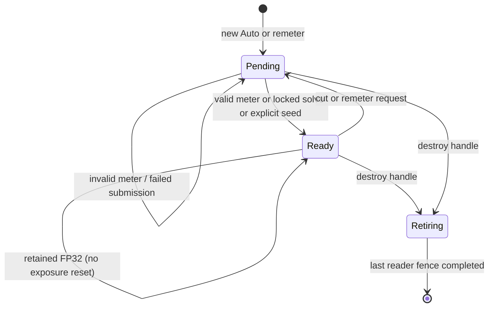

# PostProcessService LLD

Status: `in_progress` — exposure contract checkpoint; implementation follows the
[ten-slice delivery plan](../plan/exposure-and-lightbench-correction.md).
Historical VTX-M03 closure remains at its original fixed/auto baseline scope.

## Ownership and public boundary

PostProcessService owns exposure settings resolution, persistent GPU state keyed
by producer-owned `ViewStateHandle`, early frame-exposure resolve, exposure
solving before color resolution, Stage-22 bloom/tonemapping, and bounded
completed status. Renderer Core owns view registration, relationship validation
and transient transition routing.
SceneRenderer supplies the exact scene signal/SRV, depth/SRV and post target;
post-process passes cannot invent another input or output routing path.

After all SceneColor accumulation, SceneRenderer calls `PrepareSceneExposure`
before Stage 21. This solves from the FP32 accumulation and pins the numerical
result and post-process configuration for the logical view, state handle and
frame sequence. Stage 22 consumes that prepared result with the resolved color;
it does not meter a second time. This ordering also applies to stateless and
diagnostic views. Direct service fixtures may let `Execute` prepare its own
result when no prior preparation was supplied. A prepared result from another
service, view identity/lifetime or logical frame is rejected. Unavailable frame fallback
prevents the scene resolve and visible-output update.

ViewId is a frame-publication identity, never a temporal-history key. Native
applications and DemoShell submit the same public typed events and canonical
per-view exposure overrides. An override replaces exposure settings for that
view without mutating the scene. The native canonical authored settings type
lives in Scene/ExposureSettings.h; enums and scalar math stay in
Core/Types/PostProcess.h. This keeps resource handles out of Core's dependency boundary while Scene,
Vortex and adapters consume one settings vocabulary. Runtime mask references
use Content::ResourceKey; cooked records use source-local texture indices.

No local exposure, new temporal upscaler, second meter, legacy Renderer path,
or independent exposure/precision framework belongs to this delivery.
Equations and tolerances are owned by the
[PBR specification](../../renderer-core/physically-based-rendering.md).

Renderer-issued transition generations are the approved public contract:
`QueueExposureTransition(handle, policy, seed)` returns a request token, and
`RetryExposureTransition(token)` retains its generation. Implicit resets use
the same per-view counter. Queueing does not acknowledge GPU application;
completed status identifies the applied generation. Validate mode/settings
and source ownership together at the frame boundary.

Games report camera cuts or completed backend recovery with
`NotifyViewDiscontinuity(handle, ViewDiscontinuity)`. The reasons are CameraCut,
WorldReplacement and DeviceRecovery. Notifications coalesce until an eligible
frame capture and use the existing exposure generation allocator when the view
owns exposure: Auto remeters and fixed modes publish their authored gain.
An unsubmitted explicit exposure request takes precedence; diagnostics defer
pending discontinuities, and a notification after capture waits until the next
frame. A borrowing view invalidates its own camera/fog/HZB histories without
issuing an exposure-reset request for its source.

The renderer detects selected-camera changes on accepted publication and world
changes through each view's scene ownership identity. Ordinary image/light
changes do not request resets. DeviceRecovery is a notification after the
backend's resource restoration; it does not recreate a graphics device.
The captured per-view discontinuity also invalidates previous camera matrices
and temporal fog/HZB reuse. Numerical FP32/P bootstrap consumes this boundary
during the slice-5 HDR migration.

The public control surface uses `ExposureTransitionToken` (target, runtime
lifetime, renderer-issued generation, policy and optional EV seed) and
`ExposureTransitionStatus`. Syntax errors allocate no generation. A producer
can queue intent before first rendering its persistent handle; semantic
validation waits for its accepted frame settings and source ownership. Retry
of the latest identical token retains its outcome; older issued generations
are superseded without reactivating them. Conflicting latest-token payloads
and unknown/lifetime-mismatched identities are rejected. Shutdown clears the
registry and rejects new requests/retries. Status contains no numerical gain.

The pre-render capture boundary also snapshots registered inactive views.
Requests that have never been submitted can be rejected there for accepted
mode/settings or ownership violations. A submitted request remains governed by
its completed GPU status; a later mode change cannot reclassify it. Diagnostic
overrides defer validation/application. A rejected disposition remains attached
to its generation and is carried into later GPU records, so a later valid mode,
seed range or independent ownership cannot reactivate it. The GPU requested
generation still records that disposition without claiming application.

Explicit seeds resolve a positive log gain from the validated Auto settings at
the requested EV, without clamping that EV to metering bounds or constructing
linear seed luminance. Zero target uses nominal middle grey for the latent
seed. This scalar conversion does not itself apply a GPU transition.

Before publishing an immediate exposure submission, retain the recorder's
existing command list before closing it and inspect `IsSubmitted()` immediately
after release.
Recording/queue failure therefore cannot authorize publication or request
consumption. This is submission observation, not GPU completion; completed
status still supplies application acknowledgement. The reusable command-list
state must not be treated as a durable receipt across frame retirement.

## Settings resolution

`PostProcessConfig::exposure` is the sole writable exposure input and uses the
canonical `scene::ExposureSettings` defaults, including 3 EV/s upward and
1 EV/s downward adaptation. `SetConfig` validates the complete request before
activation; rejection retains the previous exposure and presentation settings.
`GetConfig` returns authored settings, so read-modify-apply never carries an
outdated resolved gain. ManualCamera resolution accepts camera EV as separate
context; subsequent edits in that mode retain the accepted camera EV when no
replacement is supplied. Rejected requests cannot change that context.

Passes consume `ResolvedPostProcessConfig`, an immutable validated snapshot.
Direct pass clients use its checked `Resolve` factory. Scene rendering uses
`BuildPassConfig` after capturing the view, combining presentation settings
with the captured accepted exposure, camera context and revision. No public
setter can modify the derived gain or individual resolved settings.
`PostProcessFrameBindings` retains its existing 112-byte GPU/capture layout;
its scalar exposure fields are derived together from that snapshot.

For a direct service view without a scene capture, the first frame preparation
routes the authored request through `CaptureViewExposureSettings`, including
mask loading and residency. Callers need only `SetConfig` and normal frame/render
calls. Accepted revisions belong to the view; callers do not synchronize a
service-global counter with mask preparation. Pending or failed replacements
retain the prior accepted exposure and mask together. The first unavailable
mask uses the documented initialization fallback and skips metering. An existing
scene capture is reused unchanged for the rest of its frame.

`CaptureViewExposureSettings` pins one complete accepted settings revision and
its resident mask lease for a logical view and frame. `InitViews` captures the
view family before scene rendering; family and single-view entry points also
capture when no prepared scene is available. The same revision supplies the
early exposure binding, solve constants, final post-process bindings and
transition-status identity. A later settings change, mask completion or mode
change becomes eligible at the next frame boundary. Repeated frame-start
notifications do not release a capture.

Stateless captures are keyed by logical `ViewId`, so multiple stateless views
remain independent; their captures are discarded at the next frame boundary.
Persistent accepted settings remain keyed by `ViewStateHandle`. The resolver
can validate pending intent without mutating an existing frame capture.

Resolve scene defaults, physical camera parameters for ManualCamera, and explicit
per-view override at a frame boundary. Validate all fields as one revision:
finite values, recognized enums, positive key/camera parameters/D, nonnegative
speeds/target, ordered EV range, `0<=low<high<=1`, positive histogram span,
black influence [0,1], radius nonnegative, and <=64 finite sorted curve keys.
Validate coupled resulting gain across the complete meter/curve interval and
initial/seed solutions against the operational domain. Never silently replace
zero target or valid small gains with a positive floor.

Mask and curve uploads are immutable for each settings revision. A pending mask
keeps the previous valid settings and resource; failure reports an error and
keeps that revision. Missing mask means unit weight only when no mask was
authored. Publish scalar settings and their mask/curve resources atomically.
Requested values and active revision are separately observable.

## GPU record layouts

All GPU scalar fields are 32-bit. C++ records are standard-layout, aligned to
16 bytes, with size and every field offset asserted against the HLSL contract.
64-bit counters use two uint32 words, low then high, avoiding shader-model
requirements beyond the existing SM6.6 baseline. Compare the full counter; no
truncated generation or ViewStateHandle comparison is permitted.

### FrameExposureData: 16 bytes

| Offset | Type | Field |
| --- | --- | --- |
| 0 | float | pre_exposure |
| 4 | float | one_over_pre_exposure |
| 8 | uint | global_exposure_state_slot |
| 12 | uint | flags |

ViewFrameBindings.frame_exposure_slot (byte 12) references this record.
ViewFrameBindings stays 64 bytes; other slots retain offsets. Publish one
immutable record before scene work and retain its descriptor through post-scene
publication. The old ViewColorData/GetExposure vocabulary is removed. Flags: bit 0
bootstrap/recovery FP32, bit 1 borrowed prior state, bit 2 transient diagnostic
unit gain, bit 3 source-initialization fallback. Reserved bits are zero.
Its former reserved word at byte 52 now carries `exposure_status_uav` for bounded
consumer-source collection; it is invalid when this view has no exposure frame.
The frame lease retains the corresponding buffer and descriptor through all
writers. This routing does not place numerical exposure under CPU control.

The pre-scene compute resolve owns a frame-retained structured SRV/UAV record
and reserves the current 80-byte state for the later exposure solve. It retains
the prior source and qualified candidate leases through the frame fence. A
repeated resolve of the same view/state pair returns the pinned record; failed
recording/submission does not publish it. Resolving P neither consumes a request
nor publishes new adaptation history. Zero displayed gain selects positive
latent gain for numerical P. Recovery and diagnostic frames use P=1; a missing
root history also forces the source-initialization fallback flag and FP32.

Scene publication binds this GPU record from the global structured-SRV domain;
the old PreparedSceneFrame exposure scalar no longer supplies numerical P.
Resolved SceneColor metadata retains the frame-record lease. Pre-scene
preparation failure returns to the view caller before HDR draws and does not
publish a replacement output. Display wireframe overlays run after tonemapping;
full-view HDR diagnostics use their pinned unit-exposure domain.

`VortexExposureFrameCS` uses a 48-byte structured constants record: output UAV,
reserved-current-state UAV, prior-state SRV and candidate-state SRV at offsets
0/4/8/12; fixed gain, initial log gain and seed log gain at 16/20/24; exposure
mode at 28; frame flags, controls and current-state SRV at 32/36/40;
current completed-status UAV at 44. The resolve clears this 80-byte record
before HDR producers run. Controls bit 0 means valid seed and bit 1 means zero target.
Candidate selection requires GPU eligibility and a streak
of at least two; the CPU integration must additionally validate completed
status identity, settings, event and layout before supplying that candidate.

`PrepareFrameExposure` captures the service revision and resolves the record
before its caller writes pre-exposed radiance. The subsequent solve writes the
reserved current state, while the frame record and its P remain unchanged.
Seed-based P selection does not replace the prior displayed gain before that
solve submits. On solve failure, a gain-only GPU copy restores the selected
fallback into the reserved state, including latest-borrow/source-loss continuity
and zero-target precedence. It imports no source request identity, publishes no
new adaptation history and acknowledges no request. If the fallback cannot
submit, the service skips tonemapping rather than consuming an invalid state.

### ExposureStateData: 80 bytes

| Offset | Type | Field / meaning |
| --- | --- | --- |
| 0 | float | displayed_scale S (zero allowed) |
| 4 | float | target_scale (zero allowed) |
| 8 | float | latent_scale (strictly positive) |
| 12 | float | latent_target_scale (strictly positive) |
| 16 | float | raw_metered_luminance |
| 20 | float | raw_metered_ev |
| 24 | uint | flags |
| 28 | uint | fallback_reason |
| 32 | uint2 | settings_revision |
| 40 | uint2 | requested_generation |
| 48 | uint2 | applied_generation |
| 56 | uint2 | frame_sequence |
| 64 | float | fp16_candidate_pre_exposure |
| 68 | uint | fp16_eligible_streak |
| 72 | uint2 | product_layout_revision |

State flags: history valid, initialized, meter luminance valid, meter EV valid,
synthetic dark solve, range failure, displayed-zero target, borrowed continuity,
and FP16 eligible occupy bits 0..8 respectively. Bit 9 records that a valid
metered EV has ever been stored, independently of current measurement validity
and gain initialization. Bits 10..11 store the active mode; bit 12 marks a
rejected transition and bits 16..19 store its reason. Remaining bits are zero. The synthetic-dark bit also
describes the retained EV when current metering is invalid.
Fallback reason enum: None=0, MissingHistory=1, InvalidMeter=2,
SourceUninitialized=3, SourceDestroyed=4, RangeFailure=5. A dark solve marks EV
valid but does not claim exact measured luminance. Last valid metered fields
remain stored on invalid input; current validity describes the current frame.

### ExposureCompletedStatus: 80 bytes

| Offset | Type | Field / meaning |
| --- | --- | --- |
| 0 | uint2 | view_state_identity |
| 8 | uint2 | frame_sequence |
| 16 | uint2 | settings_revision |
| 24 | uint2 | requested_generation |
| 32 | uint2 | applied_generation |
| 40 | uint2 | product_layout_revision |
| 48 | uint | flags: valid=1, range failure=2, FP16 eligible=4, rejected transition=8, producer failure=16, rejected current conversion=32 |
| 52 | uint | first_failure_product (zero means none) |
| 56 | uint | first_failure_kind |
| 60 | uint | fp16_eligible_streak |
| 64 | uint2 | candidate_state_generation |
| 72 | uint | transition rejection reason (0=none, 1=not Auto, 2=unsupported seed) |
| 76 | uint | reserved, zero |

Status contains identity/eligibility, not a CPU numerical-gain authority. The
candidate_state_generation references a retained GPU state record. Pin that
record until acknowledgment is consumed or discarded and all GPU readers
retire. Each in-flight frame has a distinct status allocation. Atomic first
failure wins using a compare-exchange on product ID; status completion requires
all producer writes before copying to the existing asynchronous readback ring.
Product IDs are assigned in SceneTextures' domain inventory.

A source curve key is two float32 values, eight bytes: EV at 0, compensation at 4.
Resolve its compensation, calibration/target logarithms and bounded-EV
subtraction together using compensated CPU arithmetic. Compile the resulting
piecewise-linear log-gain target at the union of authored knots, two EV clamp
edges and the two supported scene-radiance endpoints (at most 68 runtime keys).
Covering the full supported domain preserves last-valid-EV restoration when
the histogram window changes. This is the
same target function evaluated at raw metered EV, with every GPU ordinate in
[-32,32]; large cancelling authored values never require a linear intermediate.
Seed/dark/initial solves use the same exact combination before float conversion.

`ExposureTargetData` is a 560-byte structured record: uint key_count at 0,
uint flags at 4 (locked=1, zero-target=2), float initial_log_gain at 8,
float dark_log_gain at 12, then 68 float2 `(raw_ev, log_gain)` entries at 16.
Unused entries are zero. Publish it through the existing per-view transient
structured publisher and frame slot retirement. The authored/packed limit stays
64 keys; these additional points represent clamp/domain boundaries, not new
authored controls. This normalization avoids both intermediate exp2 overflow
and loss of small key bias during large compensation cancellation.

The histogram allocation has 256 uint bins followed by counters for finite,
weighted, weighted exact-black, weighted positive-below-window, rejected and
weighted dark samples (24 bytes), plus eight zero padding bytes: 1056 bytes
in total. The dark count includes finite nonpositive luminance. Classification
uses positive quantized base weight before black influence; a zero-influence
all-dark image therefore remains distinguishable from an empty mask. Counts
and mass are distinct.

Histogram pass constants are a 64-byte structured record: source/histogram
indices at 0/4, minimum log luminance/inverse span at 8/12, uint content
left/top/width/height at 16/20/24/28, mode/radius at 32/36, mask index/background
flag at 40/44, fixture inverse P/black influence at 48/52, frame-exposure SRV at
56, and zero padding at 60. With a valid frame SRV, metering reads 1/P from that
GPU record; the scalar is used only when no numerical-domain record is supplied.
The 112-byte unified solve record retains histogram/state indices at 0/4,
minimum log luminance/span at 8/12, low/high percentiles at 16/20, minimum EV/D
at 24/28 (D stored as log2), log2 up/down speed at 32/36, log2 delta/target SRV at 40/44, settings revision
at 48 and frame sequence at 56. The control tail is specified under
[Unified solve controls](#unified-solve-controls-slice-4-implementation). Both
records use the existing frame-retired structured publisher. Compute those rate/time logarithms in CPU double precision
before float32 upload; zero speed/time uses sentinel -256, outside every finite
positive binary32 logarithm. GPU adaptation compares bounded linear travel,
then evaluates the dimensionless exponential argument in log space. This
preserves finite answers when speed*time would overflow or a raw rate is
subnormal. Saturate the tail only when its exponent is mathematically >=128.

Compute percentile-times-total boundaries from the float32 significand and
integer histogram mass. Retain integer and rational remainder separately.
Integrate complete integer mass plus each boundary's fractional tail; when
both boundaries lie inside one mass unit, return its containing bin directly.
Never subtract float32 cumulative counts near the maximum mass: that can erase
valid narrow intervals. Use two uint32 words and four 16-bit partial products for the rational
product; do not require optional float64 or 64-bit integer shader support.
Shader Model 6.6 does not imply
[Int64ShaderOps support](https://learn.microsoft.com/en-us/windows/win32/api/d3d12/ns-d3d12-d3d12_feature_data_d3d12_options1).
Reuse existing upload/descriptor allocators and fence retirement.

## Frame sequencing and GPU lifetime

```mermaid
sequenceDiagram
    participant Game
    participant Views as ViewLifecycleService
    participant Post as PostProcessService
    participant GPU
    Game->>Views: handle + settings + transition generation
    Views->>Post: validated owner/root and frame snapshot
    Post->>GPU: resolve immutable FrameExposureData from prior state
    GPU->>GPU: UAV to SRV ordering before first HDR producer
    GPU->>GPU: scene writes P*C_scene; record range/eligibility
    Post->>GPU: FP32 SceneColor histogram and owner-only current state solve
    GPU->>GPU: current state UAV to SRV ordering
    GPU->>GPU: Stage 21 color resolution with final S available
    GPU->>GPU: bloom and tonemap consume S/P
    GPU->>GPU: copy completed status after all producers
    GPU-->>Post: fence-completed asynchronous status
    Post->>Post: matching format eligibility only; retire leased generations
```

Freeze source/prior generations for the entire logical frame before executing
any view. Allocate a distinct current generation rather than overwriting a
buffer still read by another view or frame. Publish only successfully submitted
work. Failed recording/submission leaves requests pending. An owner updates at
most once per logical frame, even if multiple products use its view. All resource
and descriptor releases wait for the last consuming fence, including readbacks
and source-destruction copies. Frame allocation count follows actual frames in
flight, not a hard-coded two-buffer assumption.

## Lifecycle and precedence

Resolve settings changes, mode and event in one frame snapshot. Highest request
generation wins; resubmission of identical contents is idempotent. Conflicting
contents at the same generation are invalid. Explicit policy wins over implicit
first-use/cut policy. Remeter/Seed in Manual or disabled mode is rejected with a
diagnostic, never saved for a later mode. A borrower cannot reset its root.

For an independent ordinary view, solve in this order:

1. Authored disabled -> S=1; Manual/ManualCamera -> authored gain immediately.
2. Explicit Auto Seed -> current target/bias/curve evaluated at requested EV;
   do not clamp seed EV to meter bounds. Publish for this event frame; consume
   generation even without a valid histogram. Zero target still displays zero.
3. Locked Auto range -> fixed solve without histogram; consume pending remeter.
4. Zero-target entry -> displayed zero immediately; continue positive latent solve.
5. Positive-target restoration -> current meter, else last valid EV, else normal
   initialization. Never invert former displayed zero.
6. Pending remeter/new Auto -> first valid current measurement applies directly;
   retain pending generation during invalid metering.
7. Manual-to-Auto or destroyed-source continuity -> retain transferred gain for
   one transition frame, then adapt independently. Zero/locked rules win.
8. Ordinary initialized Auto -> exact hybrid adaptation; invalid meter retains
   gain/last valid measurements and marks current input invalid.

Missing history with invalid meter uses the source/owner Auto EV0 fallback,
clamped to its EV bounds and evaluated with its target, key, bias and curve;
never use the inactive Manual EV. Initialization remains pending. Explicit seeds
outside meter range are legal when the resulting gain is numerically supported.

Native scene qualification exercises these rules through both forward and
deferred rendering, including supported HDR endpoints, paused cuts, explicit
seed/Preserve precedence, retries, invalid initial metering and both camera
projections. Physical camera inputs and authored modes are checked against the
rendered pixel as well as GPU state. Rejection is visible in the event-frame GPU
record; public CPU status changes only after its normal completed-status poll.
The [EX05-22 evidence](../../out/build-ninja/analysis/vortex/exposure-lightbench/lifecycle/scene-lifecycle-manifest.json)
records the independent histogram, hybrid-response and final-pixel oracles.

A new view, camera cut, replaced world or device recovery remeters by default.
Preserve and Seed are explicit alternatives. Walking, streaming, light changes,
compatible resize and format changes preserve exposure. Stateless Auto uses
transient state, FP32 metering and no temporal adaptation on every invocation.

A temporary diagnostic unit-gain override creates transient frame output while
preserving authored mode, history and pending events. It is distinct from
authored disabled exposure. On leaving it, apply any pending cut/reset; otherwise
resume retained history. Camera/color history invalidation remains with its owner.



## Source-owned sharing

Resolve chains to one registered root; reject cycles/unknown handles atomically.
Only the root meters/writes its state. Borrowers use pinned published prior
source state for both displayed gain and numerical P, independent of render
order, with one frame of result latency. Local borrower exposure settings do
not modify borrowed gain. If root is inactive, retain its last publication.
With no publication use the root's disabled/manual/seed/EV0 initialization gain;
never initialize from a consumer image. Bootstrap suitability remains per view.

The scene-integrated sharing regression uses separated owner/consumer cameras
and emissive surfaces on both shading paths. It alternates actual execution
order through optional auxiliary dependencies, verifies source-mode changes and
zero/restore latency, retains an inactive root through idle pruning, and checks
source removal for Auto, Manual, ManualCamera, disabled and zero-target
consumers. Diagnostic source frames preserve queued exposure intent. These
numerical scene tests supplement the separate native MultiView layout and
visual acceptance matrix.

A borrowing-view cut resets its camera/color histories and bootstrap, not root
exposure. Explicit detachment remeters by default; Preserve/Seed are opt-in and
do not revive dormant independent history.

Changing a registered view from a shared source to independent exposure records
a pending detach. At the next eligible frame capture, the renderer issues its
generation through the same allocator as public requests: Remeter for Auto,
Preserve for fixed/disabled modes whose solve applies the authored value.
An explicit queued request that has not been submitted takes precedence.
Diagnostic output defers the pending detach rather than consuming it; returning
to sharing before capture cancels the pending detach.

Captured settings, mask leases and GPU state resources carry the renderer's
view lifetime. Own-history reuse and shared prior/initial-state lookup require
that lifetime to match. Reusing a handle therefore cannot import old accepted
settings or another lifetime's GPU result, even while old readers retain their
frame-pinned resources. Completed status carries this lifetime on ordinary
frames as well as frames containing a transition token.

An accepted replacement of a published view's persistent handle retires the
old transition lifetime, settings/mask ownership, status jobs and latest GPU
state after releasing the registry lock. This includes becoming stateless.
Rejected publications leave the prior owner intact. Existing frame and GPU
reader leases remain valid through retirement.

On root destruction detach all affected chains at the next boundary. Copy last
borrowed displayed and positive latent gain into each consumer-owned state
before retiring root resources. Auto retains that gain for one frame, then
meters independently; Manual applies its setting and disabled uses one. Consumer
zero target wins. If borrowed displayed gain was zero but local target positive,
retain zero only for the continuity frame, then use the positive latent gain
while awaiting a valid meter. Missing publication uses captured root fallback.

Removal snapshots the root definition, pending seed/rejection and affected
consumer lifetimes before erasing registry edges. Existing services retain the
root's immutable GPU publication immediately; a service created later can use
the captured initialization definition. Deferred delivery targets only the
consumer still awaiting its event, so a diagnostic sibling cannot replay an
already-consumed event or recreate a retired consumer.

Each consumer retains its last selected borrowed state separately from its last
successful solve. This includes direct-root fallback selected after a failed
consumer copy; failed work does not advance its solve or transition identity.
Continuity copies only gain fields from that selection, preserving the
consumer's request identity and clearing foreign metering history. Its displayed
zero is held for that event frame without taking a logarithm or reciprocal;
the following invalid-meter frame uses the retained positive latent gain.

## Bootstrap, recovery and format eligibility

Use the two modes and suitability rules in
[SceneTextures](scene-textures.md#exposure-hdr-domain-and-format-inventory).
New unseeded Auto, remeter, device recovery and stateless Auto use FP32 and P=1.
A borrower with only root fallback also starts FP32. Keep metering/adapting while
FP32 is retained because required products cannot fit FP16; format retention is
not a transition event.

A valid history acknowledgment is necessary but insufficient for return. Require
matching view lifetime, settings, applied/requested generation, product layout,
two consecutive eligible completed frames, half-error margin and two stops of
overflow margin. The first FP16 frame pins the qualified candidate GPU P record;
CPU does not read or compute P. Stale or delayed status cannot demote a view.

SceneRenderer selects the format before radiance production from the current
required-product layout. A borrower's precision epoch also includes source
identity, lifetime, settings revision, requested generation and pending/applied
state. It remains FP32 while a source request is pending and starts a fresh
qualification streak after that request completes. A published but uninitialized
source retains the GPU source-fallback/FP32 flags.

The evaluator accepts typed half intermediates only for sky-view, AP and fog
products (5/6/10), using their recorded pre-store error enclosures. Their decoded
half values are not exact reference samples. Accumulation/conversion input stays
FP32. Conservative uncertainty may retain FP32 even when gain history is valid.

The product evaluator uses a 48-byte GPU reduction record: candidate P and
maximum scene RGB at 0/4; checked-product mask and failure flags at 8/12;
first failed product and rejected-sample count at 16/20; metering, image and
overflow failure counts at 24/28/32; checked-sample count, expected mask and
reserved zero at 36/40/44. Product IDs 1-31 map to mask bits 0-30. Failure bits
are nonfinite input=1, insufficient overflow margin=2, image error=4, metering
error=8, missing product=16. The record is frame-retained with existing exposure
resources and is not itself a format-admission certificate.

After a submitted product evaluation, `FinalizeFp16Suitability` updates only
precision metadata in the current 80-byte exposure state and writes the existing
80-byte completed status. Fresh frame solves clear inherited eligibility; a
missing current-frame evaluation cannot finalize. The GPU compares the view's
own prior precision record, including for borrowers. Two consecutive rendered
results for that view must qualify with identical settings, requested/applied event
generations, product layout and candidate P. Inactive engine frames do not count
as failed view results; an intervening solve without qualification clears the
streak. Streaks saturate at two; repeating
finalization in one frame cannot advance them. Explicit invalidation restarts
the streak, and source identity/lifetime changes cannot inherit it. Callers
invalidate prior qualification for source-control events and recording failures.

An incomplete transition, invalid/uninitialized gain, stateless view, diagnostic
override or unpublished-source fallback cannot qualify. A terminal rejected
request does not remain a pending reset. Range/product failures reset the streak
and publish failure product/kind without altering gain, metering or exposure
event state. Settings/layout changes and candidate-scale changes
restart at one qualifying frame. The candidate state generation is its GPU
frame sequence. CPU admission must still validate completed identity/revisions
and retain the matching GPU lease; this finalizer does not select resource formats.

The finalizer's 64-byte constants are state UAV, own-previous SRV, status UAV,
report SRV at bytes 0/4/8/12; layout uint2 at 16; required mask at 24; controls at
28 (persistent=1, invalidate previous=2); frame SRV at 32; expected frame uint2
at 36; optional current-conversion report SRV at 44 (invalid index when absent);
lifetime uint2 at 48 and two zeros at 56. All uint64 identities
use uint2 arithmetic, including frame-counter carry. Completed flags are valid
state=1, failed qualification=2, eligible=4, rejected transition=8 and
producer-origin failure=16.

The current-frame conversion and future candidate evaluation have separate
48-byte reports retained by the same frame lease. Candidate evaluation cannot
overwrite the conversion verdict consumed by tonemapping. In FP16 mode the
finalizer also requires a successful current conversion; FP32 recovery may
qualify a future scale even when narrowing at the current scale would fail.
This adds a bounded reduction buffer, not another HDR texture.

`SelectPrecisionCandidate` configures the view's settings, lifetime, transition
and required-product identity before frame preparation. It returns only a
completed eligible state lease; the numerical candidate P remains GPU-owned.
`PrepareScenePrecision` evaluates the supplied products and produces current
and candidate error certificates before checked conversion. It does not finalize
eligibility or queue a completed status. `FinalizeScenePrecision` runs after any
checked conversion and before post-process publication, so the current conversion
verdict participates in eligibility. It then queues one combined transition/
precision status copy. Both uses share the existing three-pending/one-deferred queue.
Qualification changes invalidate pending admission; duplicate finalization is
idempotent. A failed solve is distinguished from successful same-frame reuse.
Even when a fallback copy succeeds, preparation immediately invalidates the
precision epoch/candidate and restarts qualification; its fallback cannot certify
FP16. The next valid results start at streaks one and two. This leaves displayed
fallback and pending exposure intent intact. Reusing a successfully submitted
solve retains its deferred transition acknowledgement and can finalize normally. Copy transport failures retry the retained record, while a completed
packet with stale identity is discarded. Completion may acknowledge its original
transition but may admit precision only for the current matching qualification.

The evaluator reads FP32 2D/3D reference products and their stored P. A GPU
maximum reduction selects the largest bounded power-of-two P that leaves two
stops of headroom; candidate narrowing is then evaluated against half the
image-error budget and 1/1024-EV metering tolerance. Image checks include both
scene-referred and S-scaled error, so insignificant RGB loss can pass while the
same loss amplified by displayed gain fails. Metering checks use the existing
bounded sample grid, content rectangle, mask/profile and quantized coverage
weights. Missing products and nonfinite samples cannot produce an empty pass.
Dark classification and black-influence mass quantization share the production
meter helpers. A zero-mass dark sample need not preserve positive-versus-zero
luminance, but weighted/dark classification still preserves the aggregate
synthetic-dark fallback. A contributing positive sample retains the stated EV
bound. The evaluator constants retain their original 80-byte prefix with radius, error-budget share,
minimum log luminance and accepted black influence at offsets 64/68/72/76.
The evaluator record is 128 bytes. Consumer RGB gain is at 80 and the current
producer-bound status SRV at 84. Byte 88 carries the selected-P report SRV only
for candidate-store reduction; byte 92 carries a required upstream product mask
for current scene conversion. Presentation controls occupy the new tail:
linear background RGB at 96/100/104, tone-mapper kind at 108, gamma at 112, and
three zero words at 116/120/124. Point/product modes ignore presentation fields.
Scene collection captures AP scattering
strength with the same nonnegative clamp as the consumer. The gain participates
in the per-view product revision so an old completed certificate cannot survive
an amplification edit. No additional HDR texture or status buffer is introduced.

For this local gate, divide the absolute allowance successively by
`max(consumer_gain,1)` and `max(S,1)` while retaining the relative allowance.
This preserves both the existing product check and its amplified contribution
without overflowing a `consumer_gain*S` product. Nonfinite or negative supplied
gain rejects qualification. This gate catches AP amplification loss; it does not
certify attenuation, filtering, temporal or complete composed-image error.

Qualification reads the existing GPU-only producer tail for sky view, AP and fog.
Its reference interval includes retained producer/history error before adding
candidate-store error. The maximum reduction includes finite reference upper
bounds; local RGB/transmission allowance checks cover both interval endpoints.
Zero records retain the exact-point path. Invalid or unbounded certificates
reject image qualification, while an unrelated producer record cannot taint this
product. No numerical CPU readback or new status allocation is added. This is
local product/history admission, not final composed-image or meter propagation.
Validate endpoints after their final normalization/outward expansion, not only
before it: finite certificates near the FP32 limit can overflow during that
last operation. Nonfinite compared endpoints reject admission explicitly; an
`Inf > Inf` comparison cannot serve as the rejection condition. Direct-product
metering checks both finite luminance endpoints for retained classifications,
mass and EV error. SceneColor still needs the full composition/coverage bounds.
Flag bit 4 selects the frame's pinned P instead of a newly selected candidate;
this mode qualifies a current-frame conversion, not a future admission scale.

The checked SceneColor conversion runs after the exposure solve so the image
check uses the final displayed S. It checks the entire FP32 source, including
coverage and actual meter contribution, before any RGBA16F destination write.
Coverage follows the resolved SceneBackground policy used by production
metering: without background compositing, alpha does not suppress meter weight
or unpremultiply RGB. With it, quantized coverage and unpremultiplication apply.
All writes are gated on the completed GPU report. Failure leaves the destination
untouched; submission success is not permission to publish or sample it. The
SceneRenderer integration must retain/use FP32 on rejection and must not infer
success from the CPU recording result. This operation alone does not enable
automatic format admission.

`ConvertQualifiedSceneColor` uses 32-byte structured constants: source SRV,
destination UAV, report SRV, width and height at offsets 0/4/8/12/16, followed
by three zero words. It preserves the frame's stored RGB domain and narrows
saturated coverage consistently with the qualifier. Existing frame-retained
publishers and the 48-byte report provide lifetime and synchronization; no
additional full-resolution texture or exposure history is allocated.
Cumulative blend/error aggregation and GPU stability determine eligibility;
matching completed status authorizes production format admission independently
of this current conversion result.

Normal-path pre-store overflow/nonfinite or required-signal underflow invalidates
metering and retains history. Schedule FP32 recovery after completed status,
without blocking. FP32 out-of-domain input reports a content/range error and
retains valid history. Use bounded status and no full-resolution telemetry target.

The completed ticket records whether its view used the normal half format and
owned Auto exposure. A matching normal-frame producer failure or rejected current
conversion invalidates that precision epoch. A producer failure on an Auto owner
receives one implicit renderer-issued Remeter request. Conversion-only rejection
preserves the valid FP32 meter and ordinary adaptation; fixed modes and borrowers
only return their own products to FP32. Borrower failures never reset the source's
numerical history.
Renderer allocation checks lifetime and generation under the transition lock, so
a newer explicit request or recreated view cannot be superseded by old GPU status.
The invalidated epoch discards other queued packets from that normal-mode attempt.
Prospective suitability failure and continued FP32 retention issue no transitions;
normal adaptation continues until fresh stable eligibility permits return.

## Slice 5.1 FP32 baseline and precision policy

**EX051-04 delivery: validated.** Keep the existing
`fp32` selector as a format-only diagnostic: it preserves its own qualified P
and still executes certification. It is not the FP32-only performance baseline.

The new control has these requirements:

- Use FP32 SceneColor accumulation, resolved color and per-view sky/AP/fog
  storage. Set frame P and 1/P to one.
- Keep Manual, ManualCamera, Auto, disabled and zero-target exposure behavior;
  preserve metering, adaptation, masks, curves, events and owner/borrower routing.
- Keep ordinary rendering, temporal reprojection, current-frame finite/range
  protection and exposure-transition acknowledgements.
- Do not gather prospective FP16 gradients, build FP16-only error certificates,
  evaluate half eligibility, narrow SceneColor or enqueue eligibility-only
  readbacks. Keep a shared calculation only when an active non-admission consumer
  needs it; identify that consumer in the control's implementation review.
- Publish an unconditional FP32 extraction with the normal immutable exposure
  record. No conditional conversion verdict or fallback texture is required.
- Select the control at runtime in the existing native benchmark executable.
  On a mode change, invalidate precision candidates and rebase or rebuild affected
  radiance histories. Preserve exposure gain and authored transition requests.

`DiagnosticsService::SetHdrPrecisionControl` selects `kProduction`,
`kFp32Reference` or `kFp32Only`; the existing format-only Boolean accessor keeps
its original semantics. SceneRenderer captures the selection before preparing
the view. Frame-exposure flag `0x10` identifies FP32-only to producer shaders
without changing GPU record sizes. Changing this mode invalidates the precision
epoch and rebuilds per-view environment history; exposure state and authored
requests retain their owner/lifetime and generation.

The baseline omits candidate/product qualification, gradients, producer store
certificates, composition-bound publication, conversion reports and eligibility
readbacks. Range-only pre-environment/final SceneColor scans still classify
original FP32 values; producer store/source checks still feed the same range
status and exposure solve. The common state/status buffers remain necessary for
that protection and normal exposure. Transition-only readbacks remain active.
Fog samples and rebases its ordinary temporal history without executing the
FP16 error-certificate calculation; mode changes rebuild that history before
crossing the certificate domain.

The existing Release workload selector accepts `fp32-only` in the same binary.
`OXYGEN_EXPOSURE_BASELINE_FRAMES=warmup` writes an untimed warmup manifest for
paired frame-count selection; numeric values retain the sampled-run behavior.
All recipes now record final output/gain/P/rejection checkpoints outside their
sample window, including controlled cases. The
[04 checkpoint](../../../out/build-ninja/analysis/vortex/exposure-lightbench/slice51/fp32-only/checkpoint-manifest.json)
records 109 passing Debug checks (latest unique outcomes), 13 passing Release
checks and both 234-module shader builds. The five new native cases exercise
mode/gain/event preservation, fixed/zero-target operation, both existing shared
lifecycle paths, and actual temporal rendering with mode reset and range
failure/recovery. Existing FP32-reference and fog-edge controls also pass. The
initial temporal assertion read observations after the offscreen session had
reset them; the corrected test captures the submitted view in the existing
post-render callback. Raw failure evidence is preserved. This closes the
baseline implementation; its performance comparison belongs to EX051-05.

EX051-05 compares total production behavior with this baseline in four fixed
pairs. Record actual P, formats and rejection reasons at untimed checkpoints.
The existing temporal format-only comparison has 13 differing P observations
across seven phases; its measured memory difference describes the two complete
operating trajectories.

**EX051-09 delivery: an explicit precision state/decision table before code.**

| State | Required work | Exit condition |
| --- | --- | --- |
| FP32 operation | Normal exposure/rendering, range protection and valid history; no repeated full prospective qualification without an attempt trigger. | The selected policy starts an admission attempt after a named input/event change or bounded retry condition. |
| Admission attempt | Fresh required-product checks, gradients and candidate/error certificates for the participating frames. | Two actual consecutive eligible frames for the same valid candidate permit FP16; rejection returns to FP32 operation. |
| Qualified FP16 | Current-frame producer protection, checked SceneColor conversion, correct P/history rebasing and retained FP32 fallback. | Range/conversion failure or a validity-key change selects the existing safe recovery behavior. |
| Recovery | P=1 and FP32 products; preserve event precedence and valid adaptation. Producer range failure follows the existing remeter contract; conversion-only rejection preserves solved exposure. | A named recovery/retry condition permits a new admission attempt. |

The table must list view lifetime, settings/mask/curve revision, exposure event
generation, source-owner identity, required-product layout, radiance-producing
inputs, temporal source/P/error state and shader-debug mode as validity inputs.
Define which of those inputs each reusable result depends on. A reused result
cannot turn an unchecked frame into an eligible frame. Old acknowledgements
cannot cross a lifetime, generation or precision epoch. Shared gain does not
qualify a consumer's local products. General fog rendering changes belong to
the environment owner; this item owns only exposure-related precision behavior.

### Agreed EX051-09 precision policy

**Approved by the user on 2026-09-20; implemented and Debug-qualified.** The four
[05 decision pairs](../IMPLEMENTATION_STATUS.md#ex051-05-results-and-decision)
show no frame-time benefit from the current dynamic policy. C01 admits half but
trades 3.063/6.640 ms of GPU frame p95 for 106.000/398.625 MiB of steady placement
at 1080p/4K. C02/I02 remain FP32 while paying admission cost. All output budgets
pass. The agreed decision accepts that measured C01 memory tradeoff for
FP32 production and end further production FP16 optimization in this slice.
It does not waive bounded-lifetime accounting or final 13/GATE budgets.

Use the existing owners and runtime controls; add no precision framework or
alternative renderer. `production` would use the qualified FP32-only behavior.
Keep `fp32-only` as the explicit benchmark reference, preserve `fp32` as the
existing certified format diagnostic, and expose the existing checked-half
path only through an explicit `qualified` diagnostic control. That control
preserves coverage of the implemented admission/conversion/retained-reader
contracts; it is not another production optimization experiment.

| State | Concrete work | Exit / retry decision |
| --- | --- | --- |
| FP32 operation (production default) | FP32 accumulation, resolved color and per-view sky/AP/fog; P=1; normal GPU-owned exposure, metering, adaptation, masks/curves, sharing, events, temporal reprojection and current range protection. No admission scans, error certificates, conversion reports or eligibility-only status jobs. | Ordinary scene, camera, settings and brightness changes remain FP32. No automatic admission or periodic retry. Only an explicit diagnostic control enters qualification. |
| Candidate attempt (explicit diagnostic only) | Existing full required-product checks, gradients and fresh candidate/error certificates. `fp32` keeps FP32 storage; `qualified` may admit half. | Two actual consecutive eligible submitted/completed frames with the same valid candidate are required. Missing/failed products or identity/epoch changes reset the streak. Continuous checking occurs only while the explicit diagnostic is requested, as with the existing format diagnostic. |
| Qualified FP16 (explicit `qualified` diagnostic only) | Preserve existing producer protection, current checked conversion, P/history rebasing, reports and independent FP32 fallback leases. No cached certificate substitutes for current checks. | Range/conversion failure or an invalid identity selects existing FP32 diagnostic recovery. Leaving the diagnostic enters production FP32, invalidates eligibility and rebuilds radiance histories. |
| Recovery | Production remains FP32/P1. Invalid current metering preserves valid gain/history; fresh valid measurements and authored requests follow existing exposure rules. Device recovery, cuts, seeds, source loss and zero-target precedence remain owned by existing lifecycle code. | No production half retry. Within an explicitly selected diagnostic, retain existing failure handling: producer failure follows the Auto-owner remeter contract; conversion-only rejection preserves solved gain; borrowers cannot reset the source. |

This proposal deliberately makes admission and qualified-half states unreachable
through automatic production behavior. It retains the established diagnostic
algorithm rather than promising an unmeasured admission cadence or inventing
scene-change heuristics.

| Validity input / result | Required treatment |
| --- | --- |
| View lifetime and source-owner handle/lifetime | No state/status/candidate can cross view removal/recreation or source replacement. Borrowed numerical gain never certifies the borrower's image. |
| Settings, mask and curve revision; requested/applied exposure generation | Preserve authored intent and GPU gain. Reject stale eligibility and acknowledgements; require a current matching packet before CPU completion. |
| Precision control/epoch, required-product layout and shader-debug mode | A control revision rejects older status packets before polling can acknowledge them. Crossing between FP32-only and certified operation invalidates eligibility and rebuilds radiance history. The compatible `fp32`/`qualified` format diagnostic keeps its qualified P. Qualification-attempt epochs gate eligibility separately, so a failed certificate cannot erase a valid authored solve. Diagnostic/unit-gain overrides retain precedence. |
| Radiance-producing inputs | Production has no reusable half certificate. Diagnostics check actual current products each frame; no reused result stands in for changing materials, lights, environment or camera-dependent radiance. |
| Temporal source texture, stored P and error state | Production uses FP32 history with ordinary RGB rebasing. Diagnostic current/previous error propagation remains fresh and lease-pinned. Incompatible mode/layout/history changes rebuild, never reinterpret, old contents. |
| Frame P/S and retained consumers | P/S remain GPU-owned and immutable for each submitted frame. Old color, descriptors, state and reports retire only after their readers and fences; 10A's independent color ownership remains intact. |

The control/default change and named mode/acknowledgement gap pass 122 focused
Debug checks: 97 CPU and 25 native. Both directions of a control change reject
an older completed packet before it can acknowledge a seed; a fresh packet
acknowledges the same solved seed without reapplying it. Qualification-attempt
failures still preserve valid authored-solve acknowledgements. The existing
delayed-status, shared/layout, failed-solve and queued-consumer cases pass with
explicit diagnostic selection and unchanged test identities. The
[checkpoint](../../../out/build-ninja/analysis/vortex/exposure-lightbench/slice51/production-policy/checkpoint-manifest.json)
records commands and frozen hashes. Proceed to 11 CPU attribution,
12 owning correctness gates, 13 final acceptance and 14 closeout. The 0.683 ms
I02 FP32-only explicit-exposure p95 already identifies a remaining budget gap;
this proposal makes no claim that 13/GATE is satisfied.

### EX051-11 CPU attribution checkpoint

The approved FP32 default was measured through the existing CPU profiler in an
isolated optimized Release build with Tracy enabled. One missing exposure-owner
scope was added, followed by nested Graphics acquisition/finalization and D3D12
binding/submission/wait scopes to diagnose the first result. Each frozen batch
passes its one Debug production smoke and one I02 native run; each captures
6,000 steady frames and verifies all 1,005 input hashes. These traces qualify CPU
attribution only, not production GPU performance or the final matrix.

The detailed trace gives the following **elapsed main-thread** intervals,
intersected with the exposure-owner interval union. Nested categories overlap;
their percentiles must not be added. Backend frame-start waits are outside this
union. Driver and scheduler time remain included, so these are not active-only
CPU measurements.

| Interval, two-view I02 at 1080p | p95 ms | p99 ms | Observation |
| --- | ---: | ---: | --- |
| Exposure owner union | 0.762 | 0.902 | Active-CPU target 0.15/0.30 ms is not demonstrated. Initial trace was 0.776/0.946 ms. |
| Recorder acquisition | 0.128 | 0.154 | Eight acquisitions per frame. |
| Recorder finalization | 0.265 | 0.325 | Includes eight immediate submissions and retirement bookkeeping. |
| Native `ExecuteCommandLists` | 0.206 | 0.256 | Nested inside finalization; about 25% of aggregate exposure elapsed time. |
| Compute-pipeline binding | 0.066 | 0.080 | Twelve bindings per frame. |
| Exposure outside acquisition/finalization/binding | 0.314 | 0.367 | Settings, state/resource tracking, publication, recording and profiling remain in this interval. |
| Explicit fence wait inside exposure | 0 | 0 | No matching wait interval in any sampled exposure scope. |

Subtracting native submission intervals frame by frame still leaves
0.563/0.662 ms p95/p99. This subtraction is diagnostic, not a replacement metric
or permission to exclude driver CPU work from acceptance. No isolated
exposure-bookkeeping correction has been demonstrated to close the gap. Removing
one adjacent range/solve submission would address only part of the eight
submissions; retaining event ordering, immutable records and submitted-work
acknowledgements remains mandatory.

**Agreed scope (user approval, 2026-09-20):** execute the two specific candidates
below as separate increments. EX051-11 already includes Graphics callers; the
earlier broad wording did not establish a need for a general submission rewrite.
The traces show elapsed costs, not a proven descriptor bottleneck or pure active
CPU cost. Keep 11 in progress until its measured decision is recorded; final
budgets remain in 13/GATE.

| Candidate | Concrete ownership/change | Verification and stopping condition |
| --- | --- | --- |
| EX051-11A | `SceneRenderer` currently invokes `CheckSceneColorRange` immediately before `PrepareSceneExposure`. Move the final range recording into the enclosing exposure operation. One recorder owns final range, histogram and solve, with one successful submission before state publication. Two-view I02 should fall from eight exposure command lists to six. | Prove exact recorder count and unchanged GPU work/order; focused Debug range/numerical, failure/retry, transition/generation, sharing and queued-reader cases, then owning exposure correctness. Compile affected Release paths and use the existing I02 trace controls for a matched CPU comparison. Retain only with correctness and demonstrated benefit; reject without broadening into other renderer stages if it does not help. |
| EX051-11B | `RecordState` called `UpdateHistogramConstants` before clear and again before accumulation with the same inputs. Attribute publication, then evaluate publishing one immutable record and binding its index for both dispatches. Evaluate any further constant/descriptor reuse only after its cost and safe ownership are established. | Compare publication/descriptor activity and CPU time; qualify histogram/mask, two-view, mode/event, lifetime and retained-reader behavior. Payloads, shader layouts and output budgets stay identical. For this candidate, the user explicitly directed consideration of clarity, maintainability and resource reductions when timing benefit is small or absent. Report each benefit separately; fewer publications do not establish a frame-time improvement. |

11A keeps frame P/state resolve and pre-environment range as separate submissions:
intervening rendering work makes them different ordering boundaries. Each GPU
phase keeps its existing timing scope and required transitions/UAV ordering.
Recording is not submission: failed acquisition, recording or submission must
not publish a solved state, mark a request submitted or acknowledge a transition.
Partially recorded resources remain safely retained. Existing explicit diagnostic
qualification, fallback and retry semantics remain covered.

11B uses `PerViewStructuredPublisher` / `TransientStructuredBuffer` as the
existing publication path. Rebinding a record within one recording does not
permit mutation of its payload. Persistent/reusable backing storage or descriptors
must wait for all queued readers and GPU retirement; a frame-slot index alone is
not a lifetime proof. No new scheduler, general command-batching framework,
cross-frame deferral or renderer-wide allocator redesign is approved by these
candidates. Numerical contracts, production FP32 policy, budgets and final matrix
are unchanged. Commit each candidate's accepted correction or rejected result
before the next production correction. Use the existing validation subagent and
frozen serial native batches; raw results remain in the single checkpoint tree.

**11A accepted:** final range and solve share one recorder when a new solve is
needed. Reusing an already-submitted same-frame solve still checks the current
accumulation independently; it cannot reuse an earlier range verdict. The normal
scene caller explicitly requires the final range guard. Standalone range/kernel
checks use the same recording helper.

All 228 native exposure cases and 88 owning CPU checks pass (latest unique
outcomes). Two existing fixtures needed their explicit diagnostic mode restored
after renderer reconstruction; the repeated fog-history fixture also needed the
backend frame boundaries that drive attachment retirement. The original failures,
CDB null-buffer diagnosis and affected-only reruns are preserved.

The matched optimized I02 trace records six exposure acquisitions/submissions in
every one of 6,000 frames, versus eight previously. Elapsed exposure CPU p95/p99
falls from 0.762/0.902 to 0.646/0.760 ms (15.2%/15.7%). The five candidate-cycle p95s
range from 0.599 to 0.669 ms, below the baseline range 0.744–0.782 ms. GPU phase
counts and memory placement are identical; steady texture/buffer creations remain
zero. All four endpoint pairs preserve gain and pass the existing image budgets;
three are identical, and the remaining maximum difference is 1.49e-7 with at most
one UNorm8 code. All 1,011 frozen inputs remain unchanged. See the
[11A decision table](../../../out/build-ninja/analysis/vortex/exposure-lightbench/slice51/cpu-attribution/recorder/decision-table.json).
This accepts the candidate, not the active-only CPU target or final GPU matrix.

**11B accepted for resource work and maintainability:** `PublishHistogramConstants`
now returns one immutable record per view. `RecordState` explicitly rebinds it
after both pipeline changes. This separates allocation/publication from binding
and avoids constructing and publishing the same payload again. The trace confirms
four publications per two-view frame become two: 12,000 fewer publications over
6,000 frames. The existing publisher makes one staging allocation and descriptor
lookup/create operation per publication, so both operation counts are halved for
these constants. Payload writes fall by 128 bytes per two-view frame; allocated
GPU texture/buffer placement is unchanged. No descriptor-heap capacity or resident
memory reduction is claimed, and no persistent cache or lifetime extension was
introduced.

Total exposure elapsed CPU p95/p99 changes from 0.640/0.804 to 0.664/0.775 ms;
cycle ranges overlap. **No total CPU/frame-time improvement is demonstrated.**
The pre-change helper accounts for only 1.9% of aggregate exposure elapsed time
(0.011 ms p95). Its scope includes binding before the refactor; binding remains
inside the enclosing exposure interval after the refactor, so the narrower helper
timing alone is not an end-to-end saving. This does not justify a descriptor-store
redesign. The user's resource/maintainability criterion is the acceptance basis.

All 228 owning Debug cases and the instrumented Release run pass; all four
endpoint pairs meet the unchanged budgets and preserve gain. GPU phase counts,
six submissions per frame, memory placement and zero steady resource creation
are preserved. The initial baseline capture was invalidated by changed frozen
inputs; it remains preserved, and its authorized fresh-freeze retry passed with
1,013 unchanged inputs. The candidate passes with 1,014 unchanged inputs. The
retained source is byte-identical to that validated candidate. See the
[11B decision table](../../../out/build-ninja/analysis/vortex/exposure-lightbench/slice51/cpu-attribution/publication/decision-table.json).
The bounded 11 work is complete; proceed to 12 integration. Active-only CPU
budget proof and production performance acceptance remain open in 13/GATE.

The [CPU checkpoint](../../../out/build-ninja/analysis/vortex/exposure-lightbench/slice51/cpu-attribution/checkpoint-manifest.json)
links the original and detailed raw traces, CPU exports, analyses, commands and
hashes and the accepted 11A/11B increments. EX051-12 is qualified below; 13–14
and final acceptance remain pending.

### EX051-12 integration coverage

The changed contracts map to existing owning cases below. No new test was
needed. Current Debug evidence was reused; the missing normal Release gate
(Tracy off) passed **371/371** enabled checks: 143 CPU and 228 native. All 979
frozen inputs stayed unchanged; eight disabled benchmarks were not run.

| Changed contract | Existing coverage | Evidence treatment |
| --- | --- | --- |
| Production FP32/P1 and explicit certification controls | `Fp32Only_test.cpp`, `Fp32Reference_test.cpp`, DiagnosticsService defaults/revision checks | Reuse current Debug; qualify normal Release. |
| Numerical gain, histogram, masks, curves and fixed/zero modes | `Metering_test.cpp`, `Masks_test.cpp`, `Transitions_test.cpp`, FP32-only fixed-mode cases | Existing native owner suite covers constant reuse; no new test needed. ExposureSettings equations are unchanged and retain accepted evidence. |
| Current range and temporal history | `RangeGuards_test.cpp`, `FogHistory_test.cpp`, FP32-only temporal/range case | Both renderer-reconstruction fixture corrections and their original failures are preserved in11A. |
| Events, sharing and stale packets | `ScenePrecision_test.cpp`, `SourceLoss_test.cpp`, `SceneLifecycle_test.cpp`, precision-control acknowledgement case | Retain accepted delayed-status/lifetime coverage; normal Release owner suite qualifies optimized paths. |
| Independent SceneColor readers/fences | SceneTextures/RetainedTexturePool owner tests and `QueuedConsumers_test.cpp` | Reuse10A Debug4K lifecycle evidence; qualify missing Release owner checks. No repeated lifecycle benchmark. |
| Combined final range/solve and same-frame reuse | `CombinedSceneRangePreservesSeedRetryInvalidMeterAndRetainedState`, existing preparation/failure/reuse tests | Current Debug accepted; normal Release adds the missing optimized-build proof. |
| Runtime/public post-process integration | PostProcessService, SceneRendererDeferredCore, RendererPublicationSplit, DiagnosticsService | Reuse accepted Debug; one normal Release batch. |
| Shader catalog and layouts | Accepted04 catalog tests and234-module Debug/Release archives | Shader and Scene source roots are unchanged from5f5aa9e85 through8c39ab62b; no catalog/settings rerun. |

The [integration checkpoint](../../../out/build-ninja/analysis/vortex/exposure-lightbench/slice51/integration12/checkpoint-manifest.json)
links exact commands, per-suite results, reused checkpoints and the unchanged
Scene/shader source audit. This closes correctness integration only; final
performance, event windows and presentation remain in 13/GATE.

### EX051-13 final collection and gate disposition

The final frozen production matrix is collected: **48 valid runs, 296,100 steady
frames**, all eight recipes at 1080p/4K with three runs each. Every run has at
least 1,800 frames and 38.887 seconds of steady data. All 981 frozen inputs stayed
unchanged. The first I02 attempt failed the test transport's delayed-status bound;
its evidence remains separate from the 48 valid runs. No native benchmark was
rerun for analysis or report generation.

The following values are the worst per-run GPU frame p95/p99 of three runs,
in milliseconds. They are not pooled percentiles.

| Recipe | 1080p p95 / p99 | 4K p95 / p99 |
| --- | ---: | ---: |
| C01 | 3.799 / 5.011 | 7.214 / 8.386 |
| C02 | 3.826 / 5.061 | 7.236 / 8.773 |
| M01 | 5.903 / 7.461 | 16.937 / 18.339 |
| M02 | 8.474 / 10.181 | 22.568 / 24.690 |
| M03 | 5.919 / 7.181 | 15.267 / 16.668 |
| M04 | 4.405 / 5.275 | 11.669 / 13.712 |
| I01 | 5.977 / 6.946 | 17.379 / 18.765 |
| I02 | 6.411 / 7.779 | 15.163 / 16.990 |

Against the matching recorded pre-policy production baselines, conservative
GPU frame p95 reductions are **54.7% C01/1080p, 55.1% C01/4K, 63.1% C02/1080p
and 41.8% I02/1080p**. No before/after improvement is claimed for cells without
a matching recorded baseline. The approved C01 steady-memory increases remain
106/398.625 MiB at 1080p/4K; C02/I02 decrease by 1.125 MiB.

| Acceptance evidence | Recorded result |
| --- | --- |
| Whole-frame 1080p targets | All 24 runs pass GPU p95/p99 and uncapped wall p99 targets; worst wall p99 is 12.035 ms. |
| Explicit exposure dispatches and 4K scaling | All 48 runs pass their explicit-dispatch budgets; all 24 corresponding 4K comparisons pass scaling. Resolve/copy attribution is qualified below. |
| Warm transitions | Three full I02 scripts pass; worst per-operation additional GPU p99, including the entire resolve scope, is 0.392 ms against 1.30 ms. Startup is separate: 60 frames per run. |
| Correctness/output | All native checks and exports pass. All 64 same-cell endpoint comparisons pass unchanged float and UNorm8 budgets; maximum float difference 7.75e-7, maximum gain difference 9.83e-7 stops. |
| Resource stability | Zero steady texture/buffer creation churn in every run. Placement snapshots and accepted 10/10A lifecycle evidence are retained. No new lifecycle campaign. |
| Presentation | One 180-frame VortexBasic launch with target 60 fps and VSync passes. Its captured EV14 output has gain 2^-14 and pre-storage RGB 0.25; replay numerical checks and visual inspection pass. This is not a measured monitor-refresh-rate claim. |

**Gate disposition is required for two qualification gaps.** No exception has
yet been approved, and no target is silently widened:

1. Active exposure CPU p95/p99 and 4K CPU scaling are not established by the
   whole-renderer CPU CSV or the instrumented elapsed owner intervals. The
   latter include driver/scheduling time and do not demonstrate the original
   0.15/0.30-ms two-view active-CPU limits.
2. `ResolveSceneColor` times both color snapshots and ordinary depth copies.
   Explicit exposure passes; including the entire resolve as a conservative
   upper bound exceeds the 1080p exposure p95 threshold in 14 runs across
   M01/M02/M04/I01/I02. Exact exposure-related copy attribution is therefore
   unproven. The whole resolve scope is reported separately; it is neither
   silently omitted nor presented as exact exposure work.

The concrete proposed closeout is to accept this slice with those two explicitly
recorded qualification exceptions: retain the demonstrated whole-frame envelope,
explicit-dispatch/scaling, transition, correctness and resource results, without
claiming that the active-only CPU or stricter copy-inclusive sub-budgets passed.
This requires the owner's decision. The user prohibited benchmark reruns; none
are scheduled. Without that disposition, 13/GATE remain open and the Slice 5.2
handoff is prepared but not unblocked.

The [performance report](../../../out/build-ninja/analysis/vortex/exposure-lightbench/slice51/acceptance13/performance-report.md),
[per-run decision table](../../../out/build-ninja/analysis/vortex/exposure-lightbench/slice51/acceptance13/decision-table.json)
and [checkpoint](../../../out/build-ninja/analysis/vortex/exposure-lightbench/slice51/acceptance13/checkpoint-manifest.json)
reference raw results once by path/hash, source/runtime freezes, clock/thermal
telemetry and the presentation proof. One partial final telemetry row from a
stopped sampler is preserved and identified; no native sample was discarded.

### Slice 5.1 event operation inventory

EX051-03 fixes the following script for the three 1080p I02 acceptance runs in
EX051-13. The existing runner now implements it when
`OXYGEN_EXPOSURE_BASELINE_ACCEPTANCE=1`; all three I02 event collections pass.
All acceptance runs record their first 60 startup frames separately. I02 at
1080p additionally appends matched and event cycles; other cells keep only
startup and steady windows. Correctness readbacks occur after collection.

For the first run of a final-matrix cell, `OXYGEN_EXPOSURE_BASELINE_FRAMES=auto`
selects `ceil(max(1800, warmup_fps * 40) / quantum) * quantum` after the normal
warmup, with quantum 1,200 for moving cases and 300 otherwise. Subsequent runs
of that cell use its selected integer count. This avoids an extra calibration
launch; minimum warmup/sample duration, whole moving cycles, and frozen quality
remain unchanged. The completed 05 pair protocol is unchanged.

Use the same dt, path and quality as I02. After steady collection, render one
unmodified 1,200-frame matched cycle, then an event cycle of 1,200 frames with
the same phase origin. Frame numbers below are zero-based in the event cycle;
operations run before view publication. Keep view/handle 500 as main/source and
501 as secondary/borrower. Record each operation's frame and following 30 frames
separately from steady data, matched against those path phases in the unmodified
cycle. Track pending events through completion beyond the window if necessary;
do not discard slow frames or treat a timeout as successful acknowledgement.
Restore baseline inputs at the explicit frames below; include restoration cost
as its own event. Record actual format/P/history and completion generations at
untimed checkpoints after collection.

| Event frame(s) | Public operation / existing source seam | Required observation |
| --- | --- | --- |
| 60; 120 | `Renderer::QueueExposureTransition(500, kSeedFromEv100, 14.5F)`; then `NotifyViewDiscontinuity(500, kCameraCut)` | Seed owns its frame; cut remeters according to existing precedence; applied generation matches the issued token. |
| 180; 240 | Publish main `CompositionView::render_settings.exposure` with Manual EV14.5; restore the captured Auto settings through `PublishRuntimeCompositionView` | Immediate manual solve; Manual-to-Auto continuity followed by ordinary adaptation. |
| 300; 360 | `DirectionalLight::SetIntensityLux(440000)`; restore 110000, then `Scene::Update` / `SyncObservers` before rendering | A fourfold sun step changes the target while valid Auto history adapts; no implicit remeter merely for precision rejection. |
| 420; 480; 540; 600 | Publish secondary `exposure_source_view_id=500`; remove source with `RemovePublishedRuntimeView(frame, 500)` and omit it, preserving the runtime's automatic borrower detachment; republish source and restore the requested sharing; restore secondary source to `kInvalidViewId` | Borrow previous completed source gain; source loss gets consumer-owned fallback; re-add creates a new source lifetime; independent gain resumes without stale acknowledgement. Republishing an absent source is invalid, so the consumer publishes detached while the source is absent. |
| 660; 720 | Swap the two existing output/view extents and camera viewports via `PublishRuntimeCompositionView`; restore original assignment | Preserve numerical exposure, invalidate incompatible precision/history layout, and retain any old readers until their fences. No third size population. |
| 780; 840 | Remove secondary using `RemovePublishedRuntimeView(frame, 501)` and omit publication; republish with the same public IDs | New lifetime despite reused ID; old color/state remain immutable for retained consumers. |
| 900–905; 906 | Queue `kSeedFromEv100, 14.5F` on main. Hold status delivery for six frames with existing `RendererPublicationProbe::TakeExposureStatuses`; restore held jobs with `RestoreExposureStatuses` before frame 906 | GPU seed/adaptation proceeds while CPU acknowledgement is delayed; no stale precision authorization, unbounded retry allocation or CPU wait. |

Acknowledgement delay is test transport control, not a new public rendering API.
Held pending and deferred jobs are hidden across CPU polling, then restored
before submission on frames 900–905 to preserve the existing three-job queue
and single deferred slot. Frame 906 restores delivery before polling. The first
I02 attempt exposed a harness error: hiding only pending jobs let polling enqueue
a deferred retry before restoration, exceeding the test's bound at frame 904.
The preserved failure is corrected in the test transport; production queues are
unchanged. The script does not create extra retry capacity by leaving either
queue available to polling while its retained counterpart is held externally.
Reuse the seam in
[`SceneDelayedStatusCannotAuthorizeStalePrecision`](../../../src/Oxygen/Vortex/Test/Exposure/ScenePrecision_test.cpp).
Public transition definitions are in
[`Renderer.h`](../../../src/Oxygen/Vortex/Renderer.h); source ownership is in
[`CompositionView.h`](../../../src/Oxygen/Vortex/CompositionView.h).
Existing `SceneLifecycle_test.cpp`, `SourceLoss_test.cpp`, `Transitions_test.cpp`
and `QueuedConsumers_test.cpp` provide correctness coverage for these operations;
`ExposureAllocationLifecycle.cpp` supplies the delayed-reader/resize/removal
memory trace. Their prior qualified evidence remains in EX05-18/22–25 and
EX051-10. EX051-12 maps changed contracts to focused owning checks; EX051-13
alone wires and measures this combined script. Startup belongs to a separate
window, never to the warm transition distribution.

## Post chain and qualification

Owner exposure solves from FP32 accumulation before Stage 21 optionally resolves
scene color. Stage 22 consumes that prepared exposure for bloom extraction/
filtering when present and tonemapping; Stage 23 extracts and
hands off the SceneRenderer-owned output. Apply final S/P once, including disabled
S=1. UI/background composition remains independent. Bloom thresholds are scene
referred. TAA/TSR slots remain future work, not implied implementation.

Tonemap constants occupy 64 bytes. The frame-exposure SRV remains at byte 28
(invalid means scene-referred input); background RGB/enabled remain at 32/44.
Fallback SceneColor SRV and conversion-report SRV occupy bytes 48/52, followed
by two zero words. Invalid fallback/report indices select the ordinary source.
For a checked resolve, both source textures share extent and pinned P. The GPU
uses the FP16 source only when product 11's whole-image check passes; otherwise
it reads the original FP32 accumulation. Conversion stores and tonemapping share
the acceptance predicate. Keep the report unchanged between conversion and its
consumers. This fallback preserves the valid FP32 meter and S/history; it does
not authorize ignoring failures in upstream radiance products.
SceneRenderer's conditional extraction retains the independent color lease and the
artifact's texture/descriptor ownership alongside the frame exposure/report.
Copy the complete extraction record when queueing a conditional consumer.
Texture-only consumers receive a retained, unconditional FP32 source. Ownership
prevents pool reuse and schedules descriptor retirement after the last consumer
releases, through the existing GPU-frame reclaimer.
An unresolved initial mask revision prevents conversion submission: unknown
meter weights cannot establish suitability. The caller retains the FP32 source
without attaching an uncomputed conversion report.

The 112-byte post-process binding record carries fallback/report SRVs at bytes
104/108. A non-invalid report makes its resolved-color SRV conditional, so
consumers must use the same GPU acceptance test. These fields replace the old
reserved word and tail padding without growing the record. The current bloom
wrapper only forwards its separately supplied texture; any future owned bloom
chain must honor checked source selection before reading resolved color.

The optional external bloom SRV is a caller-owned, shader-readable texture with
the same extent and pinned P as the scene source. Its producer retains the texture
and registered view through GPU consumption. Tonemap reads it independently of
the checked scene-color selection, adds its radiance, and applies S/P once to the
sum. A rejected scene conversion selects the original FP32 scene source without
altering bloom's domain. Disabling bloom returns an invalid SRV from `BloomPass`,
so a supplied texture and nonzero intensity cannot activate the shader read.

Ordinary `SceneRenderer` supplies no external bloom texture. The owned chain has
no allocation or recorded dispatch; catalogued downsample/upsample entries still
return diagnostic UV colors. Authored threshold is stored and published but has
no active filtering consumer. Activating those entries requires the work in
[owned bloom issue 12](https://github.com/abdes/DroidNet/issues/12): checked source
selection, scene-referred thresholding, matching-P filtering, the view HDR format
and cumulative image-error qualification. Source TODOs mark each activation site.
The unused `post_history_srv` handoff similarly requires stored P/generation and
exposure-correct temporal conversion before activation; its dependency is
[temporal color issue 15](https://github.com/abdes/DroidNet/issues/15).

The pixel shader
multiplies current S by that record's 1/P once before mapping foreground and
bloom. Background composition stays outside this multiplication. ACES and
Filmic evaluate their existing quadratic ratios after dividing numerator and
denominator by `max(1, abs(x))^2`, avoiding overflow at the supported scene-times-
gain endpoint without changing their ordinary response.

Owning tests: PostProcessService, ViewLifecycleService, SceneTextures,
SceneRendererDeferredCore and ShaderBakeCatalog. Use controlled float inputs
before scene integration, independent arithmetic oracles, both sharing orders,
frames in flight, failed submission, source loss and stale acknowledgments.
Captures must prove bound resources, barriers, state identities and actual final
consumption. Native game fixtures must exercise the public API without DemoShell.

Scene-integrated status tests retain actual completed GPU readback tickets while
withholding CPU delivery. Metering and adaptation continue in FP32; only delivery
of an eligible matching ticket permits FP16. A newer transition, settings
revision or recreated lifetime rejects older eligibility. Stateless scene tests
cover the supported radiance endpoints, invalid producers and zero-target
precedence without creating persistent exposure history. Device-recovery tests
exercise the renderer's public recovery event and explicit-transition precedence;
they do not simulate physical adapter removal.

## Metering mask residency

Native exposure settings use Content ResourceKey, following the approved
texture-resource contract. Serialized indices remain source-local and are
hydrated by Content; GPU descriptor indices are never authored or persisted.
PostProcessService resolves masks with the existing TextureBinder and upload
coordinator. Only a completed, linear, single-sample 2D color texture may become
an accepted metering mask; pending and failed loads never sample checkerboard
or placeholder textures. An inactive mask does not delay Manual, disabled exposure or locked-range
Auto; each accepts its validated settings immediately without mask residency.
Unlocking Auto activates the usual atomic mask/settings acceptance gate.

Accept the entire requested settings/mask revision atomically when the texture
is ready. Pending replacement or failure retains the previous settings and
mask, with a bounded diagnostic that distinguishes pending from failed. With
no accepted revision, mark metering unavailable and retain Auto initialization;
an independent locked solve still follows its normal precedence.

TextureBinder's ready-texture lease retains the exact uploaded texture and SRV.
A queued Content eviction may release CPU residency but cannot repoint the GPU
descriptor until all leases retire. PostProcessService holds one lease per
accepted view revision and keeps each frame's sampled leases in the existing
frame-slot retirement cycle. Removing a view or changing a mask releases its
accepted lease; frame readers still keep it alive. The binder outlives its
leases and uses the existing graphics reclaimer for resource/descriptor release.
No separate mask loader, texture cache or upload allocator is introduced.

## Quantization error propagation

**Implementation state:** mathematical rules, independent CPU counterexamples
and the GPU producer/history transport substep have evidence. Complete consumer
composition, coverage and meter admission/native qualification remain unfinished.
Do not use these equations as a claim that current FP16 admission is safe.

The integrated scene-admission path requires a whole-scene certificate rather
than treating the final FP32 image as the prospective FP16 image. Its GPU-only
record starts at status byte 256: current RGB relative/absolute and coverage
relative/absolute bounds at 256/260/264/268; candidate equivalents at
272/276/280/284; candidate P, checked-product mask, validity flags and a zero
reserved word at 288/292/296/300. Current validity is bit 0; candidate validity
is bit 1. The allocation is 384 bytes and the completed CPU prefix stays 80.
Frame initialization clears the entire tail. Missing validity, another candidate
P or an incomplete product mask rejects scene admission. This transport and
interval consumer are under implementation; producer composition remains open.

Both certificates refer to the same nonnegative ideal scene. Inverting the
current certificate encloses that reference; applying the candidate certificate
encloses the candidate before its final store. Quantize both endpoints using the
candidate P. Image admission compares the extreme reference/candidate pairs
after the image coverage convention. Meter admission first proves one quantized
weight for all coverage endpoints, skips stable zero weight, and otherwise
divides by actual positive coverage without a denominator floor. All luminance
endpoints must preserve dark/zero classification and mass and meet the half-budget
EV limit. A current-frame checked resolve uses the observed pre-store value as
its candidate; upstream candidate bounds are only used for prospective admission.
The current resolve still requires the complete upstream product mask, supplied
in evaluator constant byte 92. It does not require a prospective candidate P or
candidate bounds: those fields may be unavailable while current error is valid.
PostProcessService supplies the configured scene product mask only for the
matching prepared precision epoch and frame. A stale prepared epoch cannot
submit a checked scene resolve.

Scene image admission checks both premultiplied RGB and coverage-normalized
RGB in scene and displayed-gain units. It additionally encloses the current
tone mapper, gamma, SDR background composition and Bayer dither before the final
saturate, requiring at most half a UNorm8 code of difference for admission.
This catches a dark RGB loss that satisfies the absolute HDR allowance but
becomes visible after gamma, and coverage changes visible against a background.
An unchanged black image does not require preservation of unused coverage.

`ToneMapping.hlsli` owns the unchanged presentation functions and coefficients.
`ToneMappingFastBounds.hlsli` supplies the bounded runtime enclosure; its scalar
curve allowances cover both endpoint evaluation and presentation. ACES matrix
coefficients of either sign select the appropriate interval ends. Background
blending retains the repeated foreground value's correlation and includes
rounding of the renderer's original operation order. Filmic uses its separately
derived allowance; gamma outside [1,4] uses the signed power enclosure from
`ToneMappingBounds.hlsli`. Runtime admission never performs a general interval
fallback or recursive/coverage refinement: an unresolved bound rejects FP16.
The arithmetic allowances are independently derived by
`VerifyToneMappingFastBounds.py`. This is conservative admission, not a change
to rendered tone mapping. Full GPU-time qualification remains required.

The signed arithmetic uses integer magnitude tests for zero/subnormal values,
widens subnormal operands before arithmetic, and steps normal endpoints in the
correct sign-dependent direction. Reciprocal, log2 and exp2 enclosures include
the [Direct3D arithmetic tolerances](https://microsoft.github.io/DirectX-Specs/d3d/archive/D3D11_3_FunctionalSpec.htm#22.10%20Arithmetic%20Instructions),
in addition to outward evaluation rounding. The test-only DXIL probe is compiled
separately from `shaders.bin`; it exercises the same helper source with signed
zero, subnormal, normal-boundary, addition, multiplication and power controls.
Independent capture checks use exact rational arithmetic for these cases.
The current bloom wrapper produces no owned bloom signal; integrating an owned
bloom chain must extend the display enclosure with that contribution.

Prospective sky/AP/fog store certificates occupy three 16-byte records at
304/320/336, with RGB relative/absolute and T relative/absolute coefficients.
After selecting candidate P, the existing maximum pipeline uses flag 512 to
reduce the error of each prospective nearest-even store against the retained
reference interval. It reads the selected-P report as an SRV and reads/writes
status through its UAV; resource transitions separate this phase from ordinary
qualification. Repeated evaluations clear all three records first. These are
store certificates, not sampled-consumer certificates; sampling and composition
must extend them before setting whole-scene validity.

Consumer source peaks occupy bytes 352/356 for translucent lighting before AP
and analytic height-fog radiance before volume attenuation, both scene referred.
Flags at 360 record observed translucency/height inputs (1/2), invalid inputs
(4/8), atmospheric sky/deferred-AP/translucent-AP consumers (16/32/64), and
invalid sky gain (128). Byte 364 stores the maximum observed sky RGB gain.
The shaders reduce maxima/flags per active wave into
the existing status allocation. ViewFrameBindings routes its UAV at byte 52,
consuming one reserved slot while retaining the 64-byte layout. Fog and
TranslucencyModule retain and transition the frame status for their writes.
Translucent shaders use early depth testing so depth-rejected fragments do not
contribute, and the module records submitted triangle instances as an upper
bound on per-pixel blend count. The sky and AP passes also transition the frame
status for their usage writes. Usage is distinct from allocation: a required fog
volume remains locally qualified even when no visible scene fragment consumes it.

Scene finalization generates the current/prospective consumer certificate after
prospective stores and before final per-pixel admission. It reuses the 128-byte
constant publisher and selector pipeline with flag 1024. That constant view
contains the three product extents/formats, AP strength, the required product
mask, the complete pre-environment pixel count, and a conservative FP32
arithmetic-step count from submitted translucent triangles/local-fog instances.
The producer clears the prior scene certificate on same-frame retries.

Sampled RGB/transmittance bounds feed the actual nonnegative transfers: AP
inscatter plus attenuated opaque lighting; volume scattering plus jointly
attenuated height scattering/background; the disjoint sky branch with its
observed gain; and convex straight-alpha translucent composition. Analytic
local-fog contributions share the same FP32 sources in both resource modes and
cannot amplify retained error through their bounded attenuation. Their blend
arithmetic still participates in the operation count. Near-fade and
opacity/inverse-opacity cancellation receive an absolute transmittance rounding
allowance; a relative RGB allowance alone cannot cover cancellation near zero T.

Coverage uses `1-(1-A)*T` with a single shared T error. The final pixel check
additionally uses current opaque depth: where opaque geometry is established and
observed coverage is exactly one, sky depth rejection and the environment/local
fog/translucency blend equations preserve reference and candidate coverage one.
The depth descriptor, reverse-Z flag and presence flag occupy evaluator offsets
116/120/124. Uploaded fixtures without depth retain general interval checks.
This prevents sky-coverage uncertainty from being assigned to opaque pixels.

The gradient reduction also records per-product reference RGB maxima at
368/372/376 (sky/AP/fog), with a zero word at 380. Each maximum is reduced from
outward reference intervals in scene units and cleared on retry. These maxima
convert additive-source relative error into a bounded absolute contribution:
`E_source <= r_source*M_source + a_source`. A tiny inscatter term therefore does
not assign its relative error to the entire scene. AP's maximum also bounds the
background before volumetric-fog attenuation. The GPU allocation is 384 bytes;
the completed CPU prefix remains 80 and no texture is added.

The complete producer remains in native qualification; its presence does not
enable production resource switching or close EX05-15.

HDR half writes explicitly round to nearest-even before the typed store, and
their predictors use the same operation. Direct3D's floating-format conversion
and `f32tof16` use round-toward-zero ([conversion rules, section 3.2.2](https://microsoft.github.io/DirectX-Specs/d3d/archive/D3D11_3_FunctionalSpec.htm#3.2.2%20Floating%20Point%20Conversion));
using either directly does not satisfy the frozen `2^-25` subnormal store budget.
`HdrRoundToHalf` starts with the truncated half, compares the source against the
exact midpoint to its next representable magnitude, and advances on above-midpoint
or odd ties. The decoded result is exactly representable by the destination.
Apply it to sky-view, camera AP, volumetric fog, and the final checked resolve
only when their destination is FP16. FP32 producers retain their original values.
Finite overflow remains a pre-store range failure; it cannot be approved through
the saturated half result.

The independent checker is
[`VerifyExposureErrorBounds.py`](../../../tools/vortex/VerifyExposureErrorBounds.py).
It uses exact rational reference arithmetic and binary16/binary32 rounding without
calling production helpers. Binary16's representation and preserved denormals
follow the [Direct3D floating-point rules](https://learn.microsoft.com/en-us/windows/win32/direct3d11/floating-point-rules#16-bit-floating-point-rules).
The checker does not model every legal GPU FP32 instruction ordering or replace
native validation. The existing PBR budgets and half-budget admission margin
remain unchanged.

For a nonnegative reference component `x`, an affine certificate `(r, a)` means
`abs(x_hat - x) <= r*x + a`, with nonnegative coefficients. The rules below are
componentwise and apply only when their stated source bounds are established:

| Operation | Propagated certificate |
| --- | --- |
| Nonnegative sum `x + y` | `r = max(rx, ry)`, `a = ax + ay` |
| Common gain `k*x`, `k >= 0` | `r = rx`, `a = k*ax` |
| Convex interpolation `(1-w)*x + w*y`, `0 <= w <= 1` | `r = max(rx, ry)`, `a = (1-w)*ax + w*ay` |
| Attenuation `x*t`, `0 <= t <= 1`, justified `0 <= x <= M` | `r = (1+rx)*(1+rt)-1`, `a = ax*(1+rt) + M*at*(1+rx) + ax*at` |

For attenuation, expand `(x+ex)*(t+et)-x*t` and bound all three error terms;
omitting `x*et` or the cross term is unsound. For addition, nonnegativity lets
`max(rx, ry)` bound the relative part; signed cancellation does not satisfy this
rule. An unproved source maximum, sign, coefficient or interpolation condition
cannot authorize FP16. Amplification scales the absolute term even when the
relative term is unchanged.

For a nonnegative observed value and `r < 1`, invert the certificate to obtain
an interval for the reference:

```text
reference_lo = max(0, (observed - a)/(1+r))
reference_hi = (observed + a)/(1-r)
```

A monotone half quantizer maps an input interval to the interval between its
quantized endpoints. This accounts for crossing a rounding boundary; adding an
error measured only at the interval center is insufficient. Luminance uses its
positive RGB weights to propagate component bounds. Meter admission must prove
that the interval preserves every required dark/zero/mass classification and
meets the EV budget. A small image error does not prove unchanged histogram mass.

Coverage must use the actual premultiplied/unpremultiplied consumer convention.
If normalization divides by alpha, propagate the numerator and denominator
intervals through the same denominator floor used by the production operation.
Transmittance is a separate attenuation coefficient and is never P-scaled.
Image checks must cover both scene-referred and final-S-scaled error.

Material identity must preserve authored emissive radiance before this pipeline
evaluates it. The material binder includes all three decoded emissive components
in its content key without dimensionless scalar quantization. Otherwise materials
that differ only in emission alias one GPU record, including tiny positive values
that a later exposure gain can make significant. This source-identity requirement
is separate from FP16 texture admission.

For temporal reuse with weight `w`, a scalar absolute-error envelope obeys

```text
E_next <= (1-w)*E_fresh + w*E_history + E_arithmetic + E_new_store
```

Convert error units together with RGB when converting stored P. Keep the prior
certificate with the exact history lease/identity being sampled, and discard it
when that history is invalidated. A switch to FP32 removes new half-store error;
it does not retroactively remove error already present in reused history. The
GPU implementation must conservatively account for its own bound-arithmetic
rounding and reject incomplete certificates.

The checker contains three concrete counterexamples to independent per-product
acceptance. An additional 8192-radiance sample makes the existing global selector
choose P=1, so these examples use a realizable candidate scale:

- AP RGB near `1e-8` rounds to zero and passes a local absolute allowance. The
  source permits scattering strength `1e6`; its contribution near `0.01` is then
  lost. Checking the independently narrowed final FP32 scene also misses the
  missing upstream contribution.
- Two independently rounded attenuation factors (AP then fog) move the composed
  half result to `0.00024437904357910156`, strictly above the `2^-12` cutoff
  (`0.000244140625`). Reference and independently narrowed scene remain dark.
  Oxygen's predicate is **luminance <= cutoff**: equality is dark. A single-factor
  boundary control lands exactly at the cutoff and remains dark; the checker
  rejects it as a counterexample. Both local
  transmittance checks and the independent scene image/EV checks still pass.
- With the production fog history weight near `0.9`, a 64-frame sequence keeps
  every local store within its quarter-share allowance but accumulates about
  `0.004875` error near unit radiance, exceeding the approximately `0.002500`
  admission allowance and the full meter EV budget. The recurrence bound covers
  the error; resetting error accounting at every store does not.

The former deferred AP opacity threshold is retained as a regression against
the removed implementation. It discarded positive inscatter below opacity `1e-5`
even in FP32; rounding transmittance `1 - 2^-16` to one exposed the same loss in
FP16. The corrected additive-source blend preserves inscatter in both cases.

### Consumer transfer and coverage

The exact-arithmetic consumer oracle follows the shader and blend state together.
Its interval tests do not establish hardware filtering or blend-rounding
error. These remain required before GPU admission can use the transfer rules.

| Consumer | Transfer before subsequent stages |
| --- | --- |
| AP near fade (`AerialPerspective.hlsli`) | `I = weight*sample.rgb`, `T = 1-weight*(1-sample.a)`; strength scales `I` only |
| Lit translucent forward AP (`ForwardMesh_PS.hlsl`) | `C = background*T + I`; material coverage is returned separately; runs after Stage 15 |
| Deferred AP (`AtmosphereCompose.hlsl`, `AtmosphereComposePass.cpp`) | Output `(I, saturate(1-T))`; `One/InvSrcAlpha` RGB blending gives `C = I + background*T`, including at zero opacity |
| Fog (`Fog.hlsl`, `FogPass.cpp`) | `C = volume.rgb + height.rgb*volume.T + background*height.T*volume.T`; RGB blending uses `One/InvSrcAlpha` |
| Environment destination coverage | `A_out = 1-T + A_in*T`, with the combined height/volume `T` for fog |

Deferred and forward AP use the same radiance transfer. No opacity division or
threshold is needed. Alpha blending remains `One/InvSrcAlpha`, so the correction
does not change the destination coverage equation.
Opaque/masked forward base passes do not apply AP inline: like deferred opaque
geometry, they receive the fullscreen Stage-15 transfer exactly once. The later
translucent pass retains inline AP. Per-view shading overrides must survive demo
publication so qualification actually executes the requested rendering family.

The native `DeferredApPreservesInscatterAtLowAndZeroOpacity` fixture exercises
the actual deferred shader and blend with FP32/FP16 LUT inputs, zero opacity,
representable opacities on either side of the removed threshold, nonzero
backgrounds and partial coverage. Its expected values use an independent
double-precision transfer, not production math helpers. The capture checker
[`AnalyzeRenderDocApComposition.py`](../../../tools/vortex/AnalyzeRenderDocApComposition.py)
reads actual LUT inputs and before/after targets for all 72 draws. The MultiView
`atmosphere` fixture additionally qualifies actual deferred/alpha-one-forward
image agreement on isolated emissive cards and inspects mixed translucent
presentation. Its binding audit verifies the staged authored sun, disabled local
lighting/IBL, lit scalar materials and AP sampling. This bounded fixture does not
establish cumulative quantization bounds or general material/light calibration.

Preserve the correlation in destination coverage: for independent intervals
`A=[a0,a1]` and `T=[t0,t1]` within `[0,1]`, the enclosure is
`[1-(1-a0)*t1, 1-(1-a1)*t0]`. Treating the two occurrences of `T` as unrelated
needlessly widens coverage and can exceed one.

The histogram first computes
`weight = floor(saturate(profile*mask*coverage)*4095 + 0.5)` and skips zero-weight
samples. Only positive-weight samples divide RGB by actual coverage, with **no
denominator floor**. The existing suitability image check's `max(alpha,1e-6)`
is not the histogram's normalization operation. A coverage interval must preserve
quantized weight; a boundary-spanning interval cannot certify that sample's mass.
For stable positive weight and nonnegative RGB interval `[c0,c1]`, normalize to
`[c0/a1,c1/a0]`. Stable zero weight skips division, including a zero profile/mask.

`review-r036-consumer-oracle.json` records 26,006 exact consumer/coverage checks and
the removed-branch regression. These supplement the 48,000 affine
algebra checks; none is a substitute for native consumer qualification.

Before closing EX05-15, implement and verify certificate transport, actual
consumer coefficients/source bounds, filtering, coverage, history identity and
outward-safe GPU arithmetic against independent inputs and real scene captures.
Automatic format switching remains disabled until those checks are qualified.

### Linear-clamp filtering coordinate error

The published [Direct3D sampling specification](https://microsoft.github.io/DirectX-Specs/d3d/archive/D3D11_3_FunctionalSpec.htm)
requires at least eight fractional address bits (7.18.16.1), permits 0.6 ULP in
float-to-fixed conversion (3.2.4.1), and refers floating-format filtering to the
floating-point rules (7.18.16.2). Do not infer FP32 result accuracy from that
reference for an FP16 source. Native sampling shows an additional contribution
beyond texel-store error: at identical coordinates, half and float fog histories
can return samples whose difference exceeds the retained store-only certificate.
Both address displacement and format-dependent interpolation arithmetic require
an enclosure before history inversion or consumer admission. Native D3D12
qualification remains required; equal FP16/FP32 sample weights are not assumed.

**Approved sampling contract: hardware filtering.** Preserve hardware linear
sampling for view-dependent HDR sky/AP/fog products and histories in both resource
modes. Carry conservative, format-aware sampling enclosures through history and
consumer composition. This is separate from the approved FP32 SceneColor
accumulation contract. Explicit FP32 bilinear/trilinear texel interpolation is
not the selected implementation; no additional texture or resource mode is added.

UE5.7.4 source grounds this choice: `SkyAtmosphere.usf:1017` samples the sky-view
LUT with `SampleLevel`, `SkyAtmosphereCommon.ush:104` samples camera AP with
`Texture3DSampleLevel`, and `HeightFogCommon.ush:437` samples integrated fog using
the shared linear sampler. `VolumetricFog.usf:1066-1068` hardware-samples history,
rescales its RGB by current/previous pre-exposure and then temporally blends it.
`Common.ush:372-375` delegates `Texture3DSampleLevel` directly to `SampleLevel`.
These references are under `F:\Epic Games\UE_5.7\Engine\Shaders\Private`.
The UE sampling path is precedent; it does not establish Oxygen's per-view
error-budget admission guarantee.

The enclosure must cover address displacement and filtering arithmetic for the
actual sampled resource format, including retained error after an FP16 history
is written back to FP32. Derive bounds from the supported sampling contract;
an empirical epsilon fitted to a single captured failure is insufficient.
Native qualification must cover the existing history regression, repeated
reprojection, format transitions, coordinate boundaries and the complete sampled
consumer chain. Wider bounds can retain FP32 for more views. If an enclosure
cannot establish suitability, preserve FP32 and continue normal exposure
adaptation without resetting it. Implementation and qualification remain open.

For the mip-zero linear-clamp sky/AP/fog consumers, the following enclosure is derived
from the interpolation equations. Let `Gd` bound every adjacent reference-texel
difference along axis `d`. The exact piecewise multilinear interpolant `f` obeys

```text
D = sum_d Gd * abs(xd - yd)
abs(f(x) - f(y)) <= D
```

This also holds across cell boundaries and at clamped edges. Each axis derivative
is a convex combination of adjacent differences; moving one coordinate at a time
gives the sum. If the stored texels have a common affine certificate `(r,a)`, the
same-weight interpolation preserves it. Combining store error at `x` with the
coordinate displacement from `y` gives

```text
abs(f_hat(x) - f(y)) <= r*f(y) + a + (1+r)*D
```

The `(1+r)` factor matters: the storage allowance at `x` also changes with the
reference value. Obtain reference gradients from retained texel intervals, not
just observed differences: for adjacent intervals `[lo_i,hi_i]`, `[lo_j,hi_j]`,
the difference bound is `max(hi_i-lo_j, hi_j-lo_i)`. Incomplete or nonfinite
intervals cannot supply a finite gradient certificate.

`HdrHardwareSampling.hlsli` carries the approved hardware-sampling enclosure.
For each non-singleton axis of extent `n <= 16384`, two independently rounded
mip-zero addresses have the conservative displacement
`delta = 1.2/256 + 8*2^-23*(n+0.5)`. The first term covers both legal fixed-point
snaps; the second covers normalized-coordinate multiply/subtract rounding.
Singleton axes have no spatial variation. Use `D = sum(Gd*delta_d)` and
`L = sum(Gd)` in the sampled texture's stored units, including when the retained
RGB certificate and gradients were originally expressed in scene units.

For filtering arithmetic use `u=2^-10, eta=2^-24` for an FP16 source and
`u=2^-23, eta=2^-126` for FP32. One ULP conservatively covers format conversion
and the specified unfused/fused tolerances. Expanding eight nonnegative weighted
terms permits at most 16 rounding steps on a term's dependency path: three
weight conversions, three complements, three multiplications and seven serial
additions. Fewer than 64 elementary operations contribute additive underflow.
The full 3D allowance remains in place for 2D and singleton dimensions. Define
`q=(1+u)^16-1` and `e=64*eta*(1+u)^16`. The additive term includes errors in
weights multiplied by texel magnitude; treating every underflow as an unscaled
value error is insufficient.

For texel certificate `(r,a)`, the observed hardware sample has an enclosure
against the ideal reference interpolant with

```text
ro = r + (1+r)*(q+e)
ao = (1+q)*(a+(1+r)*D) + e*(1+a+(1+r)*(L+D))
```

Compute the FP32 reference sampler's `(qf,ef)` independently. Its certificate is
`rf=qf+ef`, `af=ef*(L+1)`. Relative to the hardware-sampled reference, use
`R=(ro+rf)/(1-rf)`, `A=ao+(1+R)*af` before interval inversion. All runtime bound
operations widen outward and account for FP32 operand/result flushing.

Intersect that interval with an independent enclosure from Direct3D's rule that
a filtered result lies in the accessed texel min/max hull (7.18.16.3). The union
of both footprints spans at most two adjacent edges per axis, giving
`(r, a+(1+r)*(2*L+2*2^-126))`; the small extra term covers FP32 flush behavior.
This intersection avoids assigning format-relative error to an exact constant
field. Identical FP32 inputs, coordinates, format and sampler preserve the
zero-error identity; any retained FP16 error disables that shortcut.

Fog history reads its source format from bit 1 of the existing history-enable
word (bit 0 enables history); the 544-byte pass layout is unchanged. It validates
the prior gradient record and texel count, applies the sampling enclosure before
reference inversion, and transfers the resulting RGB interval to current P.
The output format alone never determines the history source format.

`VerifyHardwareFilterBounds.py` checks independent rational models of legal
address choices, FP16/FP32 weighted expansions, retained error and hull
intersection. Native bound-arithmetic and history captures qualify the GPU
implementation separately. This transport does not by itself establish the
complete sampled-consumer certificate or authorize production format switching.

The oracle checks 18,624 clamp/periodic cases across singleton, 2D and 3D grids, constant/ramp-like
and alternating data, half rounding, retained reference intervals, cell crossings
and clamp edges. A separate legal-rounding counterexample uses exact texels
`[0,1]` and binary32 normalized coordinate `257/1024` in a two-texel texture.
Its texel coordinate is `1/512`; legal eight-bit fractional snapping alternatives
are `0` and `1/256`. The resulting samples `0` and `1/256` have no texel storage
error but exceed the image allowance and disagree at the dark cutoff. This is a
permitted-rounding counterexample, not a measured device failure.

Fog composition/history use the same linear-clamp slot 3 as atmosphere. The
former slot-0 wrap behavior mixed opposite viewport edges and near/far slices;
native regressions cover both resource formats, edge/interior samples, geometry
beyond fog distance and history rejection outside the frustum. The periodic
oracle remains a negative control: `[0,1,2]` has adjacent maximum 1 but periodic
maximum 2. There is no periodic production collector mode.

### GPU producer-bound transport

The existing status allocation has a GPU-only tail: the completed/readback prefix
remains 80 bytes, followed by three 16-byte affine records at 80 (sky view),
96 (AP), and 112 (fog). Each record is RGB relative/absolute
error and transmittance relative/absolute error. RGB absolute error is in
scene-referred units; transmittance is dimensionless. Runtime CPU readback still
copies only the original 80-byte prefix.

The allocation is 384 bytes. The 16 bytes at 128 capture opaque SceneColor before
sky/AP/fog/translucency: maximum absolute pre-exposed RGB at 128, flags at 132
(recorded=1, nonfinite=2, negative RGB=4), checked-pixel count at 136 and zero at
140. The immutable frame P defines these units. The exposure pass reuses its
clear/maximum pipelines with evaluator flag bit 5, reducing one full RGBA32
input read in 8x8 groups. No new texture or buffer is allocated. Nonfinite input
uses existing source-failure reporting before metering; negative RGB is recorded
for later signed-bound decisions. The last submission result is authoritative:
a failed repeated capture invalidates its CPU submission identity even if old GPU
bytes remain. Only single-sample RGBA32 inputs are currently accepted.
This peak is a prerequisite for attenuation bounds, not a completed composition
certificate. Forward translucent source maxima and the final composition remain
unimplemented.

Bytes 144–159 hold an intermediate opaque-AP retained store-error contribution:
RGB relative/absolute coefficients at 144/148, a well-formed-input flag at 152,
and zero at 156. This is **not a complete composition or admission certificate**.
For exact nonnegative opaque input `C <= M` and retained AP bounds
`(rI,aI,rT,aT)`, the ideal transfer `gain*I + C*T` has
`r = max(rI,rT)` and `a = gain*aI + M*aT`. The captured P-domain peak is converted
outward into scene-referred M. Convex sampling/fading can retain this algebraic
envelope, but hardware filtering and arithmetic error are additional terms still
to be implemented. The gain-below-`0.0001` identity branch matches the current AP
consumer. Invalid sign/range/bounds/gain produce an invalid record with infinite
absolute error; products and sums round outward, including underflow/overflow.
The existing candidate-selection pipeline reuses evaluator flag bit 6 for this
single-thread calculation. A failed repeated submission invalidates its CPU
identity. Every input-range capture attempt also invalidates the derived AP
submission identity; a successfully recorded recapture clears its GPU-valid flag.
Reusing a frame lease after source replacement requires propagation again. A
failed acquisition cannot clear old GPU bytes, so CPU submission identity remains
authoritative. The record is preserved through solve/finalization, but is not consumed
for admission until filtering, coverage, later fog/translucency and candidate
store contributions are complete. CPU status readback remains 80 bytes.

Three 32-byte records at 160/192/224 hold reference gradient maxima for sky-view,
AP and fog. Each contains RGB X/Y/Z maxima (scene-referred) at 0/4/8, flags at 12
(recorded=1, invalid input/interval=2), transmittance X/Y/Z maxima at 16/20/24,
and checked-texel count at 28. Positive-axis neighbors suffice for linear clamp;
singleton axes have zero gradient. RGB bounds are converted to the texture's P domain before
interval inversion, then differences are converted outward to scene units.
Alpha is considered only for products declaring transmittance and is never
P-scaled. Invalid reference intervals invalidate the entire product record.
Positive subnormal bound operands are promoted outward before sums/products,
not merely after an underflowed result. A flushed tiny operand multiplied by a
large gain can otherwise lose an error much larger than the smallest normal.
Interval zero tests and unit-interval clamps use bits to preserve tiny positive
metadata/endpoints. Lower interval numerators use an outward lower observed
operand and upper absolute-error operand before subtraction.
The existing clear/maximum pipelines reuse evaluator bit 7 for this reduction;
8x8 groups reduce locally before global maxima/count/flag atomics. This adds no
texture or separate buffer. Every attempt invalidates the CPU submission identity
for that product; successful retry clears its own record without touching peers.
These gradients alone do not certify coordinate displacement, filtering
arithmetic, or final image/meter error. Admission remains disabled.

Frame preparation clears the tail. Producers reduce outward-rounded local store
bounds into their record, and the later solve/finalizer preserve the tail.
Fog history retains the status SRV through its existing frame-exposure lease;
its constant byte 540 selects that exact prior record. Missing tracked history or
unbounded fog-history error cannot supply a valid history certificate. An
unrelated producer failure does not invalidate an otherwise bounded fog history.
A repeated producer call cannot treat the current writable status record as
previous-frame history. FP32 writes
can retain inherited history error even though they add no half-store error.

The transport/history substep is qualified by the 74-frame native fixture and
GPU binding audits recorded in the implementation tracker. Local product/image
and direct-product meter checks consume this tail through evaluator byte 84;
FP32 recovery retains uncertainty until its history permits qualification.
The complete SceneColor envelope now combines these retained bounds with sampled
consumer composition, coverage and display/meter checks, qualified in EX05-15.
Production format switching remains EX05-17; producer-domain completion is EX05-16.

## Producer range checks

Sky-view, camera aerial-perspective and volumetric-fog shaders check their FP32
store inputs before narrowing. `CheckHdrStoreRange` records nonfinite values
(kind 1), or FP16 RGB above the two-stop headroom limit 16376 (kind 2), using
atomic operations on the existing completed-status record. It preserves the
first producer ID and combines failure kinds. Kind 32 distinguishes negative
or above-2^32 scene-referred RGB (and invalid P-domain metadata) from a request
for greater texture precision. It applies to FP32 and FP16 stores. Compare the
stored value against `2^32 * P`: this power-of-two scaling is exact for every
supported P. Multiplying by a rounded inverse P can miss an adjacent value just
above the limit. Negative zero is allowed; negative subnormals
are detected by bits. Positive tiny components have no universal floor here:
the image/meter certificate decides required preservation. EX05-16 qualification
of the extended domain checks remains in progress. These checks are separate
from the quantization/cumulative image certificate.

The pre-environment scan checks accumulated opaque SceneColor and preserves the
input certificate used by AP/fog composition. A separate final scan checks all
accumulated SceneColor before the metering solve, using the same reduction and
status storage without clearing the opaque certificate. A failed final-scan
submission invalidates the precision epoch, preventing an older prepared ticket
from authorizing admission; numerical exposure history remains intact.

Sky/background (product 7), height fog (8), local-fog contributions (9) and
translucency (4) also report original source values before later attenuation or
sanitization. Local-fog composition transitions the existing frame status UAV;
its early depth test excludes fragments rejected by scene depth. Volumetric
samples report before the RGB nonnegative clamp and temporal blend, in addition
to the final product-10 store check.

The solve preserves producer-origin failures, sets the exposure range flag and
invalidates the current meter. Ordinary Auto adaptation cannot consume the
failed image; its prior valid gain and meter history remain available. Explicit
seed, fixed/locked and zero-target rules retain their established precedence.
The finalizer merges this failure with candidate/conversion results instead of
overwriting it. The next frame clears the producer report before any new stores.
Direct exposure solves without a prepared frame do not read prior status bytes.

The producer flag distinguishes an upstream failure from a later candidate
failure, so repeated finalization cannot misclassify a candidate rejection as
an upstream write failure. The 80-byte completed-status prefix and offsets are unchanged.
Sky-view uses existing constant padding at bytes 40/44 for status UAV and FP16
store flag; camera AP uses bytes 88/108; volumetric fog uses bytes 532/536.
The flag follows the actual destination format, not an inferred exposure mode.

## Unified solve controls (slice 4 implementation)

The solve record is 112 bytes. Its original 64-byte metering/rate/revision prefix
is followed by previous-state SRV at 64, exact fixed scale at 68, mode at 72
(Manual=0, ManualCamera=1, Auto=2, disabled=3), control flags at 76 (invalid seed
bit 0, source initialization fallback bit 1, captured rejection reason in bits
2..5, source-loss continuity bit 6, preserve current producer status bit 7), request generation uint2 at 80,
policy at 88 (none=0, Preserve=1, Remeter=2, Seed=3), seed log gain at 92,
status UAV at 96, borrowed prior-state SRV at 100 (invalid for owner solves),
and view lifetime uint2 at 104. State flags add mode in bits 10..11,
request rejection in bit 12 and its reason in bits 16..19 (1=not Auto,
2=unsupported seed, 3=sharing consumer). The 80-byte exposure state remains
unchanged in size. Borrowed records set bit 7 and do not claim a local metered
EV or preserve dormant independent meter history.

Each solve reads a prior immutable state and writes a different pooled record.
Frame-slot leases prevent recycling while GPU readers are active; additional
owners may retain a record for completed-status handling. Only a successfully
submitted solve advances the per-view latest state. An owner writes at most
once per logical frame; stateless invocations allocate transient records and
retain no latest state. The shared initialization upload is removed.

At frame start, pooled frame records whose sole owner is the frame pool release
their state, selected-history, precision-history and qualified-candidate leases.
Such idle records must not prevent state reuse simply because another frame
record is acquired next. Frame-slot bindings and retained consumers continue
holding active records, so their immutable state/history remains protected.

Completed transition records are read through the existing nonblocking readback
manager. At most three pending copies per view retain their state leases, plus
one coalesced latest submitted record awaiting a copy. Saturation, copy-recording
failure or readback failure retains that record for retry at frame start; an
owner does not need to render again for its acknowledgement to complete. Later
submitted records replace older deferred records. Submission observation is
tracked separately from application, and only a submission observed for the
current view lifetime can enroll an acknowledgement.
Matching lifetime, frame sequence, settings revision and requested generation
are required before acknowledging an application. An older completion may
advance the observed applied generation but cannot consume newer queued intent.
Destroyed views cancel pending/deferred jobs; reused handles receive new
lifetimes. Runtime removal also retires queued intent for views that never
created a SceneRenderer or GPU exposure state.
Diagnostic records do not enqueue authored-transition acknowledgements.

Completed, unmapped buffer readbacks may opt into `ResetForReuse()`. It forgets
the completed ticket/range and returns the client to Idle while preserving its
staging capacity and registration. A nonblocking refresh may establish readiness;
pending, mapped, cancelled and failed requests cannot be recycled. Existing
`Reset()` and destruction still release storage. This API does not apply to
texture readbacks.

PostProcessService owns at most three pending/reusable readbacks per live view
lifetime, matching frames in flight. A completed mapping is destroyed before
rearming; a reused request receives a fresh ticket and range. Reusable slots are
discarded on lifetime change, device recovery, view removal and shutdown. Weak
pool identity prevents older completions from refilling a replacement pool.
Pending jobs retain Graphics ownership until their readback/state leases are
released. Failed transport follows the existing deferred retry path. No reuse
waits for the GPU or changes acknowledgement, adaptation or precision policy.
The measured 80-byte status copy occupies a 64 KiB D3D12 placement, giving a
192 KiB per-view staging ceiling for three slots; actual occupancy is measured
separately from that ceiling.

At frame start the pass pins each owner's latest successfully submitted record.
Consumers copy its gain fields into their own immutable record, retaining the
source resource through their frame slot. A source update in the current frame
cannot change this snapshot. Without a prior record, a per-frame source fallback
uses captured source settings and seed; this performs no histogram dispatch,
does not install owner history, and does not consume the owner's transition.
Source settings for registered inactive views come from the runtime registry and
the source's camera/override, using the same canonical capture path. Consumer
images and settings cannot determine this fallback.
