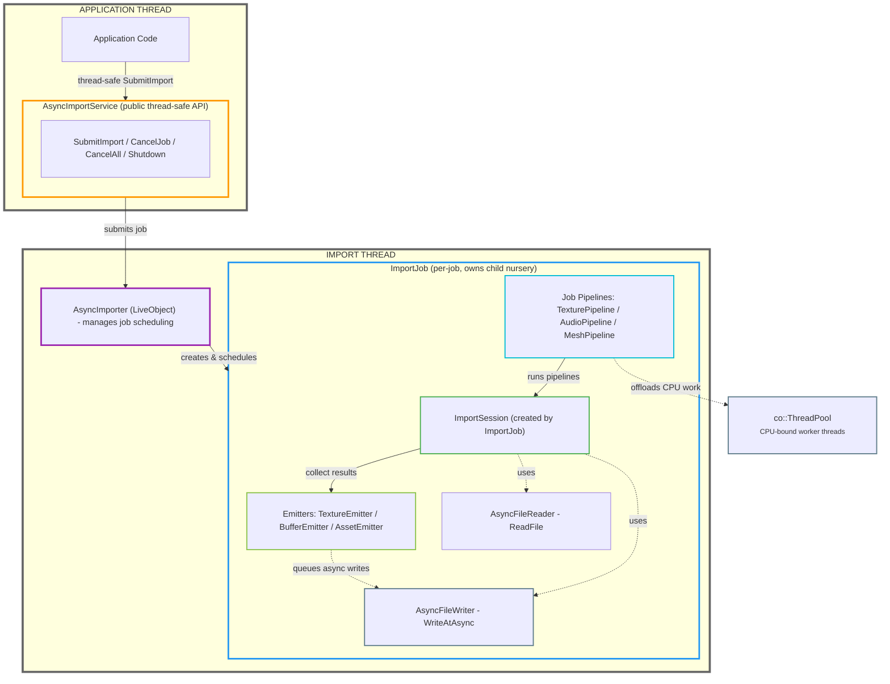
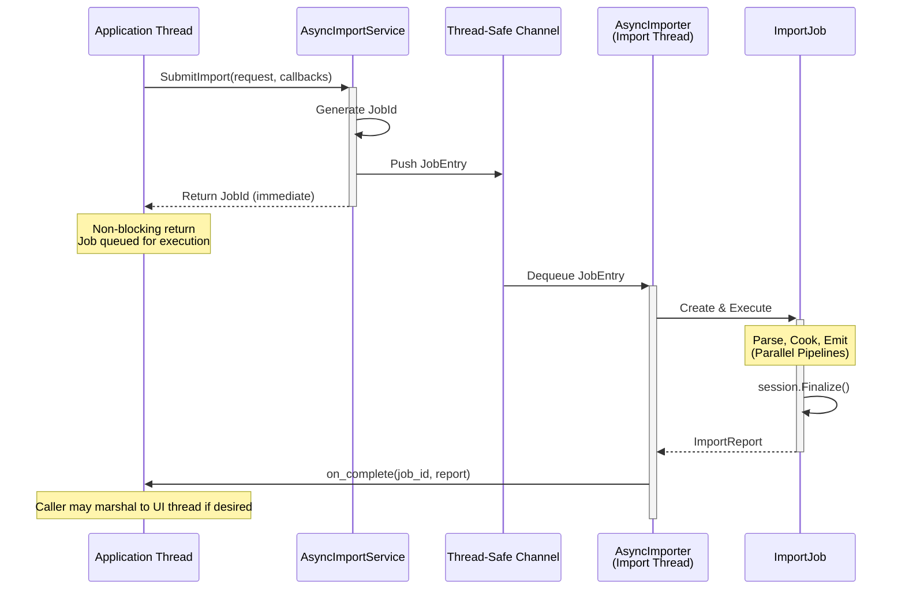

# Async Import Pipeline Architecture (v2)

**Status:** Approved Design
**Author:** GitHub Copilot
**Date:** 2026-01-15
**Supersedes:** async_import_pipeline.md, texture_work_pipeline.md

---

## Executive Summary

This document specifies an asynchronous content import pipeline for the Oxygen
Engine. The design uses OxCo structured concurrency with a **dedicated import
thread** running its own event loop and ThreadPool, completely decoupled from
the main application thread.

### Core Principles

1. **Dedicated Import Thread**: The importer runs on its own thread with an
   independent ASIO-style event loop. This eliminates any coupling with the
   application's frame-based event loop.

2. **ThreadPool for CPU-Bound Work Only**: BC7 encoding, mip generation, and
   image processing offload to ThreadPool. File I/O uses an async abstraction.

3. **Callbacks on Import Thread**: Completion and progress callbacks run on the
  import thread. Callers marshal to UI threads if needed.

4. **Cooperative Cancellation**: Per-job and per-importer cancellation via
  explicit job cancellation signals and stop-token propagation to work items.
  Importer shutdown cancels the AsyncImporter LiveObject nursery.

5. **Thread-Safe Public API**: All public methods are safe to call from any
   thread. Internal synchronization uses thread-safe channels.

6. **Preserve Sync Path**: Existing synchronous helpers are reused; new async
   methods wrap them without modification.

7. **REUSE EXISTING TYPES**: Never duplicate types that already exist in the
   `oxygen::content::import` namespace.

8. **No Polymorphic Resource Pipelines**: Each resource type (texture, audio,
   mesh) has its own strongly-typed pipeline. No common `IResourcePipeline`
   interface—inputs and outputs are too different.

9. **Preserve Existing Importer Architecture**: The production-quality
   `Importer` interface and associated PODs (`ImportRequest`, `ImportReport`,
   `CookedContentWriter`) are the foundation. Async is an enhancement, not a
   replacement.

10. **Pipelines are Pure Compute**: Resource pipelines (TexturePipeline,
  AudioPipeline, etc.) perform CPU-bound cooking only. They do NOT perform
  I/O or commit results. Emitters handle all I/O.

11. **Planner-Driven Readiness**: A job-level planner owns the dependency
  graph and per-asset readiness tracking. Pipelines only run once required
  dependencies are ready per the planner’s schedule.

12. **Geometry Material Patching**: Mesh build captures a table of
  `{slot, material_key_offset}` for each submesh while serializing the
  descriptor. Geometry finalization receives only the resolved material keys
  for the mesh’s `material_slots_used` and patches
  `SubMeshDesc::material_asset_key` directly by offset. The planner guarantees
  these materials are ready before geometry finalization runs.

13. **Direct Adapter Translation**: Format adapters (FBX/glTF) translate
  native parser structures (ufbx/cgltf) directly into pipeline `WorkItem`
  storage with no intermediate scene graph. The job owns the storage and
  registers plan items and dependencies via `ImportPlanner`.

14. **ThreadPool-Only content_hash**: `content_hash` is computed only on the
  ThreadPool **when enabled**. The invariant is that all dependencies are
  ready and the full descriptor payload is known before hashing. Hashing is
  controlled by `ImportOptions::with_content_hashing` and cascades into all
  pipeline configs. When disabled, pipelines MUST NOT compute any hashes.

15. **One Lazy Emitter Per Resource Type Per Session**: ImportSession owns
    emitters (TextureEmitter, BufferEmitter, AssetEmitter). Created lazily on
    first use. Emitter.Emit() returns a stable index immediately and queues
    async I/O in the background.

16. **Log-Structured Allocation (Append Semantics)**: Re-importing an asset
  allocates NEW space with a NEW index (append-like). Old data remains but is
  stale. Allocation is done by reserving explicit offsets and writing via
  `WriteAt*` to avoid interleaving. The index file is always accurate. PAK
  tool compacts later, remapping indices and trimming stale data.

---

## ⚠️ CRITICAL: Existing Types to Reuse ⚠️

These types ALREADY EXIST in `src/Oxygen/Content/Import/`. **DO NOT REDEFINE:**

| Type | Header | Description |
| ---- | ------ | ----------- |
| `ImportRequest` | `ImportRequest.h` | Source path, cooked layout, options |
| `ImportReport` | `ImportReport.h` | Result with success flag, diagnostics, counts |
| `ImportDiagnostic` | `ImportDiagnostics.h` | Warning/error with severity, code, message |
| `ImportSeverity` | `ImportDiagnostics.h` | `kInfo`, `kWarning`, `kError` |
| `ImportOptions` | `ImportOptions.h` | Import configuration options |
| `LooseCookedLayout` | `LooseCookedLayout.h` | Output directory layout |

**Only define NEW types that don't exist:**

- `ImportJobId` (uint64_t alias)
- `ImportPhase` (enum for async progress tracking)
- `ImportProgress` (struct for UI callbacks)
- Callback type aliases

---

## Existing Importer Architecture (Production Quality)

The current sync import architecture is **production quality** and serves as
the foundation for async enhancement. These interfaces are preserved.

### Core Interfaces

```cpp
// Importer.h - Backend interface (FBX, glTF, etc.)
class Importer {
public:
  virtual ~Importer() = default;
  [[nodiscard]] virtual auto Name() const noexcept -> std::string_view = 0;
  [[nodiscard]] virtual auto Supports(ImportFormat format) const noexcept -> bool = 0;
  virtual auto Import(const ImportRequest& request, CookedContentWriter& out) -> void = 0;
};

// AssetImporter.h - Façade with backend registry
class AssetImporter {
public:
  AssetImporter();  // Registers built-in backends
  explicit AssetImporter(std::vector<std::unique_ptr<Importer>> backends);
  [[nodiscard]] auto ImportToLooseCooked(const ImportRequest& request) -> ImportReport;
protected:
  [[nodiscard]] virtual auto DetectFormat(const std::filesystem::path& path) const -> ImportFormat;
};

// CookedContentWriter.h - Output abstraction
class CookedContentWriter {
public:
  virtual auto AddDiagnostic(ImportDiagnostic diag) -> void = 0;
  virtual auto WriteAssetDescriptor(key, type, path, relpath, bytes) -> void = 0;
  virtual auto WriteFile(kind, relpath, bytes) -> void = 0;
  virtual auto RegisterExternalFile(kind, relpath) -> void = 0;
  virtual auto OnMaterialsWritten(count) -> void = 0;
  virtual auto OnGeometryWritten(count) -> void = 0;
  virtual auto OnScenesWritten(count) -> void = 0;
};
```

### Key PODs

```cpp
// ImportRequest.h
struct ImportRequest {
  std::filesystem::path source_path;
  std::optional<std::filesystem::path> cooked_root;
  LooseCookedLayout loose_cooked_layout;
  std::optional<data::SourceKey> source_key;
  ImportOptions options;
};

// ImportReport.h
struct ImportReport {
  std::filesystem::path cooked_root;
  data::SourceKey source_key;
  std::vector<ImportDiagnostic> diagnostics;
  uint32_t materials_written = 0;
  uint32_t geometry_written = 0;
  uint32_t scenes_written = 0;
  bool success = false;
};
```

### Why This Matters for Async

The async design **enhances** this architecture:

- `Importer::Import()` remains the sync entry point
- Async orchestration lives in job actors (`ImportJob::ExecuteAsync()`)
- `AsyncImporter` schedules jobs on the import thread
- Jobs may invoke existing backends and pipelines as needed for parallel cooking

---

## Architecture Overview



### Actor Summary

| Actor | Scope | Owns | Role |
| ----- | ----- | ---- | ---- |
| **AsyncImportService** | Singleton | Import thread, AsyncImporter | Thread-safe public API |
| **AsyncImporter** | Shared | Job channel + scheduler | Import-thread job runner |
| **ImportJob** | Per-job | Child nursery, cancellation signal, ImportSession, pipelines | Single job actor: owns one job’s lifetime + resources |
| **ImportSession** | Per-job | Async I/O + ThreadPool access, Emitters, LooseCookedWriter, Diagnostics | Per-import output + infra access |
| **TexturePipeline** | Per-job | Internal queues + worker tasks | Pure compute: decode/transcode → in-memory payload |
| **TextureEmitter** | Per-job | `textures.data`, `textures.table` | Async I/O: Emit() → index + background write |
| **BufferEmitter** | Per-job | `buffers.data`, `buffers.table` | Async I/O for geometry/animation buffers |
| **AssetEmitter** | Per-job | `*.omat`, `*.ogeo`, `*.oscene` | Async I/O for asset descriptors |
| **LooseCookedWriter** | Per-job | `container.index.bin` | Finalization: write index file LAST |

---

## Component Design

### 0. Format Adapters + Planner Integration

Format adapters (FBX, glTF) parse the source once and translate the native
parser structures (ufbx/cgltf) directly into pipeline `WorkItem` storage
owned by the job. Adapters do **not** construct a secondary scene graph.

Planner integration is explicit and job-driven:

- The job registers plan items, dependencies, and `WorkPayloadHandle` values
  that point to job-owned `WorkItem` storage.
- The job executes `PlanStep`s from `ImportPlanner::MakePlan()` and awaits
  each step’s `prerequisites` before submitting the corresponding work item
  to the pipeline.
- Readiness is marked by emitters (or job code) using the planner’s
  `ReadinessTracker`, allowing dependent steps (e.g., scene) to proceed.

This keeps pipelines compute-only and preserves deterministic dependency
gating without additional abstraction layers.

### 1. AsyncImportService (Thread-Safe Public API)

#### Purpose and Scope

`AsyncImportService` is the application-facing façade for asynchronous content import. It provides a thread-safe API for submitting import jobs from any thread (e.g., main UI thread, game thread) and receiving completion notifications on the import thread. Callers marshal to UI threads if needed.

**Key responsibilities:**

- Accept import requests from any thread
- Manage the dedicated import thread lifecycle
- Invoke completion callbacks on the import thread
- Coordinate graceful shutdown and cancellation

#### New Types

The service introduces minimal new types, reusing existing `ImportRequest` and `ImportReport`:

```cpp
// Job identification
using ImportJobId = uint64_t;
inline constexpr ImportJobId kInvalidJobId = 0;

// Progress tracking for UI
enum class ImportPhase : uint8_t {
  kPending, kParsing, kTextures, kMaterials,
  kGeometry, kScene, kWriting, kComplete, kCancelled, kFailed
};

struct ImportProgress {
  ImportJobId job_id;
  ImportPhase phase;
  float phase_progress;
  float overall_progress;
  std::string message;
  uint32_t items_completed, items_total;
  std::vector<ImportDiagnostic> new_diagnostics;
};

// Callbacks
using ImportCompletionCallback = std::function<void(ImportJobId, const ImportReport&)>;
using ImportProgressCallback = std::function<void(const ImportProgress&)>;
```

**Design note:** `ImportReport` is passed by `const&` because it contains `std::filesystem::path` and other heavyweight members. Callbacks are invoked on the import thread; UI marshalling is the caller’s responsibility.

#### Configuration

```cpp
struct Config {
  uint32_t thread_pool_size = std::thread::hardware_concurrency();
  uint32_t texture_pipeline_workers = 2;
  uint32_t texture_queue_capacity = 64;
};
```

The config specifies global resources shared across all import jobs:

- **thread_pool_size**: Number of worker threads for CPU-bound cooking (BC7, mip gen, etc.)
- **texture_pipeline_workers**: Concurrent texture processing tasks (per job)
- **texture_queue_capacity**: Backpressure limit for texture submission

#### Core API

**Job submission:**

```cpp
auto SubmitImport(
  ImportRequest request,
  ImportCompletionCallback on_complete,
  ImportProgressCallback on_progress = nullptr) -> ImportJobId;
```

- Thread-safe; callable from any thread
- Returns unique job ID immediately
- Callbacks are invoked on the import thread
- Cancellation is reported via `on_complete` with `report.success=false` and diagnostic code `"import.canceled"`

**Cancellation:**

```cpp
auto CancelJob(ImportJobId job_id) -> bool;  // Cancel specific job
auto CancelAll() -> void;                    // Cancel all jobs
auto RequestShutdown() -> void;              // Begin graceful shutdown
```

- `CancelJob` returns `false` if job already completed
- `CancelAll` cancels all pending and in-flight jobs
- `RequestShutdown` signals the import thread to stop; destructor waits for completion

**Status query:**

```cpp
auto IsJobActive(ImportJobId job_id) const -> bool;
```

Thread-safe check if job is still pending or executing.

#### Threading Model



**Key invariants:**

- Service owns the import thread and blocks in destructor until thread exits
- All callbacks are invoked on the import thread
- Internal synchronization uses lock-free channels; no application-visible locks

#### Implementation Pattern

The service uses the Pimpl idiom to hide implementation details:

```cpp
class AsyncImportService final {
public:
  explicit AsyncImportService(Config config = {});
  ~AsyncImportService();

  // Public API methods...

private:
  struct Impl;
  std::unique_ptr<Impl> impl_;
};
```

`Impl` contains:

- `ImportEventLoop` running on dedicated thread
- `detail::AsyncImporter` (LiveObject)
- Thread-safe channel for job submission
- Job ID generator and active job tracking

#### Cancellation Semantics

**Unified completion path:** Both successful completion and cancellation invoke the same `on_complete` callback. Cancellation is distinguished by:

```cpp
// Cancelled job produces this report:
ImportReport report {
  .success = false,
  .diagnostics = {
    ImportDiagnostic {
      .severity = ImportSeverity::kError,
      .code = "import.canceled",
      .message = "Import canceled by user"
    }
  }
};
```

This eliminates dual callback paths and simplifies application code.

#### Shutdown Sequence

1. `RequestShutdown()` signals import thread to stop accepting jobs
2. Import thread cancels all in-flight jobs
3. Destructor blocks until import thread exits
4. All pending callbacks are flushed before destruction

**Non-blocking shutdown initiation:** `RequestShutdown()` returns immediately; only destructor blocks.

### 2. Resource Pipeline Architecture

Resource pipelines (texture, audio, mesh) are **NOT polymorphic**. Each has its
own strongly-typed API because inputs and outputs are fundamentally different.

#### Why No Common Interface

| Pipeline | Input | Processing | Output |
| -------- | ----- | ---------- | ------ |
| Texture | bytes + TextureImportDesc | decode, mips, BC7 | CookedTexturePayload (in-memory) |
| Audio | bytes + AudioImportDesc | decode, resample, compress | CookedAudioPayload (in-memory) |
| Mesh | scene graph + options | optimize, pack | CookedMeshPayload / CookedBufferPayload (in-memory) |

A polymorphic `IResourcePipeline<T>` adds complexity without value.

#### Universal Pipeline Stages (Internal)

All resource pipelines follow these internal stages.

Important: **acquiring bytes is not a pipeline responsibility**.
Pipelines are compute-only and operate on bytes already in memory.

```text
┌──────────────────────┐     ┌─────────┐     ┌───────────┐
│ Acquire source bytes │ ──▶ │ Decode  │ ──▶ │ Transcode │
│ (Importer / caller)  │     └─────────┘     └───────────┘
└──────────────────────┘          │                │
                                  ▼                ▼
                                CPU-bound        CPU-bound
                                (ThreadPool)     (ThreadPool)
```

1. **Acquire bytes** (outside pipeline)

- From file via `IAsyncFileReader` (importer-owned I/O)
- From embedded buffers (FBX/glTF embedded textures)

1. **Decode**: Parse format
   - PNG/JPG/EXR → ScratchImage
   - WAV/FLAC → audio samples
   - (format-specific, CPU-bound)

2. **Transcode**: Transform to runtime format
   - Mip generation, BC7 compression
   - Audio resampling, codec encoding
   - (format-specific, CPU-bound, often parallelizable)

3. ~~**Commit**: Write to cooked output~~ **NO! Pipelines don't commit!**

- Pipeline returns an in-memory cooked payload (e.g., `CookedTexturePayload`)
- Caller passes it to the appropriate emitter (e.g., `TextureEmitter`) for async I/O
- See **Principle 10**: Pipelines are pure compute

These stages are **internal**. The external API is simpler.

#### Concurrency, Ownership, and Lifetime (Definitive)

These rules apply to **all** resource pipelines (texture, audio, mesh, etc.).

**Future-proof job model (required):** each import job runs inside a dedicated
**child nursery** of `detail::AsyncImporter`.

- The job’s child nursery is the job’s definitive lifetime boundary.
- All job-scoped work (including pipeline workers) is started in that child
  nursery so cancellation can be cascaded by cancelling the nursery.

This model supports both current sequential processing and future concurrent
job execution without changing pipeline APIs.

**Nursery ownership (do not conflate lifetimes):** there are two distinct
lifetimes.

1) **Import-thread lifetime (long-lived)**
   - Owner: `detail::AsyncImporter` (a `co::LiveObject`).
   - Nursery: the nursery opened by `AsyncImporter::ActivateAsync()`.
   - Purpose: owns long-lived background tasks for the import thread (e.g. job
     loop, service shutdown coordination).

2) **Single-job lifetime (short-lived, cancellable)**

- Owner: `detail::ImportJob`.
- Nursery: a child nursery created per job.
- Purpose: owns job-scoped tasks, including:
  - the importer’s job coroutine,
  - any helper coroutines for acquisition/submission/collection,
  - job-scoped pipeline instances and their worker coroutines.

**Pipeline instancing:** pipeline instances are **job-scoped**.

- Each job constructs its own pipeline instances (e.g. `TexturePipeline`) and
  starts them in the job’s child nursery.
- A pipeline instance therefore does not require job tagging or result routing.

Why this matters:

- Cancellation is unambiguous: cancelling the job’s nursery cancels everything
  job-owned, including pipeline workers.
- The design is future-proof for parallel jobs: jobs are isolated by nursery
  boundaries and pipeline instances.

#### Pipeline External API Pattern

Each pipeline exposes the same conceptual API with type-specific signatures.
The API pattern matches the existing `BufferPipeline` implementation:

- `Start(nursery)` spawns worker coroutines
- bounded `Submit`/`TrySubmit` + `Collect`
- results contain diagnostics and a `success` flag

```cpp
// TexturePipeline - strongly typed, no polymorphism
class TexturePipeline {
public:
  // Work item and result types (pipeline-specific)
  struct WorkItem {
    std::string source_id;       // Correlation key (e.g., texture path or UUID)
    std::span<const std::byte> bytes;       // Source bytes (already acquired)
    std::shared_ptr<const void> bytes_owner; // Keeps bytes alive
    TextureImportDesc desc;      // EXISTING type from TextureImportDesc.h
    std::stop_token stop_token;  // Cancellation
  };

  struct WorkResult {
    std::string source_id;       // Echoed from WorkItem for correlation
    std::optional<CookedTexturePayload> cooked; // In-memory cooked payload
    std::vector<ImportDiagnostic> diagnostics;
    bool success;
  };

  // Start worker coroutines
  auto Start(co::Nursery& nursery) -> void;

  // Submit work (bounded; may suspend under backpressure)
  auto Submit(WorkItem item) -> co::Co<>;

  // Try to submit without blocking
  auto TrySubmit(WorkItem item) -> bool;

  // Collect one completed result (blocks until ready)
  auto Collect() -> co::Co<WorkResult>;

  // Status queries
  [[nodiscard]] auto PendingCount() const -> size_t;
  [[nodiscard]] auto HasPending() const -> bool;

  // Progress for UI
  [[nodiscard]] auto GetProgress() const -> PipelineProgress;

  // Close input (drain then exit)
  auto Close() -> void;

  // Cancel the pipeline (job-scoped). Intended for early-abort within the job.
  // Job cancellation is normally expressed by cancelling the job nursery.
  auto Cancel() -> void;
};

Notes:

- Pipelines are job-scoped; they are created, started, drained, and destroyed
  within the job’s child nursery.
- Importer/service shutdown is handled by cancelling the AsyncImporter nursery
  and/or cancelling all job nurseries (see Cancellation Design).

##### Operational Semantics (Current Implementation Baseline)

These behaviors reflect the established pattern in
`src/Oxygen/Content/Import/Async/Pipelines/BufferPipeline.cpp` and are the
baseline that new pipelines should follow unless explicitly documented
otherwise:

- `Start()` is called exactly once. Calling `Start()` more than once is invalid.
- `Submit()` is intended to be used only before `Close()`; callers should
  avoid submitting after closing the input channel.
- `TrySubmit()` returns `false` when the input channel is closed or full.
- `PendingCount()` tracks submitted work that has not yet been collected
  (including canceled items). `HasPending()` is derived from this counter.
- `Collect()` suspends until a result is available. If the output channel is
  closed, it returns a sentinel `WorkResult` with `success = false` and empty
  fields. Callers should treat this as end-of-stream.
- Cancellation is propagated via `WorkItem.stop_token`; canceled work yields a
  `WorkResult` with `success = false`.
```

#### ResourcePipeline Concept

Instead of polymorphism, use a C++20 concept to enforce the API contract
at compile time:

```cpp
//! Concept defining what a resource pipeline must provide.
/*!
 All pipelines (texture, audio, mesh) satisfy this concept but have
 completely different WorkItem and WorkResult types.
*/
template <typename T>
concept ResourcePipeline = requires(T& pipeline, typename T::WorkItem item,
  co::Nursery& nursery) {
  // Must have nested types
  typename T::WorkItem;
  typename T::WorkResult;

  // Start + Submit/Collect pattern
  { pipeline.Start(nursery) } -> std::same_as<void>;
  { pipeline.Submit(std::move(item)) } -> std::same_as<co::Co<>>;
  { pipeline.Collect() } -> std::same_as<co::Co<typename T::WorkResult>>;

  // Status queries
  { pipeline.HasPending() } -> std::convertible_to<bool>;
  { pipeline.PendingCount() } -> std::convertible_to<size_t>;

  // Progress and cancellation
  { pipeline.GetProgress() } -> std::same_as<PipelineProgress>;
  { pipeline.Cancel() } -> std::same_as<void>;
};

// Verify at compile time:
static_assert(ResourcePipeline<TexturePipeline>);
static_assert(ResourcePipeline<AudioPipeline>);
```

This gives compile-time safety without runtime polymorphism overhead.

#### Progress Abstraction

```cpp
struct PipelineProgress {
  size_t submitted = 0;     // Total items submitted
  size_t completed = 0;     // Items fully processed
  size_t failed = 0;        // Items that errored
  size_t in_flight = 0;     // Currently processing
  float throughput = 0.0f;  // Items per second (rolling average)
};

#### PipelineProgress Invariants (Required)

- All counters (`submitted`, `completed`, `failed`, `in_flight`) are
  non-negative and use `0` as a valid default state.
- `submitted` is monotonically non-decreasing and increments only when a work
  item is successfully accepted (i.e. `Submit()` or `TrySubmit()` succeeds).
- `completed` is monotonically non-decreasing and increments when a collected
  `WorkResult` has `success = true`.
- `failed` is monotonically non-decreasing and increments when a collected
  `WorkResult` has `success = false` (including cancellations).
- `in_flight` is derived as:
  `in_flight = submitted - completed - failed`.
- `in_flight` must never be negative. When the pipeline is closed and fully
  drained, `in_flight` must be `0` and `submitted = completed + failed`.
- `throughput` is non-negative and may be `0.0f` when no samples are available
  (e.g. `submitted == 0`).
```

### 3. Work Item Extraction Pattern

The sync code already demonstrates the correct pattern for building pipeline
work items from import metadata. The async code follows the same approach.

#### Sync Pattern (Existing - in TextureEmitter.cpp)

```cpp
// Sync: Extract texture work from FBX material
auto GetOrCreateTextureResourceIndexWithCooker(
  const ImportRequest& request,
  CookedContentWriter& cooked_out,
  TextureEmissionState& state,
  const ufbx_texture* texture,
  const CookerConfig& config) -> uint32_t
{
  // 1. Resolve source (embedded vs file)
  const auto* file_tex = ResolveFileTexture(texture);
  std::span<const std::byte> source_bytes = ...;

  // 2. Build work descriptor from config
  auto desc = MakeImportDescFromConfig(config, texture_id);

  // 3. Cook synchronously
  auto cooked = CookTextureWithFallback(source_bytes, config, texture_id);

  // 4. Commit to output
  const auto data_offset = AppendResource(state.appender, cooked.payload, ...);
  state.table.push_back(cooked.desc);

  return index;
}
```

#### Async Pattern (New)

```cpp
// Async: Same extraction, different dispatch
// Note: This is a helper; the actual Submit happens in the job

TexturePipeline::WorkItem MakeTextureWorkItem(
  const ufbx_texture* texture,
  const CookerConfig& config,
  std::span<const std::byte> bytes,
  std::shared_ptr<const void> bytes_owner)
{
  // 1. Resolve source (same helper as sync)
  const auto* file_tex = ResolveFileTexture(texture);

  // 2. Build source_id for correlation (same helper as sync)
  const auto source_id = NormalizeTexturePathId(TextureIdString(*file_tex));

  // 3. Build WorkItem using existing metadata types
  return TexturePipeline::WorkItem {
    .source_id = source_id,
    .bytes = bytes,
    .bytes_owner = std::move(bytes_owner),
    .desc = MakeImportDescFromConfig(config, source_id),
  };
}

// Usage in ImportJob::ExecuteAsync():
//   if (is_embedded) {
//     auto bytes = std::span<const std::byte>(...);
//     auto owner = scene_owner;  // keeps embedded bytes alive
//     co_await pipeline.Submit(MakeTextureWorkItem(tex, config, bytes, owner));
//   } else {
//     auto file_bytes = co_await reader->ReadFile(path);
//     auto owner = std::make_shared<std::vector<std::byte>>(std::move(*file_bytes));
//     auto bytes = std::span<const std::byte>(owner->data(), owner->size());
//     co_await pipeline.Submit(MakeTextureWorkItem(tex, config, bytes, owner));
//   }
```

#### Commit Responsibility

**Pipelines do NOT commit to CookedContentWriter.** They return processed data.

| Component | Responsibility |
| --------- | -------------- |
| Pipeline | Decode → Transcode → return `CookedTexturePayload` (in-memory) |
| Job | Receive result → call `session.TextureEmitter().Emit()` → track index |

This separation:

- Keeps pipelines stateless (no external references)
- Serializes commits on the import thread (thread-safe)
- Mirrors sync architecture (cooker returns, emitter commits)

```cpp
// In job collection loop:
auto result = co_await pipeline.Collect();
if (result.success) {
  // JOB commits, not pipeline
  auto table_idx = session.TextureEmitter().Emit(std::move(*result.cooked));
  texture_indices[result.source_id] = table_idx;
}
```

#### Key Insight

The **metadata extraction** is identical between sync and async:

- `ResolveFileTexture()` - same
- `MakeImportDescFromConfig()` - same
- `TextureIdString()` - same

Only the **dispatch** differs:

- Sync: `CookTextureWithFallback()` → blocks until done
- Async: `pipeline.Submit()` → returns immediately, collect later

### 4. AsyncImporter (Internal LiveObject)

Runs inside the import thread's nursery.

**Implementation update (2026-01-15):** ImportSession creation is owned by the
job. The session carries access to async I/O and the ThreadPool, so the importer
itself no longer owns file-writer references.

If a job request does not specify `ImportRequest.cooked_root`, the current
implementation derives it from `ImportRequest.source_path` and
`ImportRequest.loose_cooked_layout.virtual_mount_root`, ensuring the cooked
root directory ends with the virtual mount root leaf directory (by default:
`.cooked`). If the source path cannot be resolved (e.g., synthetic test paths),
it falls back to the process temp directory and still appends `.cooked`.

```cpp
namespace oxygen::content::import::detail {

class AsyncImporter final : public co::LiveObject {
public:
  struct Config {
    size_t channel_capacity = 64;
  };

  struct JobEntry {
    ImportJobId job_id;
    std::shared_ptr<ImportJob> job;
    std::shared_ptr<co::Event> cancel_event;
  };

  explicit AsyncImporter(Config config = {});
  [[nodiscard]] auto SubmitJob(JobEntry entry) -> co::Co<>;
};

} // namespace oxygen::content::import::detail
```

**JobEntry ownership contract:** `JobEntry` is a thin envelope that transports
the concrete `ImportJob` instance (constructed by `AsyncImportService`) plus a
cancellation token/event. All job-specific data (request, callbacks, identity,
progress state, and job metadata) lives inside `ImportJob`, not in the entry.

### 5. ImportSession (Per-Job State + Emitters)

Each import job gets its own session. The session owns emitters, tracks I/O,
and provides the single access point for infrastructure services
(async file reader/writer and ThreadPool). The session stores non-owning
handles via `oxygen::observer_ptr` or owning smart pointers, but never raw
reference members.

```cpp
namespace oxygen::content::import {

//! Per-import-job state including lazy emitters and I/O tracking.
/*!
 The session provides a clean boundary between:
 - AsyncImporter (shared compute infrastructure)
 - Per-job output state (emitters, diagnostics, pending I/O)

 Emitters are created lazily on first use. The session calls Finalize()
 to wait for all I/O and write the index file.
*/
class ImportSession {
public:
  explicit ImportSession(const ImportRequest& request,
    oxygen::observer_ptr<IAsyncFileReader> file_reader,
    oxygen::observer_ptr<IAsyncFileWriter> file_writer,
    oxygen::observer_ptr<co::ThreadPool> thread_pool);

  //=== Lazy Emitters ===//

  //! Get texture emitter (created on first call).
  [[nodiscard]] auto TextureEmitter() -> TextureEmitter&;

  //! Get buffer emitter (created on first call).
  [[nodiscard]] auto BufferEmitter() -> BufferEmitter&;

  //! Get asset descriptor emitter (created on first call).
  [[nodiscard]] auto AssetEmitter() -> AssetEmitter&;

  //=== Diagnostics ===//

  auto AddDiagnostic(ImportDiagnostic diag) -> void;
  [[nodiscard]] auto Diagnostics() const -> const std::vector<ImportDiagnostic>&;

  //=== Finalization ===//

  //! Wait for all pending I/O, flush tables, write index file.
  /*!
   @return ImportReport with success flag and diagnostics.
  */
  [[nodiscard]] auto Finalize() -> co::Co<ImportReport>;

private:
  ImportRequest request_;
  oxygen::observer_ptr<IAsyncFileReader> file_reader_;
  oxygen::observer_ptr<IAsyncFileWriter> file_writer_;
  oxygen::observer_ptr<co::ThreadPool> thread_pool_;
  LooseCookedWriter cooked_writer_;

  // Lazy emitters (nullptr until first use)
  std::unique_ptr<TextureEmitter> texture_emitter_;
  std::unique_ptr<BufferEmitter> buffer_emitter_;
  std::unique_ptr<AssetEmitter> asset_emitter_;

  // Thread-safe diagnostics collection
  std::vector<ImportDiagnostic> diagnostics_;
  std::mutex diagnostics_mutex_;
};

} // namespace oxygen::content::import
```

#### TextureEmitter Implementation

```cpp
//! Emits cooked textures with async I/O.
/*!
 Emit() returns a stable table index IMMEDIATELY and queues async I/O.
 No blocking. The index is valid the moment Emit() returns.
*/
class TextureEmitter {
public:
  explicit TextureEmitter(
    IAsyncFileWriter& file_writer,
    const LooseCookedLayout& layout,
    const std::filesystem::path& cooked_root);

  //! Emit a cooked texture. Returns stable table index.
  /*!
   Index is assigned synchronously (counter increment).
   Data write is queued as async I/O.
   Table entry is added in memory.

   @param cooked The cooked texture payload.
   @return Table index (stable immediately, usable for material refs).
  */
  [[nodiscard]] auto Emit(CookedTexturePayload cooked) -> uint32_t {
    // 1. Assign stable index NOW (before any I/O)
    auto idx = next_index_++;

    // 2. Reserve a unique range in the data file (append semantics)
    //    - CAS loop reserves a non-overlapping range
    //    - Alignment is applied to payload start
    const uint64_t payload_size = cooked.payload.size();
    uint64_t current_size = data_file_size_.load();
    uint64_t aligned_offset = 0;
    uint64_t new_size = 0;
    do {
      aligned_offset = AlignUp(current_size, util::kRowPitchAlignment);
      new_size = aligned_offset + payload_size;
    } while (!data_file_size_.compare_exchange_weak(current_size, new_size));

    const uint64_t padding_size = aligned_offset - current_size;

    // 3. Build table entry in memory (tiny: ~100 bytes)
    //    NOTE: The offset is stable immediately after reservation.
    table_.push_back(TextureResourceDesc{
      .data_offset = aligned_offset,
      .data_size = static_cast<uint32_t>(payload_size),
      .format = cooked.desc.format,
      // ... other fields
    });

    // 4. Queue async writes using explicit offsets (WriteAtAsync)
    //    This avoids interleaving caused by concurrent append.
    if (padding_size > 0) {
      pending_writes_++;
      file_writer_.WriteAtAsync(
        data_file_path_,
        current_size,
        ZeroBytes(padding_size),
        WriteOptions{ .create_directories = true, .share_write = true },
        [this](const FileErrorInfo& error, uint64_t) {
          if (error.IsError()) errors_.fetch_add(1);
          pending_writes_--;
        });
    }

    pending_writes_++;
    file_writer_.WriteAtAsync(
      data_file_path_,
      aligned_offset,
      cooked.payload,
      WriteOptions{ .create_directories = true, .share_write = true },
      [this](const FileErrorInfo& error, uint64_t) {
        if (error.IsError()) errors_.fetch_add(1);
        pending_writes_--;
      });

    return idx;  // Caller can use this NOW
  }

  //! How many writes still in flight?
  [[nodiscard]] auto PendingCount() const -> size_t {
    return pending_writes_.load();
  }

  //! Wait for all data writes, then flush table to disk.
  [[nodiscard]] auto Finalize() -> co::Co<> {
    // Wait for all async data writes
    while (pending_writes_.load() > 0) {
      co_await co::Yield();
    }

    // Check for I/O errors
    if (errors_.load() > 0) {
      // Handle errors (diagnostics already collected)
    }

    // Flush table to disk (single write)
    co_await async_io_.Write(table_file_path_, SerializeTable(table_));
  }

private:
  IAsyncFileWriter& file_writer_;
  std::filesystem::path data_file_path_;
  std::filesystem::path table_file_path_;

  std::vector<TextureResourceDesc> table_;
  std::atomic<uint64_t> data_file_size_{0};
  uint32_t next_index_ = 0;

  std::atomic<size_t> pending_writes_{0};
  std::atomic<size_t> errors_{0};
};
```

#### Async File Writer Contracts (WriteAt*)

Emitters depend on an async writer API that supports explicit-offset writes.
On Windows, the async write surface is `WriteAt`/`WriteAtAsync` (append-based
APIs are intentionally avoided).

**Core API surface (conceptual):**

```cpp
// Explicit-offset write: does not rely on a shared file pointer.
auto WriteAt(path, offset, bytes, options) -> std::optional<FileErrorInfo>;

// Async explicit-offset write: invokes callback on completion.
auto WriteAtAsync(path, offset, bytes, options, on_complete) -> void;

// Flush any OS buffers for the file(s) written.
auto Flush(path) -> std::optional<FileErrorInfo>;
```

**Contracts / guarantees:**

- **No implicit append**: callers must provide the file offset.
- **Concurrency safety**: concurrent `WriteAt*` calls are allowed as long as
  their byte ranges do not overlap. Overlapping writes produce undefined final
  content.
- **Completion ordering**: completions may occur out-of-order.
- **Error reporting**: errors are reported via `FileErrorInfo` in the callback;
  no exceptions cross async boundaries.
- **Sharing options**: writers should support a `share_write`-style option for
  multi-writer scenarios (e.g., emitter padding+payload writes).

#### Emitter Contracts and Design Principles

The current emitters (notably `BufferEmitter` and `TextureEmitter`) follow these
rules to be correct under concurrent async I/O while keeping the caller API
simple:

1. **Stable index returned immediately**: `Emit()` assigns and returns an index
  synchronously, before any I/O completes.
2. **Dedup by signature** (when applicable): if the resource signature already
  exists, `Emit()` returns the existing index and queues no additional I/O.
3. **Append semantics via allocation**: the emitter maintains an atomic
  `data_file_size_` and reserves a unique range using a CAS loop.
4. **Alignment-aware layout**: the reservation computes `aligned_offset` and
  optional `padding_size`; padding is written as zero bytes at the reserved
  start.
5. **Table/index stability**: the table entry is recorded before (or alongside)
  queuing writes, so the returned index and descriptor mapping are stable
  immediately after `Emit()` returns.
6. **Explicit-offset writes only**: both padding and payload are written using
  `WriteAtAsync(path, offset, ...)` with `share_write=true`.
7. **Emitter owns async buffer lifetimes**: payload/padding buffers are moved
  into shared ownership captured by completion callbacks.
8. **Pending/error accounting**: each queued write increments a pending counter;
  completion decrements it and increments an error counter on failure.
9. **Finalize defines the durability boundary**: `Finalize()` waits for all
  pending writes, flushes and writes tables, and only then allows the session
  to write `container.index.bin` last.
10. **Single-threaded mutation**: emitter internal tables and maps are mutated
  on the import thread; async completion handlers are expected to run on the
  same event loop to safely touch emitter state.

TextureEmitter-specific rule:

- **Index 0 reserved for fallback**: `EnsureFallbackTexture()` guarantees the
  fallback texture exists at index 0 before emitting user textures.

### 6. Job-Based Orchestration (ImportJob)

The sync `Importer` interface remains unchanged and continues to support the
existing synchronous path. The async path is driven by job actors (e.g.
`FbxImportJob`, `GlbImportJob`, `TextureImportJob`) which orchestrate pipelines
and emitters on the import thread.

### 6. FbxImportJob Async Orchestration Example (Maximum Parallelism)

For a 32-core CPU, we want **all cores busy** and **streaming emission**.
This example shows the optimal pattern for a complex FBX with 28 textures,
3 meshes, 12 materials, and 4 animation clips.

#### Material Readiness Tracker

```cpp
//! Tracks which materials are ready to emit (all textures processed).
class MaterialReadinessTracker {
public:
  explicit MaterialReadinessTracker(const Scene& scene) {
    // Build dependency graph: material → required texture source_ids
    for (size_t i = 0; i < scene.materials.size(); ++i) {
      auto& mat = scene.materials[i];
      MaterialDep dep { .material_idx = i };

      for (const auto& slot : mat.texture_slots) {
        if (!slot.source_id.empty()) {
          dep.pending_textures.insert(slot.source_id);
          texture_to_materials_[slot.source_id].push_back(i);
        }
      }

      if (dep.pending_textures.empty()) {
        // No textures - ready immediately
        ready_queue_.push(i);
      } else {
        material_deps_.push_back(std::move(dep));
      }
    }
  }

  //! Mark a texture as ready. Returns indices of materials now ready to emit.
  auto MarkTextureReady(const std::string& source_id) -> std::vector<size_t> {
    std::vector<size_t> newly_ready;

    for (auto mat_idx : texture_to_materials_[source_id]) {
      auto& dep = material_deps_[mat_idx];
      dep.pending_textures.erase(source_id);

      if (dep.pending_textures.empty() && !dep.emitted) {
        dep.emitted = true;
        newly_ready.push_back(mat_idx);
      }
    }

    return newly_ready;
  }

private:
  struct MaterialDep {
    size_t material_idx;
    std::unordered_set<std::string> pending_textures;
    bool emitted = false;
  };

  std::vector<MaterialDep> material_deps_;
  std::unordered_map<std::string, std::vector<size_t>> texture_to_materials_;
  std::queue<size_t> ready_queue_;  // Materials with no texture deps
};
```

#### Optimal Concurrent Import (Using Session + Emitters)

```cpp
auto FbxImportJob::ExecuteAsync() -> co::Co<ImportReport>
{
  ImportSession session(Request(), FileReader(), FileWriter(), ThreadPool());
  auto& pool = *session.ThreadPool();
  TexturePipeline tex_pipe(pool, {/* config */});
  tex_pipe.Start(JobNursery());

  // Get emitters from session (lazy creation)
  auto& tex_emitter = session.TextureEmitter();
  auto& asset_emitter = session.AssetEmitter();
  auto& buf_emitter = session.BufferEmitter();

  // ═══════════════════════════════════════════════════════════════════════
  // Phase 1: Parse FBX (sequential, ~50ms)
  // ═══════════════════════════════════════════════════════════════════════
  auto scene = co_await pool.Run([&] {
    return ParseFbxScene(request.source_path);
  });

  // Build material dependency tracker
  MaterialReadinessTracker material_tracker(scene);

  // Shared state (safe: all coroutines resume on import thread)
  std::unordered_map<std::string, uint32_t> texture_indices;
  std::unordered_map<size_t, uint32_t> material_indices;
  std::vector<uint32_t> mesh_indices(scene.meshes.size());

  // ═══════════════════════════════════════════════════════════════════════
  // Phase 2: SUBMIT ALL WORK IMMEDIATELY (saturate 32 cores)
  // ═══════════════════════════════════════════════════════════════════════

  // Submit all textures to pipeline
  std::unordered_set<std::string> submitted_textures;
  for (const auto* tex : scene.textures) {
    auto work = MakeTextureWorkItem(tex, request);
    if (submitted_textures.insert(work.source_id).second) {
      tex_pipe.Submit(std::move(work));
    }
  }
  // 28 texture jobs now in ThreadPool queue

  // ═══════════════════════════════════════════════════════════════════════
  // Phase 3: CONCURRENT COLLECTION WITH STREAMING EMISSION
  // ═══════════════════════════════════════════════════════════════════════
  //
  // Pipeline cooks → Emitter emits (async I/O) → index returned immediately
  // No blocking on I/O anywhere in this loop!
  //
  co::Nursery nursery;

  //=== Stream A: Texture Collection → Emit → Material Emission ===//
  nursery.Start([&]() -> co::Co<> {
    while (tex_pipe.HasPending()) {
      auto result = co_await tex_pipe.Collect();

      if (result.success) {
        // EMIT texture via emitter (returns index IMMEDIATELY, I/O is async)
        auto idx = tex_emitter.Emit(std::move(result.cooked_data));
        texture_indices[result.source_id] = idx;

        // Emit any materials that are now ready
        for (auto mat_idx : material_tracker.MarkTextureReady(result.source_id)) {
          auto mat_desc = BuildMaterialDescriptor(scene.materials[mat_idx],
                                                   texture_indices);
          asset_emitter.Emit(AssetType::kMaterial, std::move(mat_desc));
        }
      } else {
        for (const auto& diag : result.diagnostics) {
          session.AddDiagnostic(diag);
        }
      }
    }
  });

  //=== Stream B: Geometry Processing (parallel on ThreadPool) ===//
  for (size_t i = 0; i < scene.meshes.size(); ++i) {
    nursery.Start([&, i]() -> co::Co<> {
      // CPU-heavy work on ThreadPool
      auto processed = co_await pool.Run([&, i] {
        return ProcessMesh(scene.meshes[i]);  // tangents, skinning, etc.
      });
      // EMIT via emitter (returns index IMMEDIATELY)
      mesh_indices[i] = buf_emitter.Emit(std::move(processed));
    });
  }
  // 3 mesh jobs now in ThreadPool queue

  //=== Stream C: Animation Baking (parallel on ThreadPool) ===//
  for (const auto* anim : scene.animations) {
    nursery.Start([&, anim]() -> co::Co<> {
      auto baked = co_await pool.Run([&] {
        return BakeAnimation(anim);
      });
      buf_emitter.Emit(std::move(baked));
    });
  }
  // 4 animation jobs now in ThreadPool queue

  // Total: 28 + 3 + 4 = 35 jobs for 32 cores (work-stealing balances load)

  // ═══════════════════════════════════════════════════════════════════════
  // Phase 4: Wait for ALL compute streams to complete
  // ═══════════════════════════════════════════════════════════════════════
  co_await nursery.Join();

  // Note: I/O may still be in flight! That's fine.
  // session.Finalize() will wait for all I/O before writing index file.
}

// Called by the job after compute completes:
// co_await session.Finalize();  // Waits for I/O, flushes tables, writes index
```

#### Flow Summary

```text
┌────────────────────────────────────────────────────────────────────────────┐
│ FbxImportJob::ExecuteAsync                                                 │
├────────────────────────────────────────────────────────────────────────────┤
│ 1. Parse FBX → scene graph                                                 │
│ 2. Submit all textures to TexturePipeline (28 jobs → ThreadPool)           │
│ 3. For each collected cooked texture:                                      │
│    - tex_emitter.Emit() → index (immediate) + async I/O (background)       │
│    - Check material readiness → asset_emitter.Emit() if ready              │
│ 4. For each mesh: pool.Run() → buf_emitter.Emit()                          │
│ 5. nursery.Join() → all compute done                                       │
│ 6. Return (I/O may still be in flight!)                                    │
├────────────────────────────────────────────────────────────────────────────┤
│ ImportJob calls session.Finalize()                                         │
├────────────────────────────────────────────────────────────────────────────┤
│ 7. Wait for all pending I/O (tex_emitter, buf_emitter, asset_emitter)      │
│ 8. Flush table files (single async write each)                             │
│ 9. Write container.index.bin (LooseCookedWriter::Finish())                 │
│ 10. Return ImportReport                                                    │
└────────────────────────────────────────────────────────────────────────────┘
```

### 7. Append-Style Allocation (WriteAt*), Deferred Index File Pattern

**The existing architecture is already optimal!** Let me trace how it works:

#### Loose Cooked Structure

```text
container.index.bin     ← Written by: ImportSession::Finalize() → LooseCookedWriter::Finish()
Resources/
  textures.table        ← Written by: TextureEmitter::Finalize()
  textures.data         ← Written by: TextureEmitter::Emit() (async I/O)
  buffers.table         ← Written by: BufferEmitter::Finalize()
  buffers.data          ← Written by: BufferEmitter::Emit() (async I/O)
Materials/
  *.omat                ← Written by: AssetEmitter::Emit() (async I/O)
Geometry/
  *.ogeo                ← Written by: AssetEmitter::Emit() (async I/O)
Scenes/
  *.oscene              ← Written by: AssetEmitter::Emit() (async I/O)
```

#### WHO Does WHAT (Sync vs Async)

**Sync Path (Existing - Unchanged):**

| File | Cooked By | Emitted By | Method |
| ---- | --------- | ---------- | ------ |
| `textures.data` | FbxImporter (inline) | FbxImporter | `AppendResource()` |
| `textures.table` | — | FbxImporter | `out.WriteFile()` |
| `buffers.data` | FbxImporter (inline) | FbxImporter | `AppendResource()` |
| `buffers.table` | — | FbxImporter | `out.WriteFile()` |
| `*.omat` | — | FbxImporter | `out.WriteAssetDescriptor()` |
| `*.ogeo` | — | FbxImporter | `out.WriteAssetDescriptor()` |
| `*.oscene` | — | FbxImporter | `out.WriteAssetDescriptor()` |
| `container.index.bin` | — | LooseCookedWriter | `Finish()` |

**Async Path (New - Pipelines + Emitters):**

| File | Cooked By | Emitted By | Method | When |
| ---- | --------- | ---------- | ------ | ---- |
| `textures.data` | **TexturePipeline** | **TextureEmitter** | `Emit()` async I/O | Streaming |
| `textures.table` | — | **TextureEmitter** | `Finalize()` | Session end |
| `buffers.data` | **ThreadPool** | **BufferEmitter** | `Emit()` async I/O | Streaming |
| `buffers.table` | — | **BufferEmitter** | `Finalize()` | Session end |
| `*.omat` | — | **AssetEmitter** | `Emit()` async I/O | Per material |
| `*.ogeo` | — | **AssetEmitter** | `Emit()` async I/O | Per geometry |
| `*.oscene` | — | **AssetEmitter** | `Emit()` async I/O | Per scene |
| `container.index.bin` | — | **ImportSession** | `Finalize()` → `Finish()` | **LAST** |

**Key Differences:**

- **Sync**: Importer cooks inline AND emits via blocking I/O
- **Async**: Pipeline cooks → Emitter emits via async I/O → index returned immediately
- **Sync**: Single thread, sequential
- **Async**: 32+ cores cooking, async I/O overlapped, no blocking

#### Emitter Responsibilities

| Emitter | Owns | `Emit()` Does | `Finalize()` Does |
| ------- | ---- | ------------- | ----------------- |
| `TextureEmitter` | `textures.data`, `textures.table` | Assign index, queue async data write | Wait for I/O, flush table |
| `BufferEmitter` | `buffers.data`, `buffers.table` | Assign index, queue async data write | Wait for I/O, flush table |
| `AssetEmitter` | `*.omat`, `*.ogeo`, `*.oscene` | Queue async descriptor write | Wait for all writes |

#### Log-Structured Allocation (Re-import Support)

```text
Fresh import:    T1→0, T2→1, T3→2
Re-import T2:    T2'→3 (NEW data appended, NEW index)
                 Old data at offset 1 is STALE (not referenced)
Index file:      T1→0, T2→3, T3→2 (ACCURATE, always points to fresh data)
PAK later:       Compact container, remap indices, trim stale data
```

Counter-based index assignment is CORRECT because:

- Each import session uses monotonic counter
- Re-import appends new data with new indices
- Index file is always written LAST with accurate mappings
- Stale data is harmless until PAK compaction

#### The Index File (`container.index.bin`)

The index file is a **binary manifest** containing:

1. **IndexHeader** (256 bytes) - magic, version, section offsets
2. **String table** - all paths as null-terminated UTF-8
3. **AssetEntry[]** - each asset with its key, descriptor path, virtual path
4. **FileRecord[]** - metadata about resource files including **their sizes**

```cpp
// From LooseCookedIndexFormat.h
struct FileRecord {
  FileKind kind;           // kTexturesTable, kTexturesData, etc.
  uint32_t relpath_offset; // "Resources/textures.table"
  SizeT size;              // MUST know final size!
  ...
};
```

**The index file MUST be written LAST** because `FileRecord::size` requires
knowing the final size of each `.table` and `.data` file.

#### The Data Flow

```text
┌─────────────────────────────────────────────────────────────────────────┐
│ DURING IMPORT (streaming)                                               │
├─────────────────────────────────────────────────────────────────────────┤
│ textures.data  ← Reserve range + WriteAt*, get stable offset            │
│ table vector   ← Push descriptor entries (in memory, ~100 bytes each)  │
│ texture index  ← Just the vector position (stable at push time)         │
├─────────────────────────────────────────────────────────────────────────┤
│ AFTER ALL COOKING COMPLETE                                              │
├─────────────────────────────────────────────────────────────────────────┤
│ textures.table ← Write table vector to file (know final size)           │
│ buffers.table  ← Write table vector to file (know final size)           │
│ *.omat, *.ogeo ← Write descriptor files                                 │
├─────────────────────────────────────────────────────────────────────────┤
│ LAST                                                                    │
├─────────────────────────────────────────────────────────────────────────┤
│ container.index.bin ← Write index with all file sizes and paths         │
└─────────────────────────────────────────────────────────────────────────┘
```

#### Why This Works

**Offsets and table indices are stable at Emit() time.** Materials can
reference `table_index` immediately because:

- Index is assigned synchronously (counter increment)
- Data write is queued as async I/O (non-blocking)
- Table entry is added in memory (tiny: ~100 bytes)
- The `.table` file is written once at session end
- The index file is written LAST with all sizes

**Memory for table entries**: 28 textures × 100 bytes = **2.8KB** (not 280MB!)

#### Finalization: Writing the Index File

After all async I/O completes, `ImportSession::Finalize()` writes `container.index.bin`:

```cpp
// LooseCookedWriter finalization (simplified)
auto LooseCookedWriter::Finalize() -> void {
  // Build string table from all paths
  StringTable strings;
  for (const auto& asset : asset_entries_) {
    // Add descriptor paths, virtual paths
  }
  for (const auto& file : file_records_) {
    // Add file relpaths
  }

  // Build file records with FINAL sizes
  std::vector<FileRecord> records;
  for (const auto& [kind, relpath] : registered_files_) {
    records.push_back({
      .kind = kind,
      .relpath_offset = strings.Offset(relpath),
      .size = std::filesystem::file_size(root_ / relpath),  // Now we know!
    });
  }

  // Write index header + sections
  IndexHeader header;
  header.string_table_offset = ...;
  header.asset_entries_offset = ...;
  header.file_records_offset = ...;

  WriteToFile(root_ / "container.index.bin", header, strings, assets, records);
}
```

#### Concurrent Emission to Data File

The bottleneck is NOT the data—it's sequential I/O which is fast.
The bottleneck would be if multiple producers try to append using a shared file
position (or if async writes interleave).

**Options:**

A) **Single-threaded allocation, concurrent WriteAt** (current design):
  All coroutines resume on import thread → serialized reservations and table
  mutation, while file I/O completes concurrently via `WriteAtAsync()`.

B) **Mutex-protected appends**:

   ```cpp
   auto Append(std::span<const std::byte> bytes) -> uint64_t {
     std::lock_guard lock(mutex_);
     auto offset = current_offset_;
     stream_.write(...);
     current_offset_ += bytes.size();
     return offset;
   }
   ```

C) **Reserve offsets, parallel WriteAt** (same core idea as emitters):

   ```cpp
  // Phase 1: Reserve offset ranges (fast, serialized)
  const auto range = ReserveAlignedRange(size, alignment);

  // Phase 2: Write at explicit offset (safe concurrency)
  WriteAtAsync(path, range.aligned_offset, payload_bytes, options, on_complete);
   ```

For most cases, **Option A** (single-threaded allocation on import thread) is sufficient
because:

- I/O is fast (~GB/s on NVMe)
- Cooking remains the dominant cost
- Explicit-offset writes avoid append interleaving

#### Updated FbxImportJob Flow

```cpp
auto FbxImportJob::ExecuteAsync() -> co::Co<ImportReport> {
  ImportSession session(Request(), FileReader(), FileWriter(), ThreadPool());
  auto& pool = *session.ThreadPool();
  TexturePipeline tex_pipe(pool, {/* config */});
  tex_pipe.Start(JobNursery());

  // Emit via emitter (tables in memory, data via WriteAtAsync)
  auto& tex_emitter = session.TextureEmitter();

  auto scene = co_await pool.Run([&] { return ParseFbxScene(...); });
  MaterialReadinessTracker tracker(scene);

  // Submit all textures to pipeline
  for (const auto* tex : scene.textures) {
    tex_pipe.Submit(MakeTextureWorkItem(tex));
  }

  co::Nursery nursery;

  // Texture → Material stream
  nursery.Start([&]() -> co::Co<> {
    while (tex_pipe.HasPending()) {
      auto result = co_await tex_pipe.Collect();

      // Reserve range + queue WriteAtAsync (fast, on import thread)
      auto idx = tex_emitter.Emit(std::move(result.cooked_data));
      texture_indices[result.source_id] = idx;

      // Materials can reference idx NOW
      for (auto mat_idx : tracker.MarkTextureReady(result.source_id)) {
        EmitMaterial(scene.materials[mat_idx], texture_indices, mat_state);
      }
    }
  });

  // Mesh/animation streams (parallel on ThreadPool)
  for (size_t i = 0; i < scene.meshes.size(); ++i) {
    nursery.Start([&, i]() -> co::Co<> {
      auto processed = co_await pool.Run([&] { return ProcessMesh(...); });
      mesh_indices[i] = buf_state.EmitBuffer(std::move(processed));
    });
  }

  co_await nursery.Join();

  // Flush tables (tiny, fast)
  tex_state.FlushTable(out);
  buf_state.FlushTable(out);

  // Scene graph
  EmitSceneGraph(scene, mesh_indices, material_indices, out);
}
```

#### Memory Usage

| Component | Size | Notes |
| --------- | ---- | ----- |
| Texture table (28 entries) | ~2.8 KB | In memory |
| Buffer table (10 entries) | ~1 KB | In memory |
| Material descriptors | ~5 KB | In memory |
| Texture data | 280 MB | **Written to disk immediately** |
| Buffer data | 50 MB | **Written to disk immediately** |

**Total RAM**: ~10 KB for tables, **NOT** 280 MB for data!

#### Timeline

```text
TIME (ms) →    0    200   400   600   800   1000  1200  1400  1600  1800  2000
              ├─────┼─────┼─────┼─────┼─────┼─────┼─────┼─────┼─────┼─────┤
Parse FBX     ██░░░░░░░░░░░░░░░░░░░░░░░░░░░░░░░░░░░░░░░░░░░░░░░░░░░░░░░░░░░
              │
Cores 0-27    │ ████████████████████████████████████████████████████████████
(textures)    │ BC7 encode → reserve+WriteAt to .data (streaming)
              │
Import thread │ ░░░collect→queueWriteAt░░collect→queueWriteAt░░collect→queueWriteAt░░
              │ (coroutines interleave, each write submission is fast)
              │
Tables flush  │ ░░░░░░░░░░░░░░░░░░░░░░░░░░░░░░░░░░░░░░░░░░░░░░░░░░░░░░░░░░█
              │                                                   (~1ms)
              └─────────────────────────────────────────────────────────────┘
                                                              TOTAL: ~2000ms
```

The data write submissions are **interleaved** with cooking; OS I/O completion
overlaps with compute, and explicit-offset writes avoid append interleaving.

#### Key Design Points Summary

1. **Submit everything upfront**: All 35 jobs hit ThreadPool immediately.
   Work-stealing keeps 32 cores saturated.

2. **Concurrent coroutines via Nursery**: Streams A, B, C run "in parallel"
   on the import thread. They interleave when suspended on co_await.

3. **Reserve + write immediately**: reserve a unique range and queue
  `WriteAtAsync()` to `.data`. No implicit append; no interleaving.

4. **Buffer only table entries**: Table descriptors (~100 bytes each) are
   kept in memory and flushed once at the end.

5. **Indices are stable at Emit() time**: When `Emit()` returns an index,
   materials can reference it immediately.

6. **Streaming material emission**: Materials emit as soon as their textures
   are ready. No waiting for all textures.

7. **Memory usage is minimal**: ~10KB for tables, NOT 280MB for data.

8. **Thread-safe by construction**: All coroutines resume on import thread.
  Allocation + table mutation is serialized without explicit locks; I/O is
  concurrent via non-overlapping `WriteAtAsync()`.

### 8. Import Event Loop

A minimal ASIO-based event loop for the import thread.

```cpp
namespace oxygen::content::import::detail {

//! ASIO-based event loop for the import thread.
class ImportEventLoop {
public:
  ImportEventLoop();
  ~ImportEventLoop();

  OXYGEN_MAKE_NON_COPYABLE(ImportEventLoop)
  OXYGEN_MAKE_NON_MOVABLE(ImportEventLoop)

  //! Get the underlying ASIO io_context.
  [[nodiscard]] auto IoContext() -> asio::io_context&;

  //! Run the event loop (blocks until stopped).
  auto Run() -> void;

  //! Request the event loop to stop.
  auto Stop() -> void;

  //! Post a callback to run on this event loop.
  template <typename F>
  auto Post(F&& f) -> void;

private:
  asio::io_context io_context_;
  asio::executor_work_guard<asio::io_context::executor_type> work_guard_;
};

} // namespace oxygen::content::import::detail

// EventLoopTraits specialization
namespace oxygen::co {

template <>
struct EventLoopTraits<content::import::detail::ImportEventLoop> {
  static auto EventLoopId(content::import::detail::ImportEventLoop& loop)
    -> EventLoopID
  {
    return EventLoopID(&loop.IoContext());
  }

  static auto Run(content::import::detail::ImportEventLoop& loop) -> void
  {
    loop.Run();
  }

  static auto Stop(content::import::detail::ImportEventLoop& loop) -> void
  {
    loop.Stop();
  }

  static auto IsRunning(content::import::detail::ImportEventLoop&) noexcept
    -> bool
  {
    return true; // Simplified; real impl checks thread ID
  }
};

//! ThreadNotification for ImportEventLoop.
template <>
class ThreadNotification<content::import::detail::ImportEventLoop> {
public:
  ThreadNotification(content::import::detail::ImportEventLoop& loop,
    void (*fn)(void*), void* arg)
    : loop_(loop)
    , fn_(fn)
    , arg_(arg)
  {
  }

  auto Post(content::import::detail::ImportEventLoop&,
    void (*fn)(void*), void* arg) noexcept -> void
  {
    loop_.Post([fn, arg]() { fn(arg); });
  }

private:
  content::import::detail::ImportEventLoop& loop_;
  void (*fn_)(void*);
  void* arg_;
};

} // namespace oxygen::co
```

---

## Enhancing Existing Texture Import Code

The existing `TextureImporter.h/cpp` (2800+ lines) and `TextureCooker.h/cpp`
(1200+ lines) are production quality. The async enhancement **wraps** this
code, it does not replace it.

### Existing Sync API (Preserved)

```cpp
// TextureImporter.h - HIGH-LEVEL API (unchanged)
auto ImportTexture(path, policy) -> Result<TextureImportResult, Error>;
auto ImportTexture(path, preset, policy) -> Result<TextureImportResult, Error>;
auto ImportTexture(path, desc, policy) -> Result<TextureImportResult, Error>;
auto ImportCubeMap(...) -> Result<TextureImportResult, Error>;
auto ImportTextureArray(...) -> Result<TextureImportResult, Error>;

// TextureCooker.h - PIPELINE STAGES (unchanged)
auto CookTexture(bytes, desc, policy) -> Result<CookedTexturePayload, Error>;
namespace detail {
  auto DecodeSource(bytes, desc) -> Result<ScratchImage, Error>;
  auto ConvertToWorkingFormat(image, desc) -> Result<ScratchImage, Error>;
  auto ApplyContentProcessing(image, desc) -> Result<ScratchImage, Error>;
  auto GenerateMips(image, desc) -> Result<ScratchImage, Error>;
  auto ConvertToOutputFormat(image, desc) -> Result<ScratchImage, Error>;
  auto PackSubresources(image, policy) -> vector<byte>;
}
```

### Async Enhancement Strategy

**Option A: Simple Wrapper** (recommended for phase 1)

Wrap the entire sync `CookTexture()` in a ThreadPool task:

```cpp
// TexturePipeline internal implementation
auto TexturePipeline::ProcessItem(WorkItem& item) -> co::Co<WorkResult> {
  // Single ThreadPool task for entire cooking
  const auto& policy = ResolvePackingPolicy(item.packing_policy_id);
  auto result = co_await thread_pool_->Run([&] {
    return CookTexture(item.source.bytes, item.desc, policy,
      /*with_content_hashing=*/true);
  });

  if (!result) {
    co_return WorkResult{
      .success = false,
      .diagnostics = { ConvertToDiagnostic(result.error()) },
    };
  }

  // Compute-only: return cooked payload in memory. The caller commits via an
  // emitter (normal imports) or a writer (special standalone convenience APIs).
  co_return WorkResult{
    .cooked = std::move(*result),
    .success = true,
  };
}
```

**Option B: Split Stages** (for fine-grained cancellation)

Split into cancellable stages if needed:

```cpp
auto TexturePipeline::ProcessItem(WorkItem& item) -> co::Co<WorkResult> {
  // Stage 1: Decode (can check cancellation between stages)
  auto decoded = co_await thread_pool_->Run([&] {
    return detail::DecodeSource(item.source.bytes, item.desc);
  });
  if (item.stop_token.stop_requested()) co_return Cancelled();

  // Stage 2: Process (mips, format conversion)
  auto processed = co_await thread_pool_->Run([&] {
    auto working = detail::ConvertToWorkingFormat(std::move(*decoded), item.desc);
    auto content = detail::ApplyContentProcessing(std::move(*working), item.desc);
    auto mipped = detail::GenerateMips(std::move(*content), item.desc);
    return detail::ConvertToOutputFormat(std::move(*mipped), item.desc);
  });
  if (item.stop_token.stop_requested()) co_return Cancelled();

  // Stage 3: Pack into the final cooked payload (still compute-only)
  const auto& policy = ResolvePackingPolicy(item.packing_policy_id);
  auto packed = detail::PackSubresources(*processed, policy);
  auto cooked = BuildCookedPayload(std::move(packed), item.desc, policy);
  co_return WorkResult{ .cooked = std::move(cooked), .success = true };
}
```

### TexturePipeline Implementation

```cpp
class TexturePipeline {
public:
  explicit TexturePipeline(co::ThreadPool& pool, Config cfg = {});

  auto Submit(WorkItem item) -> void {
    input_channel_.TrySend(std::move(item));
    ++pending_;
  }

  auto Collect() -> co::Co<WorkResult> {
    auto result = co_await output_channel_.Receive();
    --pending_;
    co_return result;
  }

  [[nodiscard]] auto HasPending() const -> bool { return pending_ > 0; }

private:
  // Worker coroutine (runs N instances for parallelism)
  auto Worker() -> co::Co<> {
    while (auto item = co_await input_channel_.Receive()) {
      auto result = co_await ProcessItem(*item);
      output_channel_.TrySend(std::move(result));
    }
  }

  co::Channel<WorkItem> input_channel_;
  co::Channel<WorkResult> output_channel_;
  std::atomic<size_t> pending_{0};
  std::shared_ptr<co::ThreadPool> thread_pool_;
  const ITexturePackingPolicy* policy_;
};
```

### Integration with emit/TextureEmitter

The existing `GetOrCreateTextureResourceIndexWithCooker()` in `TextureEmitter.cpp`
calls `CookTextureWithFallback()` synchronously. For async:

```cpp
// Async variant for FbxImportJob
auto GetOrCreateTextureResourceIndexAsync(
  TexturePipeline& pipeline,
  const ufbx_texture* texture,
  const CookerConfig& config) -> co::Co<uint32_t>
{
  // Submit to pipeline
  pipeline.Submit(TexturePipeline::WorkItem{
    .source_id = TextureIdString(texture),
    .bytes = ExtractTextureBytes(texture),
    .bytes_owner = ExtractTextureOwner(texture),
    .desc = MakeDescFromConfig(config),
  });

  // Don't wait here - caller collects later for parallelism
  co_return kPendingIndex;  // Placeholder, real index comes from Collect()
}
```

---

## Cancellation Design

### Cancellation Granularity

1. **Per-Importer (Shutdown)**: Cancelling the AsyncImporter's nursery cancels
   all in-flight jobs. Used during service shutdown.

2. **Per-Job**: Each job owns a cancellation signal and a job child nursery.
  Cancelling the job cancels the job nursery, which cascades to all job-scoped
  tasks including pipeline workers.

### How to Cancel a Job

`AsyncImportService::CancelJob(job_id)` performs a thread-safe request that is
handled on the import thread:

1) Look up the `ImportJob` state for `job_id`.
2) Signal cancellation (e.g. trigger `cancel_event` and/or request-stop on a
  stop source that feeds `WorkItem.stop_token`).
3) Cancel the job child nursery.
4) The job finishes and reports completion via `on_complete(job_id, report)`.
  For cancellation, `report.success=false` and includes diagnostic code
  `"import.canceled"`.

This is the definitive mechanism for per-job cancellation.

### Pipeline Cancellation Semantics (Job-Scoped)

Pipelines are **job-scoped** and run inside the job’s child nursery.

- Cancelling the job’s nursery cancels pipeline worker coroutines.
- Work items must still carry cancellation (`WorkItem.stop_token`) so the
  synchronous cookers/transcoders can exit cooperatively while running on the
  ThreadPool.
- A pipeline may expose `Cancel()` for early-abort decisions inside the job, but
  normal per-job cancellation is expressed by cancelling the job nursery.

### Cancellation Flow

```cpp
// Per-job cancellation pattern (ImportJob is the single job actor)
// NOTE: completion must be cancellation-safe; do not rely on code after a
// cancellable co_await to run.
auto ImportJob::MainAsync() -> co::Co<> {
  bool report_ready = false;
  ImportReport report;

  // Ensure on_complete is invoked once even if this coroutine is canceled
  // by importer shutdown.
  co_await co::AnyOf(
    [&]() -> co::Co<> {
      auto run_job = [&]() -> co::Co<ImportReport> {
        // Job-scoped pipelines/tasks are started via ImportJob's job-scoped
        // APIs (nursery is intentionally not exposed).
        // Actual work is implemented by the concrete job.
        co_return co_await ExecuteAsync();
      };

      // OxCo deterministically handles early cancellation: if the job coroutine
      // hasn't been resumed yet, it is canceled without running.
      auto [canceled, out] = co_await co::AnyOf(*cancel_event_, run_job());
      report = canceled.has_value() ? MakeCancelledReport() : std::move(*out);
      report_ready = true;
      co_return;
    }(),
    co::UntilCancelledAnd([&]() -> co::Co<> {
      if (!report_ready) {
        report = MakeCancelledReport();
        report_ready = true;
      }
      co_return;
    }));

  on_complete_(job_id_, report);
}
```

### Encapsulation Rule (No Nursery Leakage)

`ImportJob` owns the job nursery, but does **not** expose it. Concrete jobs use
"cookie-cutter" job-scoped helpers provided by the base class (e.g.
`StartTask(...)`, `StartPipeline(...)`, and a `StopToken()` accessor) so all
jobs share consistent structured-concurrency and cancellation behavior.

### ThreadPool Cancellation

For long-running ThreadPool tasks (e.g., BC7 encoding), use `CancelToken`:

```cpp
auto result = co_await thread_pool_->Run(
  [&](co::ThreadPool::CancelToken canceled) {
    for (auto& block : blocks) {
      if (canceled) return PartialResult{};
      EncodeBlock(block);
    }
    return FullResult{};
  });
```

---

## Error Handling

### Principles

1. **No exceptions across thread boundaries**: Results are returned via
   `oxygen::Result<T, E>` or error codes in the `ImportReport`.

2. **Exceptions within coroutines**: Caught at nursery boundaries and
   converted to error reports.

3. **File I/O errors**: Returned as `Result<bytes, FileError>`, never thrown.

4. **ThreadPool exceptions**: Caught by the awaiter and rethrown on resume;
   we catch at the coroutine level.

### Error Propagation

```cpp
auto ProcessJob(JobEntry& job) -> co::Co<ImportReport> {
  try {
    auto result = co_await DoImport(job.request);
    co_return result;
  } catch (const std::exception& e) {
    co_return ImportReport{
      .success = false,
      .diagnostics = {{ ImportSeverity::kError, e.what() }},
    };
  }
}
```

---

## Thread Safety Model

### The Key Insight: Coroutines on Import Thread

All coroutines spawned in `co::Nursery` run on the **import thread's event loop**.
When a coroutine calls `co_await pool.Run(...)`, it:

1. Submits work to ThreadPool
2. **Suspends** (import thread can run other coroutines)
3. When ThreadPool completes, **resumes on import thread**

This means emission commits (e.g., `session.TextureEmitter().Emit(...)`,
`session.BufferEmitter().Emit(...)`, `session.AssetEmitter().Emit(...)`) are
always executed from a single thread. **No locks are needed for emitter state**
(single-writer commit).

```text
Import Thread Event Loop (single thread):
┌─────────────────────────────────────────────────────────────────────┐
│ Coroutine A (texture collection)     │ RUNNING                     │
│   auto result = co_await tex.Collect()  │ → SUSPENDS                │
├─────────────────────────────────────────────────────────────────────┤
│ Coroutine B (mesh 0)                 │ NOW RUNS                    │
│   auto mesh = co_await pool.Run(...)    │ → SUSPENDS                │
├─────────────────────────────────────────────────────────────────────┤
│ Coroutine C (mesh 1)                 │ NOW RUNS                    │
│   auto mesh = co_await pool.Run(...)    │ → SUSPENDS                │
├─────────────────────────────────────────────────────────────────────┤
│ ... ThreadPool completes mesh 0 ...                                 │
│ Coroutine B RESUMES on import thread:                               │
│   buf_emitter.Emit(mesh_buffers)         │ ← serialized!             │
├─────────────────────────────────────────────────────────────────────┤
│ ... Pipeline has texture result ...                                 │
│ Coroutine A RESUMES on import thread:                               │
│   tex_emitter.Emit(*result.cooked)       │ ← serialized!             │
└─────────────────────────────────────────────────────────────────────┘
```

### Public API (AsyncImportService)

- All methods protected by `std::mutex`
- Job submission via `std::atomic` ID generation + thread-safe queue
- Results invoked on import thread; caller may marshal

### Internal (Import Thread)

- Single-threaded event loop: no locks needed between `co_await` points
- All coroutines resume on import thread → emitter/session mutation serialized
- Channel-based communication within the import thread
- ThreadPool handles its own synchronization

### Cross-Thread Communication

```text
[App Thread]                    [Import Thread]
     │                                │
     │ SubmitImport()                 │
     │ ─────────────────────────────▶ │ (via thread-safe queue + Post)
     │                                │
     │                                │ Nursery spawns coroutines A, B, C
     │                                │ Each co_awaits ThreadPool
     │                                │ ◀── results resume on import thread
     │                                │
     │                                │ All commits on import thread
     │                                │ (interleaved, but single-threaded)
     │                                │
     │ callback(result)               │
     │ ◀──────────────────────────────│ (import thread; caller may marshal)
     │                                │
```

---

## Integration with Existing Code

### File Inventory

These existing files are **preserved and wrapped**, not replaced:

| File | Lines | Role in Async |
| ---- | ----- | ------------- |
| `Importer.h` | 55 | Base interface; unchanged (sync path) |
| `AssetImporter.h/cpp` | 200 | Façade; unchanged (sync path) |
| `ImportRequest.h` | 55 | POD; unchanged |
| `ImportReport.h` | 40 | POD; unchanged |
| `CookedContentWriter.h` | 85 | Interface; unchanged |
| `TextureImporter.h/cpp` | 2800 | Called by TexturePipeline |
| `TextureCooker.h/cpp` | 1200 | Called by TexturePipeline |
| `emit/TextureEmitter.h/cpp` | 450 | Sync path preserved |
| `Async/Jobs/*.h/.cpp` | — | Job-based async orchestration |

### Preserved Sync Path

```cpp
// This path remains unchanged and working:
AssetImporter importer;
auto report = importer.ImportToLooseCooked(request);

// Internally:
//   1. DetectFormat() → ImportFormat::kFbx
//   2. Find FbxImporter backend
//   3. FbxImporter::Import(request, writer)
//      - ParseFbx()
//      - For each texture: CookTextureWithFallback() [SYNC]
//      - EmitMaterials(), EmitGeometry(), EmitScene()
```

### Async Path (New)

```cpp
// New async entry point:
AsyncImportService service;
auto job_id = service.SubmitImport(request, on_complete);

// Internally:
//   1. Post to import thread
//   2. DetectFormat() → ImportFormat::kFbx
//   3. Create FbxImportJob (or GlbImportJob/TextureImportJob)
//   4. Job executes:
//      - Parse via ThreadPool
//      - For each texture: pipeline.Submit() [PARALLEL]
//      - Collect textures, emit materials as ready
//      - EmitGeometry(), EmitScene()
```

### Job Migration Path

Jobs migrate incrementally:

1. **Phase 1**: Basic job wiring + session finalization (no parallelism)
2. **Phase 2**: FbxImportJob uses TexturePipeline for parallel cooking
3. **Phase 3**: GlbImportJob adopts the same pipeline pattern

---

## Configuration

```cpp
struct AsyncImportService::Config {
  //! Thread pool size for CPU-bound work.
  uint32_t thread_pool_size = std::thread::hardware_concurrency();

  //! Concurrent texture cooking tasks.
  uint32_t texture_pipeline_workers = 2;

  //! Backpressure threshold for texture queue.
  uint32_t texture_queue_capacity = 64;

  //! Maximum concurrent import jobs.
  /*!
   Current implementation processes jobs sequentially.
   This knob is reserved for future multi-job concurrency.
  */
  uint32_t max_concurrent_jobs = 1;

  //! File read buffer size for async I/O.
  size_t file_read_buffer_size = 64 * 1024;
};
```

---

## Lifecycle

### Startup

```cpp
// Application startup
AsyncImportService import_service(config);

// Service constructor:
// 1. Create ImportEventLoop
// 2. Spawn import thread
// 3. In import thread:
//    a. Create ThreadPool(event_loop, config.thread_pool_size)
//    b. Create AsyncImporter LiveObject
//    c. Activate AsyncImporter in root nursery
//    d. Run event loop
```

### Shutdown

```cpp
// Application shutdown
import_service.RequestShutdown();
// Destructor blocks until complete

// Shutdown sequence:
// 1. RequestShutdown() posts stop request to import thread
// 2. Import thread:
//    a. Cancels root nursery (cascades to all jobs)
//    b. Waits for all jobs to complete/cancel
//    c. Stops event loop
// 3. Join import thread
// 4. Destructor completes
```

---

## Example Usage

See `Examples/AsyncImport/` for a complete demonstration.

```cpp
#include <Oxygen/Content/Import/AsyncImportService.h>

int main() {
  using namespace oxygen::content::import;

  // Create import service
  AsyncImportService importer({
    .thread_pool_size = 4,
    .texture_pipeline_workers = 2,
  });

  // Submit import
  auto job_id = importer.SubmitImport(
    ImportRequest{
      .source_path = "models/sponza.fbx",
      .cooked_root = "cooked/sponza/",
    },
    [](ImportJobId id, ImportReport report) {
      if (report.success) {
        std::cout << "Import " << id << " complete!\n";
      } else {
        std::cout << "Import " << id << " failed.\n";
      }
    }
  );

  // Wait for completion (real app would have event loop)
  std::this_thread::sleep_for(std::chrono::seconds(30));

  // Cleanup
  importer.RequestShutdown();
  return 0;
}
```

---

## Standalone Asset Imports (Non-Scene)

Not all imports involve scenes. The design supports importing individual assets:

### Supported Standalone Import Types

1. **Textures**: HDRi, JPG, PNG, DDS → Cooked texture asset
2. **Audio** (future): WAV, FLAC → Compressed audio asset
3. **Shaders** (future): HLSL → Compiled shader blob

### API for Standalone Texture Import

```cpp
//! Import a standalone texture (not part of a scene).
[[nodiscard]] auto SubmitTextureImport(
  TextureImportRequest request,
  ImportCompletionCallback on_complete,
  ImportProgressCallback on_progress = nullptr) -> ImportJobId;

struct TextureImportRequest {
  std::filesystem::path source_path;   //!< Source texture file
  std::filesystem::path output_path;   //!< Cooked output path
  TextureImportOptions options;        //!< Compression, mips, format, etc.
};
```

### Internal Routing

```cpp
auto AsyncImporter::ProcessStandaloneTexture(TextureImportRequest& req)
  -> co::Co<ImportReport>
{
  // 1. Read file via IAsyncFileReader (I/O is importer-owned)
  auto bytes_result = co_await file_reader_->ReadFile(req.source_path);
  if (!bytes_result) {
    co_return ErrorReport(bytes_result.error());
  }

  // Keep bytes alive across suspension + ThreadPool work
  auto bytes_owner
    = std::make_shared<std::vector<std::byte>>(std::move(*bytes_result));

  // 2. Cook via TexturePipeline (compute-only)
  co_await texture_pipeline_.Submit(TexturePipeline::WorkItem{
    .source_id = req.source_path.string(),
    .bytes = std::span<const std::byte>(bytes_owner->data(), bytes_owner->size()),
    .bytes_owner = bytes_owner,
    .desc = req.options.ToDesc(),
  });
  // Note: do not Close() a shared pipeline per job.

  auto cooked = co_await texture_pipeline_.Collect();
  if (!cooked.success || !cooked.cooked.has_value()) {
    co_return ImportReport{ .success = false, .diagnostics = std::move(cooked.diagnostics) };
  }

  // 3. Write cooked output via IAsyncFileWriter (NOT the reader)
  // Note: standalone output is a convenience path; normal imports commit via emitters.
  auto write_result
    = co_await file_writer_->Write(req.output_path, cooked.cooked->payload);
  co_return ImportReport{ .success = write_result.has_value() };
}
```

---

## Manifest-Driven Imports (Built-In)

Manifests are a first-class **importer feature** (not a tool-only concern) and
represent a batch of import jobs with shared defaults and per-job overrides.
They are designed to be consumed by both sync and async import paths and to
expand into standard `ImportRequest` jobs with deterministic behavior.

### Design Principles and Required Features

- **Versioned schema with strict validation** and clear diagnostics (job index,
  source path, and JSON pointer for invalid fields).
- **Defaults + overrides model**: global defaults, per-job overrides, and
  explicit `job_type` routing (texture, fbx, glb, etc.).
- **Path resolution**: relative paths resolved against the manifest root or an
  explicit override; paths normalized for stable `texture_id` generation.
- **Deterministic expansion**: job order preserved; duplicate job definitions
  produce deterministic dedupe keys and diagnostics.
- **Texture settings parity**: intent, color space, output/data format, mip
  policy/filter, BC7 quality, packing policy, cube layout/face size, flip Y,
  force RGBA, cubemap, equirect-to-cube, HDR handling, exposure, normal map
  flips/renorm, and mip filter space.
- **Multi-source texture inputs**: explicit cube faces, 2D array layers,
  3D depth slices, pre-authored mips, and single-image layout extraction.
- **Async-compatibility**: manifest expansion yields `WorkItem`s and job
  descriptors without performing I/O; pipelines and emitters remain unchanged.
- **Dry-run + reporting hooks**: optional validation-only runs and JSON report
  output consistent with per-job telemetry.
- **Forward evolution**: additive fields permitted without breaking older
  parsers; unknown fields must be rejected or ignored based on schema version.
- **Uniform diagnostics**: error codes align with importer diagnostics (e.g.,
  `import.manifest.invalid`, `texture.settings.invalid`, `import.canceled`).

## Extensibility for New Asset Types

### Adding New Pipelines (Concept-Checked)

New asset types follow the same **pattern** as TexturePipeline. Each is a
concrete class with its own types, verified at compile-time via concepts.

```cpp
// AudioPipeline - satisfies ResourcePipeline concept
class AudioPipeline {
public:
  struct WorkItem {
    std::string source_id;      // Correlation key (e.g., audio path)
    std::span<const std::byte> bytes;
    std::shared_ptr<const void> bytes_owner;
    AudioImportDesc desc;       // sample rate, codec, channels, etc.
    std::stop_token stop_token;
  };

  struct WorkResult {
    std::string source_id;      // Echoed from WorkItem
    std::optional<CookedAudioPayload> cooked;
    std::vector<ImportDiagnostic> diagnostics;
    bool success;
  };

  auto Start(co::Nursery& nursery) -> void;
  auto Submit(WorkItem item) -> co::Co<>;
  auto TrySubmit(WorkItem item) -> bool;
  auto Collect() -> co::Co<WorkResult>;
  [[nodiscard]] auto HasPending() const -> bool;
  [[nodiscard]] auto PendingCount() const -> size_t;
  [[nodiscard]] auto GetProgress() const -> PipelineProgress;
  auto Close() -> void;
  auto Cancel() -> void;
};

// Verified at compile time
static_assert(ResourcePipeline<AudioPipeline>);
```

### Adding to AsyncImporter

When a new pipeline is added:

1. Add member variable
2. Add typed accessor
3. Add static_assert for concept check

```cpp
class AsyncImporter {
  TexturePipeline texture_pipeline_;
  AudioPipeline audio_pipeline_;      // NEW

public:
  auto Textures() -> TexturePipeline& { return texture_pipeline_; }
  auto Audio() -> AudioPipeline& { return audio_pipeline_; }  // NEW
};

// Compile-time verification
static_assert(ResourcePipeline<TexturePipeline>);
static_assert(ResourcePipeline<AudioPipeline>);
```

### Generic Pipeline Utilities

The concept enables generic utilities without polymorphism:

```cpp
//! Wait for all pending items in any pipeline.
template <ResourcePipeline P>
auto DrainPipeline(P& pipeline) -> co::Co<std::vector<typename P::WorkResult>> {
  std::vector<typename P::WorkResult> results;
  results.reserve(pipeline.PendingCount());

  while (pipeline.HasPending()) {
    results.push_back(co_await pipeline.Collect());
  }

  co_return results;
}

//! Get aggregate progress from multiple pipelines.
template <ResourcePipeline... Ps>
auto AggregateProgress(Ps&... pipelines) -> PipelineProgress {
  PipelineProgress total{};
  ((total.submitted += pipelines.GetProgress().submitted,
    total.completed += pipelines.GetProgress().completed,
    total.failed += pipelines.GetProgress().failed,
    total.in_flight += pipelines.GetProgress().in_flight), ...);
  return total;
}
```

---

## Performance Summary

### When to Use Which Pattern

| Scenario | Pattern | Notes |
| -------- | ------- | ----- |
| Complex FBX/glTF (many textures) | Nursery + streaming emission | See FbxImportJob example above |
| Simple asset (few textures) | Sequential collect is fine | Overhead of tracking not worth it |
| Standalone texture import | Direct pipeline, no nursery | Single item, no dependencies |
| Batch cooking (no UI) | Either works | Streaming for throughput, sequential for simplicity |

### Core Utilization

| Item Count | Cores | Efficiency |
| ---------- | ----- | ---------- |
| 28 textures + 3 meshes + 4 animations | 32 | ~100% (work-stealing) |
| 8 textures + 1 mesh | 32 | ~25% (not enough work) |
| 100 textures | 32 | ~100% (pipeline keeps up) |

For maximum throughput on high-core-count machines:

1. Submit ALL work upfront (don't wait for dependencies)
2. Use `co::Nursery` for concurrent collection streams
3. Emit incrementally as dependencies resolve
4. Scene graph emits last (needs all indices)

---

## See Also

- [async_file_io.md](async_file_io.md) - Async file I/O abstraction
- [implementation_plan.md](implementation_plan.md) - Phased implementation
- [OxCo/Docs/ThreadPool.md](../src/Oxygen/OxCo/Docs/ThreadPool.md) - ThreadPool usage
- [OxCo/Docs/Live_Objects.md](../src/Oxygen/OxCo/Docs/Live_Objects.md) - LiveObject pattern
