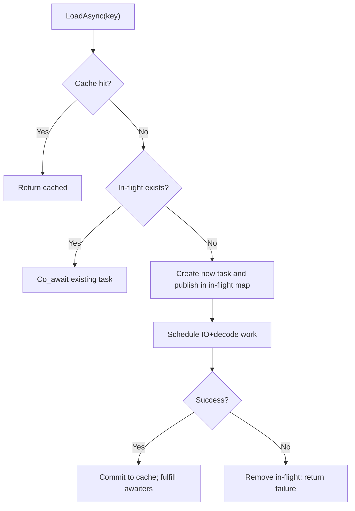

# Async CPU pipeline (Content)

This document specifies the asynchronous CPU-side asset acquisition pipeline for
Content.

The async pipeline must preserve all existing semantics:

- unified cache and refcounted eviction
- forward-only dependency tracking
- Content ends at DecodedCPUReady (no GPU work)

Related:

- `overview.md`
- `deps_and_cache.md`
- `implementation_plan.md`

---

## Goals

- Provide `LoadAsync` APIs that do not block the calling thread.
- Deduplicate concurrent requests for the same key (single decode execution).
- Support cancellation with a strong guarantee:
  - cancelled operations do not partially populate the cache
- Preserve deterministic dependency registration and release cascades.

## Non-goals

- True OS async I/O on day one. The first iteration may wrap synchronous reads
  behind an async abstraction.
- GPU upload scheduling.

---

## Proposed API surface

These are conceptual signatures; exact types depend on the engine coroutine
library.

- `task<std::shared_ptr<T>> LoadAssetAsync<T>(data::AssetKey key, CancellationToken ct)`
- `task<std::shared_ptr<T>> LoadResourceAsync<T>(ResourceKey key, CancellationToken ct)`

Synchronous `LoadAsset` remains:

- `LoadAsset` can call `LoadAssetAsync(...).get()` or remain as a separate
  synchronous implementation depending on scheduling policy.

---

## State model

Introduce an explicit state machine for in-flight loads.

Per key:

- NotPresent
- Loading
- DecodedCPUReady
- Failed

Important property:

- Only successful completion transitions to DecodedCPUReady and commits into
  the cache.

---

## In-flight deduplication

Maintain a map:

- `in_flight_assets: AssetKey -> shared_task<Result>`
- `in_flight_resources: ResourceKey -> shared_task<Result>`

Behavior:

- First caller becomes the “winner” and starts decode.
- Other callers await the same shared task.

### Dedup flow

---

## Cancellation semantics

### Requirements

- Cancellation must be cooperative (checked at well-defined points).
- Cancellation must not leak partially decoded objects.
- Cancellation must not leave “touched” dependencies permanently referenced.

### Strategy

Use a two-phase approach:

1. **Decode phase (no cache commit)**

   - Perform IO and decode into local temporaries.
   - Collect dependency keys during decode.

2. **Commit phase (atomic from Content’s perspective)**

   - Touch/register dependencies.
   - Store the final object in cache.

If cancellation triggers before commit, nothing is inserted.

### Dependency registration under cancellation

To avoid “Touch without commit”, dependency registration should be delayed until
commit.

This implies a loader needs a way to report discovered dependencies without
immediately calling `AddAssetDependency`.

Two options:

- Option A (preferred): `LoaderContext` provides a dependency sink that records
  edges and applies them at commit.
- Option B: keep `AddAssetDependency` but add a “transaction” object that can be
  rolled back on cancellation.

---

## Threading model

Phase 1 enforced single-thread usage via `owning_thread_id_`.

Async introduces concurrency. A clean model is:

- `AssetLoader` remains logically single-threaded for **mutations**:
  - cache insertions
  - dependency map updates
  - in-flight map updates
- Decode work executes on worker threads.
- Commit runs on the AssetLoader thread (or via a mutex/strand).

This keeps cache/refcount semantics deterministic.

---

## Error handling

- Asset not found: returns null/empty result.
- Decoder failure: returns error; does not commit.
- Cancellation: returns a cancellation error; does not commit.

Errors should be observable through diagnostics hooks.

---

## Testing strategy

- Dedup test: N parallel `LoadAsync` calls decode exactly once.
- Cancellation test: cancel mid-decode produces no cache entry.
- Dependency await test: dependent load awaits all dependencies reaching
  DecodedCPUReady.

---

## Open questions

- Do we keep returning `shared_ptr<T>` from async APIs, or introduce a stable
  handle type first (helps hot reload)?
- How should “offline” mode be expressed in the async APIs?
