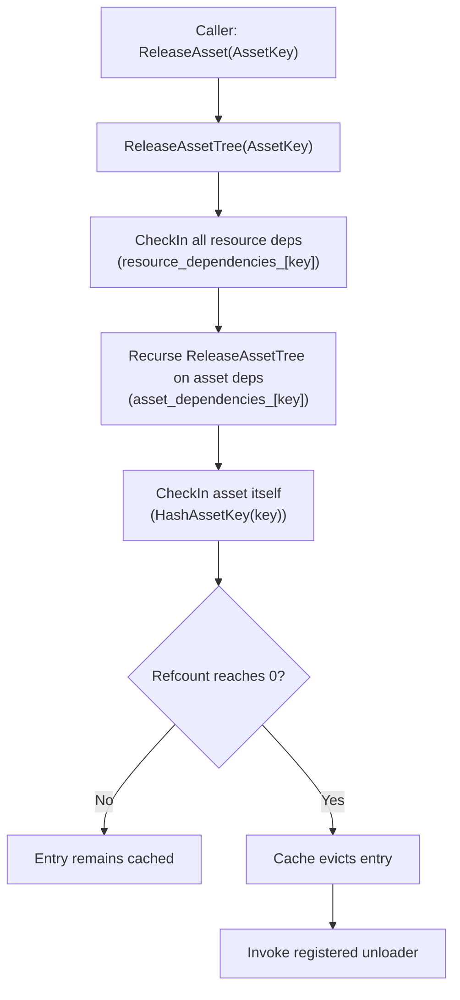

# Asset dependency & caching deep dive (Content)

This document complements `overview.md` and is the **deep dive** on how Content
tracks dependencies and uses caching to enforce safe lifetimes for assets and
resources.

> Canonical status/roadmap: `implementation_plan.md`.
>
> GPU upload / residency is out of scope for Content. Content ends at
> **DecodedCPUReady**. GPU materialization is the Renderer’s job (see
> `src/Oxygen/Renderer/Upload/README.md`).

---

## What problem this solves

We need three things simultaneously:

1. **Deduplication**: repeated requests for the same asset/resource return the
   same instance.
2. **Safety**: you cannot evict/unload something that is still in use, either
   directly by callers or indirectly as a dependency of another cached object.
3. **Low bookkeeping cost**: the dependency model should be cheap in memory and
   simple to reason about.

The chosen approach is:

- One unified cache (`AnyCache`) for both assets and resources.
- Forward-only dependency maps in `AssetLoader`.
- Reference counting enforced by the cache eviction policy.

---

## Key idea: “dependency registration increments lifetime”

Dependencies are registered at decode time by the loaders. Registration is not
just metadata: it also increments the dependency’s reference count in the cache.

Concretely:

- `AddAssetDependency(dependent, dependency)` stores the edge and **Touch()**es
  the dependency in the cache.
- `AddResourceDependency(dependent, resource_key)` stores the edge and
  **Touch()**es the resource in the cache.

This is what ensures that once a dependency is discovered, it cannot be evicted
while the dependent is still checked out.

---

## The unified cache: exact semantics

Content uses `AnyCache<uint64_t, RefCountedEviction<uint64_t>>`.

Important behaviors (these match `AnyCache.h` and the `RefCountedEviction`
policy):

- **Store(key, value)**
  - Inserts the value and sets refcount to **1** (the store operation assumes
   the caller is “using” the item).
- **CheckOut(key)**
  - Returns a typed `shared_ptr<T>` and increments refcount.
- **Touch(key)**
  - Increments refcount but does not return the value.
  - Content uses this to represent “held alive by dependency.”
- **CheckIn(key)**
  - Decrements refcount.
  - When refcount reaches **0**, the cache evicts the entry and runs the
   eviction callback.

Eviction callback = “invoke the type’s unloader.”

This is why unloading is deterministic: it happens **only** on eviction.

---

## Dependency graph model (what is stored)

`AssetLoader` stores *forward edges only*:

- Asset→asset: `asset_dependencies_[dependent] = { dependency, ... }`
- Asset→resource: `resource_dependencies_[dependent] = { resource_key, ... }`

There is no reverse map in production builds.

In debug builds, `ForEachDependent(...)` exists, implemented by scanning the
forward map (useful for tests/diagnostics, not for runtime behavior).

### Dependency types

#### Asset → Asset

- Example: GeometryAsset → MaterialAsset
- Registration: `AddAssetDependency()`
- Safety: enforced by cache refcounts (Touch on dependency)
- Cycle handling: cycles are rejected (see below)

#### Asset → Resource

- Example: MaterialAsset → TextureResource, GeometryAsset → BufferResource
- Registration: `AddResourceDependency()`
- Safety: enforced by cache refcounts (Touch on resource)

#### Resource → (anything)

- Not supported. Resources are leaf nodes from the Content subsystem’s point of
   view.

---

## Cycle rejection

Cycles in asset→asset edges are invalid for two reasons:

- They prevent a strict release order.
- They create “immortal” graphs that never reach refcount zero naturally.

The implementation rejects cycles when registering an asset→asset edge.

Notes:

- Cycle detection currently runs in debug builds (DFS over forward edges).
- On detecting a cycle, the edge is rejected; in debug builds a DCHECK also
   fires.

---

## Release and unload ordering (what happens on ReleaseAsset)

Release is explicit: callers must call `ReleaseAsset(key)` when they’re done
using an asset.

The release algorithm is depth-first and ordered:

1. Check-in resource dependencies
2. Recurse into asset dependencies
3. Check-in the asset itself

When any check-in drives an entry’s refcount to zero, the cache evicts it and
invokes the registered unloader.

### Unloader contract (important)

Unloaders are registered per type via `AssetLoader::RegisterLoader(...)`. The
contract encoded in `AssetLoader.h` is:

- Called only on cache eviction (refcount hits zero).
- Ordering: resource deps checked in first, asset deps released recursively,
   then unloader runs.
- Unloader should not trigger new loads (avoid re-entrancy).
- Unloader must not throw.

---

## How loaders should participate (practical guidance)

### Do: register dependencies at point of discovery

As you decode an asset descriptor, register every asset/reference you discover
immediately:

- For asset references: `AddAssetDependency(current, other_asset_key)`
- For resource references: construct a `ResourceKey` with
   `MakeResourceKey<ResourceT>(*context.source_pak, index)` and then call
   `AddResourceDependency(current, key)`

### Do: avoid “hidden” dependencies

If an asset uses a resource/asset but does not register it, the cache refcount
won’t reflect the true lifetime and eviction can become unsafe.

### Do: avoid leaking dependency checkouts

When a loader calls `LoadResource(...)` (or `LoadAsset(...)`) while decoding an
owning asset, the returned `shared_ptr<T>` represents a *temporary checkout*.

If the owning asset does not retain that `shared_ptr<T>` long-term (most of our
formats store indices/handles, not CPU pointers), then the loader must ensure
that temporary checkout is checked back in after successful dependency
registration.

Practical rule:

- Keep the dependency alive via `Add*Dependency(...)` (which does a `Touch(...)`)
   and then drop the temporary checkout.

If you keep both, you effectively double-count the lifetime and dependencies
may never reach refcount zero even after `ReleaseAsset(...)`.

### Do not: retain `LoaderContext` or readers

The context is passed by value and contains pointers/readers valid only for the
duration of the load call.

---

## Limitations and roadmap linkage

Current (Phase 1):

- Load path is synchronous.
- Dependency registration is manual (by loader code).
- Cycle detection and some safety checks are debug-focused.

Next (Phase 2):

- Async CPU decode (`LoadAsync`) that still ends at DecodedCPUReady.
- In-flight deduplication and cancellation guarantees.
- Optional “bridge descriptor” data for the Renderer to materialize GPU
   resources (Content does not submit uploads).
