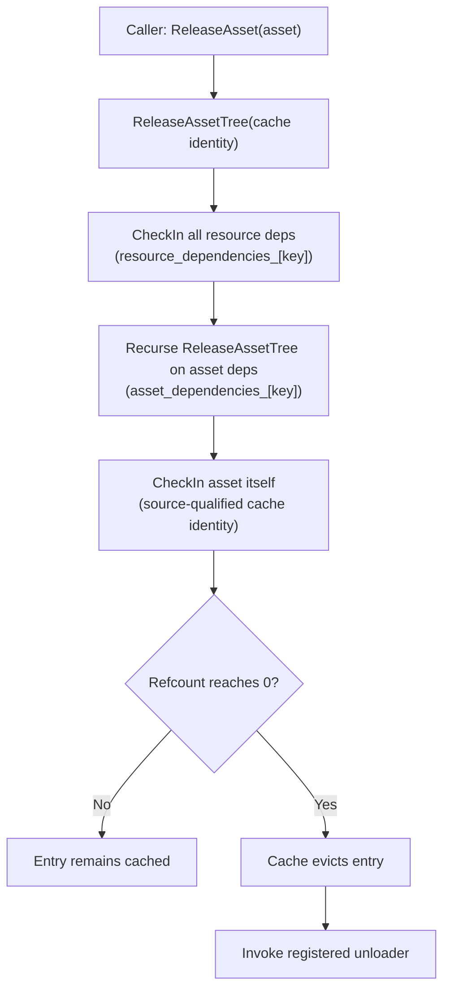

# Asset dependency & caching deep dive (Content)

This document complements `overview.md` and is the **deep dive** on how Content
tracks dependencies and uses caching to enforce safe lifetimes for assets and
resources. See also the [planned simplification](#planned-identity-and-ownership-simplification).

> Canonical status/roadmap: `implementation_plan.md`.
>
> GPU upload / residency is out of scope for Content. Content ends at
> **DecodedCPUReady**. GPU materialization is the Vortex/Graphics job (see
> `src/Oxygen/Vortex/Upload/`, `src/Oxygen/Vortex/Resources/`, and
> `src/Oxygen/Graphics/`).

---

## What problem this solves

We need three things simultaneously:

1. **Deduplication**: repeated requests for the same asset/resource return the
   same instance.
2. **Safety**: you cannot evict/unload something that is still in use, either
   directly by callers or indirectly as a dependency of another cached object.
3. **Low bookkeeping cost**: the dependency model should be cheap in memory and
   simple to reason about.

The chosen approach is:

- One unified cache (`AnyCache`) for both assets and resources.
- Forward-only dependency maps in `AssetLoader`.
- Reference counting enforced by the cache eviction policy.

---

## Key idea: “dependency registration increments lifetime”

Dependencies are applied during the owning-thread **publish** step.

Decode discovers dependency identities on worker threads, but worker-thread
decode must not mutate loader state. Therefore, decode records dependencies into
an identity-only collector, and publish applies them.

Registration is not just metadata: it also increments the dependency’s
reference count in the cache.

Concretely:

- `AddAssetDependency(dependent, dependency)` stores the edge and **Touch()**es
  the dependency in the cache.
- `AddResourceDependency(dependent, resource_key)` stores the edge and
  **Touch()**es the resource in the cache.

This is what ensures that once a dependency is discovered, it cannot be evicted
while the dependent is still checked out.

---

## The unified cache: exact semantics

Content uses `AnyCache<uint64_t, RefCountedEviction<uint64_t>>`.

Important behaviors (these match `AnyCache.h` and the `RefCountedEviction`
policy):

- **Store(key, value)**
  - Inserts the value and sets refcount to **1** (the store operation assumes
    the caller is “using” the item).
- **CheckOut(key)**
  - Returns a typed `shared_ptr<T>` and increments refcount.
- **Touch(key)**
  - Increments refcount but does not return the value.
  - Content uses this to represent “held alive by dependency.”
- **CheckIn(key)**
  - Decrements refcount.
  - When refcount reaches **0**, the cache evicts the entry and runs the
    eviction callback.

Eviction callback = “invoke the type’s unloader.”

This is why unloading is deterministic: it happens **only** on eviction.

---

## Dependency graph model (what is stored)

`AssetLoader` stores _forward edges only_:

- Asset→asset: `asset_dependencies_[dependent] = { dependency, ... }`
- Asset→resource: `resource_dependencies_[dependent] = { resource_key, ... }`

Asset nodes use the existing source-qualified `uint64_t` cache identity. A stable
AssetKey may have old and new generation nodes simultaneously. Resource nodes use
ResourceKey; hashing keeps the original source metadata after lookup retirement.
`Data::Asset::GetSourceKey()` identifies the decoded origin, and Content-owned
shared-pointer deleters retain its source through the last loaded owner.

There is no reverse map in production builds.

Debug `GetDebugAssetDependencyMap()` exposes actual cache identities;
`GetDebugAssetKey()` labels them. `ForEachDependent(AssetKey, ...)` resolves the
current winner and scans its direct incoming edges. Runtime contextual lookup
uses the per-AssetKey identity index and direct-edge membership, without a graph
traversal.

### Dependency types

#### Asset -> Asset

- Example: GeometryAsset → MaterialAsset
- Registration: `AddAssetDependency()`
- Safety: enforced by cache refcounts (Touch on dependency)
- Cycle handling: runtime has debug-only diagnostics; upstream pipeline must
  reject cycles before runtime (see below)

#### Asset → Resource

- Example: MaterialAsset → TextureResource, GeometryAsset → BufferResource
- Registration: `AddResourceDependency()`
- Safety: enforced by cache refcounts (Touch on resource)

#### Resource → (anything)

- Not supported. Resources are leaf nodes from the Content subsystem’s point of
  view.

---

## Cycle policy and upstream rejection

Cycles in asset→asset edges are invalid for two reasons:

- They prevent a strict release order.
- They create “immortal” graphs that never reach refcount zero naturally.

Runtime cycle detection in `AssetLoader` is a debug-only structural guard.
Release runtime does not enforce cycle rejection and assumes acyclicity has
already been validated upstream.

Notes:

- Cycle detection runs in debug builds (DFS over forward edges) as a runtime
  diagnostic.
- Upstream import planning/authoring validation must reject cyclic graphs
  before runtime. `ImportPlanner::MakePlan()` fails hard on cycles and is
  covered by `ImportPlanner_test` cycle cases in CI.

---

## Release and unload ordering (what happens on ReleaseAsset)

Release is explicit: `ReleaseAsset(asset)` checks in that exact decoded origin.
`ReleaseAsset(AssetKey)` addresses the current winner and is unsuitable for an
object retained across source replacement. An object from an immutable generation
retains its source lease after cache eviction and continues reading those bytes.
Mutable roots require reader quiescence before replacement; the planned source
instance contract below explicitly revokes their old read capability.

The release algorithm is depth-first and ordered:

1. Check-in resource dependencies
2. Recurse into asset dependencies
3. Check-in the asset itself

When any check-in drives an entry’s refcount to zero, the cache evicts it and
invokes the registered unloader.


```mermaid
flowchart TD
   A["Caller: ReleaseAsset(asset)"] --> B["ReleaseAssetTree(cache identity)"]
   B --> C["CheckIn all resource deps<br/>(resource_dependencies_[key])"]
   C --> D["Recurse ReleaseAssetTree on asset deps<br/>(asset_dependencies_[key])"]
   D --> E["CheckIn asset itself<br/>(source-qualified cache identity)"]
   E --> F{"Refcount reaches 0?"}
   F -- No --> G["Entry remains cached"]
   F -- Yes --> H["Cache evicts entry"]
   H --> I["Invoke registered unloader"]
```

### Unloader contract (important)

Unloaders are registered per type via `AssetLoader::RegisterLoader(...)`. The
contract encoded in `AssetLoader.h` is:

- Called only on cache eviction (refcount hits zero).
- Ordering: resource deps checked in first, asset deps released recursively,
  then unloader runs.
- Unloader should not trigger new loads (avoid re-entrancy).
- Unloader must not throw.

---

## How loaders should participate (practical guidance)

### Do: record dependencies at point of discovery

As you decode an asset descriptor, record every reference you discover
immediately.

In the async pipeline, worker-thread decode records dependencies via
`internal::DependencyCollector` supplied in `LoaderContext`:

- Asset dependencies are recorded as `data::AssetKey`.
- Resource dependencies are recorded either as `ResourceKey` (already-bound) or
  as `internal::ResourceRef` (container-relative reference), which is bound to
  `ResourceKey` on the owning thread.

Examples (decode code):

- Asset reference:

  ```cpp
  context.dependency_collector->AddAssetDependency(other_asset_key);
  ```

- Resource reference (container-relative):

  ```cpp
  context.dependency_collector->AddResourceDependency(internal::ResourceRef{
      .source = context.source_token,
      .resource_type_id = ResourceT::ClassTypeId(),
      .resource_index = index,
  });
  ```

Publish (owning thread) binds `ResourceRef -> ResourceKey` and applies
`Add*Dependency(...)` to mutate the dependency graph and Touch the cache.

### Do: avoid “hidden” dependencies

If an asset uses a resource/asset but does not register it, the cache refcount
won’t reflect the true lifetime and eviction can become unsafe.

### Do not: perform nested loads from loader functions

Loader functions run on worker threads as part of decode. They must not call
back into `AssetLoader` and must not trigger nested `Load*` operations.

Rationale:

- Nested loads from decode would reintroduce owning-thread mutation from worker
  threads.
- The orchestrator coroutine is responsible for loading dependencies, and
  publish is responsible for applying dependency edges.

### Do not: retain `LoaderContext` or readers

The context is passed by value and contains pointers/readers valid only for the
duration of the load call.

---

## Limitations and roadmap linkage

Current:

- Assets and resources are cached in a unified refcounted cache.
- Dependencies are identity-only and forward-only.
- Async decode records dependency identities into `DependencyCollector`; publish
  applies edges and Touches cache entries via `Add*Dependency(...)`.
- Cycle detection remains a debug-focused safety check.

Deferred / out of scope:

- GPU residency and GPU-side lifetime management. Content eviction triggers
  Content unloaders only; Renderer-owned GPU residency is handled separately.

## Planned identity and ownership simplification

Status: planned for M08.1.5–M08.1.6. This replaces the current cache identity and
manual checkout protocol; it is not a claim about the implementation above.

| Identity           | Fields                                                             |
| ------------------ | ------------------------------------------------------------------ |
| SourceOrigin       | Persistent SourceKey plus runtime SourceInstanceId.                |
| Asset              | SourceInstanceId and AssetKey.                                     |
| Cooked resource    | SourceInstanceId, explicit ResourceKind and resource index.        |
| Synthetic resource | ResourceKind and producer-owned serial/lifetime.                   |
| ContentId          | Nonzero monotonic uint64, never reused within its loader lifetime. |

Use Base Uuid/NamedType for source instances and handles. Mint a new source
instance on every open/refresh, including unchanged SourceKey/index bytes. Intern
full identities using equality; hashes select buckets only. Interning/publication
belongs to the loader thread; decode workers report identities without modifying
registries. One owning identity map and nonowning ID index replace the asset and
resource reverse registries, packed source IDs and hash-as-identity conversions.
Nexus recycled-slot machinery is unnecessary for nonrecycled IDs.

Source instances retain touched locator records while mounted/readable, even when
decoded entries are evicted. This preserves lazy reload through a ResourceKey.
Metadata costs O(distinct locators touched in live sources); measure that cost.
Retirement removes current-winner eligibility. Immutable sources remain exactly
readable through retained ownership; mutable roots revoke old read capability
before path reuse. Distinct identity alone cannot preserve overwritten bytes.

Owning acquisitions return aliasing shared_ptr checkout controls; the cache stores
bare decoded pointers. Coalesce decoding, then create one control per accepted
request with its exact internal/external role. Copies share that request's control.
An in-flight residency hold protects the bare result until surviving requests have
acquired their controls. Release that hold exactly once after delivery or when all
waiters cancel; cancellation during delivery must leave neither an eviction gap
nor an unowned hold.
Each parent's dependency edge and Data child pointer share one internal control;
there is no second Touch/pin or control-to-parent reference. Pins remain distinct
residency requests. Explicit Peek/metadata inspection stays allocation-free and
cannot be retained across suspension or source mutation.

Last-control destruction queues its already-allocated release record. Enqueue and
shutdown closure must linearize: accepted releases drain on the owner thread;
late destruction releases storage without invoking a destroyed loader. No throwing
lock, allocation or GPU operation belongs in that destructor. Remove manual release
balancing only after all callers migrate. Keep eviction policy unchanged initially;
do not force child eviction while a valid extracted child pointer survives.

Required checks: forced hash collisions; same-key mutable refresh; exact old-source
reads; lazy reload after eviction; mixed-role coalesced requests; all-waiter and
delivery-time cancellation; shared-parent and
extracted-child lifetimes; off-thread destruction and shutdown races. Measure cache
metadata and owning-acquisition costs; preserve IBL hot-path allocations and GPU
retirement behavior. Reference: UE5.7.4 FStreamableHandle ownership in
`Engine/Classes/Engine/StreamableManager.h`; Oxygen's CPU/GPU boundary remains its own.
