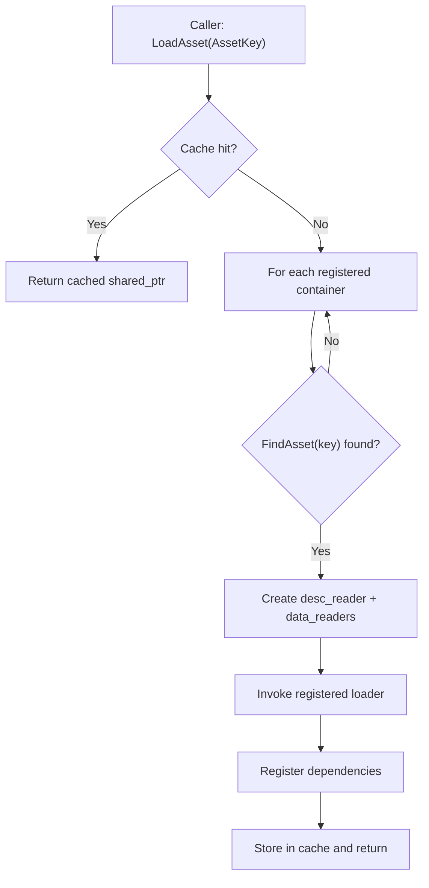

# Loose cooked content (filesystem-backed source)

This document specifies how Oxygen Content loads **cooked Oxygen formats** from **loose files** (a directory) in
addition to `.pak` containers.

The goal is a single content model with two container forms:

- **Loose cooked** for fast editor iteration.
- **PAK** for shipping and reproducible builds.

Related:

- Conceptual boundaries: `overview.md`
- Cache/deps mechanics: `deps_and_cache.md`
- Roadmap: `implementation_plan.md`

---

## Problem statement

Today `AssetLoader` can only discover cooked asset descriptors via `PakFile::FindEntry`. That blocks using real content
in the editor unless it is already packaged.

We need to:

- Load cooked Geometry/Material/Texture/Buffer from disk.
- Preserve existing loader behavior (`LoaderContext`, dependency registration, caching, eviction).
- Preserve the Content↔Renderer boundary (Content ends at DecodedCPUReady).

Separately, the editor’s Content Browser and scenes address assets by **virtual paths** rooted at mount points (e.g.
`/Engine/...`, `/Content/...`, and user-defined mounts). The design must keep:

- Editor UX stable (virtual paths).
- Runtime loading stable (`AssetKey` / `ResourceKey`).
- A deterministic mapping between the two.

---

## Goals

- Provide a filesystem-backed container that behaves like a `PakFile` from the loader’s point of view.
- Keep the cache key space stable:
  - `data::AssetKey` remains the canonical asset identifier.
  - `ResourceKey` remains unique per (container, resource type, resource index).
- Keep loader decode logic unchanged (loaders must not care whether bytes come from PAK or folder).

## Non-goals

- Runtime import of source formats (FBX/GLTF/PNG/XBF/etc.). Runtime Content remains strictly about cooked Oxygen
  formats.
- Hot reload (separate doc: `hot_reload.md`).
- GPU uploads/residency/budgets.

@note The editor may import and cook source formats. This document specifies the runtime-facing cooked layout and the
editor-driven cook/pack pipeline that produces it.

---

## Key concepts and invariants

### Concepts

- **Virtual path**: editor-facing identity (what scenes persist), e.g. `/Content/Materials/DarkWood.mat`.
- **Mount point**: editor policy mapping `virtual_root → physical_root`.
- **AssetKey**: runtime-facing identity; `AssetLoader` loads by `AssetKey`.
- **ResourceKey**: runtime-facing identity for resources, includes a 16-bit container id.
- **Descriptor**: small cooked per-asset bytes consumed via `desc_reader`.
- **Resource data**: bulk cooked bytes consumed via resource tables + data regions.
- **Content source**: runtime-facing source of cooked bytes (PAK or loose cooked directory) registered with
  `AssetLoader`.

### Invariants

1. **Intra-container references only**

   Cooked assets in a container may reference only assets/resources in the same container.

2. **Stable source indexing**

   `ResourceKey` reserves the upper 16 bits for a container index.

   - Today this index is effectively a **PAK index** (dense 0..N-1 in
     registration order).
   - Loose cooked will generalize this to a **source id** with the same
     encoding.

   The encoding does not change.

3. **LoaderContext contract**

   Loaders receive:

   - `desc_reader`: positioned at the start of a descriptor
   - `data_readers`: seekable readers for resource bulk data

   Additional loader contract:

   - `LoaderContext::parse_only` explicitly requests “parse without dependency
     resolution/registration”. This enables unit tests and tooling to call
     loaders directly without requiring full `AssetLoader` invocation context.
   - Resource descriptor fields that represent offsets (e.g.
     `data::pak::TextureResourceDesc::data_offset`) are interpreted against the
     backing `AnyReader` stream provided by the current content source.

   Loose cooked content must provide compatible descriptor streams and data region streams.

4. **Virtual paths are editor-facing; AssetKey is runtime-facing**

   The editor persists virtual paths for traceability. Runtime Content APIs continue to load by `AssetKey`. Therefore a
   deterministic mapping `VirtualPath → AssetKey` must exist.

   This mapping can be provided by:

   - A cooked container index (for loose cooked containers).
   - The Asset Database described in `asset_database_and_ddc.md`.

5. **"It just works" requires deterministic identity**

   The system must define:

   - Canonical virtual path normalization.
   - Deterministic `AssetKey` assignment.
   - Deterministic cook and pack outputs given the same inputs.

---

## End-to-end developer workflow

1. The developer edits source files under the project authoring mount(s) (commonly `Content/`).
2. The developer presses **Cook**.
3. The editor writes a deterministic loose cooked root containing:
   - cooked descriptors (`assets/**`)
   - cooked resource tables/data (`resources/*.table` + `resources/*.data`)
   - a binary cooked index (`container.index.bin`)
4. Play-in-editor uses the loose cooked root for fast iteration.
5. The developer (or CI) presses **Pack**.
6. A deterministic `.pak` is produced under a final output directory.
7. Shipping runtime mounts `.pak` files and loads by `AssetKey`.

---

## Which artifacts are used by editor vs runtime?

Definitions:

- **Editor**: tooling that browses, cooks, and launches play-in-editor.
- **Runtime**: engine runtime that loads by `AssetKey`.
- **Used**: required input for correctness (not “nice to have”).

Legend:

- Consumer: ✅ used (required), ❌ not used

| Artifact | Format (required) | Class | Lives under | Producer | Editor | Runtime | Purpose |
| --- | --- | --- | --- | ---: | :---: | :---: | --- |
| Project mount configuration | JSON/text | Authoring config | Authoring root (mounted, e.g. `Content/` + project config files) | Editor | ✅ | ❌ | Defines the virtual namespace and where sources live on disk. |
| Scene/prefab files (virtual paths) | JSON/text | Authoring data | Authoring root | Editor | ✅ | ❌ | Persist authoring identity by virtual path. |
| Source files (e.g. `.png`, `.gltf`) | Source-specific | Source files | Authoring root (mounted, e.g. `Content/`) | Developer | ✅ | ❌ | Inputs to cooking; not runtime-loadable in this design. |
| `container.index.bin` | Binary | Cooked index | Cooked root | Cook | ✅ | ✅* | Required mapping+validation: `VirtualPath ↔ AssetKey`, `AssetKey → descriptor path`, hashes, resource table locations. |
| `assets/**` cooked descriptors | Binary | Descriptor (cooked) | Cooked root `assets/` | Cook | ✅ | ✅ | Per-asset descriptor bytes consumed by loaders (`desc_reader`). |
| `resources/*.table` | Binary | Resource table (cooked) | Cooked root `resources/` | Cook | ✅ | ✅ | Resource lookup tables referenced by descriptors. |
| `resources/*.data` | Binary | Resource data (cooked) | Cooked root `resources/` | Cook | ✅ | ✅ | Bulk binary payload regions for streaming. |
| `<MountName>.pak` | Binary | Shipping container | Packaged output | Pack | ✅ | ✅ | Single shipping container: descriptors + resources + embedded browse/trace index. |

\* Runtime uses `container.index.bin` only when mounting **loose cooked**.

Normative format rules:

- Cook outputs consumed by runtime (`container.index.bin`, cooked descriptors, and resource tables/data) are **binary**.
- Editor-owned project configuration and persisted scene data are **textual** (prefer JSON) for mergeability and debugging.
- Source files are consumed by the editor/cook step, not by runtime.

Normative classification rules:

- Anything used as `desc_reader` input is a **descriptor** and is cooked under `assets/`.
- Anything used as resource-table/data-region input is a **resource** and is cooked under `resources/`.
- Anything under the project authoring mount root (e.g. `Content/`) is a **source file** and is not a runtime artifact.

---

## Proposed runtime architecture

Introduce a small abstraction representing a content source:

- `PakFileSource`: adapts existing `PakFile`.
- `LooseCookedSource`: reads cooked descriptors/tables/data from a directory.

`AssetLoader` holds a list of sources and searches them when resolving an `AssetKey`.

### Content source interface (conceptual)

This is not a final header; it enumerates required capabilities.

- Identity
  - `std::string_view DebugName() const noexcept`

- Asset discovery
  - `std::optional<AssetLocator> FindAsset(const data::AssetKey&) const noexcept`

- Descriptor reading
  - `std::unique_ptr<serio::AnyReader> CreateAssetDescriptorReader(const AssetLocator&) const`

- Resource access (Phase 1: tables + bulk readers)
  - `std::unique_ptr<serio::AnyReader> CreateBufferTableReader() const`
  - `std::unique_ptr<serio::AnyReader> CreateTextureTableReader() const`
  - `const ResourceTable<data::BufferResource>* GetBufferTable() const noexcept`
  - `const ResourceTable<data::TextureResource>* GetTextureTable() const noexcept`
  - `std::unique_ptr<serio::AnyReader> CreateBufferDataReader() const`
  - `std::unique_ptr<serio::AnyReader> CreateTextureDataReader() const`

The interface is intentionally minimal to keep loader logic unchanged.

@note Oxygen builds Content with RTTI disabled (e.g. MSVC `/GR-`). Concrete
source type identification must use Oxygen's `TypeId` system via
`oxygen::Object` + `OXYGEN_TYPED(...)` (i.e. `GetTypeId()` / `ClassTypeId()`),
not `dynamic_cast`.

### Resolution flow (virtual path → AssetKey → bytes)

1. Component stores a virtual path (e.g. `/Content/Materials/DarkWood.mat`).
2. Editor resolves `VirtualPath → AssetKey` using the cooked container index (or Asset DB when available).
3. Runtime loads by `AssetKey` via `AssetLoader::LoadAsset<T>(AssetKey)`.
4. Source resolves `AssetKey → descriptor bytes` (loose: via index → file; PAK: via directory entry) and provides
  data-region readers.

---

## Mount points (editor integration)

The editor establishes a virtual path namespace via mount points:

- `/Engine` — built-in engine assets/capabilities
- `/Content` — the current project’s Content directory
- Additional mounts — shared folders mounted at user-defined roots

At the design level there are two distinct concepts:

1. **Mount point (editor-facing)**

   A mapping from a virtual root (e.g. `/Content`) to one or more filesystem roots. This is what the Content Browser
   shows and what scene/components persist.

2. **Content source (runtime-facing)**

  A source of cooked bytes (PAK file or loose cooked directory) registered with `AssetLoader`.

### Provisioning mount points into the runtime engine

Mount points are editor policy, but the runtime still needs the concrete cooked sources (directories and/or `.pak`
files) to register containers during startup.

Today the only concrete runtime API for registration is:

- `.pak` container: `oxygen::content::AssetLoader::AddPakFile(pak_path)`

For loose cooked, we have a symmetric entry point:

- loose cooked source: `AssetLoader::AddLooseCookedRoot(cooked_root_path)`

What is required for editor integration is a mount registry that accepts `(virtual_root, physical_root)` pairs. Proposed
shape (conceptual):

- `RegisterMountPoint(virtual_root, physical_root)`
- `AddPakFile(virtual_root, pak_path)`
- `AddLooseCookedRoot(virtual_root, cooked_root_path)`

Bootstrap example (editor-side, conceptual):

```cpp
content_mounts.RegisterMountPoint("/KittyStuff", "C:/Hello/Kitty/MyStuff");

asset_loader.AddLooseCookedRoot("C:/Hello/Kitty/MyStuff");
asset_loader.AddPakFile("C:/Hello/Kitty/MyStuff/content.pak");
```

@note Paths should be normalized (absolute/canonical) to avoid duplicates.

### Canonical virtual path rules (required)

- Start with `/`.
- Use `/` as the separator (never `\\`).
- No `.` or `..` segments after normalization.
- No trailing `/` (except the root itself).
- Case policy must be explicit and consistent. Recommendation:
  - Treat virtual paths as case-sensitive for identity.
  - Provide editor UX that normalizes case only when the underlying platform requires it.

### Deterministic container registration order (required)

`ResourceKey` encodes a 16-bit container id derived from registration order. Therefore the editor must register
sources deterministically (recommended: sort by virtual root, then explicit priority, then stable path string).

---

## Loose cooked container format

Loose cooked content replicates the conceptual structure of a PAK, split across files.

@note In loose cooked mode, resource tables (`resources/*.table`) and resource
data (`resources/*.data`) are separate files. Offsets embedded in resource
descriptors are interpreted against the corresponding `AnyReader` stream
provided by the mounted content source.

### Directory layout (recommended)

```text
CookedRoot/
  container.index.bin
  assets/
    Textures/
      Cool.tex
    Materials/
      DarkWood.mat
  resources/
    buffers.table
    buffers.data
    textures.table
    textures.data
```

### What are the files under `assets/`?

The files under `assets/` are cooked **descriptor** files, not source assets.

- `assets/Textures/Cool.tex` is a cooked texture descriptor (not a `.png`).
- `assets/Materials/DarkWood.mat` is a cooked material descriptor (not a shader graph source).

These are what `LoaderContext::desc_reader` reads.

They are named to match the editor-visible virtual path for human friendliness and to preserve mount semantics (virtual
path hierarchy mirrors directories).

@note If we want an explicit “this is cooked” suffix, we can use `Cool.tex.odesc` / `DarkWood.mat.odesc`.

### `container.index.bin` responsibilities

The cooked index is required and provides:

- Asset directory: `AssetKey -> descriptor file path`.
- Virtual-path mapping for editor workflows:
  - `AssetKey -> virtual path` (string)
  - `virtual path -> AssetKey` (string)
- Resource metadata:
  - counts
  - integrity hashes (SHA-256); verification is enforced when digests are present
  - paths to `*.table` and `*.data`
- Versioning:
  - schema version
  - content version

Current runtime expectations when mounting a loose cooked root:

- The index must be present and parseable.
- Index header flags are validated:
  - unknown flag bits are rejected
  - when `flags != 0`, the index must declare virtual-path support
  - file records are disallowed unless the index declares them
- Index section layout is validated (no overlapping/invalid ranges).
- Descriptor files referenced by the index must exist and match the recorded descriptor sizes.
- Resource table/data files must appear as complete pairs (e.g. `textures.table` and `textures.data`).
- If the index provides a non-zero SHA-256 digest for a referenced file, runtime validates the file hash on mount.
- All paths are validated and must be canonical:
  - descriptor/resource paths are container-relative and use `/` (no `\\`, no `..`, no `//`)
  - virtual paths start with `/` and contain no dot segments
- Duplicate records are rejected (e.g. duplicate `AssetKey`, duplicate `FileKind`, and duplicate virtual-path strings).
- File records reject unknown/unsupported `FileKind` values.

@note The index format includes SHA-256 fields for descriptors and resource files. Runtime verifies hashes on mount only
when the index digest is non-zero (all-zero digests are treated as “not provided”).

---

## PAK requirements (browsing, traceability, privacy)

Requirement (editor UX): when a `.pak` is mounted, the editor must be able to present its contents as a hierarchical
tree, like a file system.

Important gap: the current PAK directory entries do not store virtual paths. Therefore a shipping PAK must embed a path
directory.

### Embedded path directory (required)

The PAK format (new version) must include a `PathDirectory` section referenced by the footer:

- String table (UTF-8, forward slashes, normalized)
- Entries mapping `AssetKey -> path_string_offset`

Paths stored in the PAK are **container-relative** (no leading slash), e.g. `Textures/Cool.tex`. The editor applies the
mount root at mount time.

### Privacy (required)

- Do not embed physical filesystem paths (e.g. `C:\\Users\\...`).
- Do not embed machine-local mount roots.
- Only store container-relative virtual paths and other non-sensitive provenance metadata.

---

## Deterministic cook and pack

### Principle: author by virtual path, ship by AssetKey

- Authoring identity is the virtual path.
- Runtime identity is `AssetKey` / `ResourceKey`.
- Cooking bridges the two.

### Deterministic `AssetKey` assignment (required)

- `AssetKey = Hash128(virtual_path + "\n" + asset_type + "\n" + schema_version)`

### Cook outputs (loose cooked)

Required behaviors:

- Write `container.index.bin` as the authoritative mapping.
- Write cooked descriptor files under `assets/` following the normalized virtual-path hierarchy.
- Write `resources/*.table` and `resources/*.data`.

Incremental cook (required): regenerate only impacted outputs and update the index atomically.

Atomicity (required): cook writes to a staging directory then swaps/renames into place; diagnostics reject partial
roots.

Integrity (required): the index records per-file size + strong hash (SHA-256 recommended) for:

- `resources/*.table`, `resources/*.data`
- each descriptor under `assets/`

### Pack outputs (PAK)

Packing takes a cooked root and produces a `.pak` under a final output directory.

Determinism (required):

- Asset directory order is stable (sorted by `AssetKey`).
- Resource tables and data regions are written deterministically.
- The PAK embeds the path directory so it is self-describing and browsable.

### Output directory conventions (recommended)

- Intermediate cooked output:
  - `.../DerivedData/Cooked/<Target>/<MountName>/...`
- Final packaged output:
  - `.../Build/<Target>/Content/<MountName>.pak`

---

## Override / overlap strategy (deterministic)

Mount points may combine multiple sources under a single virtual root (project content + engine content + user
overrides). This requires a deterministic rule.

Definitions:

- A **mount point** owns a `virtual_root` and an ordered list of **sources**.
- A **source** is a registered content source with:
  - an explicit integer `priority` (higher wins)
  - a stable `registration_order` tiebreaker

Rules:

1. **Virtual path resolution is first-match-wins**

   Editor queries sources in descending `(priority, registration_order)` and uses the first source that contains the
   virtual path.

2. **Runtime `AssetKey` resolution remains first-match-wins**

  `AssetLoader` searches sources in deterministic registration order and uses the first source that contains the key.

1. **Collisions are diagnosed**

   - Same virtual path maps to different `AssetKey`s across sources.
   - Same `AssetKey` appears in multiple containers (with potentially different bytes).

   Policy:

   - Warnings in the editor (overrides are useful) but must be deterministic.
   - Strict mode (CI/shipping) treats collisions as errors.

Collision matrix:

| Case | Example | Default behavior (Editor) | Strict mode (CI/shipping) |
| --- | --- | --- | --- |
| Same virtual path, same `AssetKey` | `/KittyStuff/A` in S1 and S2, both map to key K | Allow; higher priority source wins; log `INFO` | Allow; log `WARNING` |
| Same virtual path, different `AssetKey` | `/KittyStuff/A` maps to K1 in S1 and K2 in S2 | Allow; higher priority source wins; log `WARNING` | Error |
| Same `AssetKey`, identical bytes | Key K present in S1 and S2, content hash matches | Allow; first-match wins; log `INFO` | Allow; log `WARNING` |
| Same `AssetKey`, different bytes | Key K present in S1 and S2, content hash differs | Allow; first-match wins; log `WARNING` | Error |

@note Intra-container reference invariant still applies: overriding an asset must bring its own dependencies within the
same container.

---

## ResourceKey semantics in loose cooked mode

Current `ResourceKey` layout (via `InternalResourceKey`):

- upper 16 bits: container index (currently “pak index”)
- next 16 bits: resource type index
- lower 32 bits: resource index

Loose cooked mode must provide deterministic `ResourceIndexT` values.

Two acceptable strategies:

1. **Index-assigned indexing** (recommended)

   The cook step assigns indices and writes `buffers.table` / `textures.table` accordingly.

2. **Deterministic indexing by stable ordering**

   Deterministic sorting of resource records by a stable key (e.g. GUID or content hash) produces stable indices. This
   must be identical across machines and cook runs.

---

## Load flows

### LoadAsset (container-agnostic)



### LoadResource (container-specific)

Resources are still resolved through the container that produced the `ResourceKey`.

- Decode `ResourceKey -> (containerId, typeIndex, resourceIndex)`.
- Find container by `containerId`.
- Use its `ResourceTable<T>` and data-region readers.

---

## Validation and diagnostics

Minimum validation for loose cooked content:

- Index schema version check.
- Verify that each asset descriptor file exists.
- Verify that resource table files exist and parse.
- Verify that `ResourceIndexT` requests are in range.

Diagnostics:

- Log container root + index version.
- Log missing asset keys with container names searched.

---

## Testing strategy

- Unit test: index parsing and directory lookup.
- Unit test: stable `ContainerId` assignment ordering.
- Integration test: load MaterialAsset that references TextureResource via ResourceIndexT resolved from loose cooked
  tables.

---

## Level-2 task breakdown (engine-side)

This section expands macro tasks #4 and #5 into an exact ordered list of engine
implementation tasks.

These are intentionally “engine-side”:

- Container interfaces, container registration, file IO, and validation.
- Parsing/loading cooked artifacts.
- Unit/integration tests in the Content test suite.

Editor UI, authoring importers, and cook toolchain work live outside this plan
except where they affect runtime-facing artifacts.

### #4 Loose cooked content (filesystem-backed container) — detailed tasks

Implementation status (Dec 2025):

- ✅ 4.1 and 4.2 are implemented for `.pak` sources via the internal
  `IContentSource` seam and `PakFileSource` adapter.
- ✅ 4.3 is implemented (API exists and registers an index-backed
  `LooseCookedSource`).
- ✅ 4.4 is implemented (descriptor readers, resource table readers, and
  resource data readers are wired through `IContentSource`).

4.1 Define a minimal content source abstraction used by `AssetLoader`

- Introduce an internal interface (`IContentSource`) exposing only what loaders
  need: find-by-`AssetKey`, create descriptor reader, create data-region
  reader(s), and access resource tables.
- Add a `PakFileSource` adapter around the existing `PakFile` so the new source
  pipeline can be exercised without changing loader logic.

Status: ✅ complete (implemented using `oxygen::Object` + `OXYGEN_TYPED`).

4.2 Generalize `AssetLoader` from “list of PakFiles” → “list of sources”

- Store sources in deterministic registration order.
- Preserve existing behavior for `AddPakFile(...)` (but internally register a
  `PakFileSource`).
- Assign and persist a stable 16-bit source id per registered source and use it
  for `ResourceKey` composition.

Status: ✅ complete for PAK-backed sources (dense PAK/source id space preserved).

4.3 Add runtime API to register a loose cooked root

- Implement `AssetLoader::AddLooseCookedRoot(const std::filesystem::path&)`.
- Canonicalize paths (absolute, normalized separators) consistently with
  `AddPakFile` to avoid duplicates.
- Register a `LooseCookedSource` instance (initially with stub index parsing
  until task #5 lands).

Status: ✅ complete (registration only; discovery/IO work remains in 4.4 and #5).

Update (Dec 2025): `LooseCookedSource` now validates `container.index.bin` at
mount time and can locate and open descriptor files via the index.

4.4 Implement loose cooked “reader plumbing”

- Descriptor readers: open cooked descriptor files (under `assets/**`) as
  `AnyReader` positioned at the descriptor start.
- Data-region readers: open `resources/*.data` as `AnyReader` positioned at the
  data region start.
- Ensure the same `LoaderContext` expectations are met as in PAK mode.

Status: ✅ complete.

4.5 Add diagnostics for container registration and misses

- Log container debug name, id, and root path at mount/register time.
- On miss, log searched containers and the missing `AssetKey`.

4.6 Add focused tests (container infrastructure)

- Unit test: deterministic container id assignment given stable registration
  order.
- Integration test: mount a generated PAK (existing test infra) and verify
  container abstraction path still loads assets identically.

Status: ✅ complete.

### #5 Loose cooked index (AssetKey→descriptor path, resources) — detailed tasks

5.1 Specify the binary `container.index.bin` schema (versioned)

- Define: schema version, content version, and required sections.
- Required mappings:
  - `AssetKey -> descriptor relative path` (under cooked root)
  - `VirtualPath <-> AssetKey` (editor-facing browsing + resolution)
  - resource table/data file names and metadata
  - per-file size + strong hash (SHA-256 recommended) for validation

Status: ✅ complete for v1 (versioned schema with explicit header flags for
virtual-path support and file-record presence).

5.2 Implement index reader + validator in Content

- Parse `container.index.bin`.
- Validate schema version.
- Validate required sections exist.
- Validate file integrity on mount when SHA-256 digests are provided in the index.

Status: ✅ complete for v1 (parser + strict mount-time validation are implemented,
including required-section enforcement via `IndexHeader::flags`).

5.3 Wire `LooseCookedContainer` to the index

- `FindAsset(AssetKey)` uses the index to locate the descriptor file path.
- Resource tables/data readers use index-provided paths and metadata.
- Expose (for editor/tooling) `VirtualPath -> AssetKey` lookup from the index
  via a small resolver above `AssetLoader` (do not add virtual-path logic inside
  `AssetLoader`).

Status: ✅ complete (`FindAsset(AssetKey)` uses the index to locate descriptor
files; resource tables/data readers are implemented; virtual-path resolution is
available via `VirtualPathResolver` above `AssetLoader`, with deterministic
first-match-wins behavior and collision warnings when the same virtual path maps
to different AssetKeys across mounted cooked roots).

5.4 Implement deterministic resource indexing strategy

- Adopt “index-assigned indexing” as the required engine-facing strategy:
  `ResourceIndexT` values come from the cooked tables (produced by cook).
- Ensure `ResourceKey` decoding remains unchanged and `containerId` routes the
  request to the right container.

Status: ⏸ deferred (future enhancement). Runtime correctness only requires that
each cooked container is internally consistent (asset descriptors reference
valid table row indices). Stable indices across regenerated containers are a
cook/pack determinism and patchability concern (smaller deltas when content does
not change), and require additional cook-side bookkeeping.

5.5 Implement loose cooked resource table reading

- Load and parse `resources/*.table` files as `ResourceTable<T>`.
- Ensure table parsing matches PAK table semantics (counts, offsets, indices).

Status: ✅ complete. Loose cooked tables are validated by file size, exposed as
`ResourceTable<T>` with `entry_size == sizeof(DescT)` and `count ==
file_size / entry_size`, and read through per-file table readers.

5.6 Add focused tests (index + loose cooked loading)

- Unit test: parse a minimal valid `container.index.bin`.
- Unit test: schema mismatch / missing section fails validation.
- Integration test: mount a synthetic loose cooked root and load a Material that
  references Texture resources, validating resource table + data readers.

Status: ✅ complete.

Coverage:

- Minimal index acceptance and schema/section validation live in
  `LooseCookedIndex_test.cpp`.
- End-to-end loose cooked load (Material descriptor referencing a texture index)
  lives in `AssetLoader_loading_test.cpp`.

5.7 Tooling parity checks (debug-only)

- Add optional debug helper to dump the index contents (keys + virtual paths +
  descriptor paths) for diagnostics.
- Add a quick validation entry point usable by tests (mount/validate without
  doing full loads).
