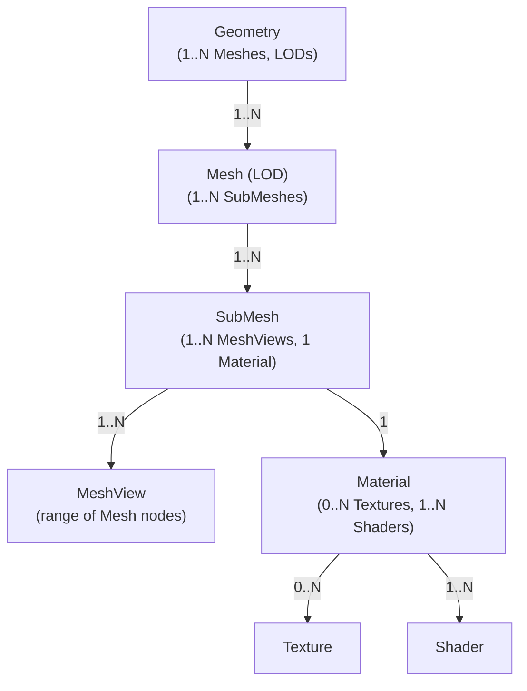

# Asset Entity Relationships: Summary and Diagram

## Relationship Summary Table

| From      | To        | Cardinality | Notes                                                                 |
|-----------|-----------|-------------|-----------------------------------------------------------------------|
| Geometry  | Mesh      | 1 : N       | 🌳 Geometry is the root structure; it maps to multiple Meshes for LODs. |
| Mesh      | SubMesh   | 1 : N       | 🧩 A Mesh is subdivided into SubMeshes — logical partitions for rendering. |
| SubMesh   | MeshView  | 1 : N       | 📏 A SubMesh groups one or more contiguous MeshViews (range slices of the Mesh), all renddered with the same material. |
| SubMesh   | Material  | 1 : 1       | 🎚️ Each SubMesh is rendered with a single Material instance.         |
| Material  | Texture   | 0 : N       | 🖼️ A Material can have zero or more Textures (e.g., color maps, normal maps). |
| Material  | Shader    | 1 : N       | 🧠 A Material can reference multiple Shaders, at most one per stage (see ShaderStageFlags). |

## Entity Dependency Flowchart

