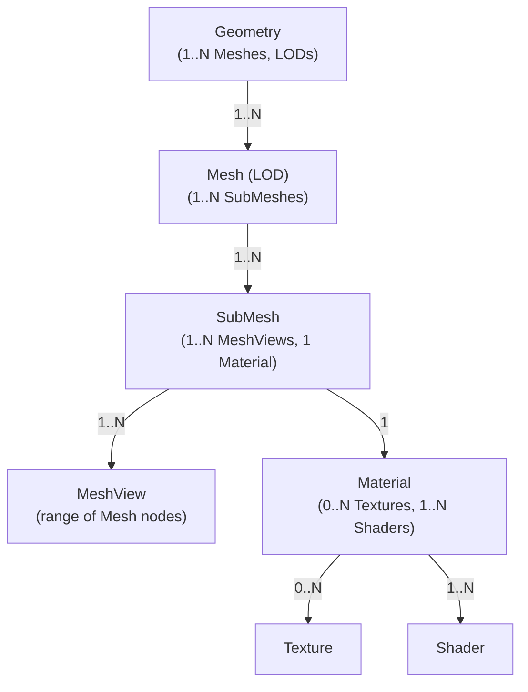

# Asset Entity Relationships: Summary and Diagram

> For implementation status see `implementation_plan.md#current-status-summary`. This file provides conceptual relationships & intra-PAK rules referenced by `chunking.md` and `deps_and_cache.md`.

## Fundamental Architecture Principle: Intra-PAK Dependencies

**🏗️ Core Design Rule**: All asset and resource dependencies are contained
within the same PAK file.

### What This Means

- **Assets** (Geometry, Material, Shader, etc.) can reference other **assets**
  and **resources** only within the same PAK file
- **Resources** (BufferResource, TextureResource) are PAK-file scoped -
  `ResourceIndexT` values are unique only within their PAK
- **No Cross-PAK References**: Assets in `level_forest.pak` cannot reference
  assets or resources in `base_game.pak`

### Why This Design

#### ✅ **Packaging & Distribution Benefits**

- Each PAK file is a **self-contained content unit** (levels, DLC, mods)
- Atomic content updates and versioning
- Clear boundaries for content creators and modders
- Independent content validation and integrity checking

#### ✅ **Performance & Memory Benefits**

- Related assets stored together → **better cache locality**
- Optimized PAK layout for streaming patterns
- Reduced file seeking across multiple PAKs
- **Clean PAK-level unloading** without dangling references

#### ✅ **Dependency Management Benefits**

- **Simple ResourceIndexT resolution** - no ambiguity about which PAK contains
  the resource
- Clear ownership model - each PAK owns its resources
- Simplified reference counting and lifecycle management
- **Unified AssetLoader design** - no complex cross-PAK dependency tracking

### Content Organization Pattern

```text
base_game.pak        ← Foundation: common engine resources, base materials
level_forest.pak     ← Self-contained: forest meshes, textures, sounds
level_city.pak       ← Self-contained: city meshes, textures, sounds
vehicles_dlc.pak     ← Self-contained: all vehicle-related resources
```

Each PAK represents a **logical content unit** where everything needed for that
content is included.

### Implementation Impact

- `ResourceIndexT` values are meaningful only within their originating PAK file
- AssetLoader resolves resources by searching the **same PAK** that loaded the
  requesting asset
- Reference counting and caching operate at PAK-file granularity
- Content can be loaded/unloaded as complete, independent units

---

## Relationship Summary Table

| From      | To        | Cardinality | Notes                                                                 |
|-----------|-----------|-------------|-----------------------------------------------------------------------|
| Geometry  | Mesh      | 1 : N       | 🌳 Geometry is the root structure; it maps to multiple Meshes for LODs. |
| Mesh      | SubMesh   | 1 : N       | 🧩 A Mesh is subdivided into SubMeshes — logical partitions for rendering. |
| SubMesh   | MeshView  | 1 : N       | 📏 A SubMesh groups one or more contiguous MeshViews (range slices of the Mesh), all renddered with the same material. |
| SubMesh   | Material  | 1 : 1       | 🎚️ Each SubMesh is rendered with a single Material instance.         |
| Material  | Texture   | 0 : N       | 🖼️ A Material can have zero or more Textures (e.g., color maps, normal maps). |
| Material  | Shader    | 1 : N       | 🧠 A Material can reference multiple Shaders, at most one per stage (see ShaderStageFlags). |

## Entity Dependency Flowchart


