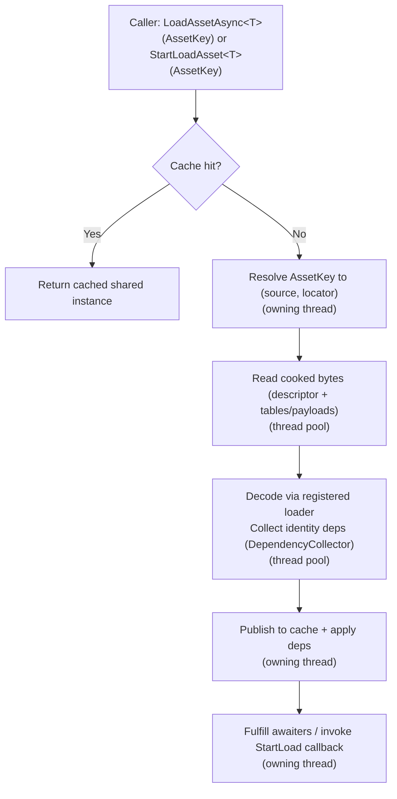
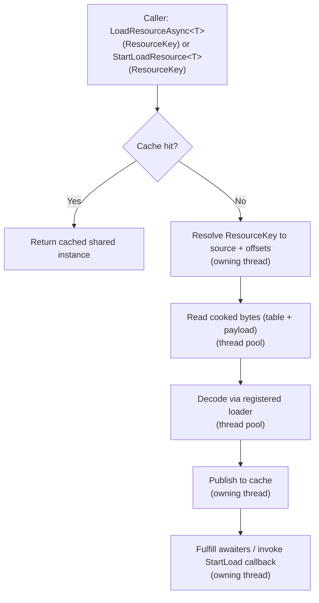
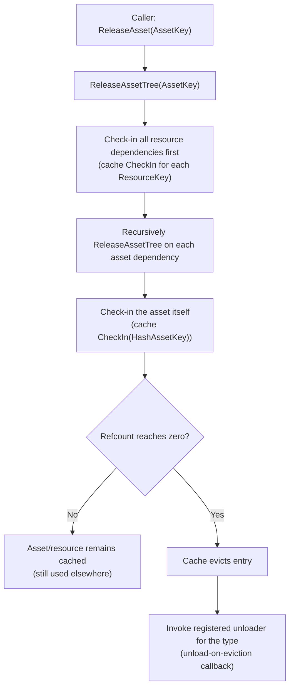
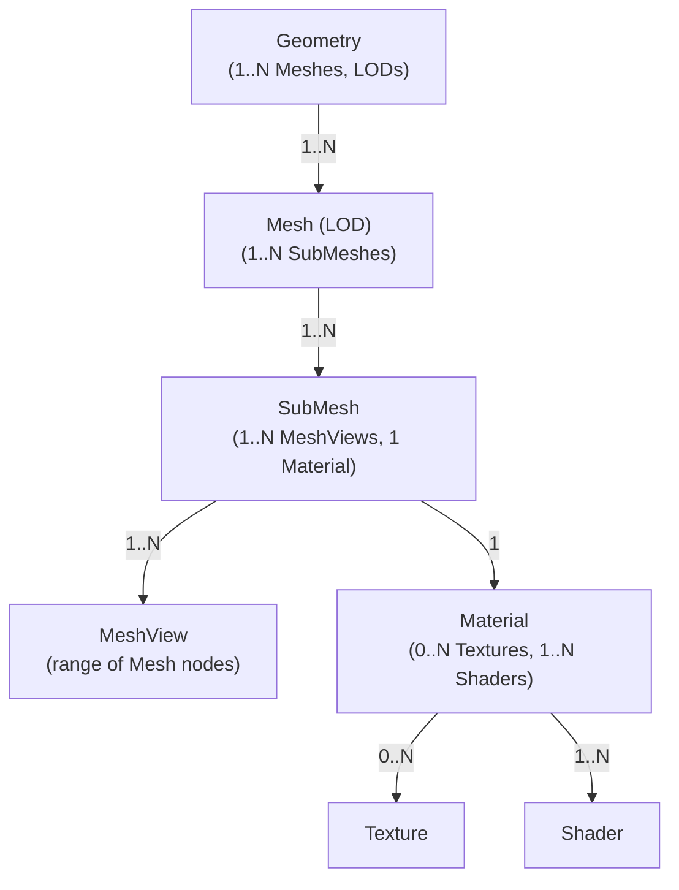

# Oxygen Content module overview (source of truth)

This document is the **single source of truth** for the *conceptual model* and
*module boundaries* of the Oxygen Content subsystem.

- Async loader architecture (design, invariants): `truly-async-asset-loader.md`
- Loose cooked (filesystem-backed cooked sources, PIE requirements): `loose_cooked_content.md`
- Implementation status / roadmap: `implementation_plan.md`
- PAK format details (layout, alignment): `chunking.md`
- Dependency + cache mechanics (forward-only model): `deps_and_cache.md`
- Tooling and diagnostics: `tooling_and_diagnostics.md`
- GPU uploads: Renderer-owned (`src/Oxygen/Renderer/Upload/README.md`)

If another document disagrees with this overview, treat this file as
authoritative and update the other doc.

---

## Purpose and responsibilities

The Content subsystem provides **read-only access to packaged game content**
stored in cooked containers (primarily `.pak` files, and optionally loose cooked
roots for editor iteration) and turns that packaged data into **CPU-decoded**
assets and resources.

In practice, it owns:

- Mounting cooked sources (`.pak` containers and loose cooked roots)
- Container-agnostic cooked byte access (descriptors, resource tables, resource payload streams)
- Typed asset/resource decoding via registered loader functions
- Engine-wide caching + reference counting
- Dependency tracking (asset→asset and asset→resource)
- Deterministic release/unload behavior (based on reference counts)

### Explicit non-goals

Content does **not**:

- Submit GPU uploads, track GPU residency, or manage GPU memory budgets
- Resolve cross-source references (it is forbidden by design)
- Interpret editor virtual paths (resolution happens above Content)

GPU staging/submission is handled by the Renderer Upload subsystem.

---

## Core invariants (do not violate)

### 1) Intra-source dependencies only

**Core rule:** all asset and resource dependencies must be contained within the
same mounted cooked source (a `.pak` file or a loose cooked root).

What this means:

- Assets (Geometry, Material, …) may reference other assets/resources **only
  inside the same mounted source**
- Resource indices (`ResourceIndexT`) are source-scoped; index values are only
  meaningful within their originating source
- No cross-source references: an asset in `level_forest.pak` cannot reference an
  asset/resource in `base_game.pak`, and content from a loose cooked root cannot
  reference content in a different root or PAK

Why we enforce it:

- Packaging: each PAK is a self-contained unit (levels, DLC, mods)
- Runtime: improves locality, reduces seeking, and enables clean PAK-level
  unload
- Simplifies lifecycle: dependency tracking and cache accounting do not need to
  span multiple sources

### 2) Clear CPU vs GPU boundary

Content reaches a terminal state of **DecodedCPUReady**.

Any GPU work (staging buffers, copy commands, fences, resource state
transitions) belongs to the Renderer and is already implemented in the Upload
module.

---

## Mental model: assets, resources, embedded descriptors

- **Asset**: a first-class, keyed descriptor that can be loaded by
  `data::AssetKey` (e.g., GeometryAsset, MaterialAsset).
- **Resource**: a typed data blob referenced by index within a PAK resource
  table (e.g., BufferResource, TextureResource).
- **Embedded descriptors**: structures that exist *inside* an asset descriptor
  and are not independently loadable (e.g., Mesh/SubMesh/MeshView metadata).

Rule of thumb:

- Assets model structure and references.
- Resources model bulk bytes (buffer/texture payloads).

---

## Content sources and identity (important)

The runtime loader operates on **cooked sources**. A source is any mounted
provider of cooked bytes (for example, a `.pak` container or a loose cooked
directory).

### Sources and resolution order

- `AssetLoader` mounts sources via `AddPakFile(...)` and `AddLooseCookedRoot(...)`.
- Asset discovery is `AssetKey`-based and **first-match-wins** in deterministic
  registration order.
- The editor is responsible for registering sources in a deterministic order
  for Play-in-Editor workflows.

### `AssetKey` vs `ResourceKey`

- `data::AssetKey` is a stable, engine-wide identifier for assets.
- `ResourceKey` is an engine-wide identifier for resources, but it *encodes* a
  16-bit source id and a source-scoped resource index.

#### Source id policy (contract)

`ResourceKey` includes a 16-bit source id. Source ids are segregated by source
type:

- PAK ids: dense `0..N-1` in PAK registration order.
- Loose cooked ids: start at `0x8000` in loose-cooked registration order.
- `0xFFFF` is reserved for synthetic/buffer-backed sources.

These constants are centralized in `Oxygen/Content/Constants.h`.

---

## Editor integration: virtual paths are resolved above Content

Scenes and editor UX typically address assets by **virtual path** (for example,
`/Content/Materials/DarkWood.mat`). Content does not interpret virtual paths.

Instead, editor/tooling resolves:

1. `VirtualPath -> data::AssetKey` (using cooked indexes)
2. `AssetLoader` loads by `data::AssetKey` and consumes cooked bytes from the
   mounted sources

The helper responsible for the first step is `VirtualPathResolver`:

- Uses mounted cooked indexes (`container.index.bin`) for loose cooked roots.
- Can use PAK browse indexes when present.
- Resolves **first-match-wins** and logs a warning when the same virtual path
  maps to different `AssetKey`s across mounts.

## Key types and where they fit

This is the conceptual role of the core types (names match the code).

- `PakFile`
  - Read-only view of one `.pak`: header/footer, asset directory lookup,
    resource tables, and separate readers for data regions.
- `internal::IContentSource`
  - Internal abstraction representing a mounted cooked source.
  - Implemented by at least PAK-backed and loose-cooked-backed source adapters.
- `AssetLoader`
  - Orchestrates async loading from mounted sources + caching.
  - Applies dependency edges during an owning-thread publish step.
  - Provides deterministic release/unload cascades.
- `LoaderContext`
  - Passed by value into every loader.
  - Provides `desc_reader` (descriptor stream) and `data_readers` (data region
    readers) plus `source_token`, `offline` policy, and an optional
    `DependencyCollector` for identity-only dependency recording.
- `ResourceTable<T>`
  - Lightweight offset resolver: maps a PAK resource index to the descriptor
    offset.
- `ResourceKey`
  - Engine-wide cache key for a resource. Constructed from
    (sourceId, resourceTypeIndex, resourceIndex), so resources remain unique
    even though their indices are source-scoped.

---

## Lifecycle flows (what actually happens)

### Loading an asset

### Loading a resource

### Releasing and unloading

---

## Entity relationships (conceptual)

---

## Relationship Summary Table

| From | To | Cardinality | Notes |
| ---- | -- | ----------- | ----- |
| Geometry | Mesh | 1 : N | 🌳 Geometry is the root structure; it maps to multiple Meshes for LODs. |
| Mesh | SubMesh | 1 : N | 🧩 A Mesh is subdivided into SubMeshes — logical partitions for rendering. |
| SubMesh | MeshView | 1 : N | 📏 A SubMesh groups one or more contiguous MeshViews (range slices of the Mesh), all rendered with the same material. |
| SubMesh | Material | 1 : 1 | 🎚️ Each SubMesh is rendered with a single Material instance. |
| Material | Texture | 0 : N | 🖼️ A Material can have zero or more Textures (e.g., color maps, normal maps). |
| Material | Shader | 1 : N | 🧠 A Material can reference multiple Shaders, at most one per stage (see ShaderStageFlags). |

## Entity Dependency Flowchart

---

## Where to look next

- If you need the **file format**: `chunking.md`
- If you need **loose cooked / PIE requirements**: `loose_cooked_content.md`
- If you need **cache/dependency rules**: `deps_and_cache.md`
- If you need **async loader architecture**: `truly-async-asset-loader.md`
- If you need the **roadmap**: `implementation_plan.md`
- If you need **tooling / diagnostics**: `tooling_and_diagnostics.md`
- If you need **GPU copy submission**: `src/Oxygen/Renderer/Upload/README.md`
