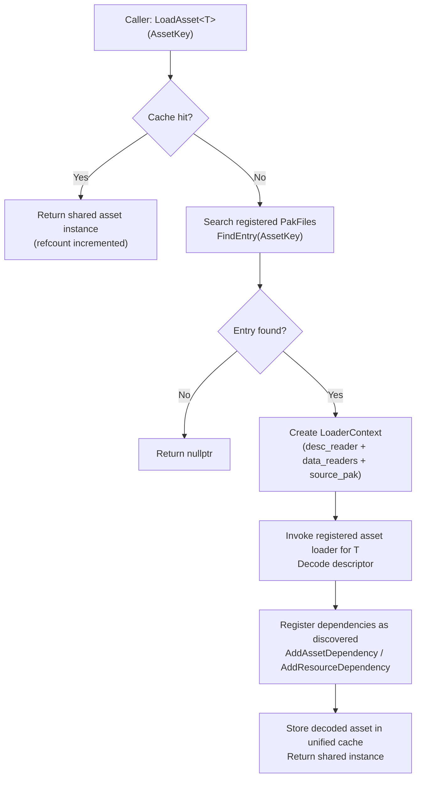
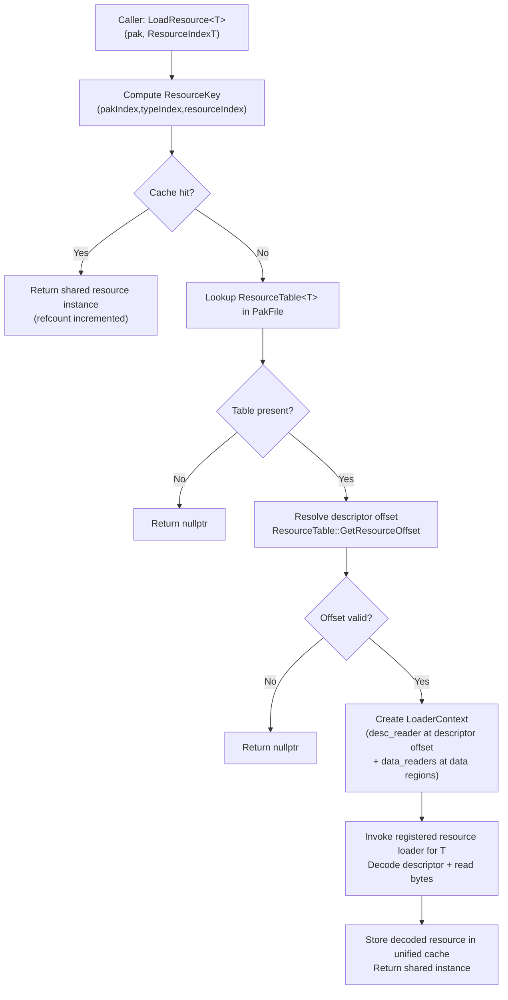
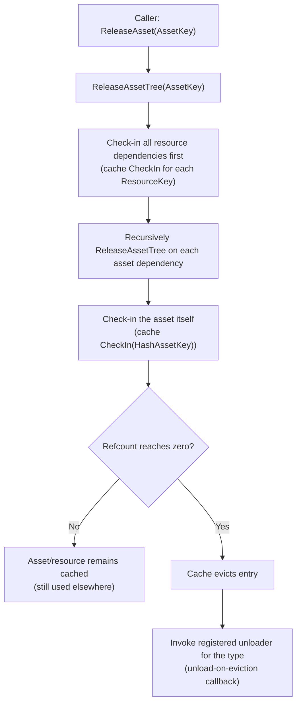
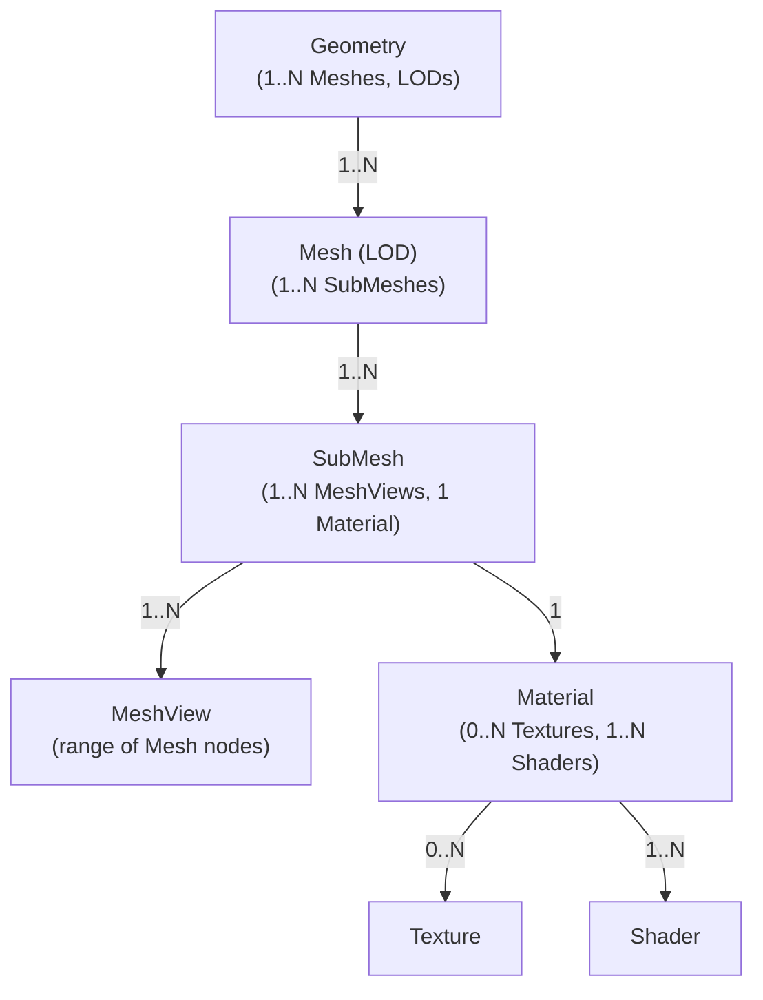

# Oxygen Content module overview (source of truth)

This document is the **single source of truth** for the *conceptual model* and
*module boundaries* of the Oxygen Content subsystem.

- Implementation status / roadmap: `implementation_plan.md`
- PAK format details (layout, alignment): `chunking.md`
- Dependency + cache mechanics (forward-only model): `deps_and_cache.md`
- GPU uploads: Renderer-owned (`src/Oxygen/Renderer/Upload/README.md`)

If another document disagrees with this overview, treat this file as
authoritative and update the other doc.

---

## Purpose and responsibilities

The Content subsystem provides **read-only access to packaged game content**
stored in `.pak` files and turns that packaged data into **CPU-decoded** assets
and resources.

In practice, it owns:

- `.pak` container reading (directory, descriptor tables, data regions)
- Typed asset/resource decoding via registered loader functions
- Engine-wide caching + reference counting
- Dependency tracking (asset→asset and asset→resource)
- Deterministic release/unload behavior (based on reference counts)

### Explicit non-goals

Content does **not**:

- Submit GPU uploads, track GPU residency, or manage GPU memory budgets
- Resolve cross-PAK references (it is forbidden by design)

GPU staging/submission is handled by the Renderer Upload subsystem.

---

## Core invariants (do not violate)

### 1) Intra-PAK dependencies only

**Core rule:** all asset and resource dependencies must be contained within the
same `.pak` file.

What this means:

- Assets (Geometry, Material, …) may reference other assets/resources **only
  inside the same PAK**
- Resource indices (`ResourceIndexT`) are **PAK-scoped**; index values are only
  meaningful within their originating PAK
- No cross-PAK references: an asset in `level_forest.pak` cannot reference an
  asset/resource in `base_game.pak`

Why we enforce it:

- Packaging: each PAK is a self-contained unit (levels, DLC, mods)
- Runtime: improves locality, reduces seeking, and enables clean PAK-level
  unload
- Simplifies lifecycle: dependency tracking and cache accounting do not need to
  span multiple PAKs

### 2) Clear CPU vs GPU boundary

Content reaches a terminal state of **DecodedCPUReady**.

Any GPU work (staging buffers, copy commands, fences, resource state
transitions) belongs to the Renderer and is already implemented in the Upload
module.

---

## Mental model: assets, resources, embedded descriptors

- **Asset**: a first-class, keyed descriptor that can be loaded by
  `data::AssetKey` (e.g., GeometryAsset, MaterialAsset).
- **Resource**: a typed data blob referenced by index within a PAK resource
  table (e.g., BufferResource, TextureResource).
- **Embedded descriptors**: structures that exist *inside* an asset descriptor
  and are not independently loadable (e.g., Mesh/SubMesh/MeshView metadata).

Rule of thumb:

- Assets model structure and references.
- Resources model bulk bytes (buffer/texture payloads).

---

## Key types and where they fit

This is the conceptual role of the core types (names match the code).

- `PakFile`
  - Read-only view of one `.pak`: header/footer, asset directory lookup,
    resource tables, and separate readers for data regions.
- `AssetLoader`
  - Orchestrates loading from PAKs + caching.
  - Provides dependency registration and release/unload cascades.
- `LoaderContext`
  - Passed by value into every loader.
  - Provides `desc_reader` (descriptor stream) and `data_readers` (data region
    readers) plus `source_pak`, `offline`, and dependency registration hooks.
- `ResourceTable<T>`
  - Lightweight offset resolver: maps a PAK resource index to the descriptor
    offset.
- `ResourceKey`
  - Engine-wide cache key for a resource. Constructed from
    (pakIndex, resourceTypeIndex, resourceIndex), so resources remain unique
    even though their indices are PAK-scoped.

---

## Lifecycle flows (what actually happens)

### Loading an asset



### Loading a resource



### Releasing and unloading



---

## Entity relationships (conceptual)

## Fundamental Architecture Principle: Intra-PAK Dependencies

**🏗️ Core Design Rule**: All asset and resource dependencies are contained
within the same PAK file.

### What This Means

- **Assets** (Geometry, Material, Shader, etc.) can reference other **assets**
  and **resources** only within the same PAK file
- **Resources** (BufferResource, TextureResource) are PAK-file scoped -
  `ResourceIndexT` values are unique only within their PAK
- **No Cross-PAK References**: Assets in `level_forest.pak` cannot reference
  assets or resources in `base_game.pak`

### Why This Design

#### ✅ **Packaging & Distribution Benefits**

- Each PAK file is a **self-contained content unit** (levels, DLC, mods)
- Atomic content updates and versioning
- Clear boundaries for content creators and modders
- Independent content validation and integrity checking

#### ✅ **Performance & Memory Benefits**

- Related assets stored together → **better cache locality**
- Optimized PAK layout for streaming patterns
- Reduced file seeking across multiple PAKs
- **Clean PAK-level unloading** without dangling references

#### ✅ **Dependency Management Benefits**

- **Simple ResourceIndexT resolution** - no ambiguity about which PAK contains
  the resource
- Clear ownership model - each PAK owns its resources
- Simplified reference counting and lifecycle management
- **Unified AssetLoader design** - no complex cross-PAK dependency tracking

### Content Organization Pattern

```text
base_game.pak        ← Foundation: common engine resources, base materials
level_forest.pak     ← Self-contained: forest meshes, textures, sounds
level_city.pak       ← Self-contained: city meshes, textures, sounds
vehicles_dlc.pak     ← Self-contained: all vehicle-related resources
```

Each PAK represents a **logical content unit** where everything needed for that
content is included.

### Implementation Impact

- `ResourceIndexT` values are meaningful only within their originating PAK file
- AssetLoader resolves resources by searching the **same PAK** that loaded the
  requesting asset
- Reference counting and caching operate at PAK-file granularity
- Content can be loaded/unloaded as complete, independent units

---

## Relationship Summary Table

| From | To | Cardinality | Notes |
| ---- | -- | ----------- | ----- |
| Geometry | Mesh | 1 : N | 🌳 Geometry is the root structure; it maps to multiple Meshes for LODs. |
| Mesh | SubMesh | 1 : N | 🧩 A Mesh is subdivided into SubMeshes — logical partitions for rendering. |
| SubMesh | MeshView | 1 : N | 📏 A SubMesh groups one or more contiguous MeshViews (range slices of the Mesh), all rendered with the same material. |
| SubMesh | Material | 1 : 1 | 🎚️ Each SubMesh is rendered with a single Material instance. |
| Material | Texture | 0 : N | 🖼️ A Material can have zero or more Textures (e.g., color maps, normal maps). |
| Material | Shader | 1 : N | 🧠 A Material can reference multiple Shaders, at most one per stage (see ShaderStageFlags). |

## Entity Dependency Flowchart



---

## Where to look next

- If you need the **file format**: `chunking.md`
- If you need **cache/dependency rules**: `deps_and_cache.md`
- If you need the **roadmap**: `implementation_plan.md`
- If you need **GPU copy submission**: `src/Oxygen/Renderer/Upload/README.md`
