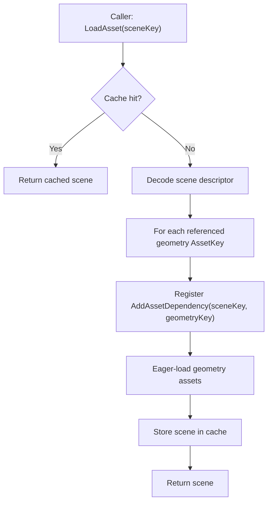

# Scenes and levels (maps) in Oxygen Content

This document specifies a minimal **Scene/Level** asset for Oxygen.

It documents the current **Scene/Level** asset and the remaining work to make
scene authoring and editor workflows first-class.

Related:

- Roadmap: `implementation_plan.md`
- Loose cooked mode: `loose_cooked_content.md`
- Content boundaries: `overview.md`

---

## Problem statement

Oxygen needs an editor-facing “Map/Level” concept equivalent to:

- Unreal: Map/World
- Unity: Scene
- Godot: Scene

Oxygen has a cooked `SceneAsset` format and a runtime loader.

The remaining gap is primarily tooling/editor-facing: authoring, validation,
iteration workflows (including loose cooked), and higher-level editor concepts
around maps/levels.

---

## Goals

- Define a **Scene/Level asset** that references existing assets using
  `data::AssetKey`.
- Provide a **cooked binary descriptor** format that is fast to load and stable
  for tooling.
- Establish clear invariants that preserve Content’s dependency model.

## Non-goals

- Full gameplay entity/component system.
- Streaming/residency policies.
- GPU upload logic.
- Complex authoring formats. The cooked format is the source of truth for
  runtime; authoring format is a tooling concern.

---

## Core invariants

1. **Intra-container references only**: A level references assets/resources only within the same container.

2. **Content loads to DecodedCPUReady**: Scene loading produces a CPU-side representation. Renderer performs GPU
materialization.

3. **Deterministic dependency registration**: Loading a scene must register dependencies so that:

- Geometry assets are kept alive while the scene is alive.
- Geometry/material/texture dependencies continue to be registered by the
    existing loaders (scene should not duplicate those edges).

---

## Conceptual data model

A Scene/Level is a hierarchical scene graph descriptor that the loader can use
to reconstruct an `oxygen::scene::Scene` consisting of named nodes with local
transforms.

Phase 1.5 is intentionally minimal: it captures only what is required to
instantiate nodes and bind renderable geometry.

### Required data (Phase 1.5)

- `Node`
  - stable id: GUID (`data::AssetKey`)
  - name: string (for debugging, editor UI, and parity with the runtime scene
    node model)
  - hierarchy: parent/child relationship (required)
  - local transform (TRS)

- `Renderable` (optional per node)
  - `data::AssetKey geometry`

Material assignment is intentionally *not* part of the base scene format.
Geometry assets already encode their default per-submesh materials, and the
content pipeline can register geometry → material → texture dependencies.

### Optional data (future)

- explicit material overrides (per node / per submesh)
- `Light` (directional/point)
- `Camera` (editor-only)
- instancing/prefabs

---

## File format (cooked)

The cooked format is compact, versioned, and endian-stable.

### Current layout (v1)

The authoritative layout is defined in `Oxygen/Data/PakFormat.h`.

- Base descriptor (fixed-size)
  - `pak::SceneAssetDesc` (256 bytes)
  - includes `pak::AssetHeader` as the first field
  - contains table descriptors for nodes and the scene string table
  - contains an optional component-table directory (`SceneComponentTableDesc[]`)

- Node table (packed AoS)
  - `pak::NodeRecord` (one per node)
  - `data::AssetKey node_id` (stable GUID)
  - `u32 parent_index` (root uses `parent_index == self_index`)
  - `u32 node_flags`
  - local transform:
    - translation: 3 × f32
    - rotation: 4 × f32 (unit quaternion, XYZW)
    - scale: 3 × f32
  - `u32 scene_name_offset` (byte offset into the scene string table)

- Component tables (optional)
  - component-table directory entries are `pak::SceneComponentTableDesc`
  - currently supported (when present): `pak::RenderableRecord` (geometry key
    per node index)

- Scene string table (packed UTF-8, NUL-terminated)
  - referenced by `scene_name_offset`
  - packed to actual string sizes (no fixed per-node string allocation)
  - first byte is `\0` so `scene_name_offset == 0` means empty string

Design notes:

- Keep the cooked format *just* sufficient to reconstruct the runtime scene
  graph and register dependencies.
- Prefer indices over pointers; prefer offsets over in-place variable-length
  fields.
- Scene indices have no sentinel values by contract. Any out-of-range index is
  a decode error.
- Endianness: little-endian, consistent with other cooked formats in Oxygen.

---

## Loader behavior and dependency registration

The scene loader must:

1. Decode the scene descriptor into a CPU-side scene description.
2. Register dependencies for every referenced geometry key:

   - For each renderable `geometry_key`:
     - call `AddAssetDependency(scene_key, geometry_key)`

3. Eager-load geometry assets (Phase 1.5 decision): once dependencies are
   registered, request/load all referenced geometry assets.

Geometry loading is responsible for registering its own downstream dependencies
(e.g. geometry → materials, materials → textures). The scene should not
duplicate those edges unless/ until explicit scene-level material overrides are
introduced.

### Load flow

### Release flow

Scene release uses existing `ReleaseAssetTree` behavior:

- Scene checked in.
- Its dependencies are checked in recursively.
- Eviction invokes unloaders.

---

## Toolchain (Phase 1.5)

Two workflows are expected:

- **PAK-based cooking**: a tool (PakGen) can produce cooked `SceneAsset`
  descriptors inside a `.pak`.
- **Loose cooked iteration**: the same cooked descriptors can be emitted into a
  loose cooked root (with `container.index.bin`) for fast iteration.

The runtime `AssetLoader` supports loading scenes from both PAK files and loose
cooked roots; tooling determines how those artifacts are produced.

---

## Editor integration considerations

- Node ids must be stable across saves to support selection and gizmos.
- Referenced AssetKeys must be stable across cooks.
- Scene changes should be hot-reloadable (see `hot_reload.md`).

---

## Testing strategy

- Unit test: scene decoder rejects malformed headers.
- Unit test: dependency registration count equals number of referenced geometry
  assets.
- Integration test: load scene + render a geometry/material pair from loose cooked.

---

## Industry references (informative)

These references motivate the minimal v1 choices (hierarchy + local TRS + named
nodes) without implying that Oxygen must adopt any particular external runtime
model.

- glTF 2.0: nodes define hierarchy relations and local transforms (TRS or
  matrix); scenes list root nodes: <https://registry.khronos.org/glTF/specs/2.0/glTF-2.0.html>
- Unity: `Transform` forms a parent/child hierarchy and local transforms are
  relative to the parent: <https://docs.unity3d.com/Manual/class-Transform.html>
- Godot: nodes form a tree; a “scene” is a tree of nodes:
  <https://docs.godotengine.org/en/stable/classes/class_node.html>

---

## Open questions

- Should we support instancing or prefabs at the scene level? Not required for
  Phase 1.5.
