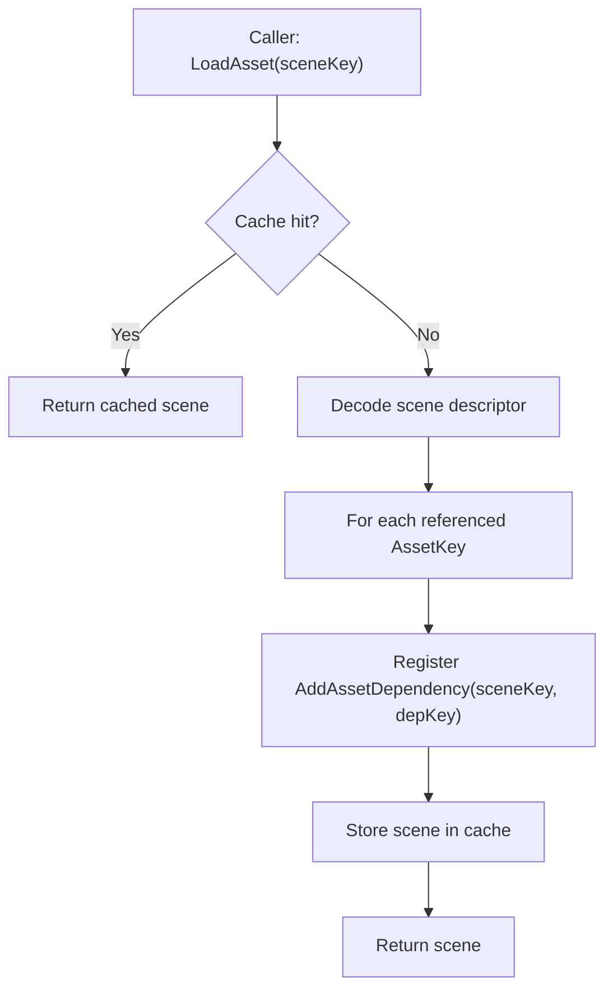

# Scenes and levels (maps) in Oxygen Content

This document specifies a minimal **Scene/Level** asset for Oxygen.

It addresses the current gap: the engine can load geometry/materials/textures,
but lacks a first-class, serializable “map/level” that composes them.

Related:

- Roadmap: `implementation_plan.md`
- Loose cooked mode: `loose_cooked_content.md`
- Content boundaries: `overview.md`

---

## Problem statement

Oxygen needs an editor-facing “Map/Level” concept equivalent to:

- Unreal: Map/World
- Unity: Scene
- Godot: Scene

Today there is no SceneAsset format, loader, or toolchain, which prevents
authoring and rendering real scenes in the editor.

---

## Goals

- Define a **Scene/Level asset** that references existing assets using
  `data::AssetKey`.
- Provide a **cooked binary descriptor** format that is fast to load and stable
  for tooling.
- Establish clear invariants that preserve Content’s dependency model.

## Non-goals

- Full gameplay entity/component system.
- Streaming/residency policies.
- GPU upload logic.
- Complex authoring formats. The cooked format is the source of truth for
  runtime; authoring format is a tooling concern.

---

## Core invariants

1. **Intra-container references only**

A level references assets/resources only within the same container.

2. **Content loads to DecodedCPUReady**

Scene loading produces a CPU-side representation. Renderer performs GPU
materialization.

3. **Deterministic dependency registration**

Loading a scene must register dependencies so that:

- GeometryAssets and MaterialAssets are kept alive while the scene is alive.
- Materials keep texture resources alive via existing loader dependency
  registration.

---

## Conceptual data model

A Scene/Level is defined as:

- A list of entities (stable ids within the scene).
- A transform for each entity.
- A minimal render component that binds geometry+material.

### Required components (Phase 1.5)

- `Transform`
  - position (float3)
  - rotation (quaternion)
  - scale (float3)

- `MeshRenderer`
  - `data::AssetKey geometry`
  - `data::AssetKey material`

### Optional components (future)

- `Light` (directional/point)
- `Camera` (editor-only)
- `Name` (for editor UI)
- `Hierarchy` (parent/child)

---

## File format (cooked)

The cooked format should be compact, versioned, and endian-stable.

### Suggested layout

- Header
  - magic (`OXSCENE\0`)
  - version (u16)
  - counts (u32): entities, transforms, meshRenderers

- Entity table
  - `EntityId` (u64) per entity

- Transform table
  - `EntityId`
  - position/rotation/scale

- MeshRenderer table
  - `EntityId`
  - `geometry_key` (AssetKey bytes)
  - `material_key` (AssetKey bytes)

Design notes:

- Use SoA tables for fast scanning.
- Include an optional string table only if needed for names.

---

## Loader behavior and dependency registration

The scene loader must:

1. Decode the scene descriptor into a `SceneLevelAsset` CPU object.
2. Register dependencies for every referenced asset key:

   - For each `MeshRenderer.geometry_key`:
     - call `AddAssetDependency(scene_key, geometry_key)`
   - For each `MeshRenderer.material_key`:
     - call `AddAssetDependency(scene_key, material_key)`

This ensures that keeping the scene alive keeps its referenced assets alive.

### Load flow

### Release flow

Scene release uses existing `ReleaseAssetTree` behavior:

- Scene checked in.
- Its dependencies are checked in recursively.
- Eviction invokes unloaders.

---

## Toolchain (Phase 1.5)

We need a minimal toolchain that can produce the cooked scene file as a loose
cooked artifact.

Minimum pipeline:

- Authoring format: a simple human-readable format (JSON/YAML) or editor-native
  representation.
- Cooker:
  - validates AssetKey references exist in the container
  - writes cooked binary scene descriptor
  - updates the container manifest (AssetKey → scene descriptor file)

This is intentionally separate from runtime Content.

---

## Editor integration considerations

- Entity ids must be stable across saves to support selection and gizmos.
- Referenced AssetKeys must be stable across cooks.
- Scene changes should be hot-reloadable (see `hot_reload.md`).

---

## Testing strategy

- Unit test: scene decoder rejects malformed headers.
- Unit test: dependency registration count equals number of referenced assets.
- Integration test: load scene + render a geometry/material pair from loose cooked.

---

## Open questions

- Should the first version include hierarchy? For a level editor, hierarchy is
  often needed early; however it can be introduced as an optional table.
- Should we support instancing or prefabs at the scene level? Not required for
  Phase 1.5.
