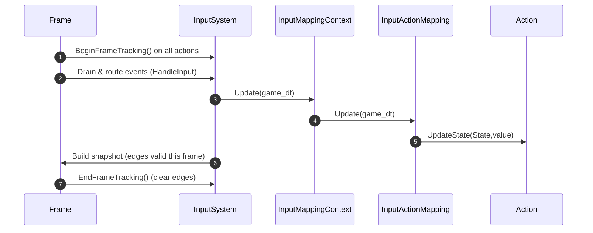
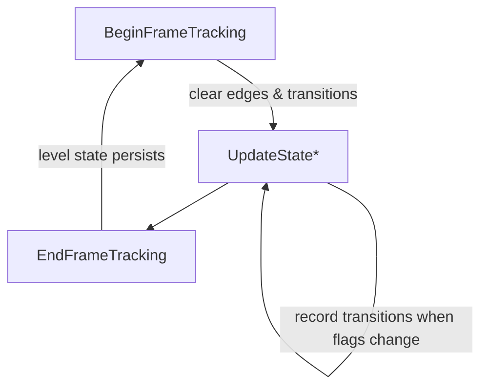
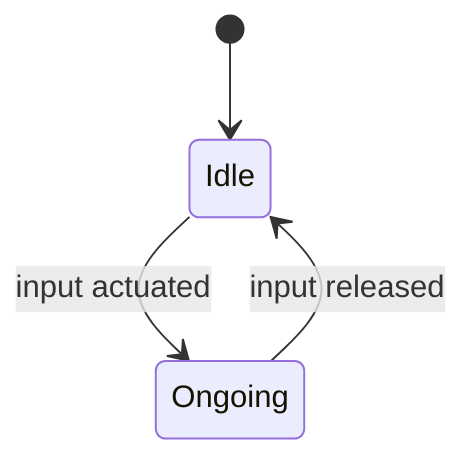
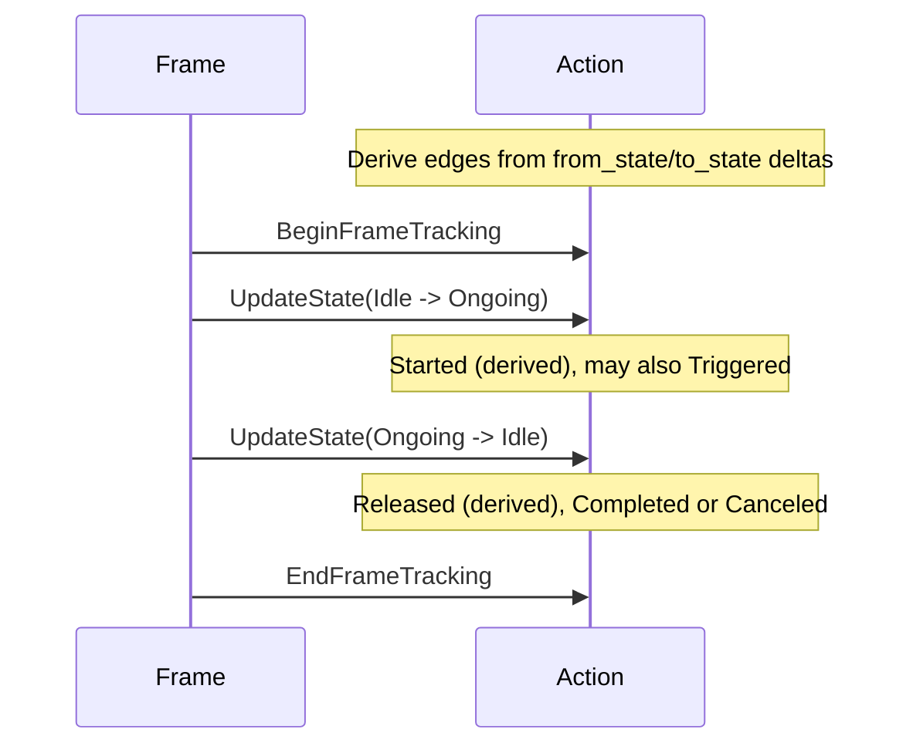

# Actions

An Action represents a high-level input concept (e.g., Jump, Fire) with a
persistent level state and per-frame edges. It integrates with triggers and
mappings to track when an input is held, pressed, released, or otherwise
transitions state during a frame.

## Core concepts

- Level state (persistent across frames):
  - `ongoing` — the action is currently held/active.
  - `value` — the last-known ActionValue (bool/axis), persists across frames.
- Edge events (per-frame only):
  - `Triggered` — emitted by triggers when conditions are met within the frame.
  - `Completed` — end of a successful action (one-shot semantics).
  - `Canceled` — action ended by release or interruption.
  - `Started` / `Released` — derived from transitions on `ongoing` bit:
    - `Started`: Idle → Ongoing
    - `Released`: Ongoing → Idle

## Time model and mapping interplay

- Timebase:
  - Action does not advance time on its own; it receives snapshots from
    mappings. Per-frame transitions are derived when the mapping updates the
    action via `UpdateState`.
  - Mappings are responsible for advancing time-based triggers using the
    `delta_time` parameter to their `Update` method.
  - Platform input event timestamps are not used by the mapping; only
    `delta_time` advances trigger timing.

- Frame flow (high level):



- Interplay:
  - Edges (Triggered/Completed/Canceled) are non-sticky and cleared at
    `BeginFrameTracking` for the next frame. Level state (`ongoing`, `value`)
    persists across frames.
  - The mapping decides what `State` to apply to the `Action` based on
    triggers and the current `ActionValue`.

## Invariants

- Edge flags are non-sticky and reset at BeginFrameTracking().
- Level state (`ongoing` and `value`) persists across frames.
- Transitions are recorded only within the current frame window.

### Transition timestamps

- Transitions are timestamped using a steady clock in the current
  implementation. A future improvement is to unify timestamps with the engine
  timebase for cross-subsystem consistency.

## Lifecycle



- BeginFrameTracking():
  - Clears per-frame edges and transitions.
  - Only `ongoing` persists across frames.
- UpdateState():
  - Applies incoming state/value and records transitions when flags change.
- EndFrameTracking():
  - No hard reset; level state persists.

## State machine (level state only)



## Edge derivation from transitions



## Contract

- Inputs: State snapshots (from mapping/trigger logic) and ActionValue.
- Output: Transitions and edge helpers restricted to current frame.
- Non-goals: Long-term history; transitions reset every frame.

## Typical usage

```cpp
Action jump{"Jump", ActionValueType::kBool};

// Frame start
jump.BeginFrameTracking();

// Input update wires in state/value
jump.UpdateState(Action::State{ .triggered = press_event, .ongoing = is_down },
                 ActionValue{ is_down });

// Query edges and level
if (jump.WasStartedThisFrame()) { /* play SFX */ }
if (jump.WasTriggeredThisFrame()) { /* apply impulse */ }
if (jump.IsOngoing()) { /* sustain charge */ }

// Frame end
jump.EndFrameTracking();
```

## Notes

- Use `Was*ThisFrame()` helpers for edge logic (Started/Released/Triggered/Completed/Canceled).
- `GetFrameTransitions()` provides full transition details (timestamps/values) for advanced logic like combos/chains.
- TODO: Unify transition timestamps with engine time (see TimeUtils.h) for consistent timing across subsystems.
