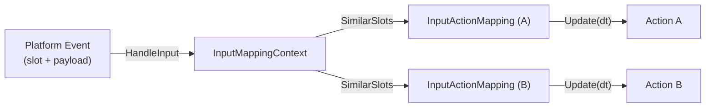

# Mappings & Mapping Contexts

This document explains how input events flow through mapping contexts and
individual mappings to update actions. It defines the contracts, invariants,
edge cases, and provides domain examples.

## Overview

- `InputMappingContext` routes platform input events (slots + payload) to one
  or more `InputActionMapping` instances.
- `InputActionMapping` translates the routed event into an `ActionValue` and
  evaluates a set of triggers to produce a single per-update `Action::State`
  snapshot for its associated `Action`.



## Time model

- `Update(delta_time)` is called once per frame per active context and mapping,
  passing the frame’s game delta.
- Time-based triggers (Hold, Pulse, Tap, Chain windows) advance using
  `delta_time`. Platform input event timestamps are not used by the mapping.
- Motion/Wheel values are non-sticky deltas; mappings clear them after the
  update.

## InputMappingContext

### Responsibilities

- Maintain an ordered list of mappings (priority = insertion order unless a
  higher-level system imposes a different order).
- Route events to mappings whose slots are “similar” to the event’s slot.
  - MouseXY → MouseX/MouseY/MouseXY based on dx/dy components.
  - MouseWheelXY → MouseWheelX/Y/Left/Right/Up/Down based on signs.
- Call `Update(dt)` on mappings and enforce consumption:
  - If a mapping’s `Update` returns true, stop updating later mappings and
    call `CancelInput()` on them.

### SimilarSlots rules (examples)

- Mouse Motion:
  - Event slot MouseXY with dx≠0 routes to MouseX; with dy≠0 routes to MouseY;
    always routes to MouseXY.
- Mouse Wheel:
  - MouseWheelXY routes to MouseWheelX if |dx|>0; to MouseWheelLeft if dx<0; to
    MouseWheelRight if dx>0; to MouseWheelY if |dy|>0; to MouseWheelUp if dy>0;
    to MouseWheelDown if dy<0.
- Otherwise: exact match.

### Consumption contract

- A mapping consumes input when its `Update` returns true. The context must:
  - Stop processing subsequent mappings in this update pass.
  - Call `CancelInput()` on later mappings so they snapshot a canceled edge.

### Invariants

- Routing is purely slot/value-driven; contexts do not inspect trigger logic.
- Consumption is strictly first-come (by order) within a single `Update` call.

## InputActionMapping

### Responsibilities

- Keep a reference to a specific `Action` and a bound input slot.
- On `HandleInput(event)`, translate the event payload into `ActionValue` in a
 slot-aware manner and stage an evaluation for the next `Update`.
- On `Update(dt)`, evaluate triggers and write a single snapshot to the
 `Action` using `Action::UpdateState`.

### Trigger aggregation rules

- If any explicit triggers exist on the mapping, at least one explicit must
  trigger on this update to allow firing.
- All implicit triggers must be satisfied. For non-chain implicits (Hold, Tap
  windows, etc.) this means Triggered in the same Update; Chain prerequisites
  may be satisfied by Triggered or Ongoing (armed prerequisite).
- Any blocker trigger suppresses output (mapping writes an idle snapshot).
- Evaluation remains active while any trigger is ongoing (implicit or explicit)
 but the action’s `ongoing` bit reflects explicit triggers only.

### ActionValue translation

- Keys/Mouse buttons → `bool` (pressed state true on kPressed, false on
 kReleased).
- Mouse Motion → `Axis1D` or `Axis2D` depending on bound slot:
  - MouseX → Axis1D{dx}
  - MouseY → Axis1D{dy}
  - MouseXY → Axis2D{dx,dy}
- Mouse Wheel → `Axis1D` or `Axis2D` depending on bound slot:
  - MouseWheelX/Left/Right → Axis1D{dx}
  - MouseWheelY/Up/Down → Axis1D{dy}
  - MouseWheelXY → Axis2D{dx,dy}
- After the `Update` that handled a motion/wheel event, values are cleared to
 zero with a type-correct reset.

### Consumption contract

- `Update` returns true only if all of the following hold:

 1) The mapping triggered this update, and
 2) This update was handling a fresh input event (followed a `HandleInput`),
 and
 3) The associated `Action` is configured to consume input
   (`SetConsumesInput(true)`).

### Cancel semantics

- `CancelInput()` reverts the staged value to the pre-event snapshot and marks
 the action as canceled for this evaluation.
- If any trigger reports canceled during `Update`, the mapping short-circuits
 to a canceled snapshot without overwriting it later.

### Invariants

- At most one `Action::UpdateState` call per mapping per `Update`.
- Mapping does not use platform event timestamps; only `delta_time` advances
  time-based triggers.
- Mapping does not preserve previous-frame edges. Per-frame edge visibility
  (Triggered/Completed/Canceled) is managed by the `Action` lifecycle
  (`BeginFrameTracking`/`EndFrameTracking`) and the InputSystem frame model.

## Edge cases

- Implicit-only mappings:
  - They trigger only when all implicits are satisfied. This can occur across
  multiple `Update` calls with no new events (e.g., Hold reaching threshold).

- Explicit + Implicit on separate updates:
  - If explicit triggers exist, implicits alone cannot cause the mapping to
  fire on a later update without a fresh explicit firing.

- Motion/Wheel deltas when 0:
  - If dx=0, MouseX mappings won’t receive an update when routed from MouseXY;
  same for dy=0 and MouseY.

## Example: FPS character

```cpp
// Look
auto look_x = std::make_shared<Action>("LookX", ActionValueType::kAxis1D);
auto map_look_x = std::make_shared<InputActionMapping>(look_x, InputSlots::MouseX);
map_look_x->AddTrigger(std::make_shared<ActionTriggerDown>())->MakeExplicit();

auto look_y = std::make_shared<Action>("LookY", ActionValueType::kAxis1D);
auto map_look_y = std::make_shared<InputActionMapping>(look_y, InputSlots::MouseY);
map_look_y->AddTrigger(std::make_shared<ActionTriggerDown>())->MakeExplicit();

// Jump: Pressed, consumes input
auto jump = std::make_shared<Action>("Jump", ActionValueType::kBool);
jump->SetConsumesInput(true);
auto map_jump = std::make_shared<InputActionMapping>(jump, InputSlots::Space);
auto pressed = std::make_shared<ActionTriggerPressed>();
pressed->MakeExplicit();
map_jump->AddTrigger(pressed);

// Sprint: requires Shift down (implicit) + W (explicit down)
auto shift = std::make_shared<Action>("Shift", ActionValueType::kBool);
auto map_shift = std::make_shared<InputActionMapping>(shift, InputSlots::LeftShift);
auto down = std::make_shared<ActionTriggerDown>(); down->MakeExplicit();
map_shift->AddTrigger(down);

auto sprint = std::make_shared<Action>("Sprint", ActionValueType::kBool);
auto map_sprint = std::make_shared<InputActionMapping>(sprint, InputSlots::W);
auto down_w = std::make_shared<ActionTriggerDown>(); down_w->MakeExplicit();
map_sprint->AddTrigger(down_w);
auto chain = std::make_shared<ActionTriggerChain>();
chain->SetLinkedAction(shift); chain->MakeImplicit();
map_sprint->AddTrigger(chain);

// Context wiring
InputMappingContext player_ctx("Player");
player_ctx.AddMapping(map_look_x);
player_ctx.AddMapping(map_look_y);
player_ctx.AddMapping(map_jump);
player_ctx.AddMapping(map_shift);
player_ctx.AddMapping(map_sprint);
```

Behavior:

- MouseXY events route to both look mappings as appropriate.
- Pressing Space triggers `Jump` and consumes the Space press, preventing a
 lower-priority Space mapping from also firing.
- Holding LeftShift arms the chain; pressing W now triggers `Sprint`.

## Validation checklist

- Do mapping tests cover:
  - Slot-aware value translation for Motion and Wheel?
  - Explicit/Implicit/Blocker aggregation and consumption?
  - Cancel semantics and non-sticky axis reset?

- Do context tests cover:
  - SimilarSlots routing for MouseXY and Wheel variants?
  - Consumption behavior (cancel later mappings)?
  - Implicit-only and chain combinations?
