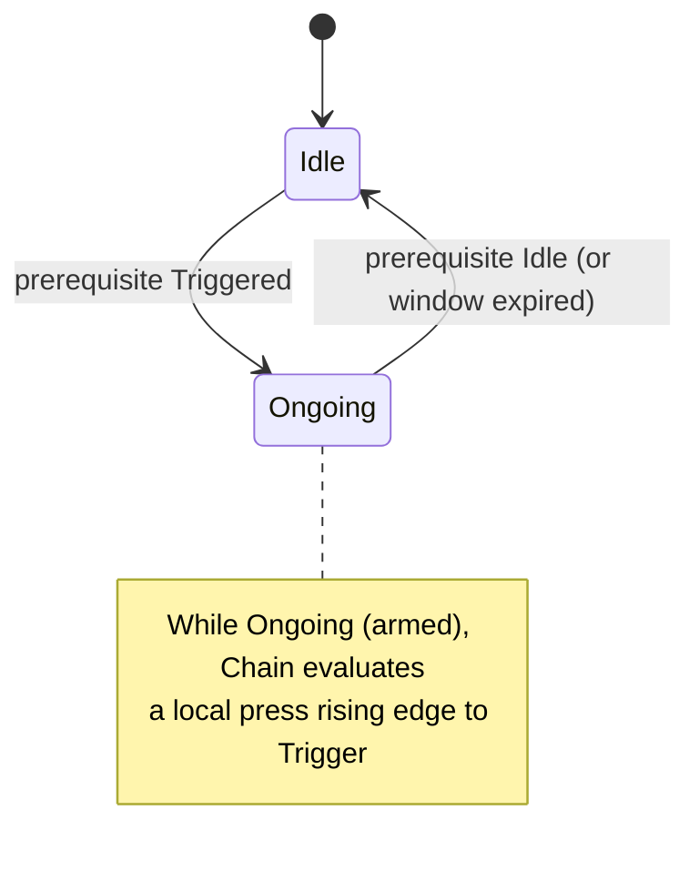
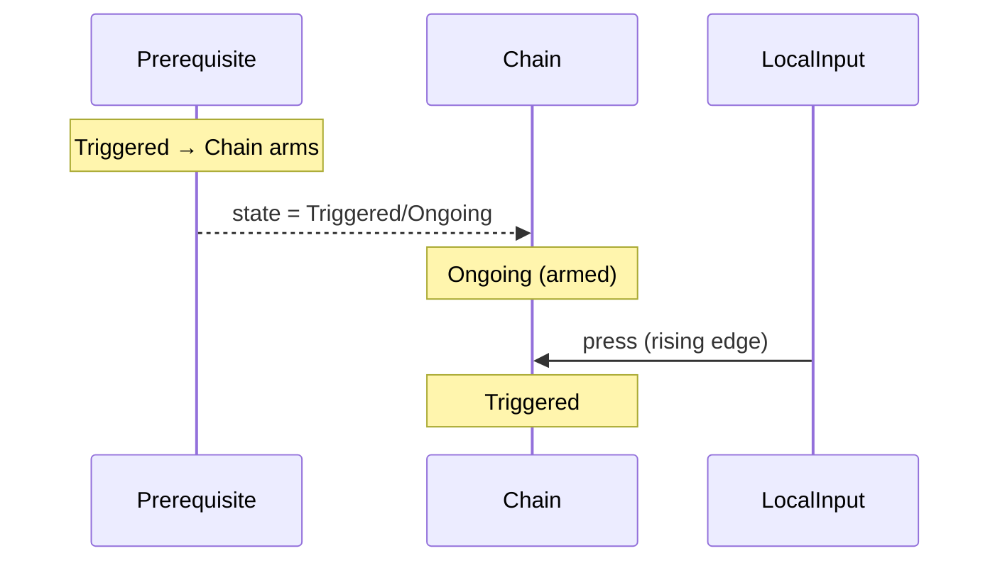
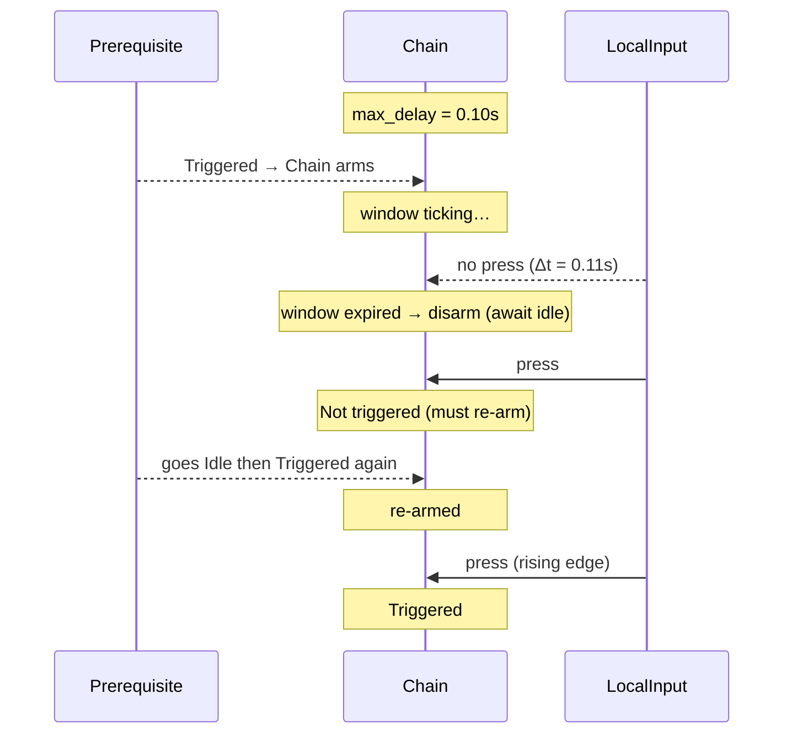
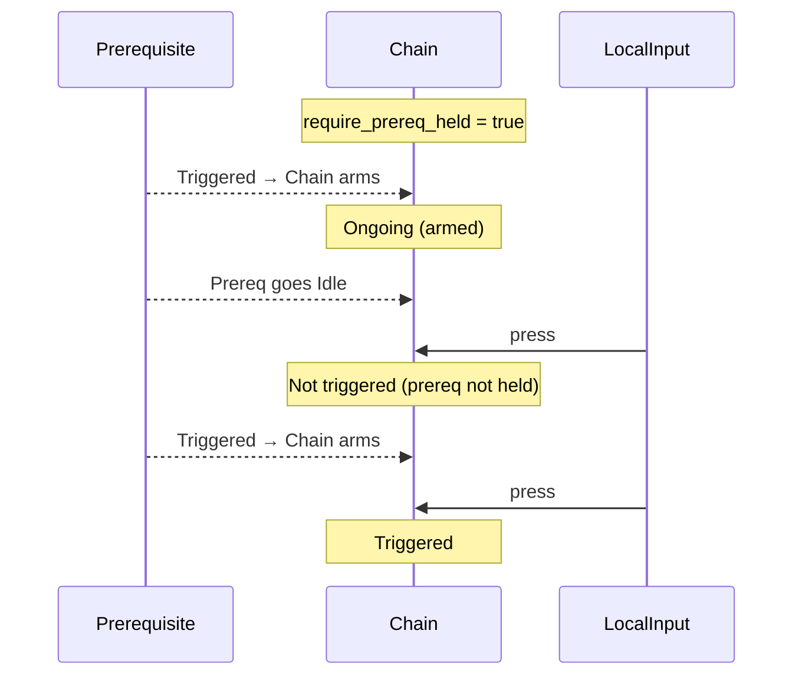

# Chain Trigger

The Chain trigger acts as a conditional gate that is armed by a prerequisite
Action. Once armed, it evaluates its own local condition (typically a press
rising edge) and fires if that condition happens within an optional time
window. It resets whenever the prerequisite goes Idle.

## Behavior summary

- Prerequisite: Chain monitors a linked Action (the prerequisite).
- Arming: Chain becomes armed only after the prerequisite Action has Triggered
  at least once. While prerequisite is Idle, Chain is Idle.
- Local condition: While armed, Chain fires on a rising edge of its own input
  value (press) that meets its actuation threshold. It does not auto-repeat
  while held.
- Max delay (optional): If enabled, the arm expires after the configured time
  window unless the local condition fires. When expired, Chain will not re-arm
  until the prerequisite returns to Idle and triggers again.
- Require held (optional): If enabled, the prerequisite must be Ongoing at the
  exact instant of the local press for Chain to fire.

Default configuration: no max delay window, prerequisite-held requirement
disabled.

## Lifecycle and states



## Timeline examples

### Basic gating (arm then local press)



### Max delay window (arm expires)



### Require prerequisite held on press



## Configuration (C++)

```cpp
using oxygen::input::ActionTriggerChain;

ActionTriggerChain chain;

// Link prerequisite action
auto prereq = std::make_shared<oxygen::input::Action>(
  "CrouchHold", oxygen::input::ActionValueType::kBool);
chain.SetLinkedAction(prereq);

// Optional temporal/strict controls
chain.SetMaxDelaySeconds(0.30F);    // press must occur within 300ms of arm
chain.RequirePrerequisiteHeld(true); // prereq must be Ongoing at press time
```

## Contract

- Inputs:
  - Prerequisite: linked Action; must Trigger first to arm chain.
  - Local: chain’s own ActionValue (evaluated for rising edge vs threshold).
- Emits:
  - Triggered when armed and local press occurs (subject to options).
  - Resets to Idle when prerequisite goes Idle; expires arm on max-delay.
- States:
  - Idle: no prerequisite activity or post-expiry waiting for idle.
  - Ongoing: armed and evaluating the local condition.
  - Completed: not applicable; chains are instantaneous triggers.
- Edge cases:
  - No trigger before prerequisite Triggered.
  - No auto-repeat while held; rising edge required.
  - After max-delay expiry, chain won’t re-arm until prerequisite idles.

## Testing notes

Recommended unit scenarios:

- Arms only after prerequisite Triggered; triggers on local press.
- No trigger when unlinked or prerequisite Idle.
- Max delay: press after window does not fire; re-arming requires idle.
- Require prerequisite held: press while prerequisite Idle does not fire.
- No auto-repeat: presses fire only on rising edge.

## VS Code rendering

Mermaid diagrams render directly in VS Code’s Markdown Preview. If not enabled,
install an extension such as “Markdown Preview Mermaid Support”. GitHub also
renders Mermaid in README/Markdown files.
