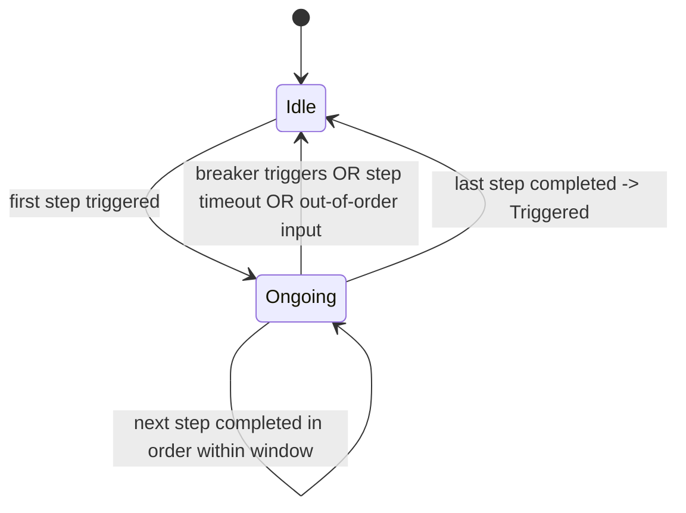
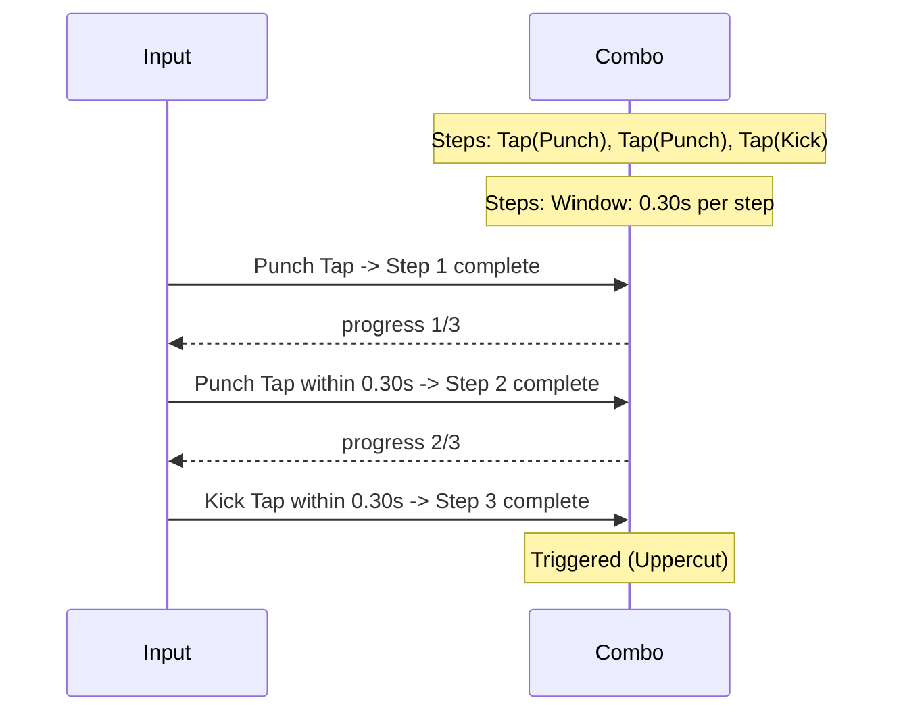
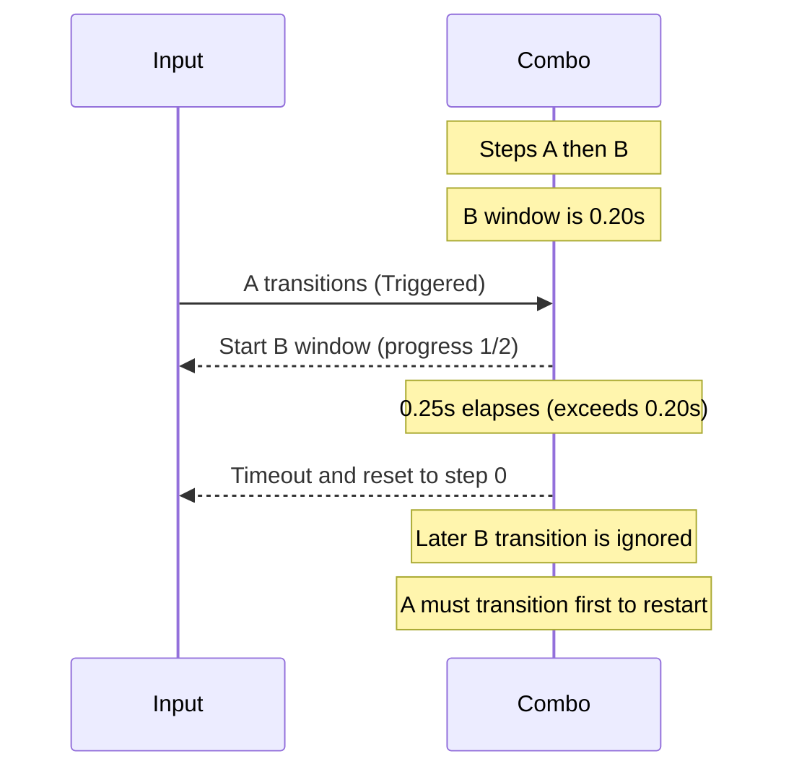
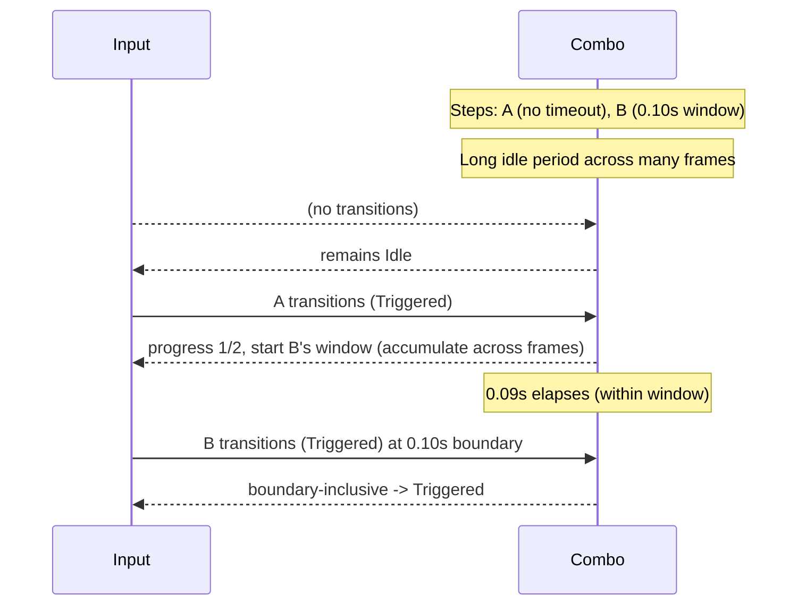

# Combo Trigger

The Combo trigger detects ordered input patterns. Each step in the combo must
be completed in order (and optionally within per-step time windows) before a
single Triggered event is emitted for the entire sequence. Typical use: fighting
moves, gesture recognition, or complex actions.

## Behavior summary

- Begins evaluating when the first combo step triggers.
- Tracks ordered steps; each required step must enter specified completion
  states (e.g., Triggered, Completed) — this allows composing with Tap, Hold,
  etc.
- Timing windows can be set per step (except the first step which has no
  timeout) and are measured relative to completion of the previous step.
- Optional breakers can reset progress when they trigger.
- Event-driven evaluation: steps and breakers are advanced/reset by state
  transitions that occur in the current frame (edges), not by persistent
  "still-held" states.

## Lifecycle and states



## Event-driven evaluation (per-frame)

The Combo trigger is evaluated using per-frame state transitions captured by
each `Action` (via `GetFrameTransitions()`). A step or breaker only counts when
the action transitions to a state matching the configured mask in the current
frame. Persistent states from earlier frames do not auto-advance or reset the
combo.

Implications:

- Timeouts truly reset progress: after a timeout, lingering "triggered" or
  "ongoing" states won't complete the next step unless a new transition occurs.
- Breakers must actually transition in the frame to reset; staying held from a
  prior frame won't repeatedly reset.
- The combo can span many frames: windows are accumulated via delta-time across
  updates until the next qualifying transition happens.

## Timeline example (three steps)



Timeout and breaker scenario (per-frame edges):



Multi-frame window and boundary behavior:



## Configuration (C++)

```cpp
using oxygen::input::Action;
using oxygen::input::ActionTriggerCombo;

// Define actions externally and wire them to gameplay inputs
auto punch = std::make_shared<Action>("Punch", oxygen::input::ActionValueType::kBool);
auto kick  = std::make_shared<Action>("Kick",  oxygen::input::ActionValueType::kBool);

ActionTriggerCombo combo;
combo.AddComboStep(punch, oxygen::input::ActionState::kTriggered, 0.30F);
combo.AddComboStep(punch, oxygen::input::ActionState::kTriggered, 0.30F);
combo.AddComboStep(kick,  oxygen::input::ActionState::kTriggered, 0.30F);

// Optional breakers
// combo.AddComboBreaker(block, oxygen::input::ActionState::kTriggered);
```

## Contract

- Inputs: The combo inspects per-frame state transitions of referenced
  `Action`s each update (event-driven). It does not use the `action_value`
  parameter directly.
- Emits: Triggered once when the final step completes in order; otherwise
  remains Ongoing or resets to Idle on errors/timeouts.
- States:
  - Idle: no progress
  - Ongoing: in-progress, waiting for the next step
  - Completed: represented by Triggered on the frame last step completes
- Edge cases:
  - First step has no timeout; time windows apply to subsequent steps.
  - Out-of-order step resets to step 0.
  - Any breaker firing resets to step 0.
  - Per-step windows use the provided seconds; boundary (==) succeeds.
  - After a timeout reset, a new transition is required to advance; lingering
    persistent states from prior frames are ignored.

## Testing notes

Recommended unit scenarios (covered in ActionTriggers tests):

- In-order completion triggers combo.
- Breaker resets progress.
- Out-of-order step resets.
- Step timeout resets (first step excepted), including exact-boundary success.
- Subsequent sequence after completion starts fresh from step 0.

## VS Code rendering

Mermaid diagrams render in VS Code’s Markdown Preview. If not enabled,
install an extension such as "Markdown Preview Mermaid Support".
