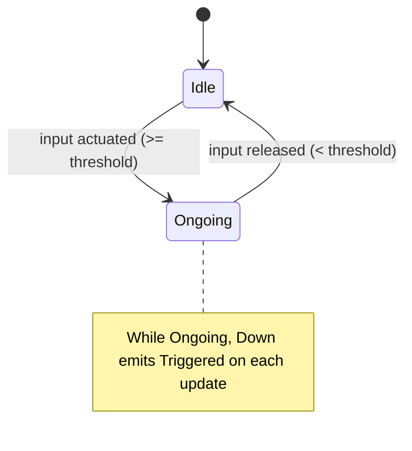
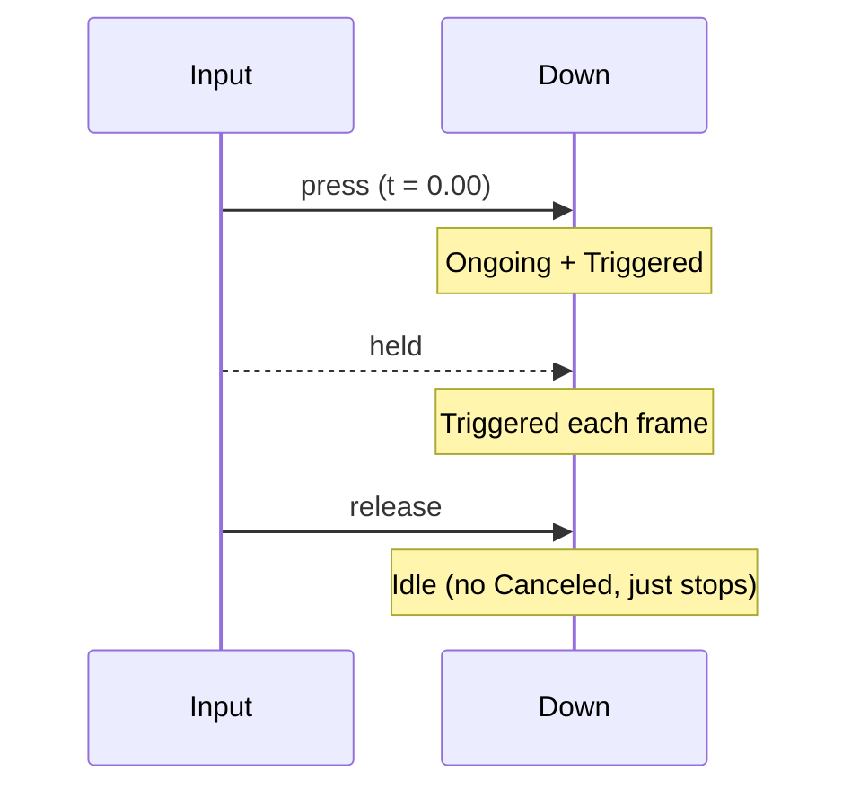

# Down Trigger

The Down trigger reflects whether an input is currently active. It is purely
state-driven: when the input is actuated, Down is Ongoing and emits Triggered
on every update; when the input is released, it returns to Idle and stops
emitting. There are no edge/timing semantics.

## Behavior summary

- On actuation: enters Ongoing immediately and emits Triggered.
- While held: emits Triggered every update (frame-coherent behavior).
- On release: transitions to Idle and stops emitting. Completed may be set
  if at least one Triggered occurred during the press. No explicit Canceled.

Use cases: continuous input like locomotion, aiming, camera control, or any
behavior that should remain active for as long as the input is down.

## Lifecycle and states



## Timeline example



## Configuration (C++)

```cpp
using oxygen::input::ActionTriggerDown;

ActionTriggerDown down;
// Optional for analogs: dead-zone / actuation threshold
// Default is 0.5f

down.SetActuationThreshold(0.50F);
```

Notes:

- For boolean inputs, actuation is equivalent to value >= 1.0f by convention.
- For analog inputs, actuation uses abs(value) >= threshold to be robust to
  negative axes. Choose a threshold to avoid noise.

## Contract

- Inputs: ActionValue (actuated bool/axis), delta_time (ignored by Down).
- Emits: Triggered every update while actuated; never Canceled.
- States:
  - Idle: not actuated
  - Ongoing: actuated (emits every update)
  - Completed: set on release after having Triggered at least once
- Edge cases:
  - No trigger when below actuation threshold.
  - At most one Triggered per update (but will fire on each update while held).
  - Release simply stops triggering; no cancellation semantics.

## Testing notes

Recommended unit scenarios (covered in ActionTriggers tests):

- Triggers every update while held (frame-coherent).
- Analog thresholding: positive and negative axes above threshold trigger; below does not.
- Never-canceled invariant: Down does not report Canceled.
- Quick press-release completes if triggered at least once.

## VS Code rendering

Mermaid diagrams render directly in VS Code’s Markdown Preview. If not enabled,
install an extension such as "Markdown Preview Mermaid Support".
