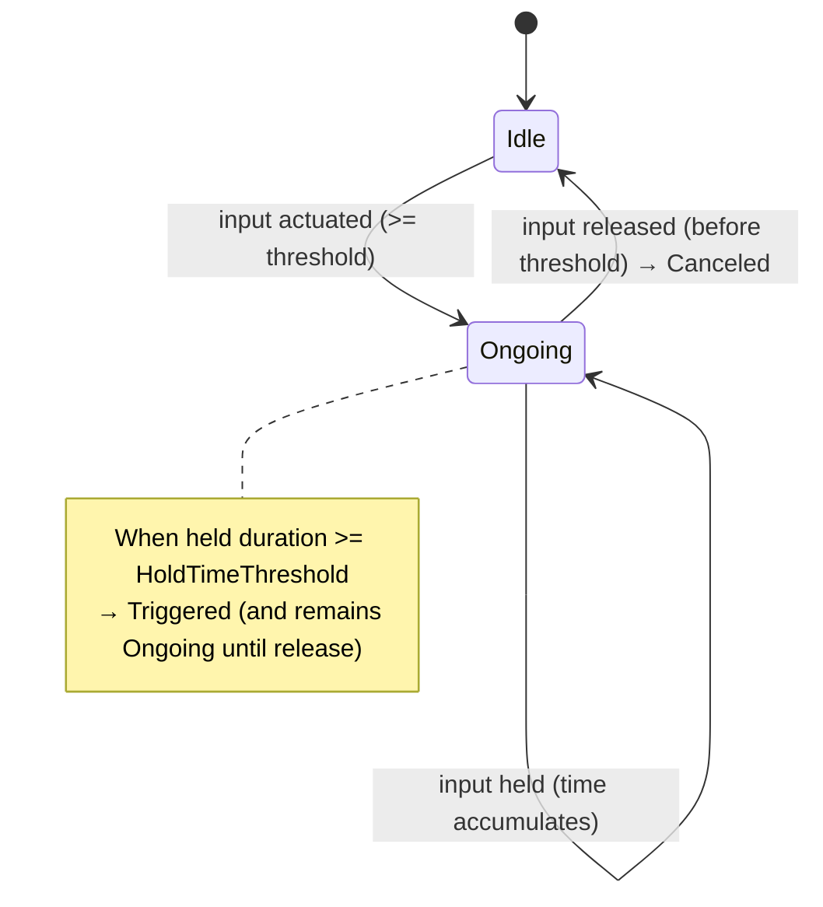
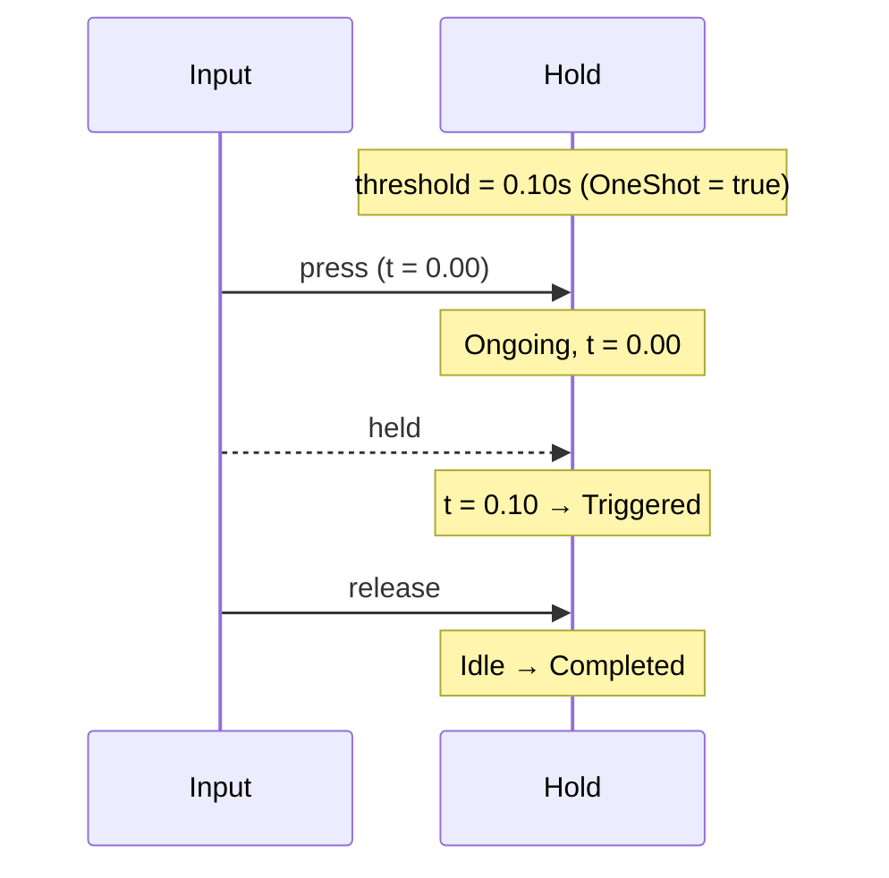
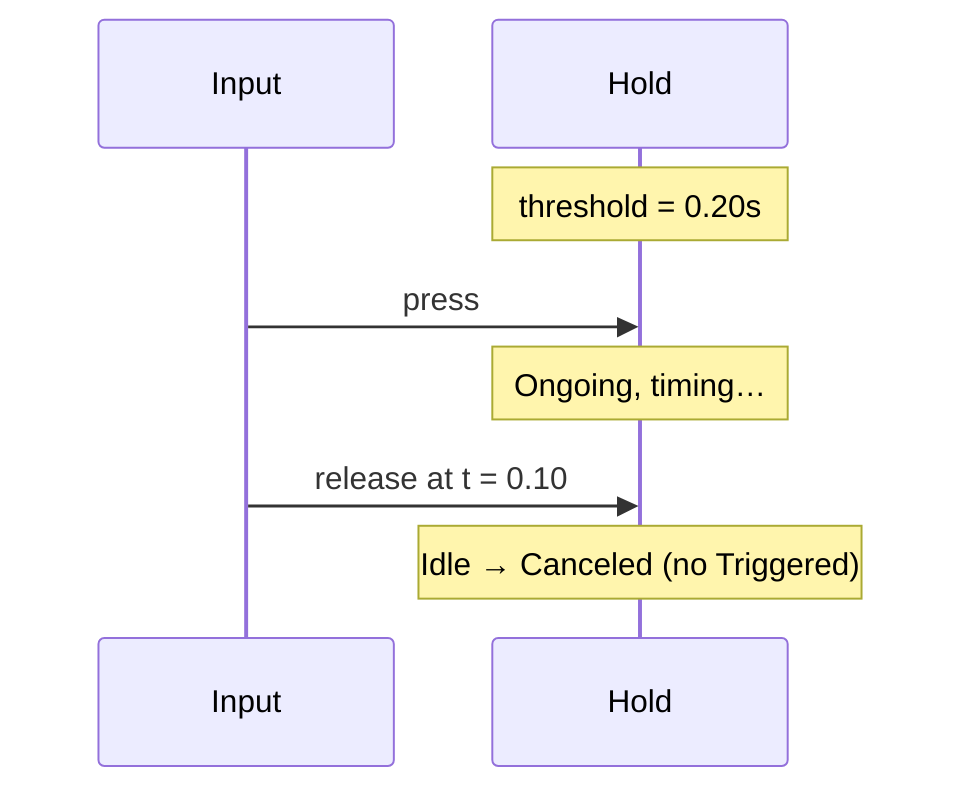
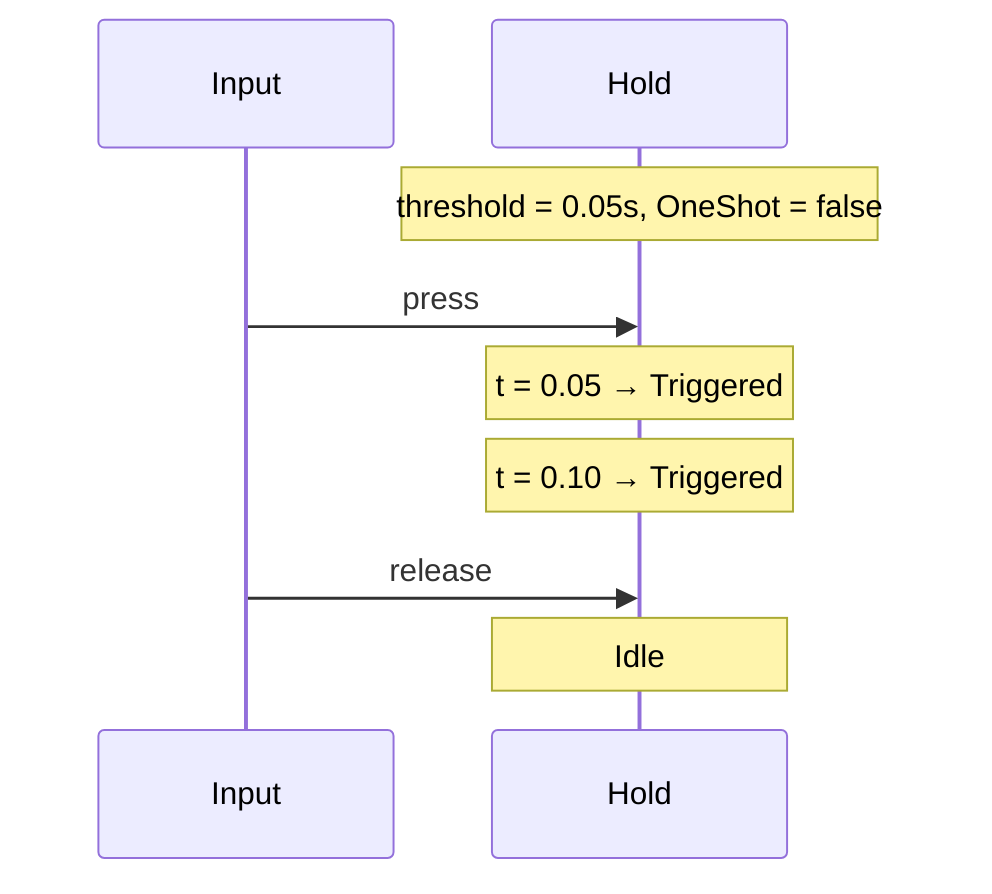

# Hold Trigger

The Hold trigger emits Triggered only after the input has been held
continuously for at least a configured duration. It starts timing as soon as
the input actuates and cancels if released early.

## Behavior summary

- On press: enters Ongoing immediately and starts timing.
- While held: accumulates held time toward the threshold.
- On reaching threshold: fires Triggered. With OneShot(true), it fires once;
  with OneShot(false), it can fire again on subsequent updates while held.
- On early release: transitions to Idle and reports Canceled (no Triggered).

Default configuration: OneShot(true), threshold = 0s (configure via API).

## Lifecycle and states



## Timeline examples

### Fire after threshold



### Cancel if released early



### Repeat when OneShot(false)



## Configuration (C++)

```cpp
using oxygen::input::ActionTriggerHold;

ActionTriggerHold hold;
hold.SetHoldDurationThreshold(0.50F);
hold.OneShot(true); // or false to allow repeated triggers while held
```

## Contract

- Inputs: ActionValue (bool or axis), delta_time.
- Emits: Triggered when held time >= threshold; Canceled on early release.
- States:
  - Idle: not actuated
  - Ongoing: actuated (timing)
  - Completed: true only for one-shot once released after Triggered
- Edge cases:
  - No trigger without meeting threshold.
  - Axis uses absolute value for threshold.
  - With OneShot(false), multiple triggers while held are allowed.

## Example use: Heavy attack

- Hold to charge for 0.5s; on threshold, trigger heavy attack
- Release early → canceled (delegate to Tap/Pressed if needed)

## VS Code rendering

Mermaid diagrams render in VS Code Markdown Preview. If not visible, install a
Mermaid preview extension. GitHub also renders Mermaid in Markdown.
