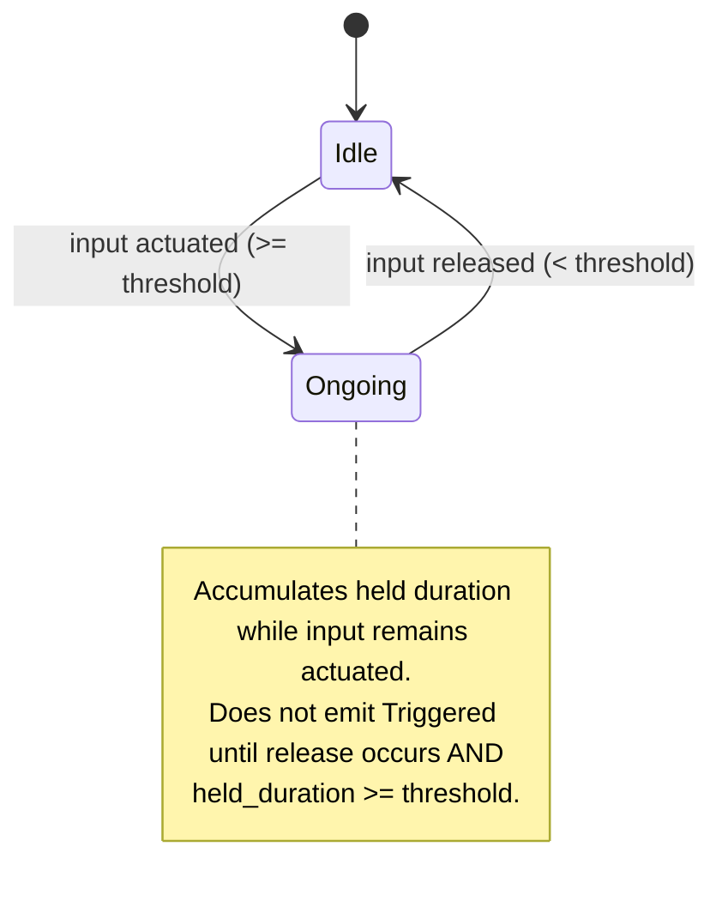
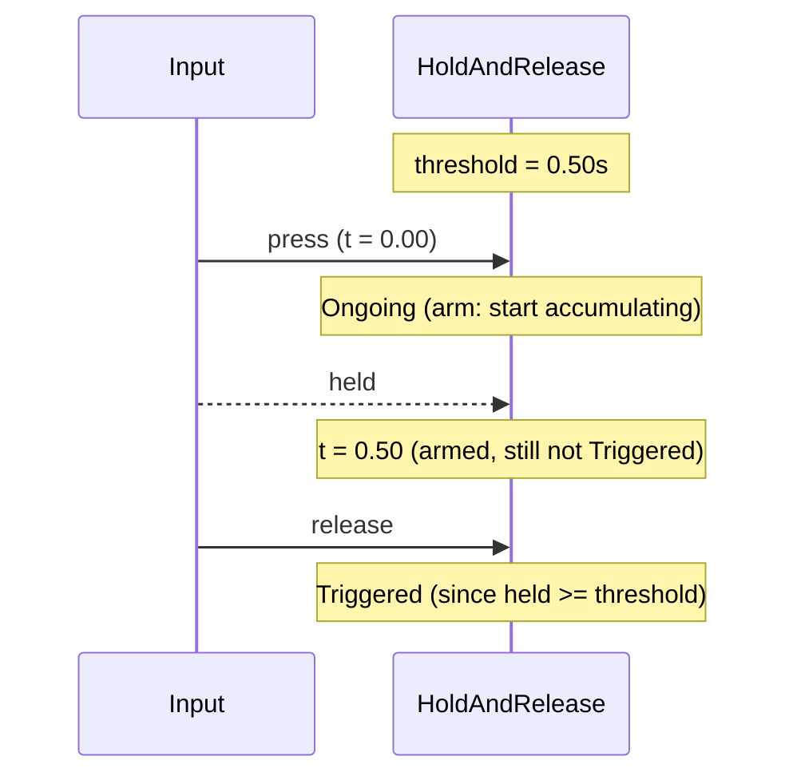
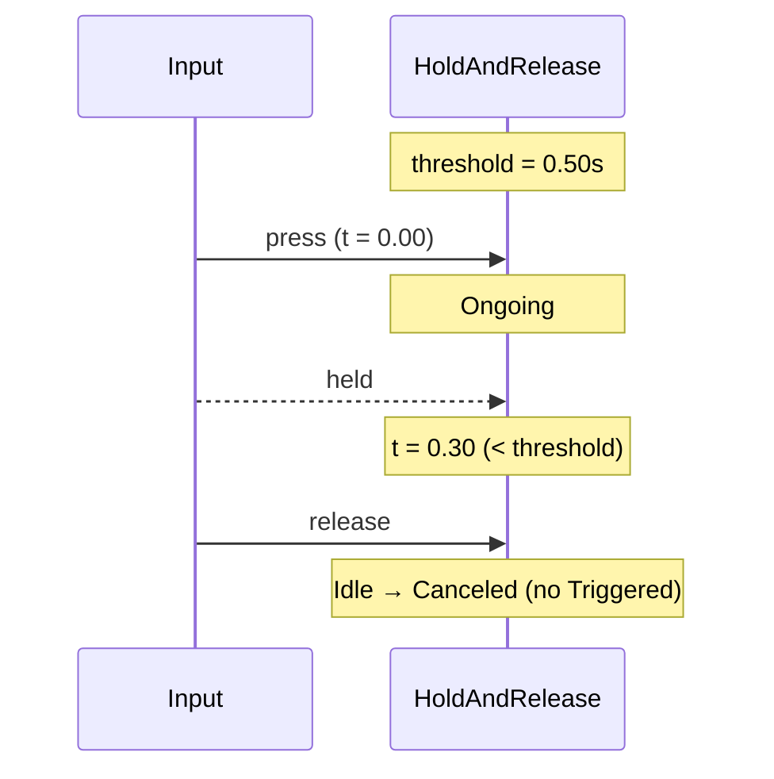

# HoldAndRelease Trigger

HoldAndRelease is a compound trigger designed to fire only after a successful
hold followed by a release, making it ideal for charge-and-release mechanics or
other deliberate gestures.

## Behavior summary

- On actuation: enters Ongoing immediately and begins tracking held time.
- While held: never fires; it only arms internally by accumulating time.
- On release: fires Triggered if held_duration >= threshold; otherwise it
  cancels (no Triggered), allowing other triggers (e.g., Tap/Pressed) to take
  over.

## Lifecycle and states



## Timeline example



Early release cancellation:



## Configuration (C++)

```cpp
using oxygen::input::ActionTriggerHoldAndRelease;

ActionTriggerHoldAndRelease har;

// Hold threshold in seconds
har.SetHoldDurationThreshold(0.50F);

// Optional: set actuation threshold for analog inputs (abs(value) >= threshold)
har.SetActuationThreshold(0.40F);
```

## Contract

- Inputs: ActionValue (actuated bool/axis), delta_time.
- Emits: Triggered exactly once on release if held >= threshold; otherwise
  Canceled on release.
- States:
  - Idle: not actuated
  - Ongoing: actuated, accumulating held time
  - Completed: not used; Triggered occurs on the release frame
- Edge cases:
  - Never fires while held even if threshold is surpassed; release is required.
  - Below actuation threshold: no Ongoing; release yields no Triggered.
  - Analog inputs measured using abs(value) relative to actuation threshold.

## Testing notes

Recommended unit scenarios (covered in ActionTriggers tests):

- Triggers only on release after meeting threshold (including exact boundary).
- No trigger before release, even if held beyond threshold.
- Early release cancellation.
- Axis positive/negative support with actuation thresholds.

## VS Code rendering

Mermaid diagrams render directly in VS Code’s Markdown Preview. If not enabled,
install an extension such as "Markdown Preview Mermaid Support".
