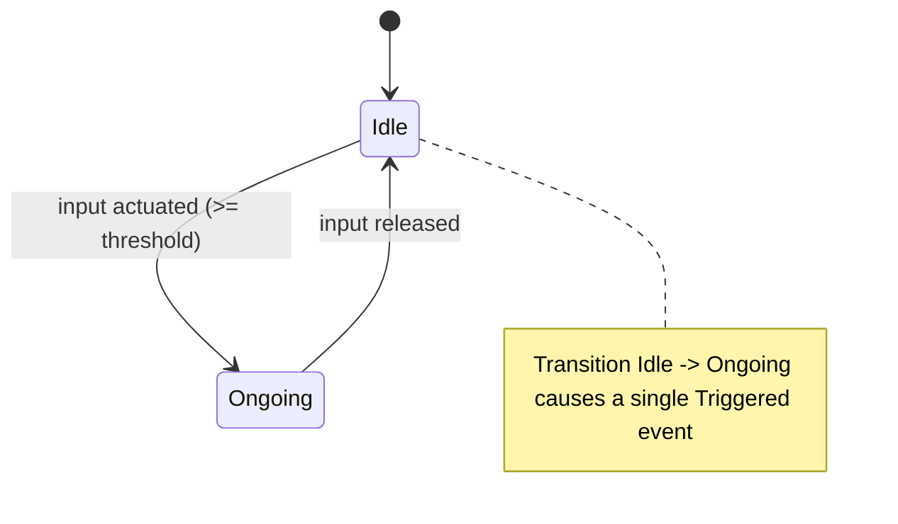
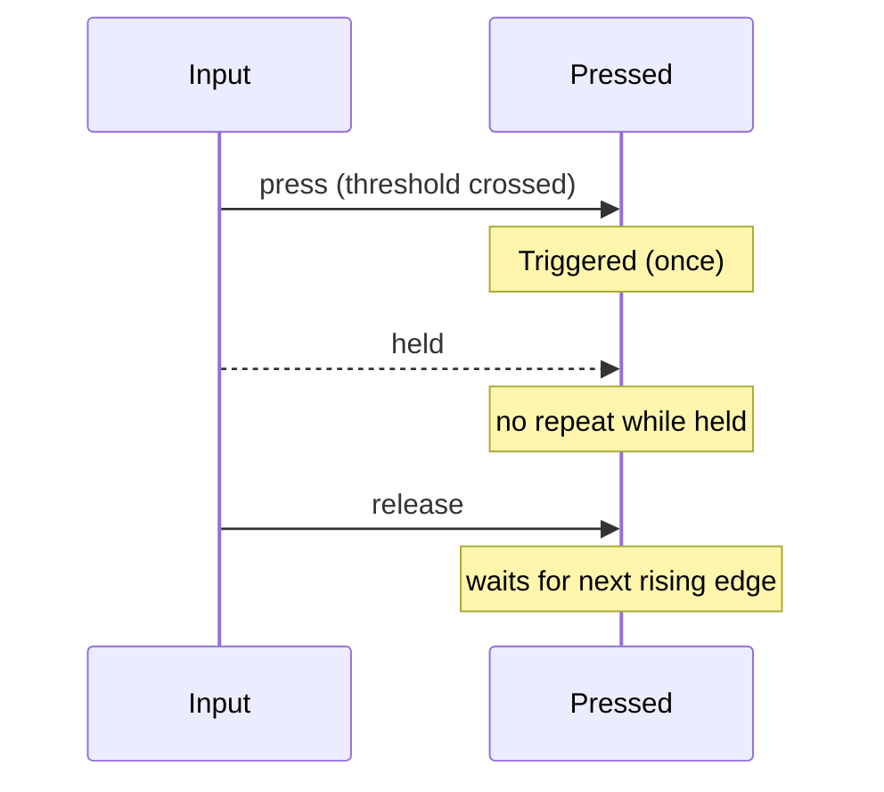
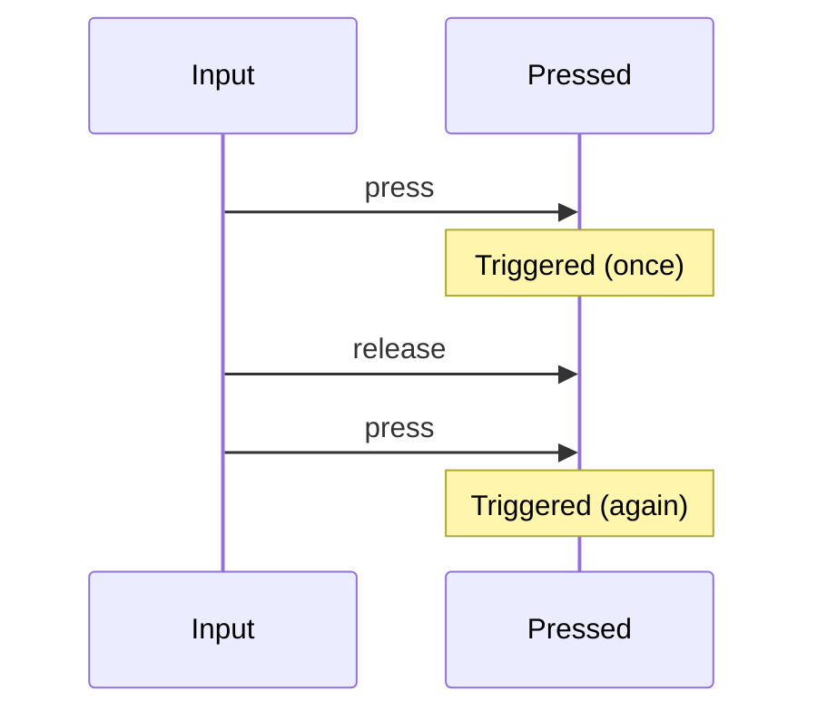

# Pressed Trigger

The Pressed trigger emits a single Triggered event the moment the input crosses
its actuation threshold (rising edge). It does not repeat while held; it only
fires again after the input is released and pressed again.

## Behavior summary

- Rising edge: fires immediately when input becomes actuated (>= threshold).
- While held: no repeat triggers.
- On release: no event from Pressed; it simply resets for the next press.
- No cancellation concept; Pressed is instantaneous and edge-triggered.

Default configuration: actuation threshold = 0.5 (can be tuned per action).

## Lifecycle and states



## Timeline examples

### Single press



### Re-press after release



## Configuration (C++)

```cpp
using oxygen::input::ActionTriggerPressed;

ActionTriggerPressed pressed;
pressed.SetActuationThreshold(0.5F); // optional, default is 0.5
```

## Contract

- Inputs: ActionValue (bool or axis), delta_time (ignored by Pressed).
- Emits: Triggered exactly once on rising edge; never cancels/completes.
- States:
  - Idle: not actuated
  - Ongoing: actuated (used only to detect release/reset)
- Edge cases:
  - No trigger without a threshold crossing.
  - No auto-repeat while held.
  - Triggers again only after release.

## Example use: Jump

- InputAction "Jump" with a Pressed trigger
- Player presses the jump key → Triggered → character jumps
- Holding the key does nothing extra; re-press to jump again

## VS Code rendering

Mermaid diagrams render in VS Code Markdown Preview. If not visible, install a
Mermaid preview extension. GitHub also renders Mermaid in Markdown.
