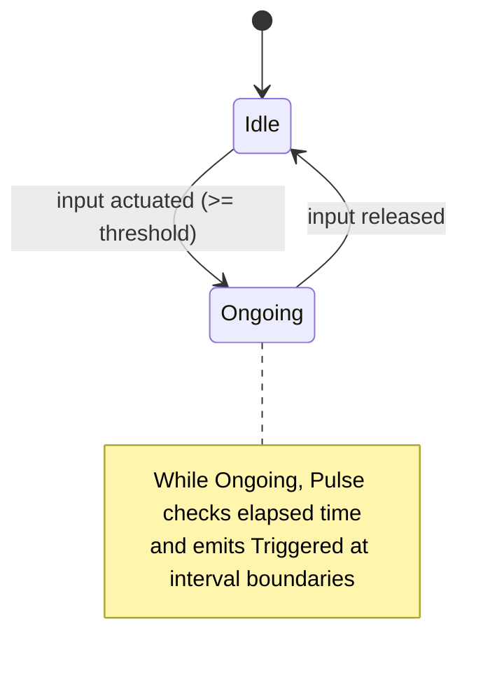
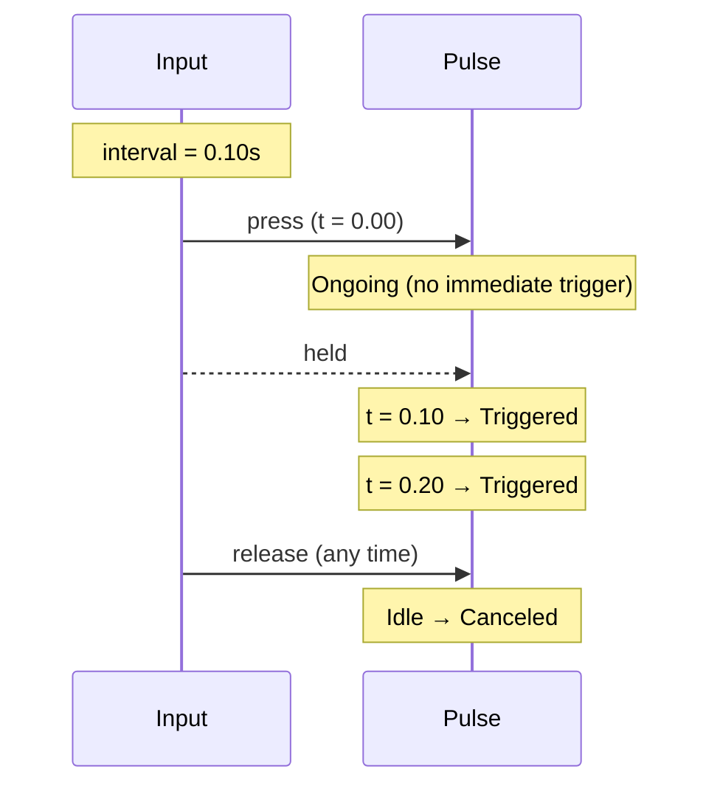
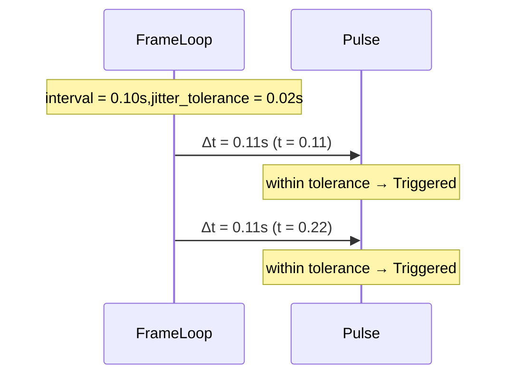
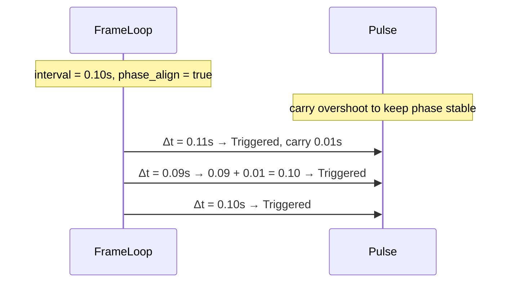
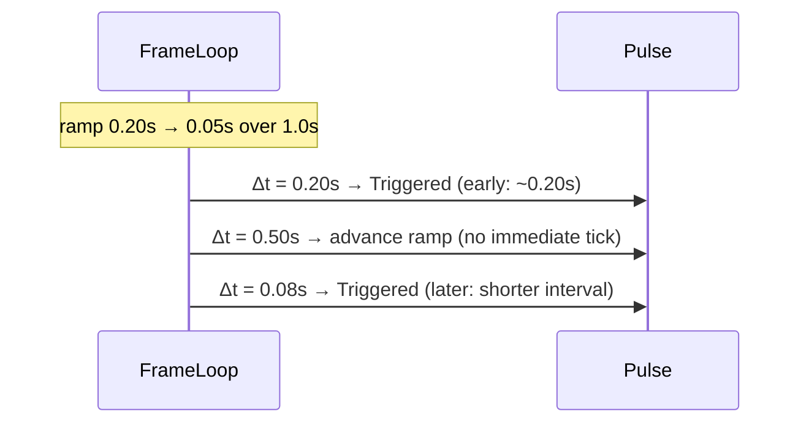

# Pulse Trigger

The Pulse trigger emits a periodic Triggered event at a fixed interval while the
input is actuated (pressed/held). It cancels when the input is released. Think
of it like a metronome driven by input state.

## Behavior summary

- On press: enters Ongoing immediately (no immediate trigger by default).
- While held: emits Triggered at each interval boundary (metronome ticks).
- On release: transitions to Idle and reports Canceled.
- No “Completed” state (Pulse is not one-shot).

Optional stability controls (opt-in, minimal surface):

- Jitter tolerance: allow slightly late frames to still count as on-time.
- Phase alignment: carry over overshoot to keep metronome phase stable.
- Rate ramp: linearly change the interval over time (speed up / slow down).

Default configuration: no trigger on start, no jitter tolerance, phase
alignment enabled, no rate ramp.

## Lifecycle and states



## Timeline examples

### Simple interval (no jitter, no ramp)



### Slightly late frames (jitter tolerance)



### Phase alignment (overshoot carry)



### Rate ramp (speed up over time)



## Overdue frame policy (stability)

To avoid bursty behavior when a frame is significantly late:

- If elapsed since last tick >= interval + jitter_tolerance → fire a single
 Triggered for this update.
- If a frame is far overdue (>= 2× interval), drop the tick for this update and
 re-quantize phase (with overshoot carry if enabled). The next frame that
 reaches the interval will trigger normally.

This keeps the metronome responsive under light jitter, while avoiding pulse
bursts after long stalls.

## Configuration (C++)

```cpp
using oxygen::input::ActionTriggerPulse;

ActionTriggerPulse pulse;

// Core interval
pulse.SetInterval(0.10F);              // 10 Hz

// Optional: no immediate tick on press (default false)
pulse.TriggerOnStart(false);

// Optional stability controls (all opt-in)
pulse.SetJitterTolerance(0.02F);       // allow up to +20ms late
pulse.EnablePhaseAlignment(true);      // keep phase stable (default true)
pulse.SetRateRamp(0.20F, 0.05F, 1.0F); // speed up over 1s while held
```

## Contract

- Inputs: ActionValue (actuated bool/axis), delta_time.
- Emits: Triggered when interval elapsed; Canceled when released.
- States:
  - Idle: not actuated
  - Ongoing: actuated (tracking elapsed)
  - Completed: never used (always false)
- Edge cases:
  - No trigger without actuation.
  - At most one Triggered per update.
  - Release during a sequence yields Canceled (not Completed).

## Testing notes

Recommended unit scenarios (covered in ActionTriggers tests):

- No trigger on start, first trigger after interval.
- Jitter tolerance: slightly late frames still trigger.
- Phase alignment: repeated small overshoot doesn’t drift cadence.
- Overdue policy: very late frame drops this update’s tick (no burst).
- Rate ramp: cadence increases/decreases consistently over time.

## VS Code rendering

Mermaid diagrams render directly in VS Code’s Markdown Preview. If not enabled,
install an extension such as “Markdown Preview Mermaid Support”. GitHub also
renders Mermaid in README/Markdown files.
