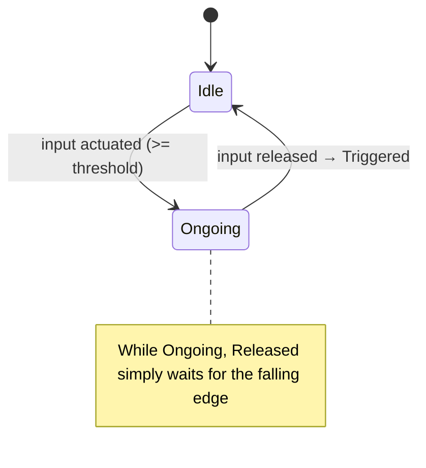
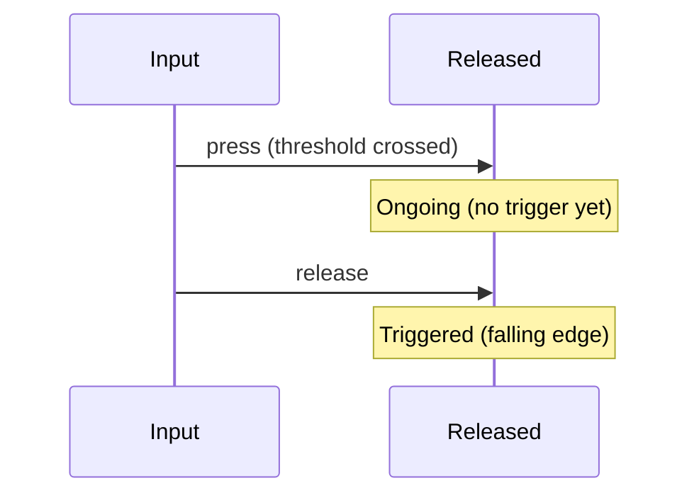
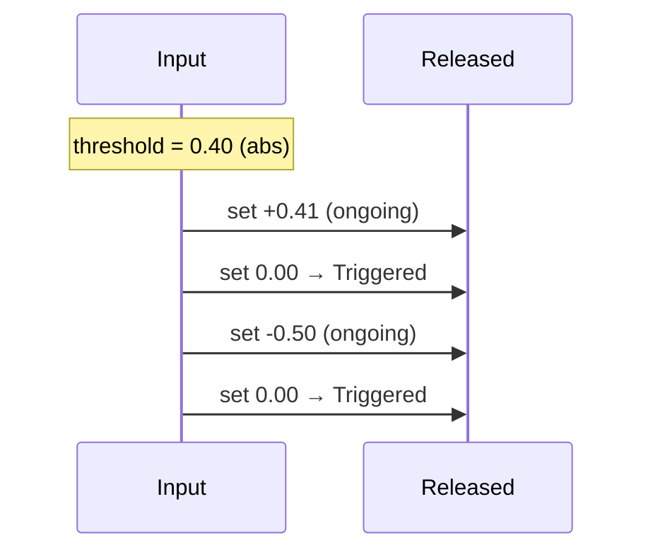

# Released Trigger

The Released trigger emits a single Triggered event the moment the input is
released (falling edge). It begins monitoring when the input becomes actuated
and fires as soon as it transitions back to inactive.

## Behavior summary

- On press: enters Ongoing while input remains actuated.
- On release: fires Triggered immediately and returns to Idle.
- Non-repeating: one-shot per press/release cycle.
- No cancellation concept; it’s instantaneous and edge-triggered.

Default configuration: actuation threshold = 0.5 (configurable per action).

## Lifecycle and states



## Timeline examples

### Press then release



### Axis inputs (positive/negative)



## Configuration (C++)

```cpp
using oxygen::input::ActionTriggerReleased;

ActionTriggerReleased released;
released.SetActuationThreshold(0.5F); // optional, default is 0.5
```

## Contract

- Inputs: ActionValue (bool or axis), delta_time (ignored by Released).
- Emits: Triggered exactly once on falling edge; never cancels/completes.
- States:
  - Idle: not actuated
  - Ongoing: actuated (waiting for release)
- Edge cases:
  - No trigger if never actuated.
  - Axis uses absolute value for threshold.
  - One Triggered per press→release cycle.

## Example use: Charge-and-release

- Hold to charge; upon release, fire action
- Ideal for bows, throws, or ending a gesture

## VS Code rendering

Mermaid diagrams render in VS Code Markdown Preview. If not visible, install a
Mermaid preview extension. GitHub also renders Mermaid in Markdown.
