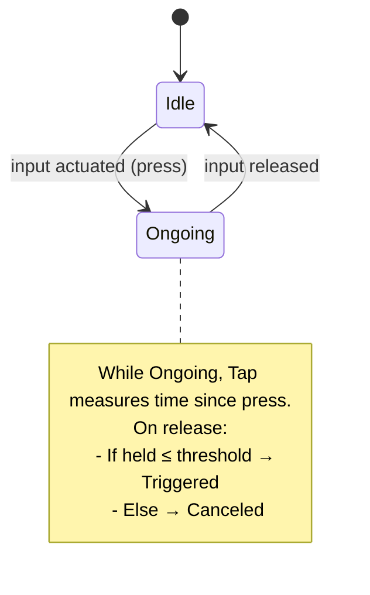
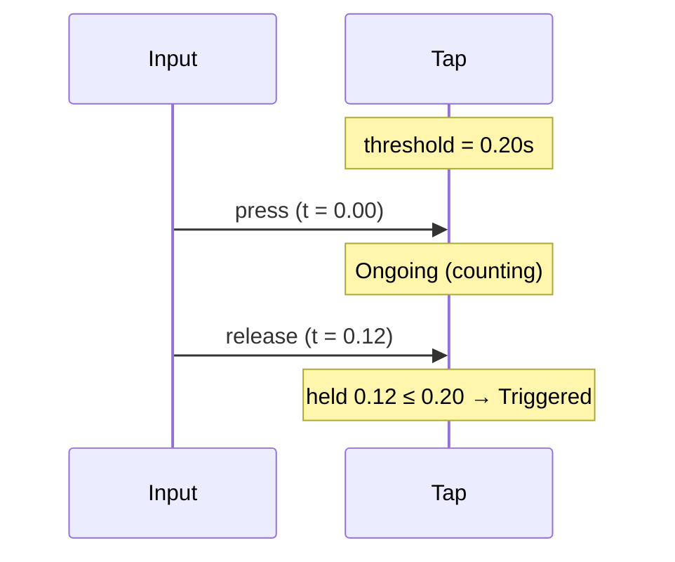
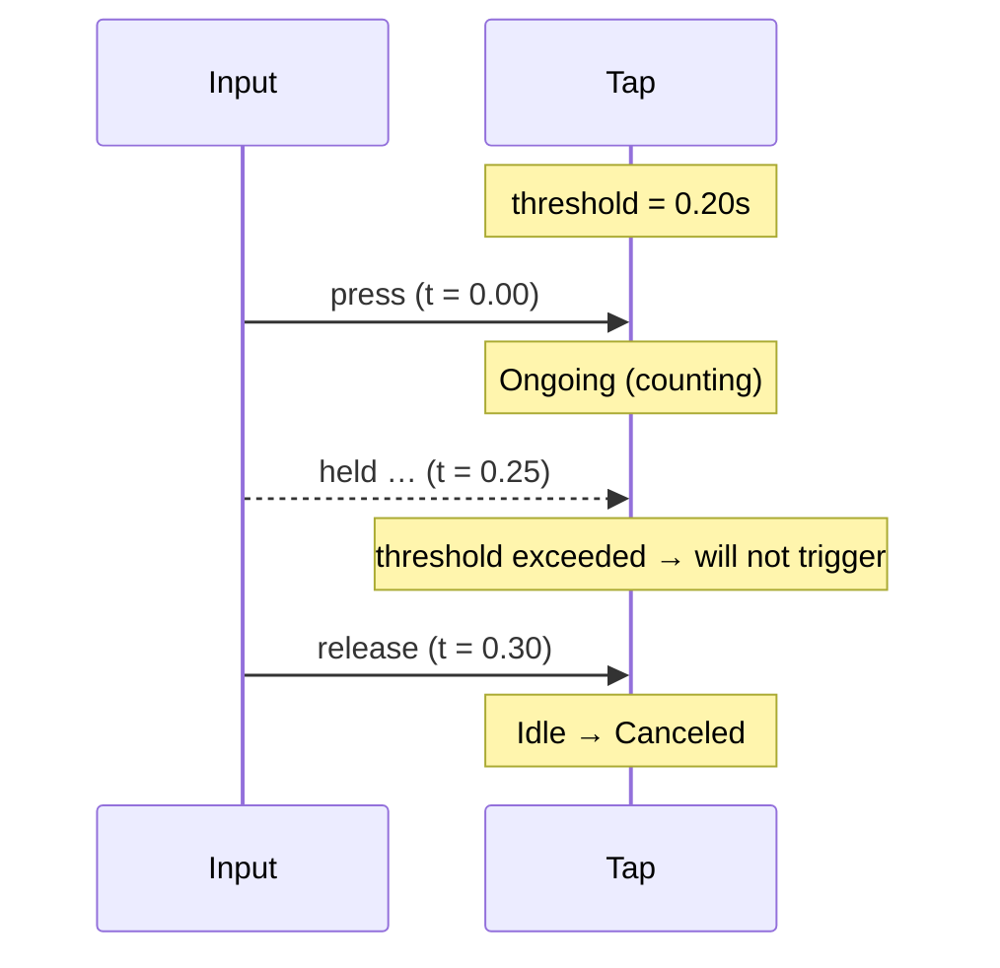
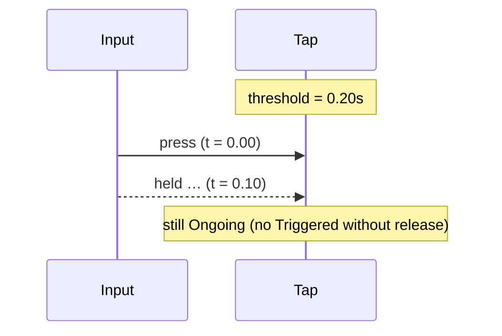

# Tap Trigger

The Tap trigger fires only if the input is pressed and then released within a
short time window. If the window elapses while still held, the tap is canceled
and will not fire on release.

## Behavior summary

- On press: enters Ongoing immediately (starts measuring hold duration).
- On release: fires Triggered if held duration ≤ TapTimeThreshold.
- If held beyond the threshold: tap is canceled (no Triggered on release).
- Designed to complement Hold triggers (tap for light, hold for heavy).

Default: TapTimeThreshold must be configured per action (typical 0.15–0.25 s).

## Lifecycle and states



## Timeline examples

### Quick tap (fires)



### Long hold (cancels)



### No release (no trigger)



## Configuration (C++)

```cpp
using oxygen::input::ActionTriggerTap;

ActionTriggerTap tap;

tap.SetActuationThreshold(0.5F);      // typical button threshold
// Time window for tap gesture
// Fires only if release occurs within this window
// (adjust per platform/input feel)
tap.SetTapTimeThreshold(0.20F);       // 200 ms
```

## Contract

- Inputs: ActionValue (actuated bool/axis), delta_time.
- Emits: Triggered on release if held ≤ threshold; Canceled otherwise.
- States:
  - Idle: not pressed
  - Ongoing: pressed (measuring hold duration)
  - Completed: not used (tap is instantaneous on release)
- Edge cases:
  - No Triggered without release.
  - Holding beyond threshold ensures tap won’t trigger on release (canceled).
  - Works alongside Hold triggers to branch light vs heavy behaviors.

## Testing notes

Recommended unit scenarios (mirrored in ActionTriggers tests):

- Triggers on quick press+release within threshold.
- Does not trigger when held longer than threshold (cancels on release).
- No trigger without release.

## VS Code rendering

Mermaid diagrams render directly in VS Code’s Markdown Preview. If not enabled,
install an extension such as “Markdown Preview Mermaid Support”. GitHub also
renders Mermaid in README/Markdown files.
