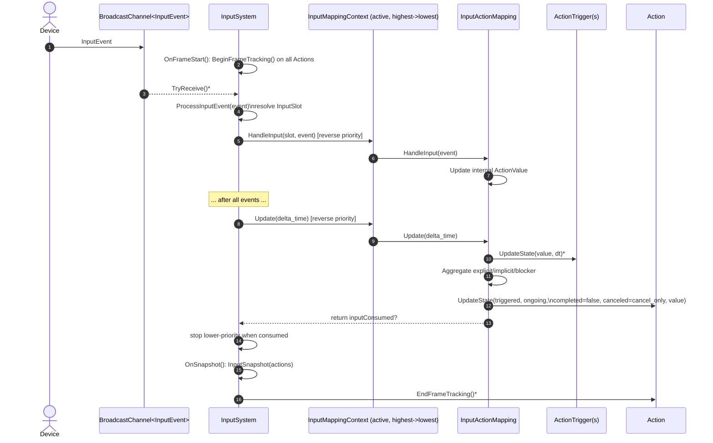
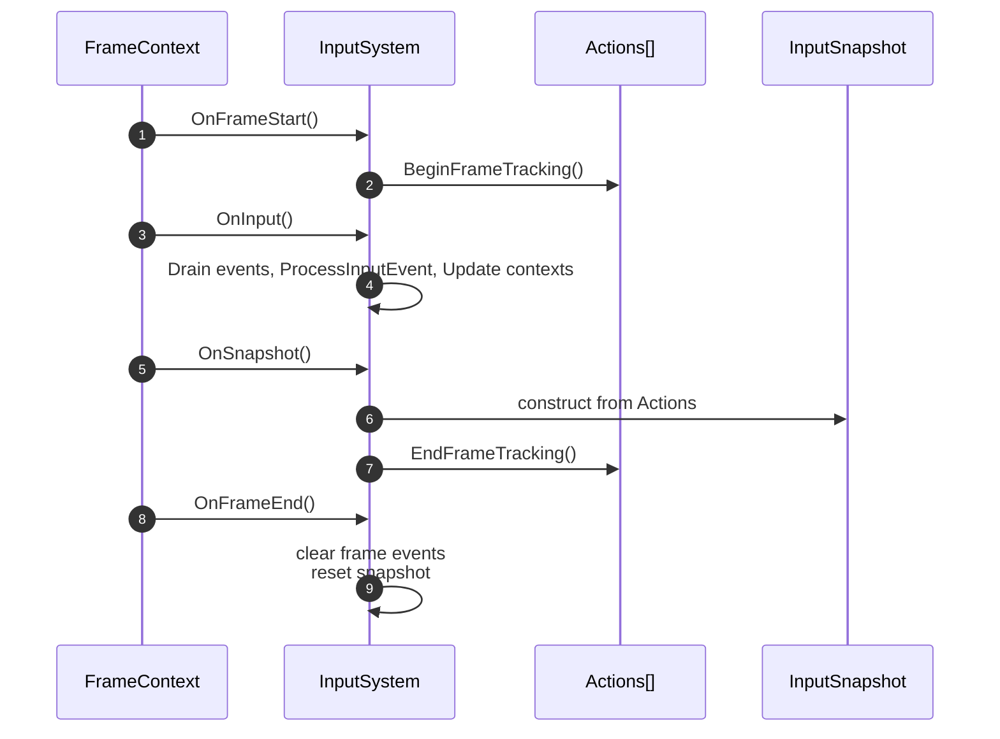
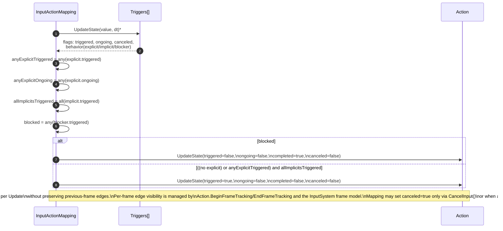
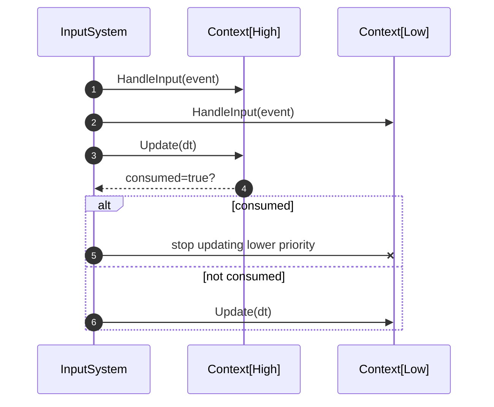

# Oxygen Input System

Modern, declarative, frame-based input for Oxygen Engine. The Input module maps
platform input events to high-level Actions via mapping contexts and
composable triggers. It favors a query-driven model with per-frame snapshots
over callbacks, so gameplay code can ask precise questions like “did Attack
trigger this frame?” or “is Sprint ongoing right now?”.

Key concepts (see Docs for details):

- Actions: named logical inputs with typed values (bool, Axis1D, Axis2D) and
  per-frame state (triggered, ongoing, completed, canceled, idle). See
  Docs/Actions.md.
- Triggers: small state machines (Pressed, Released, Down, Hold,
  HoldAndRelease, Pulse, Tap, Chain, Combo) with explicit/implicit/blocker
  behaviors. See Docs/Triggers/*.
- Mappings: connect platform `InputSlot` (device input) to an `Action` with
  one or more triggers. See Docs/Mappings.md.
- Mapping contexts: groups of mappings with priority and activation, enabling
  layered input schemes (gameplay, UI, vehicle, etc.). See Docs/Mappings.md.
- Input system: orchestrates phases (FrameStart, Input, Snapshot, FrameEnd),
  routes events, updates contexts, applies input consumption/priority rules,
  and produces an InputSnapshot (frame-frozen view). See Docs/InputSnapshot.md.

Design goals:

- Declarative, minimal API surface focused on Actions and Triggers
- Deterministic per-frame semantics and reproducible snapshots
- Explicit consumption and priority for multi-context setups
- Scales from simple taps to advanced chains/combos without callbacks

Quick start:

```cpp
using namespace oxygen;
using oxygen::input::Action;
using oxygen::input::InputActionMapping;
using oxygen::input::InputMappingContext;
using oxygen::input::ActionTriggerPressed;
using oxygen::platform::InputSlots;

// 1) Define actions and register with InputSystem
auto jump = std::make_shared<Action>("Jump", input::ActionValueType::kBool);
input_system->AddAction(jump);

// 2) Create a mapping context and add mappings + triggers
auto ctx = std::make_shared<InputMappingContext>("gameplay");
{
  auto m = std::make_shared<InputActionMapping>(jump, InputSlots::Space);
  auto t = std::make_shared<ActionTriggerPressed>();
  t->MakeExplicit();
  m->AddTrigger(t);
  ctx->AddMapping(m);
}
input_system->AddMappingContext(ctx, /*priority*/ 0);
input_system->ActivateMappingContext(ctx);

// 3) Each frame (simplified):
input_system->OnFrameStart(frame_ctx);
co_await input_system->OnInput(frame_ctx); // routes events + updates mappings
input_system->OnSnapshot(frame_ctx);       // builds InputSnapshot

// 4) Query per-frame edges/level state from actions (or from the snapshot)
if (jump->WasTriggeredThisFrame()) {
  player.Jump();
}
input_system->OnFrameEnd(frame_ctx);
```

## Data flow: Input event to Action



## Frame lifecycle



## Trigger aggregation within a mapping



## Context priority and input consumption



## Documentation map

- Actions: `Docs/Actions.md`
- Mappings & Contexts: `Docs/Mappings.md`
- Snapshot (frame-frozen view): `Docs/InputSnapshot.md`
- Triggers:
  - Pressed: `Docs/Triggers/Pressed.md`
  - Released: `Docs/Triggers/Released.md`
  - Down: `Docs/Triggers/Down.md`
  - Hold: `Docs/Triggers/Hold.md`
  - HoldAndRelease: `Docs/Triggers/HoldAndRelease.md`
  - Pulse: `Docs/Triggers/Pulse.md`
  - Tap: `Docs/Triggers/Tap.md`
  - Chain: `Docs/Triggers/Chain.md`
  - Combo: `Docs/Triggers/Combo.md`

## Typical usage

- Define Actions and register with `InputSystem`.
- Create one or more `InputMappingContext`s.
- For each action, create `InputActionMapping`s bound to platform `InputSlot`s and add triggers.
- Add contexts to `InputSystem` with priority and activate them.
- Optionally mark certain actions as consuming input to prevent lower-priority handling.
- Query actions directly in-frame before `OnSnapshot()`, or use the
  `InputSnapshot` (frame-frozen view) after `OnSnapshot()`.

## Notes

- Mouse motion/wheel values are transient per frame (cleared after Update when flagged).
- Chain and Combo triggers depend on other Actions’ states within the same frame; priority and update order matter.
- To render diagrams, open this file with a PlantUML-capable viewer (e.g., VS Code PlantUML extension) or export via a PlantUML CLI/server.

## Integration in Oxygen Engine

- Lifecycle: The InputSystem participates in the engine’s module phases
  (FrameStart → Input → Snapshot → FrameEnd). See the diagrams above.
- Priority & consumption: Higher priority contexts are updated first; when an
  action with `ConsumesInput=true` triggers, lower-priority contexts stop
  updating for that frame and pending staged input is flushed.
- Snapshots: `InputSnapshot` is constructed at the end of kInput and remains
  valid for the rest of the frame. See `Docs/InputSnapshot.md` for the edge vs
  level query model.

## Examples & tests

- See unit tests under `Input/Test/` for usage patterns.
- The integration test `InputSystem_integration_test.cpp` demonstrates a
  realistic combat scenario (Jump, Attack/Tap, ChargedAttack/Hold+Release,
  Move/WASD, Roll, DodgeRoll with Chain(Move)). It logs per-frame input and
  actions, and validates against an expected history.
