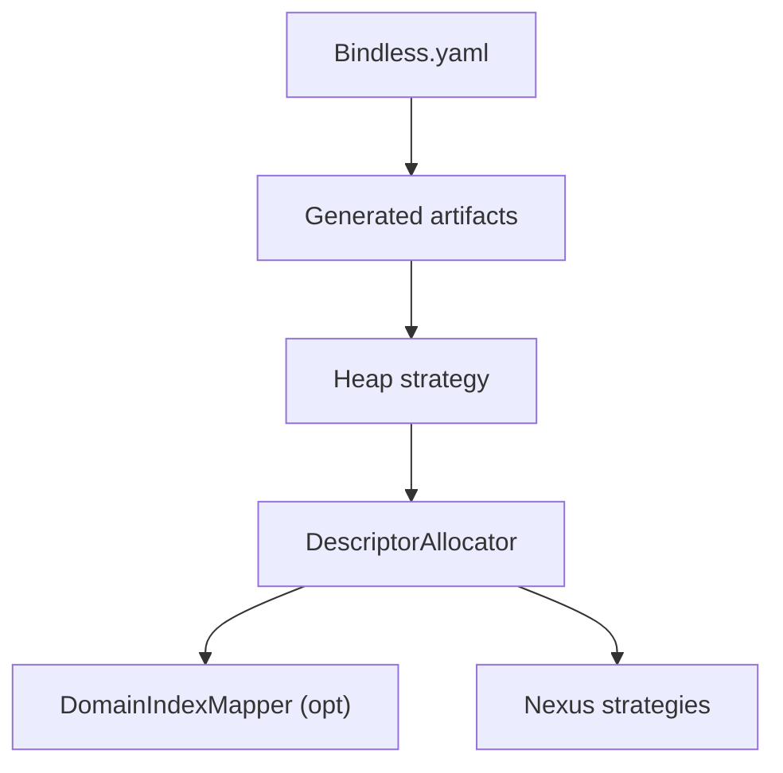
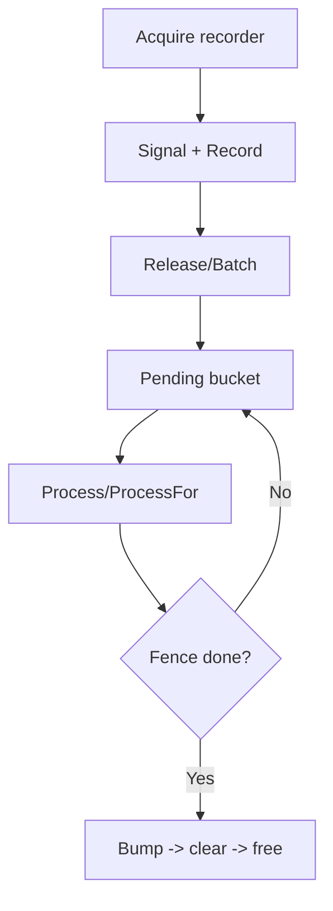

# Bindless Deferred Slot Reuse Design

## Problem Statement

Bindless rendering requires stable, shader-visible descriptor indices for the
lifetime of each resource. A descriptor slot can be recycled only after the
resource’s last GPU use has definitively completed. The system must prevent slot
aliasing across frame-rotating work and long‑running queue batches, and provide
reliable CPU‑side stale‑handle validation.

## Solution Overview

Introduce a renderer‑layer generation policy that bumps a slot’s generation at
the exact reclamation point. Two complementary strategies cover distinct
synchronization models:

- Strategy A (frame‑based): reuse on the next cycle of the same in‑flight frame
  slot
- Strategy B (timeline‑based): reuse only after an explicit GPU queue timeline
  completion

Both strategies use a `GenerationTracker` for thread‑safe reuse and CPU‑side
handle validation. `DomainIndexMapper` is an optional helper used where needed
(e.g., diagnostics); Strategy B does not require it for reclamation.

For onboarding: domain truth does not originate in Nexus. It flows from bindless
metadata (`Bindless.yaml`) into generated bindless layout/constants and is then
enforced by the graphics allocator strategy. Nexus consumes those enforced
domain boundaries through allocator-backed APIs and callbacks.

## Multi‑threaded rendering architecture

### Current implementation

The system now uses a single global `DescriptorAllocator` at the device level
and a global resource registry. Per‑renderer ownership is removed in favor of a
unified index space across all surfaces.

### Resource ownership patterns

Engines naturally partition GPU resources by lifecycle and sharing behavior.

#### Frame‑linked / renderer‑specific

Short‑lived, view‑specific, high allocation frequency.

- Scene constants (camera matrices, lighting, view‑dependent data)
- Draw‑item CBVs (per‑object transforms, material instance parameters)
- Transient render targets (G‑buffer, shadow maps, post‑processing buffers)
- Dynamic data (particles, dynamic vertices, compute dispatch parameters)
- Frame‑specific uploads (streaming, animation buffers)

Ownership: individual `Renderer` instances (or `Pass` instances); no cross‑surface sharing.

#### Shared engine‑wide

Long‑lived, asset‑derived, shared across views.

- Asset textures
- Static geometry (vertex/index buffers)
- Material definitions and parameter blocks
- Static lookup data (environment maps, BRDF LUTs, noise textures, font atlases)
- Global constants (engine settings, time, global lighting)

Ownership: engine‑wide cache with checkout/check‑in for thread safety.

### Simplified architecture

A common deployment pattern is a shared bindless reuse layer over a device-level
descriptor allocator.

#### Global bindless heap management

- One global `DescriptorAllocator` for all bindless resources (Graphics)
- Per‑strategy `GenerationTracker` (owned by each strategy instance)
- Optional shared `DomainIndexMapper` for diagnostics/domain lookups
- One or more strategy instances managing slot reuse

#### Strategy selection by lifecycle

- Strategy A (frame‑based): frame‑synchronized resources (scene constants,
  draw‑item CBVs, per‑frame uploads). The owner releases frame
  resources via its selected Strategy A instance at frame boundaries. Lifecycle: allocate →
  use within frame → release at frame boundary.
- Strategy B (timeline‑based): independent subsystems (upload/copy, background
  work with separate timelines). Lifecycle: allocate → use across frames →
  release when the subsystem’s GPU timeline completes.
- Intentional non-strategy cases:
  - Full-frame rewritten buffers (for example draw metadata streams) where
    indices are rewritten densely each frame and no slot release/reuse occurs.
  - Stable-descriptor repointing systems (for example texture placeholder ->
    final/error repointing) where descriptor index stability is a hard
    contract; use Nexus generation/version primitives for stale async rejection,
    but do not force slot reuse strategies.

#### Tracking scope

- Bindless‑heap resources: asset textures, static geometry, material CBVs — all
  tracked with strategy-managed `GenerationTracker` instances
- Non‑heap: root constants, root descriptor table bindings, immediate descriptor
  writes — no slot reuse, thus no generation tracking

### Threading and synchronization

Strategies are designed for concurrent access and can be shared across threads.

- Allocate/Release: thread‑safe entry points
- Generation tracking: `GenerationTracker` provides per-slot atomic generation
  access with strategy-level synchronization around resize paths
- Strategy synchronization: internal coordination for concurrent operations
- Backend coordination: the global allocator supports multi‑threaded alloc/free

Lifecycle threading:

- Frame resources: owner releases via Strategy A at frame
  boundaries
- Upload resources: independent threads release via Strategy B when
  their timelines complete
- Ownership: resources remain single‑owner; strategy instances may be shared
  where appropriate

### Deferred reuse strategy deployment

Strategies may be instantiated by whichever subsystem owns the lifecycle
boundary (renderer, upload system, composition layer, or a higher-level service).

#### Strategy A: frame‑based reclamation

Use for frame‑synchronized resources.

- Lifecycle: allocate → use within frame → release at frame boundary
- Integration: owner releases frame resources through its Strategy A instance
- Timing: BeginFrame/OnBeginFrame for a slot implies prior GPU work for that
  slot has completed

#### Strategy B: timeline‑based reclamation

Use for subsystems with separate GPU timelines.

- Lifecycle: allocate → use across frames → release when the queue’s fence value
  completes
- Integration: release calls are paired with the queue/timeline; reclamation is
  polled, non‑blocking
- Timing: process opportunistically (e.g., once per frame after submissions)

Results:

- Unified management of bindless slot reuse
- Clear separation by lifecycle (frame vs independent timeline)
- Thread‑safe access across render threads
- Reduced complexity without artificial partitioning

## Common contracts and utilities

> **Migration note (2026-04-02):** Nexus domain ownership is no longer derived
> from `(ResourceViewType, DescriptorVisibility)`. The active semantic selector
> is generated `bindless::DomainToken`; `DomainKey` is only a thin wrapper over
> that token while call sites finish migrating.

The following Nexus types provide the bindless-reuse building blocks. Refer to
the headers for full APIs, invariants, and usage examples.

- **oxygen::nexus::DomainKey** — Thin wrapper over generated
  `bindless::DomainToken` for semantic bindless ownership. See
  `src/Oxygen/Nexus/Types/Domain.h`
- **oxygen::nexus::DomainRange** — Shader-visible range in the generated
  bindless table: `{start: bindless::ShaderVisibleIndex, capacity:
  bindless::Capacity}`. See
  src/Oxygen/Nexus/Types/Domain.h
- **oxygen::nexus::GenerationTracker** — Thread-safe per-slot generation table
  used to stamp VersionedBindlessHandle and detect stale handles; supports lazy
  init and resize. See src/Oxygen/Nexus/GenerationTracker.h
- **oxygen::nexus::DomainIndexMapper** — Immutable mapper between DomainKey and
  absolute heap ranges with reverse lookup from handle→domain; constructed from
  DescriptorAllocator state. See src/Oxygen/Nexus/DomainIndexMapper.h
- **oxygen::nexus::FrameDrivenSlotReuse** — Frame-driven deferred reuse strategy
  with generation tracking and thread-safe operations. See
  src/Oxygen/Nexus/FrameDrivenSlotReuse.h

Practical domain mental model:

- A Nexus `DomainKey` now carries a generated semantic domain token.
- The graphics layer owns numeric domain boundaries (`base`, `capacity`) through
  metadata-driven heap strategy and allocator APIs.
- Nexus strategies must treat those boundaries as authoritative and never invent
  domain ranges independently.

## Strategy A — Frame lifecycle driven (implemented)

Strategy A is the frame-slot reuse policy for resources whose safe reclaim point
is aligned to frame-slot cycling.

Source of truth:

- `src/Oxygen/Nexus/FrameDrivenSlotReuse.h`
- `src/Oxygen/Nexus/FrameDrivenSlotReuse.cpp`
- `src/Oxygen/Nexus/FrameDrivenIndexReuse.h`

How it works:

- `Allocate(domain)` gets an index from the injected allocate callback and
  returns a `VersionedBindlessHandle` stamped from current generation.
- `Release(domain, handle)` validates staleness/double-release via generation +
  pending state and registers deferred reclaim through `DeferredReclaimer`.
- Reclaim executes when the owning code drives frame-slot progression
  (`OnBeginFrame(frame::Slot)`), where generation is bumped before free callback
  execution.

Operational expectations:

- Owner must call `OnBeginFrame(frame::Slot)` consistently for this strategy to
  make progress.
- Best fit: frame-local/transient resources with lifecycle naturally tied to
  frame boundaries.

## Strategy B — TimelineGatedSlotReuse (Implemented)

Strategy B is the queue-timeline reuse policy for resources whose safe reclaim
point is tied to explicit GPU fence completion rather than frame-slot cycling.

Source of truth:

- `src/Oxygen/Nexus/TimelineGatedSlotReuse.h`
- `src/Oxygen/Nexus/TimelineGatedSlotReuse.cpp`
- `src/Oxygen/Nexus/Test/TimelineGatedSlotReuse_test.cpp`

How it works:

- `Allocate(domain)` stamps returned index with current generation.
- `Release(...)` / `ReleaseBatch(...)` require queue + fence and enqueue pending
  frees into per-queue ordered fence buckets.
- `Process()` / `ProcessFor(queue)` poll `GetCompletedValue()` and reclaim all
  buckets where `fence <= completed`.
- Reclaim order per entry is: bump generation, clear pending flag, invoke
  backend free callback.

Key correctness behavior implemented:

- Invalid handles are ignored.
- Stale handles are rejected (no enqueue).
- Null queue is rejected before any pending-flag mutation.
- Double-release is prevented by per-index atomic pending CAS.
- Queue lifetime is not extended (`std::weak_ptr` keying + expired-key pruning).

When to choose Strategy B:

- Work crosses frame boundaries and completion is only known by queue fence.
- Upload/copy/async pipelines with independent timeline progression.
- Multi-surface / cross-queue flows where frame-slot timing is insufficient.

When Strategy A is usually better:

- Strictly frame-local allocations where owner already has reliable
  frame-slot progression and wants lower bookkeeping overhead.

### Who calls Process() and when (Strategy B)

- Owner: whichever component instantiates the strategy (renderer, subsystem, or
  composition layer).
- Frequency: whenever the owner chooses to drain completed timeline buckets;
  commonly after submissions and optionally after large upload/copy batches;
  non-blocking and cheap.
- Goal: opportunistically reclaim any entries whose timelines have advanced;
  correctness does not require high frequency, only eventual polling.

### Ownership and waiting (Strategy B)

- No thread actively “waits”. GPU queues signal their fence values as usual. The
  strategy only polls via Process(); it never blocks. Consumers may optionally
  call Process() immediately after advancing a fence to accelerate reclamation;
  not required for correctness.

### Timeline reference for consumers (Strategy B)

- Use the queue itself as the timeline. No wrappers are needed.
- Strategy B APIs currently require `std::shared_ptr<graphics::CommandQueue>`
  for `Release/ReleaseBatch/ProcessFor`.
- `Graphics::GetCommandQueue(...)` and `CommandRecorder::GetTargetQueue()`
  return observer/raw pointers for lookup and recording paths.

### How fences are injected and advanced (Strategy B)

- After recording the last GPU use and before ending the recorder, reserve a
  fence on the recorder’s target queue:
  1) `auto* q = recorder->GetTargetQueue();`
  2) `const auto fv_raw = q->Signal();`
  3) `q->QueueSignalCommand(fv_raw);`
  4) Feed `FenceValue{fv_raw}` to `Release{,Batch}...`. This queues a GPU-side
  signal in the same command list so the fence reaches the value after work
  executes.
- Which command list: the one that carries the last GPU use of the resource
  being released. The releasing code pairs the reserved `fenceValue` with that
  same queue in `Release(..., queue, fenceValue)`.

### Interaction with per-frame lifecycle (Strategy B)

- None. Strategy B does not interact with DeferredReclaimer or the
  frame-index counter. An owner may call Process() once per frame for
  scheduling convenience, but there is no coupling or cross-waiting between the
  two timelines.

### Notes (Strategy B)

- Debug helper identical to Strategy A; independent and optional.

---

## Concurrency model (applies to both)

- Owner/controller thread typically performs Allocate and reclamation. Release
  can be called from workers; strategies coordinate enqueue/reclaim with
  internal synchronization.
- Graphics backend locks remain internal and unchanged. The strategies only call
  backend Release during reclamation.
- Generation table entries are std::atomic<uint32_t> for lock‑free debug reads.
  Bump uses store(memory_order_release) (or fetch_add with release) before
  calling graphics Release; Allocate reads with load(memory_order_acquire)
  before returning the handle.

## Generation update algorithm and publication

On Allocate(domain, …) [both strategies]:

1) Call allocate(domain, …) → oxygen::bindless::HeapIndex idx.
2) Read g = generation_table[idx].load(memory_order_acquire); if zero,
   initialize to 1.
3) Return VersionedBindlessHandle{ index=idx, generation=g }.

On Release(domain, h):

- Strategy A enqueues a lambda into the current frame’s bucket to be executed at
  the next cycle of this frame index.
- Strategy B enqueues a PendingFree keyed by (queue, FenceValue) to be reclaimed
  during Process() once `queue->GetCompletedValue() >= fenceValue.get()`.

Atomicity guarantees:

- memory_order_release on the generation bump happens-before publishing the free
  to the backend. A subsequent Allocate observes the bumped generation with
  acquire before returning a new VersionedBindlessHandle.

---

## Failure modes and recovery

- Fence never completes (Strategy B): pending‑free grows; allocation pressure
  may exhaust reusable slots. Emit throttled warning and surface counters so
  callers can apply policy (fallback resource, back-pressure, or explicit
  draining path in tools/tests).
- Ring is full / no slots: same as above; no aliasing occurs. Optional: soft
  reservation and back‑pressure counters.
- Double release: validated in debug; second release ignored.
- Out‑of‑order fence values: enforce monotonic fence progression at enqueue
  call sites and ignore regressing submissions in reclaim paths.

## Ownership of pending‑free queue (design note)

- Each strategy instance owns its pending‑free bookkeeping. Graphics
  allocator/segments remain unaware.
  - Pros: zero backend changes; policy/mechanism separation; reusable across
    owners and backends.
  - Cons: integration wiring is required at release/processing call sites.

## Fence id type and semantics (Strategy B)

- Type: `oxygen::graphics::FenceValue` wrapping the raw `uint64_t` returned by
  `CommandQueue::Signal()` / `GetCompletedValue()`.
- Semantics: Fence is completely independent from frame index. The owner
  calls TimelineGatedSlotReuse::Process(), which queries timelines and reclaims
  accordingly. No calls to OnBeginFrame/DeferredReclaimer are required.

### Example usage aligned with MainModule flow

Source of truth for integration usage:

- `src/Oxygen/Nexus/Test/TimelineGatedSlotReuse_test.cpp`
- `src/Oxygen/Nexus/Test/FrameDrivenSlotReuse_test.cpp`
- `src/Oxygen/Nexus/TimelineGatedSlotReuse.h`
- `src/Oxygen/Nexus/FrameDrivenSlotReuse.h`

Notes:

- The implementation avoids extending the lifetime of
  `oxygen::graphics::CommandQueue`; queues are keyed by `std::weak_ptr`
  (control‑block identity) and expired keys are pruned. `Process()` runs on the
  owner/controller thread; enqueue paths may be invoked from workers.
- The strategy remains backend‑agnostic: adapters convert backend `uint64_t`
  fence values into `oxygen::graphics::FenceValue` at call sites.

## Testing without a real GPU

Current test approach is fully CPU-side and deterministic, using injected
callbacks and fakes (no real GPU submission).

- Shared test fakes:
  - `src/Oxygen/Nexus/Test/NexusMocks.h`
  - `AllocateBackend` and `FreeBackend` simulate slot allocation/reclaim paths.
  - `FakeCommandQueue` simulates queue timeline APIs
    (`Signal`, `QueueSignalCommand`, `GetCompletedValue`).
- Strategy A (`FrameDrivenSlotReuse`):
  - Tests drive reclaim by advancing `DeferredReclaimer` with
    `OnBeginFrame(frame::Slot{...})`.
  - Assertions verify: no early reuse, generation increment on reclaim,
    stale-handle rejection, double-release protection, and concurrent release
    behavior.
  - Source tests:
    - `src/Oxygen/Nexus/Test/FrameDrivenSlotReuse_test.cpp`
    - `src/Oxygen/Nexus/Test/FrameDrivenIndexReuse_test.cpp`
- Strategy B (`TimelineGatedSlotReuse`):
  - Tests enqueue with explicit queue/fence and drive reclaim by advancing fake
    queue completion then calling `Process()` / `ProcessFor(...)`.
  - Assertions verify: fence-ordered reclaim, stale-handle rejection, null-queue
    rejection, invalid-handle behavior, batch handling, queue-expiry behavior,
    and high-cardinality bucket draining.
  - Source tests:
    - `src/Oxygen/Nexus/Test/TimelineGatedSlotReuse_test.cpp`
- Utility coverage:
  - `GenerationTracker` and `DomainIndexMapper` include dedicated correctness
    and concurrency tests.
  - Source tests:
    - `src/Oxygen/Nexus/Test/GenerationTracker_test.cpp`
    - `src/Oxygen/Nexus/Test/DomainIndexMapper_test.cpp`

---

## Integration points in the current codebase

Where to obtain a recorder and queue:

- `Graphics::AcquireCommandRecorder(queue_key, command_list_name,
  immediate_submission)` is the canonical recorder entry point. Source of truth:
  `src/Oxygen/Graphics/Common/Graphics.h`, `src/Oxygen/Graphics/Common/Graphics.cpp`.
- Renderer integrations delegate to Graphics. Vortex call sites acquire
  recorders through the current `oxygen::Graphics` facade and stage
  orchestration in `src/Oxygen/Vortex/`.
- `CommandRecorder::GetTargetQueue()` returns `graphics::CommandQueue*` (raw
  observer). Source of truth:
  `src/Oxygen/Graphics/Common/CommandRecorder.h`.
- `Graphics::GetCommandQueue(...)` currently returns `observer_ptr<graphics::CommandQueue>`
  (not `std::shared_ptr`). Source of truth:
  `src/Oxygen/Graphics/Common/Graphics.h`.
- `TimelineGatedSlotReuse` currently expects
  `const std::shared_ptr<graphics::CommandQueue>&` in `Release/ReleaseBatch`.
  Integration therefore requires an owner-managed `shared_ptr` source or an
  adapter at the integration boundary.

Concrete domain trace (single example):

- Example key: `DomainKey{ bindless::generated::kTexturesDomain }`.
- Domain layout source: bindless metadata generated artifacts in
  `src/Oxygen/Core/Bindless/Generated.*`.
- Runtime authority: graphics allocator methods
  (`GetDomainBaseIndex`, `AllocateBindless`, `AllocateRaw`).
- Nexus usage: pass the same `DomainKey` through Strategy A/B allocate/release
  callbacks; optional `DomainIndexMapper` can resolve handle-to-domain for
  diagnostics/validation.

How to reserve and inject a fence signal:

- `graphics::CommandQueue` APIs provide `Signal()` (returns `uint64_t`) and
  `QueueSignalCommand(uint64_t)`.
- `CommandRecorder::RecordQueueSignal(uint64_t)` forwards to
  `target_queue_->QueueSignalCommand(...)`; this is the recorder-level API.
- D3D12 backend confirms these methods exist and are wired (see
  `Direct3D12/CommandQueue.[h|cpp]`).

When to enqueue releases:

- After recording the last GPU use and before destroying the recorder: get the
  queue, reserve a fence (`q->Signal()`), record the GPU-side signal
  (`recorder->RecordQueueSignal(value)` or `q->QueueSignalCommand(value)`), then
  call `Release(...)` or `ReleaseBatch(...)` with a queue handle compatible with
  `TimelineGatedSlotReuse` (`std::shared_ptr<graphics::CommandQueue>`) and
  `oxygen::graphics::FenceValue{value}`.

When to process:

- Call `TimelineGatedSlotReuse::Process()` at owner-defined maintenance points
  after queue submissions. Optional `ProcessFor(queue)` can be used for specific
  heavy timelines.

Notes on immediate vs deferred submission:

- `Graphics::AcquireCommandRecorder(..., immediate_submission)` controls
  immediate vs deferred submission behavior. Deferred lists are submitted through
  `Graphics::SubmitDeferredCommandLists()`.
- The queued signal recorded via `RecordQueueSignal` / `QueueSignalCommand`
  follows command-list submission timing. Strategy B remains submission-mode
  agnostic.

Thread-safety:

- Release paths may be called from worker threads; Strategy B is internally
  synchronized for enqueue paths.
- `Process()` / `ProcessFor()` are typically called from the owner’s controlling
  thread.

Renderer adoption snapshot (current):

- `TransformUploader`: Strategy A lifecycle with release/reclaim and telemetry.
- `GeometryUploader`: Strategy A lifecycle with release/reclaim and telemetry.
- `MaterialBinder`: Strategy A lifecycle with release/reclaim and telemetry.
- `DrawMetadataEmitter`: Strategy A allocate-only usage by design (full-frame
  dense rewrite; no per-entry release/reclaim).
- `TextureBinder`: Nexus generation/version usage by design (stable descriptor
  index + descriptor repointing contract); not a slot-reuse strategy owner.

Operational Strategy B flow:

---

## Scenarios and step-by-step flows

Scenario: Upload queue (transfer) batching

- A background worker records an upload/copy list using
  `Graphics::AcquireCommandRecorder(transfer_queue_key, ...)`.
- While recording, it stages N transient descriptors; for each, it collects
  `{domain, handle}` in a `std::vector`.
- Before finishing, it reserves a fence on the queue (`auto v = q->Signal();
  recorder->RecordQueueSignal(v);`) and calls
  `timelineReuse.ReleaseBatch(queue_shared, oxygen::graphics::FenceValue{v}, items)`.
  All items are enqueued into the
  `(queue, oxygen::graphics::FenceValue)` bucket.
- Later, owner calls `timelineReuse.Process()`; Strategy reads
  `queue->GetCompletedValue()`, reclaims any buckets whose
  `oxygen::graphics::FenceValue <= completed`, bumps generations, and frees all
  indices.

Scenario: Graphics queue single release

- A streaming system updates a texture on the graphics queue. After the last
  use, it fetches the queue, reserves a fence, records the GPU-side signal, then
  calls `Release(domain, handle, queue_shared, oxygen::graphics::FenceValue{value})`.
  - Same reclamation flow as above; no batching required.

Edge cases handled

- Double release: guarded by atomic pending flag; second attempt ignored.
- Out-of-order fence values on a timeline: regressing submissions are rejected
  or ignored; buckets are ordered, so processing remains front-driven.
- Queue lifetime: weak_ptr keying avoids lifetime extension and expired entries
  are pruned in `Process()`.
- Capacity growth: EnsureCapacity covers large indices; cost amortized.

## TODO and Missing Integrations (GitHub checklist)

- [ ] Define and maintain a single engine policy matrix (resource class ->
      Strategy A / Strategy B / generation-only / allocate-only) and keep it
      synchronized with implementation owners.
- [ ] Audit non-renderer subsystems that currently do ad-hoc deferred release
      or fence-driven retire logic and either adopt Strategy B directly or
      document explicit reasons not to.
- [ ] Add a shared debug dump endpoint for strategy state
      (pending_count, reclaimed_count, stale_reject_count,
      duplicate_reject_count, null_queue_reject_count) so owners can query
      live lifecycle state without per-module custom logging.
- [ ] Add one cross-subsystem integration smoke that exercises both Strategy A
      and Strategy B ownership paths in the same run.
