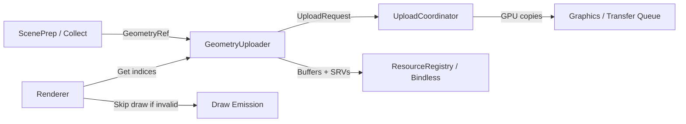
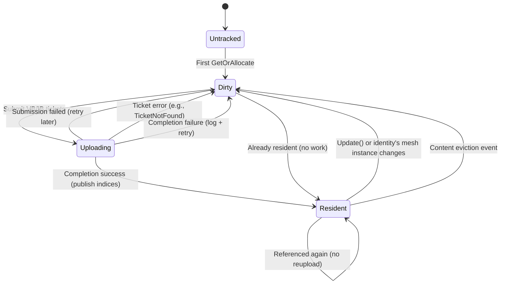

# GeometryUploader — Design and Operational Contract

## Purpose

`GeometryUploader` is the renderer-facing component responsible for turning CPU mesh data into GPU-resident geometry that shaders can access through bindless SRV indices. It provides:

- Stable geometry handles for ScenePrep and draw-record generation.
- GPU buffer allocation/resize and SRV registration for vertex and index buffers.
- Asynchronous upload scheduling via `UploadCoordinator`.
- A strict “never bind invalid indices” safety policy: when geometry is invalid or not yet resident, the renderer must render nothing for that item.

This document captures the *why* and the *how* of the current implementation, including contracts, invariants, lifecycle, and pitfalls.

## Scope and Non-Goals

### In scope

- Identity/handle interning at the LOD-mesh level.
- Residency management (dirty vs ready), upload scheduling, and safe publication of bindless indices.
- Hot-reload/update semantics for an existing handle.

### Out of scope (owned elsewhere)

- Global asset streaming policy and cache budget decisions.
- Choosing placeholder meshes when assets are missing.
- Instancing/batching policy (built on top of stable handles and SRV indices).

## System Context



### Key Collaborators

- **ScenePrep** provides `GeometryRef`, which contains the stable identity inputs and a mesh reference.
- **UploadCoordinator** schedules uploads and provides ticket completion status and results.
- **Graphics + ResourceRegistry** own GPU buffers, SRV creation, and descriptor heap bindings.

## Core Contracts (Must Not Drift)

### 1) Geometry Identity

**Identity is defined as:** `(data::AssetKey, lod_index)`.

- `AssetKey` is sourced from the owning geometry asset’s header.
- `lod_index` is the resolved LOD selection used for rendering.

**Non-contractual:** mesh pointer identity. Mesh instances may change (e.g., hot reload), but the identity does not.

### 2) Handle Meaning and Lifetime

- `engine::sceneprep::GeometryHandle` is a stable index into `GeometryUploader`’s internal entry table.
- Handles are stable for the renderer lifetime.
- Handle recycling is reserved for a future explicit policy decision.
- Invalid handle sentinel: `engine::sceneprep::kInvalidGeometryHandle`.

### 3) Bindless Index Meaning and Invalid Sentinel

- Shader-visible indices returned by `GeometryUploader` are `ShaderVisibleIndex` values.
- The invalid sentinel for these fields is `kInvalidShaderVisibleIndex`.

**Hard rule:** the renderer must never submit a draw that references invalid bindless indices.

### 4) Update / Hot-Reload

`Update(handle, geometry_ref)` is a hot-reload/editing path.

- It preserves the handle.
- It schedules rebuild/reupload work.
- It must not “rebind” a handle to a different `(AssetKey, lod)` identity.

The caller is responsible for ensuring that the updated mesh still corresponds to the same identity.

## Runtime Behavior Policy (User-Visible Semantics)

When geometry is invalid, not yet resident, evicted, or upload fails:

- Render nothing for that item (skip the draw or emit a zero-count draw).
- Do not fail the frame.
- Do not substitute placeholder/error meshes.
- Log the condition in a way that is actionable for content authors and engine developers.

This policy prevents shaders from being invoked with bad SRVs and keeps partial failures isolated.

## Public API (Renderer-Facing)

The public API is intentionally narrow (PIMPL-based) and frame-aware.

- `OnFrameStart(tag, slot)`
  - Advances the internal epoch and resets per-frame “ensure” state.
  - Retires completed uploads and refreshes internal pending-ticket lists.
  - Processes pending content eviction events and invalidates affected entries.
- `GetOrAllocate(geometry_ref)` / `GetOrAllocate(geometry_ref, is_critical)`
  - Interns the stable identity to a stable handle.
  - May mark an existing entry as critical (criticality is sticky and only upgrades).
  - Validates mesh input; returns invalid handle on invalid input.
- `Update(handle, geometry_ref)`
  - Validates mesh input.
  - Enforces same-identity update (debug assertion + early return on mismatch).
  - Marks the entry dirty and invalidates published indices until new data is confirmed uploaded.
- `EnsureFrameResources()`
  - Idempotent within a frame.
  - Schedules uploads for dirty entries and refreshes pending ticket lists.
- `GetShaderVisibleIndices(handle)`
  - Ensures frame resources (auto-calls `EnsureFrameResources()` if needed).
  - Returns vertex/index SRV indices for resident geometry, or invalid indices when not resident/invalid.
- `GetPendingUploadCount()` / `GetPendingUploadTickets()`
  - Observability hooks for renderer scheduling decisions (e.g., optional waiting).

## Internal Model

### Entry Table

Internally, `GeometryUploader` maintains a stable vector of per-handle entries and a map from identity to handle.

Each entry conceptually contains:

- Identity: `asset_key`, `lod_index`
- Mesh reference: shared ownership of the mesh instance used for upload and subsequent queries
- Dirtiness/residency tracking:
  - `is_dirty` (content/residency needs work)
  - `evicted` (content cache eviction observed for identity)
  - `generation` (monotonic per-entry generation; guards stale uploads)
  - `last_touched_epoch` (debug/diagnostics and future eviction policies)
- GPU resources:
  - Vertex buffer and optional index buffer
  - Published SRV indices (what the renderer may use)
  - Pending SRV indices (allocated/kept for the next publish)
- Upload tickets:
  - Optional pending ticket per buffer (VB/IB)
  - Pending generation per ticket to reject late completions

### “Touched” vs “Dirty”

The design intentionally separates:

- **Touched:** referenced by the scene this epoch/frame.
- **Dirty:** requires upload work because data is new/changed, resources are missing, or a previous attempt failed.

This prevents per-frame reuploads for stable geometry that is referenced every frame.

## Frame Lifecycle and Control Flow

### Typical Per-Frame Flow

```mermaid
sequenceDiagram
  participant R as Renderer
  participant S as ScenePrep
  participant G as GeometryUploader
  participant U as UploadCoordinator

  R->>G: OnFrameStart(tag, slot)
  note over G: Advance epoch, retire completed tickets

  S->>G: GetOrAllocate(GeometryRef [, critical])
  note over G: Intern identity -> stable handle

  R->>G: EnsureFrameResources()
  G->>U: Submit upload requests (VB/IB as needed)
  note over G: Idempotent within the frame

  R->>G: GetShaderVisibleIndices(handle)
  note over G: Returns indices if published; otherwise invalid
  R->>R: Skip draw if any required index invalid
```

### Idempotence Guarantee

`EnsureFrameResources()` is safe to call multiple times per frame. Internally, a per-frame flag prevents repeated scheduling work once the frame’s “ensure” has completed.

## Residency and Publication Rules

### Publication Model

Bindless indices are only *published* (i.e., returned as valid) after upload completion is confirmed successful.

- On update/hot-reload, previously published indices are invalidated for safety.
- The uploader keeps pending indices and tickets so it can replace data and
  publish atomically from the renderer’s perspective.
- Publication is skipped if the pending ticket’s generation no longer matches
  the entry (eviction or replacement).

### Entry State Machine



Interpretation:

- “Resident” means the published SRV indices are valid (vertex always, index only if the mesh is indexed).
- “Dirty” means at least one required resource is not published or must be regenerated.

## Upload Scheduling and Prioritization

### What Triggers Upload Work

An entry is considered for upload scheduling when:

- It is dirty, and
- It lacks a published SRV index for a required buffer, and
- It does not already have a pending upload ticket for that buffer.

This avoids duplicated submissions while still allowing retry after failures.

### Criticality

Callers may mark geometry as critical via the `GetOrAllocate(..., is_critical)` overload.

- Criticality is sticky: once an entry becomes critical, it remains so.
- Critical entries submit upload requests with higher priority.

## Ticket Retirement and Failure Semantics

Upload completion is tracked using `UploadCoordinator::IsComplete(ticket)`, which returns `std::expected<bool, UploadError>`.

**Retirement rules:**

- A ticket is retired only when `IsComplete()` returns a value and that value is `true`.
- If `IsComplete()` returns an error:
  - The error is logged.
  - For `UploadError::kTicketNotFound`, the ticket is dropped and the entry is marked dirty (terminal in practice due to tracker cleanup).
  - For other errors, the ticket is kept (best-effort retry/reevaluation next frame).
- If completion is successful but the upload result indicates failure, the entry is marked dirty and indices remain invalid.

This design ensures the system is robust against transient upload coordination failures and never publishes indices for failed uploads.

## Mesh Validation

Meshes are validated at the API boundary (`GetOrAllocate` and `Update`). Validation is designed to catch:

- Empty vertex buffers.
- Unreasonable sizes that could lead to excessive allocation.
- Non-finite vertex attributes (positions/normals/UVs).
- Index buffers that reference out-of-range vertices or invalid topology expectations.

**Contract outcome:** invalid meshes do not get a valid handle (allocation path) and do not mutate existing GPU state (update path).

## Shutdown and Resource Safety

`GeometryUploader` is renderer-lifetime owned and assumes the graphics backend remains valid for its lifetime.

On destruction:

- The uploader stops accepting work and releases resources via the graphics
  backend's deferred reclamation path where applicable.
- GPU buffers and views are unregistered from the resource registry as a
  best-effort cleanup.

This prevents descriptor registry leaks and reduces risk of freeing resources
still in use by the GPU.

## Typical Usage Models

### Scene Collection + Rendering

- ScenePrep resolves LOD and forms `GeometryRef` objects.
- The renderer calls `GetOrAllocate` for each referenced geometry and stores the resulting handles in draw records.
- Once per frame (or lazily), the renderer calls `EnsureFrameResources`.
- At draw emission time, the renderer queries indices via `GetShaderVisibleIndices(handle)`.
  - If any required SRV index is invalid, the draw is skipped (or made zero-count).

### Hot Reload / Editing

- The asset loader or editor triggers `Update(handle, geometry_ref)` with the same identity.
- The entry becomes dirty, published indices are invalidated, and the next ensure schedules uploads.
- Indices become valid again only after confirmed successful upload completion.

## Pitfalls and How to Avoid Them

- **Calling `Update()` with a different identity**
  - This violates the contract and is treated as a logic error (debug assert + no state change).
- **Submitting draws with invalid SRV indices**
  - This is a renderer bug. Always guard draws by checking returned indices.
- **Assuming mesh pointer identity is stable**
  - Hot-reload can change mesh instances. Identity is `(AssetKey, LOD)`.
- **Assuming “referenced this frame” implies “upload this frame”**
  - `GeometryUploader` intentionally avoids per-frame reupload; only dirty entries schedule uploads.
- **Logging per instance**
  - Missing geometry can affect many instances; prefer de-duplicated logging keyed by identity in higher-level systems if repeated warnings become noisy.
