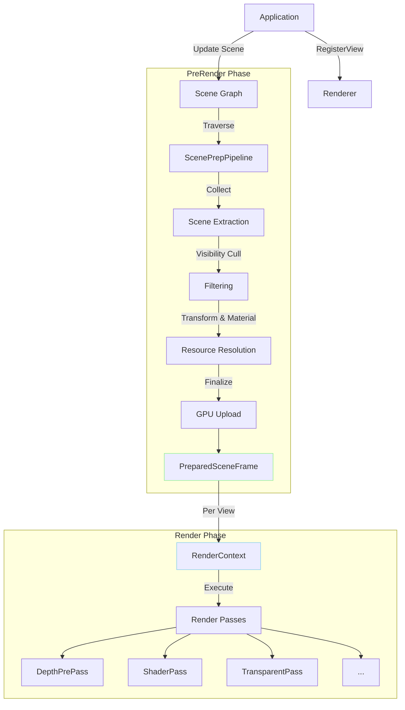
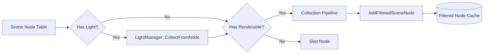
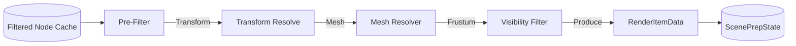
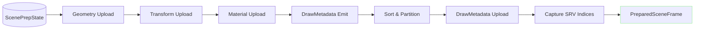
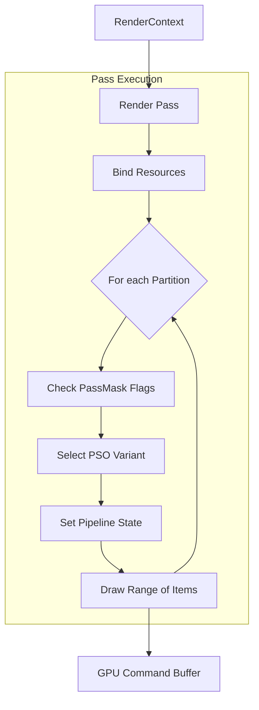
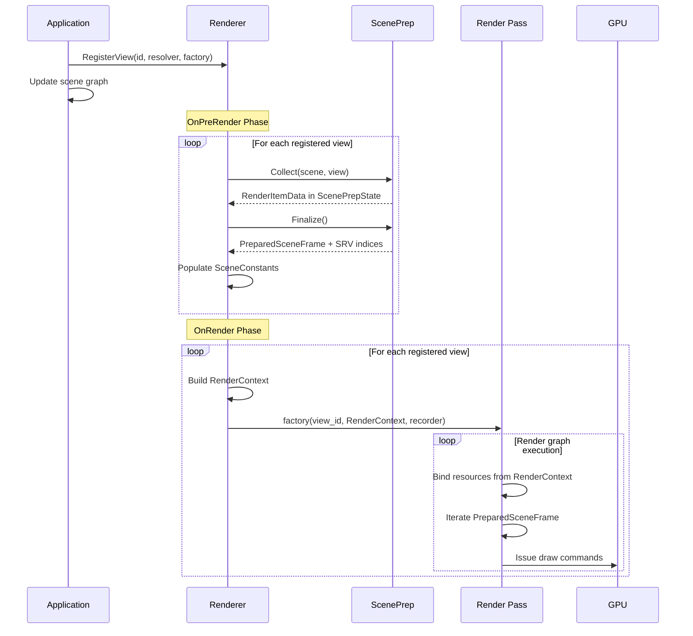

# Renderer Data Flow

This document describes the data flow through the Oxygen renderer pipeline,
focusing on how data moves from the application through scene preparation to
render pass execution. It is intended as a reference for understanding the
renderer's architecture and as a basis for future enhancements.

## Overview

The renderer operates on a **multi-view, per-frame pipeline** where each view
(camera) independently prepares its rendering data. The pipeline has three main
phases:

1. **Application Setup**: Register views and configure render graphs
2. **Scene Preparation (PreRender)**: Extract, cull, and prepare draw data
3. **Rendering (Render)**: Execute render passes using prepared data



## Multi-View Architecture

The renderer supports **multiple simultaneous views** (e.g., main camera,
shadow maps, reflection probes). Each view:

* Has a unique `ViewId` registered via `Renderer::RegisterView()`
* Provides a `ViewResolver` to extract camera/frustum information
* Provides a `RenderGraphFactory` that defines its render pass sequence
* Gets its own `PreparedSceneFrame` with view-specific culling and SRV indices

Data flow is **strictly per-view**: culling, transforms, draw lists, and
bindless descriptor slots are all captured per-view during scene preparation.

## Phase 1: Application Setup

Applications register each view with the renderer by providing two components:

```cpp
renderer->RegisterView(
    view_id,
    [](const ViewContext& ctx) -> ResolvedView { /* resolve camera */ },
    [](ViewId id, const RenderContext& rc, CommandRecorder& rec) -> co::Co<void> {
        /* execute render passes */
    }
);
```

**Data Flow**:

* `ViewId` → identifies the view throughout the frame
* `ViewResolver` → extracts camera position, matrices, frustum
* `RenderGraphFactory` → defines which passes execute and in what order

## Phase 2: Scene Preparation (OnPreRender)

For each registered view, the renderer runs the **ScenePrepPipeline**, which
transforms scene graph data into GPU-ready structures.

### 2.1 Collection Stage

The pipeline traverses the scene graph in **two phases**:

#### Frame Phase (First View Only)

Extracts **frame-global data** shared across all views:



**Frame Phase Activities**:

* **Light Extraction** (`LightManager`): Collects directional, point, and spot
  lights into CPU arrays. Applies gating rules:
  * Node must have `kVisible` flag
  * Light `affects_world` must be true
  * Excludes `Baked` mobility lights
  * Shadow eligibility requires both `casts_shadows` and node `kCastsShadows`
* **Renderable Filtering**: Identifies nodes with geometry for view-phase
  processing
* **Cached Node List**: Builds `filtered_scene_nodes` to avoid redundant
  traversal per view

#### View Phase (Per View)

Processes **view-specific geometry** using the cached node list:



**View Phase Extractors** (per-node pipeline):

* **Pre-Filter**: Skip disabled/invisible nodes
* **Transform Resolve**: Build world matrices from scene hierarchy
* **Mesh Resolver**: Locate mesh/material assets
* **Visibility Filter**: CPU frustum culling against view frustum
* **Producer**: Generate `RenderItemData` entries in `ScenePrepState`

### 2.2 Finalization Stage

After collection, the pipeline finalizes GPU-ready data:



**Finalization Steps**:

1. **Geometry Upload**: Ensure vertex/index buffers on GPU (lazy, cached)
2. **Transform Upload**: Upload world & normal matrices as structured buffers
3. **Material Upload**: Upload material constant buffers (if needed)
4. **Light Upload** (frame phase only): Upload `DirectionalLightBasic[]`,
   `DirectionalLightShadows[]`, and `PositionalLightData[]` to GPU structured
   buffers via `LightManager::EnsureFrameResources()`
5. **DrawMetadata Emit**: Generate per-draw GPU metadata (indices, flags)
6. **Sort & Partition**: Sort draws by pass/material/depth; build partition map
7. **DrawMetadata Upload**: Upload sorted metadata to GPU structured buffer
8. **Capture SRV Indices**: Record bindless descriptor slots for this view

Output: `PreparedSceneFrame` — immutable, view-specific snapshot containing
spans over finalized data and bindless descriptor indices.
all views are prepared, the renderer populates `SceneConstants` with
bindless descriptor slots:

* **Application-Owned Fields**: View/projection matrices, camera position (set
  per view by application)
* **Renderer-Owned Fields**: Frame timing, bindless descriptor slots, frame
  sequence number (injected by renderer with explicit tag)

**Descriptor Slot Lifetimes**:

* **Frame-Global**: Light buffer slots (directional, positional, shadows) —
  same across all views
* **Per-View**: Transform and DrawMetadata slots — vary per view due to
  view-specific culling

The populated `SceneConstants` structure is uploaded to a GPU constant buffer
(register `b1`) and referenced by `RenderContext::scene_constants`. Shaders
access this buffer to retrieve descriptor slots and view parameters.

## Phase 3: Rendering (OnRender)

For each view, the renderer executes its registered `RenderGraphFactory`,
passing a configured `RenderContext`.

### 3.1 RenderContext Structure

`RenderContext` is the **primary data carrier** for render passes, providing:

* **GPU Buffers**: Scene constants (view/camera/descriptor slots), optional
  material constants
* **View State**: Current `ViewId`, resolved view (camera/frustum),
  `PreparedSceneFrame` reference
* **Render Targets**: Framebuffer reference for output surfaces
* **Pass Control**: Enable/disable flags per pass type

### 3.2 Render Pass Execution

Passes consume `RenderContext` and use `PreparedSceneFrame` for draw dispatch:



**Pass Input/Output Summary**:

| Pass | Inputs | Outputs |
| ---- | ------ | ------- |
| **DepthPrePass** | `PreparedSceneFrame` (opaque/masked draws); `scene_constants`; Depth texture | Populated depth buffer |
| **ShaderPass** | `PreparedSceneFrame` (opaque/masked draws), `scene_constants`, Depth texture (read-only), Color texture | Rendered color buffer |
| **TransparentPass** | `PreparedSceneFrame` (transparent draws), `scene_constants`, Depth texture (read-only), Color texture | Blended transparent geometry |

### 3.3 Render Graph Execution Model

The render graph is a **coroutine** (`RenderGraphFactory`) that explicitly
sequences pass execution.

**Execution Pattern**:

```cpp
co_await pass->PrepareResources(context, recorder);
co_await pass->Execute(context, recorder);
```

**Pass Data Access**: Passes access `RenderContext` via `Context()` helper:

* `Context().framebuffer`: Render target configuration
* `Context().current_view.prepared_frame`: Draw data spans
* `Context().scene_constants`: Bindless descriptor slots
* Pass config: Explicit texture overrides (e.g., `ShaderPassConfig::color_texture`)
* `Context().GetPass<T>()`: Type-safe query for other registered passes

**Cross-Pass Communication**: `RenderContext` provides `GetPass<PassType>()`
for querying previously-executed passes (e.g., retrieving depth texture from
`DepthPrePass`). Render graph calls `RegisterPass()` after execution to make
passes available. Current implementation prefers explicit config-based wiring
over runtime queries.

### 3.4 Pipeline State Selection (Shader Permutations)

The renderer uses **dynamic PSO selection** based on per-partition flags rather
than compile-time shader permutations.

**PSO Variant Matrix**: Each pass pre-compiles 4 pipeline state variants:

| Alpha Mode | Culling |
| ---------- | ------- |
| Opaque | Back-face culling |
| Opaque | Double-sided (no culling) |
| Masked | Back-face culling |
| Masked | Double-sided (no culling) |

**Selection Contract**: During rendering, passes inspect `PassMask` flags on
each partition to select the appropriate PSO variant. Flags checked:

* `kMasked`: Use masked pixel shader (alpha testing)
* `kDoubleSided`: Disable back-face culling

**Data Flow Integration**:

1. **Scene Prep**: Material alpha mode and double-sided properties encoded into
   `PassMask` during `DrawMetadata` emission
2. **Sorting**: Draws partitioned by `PassMask` to group similar materials
3. **Rendering**: Pass switches PSO per partition, minimizing state changes

### 3.4 PreparedSceneFrame Consumption

**Partition Iteration Contract**: Passes iterate sorted partition ranges,
filtering by pass-relevant `PassMask` bits. Each partition represents a
contiguous range of draws with identical rendering properties.

**Per-Partition Operations**:

1. Check partition flags against pass criteria (opaque/masked/transparent)
2. Select appropriate PSO variant based on flags
3. Set pipeline state once per partition
4. Issue draw commands for range `[begin, end)`

**DrawMetadata Specification**: 64-byte GPU-facing struct containing per-draw
indirection:

* **Geometry**: Bindless vertex/index buffer SRV indices, mesh offsets/counts
* **Material**: Material registry handle
* **Transform**: Index into world/normal matrix arrays
* **Classification**: PassMask flags for filtering and PSO selection

**Shader Contract**: Vertex shaders receive draw index via root constant
(`SV_InstanceID`). Shaders fetch `DrawMetadata` from bindless structured buffer
(slot provided in `SceneConstants`), then use metadata indices to access
geometry, transforms, and materials through additional bindless descriptors.

This indirection enables GPU-driven rendering and minimizes CPU→GPU
bandwidth—only indices are transmitted per-draw, not full vertex/matrix data.

## Data Ownership & Lifetime

* **Scene Graph**: Owned by application, read-only during rendering
* **ScenePrepState**: Owned by renderer, per-frame reset, accumulates collected
  data
* **PreparedSceneFrame**: Immutable snapshot, spans valid until end of frame
* **RenderContext**: Transient, constructed per-view during OnRender
* **GPU Buffers**: Owned by renderer resource managers (UploadCoordinator,
  TransformUploader, etc.)

Passes **never own** render targets or buffers; they only bind and transition
resources provided via `RenderContext` or pass configuration.

## Bindless Descriptor Architecture

All draw data is accessed via **bindless descriptors** (unbounded SRV arrays).
Descriptor slots are captured at different stages:

**Per-View Slots** (captured in `PreparedSceneFrame` after finalization):

* `bindless_draw_metadata_slot`: DrawMetadata structured buffer
* `bindless_worlds_slot`: World transformation matrices
* `bindless_normals_slot`: Normal transformation matrices
* `bindless_materials_slot`: Material constant data

**Frame-Global Slots** (captured from `LightManager` after frame-phase
finalization):

* `bindless_directional_lights_slot`: Directional light array
* `bindless_directional_shadows_slot`: Directional shadow data
* `bindless_positional_lights_slot`: Point/spot light array

**Shader Access Pattern**: All slots are propagated into `SceneConstants`
constant buffer (register `b1`). Shaders use these slot indices to access
resources dynamically from the global descriptor heap, enabling resource
indirection without pipeline rebinds.

## Frame Execution Timeline



## Related documentation

* [Bindless Conventions](../bindless_conventions.md)
