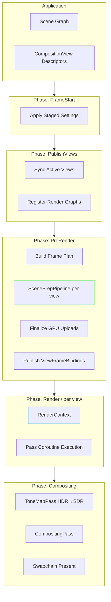
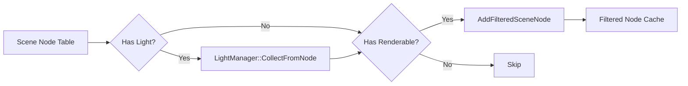
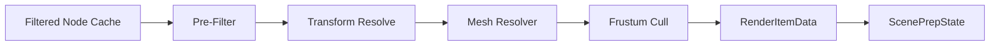
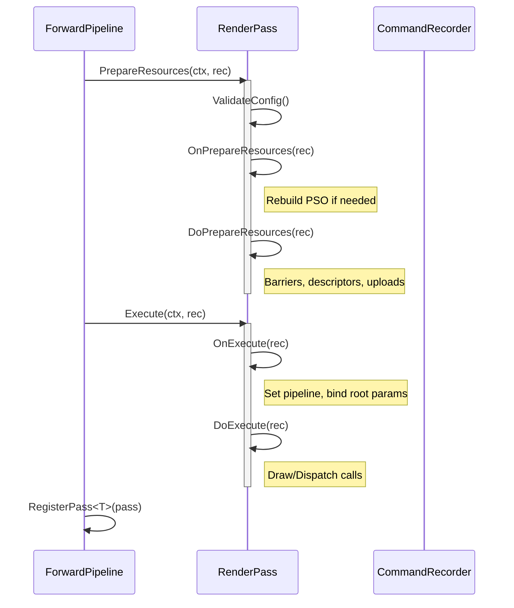
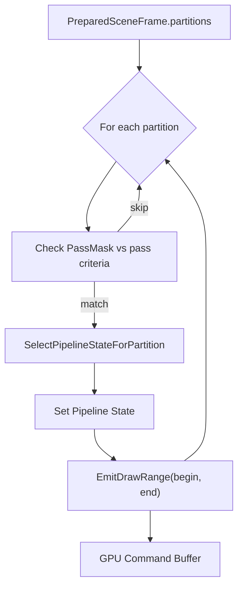
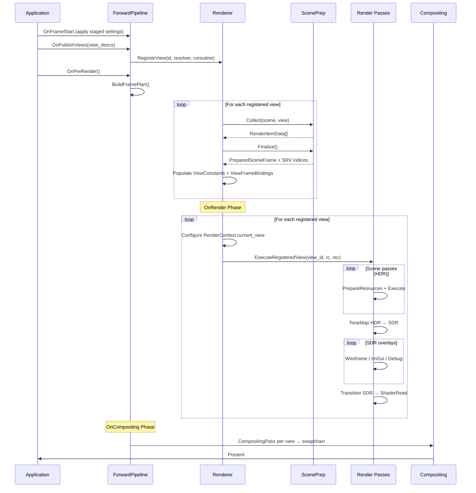

# Renderer Data Flow

This document describes the data flow through the Oxygen renderer pipeline,
focusing on how data moves from the application through scene preparation to
render pass execution and compositing. It is a companion to
[design-overview.md](design-overview.md), which covers pass taxonomy and
ordering.

## Overview

The renderer operates on a **multi-view, per-frame pipeline** orchestrated
by a `RenderingPipeline` implementation (currently `ForwardPipeline`). Each
frame proceeds through well-defined phases:

```mermaid
flowchart TB
    subgraph App [Application]
        Scene[Scene Graph]
        CompView[CompositionView Descriptors]
    end

    subgraph FrameStart [Phase: FrameStart]
        ApplySettings[Apply Staged Settings]
    end

    subgraph PublishViews [Phase: PublishViews]
        Sync[Sync Active Views]
        Register[Register Render Graphs]
    end

    subgraph PreRender [Phase: PreRender]
        FramePlan[Build Frame Plan]
        ScenePrep[ScenePrepPipeline per view]
        Finalize[Finalize GPU Uploads]
        BindPub[Publish ViewFrameBindings]
    end

    subgraph Render [Phase: Render / per view]
        RC[RenderContext]
        Passes[Pass Coroutine Execution]
    end

    subgraph Compositing [Phase: Compositing]
        ToneMap[ToneMapPass HDR→SDR]
        CompPass[CompositingPass]
        Final[Swapchain Present]
    end

    App --> FrameStart
    FrameStart --> PublishViews
    PublishViews --> PreRender
    PreRender --> Render
    Render --> Compositing

    style ScenePrep stroke:#90EE90
    style RC stroke:#87CEEB
```

## Multi-View Architecture

The engine supports multiple simultaneous views (main camera, shadow views,
editor viewports, tool overlays). Each view:

- Has a unique `ViewId` assigned by the `ViewLifecycleService`.
- Is described by a `CompositionView` descriptor (camera, viewport, z-order,
  render mode, feature flags).
- Gets its own `PreparedSceneFrame` with view-specific culling results.
- Executes its own render coroutine with a per-view `RenderContext` state.

View lifecycle (creation, SDR/HDR texture allocation, registration,
unpublication) is managed by internal pipeline services, not by individual
render passes.

## Phase 1: FrameStart

The pipeline commits staged configuration changes atomically at frame start.
Settings are staged from any thread via the pipeline API and applied on the
engine thread in `OnFrameStart`. This includes:

- Render mode (solid / wireframe / overlay wireframe)
- Shader debug mode
- Exposure mode and parameters
- Tone-mapping operator
- Ground grid configuration
- Depth pre-pass policy

## Phase 2: PublishViews

`OnPublishViews` synchronizes the active view set for the current frame:

1. **SyncActiveViews** — Reconciles `CompositionView` descriptors with the
   internal view registry. Creates/destroys HDR and SDR textures as needed.
2. **PublishViews** — Registers each active view with the `Renderer`, providing
   a per-view render coroutine (`ExecuteRegisteredView`).
3. **RegisterRenderGraphs** — Binds each view's render coroutine to the
   renderer for later execution.

## Phase 3: PreRender

### 3.1 Frame Plan Construction

`BuildFramePlan` evaluates each active view's descriptor and settings to
produce a `ViewRenderPlan`:

- **`HasSceneLinearPath()`** — Does this view render 3D scene content (HDR)?
- **`WantsDepthPrePass()`** — Should the depth pre-pass execute?
- **`RunSkyPass()`** — Should sky rendering execute?
- **`RunOverlayWireframe()`** — Should overlay wireframe execute after
  tonemapping?
- **`GetToneMapPolicy()`** — Normal vs. neutral (debug mode) tonemapping.
- **`EffectiveRenderMode()`** — Solid, wireframe, or overlay wireframe.

### 3.2 Scene Preparation (ScenePrepPipeline)

For each registered view, the renderer runs the `ScenePrepPipeline`, which
transforms scene graph data into GPU-ready arrays.

#### Frame Phase (First View Only)

Extracts **frame-global data** shared across all views:

```mermaid
flowchart LR
    Nodes[Scene Node Table] --> LightQ{Has Light?}
    LightQ -->|Yes| LightMgr["LightManager::CollectFromNode"]
    LightQ -->|No| RenderQ{Has Renderable?}
    LightMgr --> RenderQ
    RenderQ -->|Yes| Filter["AddFilteredSceneNode"]
    RenderQ -->|No| Skip[Skip]
    Filter --> Cache["Filtered Node Cache"]
```

**Frame phase activities:**

- **Light extraction** (`LightManager`): Collects directional, point, and
  spot lights into CPU arrays. Gating: node `kVisible`, light
  `affects_world`, excludes `Baked` mobility. Shadow eligibility requires
  both `casts_shadows` and node `kCastsShadows`.
- **Renderable filtering**: Identifies nodes with geometry for the view phase.
- **Cached node list**: Builds `filtered_scene_nodes` to avoid redundant
  traversal per view.

#### View Phase (Per View)

Processes **view-specific geometry** from the cached node list:

```mermaid
flowchart LR
    Cache[Filtered Node Cache] --> PreFilter[Pre-Filter]
    PreFilter --> Transform[Transform Resolve]
    Transform --> Mesh[Mesh Resolver]
    Mesh --> Frustum[Frustum Cull]
    Frustum --> Producer["RenderItemData"]
    Producer --> State["ScenePrepState"]
```

**View phase extractors** (per-node pipeline):

| Extractor | Responsibility |
| --- | --- |
| Pre-Filter | Skip disabled/invisible nodes |
| Transform Resolve | Build world matrices from scene hierarchy |
| Mesh Resolver | Locate mesh/material assets |
| Visibility Filter | CPU frustum culling against view frustum |
| Producer | Generate `RenderItemData` entries |

### 3.3 Finalization

After collection, the pipeline finalizes GPU data through a sequence of
resource binders and uploaders:

```mermaid
flowchart LR
    State["ScenePrepState"] --> Geo[GeometryUploader]
    Geo --> Xform[TransformUploader]
    Xform --> Mat[MaterialBinder]
    Mat --> Tex[TextureBinder]
    Tex --> DM[DrawMetadataEmitter]
    DM --> Sort[Sort & Partition]
    Sort --> Upload[GPU Upload]
    Upload --> SRV[Capture SRV Indices]
    SRV --> PSF["PreparedSceneFrame"]

    style PSF stroke:#90EE90
```

**Finalization steps:**

1. **GeometryUploader** — Ensures vertex/index buffers are on the GPU (lazy,
   cached by geometry handle).
2. **TransformUploader** — Uploads world and normal matrices as structured
   buffers; captures `bindless_worlds_slot` and `bindless_normals_slot`.
3. **MaterialBinder** — Resolves material constants and uploaded textures;
   captures `bindless_material_shading_slot`.
4. **TextureBinder** — Ensures material textures are registered in the
   descriptor heap.
5. **Light upload** (frame phase only) — `LightManager::EnsureFrameResources`
   uploads `DirectionalLightBasic[]`, `DirectionalShadowMetadata[]`, and
   `PositionalLightData[]` to GPU structured buffers.
6. **DrawMetadataEmitter** — Generates per-draw `DrawMetadata` records (64
   bytes each) with bindless indices, geometry offsets, material handles,
   transform indices, and `PassMask` flags.
7. **Sort & partition** — Sorts draws by `PassMask` and material; builds
   `PartitionRange[]` mapping each `PassMask` group to a contiguous draw
   range `[begin, end)`.
8. **GPU upload** — Uploads sorted `DrawMetadata[]` to a structured buffer;
   captures `bindless_draw_metadata_slot`.
9. **Capture SRV indices** — Records all bindless descriptor slots into the
   per-view `PreparedSceneFrame`.

Output: `PreparedSceneFrame` — an immutable, non-owning view (spans) over
renderer-owned arrays. Valid until end of frame.

### 3.4 ViewFrameBindings Publication

After all views are prepared, the renderer populates `ViewFrameBindings` — a
per-view structured buffer element referenced from `ViewConstants`:

**ViewFrameBindings layout (48 bytes):**

| Field | Points To | Scope |
| --- | --- | --- |
| `draw_frame_slot` | `DrawFrameBindings` | Per-view |
| `lighting_frame_slot` | `LightingFrameBindings` | Frame-global, updated per-view for culling grid |
| `environment_frame_slot` | `EnvironmentFrameBindings` | Frame-global |
| `view_color_frame_slot` | `ViewColorData` | Per-view |
| `scene_depth_slot` | Scene depth SRV | Per-view |
| `shadow_frame_slot` | `ShadowFrameBindings` | Frame-global |
| `virtual_shadow_frame_slot` | `VsmFrameBindings` | Per-view |
| `post_process_frame_slot` | Post-process routing | Reserved |
| `debug_frame_slot` | `DebugFrameBindings` | Per-view |
| `history_frame_slot` | History textures | Reserved |
| `ray_tracing_frame_slot` | RT routing | Reserved |

**DrawFrameBindings layout (32 bytes):**

| Field | Points To |
| --- | --- |
| `draw_metadata_slot` | `DrawMetadata[]` structured buffer |
| `transforms_slot` | World matrix array |
| `normal_matrices_slot` | Normal matrix array |
| `material_shading_constants_slot` | Material constants |
| `procedural_grid_material_constants_slot` | Grid material data |
| `instance_data_slot` | Per-draw instance metadata |

**Descriptor slot lifetimes:**

- **Frame-global**: Light buffer slots (directional, positional, shadows) —
  same across all views.
- **Per-view**: Transform, DrawMetadata, depth, color, culling grid slots —
  vary per view due to view-specific culling.

## Phase 4: Rendering (OnRender)

For each view, the renderer invokes the registered render coroutine with a
configured `RenderContext`.

### 4.1 RenderContext

`RenderContext` is the primary data carrier shared across all passes within
a single view's render graph execution:

| Field | Type | Description |
| --- | --- | --- |
| `view_constants` | `shared_ptr<Buffer>` | GPU CBV with view/projection/camera/bindings |
| `pass_target` | `Framebuffer*` | Bound framebuffer for current pass |
| `material_constants` | `shared_ptr<Buffer>` | Material constant buffer (optional) |
| `current_view` | `ViewSpecific` | Active view state (see below) |
| `frame_slot` | `frame::Slot` | Frame slot for transient resource coordination |
| `frame_sequence` | `SequenceNumber` | Monotonic frame counter |
| `delta_time` | `float` | Frame delta in seconds |
| `scene` | `Scene*` | Active scene (read-only during rendering) |
| `gpu_debug_manager` | `GpuDebugManager*` | Debug line buffer manager |

**ViewSpecific** fields within `current_view`:

| Field | Description |
| --- | --- |
| `view_id` | Current view identifier |
| `exposure_view_id` | View that owns auto-exposure for this view |
| `resolved_view` | Camera/frustum from view resolver |
| `prepared_frame` | `PreparedSceneFrame*` — draw data spans |
| `atmo_lut_manager` | Per-view atmosphere LUT state |
| `depth_prepass_mode` | Planner-selected early depth policy |
| `depth_prepass_completeness` | Live completeness state (updated by pipeline) |

### 4.2 Pass Execution Pattern

Every pass follows the same coroutine protocol:

```mermaid
sequenceDiagram
    participant Pipeline as ForwardPipeline
    participant Pass as RenderPass
    participant Rec as CommandRecorder

    Pipeline->>Pass: PrepareResources(ctx, rec)
    activate Pass
    Pass->>Pass: ValidateConfig()
    Pass->>Pass: OnPrepareResources(rec)
    Note right of Pass: Rebuild PSO if needed
    Pass->>Pass: DoPrepareResources(rec)
    Note right of Pass: Barriers, descriptors, uploads
    deactivate Pass

    Pipeline->>Pass: Execute(ctx, rec)
    activate Pass
    Pass->>Pass: OnExecute(rec)
    Note right of Pass: Set pipeline, bind root params
    Pass->>Pass: DoExecute(rec)
    Note right of Pass: Draw/Dispatch calls
    deactivate Pass

    Pipeline->>Pipeline: RegisterPass<T>(pass)
```

### 4.3 Draw Dispatch Pattern

Scene geometry passes consume `PreparedSceneFrame` partitions:

```mermaid
flowchart TB
    PSF["PreparedSceneFrame.partitions"] --> Loop{For each partition}
    Loop --> Check["Check PassMask vs pass criteria"]
    Check -->|match| Select["SelectPipelineStateForPartition"]
    Check -->|skip| Loop
    Select --> SetPSO["Set Pipeline State"]
    SetPSO --> Draw["EmitDrawRange(begin, end)"]
    Draw --> Loop
    Draw --> GPU["GPU Command Buffer"]
```

**Partition iteration contract:**

1. Check partition `PassMask` against the pass's accepted bits (e.g.,
   `DepthPrePass` accepts `kOpaque | kMasked`; `TransparentPass` accepts
   `kTransparent`).
2. Select the appropriate PSO variant based on `kDoubleSided` and `kMasked`
   flags.
3. Set pipeline state once per partition.
4. Bind `g_PassConstantsIndex` (DWORD1 at `b2`) once per pass.
5. For each draw in `[begin, end)`: bind `g_DrawIndex` (DWORD0 at `b2`),
   issue a `DrawIndexedInstanced` or `DrawInstanced` command.

### 4.4 DrawMetadata (GPU-Facing)

`DrawMetadata` is a 64-byte struct uploaded to a structured buffer SRV:

| Field | Size | Description |
| --- | --- | --- |
| `vertex_buffer_index` | 4B | Bindless SRV into vertex buffer |
| `index_buffer_index` | 4B | Bindless SRV into index buffer |
| `first_index` | 4B | Start index within mesh index buffer |
| `base_vertex` | 4B | Base vertex offset (signed) |
| `is_indexed` | 4B | 0 = non-indexed, 1 = indexed |
| `instance_count` | 4B | Number of instances (≥1) |
| `index_count` | 4B | Index count (indexed draws) |
| `vertex_count` | 4B | Vertex count (non-indexed draws) |
| `material_handle` | 4B | Stable `MaterialRegistry` handle |
| `transform_index` | 4B | Index into world/normal arrays |
| `instance_metadata_buffer_index` | 4B | Bindless index into instance metadata |
| `instance_metadata_offset` | 4B | Offset into instance metadata buffer |
| `flags` | 4B | `PassMask` bitfield |
| `transform_generation` | 4B | Transform-handle generation |
| `submesh_index` | 4B | Stable submesh id within geometry |
| `primitive_flags` | 4B | `DrawPrimitiveFlagBits` (shadow caster, main visible) |

**Shader access:** Vertex shaders receive the draw index via root constant
(`g_DrawIndex`). The shader fetches `DrawMetadata[g_DrawIndex]` from the
bindless structured buffer (slot in `DrawFrameBindings.draw_metadata_slot`),
then uses the metadata indices to access geometry, transforms, and materials
through further bindless descriptors.

### 4.5 ViewConstants (GPU-Facing)

`ViewConstants::GpuData` is a 256-byte struct uploaded to the root CBV at
register `b1`:

| Field | Description |
| --- | --- |
| `frame_seq_num` | Monotonic frame sequence number |
| `frame_slot` | Frame slot index for ring-buffer coordination |
| `time_seconds` | Wall-clock time since start |
| `view_matrix` | 4×4 view matrix |
| `projection_matrix` | 4×4 projection matrix |
| `camera_position` | World-space camera position (vec3) |
| `view_frame_bindings_bslot` | Top-level bindless slot for `ViewFrameBindings` |

`ViewConstants` uses lazy snapshot semantics: any setter bumps a monotonic
version, and `GetSnapshot()` rebuilds the GPU payload only when dirty.
Application owns view/projection/camera; renderer owns time/frame/bindings
(requires explicit `RendererTag` at call sites).

## Data Ownership & Lifetime

| Data | Owner | Lifetime |
| --- | --- | --- |
| Scene Graph | Application | Persistent, read-only during rendering |
| `ScenePrepState` | Renderer | Per-frame reset, accumulates collected data |
| `PreparedSceneFrame` | Renderer (spans over owned arrays) | Valid until end of frame |
| `RenderContext` | Renderer (pooled) | Per-view, reset between views |
| GPU buffers (geometry, transforms, materials, metadata) | Resource managers (`UploadCoordinator`, `TransformUploader`, etc.) | Managed per resource lifetime |
| Render targets (HDR, SDR, depth) | `ViewLifecycleService` | Per-view, recreated on resize |

Passes **never own** render targets or shared buffers. They bind and
transition resources provided via `RenderContext`, pass configuration, or
cross-pass queries.

## Frame Execution Timeline

```mermaid
sequenceDiagram
    participant App as Application
    participant Pipe as ForwardPipeline
    participant Renderer
    participant ScenePrep
    participant Pass as Render Passes
    participant Comp as Compositing

    App->>Pipe: OnFrameStart (apply staged settings)

    App->>Pipe: OnPublishViews(view_descs)
    Pipe->>Renderer: RegisterView(id, resolver, coroutine)

    App->>Pipe: OnPreRender()
    Pipe->>Pipe: BuildFramePlan()
    loop For each registered view
        Renderer->>ScenePrep: Collect(scene, view)
        ScenePrep-->>Renderer: RenderItemData[]
        Renderer->>ScenePrep: Finalize()
        ScenePrep-->>Renderer: PreparedSceneFrame + SRV indices
        Renderer->>Renderer: Populate ViewConstants + ViewFrameBindings
    end

    Note over Renderer: OnRender Phase
    loop For each registered view
        Renderer->>Renderer: Configure RenderContext.current_view
        Renderer->>Pass: ExecuteRegisteredView(view_id, rc, rec)
        loop Scene passes (HDR)
            Pass->>Pass: PrepareResources + Execute
        end
        Pass->>Pass: ToneMap HDR → SDR
        loop SDR overlays
            Pass->>Pass: Wireframe / ImGui / Debug
        end
        Pass->>Pass: Transition SDR → ShaderRead
    end

    Note over Pipe: OnCompositing Phase
    Pipe->>Comp: CompositingPass per view → swapchain
    Comp->>App: Present
```

## Related Documentation

- [design-overview.md](design-overview.md) — Pass taxonomy and ordering
- [Bindless Conventions](../bindless_conventions.md) — Root signature and
  descriptor management
- [depth_pre_pass.md](depth_pre_pass.md) — Depth Pre-Pass implementation
- [shader_pass.md](shader_pass.md) — Forward Shading Pass
- [light_culling.md](light_culling.md) — Light Culling Pass
