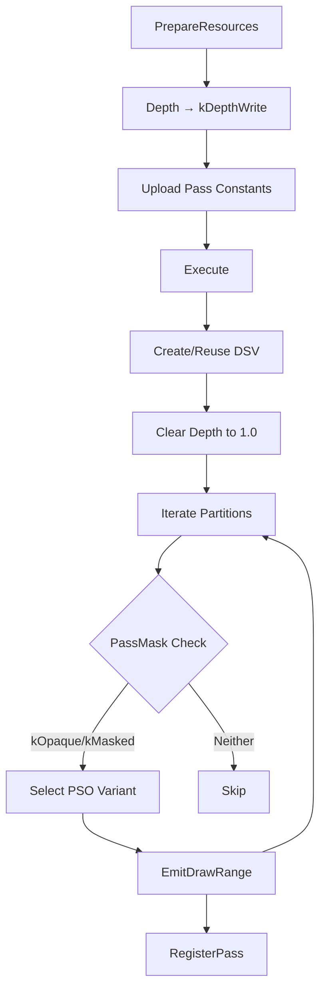

# DepthPrePass

Populates the depth buffer before main shading passes to minimize overdraw and
enable early depth testing. Critical for Forward+ rendering: provides depth
information for future light culling stages.

## Purpose

Renders **opaque and masked (alpha-tested) geometry only** to establish depth
hierarchy. Transparent geometry is explicitly excluded to prevent depth
occlusion artifacts during later blending stages.

## Configuration

| Field | Type | Required | Purpose |
| ----- | ---- | -------- | ------- |
| `depth_texture` | `shared_ptr<Texture>` | Yes | Output depth buffer; defines format/sample count |
| `debug_name` | `string` | No | Pass identifier (default: "DepthPrePass") |

**Viewport/Scissors**: Optional via `SetViewport()`/`SetScissors()`. Defaults
to full `depth_texture` dimensions.

**Framebuffer**: Queries `RenderContext::framebuffer` if present; depth texture
must match framebuffer's depth attachment when both exist.

## Core Design

### Pipeline State

**Fixed Properties** (all variants):

* **Depth/Stencil**: Test enabled (`kLessOrEqual`), write enabled, stencil off
* **Rasterizer**: Solid fill, front-face CCW
* **Framebuffer Layout**: Depth-only (no color targets)
* **Root Signature**: Bindless table (t0-unbounded) + SceneConstants (b1) +
  RootConstants (b2)

### Execution Model

**Per-Draw Indirection**: CPU binds `g_DrawIndex` root constant → GPU fetches
`DrawMetadata[g_DrawIndex]` → resolves vertex/transform/material buffers via
bindless indices.

### Shader Contract

**Vertex Shader** (all variants):

* **Input**: `SV_VertexID` (unused `SV_InstanceID`)
* **Data Chain**: `g_DrawIndex` → `DrawMetadata` → vertex buffer, transform
  buffer
* **Transform**: Local → World → View → Clip
* **Output**: `SV_POSITION`, `TEXCOORD0` (UV)

**Pixel Shader**:

* **Opaque variant** (`PS`): Empty (fixed-function depth write)
* **Masked variant** (`PS` + `ALPHA_TEST`): Alpha test with `clip()` discard

## Variability

### Permutation Matrix

**2 Axes × 2 Values = 4 PSO Variants**:

| Axis | Values | Encoded In | Affects |
| ---- | ------ | ---------- | ------- |
| **Alpha Mode** | Opaque / Masked | `PassMask::kMasked` | Shader defines: `ALPHA_TEST` |
| **Sidedness** | Single / Double | `PassMask::kDoubleSided` | Rasterizer: `kBack` vs. `kNone` culling |

**Variants**:

| Alpha Mode | Sidedness | PSO Variable | Shader (Entry + Defines) |
| ---------- | --------- | ------------ | ------------------------ |
| **Opaque** | Single-Sided (Back Cull) | `pso_opaque_single_` | `VS` + `PS` |
| **Opaque** | Double-Sided (No Cull) | `pso_opaque_double_` | `VS` + `PS` |
| **Masked** | Single-Sided (Back Cull) | `pso_masked_single_` | `VS` + `PS` + `ALPHA_TEST` |
| **Masked** | Double-Sided (No Cull) | `pso_masked_double_` | `VS` + `PS` + `ALPHA_TEST` |

### Mechanism

| Stage | Variability | Implementation |
| ----- | ----------- | -------------- |
| **Compile-Time** | 4 PSO descriptors | `CreatePipelineStateDesc()` builds all variants with distinct shader defines + rasterizer states |
| **Runtime** | Per-partition selection | CPU inspects `PassMask` flags, selects variant, calls `SetPipelineState()` once per partition |
| **Per-Draw** | Material properties | GPU fetches `MaterialConstants` via `g_DrawIndex`, evaluates flags dynamically (alpha test on/off, texture sampling) |

### Shader-Level Variation

**Masked Pixel Shader Decision Path**:

| Variation Point | Mechanism | Values | Source |
| --------------- | --------- | ------ | ------ |
| Alpha test enabled | Material flag | On/Off | `flags & MATERIAL_FLAG_ALPHA_TEST` |
| Opacity source | Texture presence | Texture/Constant | `opacity_texture_index != INVALID` |
| Cutoff threshold | Material/Pass constant | Float | `mat.alpha_cutoff` else `pass_constants.alpha_cutoff_default` |
| Texture sampling | Material flag | On/Off | `!(flags & MATERIAL_FLAG_NO_TEXTURE_SAMPLING)` |

**Pass Constants** (`DepthPrePassConstants`, 16 bytes):

| Field | Type | Purpose | Default |
| ----- | ---- | ------- | ------- |
| `alpha_cutoff_default` | `float` | Fallback alpha threshold | 0.5 |

**Access**: Bindless CBV via `g_PassConstantsIndex` root constant (b2).

### Rationale

| Reason | Benefit |
| ------ | ------- |
| **Performance** | Opaque path uses minimal PS (fixed-function depth); masked path limits sampling to alpha-tested materials |
| **Content Support** | Handles foliage (masked+double), architecture (opaque+single), vegetation cards (masked+single) |
| **State Efficiency** | Pre-compiled PSOs eliminate runtime branching; partitions group similar materials |
| **GPU Utilization** | Early-Z for opaque; explicit discard for masked prevents transparent pixel depth writes |

## Data Flow

**Input Dependencies**:

* `PreparedSceneFrame`: Per-view culled geometry with sorted partitions
* `RenderContext::scene_constants`: Bindless descriptor slots for draw
  metadata, transforms, materials
* `depth_texture` (config): Target depth buffer

**Output Products**:

* Populated depth buffer (state: `kDepthWrite`)
* Registered pass instance available for cross-pass queries

**Pass Exclusions**: Transparent geometry (`kTransparent` pass mask bit) is
intentionally excluded to prevent depth writes that would occlude later
blending operations.

## Integration Points

**Cross-Pass Communication**: After execution, subsequent passes can query
this pass via `RenderContext::GetPass<DepthPrePass>()` to access depth texture
or verify execution. Current implementation does not expose explicit resource
getters; depth texture flows via render graph configuration.

**Forward+ Pipeline Role**: Depth buffer output will serve as input for future
light culling stages (compute pass to build per-tile light lists from depth
pyramid).

## Future Enhancements

* **Depth Pyramid**: Generate mip chain for hierarchical Z culling
* **Light Culling Integration**: Supply depth to tiled/clustered light
  assignment compute pass
* **Early-Z Statistics**: Collect depth hierarchy for adaptive culling
* **Hi-Z Occlusion**: GPU-side occlusion queries for large objects

## Related Documentation

* [Data Flow](data_flow.md): Overall renderer pipeline and multi-view
  architecture
* [Bindless Conventions](../bindless_conventions.md): Descriptor slot management
