# Render Passes Design

## Overview

The Oxygen Engine uses a **Forward+ rendering architecture** implemented
through a modular, coroutine-based render pass system for modern explicit
graphics APIs (D3D12, Vulkan). Rendering is split into HDR scene passes,
tonemapping, and SDR compositing/overlay phases. Passes are orchestrated by
the `ForwardPipeline` via per-view coroutines that sequence pass execution.

This document covers the Forward+ technique, Oxygen's pass taxonomy and class
hierarchy, the ForwardPipeline orchestration model, cross-pass communication,
PSO management, and the bindless root signature contract.

## Forward+ Rendering

Forward+ (Tiled/Clustered Forward Shading) combines forward rendering
flexibility with efficient light culling to handle many dynamic lights.

### Classic Forward vs Forward+

Classic forward rendering evaluates all lights per draw call (**O(objects ×
lights)**). Forward+ partitions the frustum into spatial clusters and prunes
lights against each cluster's bounds, so each pixel evaluates only the lights
that actually affect its region.

### Pipeline Stages

A Forward+ frame conceptually proceeds through these stages:

1. **Depth Pre-Pass** — Render opaque/masked geometry depth-only. Enables
   early-Z rejection in later passes, feeds light culling and HZB
   construction, and provides the scene depth product.
2. **HZB Build** — Generate a hierarchical Z-buffer (min/max mip chain) from
   the full-resolution depth buffer for occlusion and VSM page requests.
3. **Light Culling** — A compute pass builds a 3D cluster grid from the view
   frustum and assigns each positional light to the clusters it overlaps.
4. **Shadow Passes** — Raster shadows (conventional cascaded shadow maps) and
   Virtual Shadow Map (VSM) passes produce shadow data consumed during
   forward shading.
5. **Sky & Atmosphere LUTs** — Compute passes precompute atmospheric scattering
   LUTs; a graphics pass renders the sky background behind scene geometry.
6. **Forward Shading** — Geometry is drawn with full PBR lighting (direct,
   IBL, shadows) in a single pass, sampling the per-cluster light list.
7. **Transparency** — Transparent geometry rendered with blending (depth read,
   no depth write), sharing the same lighting model.
8. **Auto Exposure** — A compute pass builds a luminance histogram from the
   HDR buffer and derives adapted exposure.
9. **Ground Grid / Debug Overlays** — Procedural overlays rendered into the
   HDR buffer before tonemapping.
10. **Tonemapping** — Converts the HDR buffer to SDR with exposure,
    tone-mapping operator, and gamma correction.
11. **SDR Overlays** — Wireframe overlay, ImGui tools, GPU debug draw pass —
    rendered directly into the SDR buffer.
12. **Compositing** — Alpha-blended blit of per-view SDR results into the
    swapchain backbuffer.

### Why Forward+

| Advantage | Explanation |
| --- | --- |
| Transparency support | All lighting lives in the forward shader; transparents receive identical lighting |
| MSAA compatibility | Forward rendering naturally supports hardware MSAA |
| Material flexibility | Arbitrary BRDFs without G-buffer constraints |
| Memory efficiency | No G-buffer storage required |
| Modern GPU fit | Compute-based light culling leverages GPU parallelism |

## Pass Class Hierarchy

All passes inherit from `RenderPass`, which provides the coroutine protocol,
naming, pass-constants management, and draw helpers. Two intermediate base
classes specialize for pipeline type:

```mermaid
classDiagram
    class RenderPass {
        <<abstract>>
        +PrepareResources(ctx, rec) Co~void~
        +Execute(ctx, rec) Co~void~
        #ValidateConfig()
        #DoPrepareResources(rec) Co~void~
        #DoExecute(rec) Co~void~
        #SetPassConstantsIndex(idx)
        #IssueDrawCallsOverPass(rec, bit)
        #EmitDrawRange(rec, records, begin, end, ...)
    }

    class GraphicsRenderPass {
        <<abstract>>
        #CreatePipelineStateDesc() GraphicsPipelineDesc
        #NeedRebuildPipelineState() bool
        #DoSetupPipeline(rec)
    }

    class ComputeRenderPass {
        <<abstract>>
        #CreatePipelineStateDesc() ComputePipelineDesc
        #NeedRebuildPipelineState() bool
    }

    RenderPass <|-- GraphicsRenderPass
    RenderPass <|-- ComputeRenderPass

    GraphicsRenderPass <|-- DepthPrePass
    GraphicsRenderPass <|-- ShaderPass
    GraphicsRenderPass <|-- TransparentPass
    GraphicsRenderPass <|-- SkyPass
    GraphicsRenderPass <|-- GroundGridPass
    GraphicsRenderPass <|-- WireframePass
    GraphicsRenderPass <|-- ToneMapPass
    GraphicsRenderPass <|-- CompositingPass
    GraphicsRenderPass <|-- GpuDebugDrawPass
    GraphicsRenderPass <|-- SkyCapturePass

    DepthPrePass <|-- ConventionalShadowRasterPass
    DepthPrePass <|-- VsmShadowRasterizerPass

    ComputeRenderPass <|-- LightCullingPass
    ComputeRenderPass <|-- SkyAtmosphereLutComputePass
    ComputeRenderPass <|-- ScreenHzbBuildPass
    ComputeRenderPass <|-- AutoExposurePass
    ComputeRenderPass <|-- GpuDebugClearPass
    ComputeRenderPass <|-- VsmPageRequestGeneratorPass
    ComputeRenderPass <|-- VsmInvalidationPass
    ComputeRenderPass <|-- VsmPageManagementPass
    ComputeRenderPass <|-- VsmPageFlagPropagationPass
    ComputeRenderPass <|-- VsmPageInitializationPass
    ComputeRenderPass <|-- VsmStaticDynamicMergePass
    ComputeRenderPass <|-- VsmHzbUpdaterPass
    ComputeRenderPass <|-- VsmProjectionPass

    RenderPass <|-- IblComputePass
```

### RenderPass Contract

Every pass follows a two-phase coroutine protocol:

1. **`PrepareResources(ctx, rec)`** → Validates config, rebuilds PSO if
   needed (`OnPrepareResources`), then calls `DoPrepareResources` for
   pass-specific barrier insertion, descriptor setup, and uploads.
2. **`Execute(ctx, rec)`** → Calls `OnExecute` (sets pipeline state, binds
   common root parameters), then `DoExecute` for draw/dispatch calls.

The `RenderContext` is accessible during both phases via `Context()`.

### GraphicsRenderPass Responsibilities

Handles graphics-pipeline lifecycle:

- Caches and lazily rebuilds PSOs via `CreatePipelineStateDesc()` /
  `NeedRebuildPipelineState()`.
- In `OnExecute`: sets the graphics pipeline, binds `ViewConstants` CBV at
  `b1`, binds the indices buffer, and binds the pass-constants index
  constant at `b2.DWORD1`.

### ComputeRenderPass Responsibilities

Handles compute-pipeline lifecycle identically (cache + lazy rebuild) and
sets the compute pipeline before `DoExecute`.

## Implemented Passes

### Scene Geometry & Shading

| Pass | Base | Domain | Documentation |
| --- | --- | --- | --- |
| `DepthPrePass` | `GraphicsRenderPass` | Depth-only raster (opaque + masked) | [depth_pre_pass.md](depth_pre_pass.md) |
| `ShaderPass` | `GraphicsRenderPass` | Forward PBR shading (opaque + masked) | [shader_pass.md](shader_pass.md) |
| `TransparentPass` | `GraphicsRenderPass` | Forward shading for blended geometry | — |
| `WireframePass` | `GraphicsRenderPass` | Constant-color wireframe (debug/overlay) | — |

### Lighting & Shadows

| Pass | Base | Domain | Documentation |
| --- | --- | --- | --- |
| `LightCullingPass` | `ComputeRenderPass` | Clustered light grid build | [light_culling.md](light_culling.md) |
| `ConventionalShadowRasterPass` | `DepthPrePass` | Cascaded shadow map raster | — |
| `VsmPageRequestGeneratorPass` | `ComputeRenderPass` | VSM page request generation | — |
| `VsmInvalidationPass` | `ComputeRenderPass` | VSM page invalidation | — |
| `VsmPageManagementPass` | `ComputeRenderPass` | VSM page allocation/eviction | — |
| `VsmPageFlagPropagationPass` | `ComputeRenderPass` | VSM coarse flag propagation | — |
| `VsmPageInitializationPass` | `ComputeRenderPass` | VSM new page initialization | — |
| `VsmShadowRasterizerPass` | `DepthPrePass` | VSM shadow depth raster | — |
| `VsmStaticDynamicMergePass` | `ComputeRenderPass` | VSM static/dynamic page merge | — |
| `VsmHzbUpdaterPass` | `ComputeRenderPass` | VSM HZB update | — |
| `VsmProjectionPass` | `ComputeRenderPass` | VSM screen-space shadow projection | — |

### Sky & Environment

| Pass | Base | Domain |
| --- | --- | --- |
| `SkyAtmosphereLutComputePass` | `ComputeRenderPass` | Atmosphere transmittance + sky-view LUT generation |
| `SkyPass` | `GraphicsRenderPass` | Fullscreen sky background render |
| `SkyCapturePass` | `GraphicsRenderPass` | Cubemap capture for IBL source |
| `IblComputePass` | `RenderPass` (direct) | Irradiance + prefilter cubemap filtering |

### Post-Processing & Compositing

| Pass | Base | Domain |
| --- | --- | --- |
| `AutoExposurePass` | `ComputeRenderPass` | Histogram-based adaptive exposure |
| `ScreenHzbBuildPass` | `ComputeRenderPass` | Hierarchical Z-buffer mip chain |
| `ToneMapPass` | `GraphicsRenderPass` | HDR → SDR tonemapping |
| `CompositingPass` | `GraphicsRenderPass` | Alpha-blended PIP compositing |
| `GroundGridPass` | `GraphicsRenderPass` | Procedural infinite grid |

### Debug

| Pass | Base | Domain |
| --- | --- | --- |
| `GpuDebugClearPass` | `ComputeRenderPass` | Clear GPU debug line buffer |
| `GpuDebugDrawPass` | `GraphicsRenderPass` | Render GPU debug lines to color buffer |

## ForwardPipeline Pass Ordering

The `ForwardPipeline` orchestrates per-view pass execution through
`ExecuteRegisteredView`. The following diagram shows the complete sequence
for a standard scene-linear view, including conditional branches:

```mermaid
flowchart TD
    Start([View Start]) --> TrackRes[Track View Resources]
    TrackRes --> ConfigTgt[Configure Pass Targets]
    ConfigTgt --> BindHdr[Bind HDR + Clear Depth/Color]

    BindHdr --> DbgClear{GPU Debug?}
    DbgClear -->|Yes| GpuDbgClear["GpuDebugClearPass<br/>(compute)"]
    DbgClear -->|No| ScenePasses

    GpuDbgClear --> ScenePasses

    subgraph ScenePasses [Scene Passes - HDR Buffer]
        direction TB
        ShadowQ{Shadows?}
        ShadowQ -->|Conv.| ConvShadow["ConventionalShadowRasterPass<br/>(depth-only raster)"]
        ShadowQ -->|None| DepthQ
        ConvShadow --> DepthQ

        DepthQ{Depth PrePass?}
        DepthQ -->|Yes| DPP["DepthPrePass<br/>(depth-only raster)"]
        DepthQ -->|No| SkyQ

        DPP --> HzbQ{Depth Complete?}
        HzbQ -->|Yes| HZB["ScreenHzbBuildPass<br/>(compute)"]
        HzbQ -->|No| SkyQ

        HZB --> SkyEarly{Sky before shading?}
        SkyEarly -->|depth OK| SKY1["SkyPass<br/>(fullscreen triangle)"]
        SkyEarly -->|No| LC

        SkyQ --> LC
        SKY1 --> LC

        LC["LightCullingPass<br/>(compute)"]

        LC --> VsmQ{VSM Shadows?}
        VsmQ -->|Yes| VSM["VSM Shell<br/>(9 compute + 1 raster)"]
        VsmQ -->|No| SP

        VSM --> SP
        SP["ShaderPass<br/>(forward PBR)"]

        SP --> SkyDeferred{Deferred Sky?}
        SkyDeferred -->|Yes| SKY2["SkyPass<br/>(deferred)"]
        SkyDeferred -->|No| TP

        SKY2 --> TP
        TP["TransparentPass<br/>(blended)"]
    end

    ScenePasses --> AutoExp{Auto Exposure?}
    AutoExp -->|Yes| AE["AutoExposurePass<br/>(compute, 3 dispatches)"]
    AutoExp -->|No| Grid

    AE --> Grid
    Grid{Grid?}
    Grid -->|Yes| GG["GroundGridPass<br/>(fullscreen)"]
    Grid -->|No| ToneMap

    GG --> ToneMap
    ToneMap["ToneMapPass<br/>(HDR → SDR)"]

    ToneMap --> SDR

    subgraph SDR [SDR Overlays]
        OvWire{Overlay Wire?}
        OvWire -->|Yes| OW["WireframePass<br/>(overlay)"]
        OvWire -->|No| ViewOv

        OW --> ViewOv[View Overlay Callback]
        ViewOv --> ImGui{ImGui Tools?}
        ImGui -->|Yes| IG[ImGuiPass]
        ImGui -->|No| DbgDraw

        IG --> DbgDraw
        DbgDraw{Debug Draw?}
        DbgDraw -->|Yes| GDD["GpuDebugDrawPass<br/>(graphics)"]
        DbgDraw -->|No| Transition
    end

    GDD --> Transition
    Transition[Transition SDR → Shader Read]
    Transition --> Done([Compositing])
```

## Cross-Pass Communication

Passes communicate through `RenderContext`, which holds a compile-time-indexed
registry of known pass types:

- **`RegisterPass<T>(pass*)`** — Called by the pipeline after a pass executes
  to publish its pointer.
- **`GetPass<T>()`** — Returns the registered pass pointer (or `nullptr` if
  not yet executed/registered).

The `KnownPassTypes` type list defines all registered pass types. Adding a
new pass type requires appending to this list (order determines index; do not
reorder for binary compatibility).

### Cross-Pass Data Contracts

| Consumer | Producer | Accessed Via |
| --- | --- | --- |
| `ShaderPass` | `DepthPrePass` | `ctx.GetPass<DepthPrePass>()->GetOutput()` → `DepthPrePassOutput` |
| `SkyPass` | `DepthPrePass` | Same depth output (reads depth for sky-vs-geometry test) |
| `TransparentPass` | `DepthPrePass` | Depth texture for read-only depth test |
| `GroundGridPass` | `DepthPrePass` | Depth SRV for depth-aware grid fading |
| `ScreenHzbBuildPass` | `DepthPrePass` | Full-resolution depth as HZB source |
| `VsmProjectionPass` | `DepthPrePass` | Scene depth for VSM screen-space projection |
| `ShaderPass` | `LightCullingPass` | Cluster grid/index list SRV indices via `LightingFrameBindings` |
| `TransparentPass` | `LightCullingPass` | Same cluster grid data |
| `ToneMapPass` | Scene passes | HDR color texture as source |
| `AutoExposurePass` | Scene passes | HDR color texture for histogram analysis |
| `IblComputePass` | `SkyCapturePass` | Captured cubemap SRV for IBL filtering |

## Bindless Root Signature

All passes share a single canonical root signature layout:

| Slot | Register | Type | Content |
| --- | --- | --- | --- |
| 0 | `t0, space0` | Descriptor Table | Unbounded SRV array (all bindless resources) |
| 1 | `b1, space0` | Root CBV | `ViewConstants` (view/projection, camera, `view_frame_bindings_bslot`) |
| 2 | `b2, space0` | Root Constants (2 DWORDs) | `g_DrawIndex` (DWORD0) + `g_PassConstantsIndex` (DWORD1) |

### Bindless Indirection Chain

Shaders resolve resources through a multi-level indirection:

1. `ViewConstants.view_frame_bindings_bslot` → `ViewFrameBindings`
2. `ViewFrameBindings.draw_frame_slot` → `DrawFrameBindings`
3. `DrawFrameBindings.draw_metadata_slot` → `DrawMetadata[]`
4. `DrawMetadata[g_DrawIndex]` → per-draw vertex/index/material/transform indices

This eliminates per-draw descriptor binding and enables GPU-driven rendering.

## PSO Management

### Geometry Pass Variants

Scene geometry passes (`DepthPrePass`, `ShaderPass`, `WireframePass`) maintain
4 PSO variants selected per partition:

| Variant | Alpha Mode | Culling |
| --- | --- | --- |
| `pso_opaque_single_` | `kOpaque` | Back-face cull |
| `pso_opaque_double_` | `kOpaque + kDoubleSided` | No cull |
| `pso_masked_single_` | `kMasked` | Back-face cull |
| `pso_masked_double_` | `kMasked + kDoubleSided` | No cull |

### TransparentPass Variants

`TransparentPass` maintains 2 PSO variants (single-sided / double-sided);
alpha blending is always enabled, depth write is always off.

### PSO Rebuild Triggers

PSOs are rebuilt lazily when `NeedRebuildPipelineState()` returns `true`.
Typical triggers: viewport/framebuffer size change, render target format
change, fill-mode or debug-mode change.

### PassMask-Driven Selection

During rendering, draws are sorted and partitioned by `PassMask`. Each
partition has a uniform `PassMask`, and the pass selects the matching PSO
variant before issuing the draw range. This minimizes state changes.

**Active `PassMaskBit` flags:**

| Bit | Meaning |
| --- | --- |
| `kOpaque` | Depth-writing opaque surfaces |
| `kMasked` | Alpha-tested (cutout) surfaces |
| `kTransparent` | Alpha-blended surfaces |
| `kDoubleSided` | Disable back-face culling |
| `kShadowCaster` | Participates in shadow submission |
| `kMainViewVisible` | Visible in the main camera view |

## DepthPrePassOutput

`DepthPrePass` publishes a structured output consumed by downstream passes:

| Field | Type | Description |
| --- | --- | --- |
| `depth_texture` | `Texture*` | Raw depth texture pointer |
| `canonical_srv_index` | `ShaderVisibleIndex` | Bindless SRV for depth reads |
| `width`, `height` | `uint32_t` | Depth buffer dimensions |
| `viewport`, `scissors` | Viewport/Scissors | Effective render region |
| `ndc_depth_range` | `NdcDepthRange` | `ZeroToOne` (D3D12 default) |
| `reverse_z` | `bool` | `true` — engine uses reversed-Z |
| `is_complete` | `bool` | All fields valid and depth populated |

Shadow raster passes (`ConventionalShadowRasterPass`,
`VsmShadowRasterizerPass`) reuse `DepthPrePass` infrastructure but
intentionally **do not** publish `DepthPrePassOutput` — their depth lives
in the shadow domain.

## See Also

- [data_flow.md](data_flow.md) — Scene preparation and GPU data flow
- [depth_pre_pass.md](depth_pre_pass.md) — Depth Pre-Pass implementation
- [shader_pass.md](shader_pass.md) — Forward Shading Pass implementation
- [light_culling.md](light_culling.md) — Light Culling Pass implementation
