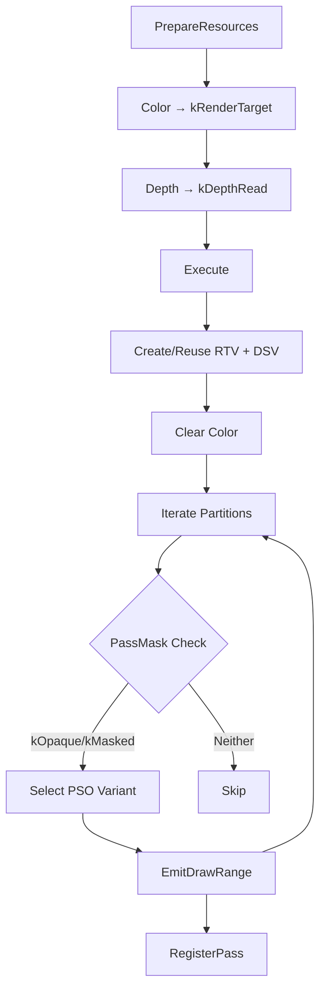

# ShaderPass

Forward shading pass that applies full PBR lighting and material evaluation to
opaque and masked geometry. Critical component of Forward+ rendering:
consumes depth buffer from DepthPrePass, performs shading with direct lighting
(directional + positional lights), and outputs final color.

## Purpose

Renders **opaque and masked (alpha-tested) geometry only** with full material
evaluation and lighting. Transparent geometry is explicitly excluded and
handled by TransparentPass.

## Configuration

| Field | Type | Required | Purpose |
| ----- | ---- | -------- | ------- |
| `color_texture` | `shared_ptr<Texture>` | No | Output color buffer; overrides framebuffer if set |
| `clear_color` | `optional<Color>` | No | Clear value; overrides texture descriptor default |
| `debug_name` | `string` | No | Pass identifier (default: "ShaderPass") |
| `fill_mode` | `FillMode` | No | Rasterizer fill mode (default: `kSolid`; wireframe disables culling) |

**Depth Attachment**: Determined from `RenderContext::framebuffer`. If present,
depth is used read-only (depth test enabled, depth write disabled).

## Core Design

### Pipeline State

**Fixed Properties** (all variants):

* **Depth/Stencil**: Test enabled if depth present (`kLessOrEqual`), write
  **disabled** (depth already populated by DepthPrePass), stencil off
* **Blend State**: Disabled (opaque rendering)
* **Framebuffer Layout**: Single color target + optional depth (read-only)
* **Root Signature**: Bindless table (t0-unbounded) + SceneConstants (b1) +
  RootConstants (b2) + EnvironmentDynamicData (b3)

**Variable Properties**:

* **Rasterizer Fill Mode**: Solid (default) or wireframe (from config)
* **Culling**: Back-face or none (per-partition, based on material sidedness)

### Execution Model

**Per-Draw Indirection**: CPU binds `g_DrawIndex` root constant → GPU fetches
`DrawMetadata[g_DrawIndex]` → resolves vertex/transform/material/lighting
buffers via bindless indices.

### Shader Contract

**Vertex Shader** (`VS`, all variants):

* **Input**: `SV_VertexID` (indexed/non-indexed geometry support)
* **Data Chain**: `g_DrawIndex` → `DrawMetadata` → vertex/index/transform
  buffers
* **Transform**: Local → World → View → Clip
* **TBN Calculation**: Normal matrix for normals; world matrix for
  tangent/bitangent
* **Output**: `SV_POSITION`, `COLOR`, `TEXCOORD0` (UV), `TEXCOORD1` (world
  pos), `NORMAL` (world normal), `TANGENT`, `BINORMAL`

**Pixel Shader**:

* **Opaque variant** (`PS`): Full PBR lighting without alpha test
* **Masked variant** (`PS` + `ALPHA_TEST`): Alpha test (clip) before shading

## Variability

### Permutation Matrix

**2 Axes × 2 Values = 4 PSO Variants**:

| Axis | Values | Encoded In | Affects |
| ---- | ------ | ---------- | ------- |
| **Alpha Mode** | Opaque / Masked | `PassMask::kMasked` | Shader defines: `ALPHA_TEST` |
| **Sidedness** | Single / Double | `PassMask::kDoubleSided` | Rasterizer: `kBack` vs. `kNone` culling |

**Variants**:

| Alpha Mode | Sidedness | PSO Variable | Shader (Entry + Defines) |
| ---------- | --------- | ------------ | ------------------------ |
| **Opaque** | Single-Sided (Back Cull) | `pso_opaque_single_` | `VS` + `PS` |
| **Opaque** | Double-Sided (No Cull) | `pso_opaque_double_` | `VS` + `PS` |
| **Masked** | Single-Sided (Back Cull) | `pso_masked_single_` | `VS` + `PS` + `ALPHA_TEST` |
| **Masked** | Double-Sided (No Cull) | `pso_masked_double_` | `VS` + `PS` + `ALPHA_TEST` |

### Mechanism

| Stage | Variability | Implementation |
| ----- | ----------- | -------------- |
| **Compile-Time** | 4 PSO descriptors | `CreatePipelineStateDesc()` builds all variants with distinct shader defines + rasterizer states |
| **Runtime** | Per-partition selection | CPU inspects `PassMask` flags, selects variant, calls `SetPipelineState()` once per partition |
| **Per-Draw** | Material properties | GPU fetches `MaterialConstants` via `g_DrawIndex`, samples textures dynamically (base color, normal, metalness, roughness, AO, opacity) |
| **Per-Frame** | Lighting data | GPU accesses directional/positional light arrays via bindless slots in SceneConstants |

### Shader-Level Variation

**Material Evaluation** (both PS variants):

| Variation Point | Mechanism | Values | Source |
| --------------- | --------- | ------ | ------ |
| Texture sampling enabled | Material flag | On/Off | `!(flags & MATERIAL_FLAG_NO_TEXTURE_SAMPLING)` |
| Base color texture | Texture presence | Texture/Constant | `base_color_texture_index != INVALID` |
| Normal map | Texture presence | Texture/Vertex normal | `normal_texture_index != INVALID` |
| Metalness texture | Texture presence | Texture/Constant | `metalness_texture_index != INVALID` |
| Roughness texture | Texture presence | Texture/Constant | `roughness_texture_index != INVALID` |
| AO texture | Texture presence | Texture/Constant | `ao_texture_index != INVALID` |

**Alpha Testing** (ALPHA_TEST permutation only):

| Variation Point | Mechanism | Values | Source |
| --------------- | --------- | ------ | ------ |
| Alpha test enabled | Material flag | On/Off | `flags & MATERIAL_FLAG_ALPHA_TEST` |
| Opacity source | Texture presence | Texture/Constant | `opacity_texture_index != INVALID` |
| Cutoff threshold | Material constant | Float | `mat.alpha_cutoff` else 0.5 fallback |

**Lighting Accumulation** (both PS variants):

* **Directional Lights**: Iterate `DirectionalLightBasic` array (slot:
  `bindless_directional_lights_slot`)
* **Positional Lights**: Iterate `PositionalLightData` array (slot:
  `bindless_positional_lights_slot`)
* **Lighting Model**: GGX specular (Cook-Torrance BRDF) + Lambert diffuse

**PBR Surface Model**:

* **Fresnel**: Schlick approximation, `F0` derived from base color + metalness
* **Normal Distribution**: GGX/Trowbridge-Reitz
* **Geometry**: Smith GGX height-correlated visibility term
* **Energy Conservation**: Diffuse scaled by `(1 - metalness) * (1 - F)`

### Rationale

| Reason | Benefit |
| ------ | ------- |
| **Early-Z Efficiency** | Depth writes disabled; relies on DepthPrePass for depth hierarchy; avoids redundant depth calculations |
| **Material Flexibility** | Per-material texture presence flags enable dynamic sampling; no PSO rebuild per texture configuration |
| **Lighting Scalability** | Bindless light arrays support variable light counts per frame without shader recompilation |
| **Fill Mode Support** | Wireframe mode for debugging; automatically disables culling for edge visibility |

## Data Flow

**Inputs**:

* `PreparedSceneFrame`: Per-view culled geometry with sorted partitions
* `RenderContext::scene_constants`: Bindless descriptor slots for geometry,
  materials, lights
* `RenderContext::framebuffer`: Optional depth attachment (read-only DSV)
* `color_texture`: Target color buffer (from config or framebuffer)
* **Lighting Data** (frame-global):
  * Directional lights (`bindless_directional_lights_slot`)
  * Positional lights (`bindless_positional_lights_slot`)
* **Environment Data** (b3 CBV):
  * Camera position, exposure, ambient settings

**Outputs**:

* Populated color buffer (state: `kRenderTarget`) with shaded opaque/masked
  geometry
* Registered pass instance (queryable via `GetPass<ShaderPass>()`)

**Exclusions**: Transparent geometry (`kTransparent` bit) skipped; handled by
TransparentPass with blending enabled.

## Future Enhancements

**Environment System Integration** (SceneEnvironment components):

* **SkyLight IBL**: Integrate diffuse irradiance + specular prefilter sampling
  from `SkyLight` component (supports captured scene or specified cubemap
  sources)
* **Fog Integration**: Add exponential height fog evaluation per-pixel (analytic
  fog from `Fog` component)
* **Sky Background**: Composite sky after opaque rendering (evaluates
  `SkyAtmosphere` or `SkySphere` fallback based on component presence)

**Direct Lighting Extensions**:

* **Shadow Mapping**: Integrate cascade shadow maps (directional) + per-object
  shadow maps (spot/point) into forward lighting evaluation
* **Material PBR Extensions**: Clearcoat, sheen, anisotropy (additional PBR
  layers)
* **Transmission/Subsurface**: Transmission term for foliage/glass, SSS for skin

**Forward+ Optimizations** (light culling):

* **Tiled Light Culling**: Compute pass to build per-tile light lists from depth
  buffer; reduces lighting cost for high light counts
* **Clustered Light Culling**: 3D grid-based culling (better than 2D tiles for
  depth discontinuities)

**Separate Passes** (screen-space/post-process):

* **Volumetric Fog**: Compute froxel volume + integration (alternative to
  analytic fog for advanced scattering)
* **Volumetric Clouds**: Raymarch cloud layer with temporal reprojection
  (separate from forward shading)
* **SSAO**: Screen-space ambient occlusion compute pass
* **Motion Vectors**: Optional pass for temporal anti-aliasing
* **Screen-Space Reflections**: Localized reflections (supplements SkyLight IBL)

## Related Documentation

* [DepthPrePass](depth_pre_pass.md): Depth buffer population (prerequisite)
* [Data Flow](data_flow.md): Overall renderer pipeline and multi-view
  architecture
* [Bindless Conventions](../bindless_conventions.md): Descriptor slot management
