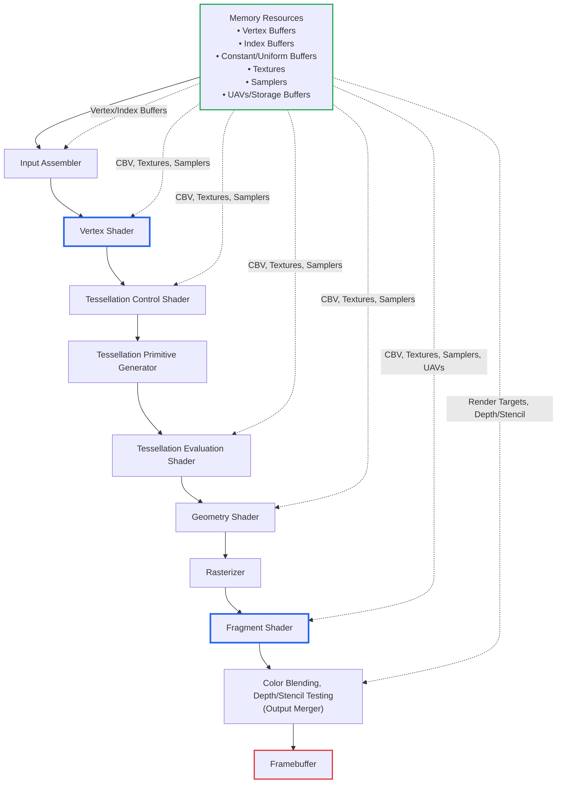
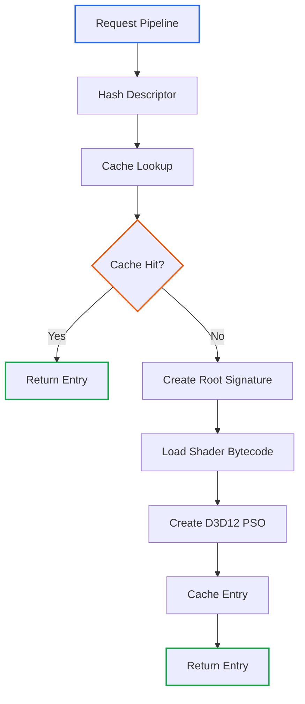

# Graphics Pipeline and Pipeline State

## Introduction

Modern graphics APIs like D3D12 and Vulkan use a monolithic pipeline state
object (PSO) model for rendering. A PSO encapsulates all fixed-function and
programmable state (shaders, input layouts, rasterizer, depth-stencil, blend
states, etc.) into a single, immutable object. This approach enables the driver
to validate and optimize the pipeline up front, resulting in better performance
and predictability compared to older, piecemeal state-setting APIs.

In bindless rendering, instead of binding individual resources (textures,
buffers) per draw call, large arrays of resources are made available to shaders,
which access them using indices. This greatly reduces CPU overhead and increases
flexibility and scalability for complex scenes.

## Modern Graphics Pipeline

Below is a diagram of the modern graphics pipeline. Arrows indicate which
resources (vertex buffers, index buffers, constant/uniform buffers, textures,
etc.) are accessed at each stage, closely matching the D3D12 and Vulkan models.

**Customization Points (mapped to our design):**

| Pipeline Stage | Configuration Source | Notes |
| --- | --- | --- |
| Vertex Shader | `GraphicsPipelineDesc` | Required for graphics pipelines |
| Pixel/Fragment Shader | `GraphicsPipelineDesc` | Required for graphics pipelines |
| Tessellation Shaders | `GraphicsPipelineDesc` | Optional hull/domain stages |
| Geometry Shader | `GraphicsPipelineDesc` | Optional |
| Rasterizer State | `RasterizerStateDesc` | Fill mode, culling, depth bias |
| Depth-Stencil State | `DepthStencilStateDesc` | Depth/stencil test configuration |
| Blend State | `BlendTargetDesc` | Per-render-target blending |
| Framebuffer Layout | `FramebufferLayoutDesc` | Render target formats, MSAA |
| Dynamic State | Set at draw time | Viewport, scissors (not baked into PSO) |

**Bindless Resource Access:**

- Resource arrays (textures, buffers) are accessible in shaders via SM 6.6
  `ResourceDescriptorHeap[]` and `SamplerDescriptorHeap[]` indexing.

- The engine uses a unified root signature contract shared by all render
  passes. For the authoritative root signature layout, see
  `shader-system.md` §1.

- For descriptor allocation, resource/view registration, and automatic table
  updates, see `design/BindlessRenderingDesign.md`.

**PSO and Bindless Workflow:**

This design is focused solely on modern D3D12 and Vulkan APIs, with no backward
compatibility requirements. It leverages the strengths of immutable pipeline
state and bindless resource access for maximum efficiency and flexibility in
contemporary 3D engines.

## Design Principles

The Oxygen Graphics layer is architected around a clear separation of
backend-agnostic interfaces and backend-specific implementations. The core
philosophy is to provide a modern, explicit, and type-safe API for pipeline and
resource management, while enabling high performance and flexibility across
multiple graphics APIs (such as D3D12 and Vulkan).

Key design principles for pipeline support in Oxygen:

- **Backend-Agnostic Abstraction:** The `Common` layer defines all core types,
  interfaces, and contracts for pipelines, descriptors, and resources. This
  ensures that application and engine code is written against a stable,
  API-neutral interface, maximizing portability and testability.

- **Backend Specialization via Composition:** Backend-specific implementations
  (e.g., D3D12) hook into the `Common` layer by implementing the required
  interfaces and extending the core abstractions. This is achieved through
  composition and dependency injection, not inheritance, allowing for
  backend-specific optimizations without polluting the core API.

- **Explicit, Strongly-Typed State:** Pipeline state is described using
  composable, strongly-typed descriptors (e.g., `GraphicsPipelineDesc`,
  `RasterizerStateDesc`). This approach leverages C++ features like `enum class`
  and `std::optional` for clarity, safety, and future extensibility.

- **Immutable Pipeline State Objects:** Pipeline state objects (PSOs) are
  immutable after creation, mirroring the design of modern APIs. This enables
  upfront validation and driver optimization, and ensures predictable rendering
  behavior.

- **Bindless Resource Model:** The engine uses a bindless resource model, where
  large arrays of resources (textures, buffers, etc.) are made available to
  shaders via indices. The `ResourceRegistry` and `DescriptorAllocator` manage
  registration, indexing, and descriptor table updates, abstracting away
  API-specific details while ensuring efficient access and update.

- **Thread Safety and Lifetime Management:**

  - Pipeline state objects (PSOs) themselves are immutable after creation and do
    not require synchronization for use—once constructed, they are only read
    from multiple threads.

  - The process of creating, looking up, or caching PSOs is thread-safe.
    Synchronization is required only during creation and registration phases
    to avoid redundant PSO creation and ensure correct sharing.

  - Resource lifetimes and descriptor management are handled with explicit
    ownership and thread-safe registries, ensuring correctness and predictable
    behavior even in complex, multi-threaded rendering environments.

- **Coroutine-Based Asynchronous Execution:** Render passes use OxCo coroutines
  for resource preparation and execution, enabling fine-grained scheduling and
  non-blocking GPU work.

- **Minimal Overhead, Maximal Control:** The API avoids hidden state and
  implicit behavior, giving advanced users full control over resource and
  pipeline management, while providing sensible defaults and helpers for common
  scenarios.

## Pipeline State Abstractions

The pipeline state system is implemented as a layered architecture with
backend-agnostic descriptors in the `Common` layer and backend-specific
translation in the D3D12 (and future Vulkan) layers.

### Core Types (`src/Oxygen/Graphics/Common/PipelineState.h`)

#### Rasterizer State

`RasterizerStateDesc` controls polygon rasterization:

| Field | Type | Default | Description |
| --- | --- | --- | --- |
| `fill_mode` | `FillMode` | `kSolid` | Solid or wireframe rendering |
| `cull_mode` | `CullMode` | `kBack` | Face culling (none/front/back/both) |
| `front_counter_clockwise` | `bool` | `true` | Winding order for front faces |
| `depth_bias` | `float` | `0.0` | Constant depth offset |
| `depth_clip_enable` | `bool` | `true` | Depth clipping |
| `multisample_enable` | `bool` | `false` | MSAA enable |

Static factory methods provide common presets: `NoCulling()`, `BackFaceCulling()`,
`WireframeNoCulling()`, etc.

#### Depth-Stencil State

`DepthStencilStateDesc` controls depth and stencil buffer operations:

| Field | Type | Default | Description |
| --- | --- | --- | --- |
| `depth_test_enable` | `bool` | `false` | Enable depth testing |
| `depth_write_enable` | `bool` | `false` | Enable depth writes |
| `depth_func` | `CompareOp` | `kLess` | Depth comparison function |
| `stencil_enable` | `bool` | `false` | Enable stencil testing |
| `stencil_read_mask` | `uint8_t` | `0xFF` | Stencil read mask |
| `stencil_write_mask` | `uint8_t` | `0xFF` | Stencil write mask |

#### Blend State

`BlendTargetDesc` defines per-render-target blending:

| Field | Type | Default | Description |
| --- | --- | --- | --- |
| `blend_enable` | `bool` | `false` | Enable blending |
| `src_blend` | `BlendFactor` | `kOne` | Source color factor |
| `dest_blend` | `BlendFactor` | `kZero` | Destination color factor |
| `blend_op` | `BlendOp` | `kAdd` | Color blend operation |
| `write_mask` | `ColorWriteMask` | `kAll` | Channel write mask |

Alpha blending has separate source/destination/operation fields.

#### Framebuffer Layout

`FramebufferLayoutDesc` specifies the attachment configuration:

| Field | Type | Description |
| --- | --- | --- |
| `color_target_formats` | `std::vector<Format>` | Color attachment formats |
| `depth_stencil_format` | `std::optional<Format>` | Optional depth/stencil format |
| `sample_count` | `uint32_t` | MSAA sample count (1 = no MSAA) |
| `sample_quality` | `uint32_t` | MSAA quality level |

### Graphics Pipeline Descriptor

`GraphicsPipelineDesc` aggregates all state for a graphics pipeline. It is
constructed exclusively via its `Builder` class to ensure validation:

**Required fields:**

- Vertex shader (`ShaderRequest`)
- Pixel/fragment shader (`ShaderRequest`)
- At least one color target format or depth/stencil format

**Optional fields:**

- Geometry, hull, domain shaders
- Primitive topology (default: triangle list)
- Rasterizer, depth-stencil, blend states
- Root bindings for custom root signature layout
- Debug name

The builder validates all required fields at build time and throws
`std::runtime_error` on missing requirements.

### Compute Pipeline Descriptor

`ComputePipelineDesc` describes a compute pipeline:

**Required fields:**

- Compute shader (`ShaderRequest`)

**Optional fields:**

- Root bindings
- Debug name

### Shader Request

`ShaderRequest` identifies a shader for pipeline creation:

| Field | Type | Description |
| --- | --- | --- |
| `stage` | `ShaderType` | Shader stage (vertex, pixel, compute, etc.) |
| `source_path` | `std::string` | Path to shader source (relative to shaders dir) |
| `entry_point` | `std::string` | Shader entry point function |
| `defines` | `std::vector<ShaderDefine>` | Optional preprocessor defines |

Shader requests are canonicalized (normalized paths, sorted defines) before
hashing to ensure stable cache keys.

### Root Bindings

Root bindings define the pipeline's root signature/descriptor set layout:

| Binding Type | Description |
| --- | --- |
| `DescriptorTableBinding` | Bindless descriptor table (SRV/UAV/CBV/sampler) |
| `PushConstantsBinding` | Root constants (32-bit values) |
| `DirectBufferBinding` | Direct CBV/SRV/UAV binding |
| `DirectTextureBinding` | Direct texture binding |

Each `RootBindingItem` specifies register/space, shader visibility, and binding
data. Root parameter indices are assigned automatically by the builder.

### Hashing

Both `GraphicsPipelineDesc` and `ComputePipelineDesc` provide:

- `HashGraphicsPipelineDesc()` / `HashComputePipelineDesc()` free functions
- `std::hash` specializations for use in hash maps

Hashing covers all fields including shaders, states, and root bindings.

## CommandRecorder Pipeline Binding

The `CommandRecorder` class (`src/Oxygen/Graphics/Common/CommandRecorder.h`)
is responsible for recording GPU commands. For pipeline state:

**Key methods:**

- `SetPipelineState(GraphicsPipelineDesc)` — Binds a graphics PSO
- `SetPipelineState(ComputePipelineDesc)` — Binds a compute PSO

**Contract:**

- The CommandRecorder does **not** create PSOs. It requests them from the
  backend's pipeline cache and binds the returned native PSO.
- When `SetPipelineState` is called, the D3D12 implementation:
  1. Looks up or creates the PSO via `PipelineStateCache`
  2. Sets the root signature
  3. Sets the pipeline state
  4. Configures shader-visible descriptor heaps

**Binding helpers:**

- `SetGraphicsRootConstantBufferView()` — Bind CBV by GPU address
- `SetGraphicsRoot32BitConstant()` — Set individual root constants
- Corresponding compute variants for dispatch workloads

## D3D12 Pipeline State Cache

The D3D12 backend implements a dedicated `PipelineStateCache` component
(`src/Oxygen/Graphics/Direct3D12/Detail/PipelineStateCache.h`) to efficiently
manage the creation and reuse of pipeline state objects (PSOs) and root
signatures.

### Responsibilities

- Stores graphics and compute PSOs paired with their corresponding root
  signatures, keyed by pipeline description hash
- Avoids redundant PSO and root signature creation
- Provides fast lookup and retrieval for rendering

### Cache Entry

Each cache entry contains:

- Native PSO pointer (`ID3D12PipelineState*`)
- Root signature pointer (`ID3D12RootSignature*`)

### Key Methods

| Method | Description |
| --- | --- |
| `GetOrCreatePipeline<TDesc>()` | Lookup or create a PSO for the given descriptor |
| `CreateRootSignature()` | Build a D3D12 root signature from root bindings |
| `GetPipelineDesc<TDesc>()` | Retrieve cached descriptor by hash (for debugging) |

### Root Signature Generation

Root signatures are generated automatically from the `RootBindingItem` array
in the pipeline descriptor. The cache:

1. Converts each binding type to D3D12 root parameters:
   - `DescriptorTableBinding` → `D3D12_ROOT_PARAMETER_TYPE_DESCRIPTOR_TABLE`
   - `PushConstantsBinding` → `D3D12_ROOT_PARAMETER_TYPE_32BIT_CONSTANTS`
   - `DirectBufferBinding` → `D3D12_ROOT_PARAMETER_TYPE_CBV/SRV/UAV`

2. Sets appropriate flags:
   - `D3D12_ROOT_SIGNATURE_FLAG_CBV_SRV_UAV_HEAP_DIRECTLY_INDEXED`
   - `D3D12_ROOT_SIGNATURE_FLAG_SAMPLER_HEAP_DIRECTLY_INDEXED`

3. Maps shader visibility from `ShaderStageFlags` to `D3D12_SHADER_VISIBILITY`

### PSO Creation Flow

### D3D12 State Translation

The cache translates backend-agnostic descriptors to D3D12 structures:

| Common Type | D3D12 Structure |
| --- | --- |
| `RasterizerStateDesc` | `D3D12_RASTERIZER_DESC` |
| `DepthStencilStateDesc` | `D3D12_DEPTH_STENCIL_DESC` |
| `BlendTargetDesc` | `D3D12_RENDER_TARGET_BLEND_DESC` |
| `FramebufferLayoutDesc` | RTVFormats[], DSVFormat, SampleDesc |
| `PrimitiveType` | `D3D12_PRIMITIVE_TOPOLOGY_TYPE` |

Conversion utilities are in `src/Oxygen/Graphics/Direct3D12/Detail/Converters.h`.

## Integration with Render Passes

Render passes inherit from `RenderPass` and implement the two-phase coroutine
protocol:

1. **PrepareResources** — Transition resources to required states
2. **Execute** — Issue draw/dispatch calls

### Pipeline State in Passes

Each pass creates its pipeline descriptor via `CreatePipelineStateDesc()` and
can track when rebuilds are needed via `NeedRebuildPipelineState()`.

The base `RenderPass` class provides:

- `BuildRootBindings()` — Returns the standard engine root bindings
- `BindDrawIndexConstant()` — Sets the per-draw root constant
- `SetPassConstantsIndex()` — Sets the pass-level constants index
- `IssueDrawCallsOverPass()` — Emits draws filtered by pass mask

### Pass-Specific PSO Management

Passes like `ShaderPass` may maintain multiple PSO variants for different
material configurations (e.g., single-sided vs double-sided, opaque vs masked).
The pass caches these descriptors and requests the appropriate PSO when
executing each draw partition.

For pass-specific implementation details, see:

- `passes/depth_pre_pass.md` — Depth pre-pass specifics
- `passes/shader_pass.md` — Forward shading pass specifics

## Shader Management

Shaders are loaded from a precompiled archive managed by `ShaderManager`
(`src/Oxygen/Graphics/Common/ShaderManager.h`).

### ShaderManager Contract

| Method | Description |
| --- | --- |
| `Load()` | Load shader bytecode from archive file |
| `GetShaderBytecode()` | Retrieve compiled bytecode by canonicalized request |
| `HasShader()` | Check if shader exists in archive |

### Shader Request Canonicalization

Before lookup, shader requests are canonicalized:

- Paths normalized to forward slashes, relative form
- Entry point validated as a valid identifier
- Defines deduplicated and sorted by name

This ensures stable cache keys regardless of how the request was specified.

### Archive Format

Shaders are stored in a binary archive (`shaders.bin`) containing:

- Compiled DXIL bytecode
- Reflection data (optional)
- Cache keys for fast lookup

For the full shader system specification, see `shader-system.md`.

## Related Documentation

| Document | Description |
| --- | --- |
| `shader-system.md` | Root signature contract, GPU data layouts, shader conventions |
| `passes/design-overview.md` | Forward+ architecture and pass system overview |
| `design/BindlessRenderingDesign.md` | Descriptor allocation and bindless resource management |
