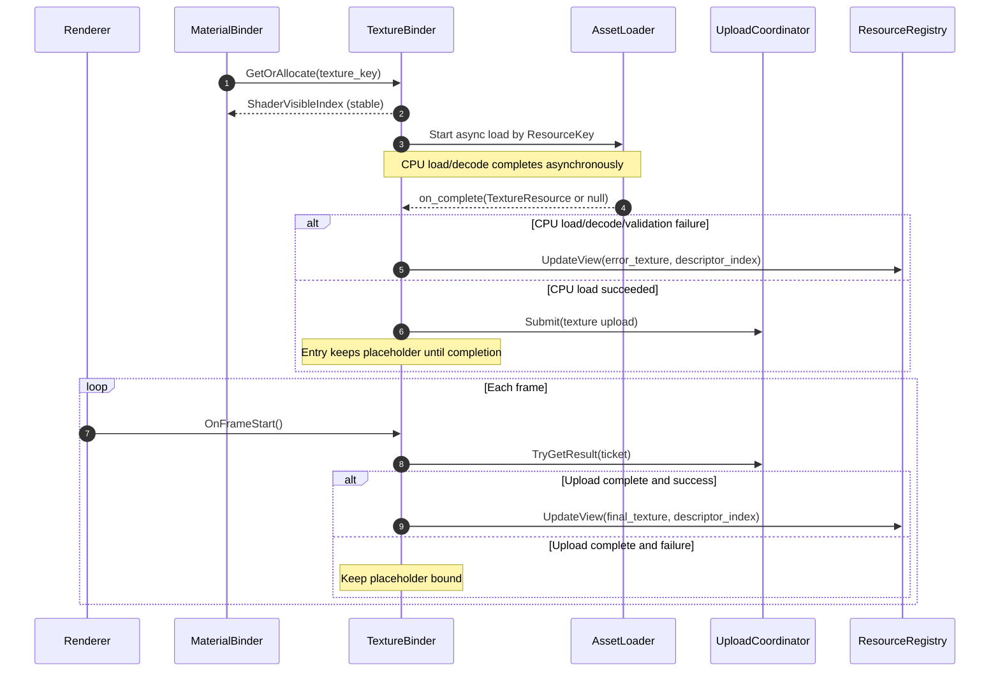
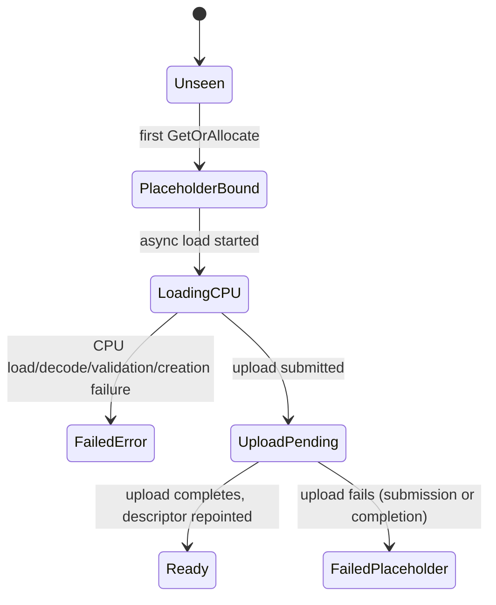

# Texture Binder Design

This document specifies the design for the runtime texture binding system that enables full texture support for PBR
material rendering in the Oxygen Engine.

## Purpose

Enable runtime binding of texture resources (from PAK files or loose cooked filesystem) to shader-visible descriptor
heap indices, allowing materials to reference textures that can be sampled in shaders.

## Status (2025-12-27)

- Implemented: `TextureBinder::GetOrAllocate(content::ResourceKey)` is the only runtime binding API; renderer code
  treats `ResourceKey` as opaque and never decodes it.
- Implemented: `MaterialRef` and `MaterialBinder` integration so material serialization resolves texture SRV indices via
  `TextureBinder` using `ResourceKey` values emitted at scene-prep time.
- Implemented: `TextureBinder` constructor requires `AssetLoader` injection; placeholder and error textures are created
  during initialization.
- Implemented: Async loading and upload pipeline using OxCo coroutines. `AssetLoader::StartLoadTexture` starts loader
  coroutines, `TextureBinder::InitiateAsyncLoad` requests CPU-side payload, creates GPU texture on completion, submits
  full mip-chain via `UploadCoordinator`, and `OnFrameStart()` drains upload completions and repoints descriptors.
- Implemented: buffer-provided textures flow through the same pipeline via `AssetLoader::LoadTextureFromBufferAsync`,
  which expects a cooked/pak-style payload (`TextureResourceDesc` followed by the mip/data blob).

## Responsibilities

- Map texture identities (`content::ResourceKey`) to stable shader-visible SRV indices
- Manage GPU texture resource lifecycle (creation, upload, replacement)
- Coordinate with existing upload and descriptor allocation infrastructure
- Provide error-handling defaults when texture loading fails

## Design Decisions

### Storage Agnostic

The TextureBinder is agnostic to asset storage format:

- Works with PAK files (packed archives)
- Works with loose cooked files (filesystem-based)
- Treats the cooked **resource index** (`pak::ResourceIndexT`) as a *per-source table slot* (it is not globally unique
  and must not be used as a standalone runtime identity)
- Uses a **source-aware** texture identity at runtime: `content::ResourceKey`, so `AssetLoader` can resolve the correct
  container without relying on thread-local "current source" state
- Depends on `AssetLoader` abstraction to provide `TextureResource` data regardless of source

**Terminology (directive)**:

- **Texture identity** is `content::ResourceKey`.
- **Resource index** (`pak::ResourceIndexT`) is a per-source table slot.
- Avoid using the term "PAK index" when discussing identity; this document uses "resource index" for the slot and
  "texture identity" for `ResourceKey`.

### Index Semantics

`ShaderVisibleIndex` represents an offset into the currently bound shader-visible descriptor heap, matching the
convention used by `DescriptorAllocator::GetShaderVisibleIndex()` and existing buffer SRV allocation
(`EnsureBufferAndSrv`).

This document distinguishes:

- **Texture identity**: which cooked texture resource to load (must be source-aware: `content::ResourceKey`)
- **Bindless/SRV identity**: the shader-visible descriptor heap index (`ShaderVisibleIndex`) used by shaders

**Current Implementation (Dec 2025)**:

- `pak::v1::kFallbackResourceIndex` (currently `0`) is a **reserved, valid** index *within each content source's texture
  table*. The asset pipeline/packer must store the **fallback texture** at index `0` so the meaning of "fallback" is
  consistent across tooling and runtime.
- The renderer uses `content::ResourceKey(0)` as a **fallback sentinel** meaning "no runtime texture identity provided";
  `TextureBinder` returns the placeholder SRV index immediately and never forwards that sentinel to `AssetLoader`.
- Examples implement a deterministic "forced error" mode using a **valid, type-encoded synthetic**
  `content::ResourceKey` that has no backing resource in the active content sources, causing the load to fail and the
  binder to bind the error-indicator texture.

Only `kInvalidBindlessIndex` (0xFFFFFFFF) indicates an invalid *bindless heap index*; this is separate from the
resource-index conventions above.

## 1. TextureBinder Component

### Contract

**Interface**:

```cpp
class TextureBinder {
public:
  auto GetOrAllocate(content::ResourceKey texture_key) -> ShaderVisibleIndex;

  auto GetErrorTextureIndex() const -> ShaderVisibleIndex;
};
```

**Behavior**:

- `GetOrAllocate()` must return immediately with a valid SRV index (may reference placeholder texture initially)
- Returned SRV index must remain stable for the lifetime of that texture resource
- Texture data loading and upload occurs asynchronously after index allocation
- `content::ResourceKey(0)` is reserved as a renderer-side fallback sentinel and must not be forwarded to `AssetLoader`

### Stable Index Guarantee

The SRV index returned by `GetOrAllocate()` must never change for a given texture identity. This is achieved through:

1. Allocate SRV descriptor once during first call
2. Use `ResourceRegistry::UpdateView(...)` to repoint the existing descriptor to the final texture while preserving the
   SRV index
3. Follow the same pattern as `EnsureBufferAndSrv` in `UploadHelpers.cpp`

### Integration Requirements

**Dependencies**:

- `Graphics` (descriptor allocation, resource registry, texture creation)
- `UploadCoordinator` (texture data upload)
- `AssetLoader` (texture resource loading from PAK or loose files)

**Called By**:

- `MaterialBinder` during material compilation/update (producing `MaterialConstants`)

**Lifecycle**:

- Created during `Renderer` initialization once `AssetLoader` is available
- `OnFrameStart()` / `OnFrameEnd()` called by renderer

### Architecture Overview

The binder intentionally separates two identities:

- **Texture identity**: `content::ResourceKey` (opaque to the renderer)
- **Bindless identity**: `ShaderVisibleIndex` (stable descriptor heap index)

The stable-index guarantee is achieved by allocating exactly one SRV descriptor
per texture identity and later repointing that descriptor to the final texture.





### Threading and Ownership

- `TextureBinder` is render-thread owned.
- Background work may perform IO and CPU decode, but must not mutate binder
  state, descriptor heaps, or the `ResourceRegistry`.
- GPU resource creation, upload submission, and descriptor repointing occur on
  the render thread.

### Frame Lifecycle

- `OnFrameStart()` is the work pump:
  - drains upload completion tickets,
  - repoints descriptors after successful completion,
  - performs deterministic failure handling.
- `OnFrameEnd()` is intentionally a no-op.
- GPU-safe destruction is handled by the graphics backend's deferred reclaim
  processing when the frame slot cycles.

## 2. Error-Indicator Texture

### Purpose

Provide a visually obvious texture to indicate texture loading failures, preventing crashes and making errors
immediately apparent during rendering.

### Rationale

The texture system does NOT provide semantic-specific defaults (white, flat normal, etc.). The material system already
defines fallback PBR scalar values in `MaterialAsset::CreateDefault()` for cases where textures are intentionally
absent. The texture system's responsibility is ONLY to indicate loading/creation failures with an obvious visual marker.

### Specification

**Error Texture**: 256×256 magenta and black checkerboard pattern

- **Format**: RGBA8_UNORM, Texture2D
- **Size**: 256×256 pixels (single mip level)
- **Pattern**: Alternating magenta (255, 0, 255, 255) and black (0, 0, 0, 255) checkerboard (32×32 pixel tiles)
- **Generation**: Programmatic

### Design Notes

The error texture is generated programmatically during `TextureBinder`
initialization and uploaded using the engine's normal upload path. This avoids
any dependency on content sources, file IO, or the asset pipeline.

**Why Programmatic**:

- Always available (no asset loading dependency)
- Trivial generation (64-pixel pattern)
- Avoids chicken-and-egg problem (can't use asset loader to load the fallback for when asset loader fails)
- Single texture, not multiple semantic-specific assets

**Alternative**: Engine PAK asset (NOT recommended due to complexity and circular dependency)

### Usage Contract

- Error texture used ONLY when texture loading/creation fails
- Resource index 0 is a valid index and NOT mapped to error texture
- Error texture must be created and uploaded during `TextureBinder` initialization before any material binding

## 3. Texture Loading and Upload

### Input Contract

**Source**: `data::TextureResource` loaded via `AssetLoader` (from PAK or loose cooked files)

**Guaranteed Properties** (from asset cooker):

- Row pitch: 256-byte aligned
- Mip placement: 512-byte aligned (alignment padding occurs between mips)
- Formats: RGBA8_UNORM, RGBA8_UNORM_SRGB
- Compression: NONE
- Type: 2D textures

If these guarantees are violated at runtime, `TextureBinder` treats the texture
as invalid and binds the error-indicator texture for that identity.

### Lifecycle Phases

**Phase 1 - Immediate Response**:

- `GetOrAllocate()` creates small placeholder texture (1×1 recommended)
- Allocates and registers shader-visible SRV immediately
- Returns stable SRV index to caller
- Shaders can sample placeholder during loading

**Phase 2 - Async Loading**:

- **Status**: Implemented.
- `InitiateAsyncLoad()` requests `data::TextureResource` via `AssetLoader`, creates the GPU texture on completion,
  submits upload work via `UploadCoordinator`, and defers descriptor repointing until `OnFrameStart()` observes the
  upload ticket completion.

**Phase 3 - Upload**:

- Create final GPU texture with correct dimensions/format/mips from `TextureResourceDesc`
- Submit upload via `UploadCoordinator` with the entire mip chain blob
- Track completion via an upload ticket

**Phase 4 - Replacement**:

- Use `ResourceRegistry::UpdateView(texture, bindless_handle, view_desc)` to repoint the already-allocated
  shader-visible descriptor to the new texture. This preserves the stable SRV index returned by `GetOrAllocate()`.
- Same SRV index now references final texture
- Defer-reclaim the old placeholder via existing deferred reclaim infrastructure after a successful swap

### Error Handling Contract

**Current Implementation (Dec 2025)**:

- All failures preserve the **stable SRV index** allocated for the texture
  identity. Only the underlying resource referenced by that descriptor may
  change.

**Failure classes and visuals**:

- **CPU load/decode failure** (missing resource, decode error): descriptor is
  repointed to the error-indicator texture.
- **GPU creation / metadata validation failure** (unsupported format, layout
  mismatch, invalid data sizing): descriptor is repointed to the error-indicator
  texture.
- **Upload submission failure** (cannot allocate/map staging, cannot enqueue
  upload): keep the placeholder bound.
- **Upload completion failure** (ticket completes with failure): keep the
  placeholder bound.

**Deterministic forced-error behavior**:

- Examples may use a valid synthetic `ResourceKey` with no backing data to force
  the CPU-load failure path.
- `content::ResourceKey(0)` remains a renderer-side fallback sentinel and must
  never trigger an error-indicator binding.

## Material Binder Integration

### Contract

The material system is responsible for authoring and persisting texture
references, while the renderer is responsible for turning those references into
shader-usable bindless indices.

- Material compilation/update must resolve each texture slot by calling
  `TextureBinder::GetOrAllocate(content::ResourceKey)`.
- The compiled `MaterialConstants` must contain only shader-usable values:
  stable SRV indices and scalar constants.

### Invariants

- `MakeMaterialKey()` hashes authored data (resource table indices and scalar
  parameters), never SRV indices, to preserve material-handle stability across
  runs and independent of descriptor allocation order.
- `MaterialConstants` never stores `pak::ResourceIndexT` and never stores
  `content::ResourceKey`.

## Forward Compatibility: Instanced Rendering (Directive)

Instanced rendering will increase the number of draw submissions, but it must NOT force a redesign of texture binding.
This design remains valid for instancing if the renderer follows the rules below.

### Rules

- Texture identity is `content::ResourceKey`. It is the only input accepted for general runtime texture binding.
- `TextureBinder` calls must occur during **material compilation/update** (CPU preparation), not during per-instance
  draw submission.
- Instance data must reference a **material table row** (or handle) that points to a `MaterialConstants` payload
  containing shader-visible SRV indices.

### Material vs MaterialInstance

- A **material** (prototype) owns the authored texture identities (`content::ResourceKey` per slot) and scalar
  parameters.
- A **material instance** is a runtime variant that may override scalars and/or texture identities.
- Each unique material state (prototype or instance override set) must compile to exactly one `MaterialConstants` entry
  (a single table row).
- The compiled `MaterialConstants` must contain only shader-usable values: SRV indices + scalar constants. It must not
  contain resource indices or `ResourceKey` values.

### Why This Avoids a Rewrite

- `TextureBinder::GetOrAllocate()` returns a stable SRV index per texture identity; instancing multiplies usage, not
  binding work.
- Async completion swaps the underlying texture via descriptor repointing; material constants and instance references do
  not change.

## Verification

The design is validated by unit tests that assert the core invariants:

- Stable SRV index per `content::ResourceKey`
- Descriptor repoint occurs only after upload completion
- `content::ResourceKey(0)` returns the placeholder sentinel and does not bind
  the error-indicator texture
- Forced-error behavior is deterministic and preserves the stable SRV index

## Summary

**Key Guarantees**:

1. Stable SRV indices: same texture identity (`content::ResourceKey`) always returns the same SRV index
2. Asset pipeline: resource table index `0` is reserved for the fallback texture within each content source
3. Only `0xFFFFFFFF` indicates invalid bindless index
4. Async loading with immediate placeholder availability
5. Material handle stability via authored-data-based keying (never SRV indices)

**Integration Points**:

- TextureBinder created during Renderer init
- MaterialBinder depends on TextureBinder
- Both use existing UploadCoordinator/ResourceRegistry/DescriptorAllocator
- Follow EnsureBufferAndSrv pattern for resource replacement
