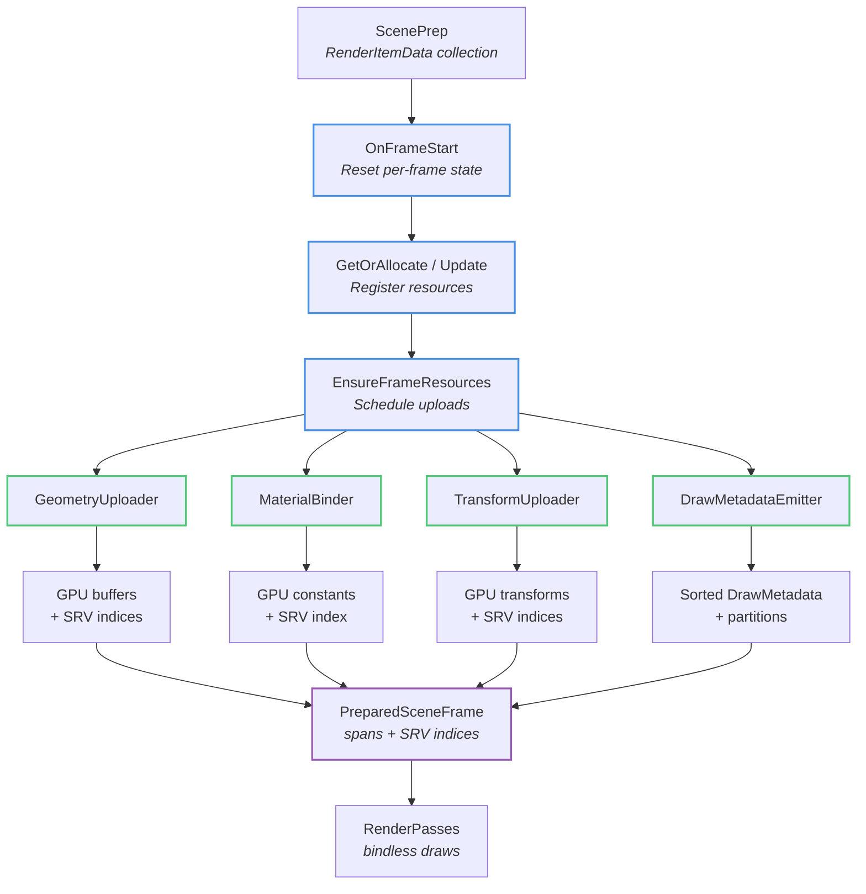

# Renderer Resources Module

Per-frame GPU resource management with stable handles, bindless access, and async upload coordination.

## Overview

This module transforms high-level scene data (`RenderItemData` from ScenePrep) into GPU-resident resources ready for bindless rendering. Each component manages a specific resource type—geometry, materials, textures, transforms, or draw metadata—with stable handle/index semantics and frame-aware lifecycle.

All GPU uploads coordinate through the Upload module (`UploadCoordinator` for async transfers, `InlineTransfersCoordinator` for direct writes). The module produces `PreparedSceneFrame` spans consumed by render passes.

## Components

### GeometryUploader

Interns mesh identities `(AssetKey, lod_index)` and manages GPU vertex/index buffers with stable `GeometryHandle` values. Handles remain valid for the renderer lifetime; SRV indices become valid once async uploads complete. Non-resident geometry yields invalid SRV indices; callers skip rendering in that case.

**Frame contract:** `OnFrameStart()` → `GetOrAllocate()` → `EnsureFrameResources()` → query SRV indices.

**Threading:** Upload-aware; defers buffer creation to upload coordinator. Not thread-safe.

### MaterialBinder

Stores per-material GPU constants (`MaterialConstants`) in a structured buffer with stable `MaterialHandle` indirection. Dirty-tracking uploads only changed elements per frame. Texture references use opaque `content::ResourceKey` resolved to bindless SRV indices via `IResourceBinder`.

**Frame contract:** `OnFrameStart()` → `GetOrAllocate()`/`Update()` → `EnsureFrameResources()` → `GetMaterialsSrvIndex()`.

**Threading:** Not thread-safe; all calls from renderer thread.

### TextureBinder

Implements `IResourceBinder` for texture loading and descriptor management. Returns stable shader-visible SRV indices immediately, using placeholder textures during async load. Descriptors can be repointed in-place (placeholder → final texture) without changing SRV indices. Three-tier fallback: global placeholder (fast path), per-entry placeholder (re-pointable), shared error texture (magenta/black for failures).

**Threading:** Not thread-safe; owns descriptor heap allocations.

### TransformUploader

Collects world transforms (`glm::mat4`) and computes normal matrices (inverse-transpose upper 3×3) for GPU upload. Uses deterministic slot reuse: frames writing the same number of transforms in the same order get identical handle assignments. Writes directly to transient GPU-visible buffers via `TransientStructuredBuffer`.

**Handle semantics:** `TransformHandle` is valid iff its index < `GetWorldMatrices().size()`. Handles are stable within the frame and across frames for consistent allocation patterns.

**Threading:** Not thread-safe; direct GPU writes on renderer thread.

### DrawMetadataEmitter

Builds and uploads `DrawMetadata` (per-draw GPU-side struct: transform index, material index, geometry indices, etc.) using dense, index-addressed structured buffer. Applies stable sorting and partitioning; the i-th sorted draw writes to buffer element i. No per-element handle indirection; shaders read by index directly.

**Partitioning:** Emits partition ranges for render passes (e.g., opaque/masked/shadow splits). Partitions reference contiguous draw index ranges.

**Threading:** Not thread-safe; owns transient buffer allocation.

### IResourceBinder

Minimal interface for mapping `content::ResourceKey` to `ShaderVisibleIndex`. Decouples material binding from texture loading/descriptor management. Implementations allocate slots on first use and return existing slots on subsequent calls. `TextureBinder` is the canonical implementation.

**Usage:** `MaterialBinder` depends on this interface for texture bindings; unit tests can fake deterministic indices without asset loading.

## Data Flow

## Frame Lifecycle

1. **OnFrameStart:** Reset per-frame state, advance frame tag/slot.
2. **Resource acquisition:** Call `GetOrAllocate()` / `Update()` for each item.
3. **EnsureFrameResources:** Trigger GPU buffer allocations and upload scheduling (idempotent within frame).
4. **PreparedSceneFrame assembly:** Emit spans and SRV indices for render passes.
5. **Rendering:** Passes consume bindless SRV indices and draw metadata by index.

## Threading and Safety

All components are single-threaded; the renderer owns upload coordinators and descriptor heaps. Async uploads happen via `UploadCoordinator`; completion tracking ensures safe resource access.

## Design Principles

- **Stable handles/indices:** Once allocated, handles remain valid until explicit resource destruction. SRV indices never change for a given resource identity.
- **Bindless-first:** No per-draw descriptor binding; all resources accessible via shader-visible heap indices.
- **Frame-aware uploads:** Dirty tracking and transient buffers minimize GPU bandwidth.
- **Deferred allocation:** Buffer creation and uploads coordinate through Upload module; Resources owns high-level resource identity only.
- **Testability:** Interfaces (`IResourceBinder`) enable unit tests without full asset/upload stack.

## Implementation Notes

- **PIMPL idiom:** `GeometryUploader` uses PIMPL to isolate heavy upload/registry includes from renderer headers.
- **TransientStructuredBuffer:** Frame-local GPU-visible buffers for transforms/draw metadata; SRVs remain stable across growth via `ResourceRegistry::Replace`.
- **Descriptor repointing:** `TextureBinder` updates descriptor views in-place without changing SRV indices, enabling transparent placeholder → final transitions.
- **Dense draw metadata:** No per-element handle indirection; GPU reads by contiguous index matching CPU write order.
