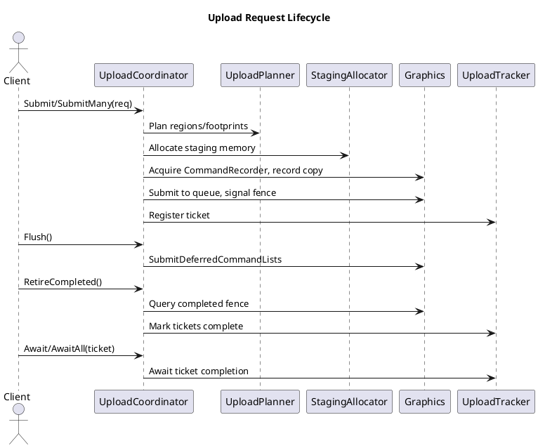
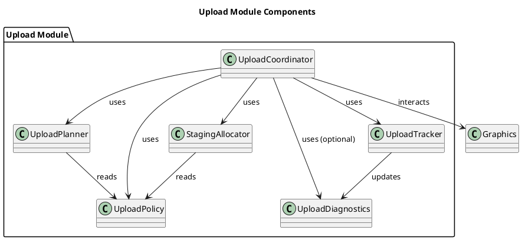

# Upload Module – High-Level Overview

The Upload module provides a unified, testable system for staging, batching, and submitting buffer and texture uploads to the GPU. It is designed for deterministic, renderer-internal use, replacing ad-hoc upload logic with a robust, extensible, and coroutine-friendly API.

---

## TODOs & Enhancement Summary

| Area                | Status / Limitation                                   | Planned Action / Note                                 |
|---------------------|------------------------------------------------------|-------------------------------------------------------|
| Thread-safe pending queue | Not implemented; Submit* records immediately         | Add MPSC queue; move planning/staging/recording to `Flush()` |
| Batch splitting     | No splitting by policy thresholds or priority         | Extend planner/batcher for max regions/bytes, sort by priority |
| Staging allocator   | Per-allocation persistent map; RetireCompleted not wired | Implement arena/ring buffer; wire recycling           |
| Large batch splitting | Not implemented (max regions/bytes/timeouts)        | Extend planner/batcher for splitting                  |
| Diagnostics         | Minimal (counts, bytes)                              | Add per-frame latency, arena usage, debug labels      |
| Producer callback   | Only boolean-fill supported                          | Add streaming/offset-based producer variant           |
| Test coverage       | Good (see `Test/`), but always extend for new features | Add/maintain tests for new planner, allocator, etc.   |

---

## Architecture Overview

The Upload module is composed of several focused components:

- **UploadCoordinator**: Facade API for submitting upload requests, flushing, retiring, and tracking completion. See [`UploadCoordinator.h`](../Upload/UploadCoordinator.h).
- **UploadPlanner**: Computes copy regions and staging footprints for buffer and texture uploads. See [`UploadPlanner.h`](../Upload/UploadPlanner.h).
- **StagingAllocator**: Manages CPU-visible upload memory, currently per-allocation, with future plans for arena/ring buffer. See [`StagingAllocator.h`](../Upload/StagingAllocator.h).
- **UploadTracker**: Tracks tickets, fence values, and results; supports both blocking and coroutine-friendly waiting. See [`UploadTracker.h`](../Upload/UploadTracker.h).
- **UploadPolicy**: Centralizes batching, alignment, and limit policies. See [`UploadPolicy.h`](../Upload/UploadPolicy.h).
- **UploadDiagnostics**: Provides lightweight stats and (future) debug labeling. See [`UploadDiagnostics.h`](../Upload/UploadDiagnostics.h).

### Integration

- The module is used internally by the `Renderer` (see `Renderer.cpp`), e.g., for geometry, material, and transform uploads.
- Not an EngineModule: avoids extra lifecycle/scheduling complexity.

---

## API Highlights

- **Submission**: `UploadCoordinator::Submit`, `SubmitMany` for buffer/texture uploads. Returns `UploadTicket` for tracking.
- **Sync & Polling**: `IsComplete`, `TryGetResult`, `Await`, `AwaitAll`.
- **Coroutine Support**: `SubmitAsync`, `AwaitAsync`, `AwaitAllAsync` for non-blocking integration.
- **Frame Control**: `Flush` (submit pending work), `RetireCompleted` (advance fence, recycle memory).
- **Diagnostics**: `GetStats` for basic counters.

See [`UploadCoordinator.h`](../Upload/UploadCoordinator.h) for full API.

---

## Usage Models

The Upload module supports several usage patterns for flexibility and performance:

### 1. Synchronous Upload (Direct Data)

For small or immediate uploads, provide data directly:

```cpp
std::vector<std::byte> data = ...;
UploadRequest req = {
  .kind = UploadKind::kBuffer,
  .desc = UploadBufferDesc{ .dst = buffer, .size_bytes = data.size(), .dst_offset = 0 },
  .data = UploadDataView{ std::span<const std::byte>(data) },
  .debug_name = "MyBufferUpload"
};
auto ticket = upload.Submit(req);
upload.Flush();
auto result = upload.Await(ticket);
```

### 2. Coroutine-Based Upload

For non-blocking, frame-overlapped uploads:

```cpp
co::Co<void> UploadAsync(UploadCoordinator& upload, UploadRequest req) {
  co_await upload.SubmitAsync(req);
  // ...continue after upload completes
}
```

### 3. Producer Callback (Streaming/Large Data)

For large assets or streaming, provide a producer callback to fill staging memory on demand:

```cpp
UploadRequest req = {
  .kind = UploadKind::kBuffer,
  .desc = UploadBufferDesc{ .dst = buffer, .size_bytes = N, .dst_offset = 0 },
  .data = std::move_only_function<bool(std::span<std::byte>)>{
    [](std::span<std::byte> dst) {
      // Fill 'dst' with data (e.g., from file, decompression, etc.)
      return FillBuffer(dst);
    }
  },
  .debug_name = "StreamedUpload"
};
auto ticket = upload.Submit(req);
upload.Flush();
auto result = upload.Await(ticket);
```

### 4. Batch/Multi-Request Upload

Batch multiple requests for efficient submission:

```cpp
std::vector<UploadRequest> reqs = BuildRequests(...);
auto tickets = upload.SubmitMany(reqs);
upload.Flush();
auto results = upload.AwaitAll(tickets);
```

---

## Diagrams

### Upload Request Flow



### Module Components



---

- **Deterministic, Renderer-Driven**: All planning, staging, and command recording are performed on the renderer thread for predictability.
- **Batching & Coalescing**: Planner groups compatible buffer uploads, computes texture subresource regions, and minimizes allocations.
- **Staging Memory**: Allocator provides persistently mapped upload buffers; future work will introduce arenas/ring buffers for efficiency.
- **Ticket Lifecycle**: Each upload returns a ticket, which can be polled, awaited, or canceled (best-effort).
- **Coroutine Integration**: Uses `co::Value<FenceValue>` for efficient, multi-waiter coroutine synchronization.
- **Error Handling**: All results are explicit (`UploadResult`), with error codes and messages.
- **Testability**: The module is covered by unit tests (see `Test/Upload*`), including buffer, texture, planner, and tracker tests.

---

## Example Usage

**Buffer Upload (synchronous):**

```cpp
UploadRequest req = { ... };
auto ticket = uploadCoordinator.Submit(req);
uploadCoordinator.Flush();
uploadCoordinator.RetireCompleted();
auto result = uploadCoordinator.TryGetResult(ticket);
```

**Coroutine-based Upload:**

```cpp
co::Co<void> MyUploadCoroutine(UploadCoordinator& upload, UploadRequest req) {
  co_await upload.SubmitAsync(req);
  // ...continue after upload completes
}
```

See [`Test/UploadCoordinator_buffer_test.cpp`](../Test/UploadCoordinator_buffer_test.cpp) for more examples.

---

## Testing

- Unit tests cover all major code paths: buffer/texture uploads, batching, error handling, and ticket lifecycle.
- Tests are located in [`Test/`](../Test/), e.g., `UploadCoordinator_buffer_test.cpp`, `UploadPlanner_basic_test.cpp`.

---

## Rationale & Limitations

- **Not an EngineModule**: Upload is an internal renderer service, not exposed as a standalone engine phase.
- **No background threads**: All work is performed on the renderer thread for simplicity and determinism.
- **Extensible**: The design allows for future enhancements (e.g., more advanced batching, diagnostics, and memory management) without breaking API contracts.

---

## References

- [UploadCoordinator.h](../Upload/UploadCoordinator.h)
- [UploadPlanner.h](../Upload/UploadPlanner.h)
- [StagingAllocator.h](../Upload/StagingAllocator.h)
- [UploadTracker.h](../Upload/UploadTracker.h)
- [UploadPolicy.h](../Upload/UploadPolicy.h)
- [UploadDiagnostics.h](../Upload/UploadDiagnostics.h)
- [Test/UploadCoordinator_buffer_test.cpp](../Test/UploadCoordinator_buffer_test.cpp)

---

For implementation details, see the respective `.cpp` files and the integration points in `Renderer.cpp`.
