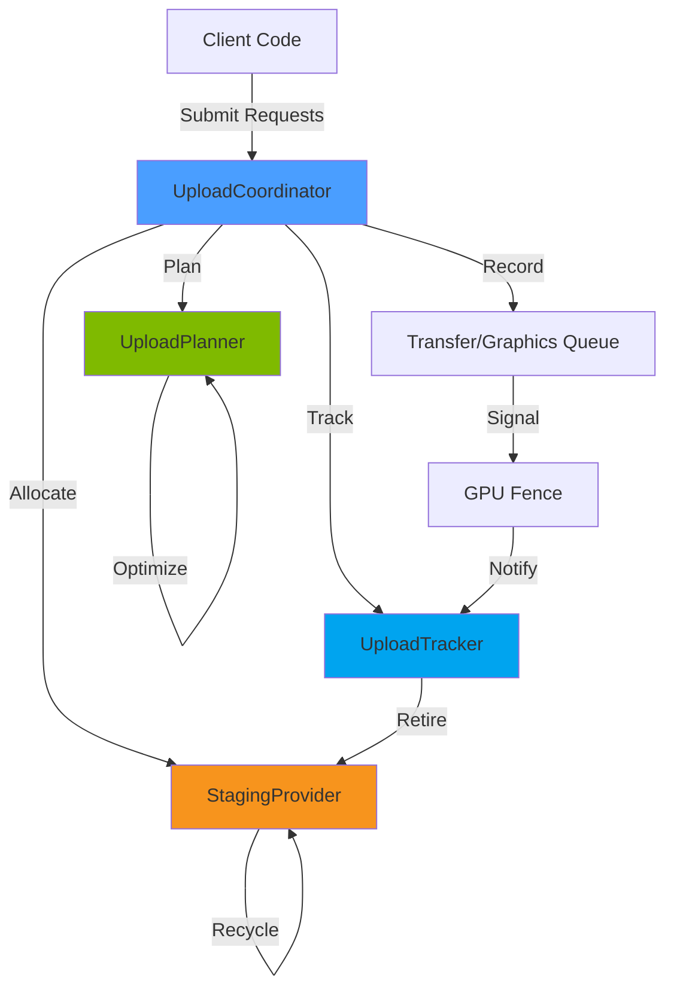
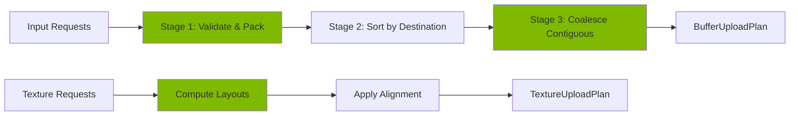
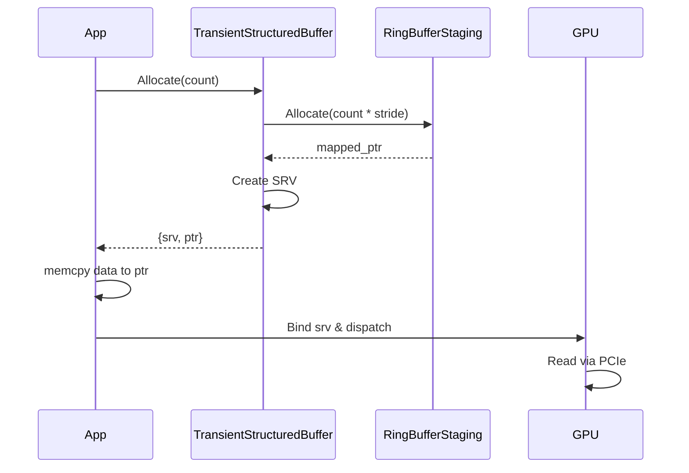
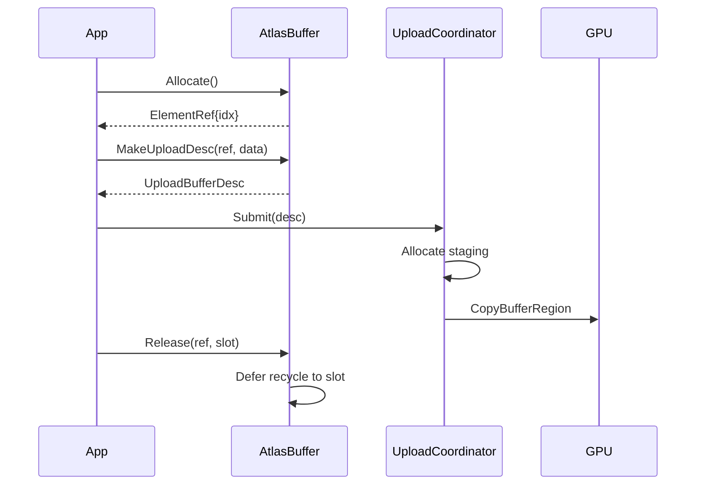
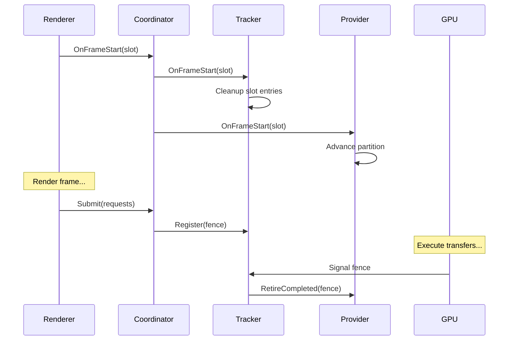

# Upload Module

Unified CPU-to-GPU data transfer subsystem for the Oxygen renderer, providing deterministic staging allocation, optimal batch planning, and fence-based completion tracking with coroutine support.

## Architecture Overview

The Upload module solves the inherent complexity of CPU-to-GPU data transfer by decoupling **memory management** (staging providers), **transfer optimization** (planners), **execution** (coordinators), and **completion tracking** (trackers). This separation enables flexible staging strategies while maintaining optimal batch coalescing and zero-copy inline writes.



### Design Philosophy

The module embodies three key principles:

1. **Explicit Staging Control**: No hidden allocations—callers provide `StagingProvider` instances, enabling fine-grained control over memory strategy (ring buffers, persistent mappings, per-queue staging).

2. **Batch Optimization**: `UploadPlanner` coalesces adjacent buffer copies targeting the same destination, reducing API overhead and minimizing resource state transitions.

3. **Coroutine-First Async**: Built atop OxCo's coroutine infrastructure, all waits are non-blocking with deterministic fence-based completion instead of ad-hoc polling.

## Core Components

### UploadCoordinator

Orchestrates the full pipeline: request validation → planning → staging allocation → command recording → submission → ticket registration. Manages both **staging-based transfers** (UploadCoordinator) and **inline writes** (InlineTransfersCoordinator) with unified lifecycle hooks.

**Key Responsibilities:**

- Queue selection (prefers dedicated transfer queue when available)
- Resource state transitions post-copy (buffers derive from `BufferUsage`, textures default to `kCommon`)
- Frame-driven lifecycle via `OnFrameStart(slot)` to advance trackers and notify providers
- Shutdown coordination: `Shutdown()` waits for in-flight uploads before renderer teardown

**Why Two Coordinators?**

- `UploadCoordinator`: Handles **staging + copy** pattern (allocate → memcpy → CopyBufferRegion)
- `InlineTransfersCoordinator`: Handles **direct writes** to upload heap memory read by GPU over PCIe (used by `TransientStructuredBuffer`)

### UploadPlanner

Optimizes copy operations through three-stage buffer planning and texture subresource footprint calculation:



**Buffer Optimization:**

- Filters invalid requests (null dst, zero size)
- Sorts by destination buffer handle for batching
- Merges contiguous regions when both `dst_offset` and `src_offset` align
- Assigns aligned `src_offset` per policy (`buffer_copy_alignment`, typically 4 bytes)

**Texture Footprint:**

- Computes row/slice pitch from `FormatInfo` (bits-per-pixel, block compression)
- Applies D3D12/Vulkan alignment (`row_pitch_alignment=256`, `placement_alignment=512`)
- Outputs `TextureUploadRegion` with byte offsets for `CopyBufferToTexture`

### StagingProvider (Abstract)

Contract for CPU-visible memory providers. The repository provides `RingBufferStaging`; callers can implement custom strategies (e.g., pinned mappings, CUDA interop buffers).

**Lifecycle Hooks:**

- `Allocate(SizeBytes)` → returns `Allocation` with mapped pointer
- `RetireCompleted(FenceValue)` → enables recycling of GPU-finished allocations
- `OnFrameStart(Slot)` → advance frame-in-flight partitions

**Allocation Contract:**

- Returned pointer must remain valid until GPU signals completion fence
- Destructor unmaps buffer if still held (defensive; coordinator typically moves ownership)
- Alignment is provider-specific (RingBuffer requires power-of-two alignment matching element stride)

### UploadTracker

Fence-based completion tracking with both blocking and coroutine-friendly waits. Tracks tickets by monotonic `FenceValue`, aggregates per-upload stats (bytes, debug names), and implements frame-slot cleanup to prevent stale entry accumulation.

**Key Features:**

- `Register(FenceValue, bytes, debug_name)` → returns `UploadTicket`
- `Await(TicketId)` → blocks until fence reaches ticket's value
- `AwaitAsync(TicketId)` → co_awaits on `co::Value<FenceValue>` (non-blocking)
- `OnFrameStart(slot)` → discards entries for recycled slots from previous frame cycles
- `AwaitAllPending()` → shutdown helper that waits for all outstanding tickets

### UploadPolicy

Encapsulates alignment requirements and queue selection derived from D3D12/Vulkan specs and the Graphics module's `QueuesStrategy`:

```cpp
struct UploadPolicy {
  struct AlignmentPolicy {
    Alignment row_pitch_alignment { 256U };      // D3D12_TEXTURE_DATA_PITCH_ALIGNMENT
    Alignment placement_alignment { 512U };      // D3D12_TEXTURE_DATA_PLACEMENT_ALIGNMENT
    Alignment buffer_copy_alignment { 4U };      // Relaxed (NVIDIA recommends 16)
  };
  QueueKey upload_queue_key;  // Determined by Graphics::QueuesStrategy
};
```

**Queue Strategy Integration:** The `upload_queue_key` is obtained from the Graphics module's `QueuesStrategy::KeyFor(QueueRole::kTransfer)`, which may return a dedicated transfer queue, a universal graphics queue, or any strategy-defined queue. The Upload module is agnostic to the strategy—it simply uses the provided key. This design allows strategies like `SharedTransferQueueStrategy` (separate queues) or `SingleQueueStrategy` (universal queue) to be swapped without changing Upload code.

**Design Note:** `buffer_copy_alignment` is deliberately relaxed (4 bytes) to support arbitrary vertex/index layouts. For performance-critical paths, consider 16-byte alignment.

## Direct Write Pattern: TransientStructuredBuffer & AtlasBuffer

Two complementary strategies for dynamic GPU-visible data:

### TransientStructuredBuffer (Direct Write)

Wraps `RingBufferStaging` for per-frame upload-heap allocations that the GPU reads directly (no copy commands).

**When to Use:**

- High-frequency updates (every frame): transforms, particles, draw commands
- Latency-sensitive scenarios where copy overhead exceeds PCIe read cost

**Trade-offs:**

- ✅ Zero copy overhead, simple synchronization (N-buffering via ring)
- ⚠️ Slower GPU reads (PCIe vs VRAM), requires alignment = stride

**Flow:**



### AtlasBuffer (Staging + Copy)

Manages device-local structured buffer with stable SRV, using UploadCoordinator for element-level staging copies.

**When to Use:**

- Persistent data with infrequent updates (material properties, static geometry)
- GPU-read-heavy workloads where VRAM bandwidth justifies copy cost

**Trade-offs:**

- ✅ Fast GPU reads (VRAM), element-level recycling with frame-deferred cleanup
- ⚠️ Copy overhead, requires explicit `EnsureCapacity()` for growth

**Flow:**



## API Usage Patterns

### Basic Synchronous Upload

```cpp
auto provider = coordinator.CreateRingBufferStaging(frame::SlotCount{3}, 256u);

UploadRequest req{
  .kind = UploadKind::kBuffer,
  .desc = UploadBufferDesc{.dst = buffer, .size_bytes = size, .dst_offset = 0},
  .data = UploadDataView{data_span}
};

auto ticket = coordinator.Submit(req, *provider).value();
coordinator.Await(ticket).value();  // Blocks until GPU completion
```

### Batch Upload with Coalescing

```cpp
std::vector<UploadRequest> requests = /* multiple buffers */;
auto tickets = coordinator.SubmitMany(requests, *provider).value();
coordinator.AwaitAll(tickets).value();  // Single fence wait for all
```

### Coroutine-Friendly Async

```cpp
co::Task<void> UploadMeshAsync(UploadCoordinator& coordinator, auto& provider) {
  auto ticket = co_await coordinator.SubmitAsync(req, provider);
  auto result = co_await coordinator.AwaitAsync(ticket);
  // Non-blocking, scheduler-friendly wait
}
```

### Transient Buffer (Direct Write)

```cpp
TransientStructuredBuffer transforms{gfx, staging, sizeof(Transform)};
transforms.OnFrameStart(sequence, slot);

auto alloc = transforms.Allocate(count).value();
std::memcpy(alloc.mapped_ptr, data, count * sizeof(Transform));
cmd_list.SetSRV(slot, alloc.srv);  // GPU reads from upload heap
```

## Frame Lifecycle Integration



**Critical Invariant:** Always call `OnFrameStart(slot)` before submitting uploads for that frame. Providers like `RingBufferStaging` depend on this to advance partitions and prevent overwrites.

## Architecture Rationale

### Why Separate Providers?

**Problem:** Different use cases demand conflicting strategies:

- Scene loading: large sequential allocations, infrequent
- Per-frame data: small allocations, high churn, N-buffering required

**Solution:** Abstract `StagingProvider` allows specialized implementations without coordinator changes. RingBuffer handles per-frame; future: PooledStaging for async loading.

### Why Two-Stage Planning?

**Problem:** Naive per-request copies cause:

- Excessive `CopyBufferRegion` calls (API overhead)
- Redundant resource state transitions
- Fragmented staging allocations

**Solution:** `UploadPlanner` sorts + coalesces → single staging alloc + minimal copies per destination.

### Why Fence-Based Tracking?

**Problem:** Polling readback buffers or query heaps for completion is error-prone and non-deterministic.

**Solution:** GPU fence values provide:

- Monotonic ordering (ticket A < B ⟹ A completes before B)
- Coroutine-friendly via `co::Value<FenceValue>` (non-blocking waits)
- Frame-slot cleanup prevents stale entry buildup

### Why Delegate Queue Strategy to Graphics Module?

**Problem:** Upload needs shouldn't dictate queue topology—different platforms and workloads benefit from different strategies (single universal queue vs dedicated transfer).

**Solution:** Upload module receives `QueueKey` from `Graphics::QueuesStrategy`, enabling strategies like:

- `SingleQueueStrategy`: All work on one universal graphics queue (mobile, integrated GPUs)
- `SharedTransferQueueStrategy`: Dedicated async transfer queue (discrete GPUs, streaming workloads)
- Custom strategies: Per-workload queues, priority-based selection

The Upload module remains strategy-agnostic—it simply records to the provided queue key.

## Known Limitations & Future Work

### Current Constraints

1. **Texture States:** Post-copy textures default to `kCommon`. No usage-derived steady-state transitions yet.

2. **Batch Splitting:** Large batches recorded as-is; no size/time-slice enforcement per `UploadPolicy::Batching` limits.

3. **Producer API:** Boolean fill callback; no streaming/chunked writes for oversized textures.

### Planned Enhancements

- Per-usage texture steady-state transitions (e.g., `ShaderResource` for samplers)
- Batch splitting with time-slice budgets for frame-time-sensitive paths
- Streaming producer API for partial texture uploads
- Enhanced diagnostics: per-frame latency histograms, arena fragmentation metrics

## References

| Component | Header | Implementation |
| --------- | ------ | -------------- |
| Coordinator (Staging) | [UploadCoordinator.h](UploadCoordinator.h) | [UploadCoordinator.cpp](UploadCoordinator.cpp) |
| Coordinator (Inline) | [InlineTransfersCoordinator.h](InlineTransfersCoordinator.h) | [InlineTransfersCoordinator.cpp](InlineTransfersCoordinator.cpp) |
| Planner | [UploadPlanner.h](UploadPlanner.h) | [UploadPlanner.cpp](UploadPlanner.cpp) |
| Tracker | [UploadTracker.h](UploadTracker.h) | [UploadTracker.cpp](UploadTracker.cpp) |
| Provider Contract | [StagingProvider.h](StagingProvider.h) | [StagingProvider.cpp](StagingProvider.cpp) |
| Ring Buffer | [RingBufferStaging.h](RingBufferStaging.h) | [RingBufferStaging.cpp](RingBufferStaging.cpp) |
| Transient Buffer | [TransientStructuredBuffer.h](TransientStructuredBuffer.h) | [TransientStructuredBuffer.cpp](TransientStructuredBuffer.cpp) |
| Atlas Buffer | [AtlasBuffer.h](AtlasBuffer.h) | [AtlasBuffer.cpp](AtlasBuffer.cpp) |
| Policy | [UploadPolicy.h](UploadPolicy.h) | [UploadPolicy.cpp](UploadPolicy.cpp) |
| Types | [Types.h](Types.h) | - |
| Errors | [Errors.h](Errors.h) | [Errors.cpp](Errors.cpp) |
