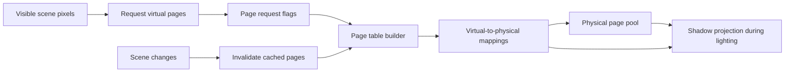
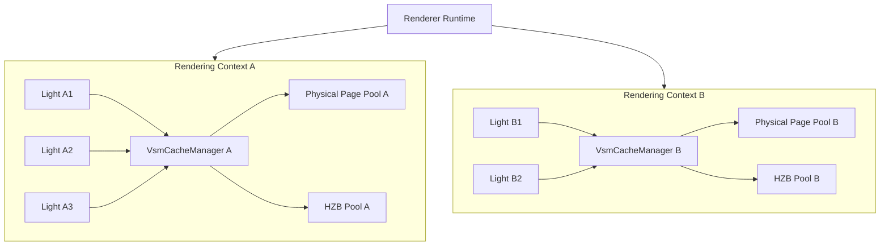
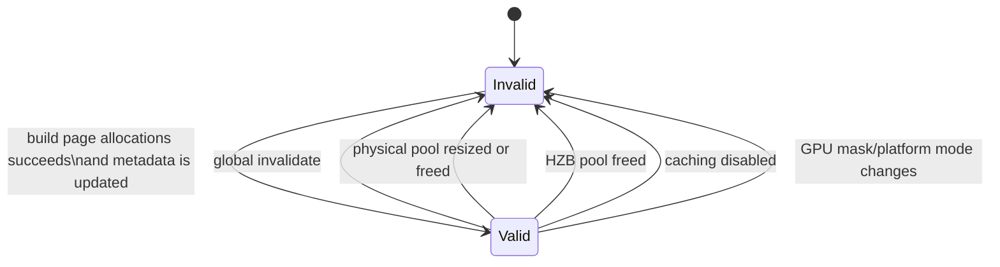
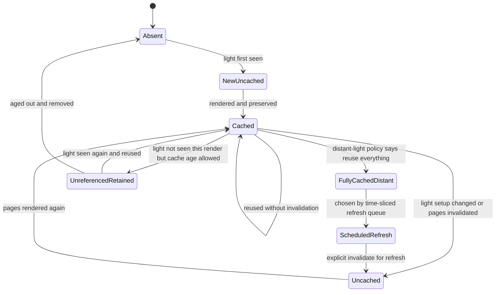
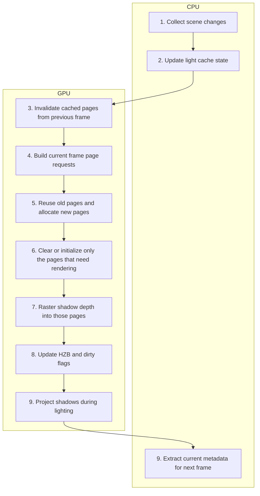

# Virtual Shadow Map Architecture

This document explains a virtual shadow map system as if it were being designed for a new real-time renderer from scratch.

It assumes the reader has no prior knowledge of any particular engine.

## 1. The Problem This System Solves

A shadow map is a texture that stores depth from the light's point of view. The straightforward approach is:

- allocate one big texture per light,
- render everything that casts shadows into it,
- sample it during lighting.

That works, but it does not scale well:

- large lights need huge textures,
- many lights multiply memory cost,
- most of the texture is often unused,
- re-rendering the whole shadow map every frame wastes work.

The virtual shadow map approach fixes this by making shadow rendering:

- sparse,
- cacheable,
- page-based,
- reusable across frames.

Instead of thinking "one light = one large shadow texture", think:

- each light owns a large **virtual address space**,
- only the visible or needed parts of that space get real memory,
- those real memory tiles are **physical pages** from a shared pool,
- unchanged pages can be reused from earlier frames.

## 2. High-Level Mental Model

There are two layers:

1. **Virtual shadow space**
   - an address space for each light
   - very large, but mostly conceptual
   - broken into fixed-size pages

2. **Physical page pool**
   - a shared texture array that stores the real depth data
   - also page-based
   - persistent across frames

The renderer uses a page table to map:

- `(light, mip or clip level, page x, page y)`

to:

- `(physical page x, physical page y, array slice)`

That gives the system two important powers:

- it can render only the pages that matter,
- it can keep old pages alive and reattach them to the current frame.

Important nuance:

- the physical pool is shared across many lights within one rendering context,
- but it is not necessarily the only such pool in the engine,
- and it may be implemented as a texture array rather than a single-slice texture.



## 2.1 CPU Side vs GPU Side

This system is split very deliberately between CPU work and GPU work.

### CPU side responsibilities

- own persistent cache state,
- decide light-level policy,
- track scene changes,
- track per-light history,
- extract previous-frame resources,
- schedule GPU passes,
- provide mappings and metadata to the GPU.

The CPU is responsible for:

- **what exists conceptually**,
- **what changed**,
- **what may be reused**,
- **what work should be dispatched**.

### GPU side responsibilities

- generate page demand from visible pixels,
- translate virtual demand into physical allocation,
- test page reuse at scale,
- initialize only pages that need redraw,
- raster actual shadow depth,
- build HZB,
- project shadows during lighting.

The GPU is responsible for:

- **which pages are needed right now**,
- **which pages are valid at page granularity**,
- **which pages must be rendered**,
- **sampling and projection**.

### Notation used below

- `[CPU]` means state ownership, decisions, or orchestration done on the CPU.
- `[GPU]` means work executed by GPU passes or shaders.
- `[CPU -> GPU]` means CPU-prepared inputs consumed by GPU passes.
- `[GPU -> CPU]` means readback or extracted state returned for later CPU use.

## 3. Core Concepts

### 3.1 Virtual pages

A virtual page is a logical tile inside a light's shadow space.

It answers:

- "If this region of the shadow map existed, where would it live?"

It does not imply memory exists yet.

### 3.2 Physical pages

A physical page is a real tile of memory in the shared shadow page pool.

It answers:

- "Where is the actual depth data stored?"

Physical pages are expensive. The whole design is about using as few of them as possible.

### 3.3 Page table

The page table is the translation layer between virtual pages and physical pages.

It stores:

- whether a page exists,
- where its physical tile is,
- whether a coarser fallback exists,
- whether the page is currently cached or must be redrawn.

### 3.4 Cache

The cache is not "a second copy of the shadow map".

The cache is:

- the physical page pool,
- metadata that remembers what each page contains,
- previous-frame page tables and projection metadata,
- per-light bookkeeping that lets current lights reconnect to old pages.

### 3.5 Invalidation

Invalidation means:

- "this cached page still exists, but its contents are no longer trustworthy."

Typical reasons:

- an object moved,
- an object was removed,
- an object changed shape,
- a light changed enough that old pages no longer line up,
- a clipmap moved too far,
- the physical pool was resized,
- the renderer switched modes.

Invalidation does not necessarily free the page immediately.

Usually it marks the page as:

- allocated,
- still mapped,
- but needing re-rendering.

### 3.6 Clear

Clear does **not** mean clearing the entire shadow pool every frame.

Clear only happens for pages that are about to be reused as fresh render targets.

That is one of the biggest efficiency wins in the design:

- persistent pool,
- selective clear,
- selective redraw.

### 3.7 Reuse

Reuse means:

- carry forward physical pages from previous frames,
- reconnect them to this frame's virtual IDs,
- keep their data if nothing invalidated them.

This is why virtual IDs can be temporary while physical memory stays alive.

## 4. Main Data Structures

At the architectural level, the system revolves around these data sets:

- **Per-light cache entry** `[CPU]`
  - whether the light is cached or uncached
  - whether it is considered distant and can skip updates
  - last rendered frame
  - last scheduled refresh frame
  - primitive visibility history for invalidation logic

- **Per-shadow-map cache entry** `[CPU]`
  - current virtual shadow map ID
  - previous and current HZB metadata
  - projection data needed for sampling
  - clipmap tracking data for panning and depth-range stability

- **Previous-frame extracted buffers** `[CPU owns handles, GPU owns contents]`
  - previous page table
  - previous page flags
  - previous page-rect bounds
  - previous projection buffer
  - previous page lists

- **Physical page metadata** `[GPU resident, CPU allocates/owns lifetime policy]`
  - flags
  - age
  - owning virtual map ID
  - mip level
  - virtual page address

- **Page lists** `[GPU]`
  - LRU list
  - available list
  - empty list
  - requested list

- **Physical page pool texture**
  - `[GPU]` actual shadow depth storage
  - `[CPU]` resource lifetime, size, recreation policy
  - one shared pool per rendering context, not per light
  - may have one array slice or multiple array slices depending on caching mode

- **HZB physical pool**
  - `[GPU]` hierarchical shadow depth storage
  - `[CPU]` resource lifetime and availability policy

### 4.1 One Pool per Rendering Context, Not per Light

The intended design is:

- one physical page pool is shared by all lights handled by one cache manager,
- one HZB pool is paired with that physical pool,
- lights do **not** get their own physical pools.

This is important because the entire page-based reuse model assumes:

- many lights compete for one shared residency budget,
- physical pages are a globally shared cache resource inside one rendering context,
- page reuse and eviction are decided at the shared-pool level.

However, the engine may still have **multiple cache managers at runtime**.

That should be understood as:

- one cache manager per relevant rendering context,
- not one cache manager per light.

Examples of separate rendering contexts include:

- different view families,
- main view versus capture view,
- contexts with different lifetime or caching policies,
- contexts that should not share persistent shadow cache state.

So the correct hierarchy is:

- many lights per cache manager,
- one physical VSM pool per cache manager,
- potentially many cache managers in the engine.



### 4.2 Separate Static Caching Implies a Pooled Array, Not Just a Single Slice

The physical page pool should be designed as a texture **array-capable** resource.

Why:

- in the basic mode, the pool can behave like a single shared slice,
- in separate static caching mode, the pool needs multiple slices.

The most useful decomposition is:

- **dynamic slice**
  - receives geometry that must be refreshed often

- **static slice**
  - stores geometry that is expected to remain valid much longer

This means separate static caching is not "a second pool" in the architectural sense.

It is:

- one physical pool resource,
- with multiple array slices,
- where different slices carry different cache lifetimes.

This is valuable because:

- dynamic geometry can rerender without destroying static depth,
- dynamic pages can be initialized from static pages,
- post-raster merge can reconstruct final depth efficiently,
- static data survives many frames even when dynamic data churns.

#### When separate static caching should be enabled

Separate static caching is a good fit when:

- the scene has a meaningful amount of truly static shadow-casting geometry,
- dynamic geometry changes often enough to cause invalidation pressure,
- reusing static depth materially reduces redraw cost,
- memory budget can afford the extra array slice and supporting logic.

Typical good cases:

- large environments with mostly static architecture,
- foliage or props that are mostly static while characters move through them,
- scenes where dynamic objects touch only a subset of pages each frame,
- directional-light clipmaps or other large shadow domains where preserving static depth has high value.

#### When separate static caching should be disabled

It is a poor fit when:

- most shadow-casting geometry is dynamic anyway,
- views are intentionally uncached,
- render contexts are short-lived or should not preserve cache state,
- memory pressure is more important than cache hit rate,
- the scene is so unstable that static pages are rarely reused long enough to justify the extra slice.

Typical poor cases:

- thumbnail or one-off capture contexts,
- highly dynamic scenes with little stable geometry,
- aggressively memory-constrained modes,
- debug or fallback modes where simpler behavior is preferred.

#### Design consequence

Because of this, the physical pool abstraction should expose:

- array-slice count,
- role of each slice,
- whether separate static caching is enabled,
- merge and initialization rules between slices.

The cache manager should not assume:

- "one pool" means "one 2D surface".

Instead it should assume:

- one logical shared pool resource,
- possibly multi-slice,
- with slice semantics controlled by cache policy.

The page lists are central to reuse:

- pages used this frame end up in the requested list,
- unused pages move into available,
- newly emptied pages are appended later so they can be reused,
- the requested list becomes the ordered input for the next frame.

## 5. The Exact Cache Manager State Machine

The cache manager does not need a single enum to behave like a state machine. Its state is encoded in:

- global cache-valid flags,
- previous-frame extracted buffers,
- per-light frame state,
- per-page metadata bits.

Still, the behavior can be described as a real state machine.

### 5.1 Global cache manager states



Meaning:

- **Invalid** `[CPU-visible state]`
  - previous cache data cannot be trusted
  - previous page tables may be missing
  - old physical pages might still exist, but cannot be reused safely

- **Valid** `[CPU-visible state]`
  - previous frame data exists
  - physical pages can be remapped into this frame
  - invalidation processing can project scene changes against previous mappings

### 5.2 Per-light state machine



Meaning:

- **Absent** `[CPU]`
  - no cache entry exists yet

- **New / Uncached** `[CPU policy, realized on GPU later]`
  - the light has no valid previous contents
  - all needed pages must be treated as uncached

- **Cached** `[CPU policy with GPU page-level validation]`
  - the light has valid previous contents
  - pages may be reused if page-level invalidation did not mark them dirty

- **Fully Cached Distant** `[CPU]`
  - a special local-light optimization
  - tiny or distant lights collapse to a single-page representation
  - the renderer may skip rendering them for this frame

- **Scheduled Refresh** `[CPU]`
  - distant lights are refreshed on a budget
  - only some are forced to redraw each frame

- **Unreferenced Retained** `[CPU]`
  - a light disappeared for a short time
  - its cache entry is kept alive
  - it is assigned fresh virtual IDs so the old physical pages can continue existing

### 5.3 Clipmap-level validity rules

Directional lights use clipmaps, which add stricter reuse rules. These are decided on the CPU from stable clipmap metadata, then realized on the GPU as reuse or rerender:

- if the clipmap pans too far in page space, invalidate,
- if the tracked depth range drifts too far, invalidate,
- if the depth range size changes, invalidate,
- otherwise keep the old physical pages and apply a page offset.

That creates a useful property:

- camera movement does not automatically destroy the cache,
- small motions become page-space panning instead of full redraws.

## 6. Frame Pipeline

The full frame can be thought of in six phases.



### 6.1 Ownership Summary by Phase

1. `[CPU]` collect scene mutations and update cache-manager state
2. `[CPU -> GPU]` upload previous-frame data and invalidation inputs
3. `[GPU]` invalidate old cached pages
4. `[GPU]` discover new page demand
5. `[GPU]` reuse old pages and allocate new ones
6. `[GPU]` initialize only pages that need redraw
7. `[GPU]` raster shadow depth
8. `[GPU]` rebuild auxiliary structures and project to screen
9. `[GPU -> CPU]` extract buffers and feedback for the next frame

## 7. Pass-by-Pass Design

## 7.1 Pre-frame invalidation

Before the current frame builds new shadow pages, the system processes scene changes against the **previous** page tables.

Input:

- `[CPU]` moved instances,
- `[CPU]` removed instances,
- `[CPU]` updated transforms,
- `[CPU]` dynamic primitives marked as always invalidating,
- `[GPU -> CPU]` feedback from previous static invalidations.

Process:

- `[CPU]` collect invalidating instance ranges and select the previous-frame data to test against,
- `[GPU]` project changed object bounds into previous virtual shadow spaces,
- `[GPU]` find overlapped pages,
- `[GPU]` mark physical pages as statically or dynamically uncached.

Why use previous mappings:

- because invalidation is asking "which old cached pages became wrong?"

That is a previous-frame question.

## 7.2 Page request generation

The current frame then decides which virtual pages are needed at all.

There are two request sources:

1. **Coarse page marking**
   - low-detail coverage for large or distant regions
   - useful for conservative coverage and atmosphere-like receivers

2. **Per-pixel page marking**
   - project visible screen pixels into shadow space
   - request the exact pages needed for what the camera sees

Inputs can include:

- `[GPU]` opaque depth,
- `[GPU]` material data,
- `[GPU]` hair depth,
- `[GPU]` water depth,
- `[GPU]` front translucent depth history.

This stage is pure demand discovery:

- `[CPU]` prepares light lists and projection metadata,
- `[GPU]` emits page request flags,
- no shadow depth is rendered yet.

## 7.3 Reuse and remap

Now the system tries to preserve as much old work as possible.

In the live renderer path, stable per-light `remap_key` identity comes from the
source `scene::NodeHandle` carried by CPU-side renderer shadow-candidate
snapshots. The renderer must not derive VSM identity from `SceneNodeImpl`,
node names, or transient light ordering.

For every physical page from the previous frame:

1. look at its old owner virtual page,
2. map old virtual IDs to this frame's virtual IDs,
3. apply clipmap panning offsets if needed,
4. check whether the page is still requested,
5. check whether invalidation bits say its static or dynamic contents are stale.

Result:

- `[CPU -> GPU]` previous-frame page table, page flags, projection data, and virtual-ID remap table are provided,
- `[GPU]` if valid, remap it into this frame's page table,
- `[GPU]` if invalid or unused, move it toward the reusable lists.

This is the heart of the cache.

## 7.4 Physical page allocation

After reuse, some requested virtual pages still have no backing.

Those pages are assigned physical pages from the available list.

Allocation policy:

- `[CPU]` selects pool size and optional policy toggles such as LRU preservation,
- `[GPU]` prefer available reusable pages,
- `[GPU]` optionally preserve LRU ordering,
- `[GPU]` if a physical page was still mapped somewhere else, clear the old page-table entry,
- `[GPU]` assign the new virtual owner and metadata.

At this point, pages are logically mapped, but not necessarily ready to sample.

They may still be marked:

- dynamic uncached,
- static uncached,
- both uncached.

## 7.5 Page initialization and selective clear

Only pages that are uncached are initialized.

Cases:

- **fully cached page**
  - `[GPU]`
  - leave memory untouched

- **dynamic uncached, static cached**
  - `[GPU]`
  - initialize dynamic page from static page if separate static caching is enabled

- **fully uncached**
  - `[GPU]`
  - clear page to zero

This is where "clear" really lives.

The system does not clear the whole shadow atlas. It clears only the pages that need fresh writes.

## 7.6 Shadow rasterization

There are two rendering paths.

### Path A: clustered geometry path

This path builds packed shadow views and rasterizes directly into the physical page pool.

Work split:

- `[CPU]` define render views, cache state, and dispatch configuration
- `[GPU]` cull and raster clustered geometry into selected physical pages

Good for:

- geometry already organized for clustered or visibility-buffer rendering,
- many pages,
- deep reuse of shared raster infrastructure.

### Path B: conventional mesh draw path

This path first asks:

- which mesh instances overlap valid pages?

It then:

- `[GPU]` builds per-page draw command lists,
- `[GPU]` compacts instance lists,
- `[GPU]` issues raster passes only for pages that matter.

This path also marks dirty pages as geometry is emitted.

That allows the system to know:

- which pages were touched,
- which pages need HZB rebuild,
- which static pages were invalidated by material-driven deformation.

## 7.7 Static page merge

If the renderer keeps static and dynamic shadow data in separate array slices, it may need a merge pass afterward.

Why:

- static geometry can remain cached longer,
- dynamic geometry is updated more often,
- the final dynamic slice may need the static depth merged back into it.

This merge happens only for pages marked dirty.

Resource contract:

- the physical shadow atlas stays depth-backed and is not treated as a UAV target,
- the merge direction remains fixed: static slice into dynamic slice,
- on D3D12 the merge should use a transient float scratch atlas:
  - copy dynamic depth into scratch,
  - run the compute merge in scratch,
  - copy the merged result back into the dynamic slice.

Ownership:

- `[CPU]` decides whether separate static caching exists at all
- `[GPU]` selects dirty pages and merges only those pages

## 7.8 HZB update

The shadow system maintains its own page-based hierarchical depth structure.

Purpose:

- accelerate future culling,
- support page-aware occlusion checks,
- reduce unnecessary non-clustered draw work.

HZB update is also selective:

- `[GPU]` build for newly allocated pages,
- `[GPU]` build for dirty pages,
- `[CPU -> GPU]` optionally force full rebuild for debugging.

## 7.9 Screen-space projection

During lighting, the renderer projects shadow data from shadow space back onto visible pixels.

There are two modes:

### One-pass local-light projection

All local lights write into a packed bit-mask texture in one compute pass.

Work split:

- `[CPU]` decide whether one-pass mode is enabled
- `[GPU]` write packed shadow mask bits
- `[GPU]` composite one light at a time from that packed result

Benefits:

- better batching,
- avoids a separate full projection pass per light.

Then each light composites just its own contribution from the packed mask.

### Per-light projection

Each light does its own projection pass directly to a shadow factor texture, then composites.

Work split:

- `[CPU]` select per-light path
- `[GPU]` evaluate and composite each light separately

Directional lights stay in this model because their data path is structurally different.

## 7.10 End-of-frame extraction

At frame end, the renderer preserves the data needed for the next frame:

- current page table,
- current page flags,
- page-rect bounds,
- projection buffer,
- physical page lists.

It also updates per-light primitive visibility history so that next frame can detect:

- `[GPU -> CPU]` extracted buffers and readback feedback,
- `[CPU]` newly revealed primitives,
- `[CPU]` objects that moved from culled to visible,
- `[CPU]` deformation that must break static reuse.

## 8. Exact Render Pass Inventory

Below is the pass structure in architectural order.

### Cache and request building

- `[CPU -> GPU]` `InvalidateInstancePages`
  - project changed object bounds into previous cached pages
  - mark physical pages uncached

- `[GPU]` `InitPageRectBounds`
  - initialize page bounds
  - initialize page-list counters

- `[GPU]` `MarkCoarsePages`
  - request conservative low-detail pages

- `[GPU]` `PruneLightGrid`
  - remove lights that do not need full per-pixel page marking

- `[GPU]` `GeneratePageFlagsFromPixels`
  - request pages from visible pixels

- `[CPU -> GPU]` `UpdatePhysicalPages`
  - remap and validate old physical pages

- `[GPU]` `PackAvailablePages`
  - compact reusable page list

- `[GPU]` `AppendPhysicalPageLists`
  - move empty pages into available
  - later append available into requested to build next-frame order

- `[GPU]` `AllocateNewPageMappings`
  - assign physical pages to newly requested virtual pages

- `[GPU]` `GenerateHierarchicalPageFlags`
  - build hierarchical valid-page bits

- `[GPU]` `PropagateMappedMips`
  - build fallback links to coarser mapped pages

- `[GPU]` `SelectPagesToInitialize`
  - choose only uncached pages for init

- `[GPU]` `InitializePhysicalPagesIndirect`
  - clear or copy pages into ready-to-render state

### Raster phase

- `[CPU -> GPU]` clustered geometry shadow raster
- `[CPU -> GPU]` or non-clustered per-page culling and raster

### Post-raster maintenance

- `[GPU]` `UpdateAndClearDirtyFlags`
  - fold dirty bits into metadata
  - clear transient dirty buffers

- `[GPU]` `SelectPagesToMerge`
  - choose dirty pages needing static merge

- `[GPU]` `MergeStaticPhysicalPagesIndirect`
  - merge static slice into dynamic slice

- `[GPU]` `SelectPagesForHZBAndUpdateDirtyFlags`
  - select pages needing HZB build

- `[GPU]` `BuildHZBPerPage`
  - build per-page low HZB mips

- `[GPU]` `BuildHZBPerPageTop`
  - build top HZB mips

### Lighting phase

- `[GPU]` one-pass projection into packed mask bits, or
- `[GPU]` per-light projection to shadow factor

- `[GPU]` final composite into screen shadow mask

### End-of-frame preservation

- `[GPU -> CPU]` extract current metadata for next frame reuse

## 9. Shader Roles

## 9.1 Page management shaders

- **page marking shader**
  - `[GPU]`
  - turns visible pixels into virtual page requests

- **physical page management shader**
  - `[GPU]`
  - remaps old pages
  - allocates new pages
  - initializes only needed pages
  - manages page lists
  - builds HZB
  - merges static pages

- **hierarchical page shader**
  - `[GPU]`
  - builds fast "does anything exist here?" flags
  - sets up fallback-to-coarser-page sampling

## 9.2 Invalidation shader

- projects changed object bounds into cached shadow spaces
- identifies overlapped cached pages
- marks them uncached without immediately destroying the mapping

This is a key design choice:

- invalidate first,
- rerender later.

## 9.3 Non-clustered per-page culling shaders

- cull mesh instances against shadow pages,
- build per-page draw command streams,
- compact instance lists,
- mark dirty pages,
- record which static primitives must stop being treated as static.

## 9.4 Projection shaders

- sample the virtual shadow map during lighting,
- do soft-shadow tracing,
- support local and directional light variants,
- support packed-mask or per-light output,
- composite result into the screen-space shadow mask.

## 10. VSM Cache Manager Specification

This section rewrites the cache-manager behavior as a contract for a self-contained `VsmCacheManager` abstraction.

The goal is not to mirror one codebase. The goal is to define:

- what state the manager owns,
- what services it provides,
- what guarantees it must uphold,
- what must be testable without full renderer integration.

### 10.1 Responsibility Boundary

`VsmCacheManager` is responsible for:

- persistent shadow cache state across frames,
- physical pool lifetime and validity,
- previous-frame metadata lifetime,
- per-light cache entry lifetime,
- cache invalidation intake and translation,
- unreferenced-light retention policy,
- cache-valid / cache-invalid transitions,
- end-of-frame extraction bookkeeping.

`VsmCacheManager` is scoped to a rendering context, not to a light.

That means:

- one manager serves many lights,
- a manager owns one shared physical VSM pool for its context,
- the engine may host multiple managers at once for different contexts.

`VsmCacheManager` is not responsible for:

- page demand generation from visible pixels,
- rasterizing shadow depth,
- building the current frame page table from scratch,
- lighting projection,
- clustered or non-clustered draw submission.

In short:

- the cache manager owns **state and policy**,
- the rest of the renderer owns **current-frame rendering work**.

### 10.2 Required External Inputs

The manager must receive the following inputs from the rest of the renderer.

#### Resource configuration input

- requested physical pool size,
- requested physical pool array size,
- requested HZB pool size and format,
- whether caching is enabled for the current render context.

The inclusion of `requested physical pool array size` is intentional.

It exists so the manager can support:

- single-slice pooled storage in simpler modes,
- multi-slice pooled storage when separate static caching is enabled.

#### Light lifecycle input

- light identifier,
- view identifier when cache is view-dependent,
- number of shadow maps associated with the light,
- current light setup key for local lights,
- current clipmap setup key for directional lights,
- current virtual shadow map IDs assigned for this frame,
- whether the light is considered distant or uncached by policy.

#### Scene change input

- removed primitives,
- updated primitive transforms,
- updated primitive instances,
- dynamic primitives that always invalidate,
- optional GPU feedback about static cache invalidation.

#### Frame extraction input

- current frame page table,
- current frame page flags,
- current frame page-rect bounds,
- current frame projection data,
- current physical page lists,
- per-light rendered primitive history,
- optional stats and feedback buffers.

### 10.3 Observable Outputs

The manager must provide these outputs.

#### Cache availability outputs

- whether cache reuse is currently valid,
- whether previous HZB data is available,
- handles to previous-frame extracted buffers,
- handles to physical page pool and HZB pool.

#### Per-light outputs

- a stable per-light cache entry object,
- current cache status for the light:
  - absent,
  - uncached,
  - cached,
  - fully cached distant,
  - retained but unreferenced.

- current and previous projection metadata needed for rendering or sampling.

#### Invalidation outputs

- a prepared invalidation workload for GPU execution,
- previous-frame uniform view of page-table data for invalidation passes.

#### End-of-frame outputs

- newly extracted previous-frame buffers,
- updated cache-valid flag,
- updated render-sequence number,
- updated unreferenced-entry ages,
- feedback buffers queued for later CPU processing.

### 10.4 State Model Contract

The manager shall own the following state classes.

#### Global state

- physical page pool resource
- HZB pool resource
- previous extracted buffers
- global cache validity bit
- render-sequence counter
- recently removed primitive tracking
- rendering-context identity or scope

#### Per-light state

- identity key
- previous/current frame state
- referenced-render-sequence number
- rendered primitive history
- cached primitive history
- per-shadow-map cache entries
- pending primitive-instance invalidation ranges

#### Per-shadow-map state

- current virtual shadow map ID
- previous and current HZB metadata
- projection data
- clipmap page-space and z-range tracking where applicable

### 10.4.1 Recommendation: Composition, Not a Monolith

Two low-level subsystems are fundamental to the design:

- the **virtual address space**
- the **physical page pool**

They should not be treated the same way.

#### Recommendation

Use **composition**.

`VsmCacheManager` should coordinate these concerns, but they should not both be buried as indistinguishable internal data blobs.

Recommended shape:

- `VsmCacheManager`
  - owns cache policy and cross-frame state
  - composes a physical-pool component
  - depends on a virtual-address-space component through a narrower contract

#### Why composition is the better fit

Because the two subsystems have different lifetimes and different reasons to exist.

The **physical page pool** is:

- persistent across frames,
- directly tied to cache lifetime,
- the thing being reused,
- the thing whose recreation invalidates the cache.

It is also:

- shared by many lights in one context,
- potentially multi-slice when static and dynamic caching are separated.

The **virtual address space** is:

- partly frame-local,
- partly light-layout policy,
- partly page-table construction,
- not identical to the cache itself,
- only partially owned by cache policy.

So the design should not force both of them into one opaque class.

### 10.4.2 Physical Page Pool: Strongly Recommended as a Separate Owned Component

The physical page pool should be represented as a dedicated composed object, for example:

- `PhysicalPagePool`
- `VsmPhysicalPool`
- `PhysicalPagePoolManager`

This component should own:

- the physical depth texture pool,
- the physical page metadata store,
- optional HZB pool,
- array-slice configuration,
- slice roles such as dynamic versus static,
- pool compatibility checks,
- resize/recreate behavior,
- page-pool-level validity conditions.

`VsmCacheManager` should own this component because:

- pool compatibility is a first-order cache concern,
- physical memory lifetime is not frame-local,
- pool recreation must trigger cache invalidation,
- tests should be able to mock or substitute pool behavior.

Recommended relationship:

- `VsmCacheManager` has-a `PhysicalPagePoolManager`

not:

- `VsmCacheManager` manually owns raw pool state spread across many unrelated members.

#### Why this helps testing

It allows tests such as:

- resizing the pool invalidates the cache,
- incompatible format change disables HZB reuse,
- physical metadata survives a normal frame transition,
- extraction fails cleanly when the pool is unavailable.

Those tests can run without page-marking or raster passes.

Additional unit-test targets for this component:

- enabling separate static caching changes slice count correctly,
- dynamic and static slice roles are reported correctly,
- incompatible slice-layout change invalidates cache compatibility.

### 10.4.3 Virtual Address Space: Recommended as a Separate Collaborator, Not a Hidden Cache Detail

The virtual address space should also be represented explicitly, but **not** as a fully private low-level implementation detail of the cache manager.

Recommended shape:

- `VsmVirtualAddressSpace`
- `VsmAddressSpaceAllocator`
- `VsmPageTableLayout`
- `FrameVirtualShadowSpace`

This component should own:

- virtual shadow map ID assignment,
- page-table layout rules,
- single-page vs full-map address-space rules,
- clipmap address layout,
- page address translation policy,
- current-frame page-table construction inputs.

`VsmCacheManager` should **not** own the full virtual address space as if it were just cache-private storage, because:

- current-frame virtual layout is a rendering concern as much as a cache concern,
- page request generation depends on it,
- projection depends on it,
- non-cache rendering paths still need to understand it,
- it is not purely cross-frame persistent state.

What the cache manager should own instead is the **cross-frame slice** of virtual-space information:

- previous-frame page table snapshot handles,
- previous-frame page flags and bounds,
- per-light current-to-previous virtual ID remap data,
- clipmap panning offsets,
- projection metadata needed to reconnect old physical pages to new virtual IDs.

In other words:

- the cache manager should know enough about virtual space to preserve and remap cache,
- but not become the sole owner of all virtual-space logic.

#### Why this helps testing

It allows tests such as:

- previous virtual IDs remap correctly into current IDs,
- clipmap page-space panning produces the correct offset contract,
- unreferenced retained lights get fresh virtual IDs,
- incompatible virtual layout causes reuse rejection.

Those tests can run without physical rendering.

### 10.4.4 Recommended Boundary Between the Two

The cleanest boundary is:

- **Virtual address space component**
  - defines "where pages would live logically"
  - defines IDs, address layout, and page-table indexing rules

- **Physical page pool component**
  - defines "where data really lives"
  - defines page residency, metadata, and memory compatibility
  - defines whether the logical pool is single-slice or multi-slice

- **Cache manager**
  - decides whether old physical data can be attached to new virtual addresses
  - preserves previous-frame snapshots
  - drives invalidation, retention, extraction, and reuse policy

This separation mirrors how the design actually behaves:

- virtual layout is not the cache,
- physical memory is not the whole policy,
- cache management is the glue between them.

### 10.4.5 Final Recommendation

For a maintainable and testable implementation:

- implement the **physical page pool** as a separate class owned by `VsmCacheManager`,
- implement the **virtual address space** as a separate class or subsystem used by composition,
- keep `VsmCacheManager` focused on:
  - cross-frame state,
  - remap policy,
  - invalidation policy,
  - retention policy,
  - extraction policy.

Do **not** make `VsmCacheManager` a giant class that directly implements:

- virtual ID allocation,
- page-table indexing math,
- clipmap layout math,
- physical pool lifetime,
- extraction policy,
- invalidation policy,
- distant-light scheduling,
- page metadata lifetime

all in one place.

That would make the class harder to reason about and much harder to unit test well.

### 10.5 Invariants

These are the most important invariants the manager must maintain.

#### Pool invariants

- if the physical pool is resized, reused, freed, or recreated incompatibly, cache validity must become false.
- if the HZB pool is recreated incompatibly, HZB availability must become false until rebuilt.
- if separate static caching changes the required slice layout incompatibly, cache validity must become false.
- all lights served by one cache manager must allocate from the same logical physical pool for that context.

#### Previous-buffer invariants

- previous-frame buffers must either all refer to the same extracted frame generation or be treated as unavailable.
- cache reuse may only be reported as available when all required previous buffers exist.

#### Per-light invariants

- a per-light cache entry must be unique for its cache key.
- if the required shadow-map count changes incompatibly, the old entry must not be reused as-is.
- a cache entry retained while unreferenced must still receive valid current-frame virtual IDs if reuse is allowed.

#### Validity invariants

- invalidation shall mark content invalid without requiring immediate destruction of the mapping.
- "cache valid globally" and "a specific page is reusable" are different concepts and must remain separate.
- a page may stay allocated while being logically uncached.

#### Extraction invariants

- if current-frame shadow data is extracted successfully, future queries must refer to that extracted generation.
- if caching is disabled for the context, previous extracted cache data must be dropped.

### 10.6 Public Operations Contract

Below is the recommended specification surface for a future `VsmCacheManager`.

#### `ConfigurePhysicalPool(config) -> PoolChangeResult`

Responsibilities:

- ensure physical pool matches requested dimensions and array count,
- recreate pool if needed,
- create or resize physical page metadata storage,
- invalidate cache when recreation changes compatibility.

Guarantees:

- after success, a compatible pool exists or caching is effectively unavailable,
- if recreation occurred, old cache reuse is no longer reported valid.

#### `ConfigureHzbPool(config) -> HzbPoolChangeResult`

Responsibilities:

- ensure HZB pool matches requested size and format,
- recreate if needed,
- report availability for later sampling or culling.

Guarantees:

- no stale HZB availability may be reported after incompatible recreation.

#### `InvalidateAll(reason)`

Responsibilities:

- clear per-light cache entries or make them non-reusable,
- clear global cache-valid state.

Guarantees:

- no future call may report cache reuse valid until a new extraction cycle completes.

#### `GetOrCreateLightEntry(key, shadowMapCount) -> LightCacheEntry`

Responsibilities:

- find an existing compatible entry or create a new one,
- reject incompatible count/layout reuse.

Guarantees:

- returned entry is valid for the current frame,
- render-sequence reference for that light is updated.

#### `UpdateLightCacheState(lightInput) -> LightUpdateResult`

Responsibilities:

- update local-light or directional-light cache state,
- decide whether the light is uncached this frame,
- detect invalidation due to setup-key change,
- update clipmap panning / depth-range reuse state where relevant.

Guarantees:

- result clearly states:
  - can reuse,
  - must rerender,
  - may skip rendering because fully cached distant policy applies.

#### `RetainUnreferencedEntries(policy, allocator) -> RetentionResult`

Responsibilities:

- iterate unreferenced entries,
- age them,
- keep or evict based on retention policy,
- if kept, assign fresh current-frame virtual IDs.

Guarantees:

- retained entries remain internally consistent for future remap,
- evicted entries are no longer returned from lookup.

#### `BuildInvalidationWork(sceneChanges) -> InvalidationWork`

Responsibilities:

- merge CPU scene-change signals and GPU feedback,
- filter duplicates and unsafe stale IDs,
- prepare instance-based invalidation workload.

Guarantees:

- returned workload is sufficient for a GPU invalidation pass to mark stale pages,
- recently removed primitive protection prevents unsafe slot reuse corruption.

#### `BeginFramePreviousDataView() -> PreviousDataView`

Responsibilities:

- expose previous-frame resources needed for invalidation or reuse.

Guarantees:

- view is either fully valid or explicitly unavailable,
- callers do not need to partially validate individual buffers.

#### `ExtractFrame(frameProducts, options) -> ExtractionResult`

Responsibilities:

- store current frame products as next frame's previous data,
- drop data when caching is disabled,
- submit readbacks,
- update primitive visibility history,
- advance generation / sequence counters.

Guarantees:

- next frame sees a coherent previous-data generation,
- if extraction is skipped because no shadow work occurred, existing cache may remain alive only if explicitly allowed by policy.

### 10.7 Required Queries

The class should expose these pure queries.

- `IsCachingEnabled()`
- `IsCacheReuseAvailable()`
- `IsHzbAvailable()`
- `GetPreviousDataGeneration()`
- `GetRenderSequenceNumber()`
- `GetPhysicalPoolHandle()`
- `GetHzbPoolHandle()`
- `GetPreviousBuffers()`

These queries should be side-effect free.

### 10.8 Required Error and Degradation Behavior

The contract must define what happens when ideal operation is not possible.

#### Physical pool recreation

- result: global cache invalidation
- reuse must stop immediately

#### Slice-layout change

- result: global cache invalidation
- previous pooled data must not be interpreted under the new slice layout

#### Missing previous-frame buffers

- result: reuse unavailable
- system falls back to fresh allocations and redraw

#### Unreferenced entry too old

- result: entry eviction

#### Invalidation feedback unavailable

- result: system remains correct but may lose some reuse quality or responsiveness

#### No new shadow work this frame

- result: previous cache may remain alive if policy allows; otherwise it is dropped

### 10.9 Unit-Testable Behaviors

These are the behaviors that should be testable without a live renderer.

#### Cache validity tests

- pool resize invalidates cache
- explicit invalidate clears reuse availability
- successful extraction re-enables reuse availability
- changing single-slice to multi-slice layout invalidates cache
- all lights under one manager see the same physical pool identity

#### Light-entry lifecycle tests

- same key returns same compatible entry
- incompatible shadow-map count forces replacement
- unreferenced retention preserves or evicts entries according to age policy

#### Local-light policy tests

- setup-key change makes entry uncached
- stable setup key preserves cached state
- distant fully cached lights can be scheduled for later refresh

#### Clipmap policy tests

- page-space pan inside tolerance preserves reuse
- pan outside tolerance invalidates
- z-range drift outside guardband invalidates
- z-range size mismatch invalidates

#### Extraction tests

- extraction stores coherent previous buffers
- extraction with caching disabled drops previous buffers
- render-sequence number advances correctly

#### Invalidation workload tests

- duplicate primitive updates are deduplicated
- recently removed primitive IDs are filtered safely
- static invalidation feedback transitions to CPU-side invalidation records

### 10.10 Suggested Interface Shape

One possible testable interface shape is:

```text
class VsmCacheManager
    ConfigurePhysicalPool(...)
    ConfigureHzbPool(...)
    InvalidateAll(...)
    GetOrCreateLightEntry(...)
    UpdateLocalLight(...)
    UpdateDirectionalLight(...)
    RetainUnreferencedEntries(...)
    BuildInvalidationWork(...)
    BeginFramePreviousDataView(...)
    ExtractFrame(...)

    IsCachingEnabled()
    IsCacheReuseAvailable()
    IsHzbAvailable()
    GetPhysicalPoolHandle()
    GetHzbPoolHandle()
    GetPreviousBuffers()
```

The critical design idea is:

- the class should be testable with mocked buffer handles and metadata objects,
- page rendering itself should remain outside the class,
- the class should own policy and lifetime, not raster logic.

### 10.11 Suggested Composed Interface Shape

A more explicit composition-friendly shape is:

```text
class VsmCacheManager
    ConfigurePhysicalPool(...)
    ConfigureHzbPool(...)
    InvalidateAll(...)
    GetOrCreateLightEntry(...)
    UpdateLocalLight(...)
    UpdateDirectionalLight(...)
    RetainUnreferencedEntries(...)
    BuildInvalidationWork(...)
    BeginFramePreviousDataView(...)
    ExtractFrame(...)

    IsCachingEnabled()
    IsCacheReuseAvailable()
    IsHzbAvailable()
    GetPhysicalPool()
    GetPreviousBuffers()

class PhysicalPagePoolManager
    EnsurePool(...)
    EnsureHzbPool(...)
    GetArraySliceCount()
    GetSliceRoles()
    GetPhysicalPoolHandle()
    GetHzbPoolHandle()
    GetPhysicalMetadataHandle()
    IsCompatible(...)

class VsmVirtualAddressSpace
    AllocateVirtualShadowMaps(...)
    BuildRemapTable(...)
    DescribeLayout(...)
    ComputeClipmapOffset(...)
    CreatePreviousToCurrentMapping(...)
```

This keeps:

- memory lifetime isolated,
- address-space math isolated,
- cache policy isolated.

## 11. Why The Design Works

This design is efficient because it separates four ideas that are usually tangled together:

1. **virtual ownership**
   - which light and which region logically needs shadow data

2. **physical storage**
   - where the actual data lives

3. **validity**
   - whether the old contents are still trustworthy

4. **render demand**
   - whether the camera needs the page this frame

That separation enables:

- sparse allocation,
- selective clear,
- selective redraw,
- stable reuse,
- clipmap panning,
- time-sliced refresh for cheap distant lights.

## 12. The Most Important Design Insights

If you remember only a few things, remember these:

- A virtual shadow map is not one giant texture. It is a sparse virtual address space.
- Real memory lives in a shared physical page pool.
- Cache-management policy is mostly CPU-owned; page-level realization is mostly GPU-owned.
- Reuse happens by remapping physical pages into new virtual IDs each frame.
- In the live renderer path, reuse keys are deterministically derived from
  light-node `scene::NodeHandle` values captured in CPU shadow-candidate
  snapshots.
- Invalidation does not immediately destroy pages. It marks them as needing rerender.
- Clear is selective, not global.
- Directional clipmaps reuse pages through panning and depth-range stability rules.
- Small distant local lights can be treated as fully cached and refreshed on a budget.
- The system preserves previous page tables specifically so it can invalidate old cached pages correctly.

## 13. Compact Summary

The renderer works like a virtual memory system for shadows.

Each light owns a large virtual shadow address space. The frame asks which virtual pages are needed, reuses old physical pages when possible, allocates new ones when necessary, clears only the pages that must be redrawn, rasterizes into those pages, updates auxiliary structures such as the HZB, and finally projects the result during lighting.

The cache is page-based, not texture-based.

The cache manager's job is to own cross-frame validity, lifetime, and policy. The GPU's job is to realize that policy at page granularity.

That is the central architectural idea.
